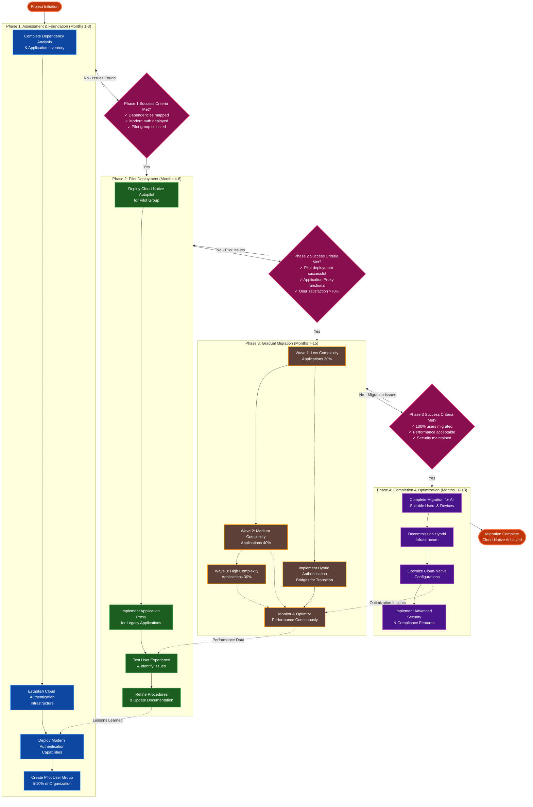
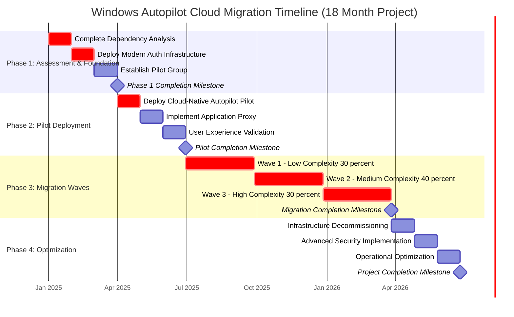
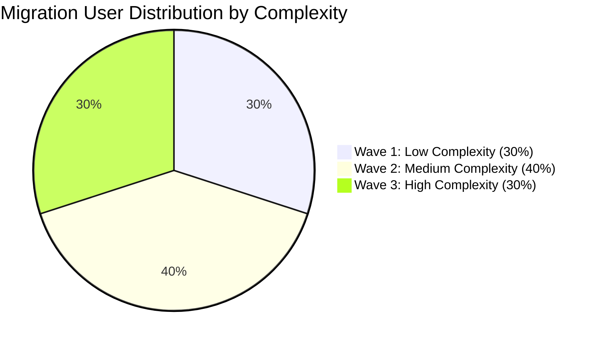
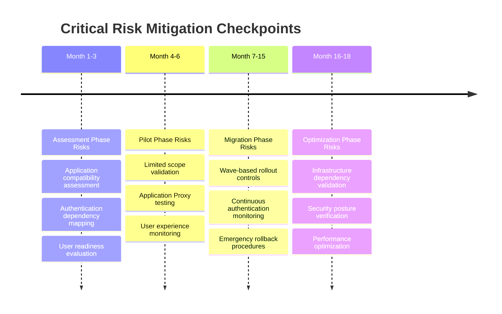
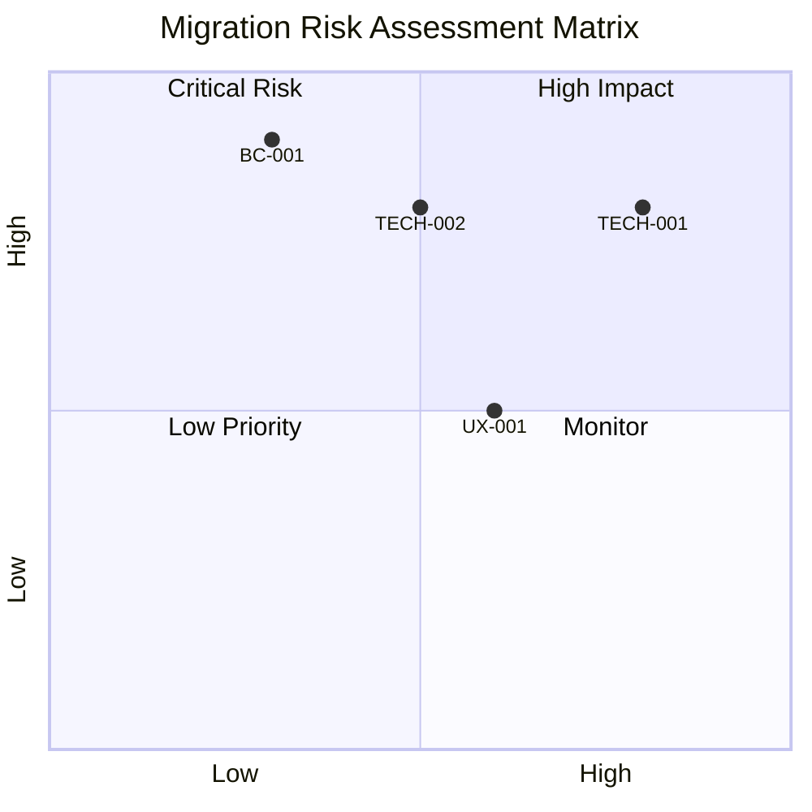
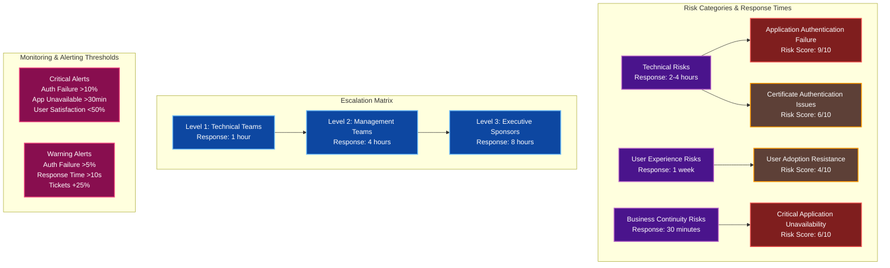
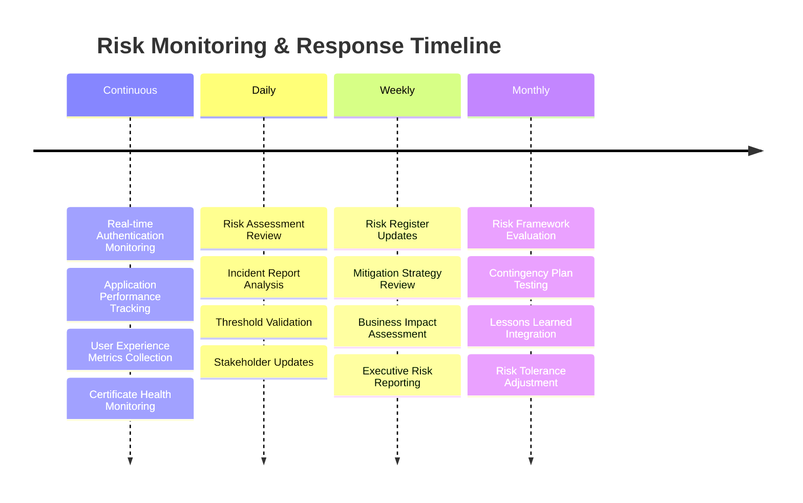
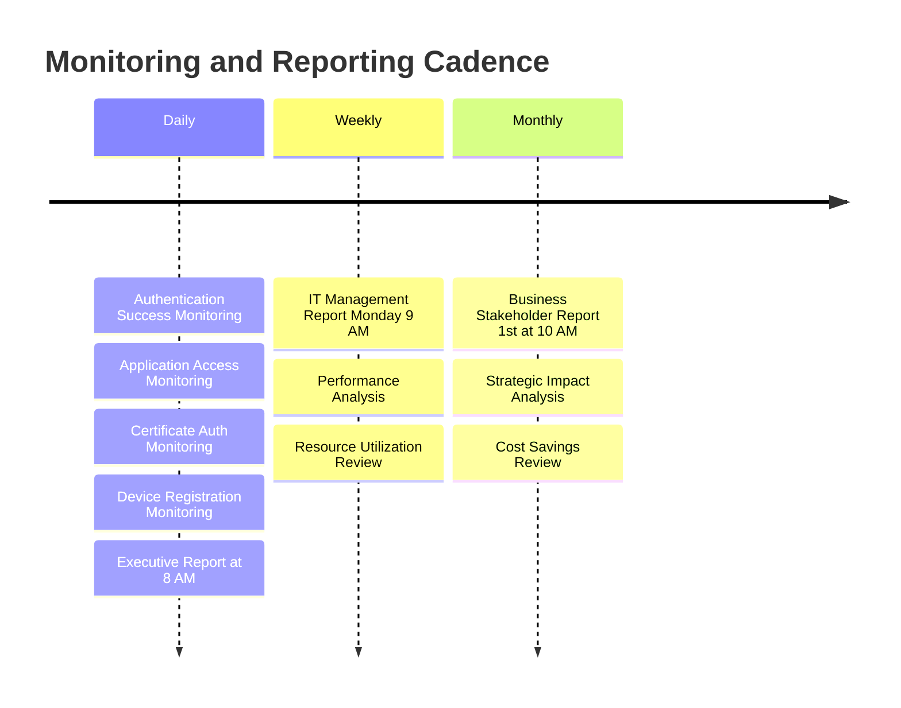
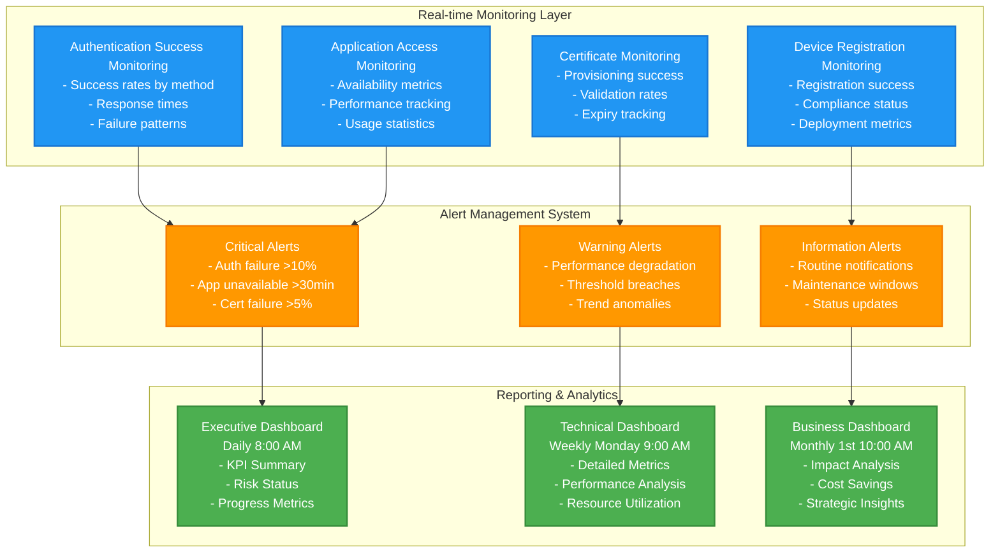
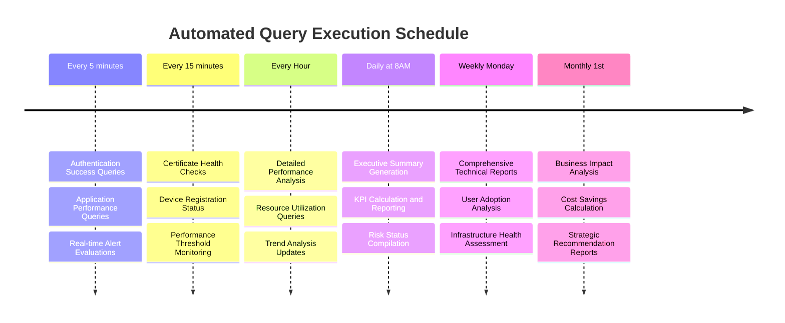

# Microsoft Autopilot Cloud Migration Framework (2025)
## From Hybrid Azure AD Join to Cloud-Native Deployment

## Metadata
- **Document Type**: Strategic Migration Framework
- **Version**: 2.0.0
- **Last Updated**: 2025-08-27
- **Target Audience**: Enterprise Architects, Identity Architects, IT Directors, Migration Teams
- **Scope**: Comprehensive migration strategy from hybrid to cloud-native Windows Autopilot deployments
- **Prerequisites**: Understanding of Windows Autopilot, Azure AD/Entra ID, and on-premises Active Directory

## Executive Summary

Organizations implementing Windows Autopilot hybrid Azure AD join face increasing pressure to migrate to cloud-native solutions as Microsoft deprecates hybrid-specific features and prioritizes cloud-first architectures. This framework provides a strategic approach to migration, with detailed technical analyses available in companion documents.

**Strategic Context (2025):**
- Microsoft officially discourages hybrid Azure AD join for new deployments
- Legacy Intune Connector deprecation creates migration urgency (June 2025)
- Cloud-native security features outpace hybrid capabilities
- Operational complexity and support overhead favor cloud-first approaches

**Migration Complexity Factors:**

| Complexity Factor | Impact Level | Typical Timeline | Primary Challenge | Mitigation Strategy |
|-------------------|--------------|-----------------|-------------------|-------------------|
| **Authentication Dependencies** | High | 6-12 months | Enterprise applications rely on domain authentication | Modern authentication deployment, Application Proxy |
| **Legacy Protocol Requirements** | High | 9-18 months | NTLM, Kerberos, and integrated authentication challenges | Cloud Kerberos, FIDO2, certificate-based authentication |
| **File System Access** | Medium | 3-6 months | Network shares, DFS, and domain-based resource permissions | Azure Files, SharePoint Online, permission mapping |
| **Application Architecture** | Very High | 12-24 months | Deep integration with Active Directory schema and services | Application modernization, hybrid bridges, API integration |

## Document Structure

This framework is organized into the following components:

### Core Framework (This Document)
- Migration strategies and methodologies
- Implementation timelines and phases
- Risk management frameworks
- Success metrics and monitoring

### Technical Deep Dives (Companion Documents)
- **[Authentication Limitations and Solutions](authentication-limitations-solutions.md)** - Detailed authentication dependency analysis and solutions
- **[Application Limitations and Solutions](application-limitations-solutions.md)** - Application migration strategies and modernization approaches
- **[Cloud Authentication Solutions](cloud-authentication-solutions.md)** - Modern authentication implementation including Azure AD Application Proxy

## Migration Assessment Overview

### Key Assessment Areas

**Authentication Dependencies:**
- Domain authentication requirements
- Kerberos/NTLM usage patterns
- Certificate-based authentication needs
- Service account dependencies

**Application Dependencies:**
- Legacy application inventory
- Windows Integrated Authentication usage
- Database authentication methods
- File system access requirements

**Infrastructure Dependencies:**
- Domain controller connectivity
- VPN requirements
- Network resource access
- Print services integration

For detailed technical assessments, see:
- [Authentication Limitations Analysis](authentication-limitations-solutions.md#auth-001-domain-authentication-dependencies)
- [Application Dependency Framework](application-limitations-solutions.md#app-001-domain-joined-application-dependencies)

## Migration Strategies and Implementation Framework

### STRATEGY-001: Phased Migration Approach

#### Four-Phase Migration Strategy

**Migration Process Flow:**

**Phase Summary:**
- **Phase 1**: Foundation establishment with dependency mapping and modern authentication deployment
- **Phase 2**: Controlled pilot with 5-10% of users to validate approach and identify issues
- **Phase 3**: Wave-based migration (30% → 40% → 30%) with continuous monitoring and optimization
- **Phase 4**: Infrastructure consolidation and advanced feature implementation

#### Detailed Implementation Roadmap

**Migration Timeline Visualization:**

**Migration Wave Strategy Breakdown:**

**Phase Activities and Ownership:**

| Phase | Duration | Key Activities | Team Owner | Success Criteria |
|-------|----------|----------------|------------|------------------|
| **Phase 1: Assessment** | 3 months | Dependency analysis, Modern auth deployment, Pilot group setup | Enterprise Architecture, Identity, Change Management | All applications categorized, Modern auth tested, Pilot ready |
| **Phase 2: Pilot** | 3 months | Cloud-native Autopilot pilot, App Proxy implementation, UX validation | Device Management, Application, User Experience | Successful pilot completion, Legacy app access, User satisfaction |
| **Phase 3: Migration** | 9 months | Wave-based user migration (30% → 40% → 30%) | Migration Teams | 100% migration completion, No service degradation, Security maintained |
| **Phase 4: Optimization** | 3 months | Infrastructure retirement, Advanced security, Operations optimization | Infrastructure, Security, Operations | Cost reduction, Zero Trust, Efficiency improvement |

**Risk Mitigation Timeline:**

### STRATEGY-002: Risk Mitigation and Contingency Planning

#### Comprehensive Risk Management Framework

**Risk Assessment Matrix:**

**Risk Register and Mitigation Strategies:**

| Risk ID | Risk Name | Category | Probability | Impact | Score | Response Time | Responsible Party | Mitigation Strategy |
|---------|-----------|----------|-------------|---------|-------|---------------|-------------------|-------------------|
| **TECH-001** | Application Authentication Failure | Technical | High | High | 9 | 2 hours | Application Team | Application Proxy deployment, modern auth implementation, extensive pilot testing |
| **TECH-002** | Certificate-Based Authentication Issues | Technical | Medium | High | 6 | 4 hours | Security Team | Redundant Key Vault, automated monitoring, backup certificate authority |
| **UX-001** | User Adoption Resistance | User Experience | Medium | Medium | 4 | 1 week | Change Management | Comprehensive training, change champions, parallel authentication options |
| **BC-001** | Critical Application Unavailability | Business Continuity | Low | Critical | 6 | 30 minutes | Business Continuity Team | Emergency access procedures, VPN fallback, critical app prioritization |

**Risk Monitoring and Alert Thresholds:**

| Metric Category | Warning Threshold | Critical Threshold | Monitoring Frequency | Action Required |
|-----------------|-------------------|-------------------|---------------------|-----------------|
| **Authentication Success Rate** | <95% | <90% | Real-time | Immediate investigation and remediation |
| **Application Availability** | <99% | <95% | Real-time | Emergency access procedure activation |
| **User Satisfaction Score** | <70% | <60% | Weekly | Enhanced support and training deployment |
| **Help Desk Ticket Volume** | +25% increase | +50% increase | Daily | Additional support resources allocation |
| **Certificate Validation** | <98% | <95% | Real-time | Certificate infrastructure validation |

**Escalation and Response Framework:**

| Risk Score | Escalation Level | Response Team | Max Response Time | Authority Level |
|------------|------------------|---------------|-------------------|-----------------|
| **1-3 (Low)** | Level 1 | Technical Teams | 4 hours | Operational decisions |
| **4-6 (Medium)** | Level 2 | Management Teams | 2 hours | Resource allocation |
| **7-10 (High)** | Level 3 | Executive Sponsors | 1 hour | Strategic decisions and emergency authorization |

**Risk Management Framework Visualization:**

**Risk Monitoring Timeline:**

## Success Metrics and Monitoring

### Comprehensive Success Measurement Framework

#### Key Performance Indicators (KPIs)

**Technical KPIs:**
- Authentication success rate: Target to be defined based on baseline measurements
- Application availability: Target to be defined based on current SLA requirements
- Device deployment success rate: Target to be defined based on organizational standards
- Average authentication response time: Target to be defined based on user experience requirements
- Certificate provisioning success rate: Target to be defined based on reliability standards

**User Experience KPIs:**
- User satisfaction score: Target to be defined based on current satisfaction levels
- Help desk ticket reduction: Target to be defined based on current ticket volume
- Training completion rate: Target to be defined based on organizational learning standards
- Feature adoption rate: Target to be defined based on change management objectives

**Business KPIs:**
- Infrastructure cost reduction: Target to be defined based on current operational costs
- Security incident reduction: Target to be defined based on current security metrics
- Compliance audit findings: Target to be defined based on regulatory requirements
- IT operational efficiency: Target to be defined based on current operational metrics

### Monitoring and Reporting Implementation

**Monitoring and Reporting Schedule:**

**Monitoring Dashboard Architecture:**

**Monitoring Query Performance Schedule:**

## Conclusion and Strategic Recommendations

### Executive Summary for Decision Makers

**Strategic Imperative:** Organizations must develop comprehensive migration strategies from Windows Autopilot hybrid Azure AD join to cloud-native deployments to align with Microsoft's strategic direction, improve security posture, and reduce operational complexity.

**Key Findings:**
1. **Authentication Dependencies** represent the majority of migration complexity
2. **Modern Authentication Solutions** can address most legacy authentication requirements
3. **Phased Migration Approach** reduces risk while maintaining business continuity
4. **Total Cost of Ownership** can decrease significantly post-migration

**Critical Success Factors:**
- Executive sponsorship and organizational commitment
- Comprehensive dependency analysis and planning
- Modern authentication infrastructure deployment
- User experience focus and change management
- Continuous monitoring and optimization

### Technical Implementation Priorities

#### Immediate Actions (0-3 months)
1. **Deploy Modern Authentication Infrastructure**
   - Implement Windows Hello for Business with cloud trust
   - Configure FIDO2 security keys for passwordless authentication
   - Establish Azure AD certificate-based authentication

2. **Conduct Comprehensive Assessment**
   - Execute application dependency analysis scripts
   - Inventory authentication requirements and complexity
   - Identify critical applications requiring priority attention

3. **Establish Monitoring and Alerting**
   - Deploy comprehensive monitoring framework
   - Configure real-time alerts for authentication issues
   - Create executive dashboards for progress tracking

#### Short-term Implementation (3-12 months)
1. **Pilot Deployment Execution**
   - Deploy cloud-native Autopilot for pilot group (5-10%)
   - Implement Azure AD Application Proxy for legacy applications
   - Validate user experience and resolve initial issues

2. **Application Modernization**
   - Migrate high-value applications to modern authentication
   - Implement certificate-based authentication where required
   - Deploy hybrid authentication bridges for complex applications

3. **Gradual User Migration**
   - Execute wave-based migration strategy
   - Maintain parallel authentication systems during transition
   - Continuously optimize performance and user experience

#### Long-term Optimization (12-24 months)
1. **Complete Migration Execution**
   - Migrate all suitable users to cloud-native Autopilot
   - Decommission legacy hybrid infrastructure
   - Optimize cloud-native configurations for performance

2. **Advanced Security Implementation**
   - Implement Zero Trust security model
   - Deploy advanced conditional access policies
   - Enhance threat protection and compliance posture

3. **Operational Excellence Achievement**
   - Establish cloud-native operational procedures
   - Implement continuous improvement processes
   - Measure and optimize total cost of ownership

---

## Cross-References

### Supporting Technical Documentation
- **[Authentication Limitations and Solutions](authentication-limitations-solutions.md)** - Detailed authentication dependency analysis and migration solutions
- **[Application Limitations and Solutions](application-limitations-solutions.md)** - Application migration strategies and modernization approaches
- **[Cloud Authentication Solutions](cloud-authentication-solutions.md)** - Modern authentication implementation including Azure AD Application Proxy

### Related Autopilot Documentation
- **[Complete Setup Guide](../setup-guides/Microsoft-Autopilot-Complete-Setup-Guide-2025.md)** - Complete setup and configuration procedures
- **[Administrator Quick Reference](../quick-reference/Microsoft-Autopilot-Administrator-Cheat-Sheet-2025.md)** - Daily administration and troubleshooting reference
- **[Hybrid Deployment Limitations](../limitations-and-solutions/Microsoft-Autopilot-Hybrid-Deployment-Limitations-2025.md)** - Hybrid join specific limitations and workarounds

### Microsoft Strategic Resources
- **[Microsoft 365 Roadmap](https://www.microsoft.com/microsoft-365/roadmap)** - Future feature announcements and deprecation timelines
- **[Microsoft Entra What's New](https://learn.microsoft.com/azure/active-directory/fundamentals/whats-new)** - Latest identity and authentication service updates
- **[Windows Autopilot Documentation](https://learn.microsoft.com/autopilot/)** - Official Microsoft documentation and guidance

### External Resources
- **[Microsoft Tech Community - Intune Forum](https://techcommunity.microsoft.com/t5/microsoft-intune/ct-p/Microsoft-Intune)** - Community support and discussions
- **[Microsoft Security Compliance Toolkit](https://www.microsoft.com/download/details.aspx?id=55319)** - Additional security hardening guidance

### Industry Best Practices
- **[Zero Trust Architecture Guide](https://www.nist.gov/publications/zero-trust-architecture)** - NIST 800-207 implementation guidance
- **[CISA Zero Trust Maturity Model v2.0](https://www.cisa.gov/sites/default/files/2023-04/CISA_Zero_Trust_Maturity_Model_Version_2_508c.pdf)** - Identity pillar framework for IAM evolution
- **[Cloud Migration Best Practices](https://learn.microsoft.com/azure/cloud-adoption-framework/)** - Microsoft Cloud Adoption Framework

---

*This migration framework provides comprehensive guidance for organizations transitioning from Windows Autopilot hybrid Azure AD join to cloud-native deployments. For detailed technical implementation guidance, refer to the companion documents listed above.*
