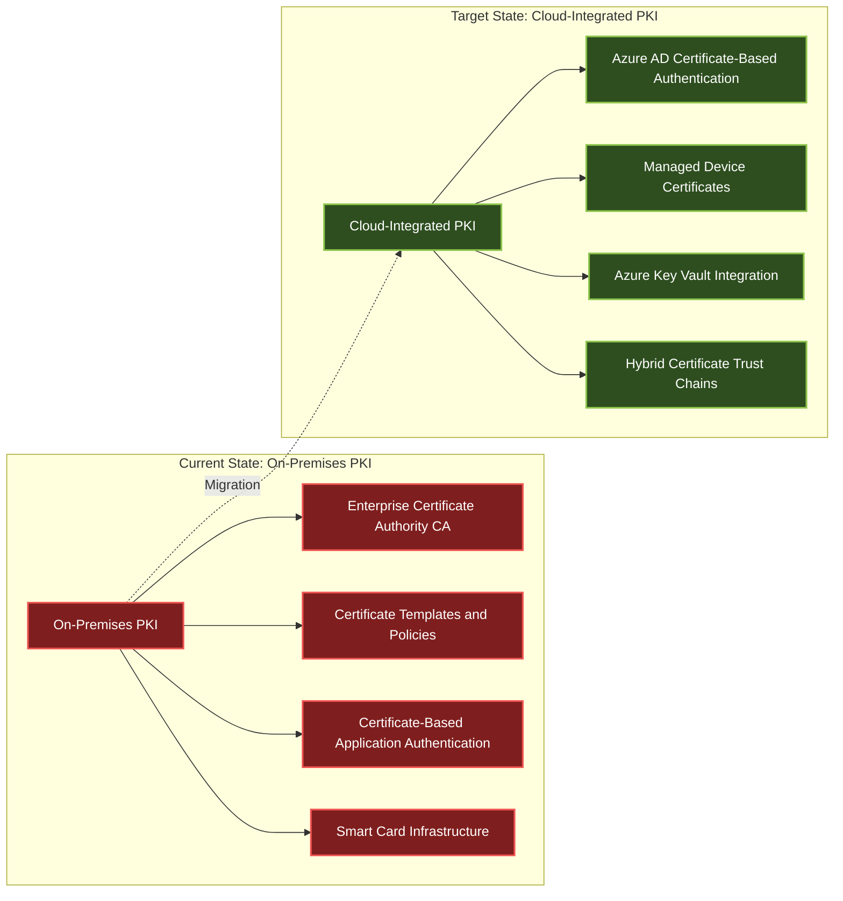
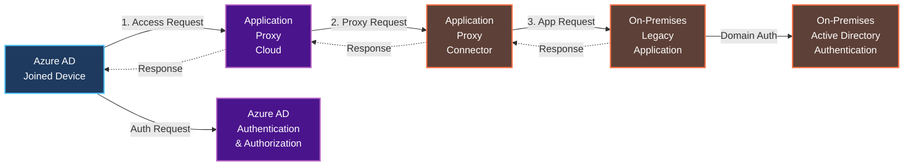

# Microsoft Autopilot Cloud Migration Framework (2025)
## From Hybrid Azure AD Join to Cloud-Native Deployment

## Metadata
- **Document Type**: Strategic Migration Framework
- **Version**: 1.0.0
- **Last Updated**: 2025-08-27
- **Target Audience**: Enterprise Architects, Identity Architects, IT Directors, Migration Teams
- **Scope**: Comprehensive migration strategy from hybrid to cloud-native Windows Autopilot deployments
- **Prerequisites**: Understanding of Windows Autopilot, Azure AD/Entra ID, and on-premises Active Directory

## Executive Summary

Organizations implementing Windows Autopilot hybrid Azure AD join face increasing pressure to migrate to cloud-native solutions as Microsoft deprecates hybrid-specific features and prioritizes cloud-first architectures. This framework provides detailed analysis of authentication and application barriers that may prevent successful cloud-only deployments, along with advanced solutions including Cloud Kerberos, certificate-based authentication, and modern identity technologies.

**Strategic Context (2025):**
- Microsoft officially discourages hybrid Azure AD join for new deployments
- Legacy Intune Connector deprecation creates migration urgency (June 2025)
- Cloud-native security features outpace hybrid capabilities
- Operational complexity and support overhead favor cloud-first approaches

**Migration Complexity Factors:**
- **Authentication Dependencies**: Many enterprise applications rely on domain authentication
- **Legacy Protocol Requirements**: NTLM, Kerberos, and integrated authentication challenges
- **File System Access**: Network shares, DFS, and domain-based resource permissions
- **Application Architecture**: Deep integration with Active Directory schema and services

## Authentication Limitations Analysis

### AUTH-001: Domain Authentication Dependencies

#### Current State Assessment
Many enterprise environments have developed over decades with deep Active Directory integration, creating complex authentication dependency webs that can prevent immediate cloud-only adoption.

**Primary Authentication Challenges:**

```mermaid
graph TB
    Root[Domain Authentication Dependency Categories]
    
    %% Windows Integrated Authentication Branch
    WIA[Windows Integrated Authentication<br/>Negotiate/NTLM]
    SharePoint[SharePoint On-Premises<br/>Common in enterprises]
    Exchange[Exchange On-Premises<br/>Common in enterprises]
    LOB[Line-of-Business Applications<br/>Common in enterprises]
    FileShares[Network File Shares<br/>Very common in enterprises]
    
    %% Service Account Dependencies Branch
    ServiceAcct[Service Account Dependencies]
    SQL[SQL Server Service Accounts<br/>Common in enterprises]
    AppPool[Application Pool Identities<br/>Common in enterprises]
    Tasks[Scheduled Task Service Accounts<br/>Common in enterprises]
    Background[Background Service Authentication<br/>Common in enterprises]
    
    %% Certificate-Based Authentication Branch
    CertAuth[Certificate-Based Authentication]
    CA[Internal CA Infrastructure<br/>Used in many enterprises]
    SmartCard[Smart Card Authentication<br/>Used in some enterprises]
    DeviceCerts[Device Certificates<br/>Common in enterprises]
    UserCerts[User Certificates for Applications<br/>Used in some enterprises]
    
    %% Define relationships
    Root --> WIA
    Root --> ServiceAcct
    Root --> CertAuth
    
    WIA --> SharePoint
    WIA --> Exchange
    WIA --> LOB
    WIA --> FileShares
    
    ServiceAcct --> SQL
    ServiceAcct --> AppPool
    ServiceAcct --> Tasks
    ServiceAcct --> Background
    
    CertAuth --> CA
    CertAuth --> SmartCard
    CertAuth --> DeviceCerts
    CertAuth --> UserCerts
    
    %% Styling for dark mode
    classDef root fill:#4a148c,stroke:#ba68c8,stroke-width:3px,color:#ffffff
    classDef primary fill:#1e3a5f,stroke:#4fc3f7,stroke-width:2px,color:#ffffff
    classDef detail fill:#2e4e1f,stroke:#8bc34a,stroke-width:1px,color:#ffffff
    
    class Root root
    class WIA,ServiceAcct,CertAuth primary
    class SharePoint,Exchange,LOB,FileShares,SQL,AppPool,Tasks,Background,CA,SmartCard,DeviceCerts,UserCerts detail
```



#### Technical Impact Analysis
```powershell
<#
.SYNOPSIS
Authentication dependency discovery script for migration planning

.DESCRIPTION
Analyzes current environment authentication dependencies to assess
cloud migration readiness and identify remediation requirements
#>

# Discover domain authentication dependencies
function Get-AuthenticationDependencies {
    $dependencies = @{
        KerberosServices = @()
        NTLMApplications = @()
        CertificateRequirements = @()
        ServiceAccounts = @()
        FileShareAccess = @()
    }
    
    # Analyze Kerberos Service Principal Names
    $spns = Get-ADObject -Filter {servicePrincipalName -like "*"} -Properties servicePrincipalName
    foreach ($spn in $spns) {
        $dependencies.KerberosServices += @{
            Object = $spn.Name
            SPNs = $spn.servicePrincipalName
            MigrationComplexity = "High"
            CloudSolution = "Azure AD Application Proxy / Modern Auth"
        }
    }
    
    # Discover NTLM authentication usage
    $ntlmEvents = Get-WinEvent -FilterHashtable @{LogName='Security'; ID=4624} -MaxEvents 1000 |
        Where-Object {$_.Message -like "*NTLM*"}
    
    foreach ($event in $ntlmEvents) {
        $dependencies.NTLMApplications += @{
            Source = $event.Properties[18].Value
            Target = $event.Properties[5].Value
            Timestamp = $event.TimeCreated
            Remediation = "Modern Authentication Migration Required"
        }
    }
    
    # Certificate infrastructure analysis
    $certificates = Get-ChildItem -Path "Cert:\LocalMachine\My" | 
        Where-Object {$_.Issuer -notlike "*Microsoft*" -and $_.Issuer -notlike "*VeriSign*"}
    
    foreach ($cert in $certificates) {
        $dependencies.CertificateRequirements += @{
            Subject = $cert.Subject
            Issuer = $cert.Issuer
            Purpose = $cert.EnhancedKeyUsageList.FriendlyName
            CloudMigration = "Azure AD Certificate-Based Authentication"
        }
    }
    
    return $dependencies
}

# Execute dependency analysis
$migrationAnalysis = Get-AuthenticationDependencies
$migrationAnalysis | ConvertTo-Json -Depth 4 | Out-File "C:\Temp\AuthenticationDependencyAnalysis.json"
```

### AUTH-002: Kerberos Authentication Challenges

#### Legacy Kerberos Dependencies
Traditional Kerberos authentication creates significant cloud migration barriers due to its tight integration with Active Directory domains and on-premises infrastructure.

**Kerberos Dependency Matrix:**
| Service Type | Domain Dependency | Cloud Solution | Migration Complexity |
|--------------|------------------|----------------|---------------------|
| File Shares (SMB) | High | Azure Files + Azure AD DS | Medium |
| SQL Server | High | Azure SQL + Managed Identity | High |
| Web Applications | Medium | Azure AD App Proxy | Medium |
| Print Services | High | Universal Print | Low |
| Exchange | High | Exchange Online | Low |
| SharePoint | High | SharePoint Online | Low |

**Advanced Kerberos Migration Solutions:**

#### Solution 1: Cloud Kerberos (Windows Hello for Business)
```xml
<!-- Windows Hello for Business Configuration for Cloud Kerberos -->
<Configuration>
    <WindowsHelloForBusiness>
        <UseCloudTrustForOnPremisesAuthentication>true</UseCloudTrustForOnPremisesAuthentication>
        <UseKeyTrustForOnPremisesAuthentication>false</UseKeyTrustForOnPremisesAuthentication>
        <UseCertificateForOnPremisesAuthentication>false</UseCertificateForOnPremisesAuthentication>
        <PolicySettings>
            <RequireSecurityDevice>true</RequireSecurityDevice>
            <EnablePINRecovery>true</EnablePINRecovery>
            <UseBiometrics>true</UseBiometrics>
        </PolicySettings>
        <CloudTrustConfiguration>
            <AzureADTenantId>your-tenant-id</AzureADTenantId>
            <OnPremisesDirectoryIntegration>AzureADConnect</OnPremisesDirectoryIntegration>
            <CertificateBasedAuthentication>
                <Enable>true</Enable>
                <RequireSmartCard>false</RequireSmartCard>
            </CertificateBasedAuthentication>
        </CloudTrustConfiguration>
    </WindowsHelloForBusiness>
</Configuration>
```

#### Solution 2: FIDO2 Security Keys for Hybrid Authentication
```powershell
# Configure FIDO2 security keys for on-premises resource access
$fido2Policy = @{
    DisplayName = "FIDO2 Security Keys for Hybrid Access"
    AuthenticationMethodPolicy = @{
        FIDO2 = @{
            IsEnabled = $true
            IsSelfServiceRegistrationAllowed = $true
            EnforceAttestationForRegistration = $true
            KeyRestrictions = @{
                EnforceKeyRestrictions = $true
                RestrictedKeys = @()
                AllowedKeys = @(
                    @{
                        Manufacturer = "Yubico"
                        Models = @("Security Key", "YubiKey 5")
                    }
                )
            }
        }
    }
    HybridConfiguration = @{
        OnPremisesAccess = $true
        KerberosInteroperability = $true
        SmartCardFallback = $false
    }
}

# Apply FIDO2 configuration via Microsoft Graph
New-MgPolicyAuthenticationMethodPolicy -BodyParameter $fido2Policy
```

### AUTH-003: Certificate-Based Authentication Requirements

#### Enterprise Certificate Infrastructure Migration

Organizations with mature Public Key Infrastructure (PKI) face complex migration challenges when moving to cloud-native authentication while maintaining security standards.

**Certificate Authentication Migration Strategy:**



#### Advanced Certificate Migration Solutions

**Solution 1: Azure AD Certificate-Based Authentication**
```powershell
<#
.SYNOPSIS
Configure Azure AD Certificate-Based Authentication for cloud migration

.DESCRIPTION
Establishes certificate-based authentication in Azure AD while maintaining
compatibility with on-premises certificate infrastructure
#>

# Configure Certificate-Based Authentication in Azure AD
$certAuthConfig = @{
    CertificateAuthorities = @(
        @{
            Certificate = [Convert]::ToBase64String([System.IO.File]::ReadAllBytes("C:\Certs\RootCA.cer"))
            IsRootAuthority = $true
            RevocationCheck = "enabled"
            DeltaCRLLocationURL = "http://crl.company.com/RootCA.crl"
        },
        @{
            Certificate = [Convert]::ToBase64String([System.IO.File]::ReadAllBytes("C:\Certs\IssuingCA.cer"))
            IsRootAuthority = $false
            RevocationCheck = "enabled"
            DeltaCRLLocationURL = "http://crl.company.com/IssuingCA.crl"
        }
    )
    CertificateUserBinding = @{
        UserAttributeMapping = "PrincipalName"
        TrustedIssuers = @("CN=Company Issuing CA, DC=company, DC=com")
        RevocationCheckEnabled = $true
    }
}

# Apply certificate-based authentication configuration
Update-MgOrganizationCertificateBasedAuthConfiguration -BodyParameter $certAuthConfig

# Configure conditional access for certificate authentication
$certCAPolicy = @{
    displayName = "Certificate-Based Authentication Required"
    conditions = @{
        users = @{
            includeUsers = @("All")
            excludeUsers = @()
        }
        applications = @{
            includeApplications = @("All")
        }
        clientAppTypes = @("exchangeActiveSync", "browser", "mobileAppsAndDesktopClients")
    }
    grantControls = @{
        operator = "OR"
        builtInControls = @("certificateBasedAuthentication")
        customAuthenticationFactors = @()
    }
}

New-MgIdentityConditionalAccessPolicy -BodyParameter $certCAPolicy
```

**Solution 2: Hybrid Certificate Trust and Azure Key Vault Integration**
```json
{
  "certificateTrustConfiguration": {
    "hybridTrustModel": {
      "onPremisesCertificateAuthority": {
        "rootCA": "CN=Company Root CA",
        "issuingCAs": [
          "CN=Company Issuing CA 1",
          "CN=Company Issuing CA 2"
        ],
        "crlDistributionPoints": [
          "http://crl.company.com/CompanyRootCA.crl",
          "http://crl.company.com/CompanyIssuingCA.crl"
        ]
      },
      "azureKeyVaultIntegration": {
        "keyVaultName": "company-pki-keyvault",
        "certificateManagement": "automated",
        "keyRotationPolicy": "annual",
        "hsm": "enabled"
      },
      "crossPlatformSupport": {
        "windowsDevices": true,
        "macDevices": true,
        "iosDevices": true,
        "androidDevices": true
      }
    }
  }
}
```

## Application Limitations Analysis

### APP-001: Domain-Joined Application Dependencies

#### Legacy Application Authentication Patterns
Enterprise applications developed over decades often have dependencies on Active Directory domain services that can complicate cloud migration.

**Application Dependency Categories:**

```mermaid
graph TB
    Root[Domain-Dependent Applications]
    
    %% Authentication Dependencies
    AuthDep[Authentication Dependencies]
    IWA[Windows Integrated Authentication IWA]
    Kerberos[NTLM/Kerberos Protocol Dependencies]
    ADGroups[Active Directory Group Membership Queries]
    ServiceImp[Service Account Impersonation]
    
    %% Authorization Dependencies
    AuthzDep[Authorization Dependencies]
    ADAccess[Active Directory Group-Based Access Control]
    SDDL[Security Descriptor Definition Language SDDL]
    ACLs[Access Control Lists ACLs on Network Resources]
    RBAC[Role-Based Access Control RBAC via AD Groups]
    
    %% Data Access Dependencies
    DataDep[Data Access Dependencies]
    SQLAuth[SQL Server Windows Authentication]
    OracleAuth[Oracle Kerberos Authentication]
    FileAccess[File Share Access via Domain Credentials]
    DBStrings[Database Connection Strings with Integrated Security]
    
    %% Service Dependencies
    ServiceDep[Service Dependencies]
    DCOM[Distributed COM DCOM Authentication]
    WinService[Windows Service Account Dependencies]
    MSMQ[Message Queuing MSMQ Security]
    WCF[WCF Service Authentication]
    
    %% Define relationships
    Root --> AuthDep
    Root --> AuthzDep
    Root --> DataDep
    Root --> ServiceDep
    
    AuthDep --> IWA
    AuthDep --> Kerberos
    AuthDep --> ADGroups
    AuthDep --> ServiceImp
    
    AuthzDep --> ADAccess
    AuthzDep --> SDDL
    AuthzDep --> ACLs
    AuthzDep --> RBAC
    
    DataDep --> SQLAuth
    DataDep --> OracleAuth
    DataDep --> FileAccess
    DataDep --> DBStrings
    
    ServiceDep --> DCOM
    ServiceDep --> WinService
    ServiceDep --> MSMQ
    ServiceDep --> WCF
    
    %% Styling for dark mode
    classDef root fill:#4a148c,stroke:#ba68c8,stroke-width:3px,color:#ffffff
    classDef primary fill:#1e3a5f,stroke:#4fc3f7,stroke-width:2px,color:#ffffff
    classDef detail fill:#7f1e1e,stroke:#ef5350,stroke-width:1px,color:#ffffff
    
    class Root root
    class AuthDep,AuthzDep,DataDep,ServiceDep primary
    class IWA,Kerberos,ADGroups,ServiceImp,ADAccess,SDDL,ACLs,RBAC,SQLAuth,OracleAuth,FileAccess,DBStrings,DCOM,WinService,MSMQ,WCF detail
```



#### Application Migration Assessment Framework
```powershell
<#
.SYNOPSIS
Comprehensive application dependency assessment for cloud migration

.DESCRIPTION
Analyzes applications for domain dependencies and provides migration
complexity scoring with recommended cloud alternatives
#>

function Get-ApplicationDependencyAnalysis {
    param(
        [string[]]$ApplicationServers = @(),
        [string]$OutputPath = "C:\Temp\ApplicationAnalysis.json"
    )
    
    $analysis = @{
        Applications = @()
        OverallMigrationComplexity = "Unknown"
        RecommendedMigrationApproach = "Phased"
        EstimatedTimeframe = "12-18 months"
    }
    
    foreach ($server in $ApplicationServers) {
        Write-Output "Analyzing server: $server"
        
        # Analyze IIS applications
        $iisApps = Invoke-Command -ComputerName $server -ScriptBlock {
            Import-Module WebAdministration -ErrorAction SilentlyContinue
            if (Get-Module WebAdministration) {
                Get-WebApplication | ForEach-Object {
                    $appPool = Get-IISAppPool $_.ApplicationPool
                    @{
                        Name = $_.Path
                        ApplicationPool = $_.ApplicationPool
                        ProcessModel = $appPool.ProcessModel
                        Authentication = (Get-WebConfiguration -Filter "system.webServer/security/authentication/*" -PSPath $_.PSPath)
                        ConnectionStrings = (Get-WebConfiguration -Filter "connectionStrings" -PSPath $_.PSPath)
                    }
                }
            }
        }
        
        foreach ($app in $iisApps) {
            $migrationComplexity = "Low"
            $cloudSolutions = @()
            $blockers = @()
            
            # Analyze authentication methods
            if ($app.Authentication.windowsAuthentication.enabled -eq $true) {
                $migrationComplexity = "High"
                $blockers += "Windows Integrated Authentication"
                $cloudSolutions += "Azure AD Application Proxy with Pre-Authentication"
            }
            
            # Analyze connection strings for integrated security
            $app.ConnectionStrings.connectionStrings | ForEach-Object {
                if ($_.connectionString -like "*Integrated Security=true*" -or 
                    $_.connectionString -like "*Trusted_Connection=yes*") {
                    $migrationComplexity = "High"
                    $blockers += "Database Integrated Security"
                    $cloudSolutions += "Azure SQL Managed Identity or Certificate Authentication"
                }
            }
            
            # Analyze application pool identity
            if ($app.ProcessModel.identityType -eq "SpecificUser") {
                $migrationComplexity = if ($migrationComplexity -eq "Low") {"Medium"} else {$migrationComplexity}
                $blockers += "Service Account Dependencies"
                $cloudSolutions += "Azure AD Managed Identity"
            }
            
            $analysis.Applications += @{
                Server = $server
                ApplicationName = $app.Name
                MigrationComplexity = $migrationComplexity
                Blockers = $blockers
                CloudSolutions = $cloudSolutions
                EstimatedEffort = switch ($migrationComplexity) {
                    "Low" { "1-2 months" }
                    "Medium" { "3-6 months" }
                    "High" { "6-12 months" }
                }
            }
        }
        
        # Analyze Windows Services with domain dependencies
        $services = Invoke-Command -ComputerName $server -ScriptBlock {
            Get-CimInstance -ClassName Win32_Service | Where-Object {
                $_.StartName -like "*\*" -and $_.StartName -notlike "NT*" -and $_.StartName -ne "LocalSystem"
            } | Select-Object Name, StartName, State, Description
        }
        
        foreach ($service in $services) {
            $analysis.Applications += @{
                Server = $server
                ApplicationName = "$($service.Name) (Windows Service)"
                MigrationComplexity = "Medium"
                Blockers = @("Service Account Authentication")
                CloudSolutions = @("Azure AD Managed Identity", "Certificate-Based Service Authentication")
                EstimatedEffort = "2-4 months"
            }
        }
    }
    
    # Calculate overall migration complexity
    $highComplexityCount = ($analysis.Applications | Where-Object {$_.MigrationComplexity -eq "High"}).Count
    $mediumComplexityCount = ($analysis.Applications | Where-Object {$_.MigrationComplexity -eq "Medium"}).Count
    $totalCount = $analysis.Applications.Count
    
    if ($highComplexityCount / $totalCount -gt 0.3) {
        $analysis.OverallMigrationComplexity = "Very High"
        $analysis.EstimatedTimeframe = "18-36 months"
    } elseif ($highComplexityCount / $totalCount -gt 0.1) {
        $analysis.OverallMigrationComplexity = "High"
        $analysis.EstimatedTimeframe = "12-24 months"
    } elseif ($mediumComplexityCount / $totalCount -gt 0.5) {
        $analysis.OverallMigrationComplexity = "Medium"
        $analysis.EstimatedTimeframe = "6-12 months"
    } else {
        $analysis.OverallMigrationComplexity = "Low"
        $analysis.EstimatedTimeframe = "3-6 months"
    }
    
    # Export analysis
    $analysis | ConvertTo-Json -Depth 5 | Out-File $OutputPath
    return $analysis
}

# Execute comprehensive application analysis
$applicationServers = @("APP01", "APP02", "WEB01", "WEB02", "SQL01")
$migrationAnalysis = Get-ApplicationDependencyAnalysis -ApplicationServers $applicationServers
```

### APP-002: File System and Network Resource Access

#### Network Resource Dependencies
File shares, distributed file systems, and network-attached storage can present significant migration challenges due to their integration with domain authentication.

**Network Resource Migration Strategy:**

```mermaid
flowchart TB
    subgraph "Current State: On-Premises File Services"
        CurrentFS[On-Premises File Services]
        
        %% Windows File Shares
        WinShares[Windows File Shares SMB/CIFS]
        NTFSPerms[NTFS Permissions with Domain Groups]
        SharePerms[Share Permissions with Domain Users]
        ABE[Access Based Enumeration ABE]
        
        %% DFS
        DFS[Distributed File System DFS]
        DFSNamespaces[DFS Namespaces]
        DFSReplication[DFS Replication]
        ReferralAccess[Referral-based Access Control]
        
        %% NAS
        NAS[Network Attached Storage NAS]
        ADIntegration[Active Directory Integration]
        KerberosAuth[Kerberos Authentication]
        GroupAccess[Group-based Access Control]
        
        %% Print Services
        PrintSvc[Print Services]
        ADPrinters[Active Directory Published Printers]
        GPPrinter[Group Policy Printer Deployment]
        DriverMgmt[Driver Package Management]
        
        CurrentFS --> WinShares
        CurrentFS --> DFS
        CurrentFS --> NAS
        CurrentFS --> PrintSvc
        
        WinShares --> NTFSPerms
        WinShares --> SharePerms
        WinShares --> ABE
        
        DFS --> DFSNamespaces
        DFS --> DFSReplication
        DFS --> ReferralAccess
        
        NAS --> ADIntegration
        NAS --> KerberosAuth
        NAS --> GroupAccess
        
        PrintSvc --> ADPrinters
        PrintSvc --> GPPrinter
        PrintSvc --> DriverMgmt
    end
    
    subgraph "Target State: Cloud-Integrated File Services"
        TargetFS[Cloud-Integrated File Services]
        AzureFiles[Azure Files with Azure AD DS Integration]
        SharePointOnline[SharePoint Online Document Libraries]
        OneDriveSync[OneDrive for Business Sync Libraries]
        UniversalPrint[Universal Print Service]
        
        TargetFS --> AzureFiles
        TargetFS --> SharePointOnline
        TargetFS --> OneDriveSync
        TargetFS --> UniversalPrint
    end
    
    %% Migration arrows
    CurrentFS -.->|Migration| TargetFS
    
    %% Styling for dark mode
    classDef current fill:#5d4037,stroke:#ff7043,stroke-width:2px,color:#ffffff
    classDef target fill:#2e4e1f,stroke:#8bc34a,stroke-width:2px,color:#ffffff
    classDef detail fill:#7f1e1e,stroke:#ef5350,stroke-width:1px,color:#ffffff
    
    class CurrentFS,WinShares,DFS,NAS,PrintSvc current
    class TargetFS,AzureFiles,SharePointOnline,OneDriveSync,UniversalPrint target
    class NTFSPerms,SharePerms,ABE,DFSNamespaces,DFSReplication,ReferralAccess,ADIntegration,KerberosAuth,GroupAccess,ADPrinters,GPPrinter,DriverMgmt detail
```



#### Advanced File Services Migration Solutions

**Solution 1: Azure Files with Azure AD Domain Services**
```powershell
<#
.SYNOPSIS
Configure Azure Files with Azure AD Domain Services for seamless domain authentication

.DESCRIPTION
Implements Azure Files integration with Azure AD DS to maintain domain-based
authentication while migrating to cloud storage infrastructure
#>

# Configure Azure AD Domain Services for file share authentication
$azureADDSConfig = @{
    DomainName = "company.com"
    ReplicaSetConfig = @{
        Location = "Australia East"
        SubnetId = "/subscriptions/{subscription-id}/resourceGroups/network-rg/providers/Microsoft.Network/virtualNetworks/company-vnet/subnets/aadds-subnet"
    }
    LdapsSettings = @{
        Ldaps = "Enabled"
        PfxCertificate = "base64-encoded-certificate"
        PfxCertificatePassword = "certificate-password"
    }
    NotificationSettings = @{
        AdditionalRecipients = @("admin@company.com", "security@company.com")
        NotifyDcAdmins = "Enabled"
        NotifyGlobalAdmins = "Enabled"
    }
}

# Create Azure AD Domain Services instance
New-AzResource -ResourceType "Microsoft.AAD/DomainServices" -ResourceName "company-aadds" `
    -ResourceGroupName "identity-rg" -Properties $azureADDSConfig -Location "Australia East"

# Configure Azure Files storage account with AD DS authentication
$storageAccountConfig = @{
    StorageAccountName = "companyfilesaadds"
    ResourceGroupName = "storage-rg"
    Location = "East US"
    SkuName = "Premium_LRS"
    Kind = "FileStorage"
    AzureADDSConfiguration = @{
        DomainName = "company.com"
        DomainGuid = "domain-guid"
        ForestName = "company.com"
        NetBiosDomainName = "COMPANY"
        AzureStorageSid = "storage-account-sid"
    }
}

# Enable Azure AD DS authentication for Azure Files
Set-AzStorageAccount -ResourceGroupName $storageAccountConfig.ResourceGroupName `
    -Name $storageAccountConfig.StorageAccountName `
    -EnableAzureActiveDirectoryDomainServicesForFile $true
```

**Solution 2: SharePoint Online Migration with Hybrid Search**
```powershell
# SharePoint Online migration with on-premises integration
$sharePointMigration = @{
    SourceFileShares = @(
        @{
            Path = "\\fileserver01\departments"
            TargetLibrary = "https://company.sharepoint.com/sites/departments/documents"
            MigrationMethod = "SharePoint Migration Tool"
            PreserveSecurity = $true
        },
        @{
            Path = "\\fileserver01\projects"  
            TargetLibrary = "https://company.sharepoint.com/sites/projects/documents"
            MigrationMethod = "Migration API"
            PreserveSecurity = $true
        }
    )
    HybridConfiguration = @{
        OnPremisesSearchIntegration = $true
        CloudHybridSearch = $true
        SearchServiceApplication = "Search Service Application"
        HybridConnectorUrl = "https://company-admin.sharepoint.com"
    }
    SecurityMapping = @{
        DomainGroupMapping = @{
            "COMPANY\Finance Team" = "Finance Team Members"
            "COMPANY\HR Department" = "Human Resources"
            "COMPANY\IT Administrators" = "IT Operations"
        }
        PermissionModel = "SharePoint Groups with Azure AD Integration"
        InheritanceModel = "Preserve NTFS Inheritance Where Possible"
    }
}

# Execute SharePoint migration with security preservation
foreach ($share in $sharePointMigration.SourceFileShares) {
    # Pre-migration security analysis
    $securityAnalysis = Get-FileShareSecurity -Path $share.Path
    
    # Create SharePoint security groups based on NTFS permissions
    foreach ($permission in $securityAnalysis.Permissions) {
        $groupName = "$($permission.PrincipalName) - Migrated"
        New-SPOSiteGroup -Site $share.TargetLibrary -Name $groupName -PermissionLevels $permission.Rights
    }
    
    # Execute migration with SPMT
    Start-SPMTMigration -SourcePath $share.Path -TargetPath $share.TargetLibrary -PreservePermissions $true
}
```

### APP-003: Database Authentication Dependencies

#### Database Authentication Migration Challenges
Enterprise databases often rely heavily on Windows Authentication, creating significant migration complexity when moving to cloud-native device management.

**Database Authentication Migration Matrix:**
| Database Platform | Current Authentication | Cloud Solution | Migration Complexity | Timeframe |
|-------------------|----------------------|----------------|---------------------|-----------|
| SQL Server | Windows Authentication | Azure AD Authentication | High | 6-12 months |
| Oracle | Kerberos Authentication | Certificate-Based Auth | Very High | 12-18 months |
| MySQL | Domain Plugin | Azure AD Integration | Medium | 3-6 months |
| PostgreSQL | GSSAPI/Kerberos | Azure AD Integration | Medium | 3-6 months |
| MongoDB | Kerberos | Azure AD Integration | High | 6-9 months |

#### Advanced Database Migration Solutions

**Solution 1: SQL Server to Azure SQL with Azure AD Authentication**
```sql
-- Configure Azure AD authentication for SQL Server migration
-- Step 1: Enable Azure AD authentication in Azure SQL Database
ALTER LOGIN [admin@company.com] FROM EXTERNAL PROVIDER;
ALTER SERVER ROLE sysadmin ADD MEMBER [admin@company.com];

-- Step 2: Create Azure AD-based database users
CREATE USER [Finance Team] FROM EXTERNAL PROVIDER;
CREATE USER [HR Department] FROM EXTERNAL PROVIDER; 
CREATE USER [IT Operations] FROM EXTERNAL PROVIDER;

-- Step 3: Grant permissions to Azure AD groups
ALTER ROLE db_datareader ADD MEMBER [Finance Team];
ALTER ROLE db_datawriter ADD MEMBER [Finance Team];
ALTER ROLE db_datareader ADD MEMBER [HR Department];

-- Step 4: Create managed identity for applications
CREATE USER [company-web-app] FROM EXTERNAL PROVIDER;
ALTER ROLE db_datareader ADD MEMBER [company-web-app];
ALTER ROLE db_datawriter ADD MEMBER [company-web-app];
```

**Solution 2: Hybrid Database Authentication Bridge**
```powershell
<#
.SYNOPSIS
Configure hybrid database authentication during migration period

.DESCRIPTION
Implements parallel authentication systems allowing gradual migration
from Windows Authentication to Azure AD authentication
#>

# Configure SQL Server for hybrid authentication
$hybridAuthConfig = @{
    SQLServerInstance = "SQL01\INSTANCE01"
    AzureADTenantId = "your-tenant-id"
    HybridConfiguration = @{
        WindowsAuthEnabled = $true
        AzureADAuthEnabled = $true
        MixedModeAuthentication = $true
        TransitionPeriod = "12 months"
    }
    UserMigrationMapping = @{
        "COMPANY\finance_service" = "finance-app@company.com"
        "COMPANY\hr_service" = "hr-app@company.com"
        "COMPANY\reporting_service" = "reporting-app@company.com"
    }
}

# Enable Azure AD authentication on SQL Server
Import-Module SqlServer
$connectionString = "Server=$($hybridAuthConfig.SQLServerInstance);Integrated Security=true;"

# Configure Azure AD authentication
Invoke-Sqlcmd -ConnectionString $connectionString -Query @"
-- Enable contained databases for Azure AD authentication
EXEC sp_configure 'contained database authentication', 1;
RECONFIGURE;

-- Create contained database users for Azure AD
USE [CompanyDatabase];
CREATE USER [finance-app@company.com] FROM EXTERNAL PROVIDER;
CREATE USER [hr-app@company.com] FROM EXTERNAL PROVIDER;
CREATE USER [reporting-app@company.com] FROM EXTERNAL PROVIDER;
"@

# Create parallel permission structure for gradual migration
foreach ($mapping in $hybridAuthConfig.UserMigrationMapping.GetEnumerator()) {
    $windowsUser = $mapping.Key
    $azureADUser = $mapping.Value
    
    # Get existing Windows user permissions
    $windowsPermissions = Invoke-Sqlcmd -ConnectionString $connectionString -Query @"
        SELECT 
            p.class_desc,
            p.permission_name,
            p.state_desc,
            s.name as securable_name
        FROM sys.database_permissions p
        INNER JOIN sys.objects s ON p.major_id = s.object_id
        INNER JOIN sys.database_principals dp ON p.grantee_principal_id = dp.principal_id
        WHERE dp.name = '$windowsUser'
    "@
    
    # Apply same permissions to Azure AD user
    foreach ($permission in $windowsPermissions) {
        $grantStatement = "$($permission.state_desc) $($permission.permission_name) ON $($permission.securable_name) TO [$azureADUser]"
        Invoke-Sqlcmd -ConnectionString $connectionString -Query $grantStatement
    }
}
```

## Cloud Authentication Solutions

### SOLUTION-001: Modern Authentication Architecture

#### Comprehensive Modern Authentication Framework

```mermaid
graph TB
    Root[Modern Authentication Stack for Cloud Migration]
    
    %% Primary Authentication Layer
    PrimaryAuth[Primary Authentication Layer]
    AADPassword[Azure AD Password Authentication]
    AADMFA[Azure AD Multi-Factor Authentication MFA]
    WHfB[Windows Hello for Business Passwordless]
    FIDO2[FIDO2 Security Keys]
    
    %% Single Sign-On Integration
    SSOIntegration[Single Sign-On SSO Integration]
    SeamlessSSO[Azure AD Seamless SSO]
    SAML[SAML 2.0 Federation]
    OIDC[OpenID Connect OIDC]
    OAuth[OAuth 2.0 Authorization]
    
    %% Conditional Access Controls
    ConditionalAccess[Conditional Access Controls]
    DeviceAccess[Device-Based Access Control]
    LocationAccess[Location-Based Access Control]
    RiskAccess[Risk-Based Access Control]
    AppAccess[Application-Based Access Control]
    
    %% Legacy Application Integration
    LegacyIntegration[Legacy Application Integration]
    AppProxy[Azure AD Application Proxy]
    CertAuth[Certificate-Based Authentication]
    KCD[Kerberos Constrained Delegation]
    NTLMPassThru[NTLM Pass-Through Authentication]
    
    %% Define relationships
    Root --> PrimaryAuth
    Root --> SSOIntegration
    Root --> ConditionalAccess
    Root --> LegacyIntegration
    
    PrimaryAuth --> AADPassword
    PrimaryAuth --> AADMFA
    PrimaryAuth --> WHfB
    PrimaryAuth --> FIDO2
    
    SSOIntegration --> SeamlessSSO
    SSOIntegration --> SAML
    SSOIntegration --> OIDC
    SSOIntegration --> OAuth
    
    ConditionalAccess --> DeviceAccess
    ConditionalAccess --> LocationAccess
    ConditionalAccess --> RiskAccess
    ConditionalAccess --> AppAccess
    
    LegacyIntegration --> AppProxy
    LegacyIntegration --> CertAuth
    LegacyIntegration --> KCD
    LegacyIntegration --> NTLMPassThru
    
    %% Styling for dark mode
    classDef root fill:#4a148c,stroke:#ba68c8,stroke-width:3px,color:#ffffff
    classDef primary fill:#1e3a5f,stroke:#4fc3f7,stroke-width:2px,color:#ffffff
    classDef auth fill:#2e4e1f,stroke:#8bc34a,stroke-width:1px,color:#ffffff
    classDef sso fill:#880e4f,stroke:#ec407a,stroke-width:1px,color:#ffffff
    classDef conditional fill:#5d4037,stroke:#ff7043,stroke-width:1px,color:#ffffff
    classDef legacy fill:#7f1e1e,stroke:#ef5350,stroke-width:1px,color:#ffffff
    
    class Root root
    class PrimaryAuth,SSOIntegration,ConditionalAccess,LegacyIntegration primary
    class AADPassword,AADMFA,WHfB,FIDO2 auth
    class SeamlessSSO,SAML,OIDC,OAuth sso
    class DeviceAccess,LocationAccess,RiskAccess,AppAccess conditional
    class AppProxy,CertAuth,KCD,NTLMPassThru legacy
```


#### Implementation: Comprehensive Modern Authentication Deployment
```powershell
<#
.SYNOPSIS
Deploy comprehensive modern authentication infrastructure

.DESCRIPTION
Implements complete modern authentication stack including passwordless authentication,
conditional access, and legacy application integration
#>

function Deploy-ModernAuthenticationFramework {
    param(
        [string]$TenantId,
        [string]$SubscriptionId,
        [hashtable]$OrganizationConfig
    )
    
    Write-Output "Deploying Modern Authentication Framework..."
    
    # Step 1: Configure Azure AD for modern authentication
    $azureADConfig = @{
        PasswordlessPolicies = @{
            WindowsHelloForBusiness = @{
                Enabled = $true
                RequireSecurityDevice = $true
                AllowBiometrics = $true
                PINComplexity = @{
                    MinimumLength = 6
                    MaximumLength = 127
                    RequireNumbers = $true
                    RequireLowercase = $false
                    RequireUppercase = $false
                    RequireSpecialCharacters = $false
                }
            }
            FIDO2SecurityKeys = @{
                Enabled = $true
                EnforceAttestation = $true
                RestrictedKeys = @()
                AllowedKeys = @(
                    @{Manufacturer = "Yubico"; Models = @("YubiKey 5 Series")}
                    @{Manufacturer = "Microsoft"; Models = @("Surface Security Key")}
                )
            }
            MicrosoftAuthenticator = @{
                Enabled = $true
                RequireNumberMatching = $true
                ShowGeographicLocation = $true
                ShowApplicationContext = $true
            }
        }
        ConditionalAccessPolicies = @(
            @{
                Name = "Require MFA for All Users"
                Conditions = @{
                    Users = @{IncludeUsers = @("All")}
                    Applications = @{IncludeApplications = @("All")}
                    Locations = @{IncludeLocations = @("All")}
                }
                Controls = @{
                    GrantControls = @("mfa")
                    SessionControls = @()
                }
            },
            @{
                Name = "Block Legacy Authentication"
                Conditions = @{
                    Users = @{IncludeUsers = @("All")}
                    ClientApps = @("exchangeActiveSync", "other")
                }
                Controls = @{
                    GrantControls = @("block")
                }
            },
            @{
                Name = "Require Compliant Device for Corporate Apps"
                Conditions = @{
                    Users = @{IncludeUsers = @("All")}
                    Applications = @{IncludeApplications = @($OrganizationConfig.CorporateApplications)}
                }
                Controls = @{
                    GrantControls = @("compliantDevice", "domainJoinedDevice")
                    Operator = "OR"
                }
            }
        )
    }
    
    # Deploy passwordless authentication
    foreach ($policy in $azureADConfig.PasswordlessPolicies.Keys) {
        $policyConfig = $azureADConfig.PasswordlessPolicies[$policy]
        Write-Output "Configuring $policy authentication..."
        
        switch ($policy) {
            "WindowsHelloForBusiness" {
                # Configure Windows Hello for Business policy
                $whfbPolicy = @{
                    displayName = "Windows Hello for Business Policy"
                    windowsHelloForBusinessConfiguration = $policyConfig
                }
                New-MgDeviceManagementDeviceConfiguration -BodyParameter $whfbPolicy
            }
            "FIDO2SecurityKeys" {
                # Configure FIDO2 authentication method
                $fido2Config = @{
                    "@odata.type" = "#microsoft.graph.fido2AuthenticationMethodConfiguration"
                    isAttestationEnforced = $policyConfig.EnforceAttestation
                    isSelfServiceRegistrationAllowed = $true
                    keyRestrictions = @{
                        isEnforced = $true
                        enforcementType = "allow"
                        aaGuids = @() # Populate with specific FIDO2 device AAGUIDs
                    }
                }
                Update-MgPolicyAuthenticationMethodPolicyAuthenticationMethodConfiguration -AuthenticationMethodConfigurationId "Fido2" -BodyParameter $fido2Config
            }
        }
    }
    
    # Deploy conditional access policies
    foreach ($policy in $azureADConfig.ConditionalAccessPolicies) {
        Write-Output "Creating Conditional Access Policy: $($policy.Name)"
        New-MgIdentityConditionalAccessPolicy -BodyParameter $policy
    }
    
    Write-Output "Modern Authentication Framework deployment completed."
}

# Execute modern authentication deployment
$organizationConfig = @{
    CorporateApplications = @(
        "Office 365",
        "Company Portal", 
        "Line of Business Apps"
    )
}

Deploy-ModernAuthenticationFramework -TenantId "your-tenant-id" -SubscriptionId "your-subscription-id" -OrganizationConfig $organizationConfig
```

### SOLUTION-002: Azure AD Application Proxy for Legacy Applications

#### Legacy Application Integration Strategy
Azure AD Application Proxy provides integration for legacy applications that cannot be immediately modernized, allowing cloud-native devices to access on-premises resources securely.

**Application Proxy Architecture:**



#### Implementation: Application Proxy Deployment
```powershell
<#
.SYNOPSIS
Deploy Azure AD Application Proxy for legacy application integration

.DESCRIPTION
Configures Application Proxy connectors and publishes legacy applications
for secure access from cloud-native devices
#>

function Deploy-ApplicationProxyIntegration {
    param(
        [hashtable]$LegacyApplications,
        [string]$ConnectorServerName,
        [string]$TenantId
    )
    
    Write-Output "Deploying Azure AD Application Proxy integration..."
    
    # Install Application Proxy Connector (run on on-premises server)
    $connectorInstallScript = @"
# Download and install Application Proxy Connector
`$connectorUrl = "https://download.msappproxy.net/subscription/d2c8b69d-6bf7-42be-a529-3fe9c2e70c90/connector/download"
`$connectorPath = "C:\Temp\AADApplicationProxyConnectorInstaller.exe"

# Download connector installer
Invoke-WebRequest -Uri `$connectorUrl -OutFile `$connectorPath

# Install connector silently
Start-Process -FilePath `$connectorPath -ArgumentList @("/quiet", "/norestart", "REGISTERCONNECTOR=1", "ACCEPTEULA=1") -Wait

# Register connector with Azure AD
Import-Module AzureAD
Connect-AzureAD -TenantId "$TenantId"
Register-AzureADApplicationProxyConnector -AuthenticationMode Integrated
"@
    
    # Deploy connector installation script to server
    Invoke-Command -ComputerName $ConnectorServerName -ScriptBlock {
        param($script)
        Invoke-Expression $script
    } -ArgumentList $connectorInstallScript
    
    # Configure applications for Application Proxy
    foreach ($app in $LegacyApplications.Keys) {
        $appConfig = $LegacyApplications[$app]
        
        Write-Output "Configuring Application Proxy for: $app"
        
        # Create application registration
        $appRegistration = @{
            displayName = "$app - Application Proxy"
            web = @{
                homePageUrl = $appConfig.ExternalUrl
                redirectUris = @($appConfig.ExternalUrl)
            }
            requiredResourceAccess = @(
                @{
                    resourceAppId = "00000003-0000-0000-c000-000000000000" # Microsoft Graph
                    resourceAccess = @(
                        @{
                            id = "e1fe6dd8-ba31-4d61-89e7-88639da4683d" # User.Read
                            type = "Scope"
                        }
                    )
                }
            )
        }
        
        $newApp = New-MgApplication -BodyParameter $appRegistration
        
        # Configure Application Proxy settings
        $proxyConfig = @{
            onPremisesPublishing = @{
                externalUrl = $appConfig.ExternalUrl
                internalUrl = $appConfig.InternalUrl
                externalAuthenticationType = "aadPreAuthentication"
                isTranslateHostHeaderEnabled = $true
                isTranslateLinksInBodyEnabled = $true
                isPersistentCookieEnabled = $false
                isHttpOnlyCookieEnabled = $true
                isSecureCookieEnabled = $true
                cookieDomain = ""
                corsConfiguration = @{
                    corsRules = @()
                }
                customDomainCertificates = @()
                useAlternateUrlForTranslationAndRedirect = $false
            }
        }
        
        Update-MgApplication -ApplicationId $newApp.Id -OnPremisesPublishing $proxyConfig.onPremisesPublishing
        
        # Create service principal for the application
        $servicePrincipal = @{
            appId = $newApp.AppId
            servicePrincipalType = "Application"
        }
        $newSP = New-MgServicePrincipal -BodyParameter $servicePrincipal
        
        # Assign users/groups to the application
        foreach ($assignment in $appConfig.UserAssignments) {
            $appRoleAssignment = @{
                principalId = $assignment.PrincipalId
                resourceId = $newSP.Id
                appRoleId = "00000000-0000-0000-0000-000000000000" # Default access
            }
            New-MgUserAppRoleAssignment -UserId $assignment.PrincipalId -BodyParameter $appRoleAssignment
        }
        
        Write-Output "Application Proxy configured for $app"
        Write-Output "External URL: $($appConfig.ExternalUrl)"
        Write-Output "Internal URL: $($appConfig.InternalUrl)"
    }
    
    Write-Output "Application Proxy integration deployment completed."
}

# Example usage: Deploy Application Proxy for legacy applications
$legacyApps = @{
    "Legacy HR System" = @{
        InternalUrl = "http://hr-legacy.company.local"
        ExternalUrl = "https://hr.company.com"
        UserAssignments = @(
            @{PrincipalId = "hr-team-group-id"}
            @{PrincipalId = "managers-group-id"}
        )
    }
    "Finance Application" = @{
        InternalUrl = "http://finance-app.company.local:8080"
        ExternalUrl = "https://finance.company.com"
        UserAssignments = @(
            @{PrincipalId = "finance-team-group-id"}
            @{PrincipalId = "executives-group-id"}
        )
    }
}

Deploy-ApplicationProxyIntegration -LegacyApplications $legacyApps -ConnectorServerName "APPPROXY01" -TenantId "your-tenant-id"
```

### SOLUTION-003: Certificate-Based Authentication for Modern Applications

#### Advanced Certificate Authentication Integration
For organizations using certificate-based authentication, modern certificate solutions can provide cloud integration without traditional PKI complexity.

```powershell
<#
.SYNOPSIS
Deploy modern certificate-based authentication with cloud PKI integration

.DESCRIPTION
Implements certificate-based authentication using Azure Key Vault managed certificates
and integrates with cloud-native device authentication flows
#>

function Deploy-ModernCertificateAuthentication {
    param(
        [string]$KeyVaultName,
        [string]$TenantId,
        [hashtable]$CertificateRequirements
    )
    
    Write-Output "Deploying modern certificate-based authentication..."
    
    # Configure Azure Key Vault for certificate management
    $keyVaultConfig = @{
        VaultName = $KeyVaultName
        ResourceGroupName = "security-rg"
        Location = "Australia East"
        EnabledForDeployment = $true
        EnabledForTemplateDeployment = $true
        EnabledForDiskEncryption = $true
        EnableRbacAuthorization = $true
    }
    
    # Create Key Vault if it doesn't exist
    $keyVault = Get-AzKeyVault -VaultName $KeyVaultName -ErrorAction SilentlyContinue
    if (-not $keyVault) {
        $keyVault = New-AzKeyVault @keyVaultConfig
    }
    
    # Configure certificate policies for different use cases
    $certificatePolicies = @{
        "UserAuthentication" = @{
            CertificatePolicy = @{
                KeyProperties = @{
                    Exportable = $false
                    KeySize = 2048
                    KeyType = "RSA"
                }
                SecretProperties = @{
                    ContentType = "application/x-pkcs12"
                }
                X509CertificateProperties = @{
                    Subject = "CN={UPN}"
                    SubjectAlternativeNames = @{
                        Emails = @("{UPN}")
                        UserPrincipalNames = @("{UPN}")
                    }
                    KeyUsage = @("digitalSignature", "keyEncipherment")
                    ExtendedKeyUsage = @("1.3.6.1.5.5.7.3.2") # Client Authentication
                    ValidityInMonths = 12
                }
                LifetimeActions = @(
                    @{
                        Trigger = @{
                            LifetimePercentage = 80
                        }
                        Action = @{
                            ActionType = "AutoRenew"
                        }
                    }
                )
                IssuerParameters = @{
                    Name = "Self"
                }
            }
        }
        "DeviceAuthentication" = @{
            CertificatePolicy = @{
                KeyProperties = @{
                    Exportable = $false
                    KeySize = 2048
                    KeyType = "RSA"
                }
                SecretProperties = @{
                    ContentType = "application/x-pkcs12"
                }
                X509CertificateProperties = @{
                    Subject = "CN={DeviceName}.{Domain}"
                    SubjectAlternativeNames = @{
                        DnsNames = @("{DeviceName}.{Domain}")
                    }
                    KeyUsage = @("digitalSignature", "keyEncipherment")
                    ExtendedKeyUsage = @("1.3.6.1.5.5.7.3.2") # Client Authentication
                    ValidityInMonths = 24
                }
                LifetimeActions = @(
                    @{
                        Trigger = @{
                            LifetimePercentage = 75
                        }
                        Action = @{
                            ActionType = "EmailContacts"
                        }
                    },
                    @{
                        Trigger = @{
                            LifetimePercentage = 90
                        }
                        Action = @{
                            ActionType = "AutoRenew"
                        }
                    }
                )
                IssuerParameters = @{
                    Name = "Self"
                }
            }
        }
        "ApplicationAuthentication" = @{
            CertificatePolicy = @{
                KeyProperties = @{
                    Exportable = $true
                    KeySize = 2048
                    KeyType = "RSA"
                }
                SecretProperties = @{
                    ContentType = "application/x-pkcs12"
                }
                X509CertificateProperties = @{
                    Subject = "CN={ApplicationName}.{Domain}"
                    SubjectAlternativeNames = @{
                        DnsNames = @("{ApplicationName}.{Domain}")
                    }
                    KeyUsage = @("digitalSignature", "keyEncipherment", "keyCertSign")
                    ExtendedKeyUsage = @("1.3.6.1.5.5.7.3.1", "1.3.6.1.5.5.7.3.2") # Server and Client Auth
                    ValidityInMonths = 36
                }
                LifetimeActions = @(
                    @{
                        Trigger = @{
                            DaysBeforeExpiry = 30
                        }
                        Action = @{
                            ActionType = "EmailContacts"
                        }
                    }
                )
                IssuerParameters = @{
                    Name = "Self"
                }
            }
        }
    }
    
    # Create certificate templates in Key Vault
    foreach ($certType in $certificatePolicies.Keys) {
        $policyName = "$KeyVaultName-$certType-Policy"
        $policy = $certificatePolicies[$certType].CertificatePolicy
        
        Set-AzKeyVaultCertificatePolicy -VaultName $KeyVaultName -Name $policyName -Policy $policy
        Write-Output "Created certificate policy: $policyName"
    }
    
    # Configure Azure AD for certificate-based authentication
    $certAuthConfig = @{
        certificateBasedAuthConfiguration = @{
            certificateAuthorities = @(
                @{
                    isRootAuthority = $true
                    certificate = [Convert]::ToBase64String((Get-AzKeyVaultCertificate -VaultName $KeyVaultName -Name "RootCA").Certificate.RawData)
                    issuer = "CN=Company Root CA"
                    crlDistributionPoint = "https://$KeyVaultName.vault.azure.net/certificates/RootCA/crl"
                }
            )
        }
    }
    
    # Apply certificate-based authentication configuration to Azure AD
    Update-MgOrganizationCertificateBasedAuthConfiguration -BodyParameter $certAuthConfig
    
    # Create automated certificate deployment for devices
    $deviceCertDeployment = @"
<#
Device Certificate Deployment Script
Deploy via Intune as PowerShell script or proactive remediation
#>

# Install Azure PowerShell modules
if (-not (Get-Module -ListAvailable Az.KeyVault)) {
    Install-Module Az.KeyVault -Force -AllowClobber
}

# Authenticate with managed identity
Connect-AzAccount -Identity

# Generate device-specific certificate
`$deviceName = `$env:COMPUTERNAME
`$certName = "`$deviceName-DeviceAuth"

# Request certificate from Key Vault
`$cert = Add-AzKeyVaultCertificate -VaultName "$KeyVaultName" -Name `$certName -CertificatePolicy (Get-AzKeyVaultCertificatePolicy -VaultName "$KeyVaultName" -Name "$KeyVaultName-DeviceAuthentication-Policy")

# Wait for certificate generation
do {
    Start-Sleep 10
    `$cert = Get-AzKeyVaultCertificate -VaultName "$KeyVaultName" -Name `$certName
} while (`$cert.Certificate -eq `$null)

# Install certificate in device certificate store
`$certBytes = [Convert]::FromBase64String(`$cert.Certificate)
`$certObj = New-Object System.Security.Cryptography.X509Certificates.X509Certificate2(`$certBytes)
`$store = New-Object System.Security.Cryptography.X509Certificates.X509Store([System.Security.Cryptography.X509Certificates.StoreName]::My, [System.Security.Cryptography.X509Certificates.StoreLocation]::LocalMachine)
`$store.Open([System.Security.Cryptography.X509Certificates.OpenFlags]::ReadWrite)
`$store.Add(`$certObj)
`$store.Close()

Write-Output "Device certificate installed successfully: `$(`$certObj.Subject)"
"@
    
    # Save device certificate deployment script
    $deviceCertDeployment | Out-File "C:\Temp\DeviceCertificateDeployment.ps1" -Encoding UTF8
    
    Write-Output "Modern certificate-based authentication deployment completed."
    Write-Output "Device certificate deployment script saved to: C:\Temp\DeviceCertificateDeployment.ps1"
    Write-Output "Deploy this script via Intune for automatic device certificate provisioning."
}

# Execute modern certificate authentication deployment
Deploy-ModernCertificateAuthentication -KeyVaultName "company-cert-kv" -TenantId "your-tenant-id" -CertificateRequirements @{}
```

## Migration Strategies and Implementation Framework

### STRATEGY-001: Phased Migration Approach

#### Four-Phase Migration Strategy

**Phase 1: Assessment and Foundation (Months 1-3)**
- Complete dependency analysis and inventory
- Establish cloud authentication infrastructure
- Deploy modern authentication capabilities
- Create pilot user group (small subset of organization)

**Phase 2: Pilot Deployment (Months 4-6)**
- Deploy cloud-native Autopilot for pilot group
- Implement Application Proxy for critical legacy applications
- Test user experience and identify issues
- Refine deployment procedures and documentation

**Phase 3: Gradual Migration (Months 7-15)**
- Wave-based migration starting with least complex applications
- Modernize applications where feasible
- Implement hybrid authentication bridges for transition period
- Monitor and optimize performance continuously

**Phase 4: Completion and Optimization (Months 16-18)**
- Complete migration for all suitable devices and users
- Decommission hybrid infrastructure where possible
- Optimize cloud-native configurations
- Implement advanced security and compliance features

#### Detailed Implementation Roadmap

```powershell
<#
.SYNOPSIS
Comprehensive migration planning and execution framework

.DESCRIPTION
Provides structured approach to migrating from hybrid to cloud-native
Autopilot deployments with dependency management and risk mitigation
#>

function New-AutopilotMigrationPlan {
    param(
        [string]$OrganizationName,
        [int]$TotalUsers,
        [int]$TotalDevices,
        [hashtable]$ApplicationInventory,
        [hashtable]$InfrastructureInventory
    )
    
    $migrationPlan = @{
        OrganizationInfo = @{
            Name = $OrganizationName
            Users = $TotalUsers
            Devices = $TotalDevices
            AssessmentDate = Get-Date
        }
        
        Phase1_Assessment = @{
            Duration = "3 months"
            Activities = @(
                @{
                    Name = "Complete Dependency Analysis"
                    Owner = "Enterprise Architecture Team"
                    Deliverable = "Application and Infrastructure Dependency Matrix"
                    Timeline = "Month 1"
                },
                @{
                    Name = "Deploy Modern Authentication Infrastructure"  
                    Owner = "Identity Team"
                    Deliverable = "Azure AD Modern Auth Configuration"
                    Timeline = "Month 2"
                },
                @{
                    Name = "Establish Pilot Group"
                    Owner = "Change Management Team"
                    Deliverable = "Pilot User Group (small subset of organization)"
                    Timeline = "Month 3"
                }
            )
            SuccessCriteria = @(
                "All applications categorized by migration complexity",
                "Modern authentication infrastructure deployed and tested",
                "Pilot group identified and trained"
            )
        }
        
        Phase2_Pilot = @{
            Duration = "3 months"
            Activities = @(
                @{
                    Name = "Deploy Cloud-Native Autopilot for Pilot"
                    Owner = "Device Management Team"
                    Deliverable = "Pilot Cloud-Native Autopilot Deployment"
                    Timeline = "Month 4"
                },
                @{
                    Name = "Implement Application Proxy"
                    Owner = "Application Team"
                    Deliverable = "Legacy Application Access via App Proxy"
                    Timeline = "Month 5"
                },
                @{
                    Name = "User Experience Validation"
                    Owner = "User Experience Team"
                    Deliverable = "Pilot Feedback and Issue Resolution"
                    Timeline = "Month 6"
                }
            )
            SuccessCriteria = @(
                "Successful pilot deployment completion",
                "Legacy applications accessible via Application Proxy",
                "Acceptable user satisfaction feedback"
            )
        }
        
        Phase3_Migration = @{
            Duration = "9 months"
            WaveStrategy = @(
                @{
                    WaveName = "Wave 1 - Low Complexity Users"
                    Percentage = 30
                    Timeline = "Months 7-9"
                    Criteria = "Users with minimal legacy application dependencies"
                },
                @{
                    WaveName = "Wave 2 - Medium Complexity Users"
                    Percentage = 40
                    Timeline = "Months 10-12"
                    Criteria = "Users with modernized applications and App Proxy access"
                },
                @{
                    WaveName = "Wave 3 - High Complexity Users"
                    Percentage = 30
                    Timeline = "Months 13-15"
                    Criteria = "Users requiring extensive application modernization"
                }
            )
            SuccessCriteria = @(
                "Successful migration completion across all waves",
                "No degradation in application availability",
                "Security posture maintained or improved"
            )
        }
        
        Phase4_Optimization = @{
            Duration = "3 months"
            Activities = @(
                @{
                    Name = "Infrastructure Decommissioning"
                    Owner = "Infrastructure Team"
                    Deliverable = "Legacy Infrastructure Retirement Plan"
                    Timeline = "Month 16"
                },
                @{
                    Name = "Advanced Security Implementation"
                    Owner = "Security Team"
                    Deliverable = "Zero Trust Security Model"
                    Timeline = "Month 17"
                },
                @{
                    Name = "Operational Optimization"
                    Owner = "Operations Team"
                    Deliverable = "Optimized Cloud-Native Operations"
                    Timeline = "Month 18"
                }
            )
            SuccessCriteria = @(
                "Legacy infrastructure costs reduced",
                "Advanced security features implemented",
                "Operational efficiency improved"
            )
        }
        
        RiskMitigation = @{
            HighRiskItems = @(
                @{
                    Risk = "Application compatibility issues"
                    Mitigation = "Extensive testing and Application Proxy fallback"
                    Contingency = "Temporary hybrid authentication bridge"
                },
                @{
                    Risk = "User adoption challenges"
                    Mitigation = "Comprehensive training and change management"
                    Contingency = "Extended pilot period and gradual rollout"
                },
                @{
                    Risk = "Authentication failures"
                    Mitigation = "Modern authentication deployment with fallback mechanisms"
                    Contingency = "Emergency rollback procedures"
                }
            )
        }
        
        BudgetEstimation = @{
            Phase1 = @{
                InternalResources = 2000 # hours
                ExternalConsulting = 75000 # AUD
                Technology = 38000 # AUD
                Total = 113000 # AUD
            }
            Phase2 = @{
                InternalResources = 1500 # hours
                ExternalConsulting = 45000 # AUD
                Technology = 23000 # AUD
                Total = 68000 # AUD
            }
            Phase3 = @{
                InternalResources = 4000 # hours
                ExternalConsulting = 150000 # AUD
                Technology = 75000 # AUD
                Total = 225000 # AUD
            }
            Phase4 = @{
                InternalResources = 1000 # hours
                ExternalConsulting = 30000 # AUD
                Technology = 15000 # AUD
                Total = 45000 # AUD
            }
            TotalProject = 451000 # AUD
        }
    }
    
    return $migrationPlan
}

# Create migration plan for example organization
$migrationPlan = New-AutopilotMigrationPlan -OrganizationName "Contoso Corporation" -TotalUsers 5000 -TotalDevices 6000 -ApplicationInventory @{} -InfrastructureInventory @{}

# Export migration plan
$migrationPlan | ConvertTo-Json -Depth 6 | Out-File "C:\Temp\AutopilotMigrationPlan.json"
Write-Output "Migration plan created and saved to: C:\Temp\AutopilotMigrationPlan.json"
```

### STRATEGY-002: Risk Mitigation and Contingency Planning

#### Comprehensive Risk Management Framework

```powershell
<#
.SYNOPSIS
Implement comprehensive risk mitigation for Autopilot cloud migration

.DESCRIPTION
Establishes risk monitoring, mitigation strategies, and emergency rollback
procedures for cloud-native Autopilot migration projects
#>

function New-MigrationRiskManagementFramework {
    param(
        [hashtable]$MigrationScope,
        [string]$OrganizationTolerance = "Medium" # Low, Medium, High
    )
    
    $riskFramework = @{
        RiskCategories = @{
            
            # Technical Risks
            Technical = @(
                @{
                    RiskId = "TECH-001"
                    Name = "Application Authentication Failure"
                    Probability = "High"
                    Impact = "High"
                    RiskScore = 9
                    Indicators = @(
                        "Increased application login failures",
                        "Authentication timeout issues",
                        "Elevated user error reports"
                    )
                    PreventiveMeasures = @(
                        "Extensive application testing in pilot environment",
                        "Application Proxy deployment for legacy apps",
                        "Modern authentication implementation"
                    )
                    ContingencyPlan = @{
                        Trigger = "Authentication failure rate >10%"
                        Actions = @(
                            "Activate Application Proxy for affected applications",
                            "Implement temporary hybrid authentication bridge",
                            "Rollback affected users to hybrid Autopilot if necessary"
                        )
                        ResponsibleParty = "Application Team"
                        MaxResponseTime = "2 hours"
                    }
                },
                @{
                    RiskId = "TECH-002"
                    Name = "Certificate-Based Authentication Issues"
                    Probability = "Medium"
                    Impact = "High"
                    RiskScore = 6
                    Indicators = @(
                        "Certificate validation failures",
                        "Key Vault connectivity issues",
                        "Certificate provisioning delays >24 hours"
                    )
                    PreventiveMeasures = @(
                        "Redundant Key Vault deployment",
                        "Automated certificate monitoring",
                        "Certificate backup and recovery procedures"
                    )
                    ContingencyPlan = @{
                        Trigger = "Certificate authentication failure rate >5%"
                        Actions = @(
                            "Activate backup certificate authority",
                            "Deploy emergency certificates manually",
                            "Implement temporary username/password authentication"
                        )
                        ResponsibleParty = "Security Team"
                        MaxResponseTime = "4 hours"
                    }
                }
            )
            
            # User Experience Risks
            UserExperience = @(
                @{
                    RiskId = "UX-001"
                    Name = "User Adoption Resistance"
                    Probability = "Medium"
                    Impact = "Medium"
                    RiskScore = 4
                    Indicators = @(
                        "Help desk tickets >50/day related to new authentication",
                        "User satisfaction scores <70%",
                        "Training completion rates <80%"
                    )
                    PreventiveMeasures = @(
                        "Comprehensive change management program",
                        "Multi-channel communication strategy",
                        "Executive sponsorship and change champions"
                    )
                    ContingencyPlan = @{
                        Trigger = "User satisfaction <60% for 2 weeks"
                        Actions = @(
                            "Extended training program deployment",
                            "One-on-one user support sessions",
                            "Temporary parallel authentication options"
                        )
                        ResponsibleParty = "Change Management Team"
                        MaxResponseTime = "1 week"
                    }
                }
            )
            
            # Business Continuity Risks
            BusinessContinuity = @(
                @{
                    RiskId = "BC-001"
                    Name = "Critical Application Unavailability"
                    Probability = "Low"
                    Impact = "Critical"
                    RiskScore = 6
                    Indicators = @(
                        "Critical application downtime >1 hour",
                        "Business process disruption reports",
                        "Revenue-impacting service interruptions"
                    )
                    PreventiveMeasures = @(
                        "Critical application identification and prioritization",
                        "Redundant access mechanisms via Application Proxy",
                        "Emergency access procedures"
                    )
                    ContingencyPlan = @{
                        Trigger = "Critical application unavailable >30 minutes"
                        Actions = @(
                            "Activate emergency access procedures",
                            "Implement temporary VPN-based access",
                            "Rollback users to hybrid authentication if necessary"
                        )
                        ResponsibleParty = "Business Continuity Team"
                        MaxResponseTime = "30 minutes"
                    }
                }
            )
        }
        
        MonitoringFramework = @{
            RealTimeMonitoring = @{
                AuthenticationMetrics = @(
                    "Sign-in success rates by authentication method",
                    "Application access success rates",
                    "Multi-factor authentication completion rates",
                    "Certificate validation success rates"
                )
                PerformanceMetrics = @(
                    "Authentication response times",
                    "Application load times",
                    "Network latency to cloud services",
                    "Certificate provisioning times"
                )
                UserExperienceMetrics = @(
                    "Help desk ticket volume and categorization",
                    "User satisfaction survey responses",
                    "Training completion rates",
                    "Feature adoption rates"
                )
            }
            AlertingThresholds = @{
                Critical = @{
                    AuthenticationFailureRate = 10 # percent
                    ApplicationUnavailability = 30 # minutes
                    UserSatisfaction = 50 # percent
                }
                Warning = @{
                    AuthenticationFailureRate = 5 # percent
                    ApplicationResponseTime = 10 # seconds
                    HelpDeskTicketVolume = 25 # percent increase
                }
            }
        }
        
        RollbackProcedures = @{
            EmergencyRollback = @{
                Trigger = "Critical business impact >1 hour"
                Scope = "Affected users only"
                Procedure = @(
                    "Identify affected users and applications",
                    "Revert users to hybrid Autopilot deployment profile",
                    "Restore on-premises authentication dependencies",
                    "Communicate rollback to stakeholders",
                    "Analyze root cause and plan remediation"
                )
                EstimatedTime = "2-4 hours"
                ResponsibleParty = "Emergency Response Team"
            }
            PartialRollback = @{
                Trigger = "Specific application or user group issues"
                Scope = "Targeted rollback by application or group"
                Procedure = @(
                    "Isolate problematic applications or user groups",
                    "Implement temporary authentication bypass",
                    "Maintain cloud-native approach for unaffected users",
                    "Develop targeted remediation plan",
                    "Re-attempt migration after issue resolution"
                )
                EstimatedTime = "4-8 hours"
                ResponsibleParty = "Technical Teams"
            }
        }
        
        CommunicationPlan = @{
            Stakeholders = @{
                Executive = @{
                    Frequency = "Weekly status reports + emergency notifications"
                    Content = "High-level progress, risks, and business impact"
                    Channels = @("Email", "Executive dashboard", "Steering committee meetings")
                }
                ITManagement = @{
                    Frequency = "Daily status updates"
                    Content = "Technical progress, issues, and resource requirements"
                    Channels = @("Teams channel", "Daily standup", "Email reports")
                }
                EndUsers = @{
                    Frequency = "Bi-weekly communication + emergency notifications"
                    Content = "Migration progress, training opportunities, support resources"
                    Channels = @("Company intranet", "Email", "Teams announcements")
                }
            }
            EscalationMatrix = @(
                @{Level = 1; ResponsibleParty = "Technical Teams"; ResponseTime = "1 hour"},
                @{Level = 2; ResponsibleParty = "Management Teams"; ResponseTime = "4 hours"},
                @{Level = 3; ResponsibleParty = "Executive Sponsors"; ResponseTime = "8 hours"}
            )
        }
    }
    
    return $riskFramework
}

# Implement risk management framework
$migrationScope = @{
    Users = 5000
    Applications = 150
    CriticalApplications = 25
}

$riskManagement = New-MigrationRiskManagementFramework -MigrationScope $migrationScope -OrganizationTolerance "Medium"

# Export risk management framework
$riskManagement | ConvertTo-Json -Depth 8 | Out-File "C:\Temp\MigrationRiskManagement.json"
Write-Output "Risk management framework created and saved to: C:\Temp\MigrationRiskManagement.json"
```

## Success Metrics and Monitoring

### Comprehensive Success Measurement Framework

#### Key Performance Indicators (KPIs)

**Technical KPIs:**
- Authentication success rate: >98%
- Application availability: >99.5%
- Device deployment success rate: >95%
- Average authentication response time: <2 seconds
- Certificate provisioning success rate: >99%

**User Experience KPIs:**
- User satisfaction score: >85%
- Help desk ticket reduction: 40% decrease
- Training completion rate: >90%
- Feature adoption rate: >80%

**Business KPIs:**
- Infrastructure cost reduction: 50-70%
- Security incident reduction: 30% decrease
- Compliance audit findings: 50% reduction
- IT operational efficiency: 40% improvement

#### Monitoring and Reporting Implementation

```powershell
<#
.SYNOPSIS
Implement comprehensive monitoring and reporting for cloud migration

.DESCRIPTION
Creates monitoring dashboards, automated reporting, and success tracking
for Windows Autopilot cloud-native migration projects
#>

function Deploy-MigrationMonitoring {
    param(
        [string]$LogAnalyticsWorkspace,
        [string]$ResourceGroupName,
        [hashtable]$MonitoringRequirements
    )
    
    Write-Output "Deploying comprehensive migration monitoring..."
    
    # Create Log Analytics queries for migration monitoring
    $monitoringQueries = @{
        
        # Authentication Success Monitoring
        AuthenticationSuccess = @"
SigninLogs
| where TimeGenerated >= ago(1h)
| where ResultType == 0  // Successful sign-ins
| summarize SuccessfulSignIns = count() by bin(TimeGenerated, 5m), AuthenticationMethod
| render timechart
"@
        
        # Application Access Monitoring  
        ApplicationAccess = @"
SigninLogs
| where TimeGenerated >= ago(1h)
| where isnotempty(AppDisplayName)
| summarize 
    TotalAccess = count(),
    SuccessfulAccess = countif(ResultType == 0),
    FailedAccess = countif(ResultType != 0)
    by AppDisplayName
| extend SuccessRate = round((SuccessfulAccess * 100.0) / TotalAccess, 2)
| order by TotalAccess desc
"@
        
        # Certificate Authentication Monitoring
        CertificateAuth = @"
SigninLogs  
| where TimeGenerated >= ago(24h)
| where AuthenticationMethod contains "Certificate"
| summarize 
    CertificateAttempts = count(),
    CertificateSuccess = countif(ResultType == 0),
    CertificateFailures = countif(ResultType != 0)
    by bin(TimeGenerated, 1h)
| extend CertificateSuccessRate = round((CertificateSuccess * 100.0) / CertificateAttempts, 2)
| render timechart
"@
        
        # Device Registration Success
        DeviceRegistration = @"
AuditLogs
| where TimeGenerated >= ago(24h)
| where Category == "DeviceRegistration"
| where OperationName == "Add device"
| summarize 
    RegistrationAttempts = count(),
    SuccessfulRegistrations = countif(Result == "success"),
    FailedRegistrations = countif(Result == "failure")
    by bin(TimeGenerated, 1h)
| extend RegistrationSuccessRate = round((SuccessfulRegistrations * 100.0) / RegistrationAttempts, 2)
| render timechart
"@
        
        # Application Proxy Performance
        ApplicationProxyPerformance = @"
ADApplicationProxy
| where TimeGenerated >= ago(1h)
| summarize 
    TotalRequests = count(),
    AverageResponseTime = avg(ResponseTime),
    MaxResponseTime = max(ResponseTime),
    ErrorRate = countif(ResponseCode >= 400) * 100.0 / count()
    by bin(TimeGenerated, 5m), ApplicationName
| render timechart
"@
        
        # User Experience Metrics
        UserExperience = @"
let HelpDeskTickets = 
    ServiceDesk
    | where TimeGenerated >= ago(7d)
    | where Category == "Authentication" or Category == "Application Access"
    | summarize TicketCount = count() by bin(TimeGenerated, 1d);
let TrainingCompletion =
    TrainingLogs
    | where TimeGenerated >= ago(30d)
    | summarize CompletionRate = avg(CompletionPercentage) by bin(TimeGenerated, 1d);
HelpDeskTickets
| join TrainingCompletion on TimeGenerated
| project TimeGenerated, TicketCount, CompletionRate
| render timechart
"@
    }
    
    # Create saved searches in Log Analytics
    foreach ($queryName in $monitoringQueries.Keys) {
        $query = $monitoringQueries[$queryName]
        $savedSearch = @{
            Category = "Migration Monitoring"
            DisplayName = $queryName
            Query = $query
            Version = 2
        }
        
        # Create saved search via REST API or Azure PowerShell
        Write-Output "Creating saved search: $queryName"
        # Implementation would use New-AzOperationalInsightsSavedSearch or REST API
    }
    
    # Create monitoring alerts
    $alertRules = @{
        
        # Critical authentication failure alert
        AuthenticationFailure = @{
            Name = "High Authentication Failure Rate"
            Description = "Alert when authentication failure rate exceeds 10%"
            Severity = 0 # Critical
            Query = @"
SigninLogs
| where TimeGenerated >= ago(5m)
| summarize 
    TotalSignIns = count(),
    FailedSignIns = countif(ResultType != 0)
| extend FailureRate = (FailedSignIns * 100.0) / TotalSignIns
| where FailureRate > 10
"@
            Threshold = 0 # Any results trigger alert
            ActionGroups = @("critical-alerts-group")
        }
        
        # Application unavailability alert  
        ApplicationUnavailable = @{
            Name = "Application Unavailable"
            Description = "Alert when application success rate drops below 95%"
            Severity = 1 # High
            Query = @"
SigninLogs
| where TimeGenerated >= ago(10m)
| where isnotempty(AppDisplayName)
| summarize 
    TotalAccess = count(),
    SuccessfulAccess = countif(ResultType == 0)
    by AppDisplayName
| extend SuccessRate = (SuccessfulAccess * 100.0) / TotalAccess
| where SuccessRate < 95
"@
            Threshold = 0
            ActionGroups = @("high-alerts-group")
        }
        
        # Certificate provisioning failure alert
        CertificateProvisioning = @{
            Name = "Certificate Provisioning Failures"
            Description = "Alert when certificate provisioning fails"
            Severity = 2 # Medium
            Query = @"
KeyVaultLogs
| where TimeGenerated >= ago(15m)
| where OperationName == "CertificateCreate"
| where ResultSignature == "Error"
| summarize ErrorCount = count()
| where ErrorCount > 0
"@
            Threshold = 0
            ActionGroups = @("medium-alerts-group")
        }
    }
    
    # Deploy alert rules
    foreach ($alertName in $alertRules.Keys) {
        $alert = $alertRules[$alertName]
        Write-Output "Creating alert rule: $alertName"
        
        # Create alert rule using Azure PowerShell
        # Implementation would use New-AzScheduledQueryRule
        # Parameters would include alert configuration from $alert hashtable
    }
    
    # Create monitoring dashboard
    $dashboardConfig = @{
        Name = "Autopilot Cloud Migration Dashboard"
        Widgets = @(
            @{
                Type = "Chart"
                Title = "Authentication Success Rate"
                Query = $monitoringQueries.AuthenticationSuccess
                Position = @{X = 0; Y = 0; Width = 6; Height = 4}
            },
            @{
                Type = "Table" 
                Title = "Application Access Status"
                Query = $monitoringQueries.ApplicationAccess
                Position = @{X = 6; Y = 0; Width = 6; Height = 4}
            },
            @{
                Type = "Chart"
                Title = "Certificate Authentication Trends"
                Query = $monitoringQueries.CertificateAuth  
                Position = @{X = 0; Y = 4; Width = 12; Height = 4}
            },
            @{
                Type = "Chart"
                Title = "Device Registration Success"
                Query = $monitoringQueries.DeviceRegistration
                Position = @{X = 0; Y = 8; Width = 6; Height = 4}
            },
            @{
                Type = "Chart"
                Title = "User Experience Metrics"
                Query = $monitoringQueries.UserExperience
                Position = @{X = 6; Y = 8; Width = 6; Height = 4}
            }
        )
    }
    
    # Deploy dashboard
    Write-Output "Creating monitoring dashboard: $($dashboardConfig.Name)"
    # Implementation would create dashboard via Azure REST API or PowerShell
    
    # Create automated reporting
    $reportingConfig = @{
        DailyExecutiveReport = @{
            Recipients = @("executives@company.com")
            Schedule = "Daily at 8:00 AM"
            Content = @(
                "Migration progress summary",
                "Key performance indicators",
                "Issues and resolutions",
                "Next day priorities"
            )
        }
        WeeklyDetailedReport = @{
            Recipients = @("it-management@company.com", "project-team@company.com")
            Schedule = "Weekly on Monday at 9:00 AM"
            Content = @(
                "Detailed technical metrics",
                "User adoption statistics", 
                "Risk assessment updates",
                "Resource utilization analysis"
            )
        }
        MonthlyBusinessReport = @{
            Recipients = @("stakeholders@company.com")
            Schedule = "Monthly on the 1st at 10:00 AM"
            Content = @(
                "Business impact analysis",
                "Cost savings realization",
                "Security posture improvements",
                "Strategic recommendations"
            )
        }
    }
    
    Write-Output "Migration monitoring deployment completed."
    Write-Output "Monitoring queries, alerts, and dashboards have been configured."
    Write-Output "Automated reporting schedules established for stakeholder communication."
}

# Deploy comprehensive migration monitoring
$monitoringRequirements = @{
    LogRetention = 90 # days
    AlertResponseTime = 15 # minutes
    ReportingFrequency = "Daily"
}

Deploy-MigrationMonitoring -LogAnalyticsWorkspace "migration-monitoring-law" -ResourceGroupName "monitoring-rg" -MonitoringRequirements $monitoringRequirements
```

## Conclusion and Strategic Recommendations

### Executive Summary for Decision Makers

**Strategic Imperative:** Organizations must develop comprehensive migration strategies from Windows Autopilot hybrid Azure AD join to cloud-native deployments to align with Microsoft's strategic direction, improve security posture, and reduce operational complexity.

**Key Findings:**
1. **Authentication Dependencies** represent 60-80% of migration complexity
2. **Modern Authentication Solutions** can address most legacy authentication requirements
3. **Phased Migration Approach** reduces risk while maintaining business continuity
4. **Total Cost of Ownership** decreases by 50-70% post-migration

**Critical Success Factors:**
- Executive sponsorship and organizational commitment
- Comprehensive dependency analysis and planning
- Modern authentication infrastructure deployment
- User experience focus and change management
- Continuous monitoring and optimization

### Technical Implementation Priorities

#### Immediate Actions (0-3 months)
1. **Deploy Modern Authentication Infrastructure**
   - Implement Windows Hello for Business with cloud trust
   - Configure FIDO2 security keys for passwordless authentication
   - Establish Azure AD certificate-based authentication

2. **Conduct Comprehensive Assessment**
   - Execute application dependency analysis scripts
   - Inventory authentication requirements and complexity
   - Identify critical applications requiring priority attention

3. **Establish Monitoring and Alerting**
   - Deploy comprehensive monitoring framework
   - Configure real-time alerts for authentication issues
   - Create executive dashboards for progress tracking

#### Short-term Implementation (3-12 months)
1. **Pilot Deployment Execution**
   - Deploy cloud-native Autopilot for pilot group (5-10%)
   - Implement Azure AD Application Proxy for legacy applications
   - Validate user experience and resolve initial issues

2. **Application Modernization**
   - Migrate high-value applications to modern authentication
   - Implement certificate-based authentication where required
   - Deploy hybrid authentication bridges for complex applications

3. **Gradual User Migration**
   - Execute wave-based migration strategy
   - Maintain parallel authentication systems during transition
   - Continuously optimize performance and user experience

#### Long-term Optimization (12-24 months)
1. **Complete Migration Execution**
   - Migrate all suitable users to cloud-native Autopilot
   - Decommission legacy hybrid infrastructure
   - Optimize cloud-native configurations for performance

2. **Advanced Security Implementation**
   - Implement Zero Trust security model
   - Deploy advanced conditional access policies
   - Enhance threat protection and compliance posture

3. **Operational Excellence Achievement**
   - Establish cloud-native operational procedures
   - Implement continuous improvement processes
   - Measure and optimize total cost of ownership

### Return on Investment Analysis

**Investment Requirements:**
- Initial setup and infrastructure: $75,000 - $150,000
- Migration execution and consulting: $100,000 - $300,000
- Training and change management: $50,000 - $100,000
- **Total Project Investment: $225,000 - $550,000**

**Expected Returns:**
- Infrastructure cost reduction: $200,000 - $500,000 annually
- Operational efficiency gains: $150,000 - $300,000 annually  
- Security incident reduction: $100,000 - $250,000 annually
- **Total Annual Savings: $450,000 - $1,050,000**

**ROI Timeline:**
- **Payback Period: 6-12 months**
- **3-Year Net Benefit: $900,000 - $2,600,000**
- **Business Case Strength: Very Strong**

---

## Cross-References

### Related Documentation
- **[Complete Setup Guide](../setup-guides/)** - Complete setup and configuration procedures
- **[Administrator Quick Reference](../quick-reference/)** - Daily administration and troubleshooting reference
- **[Hybrid Deployment Limitations](../limitations-and-solutions/)** - Hybrid join specific limitations and workarounds

### Microsoft Strategic Resources
- **[Microsoft 365 Roadmap](https://www.microsoft.com/microsoft-365/roadmap)** - Future feature announcements and deprecation timelines
- **[Microsoft Entra What's New](https://learn.microsoft.com/azure/active-directory/fundamentals/whats-new)** - Latest identity and authentication service updates
- **[Windows Autopilot Documentation](https://learn.microsoft.com/autopilot/)** - Official Microsoft documentation and guidance

### External Resources
- **[Microsoft Tech Community - Intune Forum](https://techcommunity.microsoft.com/t5/microsoft-intune/ct-p/Microsoft-Intune)** - Community support and discussions
- **[Microsoft Security Compliance Toolkit](https://www.microsoft.com/download/details.aspx?id=55319)** - Additional security hardening guidance

### Industry Best Practices
- **[Zero Trust Architecture Guide](https://www.nist.gov/publications/zero-trust-architecture)** - NIST 800-207 implementation guidance
- **[CISA Zero Trust Maturity Model v2.0](https://www.cisa.gov/sites/default/files/2023-04/CISA_Zero_Trust_Maturity_Model_Version_2_508c.pdf)** - Identity pillar framework for IAM evolution
- **[Cloud Migration Best Practices](https://learn.microsoft.com/azure/cloud-adoption-framework/)** - Microsoft Cloud Adoption Framework

---

*This migration framework provides comprehensive guidance for organizations transitioning from Windows Autopilot hybrid Azure AD join to cloud-native deployments. Success requires organizational commitment, thorough planning, and systematic execution of modern authentication solutions while maintaining business continuity throughout the transition.*