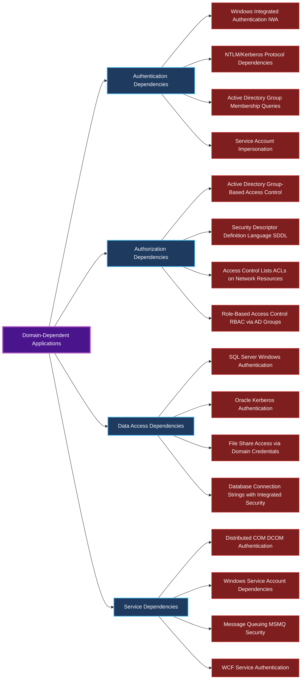
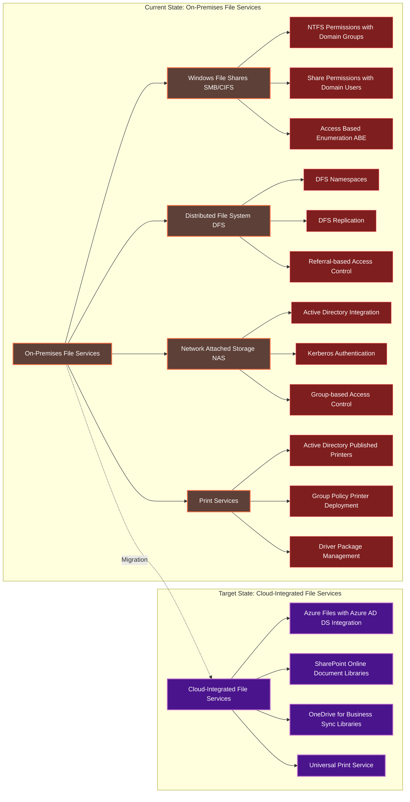

# Application Limitations and Solutions for Cloud Migration (2025)

## Metadata
- **Document Type**: Technical Deep Dive - Applications
- **Version**: 1.0.0
- **Last Updated**: 2025-08-27
- **Parent Document**: Microsoft-Autopilot-Cloud-Migration-Framework-2025.md
- **Target Audience**: Application Architects, Solution Engineers, Migration Specialists
- **Scope**: Application dependencies and migration strategies for cloud-native Autopilot

## Overview

This document provides comprehensive analysis of application-level barriers that prevent organizations from adopting cloud-native Windows Autopilot deployments, along with detailed migration solutions, modernization strategies, and implementation frameworks.

## APP-001: Domain-Joined Application Dependencies

### Legacy Application Authentication Patterns
Enterprise applications developed over decades often have dependencies on Active Directory domain services that can complicate cloud migration.

**Application Dependency Categories:**



### Application Migration Assessment Framework
```powershell
<#
.SYNOPSIS
Comprehensive application dependency assessment for cloud migration

.DESCRIPTION
Analyzes applications for domain dependencies and provides migration
complexity scoring with recommended cloud alternatives
#>

function Get-ApplicationDependencyAnalysis {
    param(
        [string[]]$ApplicationServers = @(),
        [string]$OutputPath = "C:\Temp\ApplicationAnalysis.json"
    )

    $analysis = @{
        Applications = @()
        OverallMigrationComplexity = "Unknown"
        RecommendedMigrationApproach = "Phased"
        EstimatedTimeframe = "12-18 months"
    }

    foreach ($server in $ApplicationServers) {
        Write-Output "Analyzing server: $server"

        # Analyze IIS applications
        $iisApps = Invoke-Command -ComputerName $server -ScriptBlock {
            Import-Module WebAdministration -ErrorAction SilentlyContinue
            if (Get-Module WebAdministration) {
                Get-WebApplication | ForEach-Object {
                    $appPool = Get-IISAppPool $_.ApplicationPool
                    @{
                        Name = $_.Path
                        ApplicationPool = $_.ApplicationPool
                        ProcessModel = $appPool.ProcessModel
                        Authentication = (Get-WebConfiguration -Filter "system.webServer/security/authentication/*" -PSPath $_.PSPath)
                        ConnectionStrings = (Get-WebConfiguration -Filter "connectionStrings" -PSPath $_.PSPath)
                    }
                }
            }
        }

        foreach ($app in $iisApps) {
            $migrationComplexity = "Low"
            $cloudSolutions = @()
            $blockers = @()

            # Analyze authentication methods
            if ($app.Authentication.windowsAuthentication.enabled -eq $true) {
                $migrationComplexity = "High"
                $blockers += "Windows Integrated Authentication"
                $cloudSolutions += "Azure AD Application Proxy with Pre-Authentication"
            }

            # Analyze connection strings for integrated security
            $app.ConnectionStrings.connectionStrings | ForEach-Object {
                if ($_.connectionString -like "*Integrated Security=true*" -or
                    $_.connectionString -like "*Trusted_Connection=yes*") {
                    $migrationComplexity = "High"
                    $blockers += "Database Integrated Security"
                    $cloudSolutions += "Azure SQL Managed Identity or Certificate Authentication"
                }
            }

            # Analyze application pool identity
            if ($app.ProcessModel.identityType -eq "SpecificUser") {
                $migrationComplexity = if ($migrationComplexity -eq "Low") {"Medium"} else {$migrationComplexity}
                $blockers += "Service Account Dependencies"
                $cloudSolutions += "Azure AD Managed Identity"
            }

            $analysis.Applications += @{
                Server = $server
                ApplicationName = $app.Name
                MigrationComplexity = $migrationComplexity
                Blockers = $blockers
                CloudSolutions = $cloudSolutions
                EstimatedEffort = switch ($migrationComplexity) {
                    "Low" { "1-2 months" }
                    "Medium" { "3-6 months" }
                    "High" { "6-12 months" }
                }
            }
        }

        # Analyze Windows Services with domain dependencies
        $services = Invoke-Command -ComputerName $server -ScriptBlock {
            Get-CimInstance -ClassName Win32_Service | Where-Object {
                $_.StartName -like "*\*" -and $_.StartName -notlike "NT*" -and $_.StartName -ne "LocalSystem"
            } | Select-Object Name, StartName, State, Description
        }

        foreach ($service in $services) {
            $analysis.Applications += @{
                Server = $server
                ApplicationName = "$($service.Name) (Windows Service)"
                MigrationComplexity = "Medium"
                Blockers = @("Service Account Authentication")
                CloudSolutions = @("Azure AD Managed Identity", "Certificate-Based Service Authentication")
                EstimatedEffort = "2-4 months"
            }
        }
    }

    # Calculate overall migration complexity
    $highComplexityCount = ($analysis.Applications | Where-Object {$_.MigrationComplexity -eq "High"}).Count
    $mediumComplexityCount = ($analysis.Applications | Where-Object {$_.MigrationComplexity -eq "Medium"}).Count
    $totalCount = $analysis.Applications.Count

    if ($highComplexityCount / $totalCount -gt 0.3) {
        $analysis.OverallMigrationComplexity = "Very High"
        $analysis.EstimatedTimeframe = "18-36 months"
    } elseif ($highComplexityCount / $totalCount -gt 0.1) {
        $analysis.OverallMigrationComplexity = "High"
        $analysis.EstimatedTimeframe = "12-24 months"
    } elseif ($mediumComplexityCount / $totalCount -gt 0.5) {
        $analysis.OverallMigrationComplexity = "Medium"
        $analysis.EstimatedTimeframe = "6-12 months"
    } else {
        $analysis.OverallMigrationComplexity = "Low"
        $analysis.EstimatedTimeframe = "3-6 months"
    }

    # Export analysis
    $analysis | ConvertTo-Json -Depth 5 | Out-File $OutputPath
    return $analysis
}

# Execute comprehensive application analysis
$applicationServers = @("APP01", "APP02", "WEB01", "WEB02", "SQL01")
$migrationAnalysis = Get-ApplicationDependencyAnalysis -ApplicationServers $applicationServers
```

## APP-002: File System and Network Resource Access

### Network Resource Dependencies
File shares, distributed file systems, and network-attached storage can present significant migration challenges due to their integration with domain authentication.

**Network Resource Migration Strategy:**



### Advanced File Services Migration Solutions

**Solution 1: Azure Files with Azure AD Domain Services**
```powershell
<#
.SYNOPSIS
Configure Azure Files with Azure AD Domain Services for seamless domain authentication

.DESCRIPTION
Implements Azure Files integration with Azure AD DS to maintain domain-based
authentication while migrating to cloud storage infrastructure
#>

# Configure Azure AD Domain Services for file share authentication
$azureADDSConfig = @{
    DomainName = "company.com"
    ReplicaSetConfig = @{
        Location = "Australia East"
        SubnetId = "/subscriptions/{subscription-id}/resourceGroups/network-rg/providers/Microsoft.Network/virtualNetworks/company-vnet/subnets/aadds-subnet"
    }
    LdapsSettings = @{
        Ldaps = "Enabled"
        PfxCertificate = "base64-encoded-certificate"
        PfxCertificatePassword = "certificate-password"
    }
    NotificationSettings = @{
        AdditionalRecipients = @("admin@company.com", "security@company.com")
        NotifyDcAdmins = "Enabled"
        NotifyGlobalAdmins = "Enabled"
    }
}

# Create Azure AD Domain Services instance
New-AzResource -ResourceType "Microsoft.AAD/DomainServices" -ResourceName "company-aadds" `
    -ResourceGroupName "identity-rg" -Properties $azureADDSConfig -Location "Australia East"

# Configure Azure Files storage account with AD DS authentication
$storageAccountConfig = @{
    StorageAccountName = "companyfilesaadds"
    ResourceGroupName = "storage-rg"
    Location = "East US"
    SkuName = "Premium_LRS"
    Kind = "FileStorage"
    AzureADDSConfiguration = @{
        DomainName = "company.com"
        DomainGuid = "domain-guid"
        ForestName = "company.com"
        NetBiosDomainName = "COMPANY"
        AzureStorageSid = "storage-account-sid"
    }
}

# Enable Azure AD DS authentication for Azure Files
Set-AzStorageAccount -ResourceGroupName $storageAccountConfig.ResourceGroupName `
    -Name $storageAccountConfig.StorageAccountName `
    -EnableAzureActiveDirectoryDomainServicesForFile $true
```

**Solution 2: SharePoint Online Migration with Hybrid Search**
```powershell
# SharePoint Online migration with on-premises integration
$sharePointMigration = @{
    SourceFileShares = @(
        @{
            Path = "\\fileserver01\departments"
            TargetLibrary = "https://company.sharepoint.com/sites/departments/documents"
            MigrationMethod = "SharePoint Migration Tool"
            PreserveSecurity = $true
        },
        @{
            Path = "\\fileserver01\projects"
            TargetLibrary = "https://company.sharepoint.com/sites/projects/documents"
            MigrationMethod = "Migration API"
            PreserveSecurity = $true
        }
    )
    HybridConfiguration = @{
        OnPremisesSearchIntegration = $true
        CloudHybridSearch = $true
        SearchServiceApplication = "Search Service Application"
        HybridConnectorUrl = "https://company-admin.sharepoint.com"
    }
    SecurityMapping = @{
        DomainGroupMapping = @{
            "COMPANY\Finance Team" = "Finance Team Members"
            "COMPANY\HR Department" = "Human Resources"
            "COMPANY\IT Administrators" = "IT Operations"
        }
        PermissionModel = "SharePoint Groups with Azure AD Integration"
        InheritanceModel = "Preserve NTFS Inheritance Where Possible"
    }
}

# Execute SharePoint migration with security preservation
foreach ($share in $sharePointMigration.SourceFileShares) {
    # Pre-migration security analysis
    $securityAnalysis = Get-FileShareSecurity -Path $share.Path

    # Create SharePoint security groups based on NTFS permissions
    foreach ($permission in $securityAnalysis.Permissions) {
        $groupName = "$($permission.PrincipalName) - Migrated"
        New-SPOSiteGroup -Site $share.TargetLibrary -Name $groupName -PermissionLevels $permission.Rights
    }

    # Execute migration with SPMT
    Start-SPMTMigration -SourcePath $share.Path -TargetPath $share.TargetLibrary -PreservePermissions $true
}
```

## APP-003: Database Authentication Dependencies

### Database Authentication Migration Challenges
Enterprise databases often rely heavily on Windows Authentication, creating significant migration complexity when moving to cloud-native device management.

**Database Authentication Migration Matrix:**
| Database Platform | Current Authentication | Cloud Solution | Migration Complexity | Timeframe |
|-------------------|----------------------|----------------|---------------------|-----------|
| SQL Server | Windows Authentication | Azure AD Authentication | High | 6-12 months |
| Oracle | Kerberos Authentication | Certificate-Based Auth | Very High | 12-18 months |
| MySQL | Domain Plugin | Azure AD Integration | Medium | 3-6 months |
| PostgreSQL | GSSAPI/Kerberos | Azure AD Integration | Medium | 3-6 months |
| MongoDB | Kerberos | Azure AD Integration | High | 6-9 months |

### Advanced Database Migration Solutions

**Solution 1: SQL Server to Azure SQL with Azure AD Authentication**
```sql
-- Configure Azure AD authentication for SQL Server migration
-- Step 1: Enable Azure AD authentication in Azure SQL Database
ALTER LOGIN [admin@company.com] FROM EXTERNAL PROVIDER;
ALTER SERVER ROLE sysadmin ADD MEMBER [admin@company.com];

-- Step 2: Create Azure AD-based database users
CREATE USER [Finance Team] FROM EXTERNAL PROVIDER;
CREATE USER [HR Department] FROM EXTERNAL PROVIDER;
CREATE USER [IT Operations] FROM EXTERNAL PROVIDER;

-- Step 3: Grant permissions to Azure AD groups
ALTER ROLE db_datareader ADD MEMBER [Finance Team];
ALTER ROLE db_datawriter ADD MEMBER [Finance Team];
ALTER ROLE db_datareader ADD MEMBER [HR Department];

-- Step 4: Create managed identity for applications
CREATE USER [company-web-app] FROM EXTERNAL PROVIDER;
ALTER ROLE db_datareader ADD MEMBER [company-web-app];
ALTER ROLE db_datawriter ADD MEMBER [company-web-app];
```

**Solution 2: Hybrid Database Authentication Bridge**
```powershell
<#
.SYNOPSIS
Configure hybrid database authentication during migration period

.DESCRIPTION
Implements parallel authentication systems allowing gradual migration
from Windows Authentication to Azure AD authentication
#>

# Configure SQL Server for hybrid authentication
$hybridAuthConfig = @{
    SQLServerInstance = "SQL01\INSTANCE01"
    AzureADTenantId = "your-tenant-id"
    HybridConfiguration = @{
        WindowsAuthEnabled = $true
        AzureADAuthEnabled = $true
        MixedModeAuthentication = $true
        TransitionPeriod = "12 months"
    }
    UserMigrationMapping = @{
        "COMPANY\finance_service" = "finance-app@company.com"
        "COMPANY\hr_service" = "hr-app@company.com"
        "COMPANY\reporting_service" = "reporting-app@company.com"
    }
}

# Enable Azure AD authentication on SQL Server
Import-Module SqlServer
$connectionString = "Server=$($hybridAuthConfig.SQLServerInstance);Integrated Security=true;"

# Configure Azure AD authentication
Invoke-Sqlcmd -ConnectionString $connectionString -Query @"
-- Enable contained databases for Azure AD authentication
EXEC sp_configure 'contained database authentication', 1;
RECONFIGURE;

-- Create contained database users for Azure AD
USE [CompanyDatabase];
CREATE USER [finance-app@company.com] FROM EXTERNAL PROVIDER;
CREATE USER [hr-app@company.com] FROM EXTERNAL PROVIDER;
CREATE USER [reporting-app@company.com] FROM EXTERNAL PROVIDER;
"@

# Create parallel permission structure for gradual migration
foreach ($mapping in $hybridAuthConfig.UserMigrationMapping.GetEnumerator()) {
    $windowsUser = $mapping.Key
    $azureADUser = $mapping.Value

    # Get existing Windows user permissions
    $windowsPermissions = Invoke-Sqlcmd -ConnectionString $connectionString -Query @"
        SELECT
            p.class_desc,
            p.permission_name,
            p.state_desc,
            s.name as securable_name
        FROM sys.database_permissions p
        INNER JOIN sys.objects s ON p.major_id = s.object_id
        INNER JOIN sys.database_principals dp ON p.grantee_principal_id = dp.principal_id
        WHERE dp.name = '$windowsUser'
    "@

    # Apply same permissions to Azure AD user
    foreach ($permission in $windowsPermissions) {
        $grantStatement = "$($permission.state_desc) $($permission.permission_name) ON $($permission.securable_name) TO [$azureADUser]"
        Invoke-Sqlcmd -ConnectionString $connectionString -Query $grantStatement
    }
}
```

## Application Migration Assessment Checklist

| Phase | Assessment Task | Priority | Estimated Effort | Responsible Party | Deliverable | Status |
|-------|-----------------|----------|------------------|-------------------|-------------|--------|
| **Pre-Migration Assessment** | Complete application inventory | Critical | 2-3 weeks | Application Team | Application catalog with dependencies | ☐ |
| | Map authentication dependencies | Critical | 1-2 weeks | Security Team | Authentication dependency matrix | ☐ |
| | Document database connections | High | 1-2 weeks | Database Team | Connection string analysis | ☐ |
| | Identify file share requirements | Medium | 1 week | Infrastructure Team | File access mapping | ☐ |
| | Catalog service account usage | High | 1 week | Identity Team | Service account inventory | ☐ |
| **Migration Planning** | Categorize applications by complexity | Critical | 1 week | Application Team | Complexity assessment matrix | ☐ |
| | Design modernization approach | High | 2-3 weeks | Solution Architects | Modernization roadmap | ☐ |
| | Plan Application Proxy deployment | High | 1-2 weeks | Infrastructure Team | Application Proxy architecture | ☐ |
| | Create database migration strategy | Critical | 2-3 weeks | Database Team | Database migration plan | ☐ |
| | Establish file services migration plan | Medium | 1-2 weeks | Infrastructure Team | File services roadmap | ☐ |
| **Implementation Phases** | Deploy Application Proxy infrastructure | Critical | 2-4 weeks | Infrastructure Team | Deployed Application Proxy | ☐ |
| | Migrate low-complexity applications | High | 4-8 weeks | Application Team | Migrated applications (30%) | ☐ |
| | Modernize medium-complexity applications | High | 8-16 weeks | Development Team | Modernized applications (40%) | ☐ |
| | Transform high-complexity applications | Critical | 16-24 weeks | Solution Architects | Transformed applications (30%) | ☐ |
| | Validate all application functionality | Critical | 2-4 weeks | QA Team | Validation test results | ☐ |
| **Post-Migration Validation** | Verify application availability | Critical | 1 week | Operations Team | Availability monitoring reports | ☐ |
| | Test performance metrics | High | 1-2 weeks | Performance Team | Performance baseline comparison | ☐ |
| | Validate security compliance | Critical | 1-2 weeks | Security Team | Security assessment report | ☐ |
| | Document migration patterns | Medium | 1 week | Documentation Team | Migration runbook | ☐ |
| | Optimize application access | Low | 2-4 weeks | Operations Team | Performance optimization report | ☐ |

## Cross-References

### Parent Document
- **[Cloud Migration Framework](Microsoft-Autopilot-Cloud-Migration-Framework-2025.md)** - Main migration strategy document

### Related Documents
- **[Authentication Limitations and Solutions](authentication-limitations-solutions.md)** - Authentication-specific challenges
- **[Cloud Authentication Solutions](cloud-authentication-solutions.md)** - Modern authentication implementation

### External Resources
- **[Azure AD Application Proxy](https://learn.microsoft.com/entra/identity/app-proxy/)** - Official documentation
- **[Azure Files Documentation](https://learn.microsoft.com/azure/storage/files/)** - File migration guidance
- **[SharePoint Migration Tool](https://learn.microsoft.com/sharepointmigration/introducing-the-sharepoint-migration-tool)** - SPMT documentation

---

*This document provides detailed application migration analysis for Windows Autopilot cloud migration. For the complete migration framework, see the parent document.*
