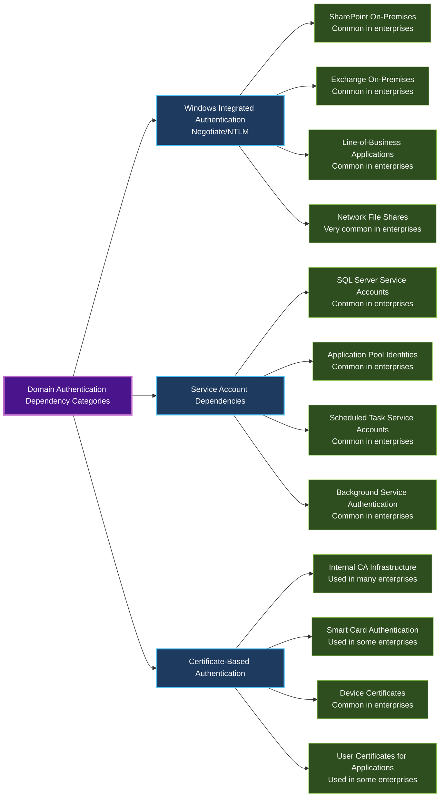
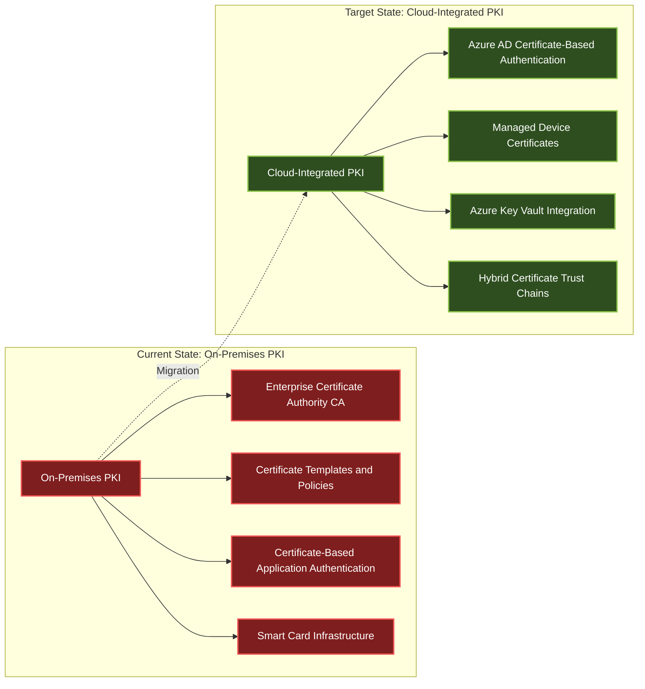

# Authentication Limitations and Solutions for Cloud Migration (2025)

## Metadata
- **Document Type**: Technical Deep Dive - Authentication
- **Version**: 1.0.0
- **Last Updated**: 2025-08-27
- **Parent Document**: Microsoft-Autopilot-Cloud-Migration-Framework-2025.md
- **Target Audience**: Security Architects, Identity Engineers, Authentication Specialists
- **Scope**: Authentication barriers and solutions for cloud-native Autopilot migration

## Overview

This document provides detailed analysis of authentication limitations that prevent organizations from adopting cloud-native Windows Autopilot deployments, along with comprehensive solutions including Cloud Kerberos, certificate-based authentication, and modern identity technologies.

## AUTH-001: Domain Authentication Dependencies

### Current State Assessment
Many enterprise environments have developed over decades with deep Active Directory integration, creating complex authentication dependency webs that can prevent immediate cloud-only adoption.

**Primary Authentication Challenges:**



### Technical Impact Analysis
```powershell
<#
.SYNOPSIS
Authentication dependency discovery script for migration planning

.DESCRIPTION
Analyzes current environment authentication dependencies to assess
cloud migration readiness and identify remediation requirements
#>

# Discover domain authentication dependencies
function Get-AuthenticationDependencies {
    $dependencies = @{
        KerberosServices = @()
        NTLMApplications = @()
        CertificateRequirements = @()
        ServiceAccounts = @()
        FileShareAccess = @()
    }

    # Analyze Kerberos Service Principal Names
    $spns = Get-ADObject -Filter {servicePrincipalName -like "*"} -Properties servicePrincipalName
    foreach ($spn in $spns) {
        $dependencies.KerberosServices += @{
            Object = $spn.Name
            SPNs = $spn.servicePrincipalName
            MigrationComplexity = "High"
            CloudSolution = "Azure AD Application Proxy / Modern Auth"
        }
    }

    # Discover NTLM authentication usage
    $ntlmEvents = Get-WinEvent -FilterHashtable @{LogName='Security'; ID=4624} -MaxEvents 1000 |
        Where-Object {$_.Message -like "*NTLM*"}

    foreach ($event in $ntlmEvents) {
        $dependencies.NTLMApplications += @{
            Source = $event.Properties[18].Value
            Target = $event.Properties[5].Value
            Timestamp = $event.TimeCreated
            Remediation = "Modern Authentication Migration Required"
        }
    }

    # Certificate infrastructure analysis
    $certificates = Get-ChildItem -Path "Cert:\LocalMachine\My" |
        Where-Object {$_.Issuer -notlike "*Microsoft*" -and $_.Issuer -notlike "*VeriSign*"}

    foreach ($cert in $certificates) {
        $dependencies.CertificateRequirements += @{
            Subject = $cert.Subject
            Issuer = $cert.Issuer
            Purpose = $cert.EnhancedKeyUsageList.FriendlyName
            CloudMigration = "Azure AD Certificate-Based Authentication"
        }
    }

    return $dependencies
}

# Execute dependency analysis
$migrationAnalysis = Get-AuthenticationDependencies
$migrationAnalysis | ConvertTo-Json -Depth 4 | Out-File "C:\Temp\AuthenticationDependencyAnalysis.json"
```

## AUTH-002: Kerberos Authentication Challenges

### Legacy Kerberos Dependencies
Traditional Kerberos authentication creates significant cloud migration barriers due to its tight integration with Active Directory domains and on-premises infrastructure.

**Kerberos Dependency Matrix:**
| Service Type | Domain Dependency | Cloud Solution | Migration Complexity |
|--------------|------------------|----------------|---------------------|
| File Shares (SMB) | High | Azure Files + Azure AD DS | Medium |
| SQL Server | High | Azure SQL + Managed Identity | High |
| Web Applications | Medium | Azure AD App Proxy | Medium |
| Print Services | High | Universal Print | Low |
| Exchange | High | Exchange Online | Low |
| SharePoint | High | SharePoint Online | Low |

### Solution 1: Cloud Kerberos (Windows Hello for Business)
```xml
<!-- Windows Hello for Business Configuration for Cloud Kerberos -->
<Configuration>
    <WindowsHelloForBusiness>
        <UseCloudTrustForOnPremisesAuthentication>true</UseCloudTrustForOnPremisesAuthentication>
        <UseKeyTrustForOnPremisesAuthentication>false</UseKeyTrustForOnPremisesAuthentication>
        <UseCertificateForOnPremisesAuthentication>false</UseCertificateForOnPremisesAuthentication>
        <PolicySettings>
            <RequireSecurityDevice>true</RequireSecurityDevice>
            <EnablePINRecovery>true</EnablePINRecovery>
            <UseBiometrics>true</UseBiometrics>
        </PolicySettings>
        <CloudTrustConfiguration>
            <AzureADTenantId>your-tenant-id</AzureADTenantId>
            <OnPremisesDirectoryIntegration>AzureADConnect</OnPremisesDirectoryIntegration>
            <CertificateBasedAuthentication>
                <Enable>true</Enable>
                <RequireSmartCard>false</RequireSmartCard>
            </CertificateBasedAuthentication>
        </CloudTrustConfiguration>
    </WindowsHelloForBusiness>
</Configuration>
```

### Solution 2: FIDO2 Security Keys for Hybrid Authentication
```powershell
# Configure FIDO2 security keys for on-premises resource access
$fido2Policy = @{
    DisplayName = "FIDO2 Security Keys for Hybrid Access"
    AuthenticationMethodPolicy = @{
        FIDO2 = @{
            IsEnabled = $true
            IsSelfServiceRegistrationAllowed = $true
            EnforceAttestationForRegistration = $true
            KeyRestrictions = @{
                EnforceKeyRestrictions = $true
                RestrictedKeys = @()
                AllowedKeys = @(
                    @{
                        Manufacturer = "Yubico"
                        Models = @("Security Key", "YubiKey 5")
                    }
                )
            }
        }
    }
    HybridConfiguration = @{
        OnPremisesAccess = $true
        KerberosInteroperability = $true
        SmartCardFallback = $false
    }
}

# Apply FIDO2 configuration via Microsoft Graph
New-MgPolicyAuthenticationMethodPolicy -BodyParameter $fido2Policy
```

## AUTH-003: Certificate-Based Authentication Requirements

### Enterprise Certificate Infrastructure Migration

Organizations with mature Public Key Infrastructure (PKI) face complex migration challenges when moving to cloud-native authentication while maintaining security standards.

**Certificate Authentication Migration Strategy:**



### Advanced Certificate Migration Solutions

**Solution 1: Azure AD Certificate-Based Authentication**
```powershell
<#
.SYNOPSIS
Configure Azure AD Certificate-Based Authentication for cloud migration

.DESCRIPTION
Establishes certificate-based authentication in Azure AD while maintaining
compatibility with on-premises certificate infrastructure
#>

# Configure Certificate-Based Authentication in Azure AD
$certAuthConfig = @{
    CertificateAuthorities = @(
        @{
            Certificate = [Convert]::ToBase64String([System.IO.File]::ReadAllBytes("C:\Certs\RootCA.cer"))
            IsRootAuthority = $true
            RevocationCheck = "enabled"
            DeltaCRLLocationURL = "http://crl.company.com/RootCA.crl"
        },
        @{
            Certificate = [Convert]::ToBase64String([System.IO.File]::ReadAllBytes("C:\Certs\IssuingCA.cer"))
            IsRootAuthority = $false
            RevocationCheck = "enabled"
            DeltaCRLLocationURL = "http://crl.company.com/IssuingCA.crl"
        }
    )
    CertificateUserBinding = @{
        UserAttributeMapping = "PrincipalName"
        TrustedIssuers = @("CN=Company Issuing CA, DC=company, DC=com")
        RevocationCheckEnabled = $true
    }
}

# Apply certificate-based authentication configuration
Update-MgOrganizationCertificateBasedAuthConfiguration -BodyParameter $certAuthConfig

# Configure conditional access for certificate authentication
$certCAPolicy = @{
    displayName = "Certificate-Based Authentication Required"
    conditions = @{
        users = @{
            includeUsers = @("All")
            excludeUsers = @()
        }
        applications = @{
            includeApplications = @("All")
        }
        clientAppTypes = @("exchangeActiveSync", "browser", "mobileAppsAndDesktopClients")
    }
    grantControls = @{
        operator = "OR"
        builtInControls = @("certificateBasedAuthentication")
        customAuthenticationFactors = @()
    }
}

New-MgIdentityConditionalAccessPolicy -BodyParameter $certCAPolicy
```

**Solution 2: Hybrid Certificate Trust and Azure Key Vault Integration**
```json
{
  "certificateTrustConfiguration": {
    "hybridTrustModel": {
      "onPremisesCertificateAuthority": {
        "rootCA": "CN=Company Root CA",
        "issuingCAs": [
          "CN=Company Issuing CA 1",
          "CN=Company Issuing CA 2"
        ],
        "crlDistributionPoints": [
          "http://crl.company.com/CompanyRootCA.crl",
          "http://crl.company.com/CompanyIssuingCA.crl"
        ]
      },
      "azureKeyVaultIntegration": {
        "keyVaultName": "company-pki-keyvault",
        "certificateManagement": "automated",
        "keyRotationPolicy": "annual",
        "hsm": "enabled"
      },
      "crossPlatformSupport": {
        "windowsDevices": true,
        "macDevices": true,
        "iosDevices": true,
        "androidDevices": true
      }
    }
  }
}
```

## Authentication Migration Assessment Checklist

### Pre-Migration Assessment
- [ ] Complete authentication dependency inventory
- [ ] Identify Kerberos/NTLM usage patterns
- [ ] Catalog certificate requirements
- [ ] Document service account dependencies
- [ ] Map user authentication flows

### Migration Planning
- [ ] Design modern authentication architecture
- [ ] Plan passwordless authentication rollout
- [ ] Create certificate migration strategy
- [ ] Develop hybrid authentication bridges
- [ ] Establish fallback authentication methods

### Implementation Phases
- [ ] Deploy modern authentication infrastructure
- [ ] Configure certificate-based authentication
- [ ] Implement FIDO2 security keys
- [ ] Enable Windows Hello for Business
- [ ] Test authentication scenarios

### Post-Migration Validation
- [ ] Verify authentication success rates
- [ ] Monitor user experience metrics
- [ ] Validate security compliance
- [ ] Document lessons learned
- [ ] Optimize authentication flows

## Cross-References

### Parent Document
- **[Cloud Migration Framework](Microsoft-Autopilot-Cloud-Migration-Framework-2025.md)** - Main migration strategy document

### Related Documents
- **[Application Limitations and Solutions](application-limitations-solutions.md)** - Application-specific migration challenges
- **[Cloud Authentication Solutions](cloud-authentication-solutions.md)** - Modern authentication implementation guide

### External Resources
- **[Microsoft Identity Platform](https://learn.microsoft.com/entra/identity-platform/)** - Official documentation
- **[Azure AD Authentication Methods](https://learn.microsoft.com/entra/identity/authentication/)** - Authentication options
- **[Windows Hello for Business](https://learn.microsoft.com/windows/security/identity-protection/hello-for-business/)** - Passwordless authentication

---

*This document provides detailed authentication analysis for Windows Autopilot cloud migration. For the complete migration framework, see the parent document.*
