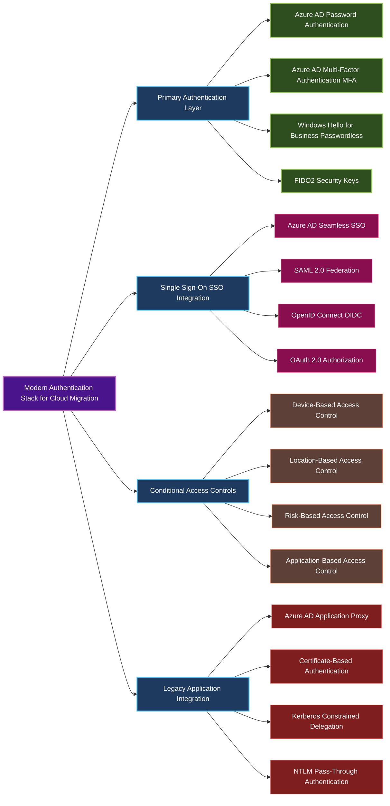
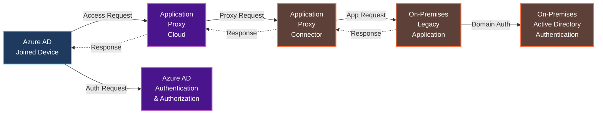
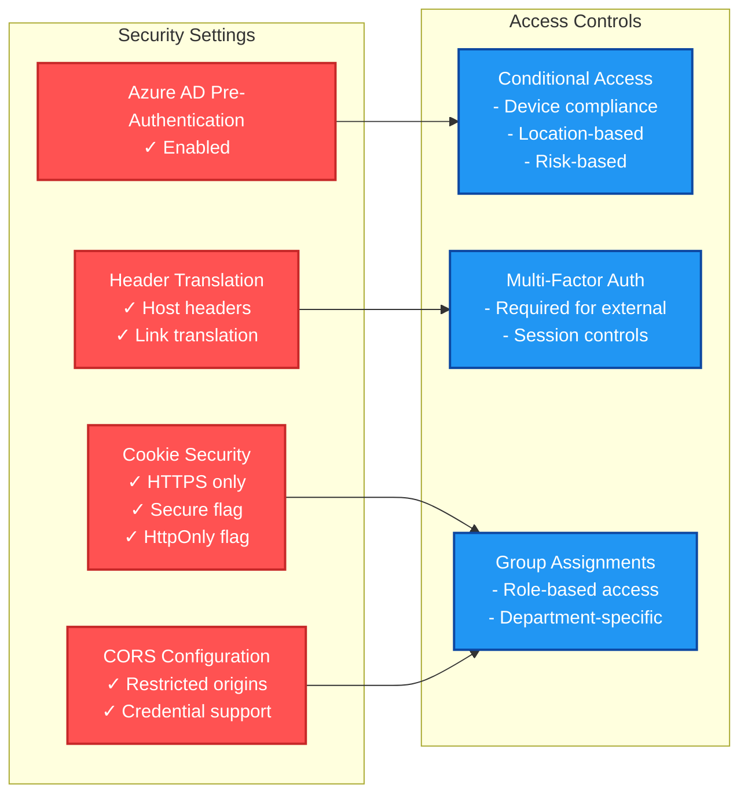

# Cloud Authentication Solutions for Windows Autopilot Migration (2025)

## Metadata
- **Document Type**: Technical Deep Dive - Cloud Solutions
- **Version**: 1.0.0
- **Last Updated**: 2025-08-27
- **Parent Document**: Microsoft-Autopilot-Cloud-Migration-Framework-2025.md
- **Target Audience**: Cloud Architects, Security Engineers, Identity Specialists
- **Scope**: Modern authentication solutions for cloud-native Windows Autopilot deployments

## Overview

This document provides comprehensive cloud authentication solutions that enable organizations to successfully migrate from hybrid to cloud-native Windows Autopilot deployments. It covers modern authentication architectures, Azure AD Application Proxy implementations, and advanced certificate-based authentication strategies.

## SOLUTION-001: Modern Authentication Architecture

### Comprehensive Modern Authentication Framework



### Implementation: Comprehensive Modern Authentication Deployment

```powershell
<#
.SYNOPSIS
Deploy comprehensive modern authentication infrastructure

.DESCRIPTION
Implements complete modern authentication stack including passwordless authentication,
conditional access, and legacy application integration
#>

function Deploy-ModernAuthenticationFramework {
    param(
        [string]$TenantId,
        [string]$SubscriptionId,
        [hashtable]$OrganizationConfig
    )

    Write-Output "Deploying Modern Authentication Framework..."

    # Step 1: Configure Azure AD for modern authentication
    $azureADConfig = @{
        PasswordlessPolicies = @{
            WindowsHelloForBusiness = @{
                Enabled = $true
                RequireSecurityDevice = $true
                AllowBiometrics = $true
                PINComplexity = @{
                    MinimumLength = 6
                    MaximumLength = 127
                    RequireNumbers = $true
                    RequireLowercase = $false
                    RequireUppercase = $false
                    RequireSpecialCharacters = $false
                }
            }
            FIDO2SecurityKeys = @{
                Enabled = $true
                EnforceAttestation = $true
                RestrictedKeys = @()
                AllowedKeys = @(
                    @{Manufacturer = "Yubico"; Models = @("YubiKey 5 Series")}
                    @{Manufacturer = "Microsoft"; Models = @("Surface Security Key")}
                )
            }
            MicrosoftAuthenticator = @{
                Enabled = $true
                RequireNumberMatching = $true
                ShowGeographicLocation = $true
                ShowApplicationContext = $true
            }
        }
        ConditionalAccessPolicies = @(
            @{
                Name = "Require MFA for All Users"
                Conditions = @{
                    Users = @{IncludeUsers = @("All")}
                    Applications = @{IncludeApplications = @("All")}
                    Locations = @{IncludeLocations = @("All")}
                }
                Controls = @{
                    GrantControls = @("mfa")
                    SessionControls = @()
                }
            },
            @{
                Name = "Block Legacy Authentication"
                Conditions = @{
                    Users = @{IncludeUsers = @("All")}
                    ClientApps = @("exchangeActiveSync", "other")
                }
                Controls = @{
                    GrantControls = @("block")
                }
            },
            @{
                Name = "Require Compliant Device for Corporate Apps"
                Conditions = @{
                    Users = @{IncludeUsers = @("All")}
                    Applications = @{IncludeApplications = @($OrganizationConfig.CorporateApplications)}
                }
                Controls = @{
                    GrantControls = @("compliantDevice", "domainJoinedDevice")
                    Operator = "OR"
                }
            }
        )
    }

    # Deploy passwordless authentication
    foreach ($policy in $azureADConfig.PasswordlessPolicies.Keys) {
        $policyConfig = $azureADConfig.PasswordlessPolicies[$policy]
        Write-Output "Configuring $policy authentication..."

        switch ($policy) {
            "WindowsHelloForBusiness" {
                # Configure Windows Hello for Business policy
                $whfbPolicy = @{
                    displayName = "Windows Hello for Business Policy"
                    windowsHelloForBusinessConfiguration = $policyConfig
                }
                New-MgDeviceManagementDeviceConfiguration -BodyParameter $whfbPolicy
            }
            "FIDO2SecurityKeys" {
                # Configure FIDO2 authentication method
                $fido2Config = @{
                    "@odata.type" = "#microsoft.graph.fido2AuthenticationMethodConfiguration"
                    isAttestationEnforced = $policyConfig.EnforceAttestation
                    isSelfServiceRegistrationAllowed = $true
                    keyRestrictions = @{
                        isEnforced = $true
                        enforcementType = "allow"
                        aaGuids = @() # Populate with specific FIDO2 device AAGUIDs
                    }
                }
                Update-MgPolicyAuthenticationMethodPolicyAuthenticationMethodConfiguration -AuthenticationMethodConfigurationId "Fido2" -BodyParameter $fido2Config
            }
        }
    }

    # Deploy conditional access policies
    foreach ($policy in $azureADConfig.ConditionalAccessPolicies) {
        Write-Output "Creating Conditional Access Policy: $($policy.Name)"
        New-MgIdentityConditionalAccessPolicy -BodyParameter $policy
    }

    Write-Output "Modern Authentication Framework deployment completed."
}

# Execute modern authentication deployment
$organizationConfig = @{
    CorporateApplications = @(
        "Office 365",
        "Company Portal",
        "Line of Business Apps"
    )
}

Deploy-ModernAuthenticationFramework -TenantId "your-tenant-id" -SubscriptionId "your-subscription-id" -OrganizationConfig $organizationConfig
```

## SOLUTION-002: Azure AD Application Proxy for Legacy Applications

### Legacy Application Integration Strategy

Azure AD Application Proxy provides integration for legacy applications that cannot be immediately modernized, allowing cloud-native devices to access on-premises resources securely.

**Application Proxy Architecture:**



### Implementation: Application Proxy Deployment

**Application Proxy Deployment Process:**

```mermaid
flowchart TD
    Start([Start Application Proxy Deployment])

    subgraph "Phase 1: Connector Installation"
        Download[Download Connector Installer<br/>from Azure Portal]
        Install[Install on On-Premises Server<br/>- Silent installation<br/>- Auto-register enabled]
        Register[Register with Azure AD<br/>- Authentication configuration<br/>- Tenant association]
        Verify1[Verify Connector Health<br/>✓ Connection established<br/>✓ Authentication successful]
    end

    subgraph "Phase 2: Application Configuration"
        CreateApp[Create App Registration<br/>in Azure AD]
        ConfigProxy[Configure Proxy Settings<br/>- External/Internal URLs<br/>- Pre-authentication<br/>- Security settings]
        CreateSP[Create Service Principal<br/>for Application]
        AssignUsers[Assign User Groups<br/>- HR Team<br/>- Finance Team<br/>- Executives]
    end

    subgraph "Phase 3: Security Configuration"
        AuthSettings[Configure Authentication<br/>- Azure AD Pre-auth<br/>- SSO Settings]
        SecuritySettings[Apply Security Policies<br/>- HTTPS Only<br/>- Secure Cookies<br/>- Header Translation]
        AccessControl[Set Access Controls<br/>- Conditional Access<br/>- MFA Requirements]
    end

    subgraph "Phase 4: Testing & Validation"
        TestInternal[Test Internal Access<br/>Verify legacy app connectivity]
        TestExternal[Test External Access<br/>via proxy URLs]
        ValidateSSO[Validate SSO Experience<br/>Seamless authentication]
        MonitorHealth[Monitor Connector Health<br/>Performance metrics]
    end

    Start --> Download
    Download --> Install
    Install --> Register
    Register --> Verify1
    Verify1 --> CreateApp
    CreateApp --> ConfigProxy
    ConfigProxy --> CreateSP
    CreateSP --> AssignUsers
    AssignUsers --> AuthSettings
    AuthSettings --> SecuritySettings
    SecuritySettings --> AccessControl
    AccessControl --> TestInternal
    TestInternal --> TestExternal
    TestExternal --> ValidateSSO
    ValidateSSO --> MonitorHealth
    MonitorHealth --> End([Deployment Complete])

    classDef phase1 fill:#4fc3f7,stroke:#0288d1,stroke-width:2px,color:#000
    classDef phase2 fill:#66bb6a,stroke:#2e7d32,stroke-width:2px,color:#000
    classDef phase3 fill:#ffa726,stroke:#ef6c00,stroke-width:2px,color:#000
    classDef phase4 fill:#ab47bc,stroke:#6a1b9a,stroke-width:2px,color:#fff

    class Download,Install,Register,Verify1 phase1
    class CreateApp,ConfigProxy,CreateSP,AssignUsers phase2
    class AuthSettings,SecuritySettings,AccessControl phase3
    class TestInternal,TestExternal,ValidateSSO,MonitorHealth phase4
```



**Application Proxy Security Configuration:**



## SOLUTION-003: Certificate-Based Authentication for Modern Applications

### Advanced Certificate Authentication Integration

For organizations using certificate-based authentication, modern certificate solutions can provide cloud integration without traditional PKI complexity.

```powershell
<#
.SYNOPSIS
Deploy modern certificate-based authentication with cloud PKI integration

.DESCRIPTION
Implements certificate-based authentication using Azure Key Vault managed certificates
and integrates with cloud-native device authentication flows
#>

function Deploy-ModernCertificateAuthentication {
    param(
        [string]$KeyVaultName,
        [string]$TenantId,
        [hashtable]$CertificateRequirements
    )

    Write-Output "Deploying modern certificate-based authentication..."

    # Configure Azure Key Vault for certificate management
    $keyVaultConfig = @{
        VaultName = $KeyVaultName
        ResourceGroupName = "security-rg"
        Location = "Australia East"
        EnabledForDeployment = $true
        EnabledForTemplateDeployment = $true
        EnabledForDiskEncryption = $true
        EnableRbacAuthorization = $true
    }

    # Create Key Vault if it doesn't exist
    $keyVault = Get-AzKeyVault -VaultName $KeyVaultName -ErrorAction SilentlyContinue
    if (-not $keyVault) {
        $keyVault = New-AzKeyVault @keyVaultConfig
    }

    # Configure certificate policies for different use cases
    $certificatePolicies = @{
        "UserAuthentication" = @{
            CertificatePolicy = @{
                KeyProperties = @{
                    Exportable = $false
                    KeySize = 2048
                    KeyType = "RSA"
                }
                SecretProperties = @{
                    ContentType = "application/x-pkcs12"
                }
                X509CertificateProperties = @{
                    Subject = "CN={UPN}"
                    SubjectAlternativeNames = @{
                        Emails = @("{UPN}")
                        UserPrincipalNames = @("{UPN}")
                    }
                    KeyUsage = @("digitalSignature", "keyEncipherment")
                    ExtendedKeyUsage = @("1.3.6.1.5.5.7.3.2") # Client Authentication
                    ValidityInMonths = 12
                }
                LifetimeActions = @(
                    @{
                        Trigger = @{
                            LifetimePercentage = 80
                        }
                        Action = @{
                            ActionType = "AutoRenew"
                        }
                    }
                )
                IssuerParameters = @{
                    Name = "Self"
                }
            }
        }
        "DeviceAuthentication" = @{
            CertificatePolicy = @{
                KeyProperties = @{
                    Exportable = $false
                    KeySize = 2048
                    KeyType = "RSA"
                }
                SecretProperties = @{
                    ContentType = "application/x-pkcs12"
                }
                X509CertificateProperties = @{
                    Subject = "CN={DeviceName}.{Domain}"
                    SubjectAlternativeNames = @{
                        DnsNames = @("{DeviceName}.{Domain}")
                    }
                    KeyUsage = @("digitalSignature", "keyEncipherment")
                    ExtendedKeyUsage = @("1.3.6.1.5.5.7.3.2") # Client Authentication
                    ValidityInMonths = 24
                }
                LifetimeActions = @(
                    @{
                        Trigger = @{
                            LifetimePercentage = 75
                        }
                        Action = @{
                            ActionType = "EmailContacts"
                        }
                    },
                    @{
                        Trigger = @{
                            LifetimePercentage = 90
                        }
                        Action = @{
                            ActionType = "AutoRenew"
                        }
                    }
                )
                IssuerParameters = @{
                    Name = "Self"
                }
            }
        }
    }

    # Create certificate templates in Key Vault
    foreach ($certType in $certificatePolicies.Keys) {
        $policyName = "$KeyVaultName-$certType-Policy"
        $policy = $certificatePolicies[$certType].CertificatePolicy

        Set-AzKeyVaultCertificatePolicy -VaultName $KeyVaultName -Name $policyName -Policy $policy
        Write-Output "Created certificate policy: $policyName"
    }

    # Configure Azure AD for certificate-based authentication
    $certAuthConfig = @{
        certificateBasedAuthConfiguration = @{
            certificateAuthorities = @(
                @{
                    isRootAuthority = $true
                    certificate = [Convert]::ToBase64String((Get-AzKeyVaultCertificate -VaultName $KeyVaultName -Name "RootCA").Certificate.RawData)
                    issuer = "CN=Company Root CA"
                    crlDistributionPoint = "https://$KeyVaultName.vault.azure.net/certificates/RootCA/crl"
                }
            )
        }
    }

    # Apply certificate-based authentication configuration to Azure AD
    Update-MgOrganizationCertificateBasedAuthConfiguration -BodyParameter $certAuthConfig

    Write-Output "Modern certificate-based authentication deployment completed."
    Write-Output "Deploy device certificate script via Intune for automatic device certificate provisioning."
}

# Execute modern certificate authentication deployment
Deploy-ModernCertificateAuthentication -KeyVaultName "company-cert-kv" -TenantId "your-tenant-id" -CertificateRequirements @{}
```

## Cloud Authentication Best Practices

### Passwordless Authentication Adoption
1. Start with pilot group for passwordless authentication
2. Deploy Windows Hello for Business in phases
3. Provide FIDO2 security keys for high-privilege users
4. Monitor adoption rates and user feedback
5. Expand gradually across organization

### Application Proxy Deployment
1. Identify critical legacy applications first
2. Deploy redundant connectors for high availability
3. Configure pre-authentication for security
4. Implement conditional access policies
5. Monitor connector health and performance

### Certificate Management
1. Use Azure Key Vault for centralized certificate management
2. Automate certificate lifecycle management
3. Implement certificate auto-renewal policies
4. Monitor certificate expiration proactively
5. Maintain emergency certificate recovery procedures

## Cross-References

### Parent Document
- **[Cloud Migration Framework](Microsoft-Autopilot-Cloud-Migration-Framework-2025.md)** - Main migration strategy document

### Related Documents
- **[Authentication Limitations and Solutions](authentication-limitations-solutions.md)** - Authentication-specific challenges
- **[Application Limitations and Solutions](application-limitations-solutions.md)** - Application migration strategies

### External Resources
- **[Azure AD Authentication Methods](https://learn.microsoft.com/entra/identity/authentication/)** - Official documentation
- **[Windows Hello for Business](https://learn.microsoft.com/windows/security/identity-protection/hello-for-business/)** - Deployment guide
- **[Azure AD Application Proxy](https://learn.microsoft.com/entra/identity/app-proxy/)** - Configuration documentation

---

*This document provides cloud authentication solutions for Windows Autopilot migration. For the complete migration framework, see the parent document.*
