# Microsoft Autopilot Hybrid Deployment Limitations & Workarounds (2025)

## Metadata
- **Document Type**: Technical Reference - Limitations and Solutions
- **Version**: 1.0.0
- **Last Updated**: 2025-08-27
- **Target Audience**: Infrastructure Architects, Senior IT Administrators, System Engineers
- **Scope**: Windows Autopilot Hybrid Azure AD Join deployment challenges and solutions
- **Criticality Level**: HIGH - Critical business impact scenarios

## Executive Summary

**⚠️ MICROSOFT'S OFFICIAL POSITION (2025): Microsoft does not recommend hybrid Azure AD join for new device deployments and strongly encourages cloud-native approaches using Microsoft Entra join.**

Despite Microsoft's recommendation, many organizations still require hybrid deployments due to legacy infrastructure dependencies, on-premises applications, and compliance requirements. This document provides coverage of known limitations, gotchas, and workarounds for organizations that must implement Windows Autopilot hybrid Azure AD join solutions.

**Key 2025 Updates Affecting Hybrid Deployments:**
- Intune Connector for Active Directory deprecation timeline (June 2025)
- Enhanced security requirements with Managed Service Accounts (MSA)
- Updated authentication flows impacting domain connectivity
- Compliance state synchronization improvements

## Critical Limitations Overview

### Microsoft's Strategic Direction

#### LIM-001: Official Deprecation Warning
**Category**: Strategic  
**Impact**: Business Critical  
**Timeline**: Ongoing

**Limitation Description:**
Microsoft officially discourages hybrid Azure AD join for new deployments as part of their cloud-first strategy. While still supported, feature development and enhancement priorities favor cloud-native solutions.

**Business Impact:**
- Reduced feature velocity for hybrid-specific capabilities
- Potential future deprecation of hybrid join support
- Limited innovation in hybrid deployment scenarios
- Migration pressure toward cloud-native solutions

**Mitigation Strategies:**
1. **Develop cloud migration roadmap** - Plan transition to Entra join
2. **Hybrid-to-cloud bridge strategy** - Gradual migration approach
3. **Application modernization** - Reduce on-premises dependencies
4. **Identity strategy evolution** - Move toward cloud-based authentication

**Implementation Timeline:**
- **Immediate**: Document hybrid dependencies and constraints
- **3-6 months**: Pilot cloud-native deployments for new devices
- **6-12 months**: Develop migration strategy for existing hybrid devices
- **12-24 months**: Execute phased migration to cloud-native approach

### Infrastructure Dependencies

#### LIM-002: Intune Connector for Active Directory Limitations
**Category**: Infrastructure  
**Impact**: High  
**Timeline**: June 2025 deprecation

**Limitation Description:**
The legacy Intune Connector for Active Directory will be deprecated in June 2025, requiring upgrade to the new connector with Managed Service Account (MSA) architecture.

**Technical Constraints:**
- Single point of failure for domain join operations
- Requires Windows Server 2016+ with .NET Framework 4.7.2+
- MSA account creation and permission challenges
- Replication delays between domain controllers
- Service startup and authentication issues

**Known Issues:**
```
Error: MSA account <accountName> is not valid when signing in
Observed behavior: Connector creates MSA but may fail to retrieve DC data
Impact: Domain join operations fail during Autopilot
```

**Workarounds:**
1. **Upgrade to new connector (v6.2501.2000.5+):**
   ```powershell
   # Verify current version
   Get-ItemProperty "HKLM:\SOFTWARE\Microsoft\Microsoft Intune on-premise Connector" -Name "Version"
   
   # Download new connector from Intune admin center
   # Install with elevated privileges
   # Verify MSA account creation
   ```

2. **MSA account troubleshooting:**
   ```powershell
   # Check MSA account status
   Get-ADServiceAccount -Filter "Name -like 'MSOL_*'"
   
   # Verify connector service status
   Get-Service "Microsoft Intune Connector" | Select Status, StartType
   
   # Test domain controller connectivity
   Test-ComputerSecureChannel -Verbose
   ```

3. **Multi-connector deployment (recommended):**
   - Deploy connectors on multiple domain controllers
   - Configure load balancing for high availability
   - Monitor connector health across all instances

#### LIM-003: Domain Controller Connectivity Requirements
**Category**: Network/Infrastructure  
**Impact**: High  
**Criticality**: Deployment Blocking

**Limitation Description:**
Hybrid Autopilot requires persistent connectivity to domain controllers during deployment, creating dependency on network infrastructure and VPN solutions.

**Technical Constraints:**
- Device must ping domain controller before proceeding
- Timeout failures if DC connectivity is unavailable
- VPN dependency for remote deployments
- Authentication failures during network transitions

**Connectivity Requirements:**
```
Required Network Access:
- Domain Controller: TCP 389 (LDAP), TCP 636 (LDAPS)
- Global Catalog: TCP 3268, TCP 3269
- Kerberos: TCP/UDP 88
- DNS: TCP/UDP 53
- Time Sync: UDP 123
```

**Workarounds:**
1. **Skip connectivity check configuration:**
   ```json
   # In Autopilot deployment profile
   {
     "outOfBoxExperienceSettings": {
       "skipConnectivityCheck": true
     }
   }
   ```

2. **VPN pre-configuration for remote deployments:**
   ```powershell
   # Deploy VPN profile via Intune before Autopilot
   # Configure always-on VPN for device tunnel
   # Ensure VPN connects before domain join phase
   ```

3. **Network infrastructure considerations:**
   - Deploy branch office domain controllers
   - Configure VPN device tunnels for remote offices
   - Implement network redundancy for critical sites
   - Monitor network latency to domain controllers

### Authentication and Identity Limitations

#### LIM-004: Authentication Context Restrictions  
**Category**: Authentication  
**Impact**: High  
**User Experience**: Significant

**Limitation Description:**
Hybrid Azure AD joined devices require on-premises Active Directory credentials for initial authentication, preventing use of cloud-only accounts during setup.

**Technical Constraints:**
- User must authenticate with domain credentials
- Cloud-only users may not be able to complete hybrid Autopilot setup
- Password synchronization dependencies
- Authentication flow complexity for end users

**Authentication Flow Limitations:**

| Authentication Method | Hybrid Autopilot Support | Cloud-Native Support | Migration Path | Notes |
|----------------------|--------------------------|---------------------|---------------|--------|
| **On-premises AD accounts (synced)** | ✅ Supported | ✅ Supported | Azure AD Connect sync | Requires active sync |
| **Password Hash Synchronization** | ✅ Supported | ✅ Supported | Direct migration | Most compatible |
| **Pass-through Authentication** | ✅ Supported | ✅ Supported | Direct migration | On-premises dependency |
| **Cloud-only Azure AD accounts** | ❌ Not supported | ✅ Supported | Cloud-native only | Hybrid incompatible |
| **Guest user accounts** | ❌ Not supported | ⚠️ Limited support | External identity | Policy dependent |
| **B2B collaboration accounts** | ❌ Not supported | ⚠️ Limited support | External identity | Tenant dependent |
| **Azure AD B2C accounts** | ❌ Not supported | ❌ Not supported | Not applicable | Consumer identity |

**Workarounds:**
1. **Ensure proper identity synchronization:**
   ```powershell
   # Verify Azure AD Connect sync status
   Get-ADSyncScheduler
   
   # Force synchronization if needed
   Start-ADSyncSyncCycle -PolicyType Delta
   
   # Verify user account synchronization
   Get-MsolUser -UserPrincipalName "user@domain.com"
   ```

2. **Pre-deployment user account validation:**
   ```powershell
   # Script to validate user accounts before deployment
   $users = Import-Csv "C:\DeploymentUsers.csv"
   foreach ($user in $users) {
       $adUser = Get-ADUser -Filter "UserPrincipalName -eq '$($user.UPN)'" -ErrorAction SilentlyContinue
       $azureUser = Get-MsolUser -UserPrincipalName $user.UPN -ErrorAction SilentlyContinue
       
       if ($adUser -and $azureUser) {
           Write-Output "✅ $($user.UPN) - Ready for hybrid join"
       } else {
           Write-Output "❌ $($user.UPN) - Missing AD or Azure AD account"
       }
   }
   ```

3. **User communication and training:**
   - Provide clear instructions on using domain credentials
   - Train users on domain\username format requirements
   - Create self-service password reset processes
   - Document authentication troubleshooting steps

#### LIM-005: Conditional Access Policy Conflicts
**Category**: Security/Compliance  
**Impact**: High  
**User Experience**: Blocking

**Limitation Description:**
Conditional Access policies can interfere with hybrid Autopilot deployment, particularly during initial device registration and compliance evaluation phases.

**Technical Constraints:**
- Device-based policies may block unregistered devices
- Compliance state shows "N/A" until user sign-in
- Dual device identity creation can cause policy confusion
- Risk-based policies may trigger during deployment

**Policy Conflict Scenarios:**
```
Problematic Policy Types:
- Device compliance requirement during enrollment
- Location-based restrictions for new devices
- Risk-based policies triggering on new device registration
- Multi-factor authentication requirements during OOBE
```

**Workarounds:**
1. **Conditional Access exclusions for Autopilot:**
   ```json
   {
     "conditions": {
       "users": {
         "excludeUsers": ["AutopilotServiceAccount"],
         "excludeGroups": ["Autopilot-Deployment-Exclusion"]
       },
       "applications": {
         "includeApplications": ["All"],
         "excludeApplications": ["Windows Autopilot Enrollment"]
       }
     }
   }
   ```

2. **Staged policy deployment:**
   ```powershell
   # Create deployment-specific exclusion group
   New-MgGroup -DisplayName "Autopilot-Initial-Deployment" -GroupTypes @("DynamicMembership") `
       -MembershipRule "(device.devicePhysicalIds -any _ -startswith '[ZTDId]') and (device.trustType -eq 'Workplace')"
   
   # Apply exclusions to problematic policies
   # Remove exclusions after successful deployment
   ```

3. **Policy testing and validation:**
   - Test policies with pilot deployment group
   - Monitor sign-in logs during deployment
   - Create emergency access procedures for policy conflicts
   - Document policy exceptions and approval processes

### Device Management and Compliance Gotchas

#### LIM-006: Duplicate Device Object Creation
**Category**: Device Management  
**Impact**: Medium-High  
**Operational**: Ongoing

**Limitation Description:**
Hybrid Autopilot creates duplicate device objects in Azure AD by design - one for Autopilot registration and another for hybrid join, causing management confusion.

**Technical Impact:**
- Two device identities for same physical device
- Compliance reporting confusion
- Policy assignment complexity
- Cleanup and maintenance overhead

**Device Object Structure:**
```
Device Object 1: Autopilot Registration
- ObjectId: [Autopilot-Generated-GUID]
- DeviceId: [Hardware-Hash-Derived]
- TrustType: "Autopilot"
- JoinType: "Registered"

Device Object 2: Hybrid Join
- ObjectId: [Domain-Join-Generated-GUID] 
- DeviceId: [Different-GUID]
- TrustType: "ServerAD"
- JoinType: "Hybrid Azure AD joined"
```

**Workarounds:**
1. **Device object monitoring and cleanup:**
   ```powershell
   # Script to identify duplicate device objects
   $devices = Get-MgDevice -All
   $duplicates = $devices | Group-Object DisplayName | Where-Object {$_.Count -gt 1}
   
   foreach ($duplicate in $duplicates) {
       Write-Output "Device: $($duplicate.Name)"
       foreach ($device in $duplicate.Group) {
           Write-Output "  ID: $($device.Id), Trust: $($device.TrustType), Join: $($device.ProfileType)"
       }
   }
   ```

2. **Automated cleanup processes:**
   ```powershell
   # Clean up stale Autopilot device objects
   $autopilotDevices = Get-MgDevice -Filter "trustType eq 'Autopilot'"
   $hybridDevices = Get-MgDevice -Filter "trustType eq 'ServerAD'"
   
   foreach ($autopilotDevice in $autopilotDevices) {
       $matching = $hybridDevices | Where-Object {$_.DisplayName -eq $autopilotDevice.DisplayName}
       if ($matching -and $autopilotDevice.ApproximateLastSignInDateTime -lt (Get-Date).AddDays(-30)) {
           Remove-MgDevice -DeviceId $autopilotDevice.Id
           Write-Output "Removed stale Autopilot device: $($autopilotDevice.DisplayName)"
       }
   }
   ```

3. **Reporting and monitoring:**
   - Create dashboards showing device object counts
   - Monitor for excessive duplicate creation
   - Alert on cleanup threshold violations
   - Regular auditing of device object health

#### LIM-007: Compliance State Synchronization Delays
**Category**: Compliance/Reporting  
**Impact**: Medium  
**User Experience**: Confusing

**Limitation Description:**
Hybrid devices show compliance state as "N/A" until initial user sign-in, potentially blocking access through Conditional Access policies that require device compliance.

**Technical Constraints:**
- Compliance evaluation requires user context
- Initial sync delays up to 8 hours
- Policy evaluation dependency on compliance state
- Reporting accuracy impacts during transition period

**Compliance State Lifecycle:**
```
Timeline: Hybrid Device Compliance Evaluation
0-2 hours:   Device joins domain, registers in Azure AD
2-4 hours:   Device policies begin evaluation
4-8 hours:   Compliance policies apply, but state = "N/A"
8+ hours:    First user sign-in triggers compliance sync
8-24 hours:  Compliance state becomes accurate
```

**Workarounds:**
1. **Compliance policy adjustments:**
   ```json
   {
     "scheduledActionsForRule": [
       {
         "ruleName": "PasswordRequired",
         "scheduledActionConfigurations": [
           {
             "actionType": "block",
             "gracePeriodHours": 24,
             "notificationTemplateId": "DelayedComplianceTemplate"
           }
         ]
       }
     ]
   }
   ```

2. **Conditional Access grace periods:**
   ```powershell
   # Create grace period policy for new hybrid devices
   $gracePeriodPolicy = @{
       displayName = "Hybrid Device Grace Period"
       conditions = @{
           devices = @{
               deviceFilter = @{
                   mode = "include"
                   rule = "(device.trustType -eq 'ServerAD') and (device.registrationDateTime -gt '$(((Get-Date).AddDays(-1)).ToString('yyyy-MM-dd'))')"
               }
           }
       }
       grantControls = @{
           operator = "AND"
           builtInControls = @("compliantDevice")
           customAuthenticationFactors = @()
       }
   }
   ```

3. **User communication strategy:**
   - Notify users of potential temporary access restrictions
   - Provide alternative authentication methods during grace period
   - Document expected timeline for compliance state resolution
   - Create help desk procedures for compliance state issues

### VPN and Network Connectivity Gotchas

#### LIM-008: VPN Client Compatibility Issues
**Category**: Network Infrastructure  
**Impact**: High  
**Deployment Scope**: Remote workers

**Limitation Description:**
Windows Autopilot hybrid join has limited VPN client support, with specific incompatibilities that can prevent successful domain join for remote deployments.

**Unsupported VPN Types:**
- UWP-based VPN plug-ins
- Solutions requiring user certificates during deployment
- DirectAccess (incompatible with Autopilot OOBE)
- Third-party VPN clients requiring user interaction

**Technical Constraints:**
```
VPN Requirements for Autopilot:
✅ Built-in Windows VPN clients
✅ Always-on VPN with device tunnel
✅ IKEv2 and SSTP protocols
✅ Machine certificate authentication

❌ User-initiated VPN connections
❌ Certificate-based user authentication during OOBE  
❌ VPN clients requiring user input
❌ DirectAccess transition during deployment
```

**Workarounds:**
1. **Always-On VPN configuration for Autopilot:**
   ```xml
   <!-- VPN Profile for Autopilot Deployment -->
   <VPNProfile>
       <ProfileName>Autopilot-Device-VPN</ProfileName>
       <NativeProfile>
           <Servers>vpn.company.com</Servers>
           <NativeProtocolType>IKEv2</NativeProtocolType>
           <Authentication>
               <MachineMethod>Certificate</MachineMethod>
           </Authentication>
           <RoutingPolicyType>SplitTunnel</RoutingPolicyType>
       </NativeProfile>
       <AlwaysOn>true</AlwaysOn>
       <DeviceTunnel>true</DeviceTunnel>
   </VPNProfile>
   ```

2. **Pre-deployment VPN profile delivery:**
   ```powershell
   # Deploy VPN profile via Intune before Autopilot
   $vpnProfile = @{
       displayName = "Autopilot Device VPN"
       connectionName = "Corporate VPN"
       servers = @("vpn.company.com")
       connectionType = "ikEv2"
       authenticationType = "certificate"
       enableAlwaysOn = $true
       enableDeviceTunnel = $true
   }
   
   New-MgDeviceManagementVpnConfiguration -BodyParameter $vpnProfile
   ```

3. **Network infrastructure alternatives:**
   - Deploy branch office infrastructure for local domain controllers
   - Implement SD-WAN solutions for reliable connectivity
   - Configure backup connectivity methods
   - Plan for offline domain join scenarios where possible

#### LIM-009: DNS Resolution and Time Synchronization Dependencies
**Category**: Network Infrastructure  
**Impact**: Medium-High  
**Deployment Reliability**: Critical

**Limitation Description:**
Hybrid Autopilot requires precise DNS resolution and time synchronization for successful domain join and certificate validation, creating deployment failures in networks with DNS or time sync issues.

**Technical Dependencies:**
- Accurate DNS resolution for domain controllers
- NTP synchronization within 5-minute tolerance
- Certificate chain validation requiring accurate time
- Kerberos authentication time sensitivity

**Common Failure Scenarios:**
```
DNS Resolution Failures:
- Split-brain DNS configurations
- Missing or incorrect SRV records
- Network connectivity to internal DNS servers
- DNS over VPN tunnel issues

Time Synchronization Issues:
- Incorrect system time causing certificate validation failures
- NTP server unreachability
- Time zone configuration problems
- Kerberos ticket time skew errors
```

**Workarounds:**
1. **DNS configuration validation:**
   ```powershell
   # Validate DNS configuration for domain join
   $domain = "company.com"
   
   # Test basic domain resolution
   Resolve-DnsName -Name $domain
   
   # Verify SRV records for domain controllers
   Resolve-DnsName -Name "_ldap._tcp.dc._msdcs.$domain" -Type SRV
   
   # Test domain controller connectivity
   $dcs = (Get-ADDomainController -Filter *).Name
   foreach ($dc in $dcs) {
       Test-NetConnection -ComputerName $dc -Port 389
   }
   ```

2. **Time synchronization configuration:**
   ```powershell
   # Configure reliable NTP sources
   w32tm /config /manualpeerlist:"pool.ntp.org,time.google.com" /syncfromflags:manual
   w32tm /config /reliable:yes
   w32tm /resync /force
   
   # Verify time synchronization
   w32tm /query /status
   w32tm /query /peers
   ```

3. **Autopilot profile network settings:**
   ```json
   {
     "outOfBoxExperienceSettings": {
       "networkConnectivityCheck": true,
       "skipConnectivityCheck": false
     }
   }
   ```

### Application and Policy Deployment Challenges

#### LIM-010: Application Deployment Context Issues
**Category**: Application Management  
**Impact**: Medium  
**User Experience**: Application failures

**Limitation Description:**
Applications deployed during hybrid Autopilot may encounter context and permission issues due to the complex authentication state during deployment.

**Technical Challenges:**
- System vs. user context installation conflicts
- Domain authentication required during app installation
- Certificate-based applications failing due to timing
- Group Policy conflicts with Intune policies

**Application Deployment Constraints:**

| Application Type | Compatibility | Specific Issues | Recommended Workaround | Deployment Phase |
|-----------------|---------------|-----------------|----------------------|------------------|
| **Apps requiring domain user context** | ❌ Problematic | Installation fails before domain join | Deploy post-domain join via Intune | Phase 2: Post-OOBE |
| **Certificate-dependent applications** | ❌ Problematic | Cannot validate certificates before domain join | Pre-install certificates or delay deployment | Phase 2: Post-OOBE |
| **Applications with Group Policy dependencies** | ❌ Problematic | GPOs not applied during OOBE | Convert to Intune policies or delay deployment | Phase 2: Post-OOBE |
| **Line-of-business apps with domain auth** | ❌ Problematic | Authentication failure during OOBE | Use system context or scheduled deployment | Phase 2: Post-OOBE |
| **System context Win32 apps** | ✅ Safe | No domain dependencies | Standard Intune deployment | Phase 1: During ESP |
| **Microsoft Store apps (business)** | ✅ Safe | Cloud-based installation | Standard Intune deployment | Phase 1: During ESP |
| **Applications with no auth dependencies** | ✅ Safe | Self-contained installation | Standard Intune deployment | Phase 1: During ESP |
| **Utility applications and drivers** | ✅ Safe | System-level installation | Standard Intune deployment | Phase 1: During ESP |

**Workarounds:**
1. **Phased application deployment:**
   ```powershell
   # Phase 1: Critical system applications (system context)
   $phase1Apps = @(
       "Microsoft Office 365",
       "Company VPN Client",
       "Antivirus Software"
   )
   
   # Phase 2: User applications (post-login)
   $phase2Apps = @(
       "Line of Business App",
       "Domain-authenticated tools",
       "Certificate-dependent applications"
   )
   
   # Deploy Phase 1 during ESP, Phase 2 post-login
   ```

2. **Application dependency management:**
   ```json
   {
     "win32LobApp": {
       "installCommandLine": "setup.exe /quiet /norestart",
       "uninstallCommandLine": "setup.exe /uninstall /quiet",
       "installContext": "system",
       "dependentAppCount": 1,
       "childRelationships": [
         {
           "targetId": "prerequisite-app-id",
           "targetDisplayName": "Required Component",
           "dependencyType": "detect"
         }
       ]
     }
   }
   ```

3. **Group Policy and Intune policy coordination:**
   ```powershell
   # Script to identify policy conflicts
   $intunePolices = Get-MgDeviceManagementDeviceConfiguration
   $groupPolicies = Get-GPO -All
   
   # Compare settings and identify conflicts
   # Create resolution matrix for conflicting settings
   # Implement policy precedence documentation
   ```

## Advanced Workarounds and Solutions

### Enterprise-Grade Hybrid Deployment Framework

#### Solution Framework: Hybrid-to-Cloud Bridge Architecture

**Enterprise Migration Architecture Progression:**

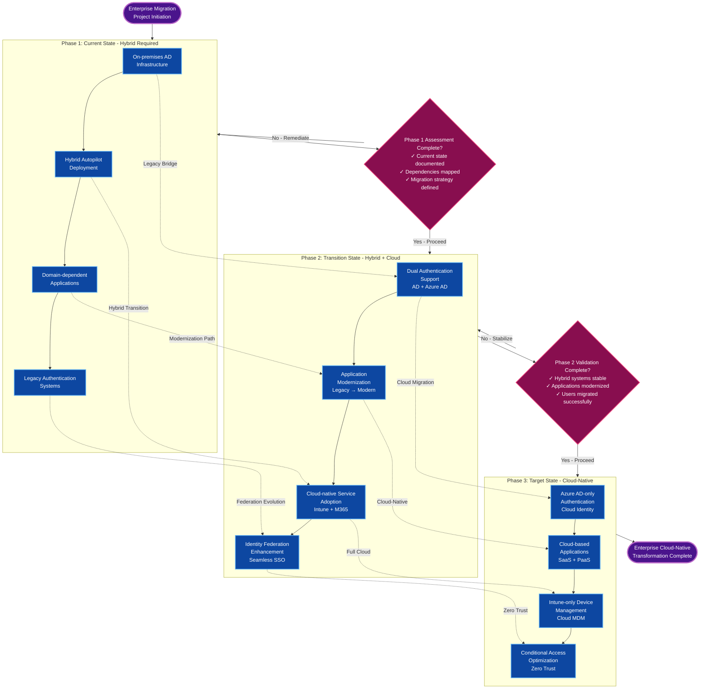

**Architecture Transformation Summary:**

| Phase | Duration | Focus Area | Key Deliverables | Success Criteria |
|-------|----------|------------|------------------|------------------|
| **Phase 1: Current State** | Assessment | Hybrid Infrastructure | Documentation, dependency mapping, migration strategy | Complete understanding of current environment |
| **Phase 2: Transition State** | 12-18 months | Dual Mode Operations | Modern authentication, app modernization, cloud adoption | Stable hybrid environment with cloud services |
| **Phase 3: Target State** | 6-12 months | Cloud-Native Operations | Full cloud migration, infrastructure decommission | Complete cloud-native transformation |

#### Implementation Strategy: Gradual Migration Approach

**Year 1: Stabilize Hybrid Environment**
1. **Optimize current hybrid deployment:**
   ```powershell
   # Enhanced monitoring and alerting
   $hybridHealth = @{
       ConnectorHealth = Get-Service "Microsoft Intune Connector" | Select Status
       DomainConnectivity = Test-ComputerSecureChannel
       CertificateExpiry = Get-ChildItem Cert:\LocalMachine\My | Where {$_.NotAfter -lt (Get-Date).AddDays(30)}
       ComplianceSync = Get-MgDeviceManagementManagedDevice | Where {$_.ComplianceState -eq "unknown"}
   }
   ```

2. **Implement robust monitoring and backup procedures**
3. **Document all hybrid dependencies and constraints**
4. **Create emergency recovery procedures**

**Year 2: Begin Cloud-Native Pilot**
1. **Identify cloud-ready device categories:**
   - New employee devices
   - Replacement devices
   - Non-domain-dependent roles

2. **Pilot cloud-native deployment:**
   ```json
   {
     "pilotCriteria": {
       "deviceTypes": ["New laptops", "Kiosk devices"],
       "userGroups": ["Cloud-first users", "Remote workers"],
       "applications": ["Microsoft 365", "SaaS applications"],
       "constraints": ["No legacy app dependencies"]
     }
   }
   ```

**Year 3: Scale Cloud-Native Adoption**
1. **Application modernization program**
2. **Identity system consolidation**
3. **Legacy infrastructure decommissioning**
4. **Complete migration for remaining devices**

### Emergency Recovery Procedures

#### Emergency Recovery Workflow Overview

**Crisis Response Decision Matrix:**

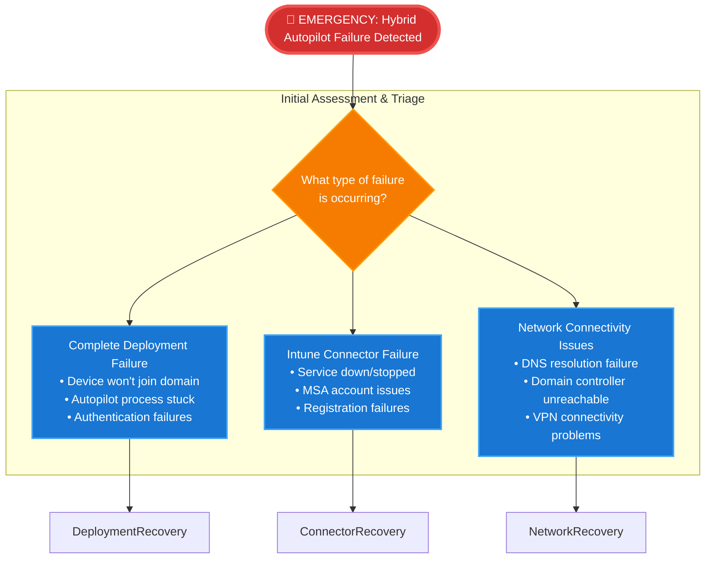

#### Recovery Procedure 1: Complete Hybrid Deployment Failure

**Deployment Failure Recovery Flowchart:**

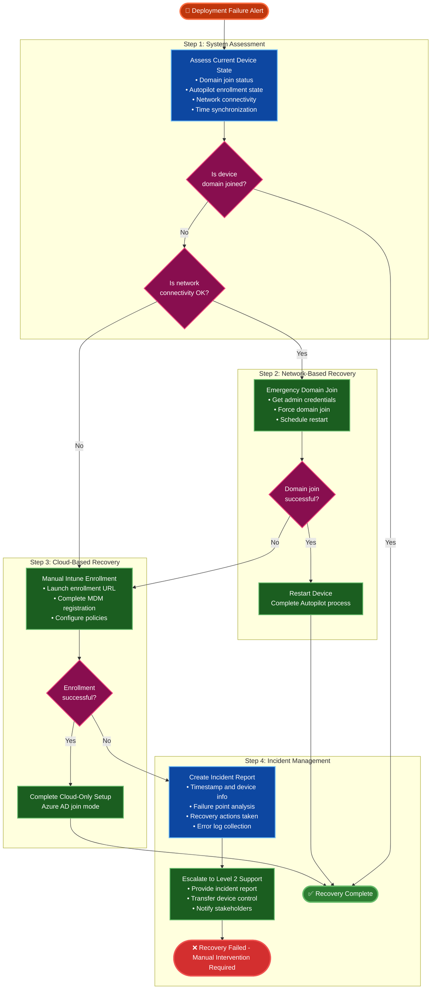

#### Recovery Procedure 2: Intune Connector Failure

**Connector Failure Recovery Flowchart:**

```mermaid
flowchart TD
    ConnectorAlert([🚨 Intune Connector Failure])
    
    subgraph "Step 1: Connector Assessment"
        CheckStatus[Check Connector Status<br/>• Service state<br/>• Version information<br/>• Last error logs<br/>• MSA account health]
        
        ServiceRunning{Is connector<br/>service running?}
        MSAValid{Is MSA account<br/>valid and accessible?}
    end
    
    subgraph "Step 2: Automated Recovery"
        RestartService[Restart Connector Service<br/>• Force service stop<br/>• Wait 30 seconds<br/>• Start service<br/>• Verify operation]
        
        RestartSuccess{Service restart<br/>successful?}
        
        TestConnectivity[Test Connector Functionality<br/>• Azure AD connectivity<br/>• Domain controller access<br/>• Device registration test]
    end
    
    subgraph "Step 3: MSA Account Recovery"
        ReconfigureMSA[Reconfigure MSA Account<br/>• Validate account existence<br/>• Reset account permissions<br/>• Update connector config]
        
        MSARecovery{MSA account<br/>recovery successful?}
        
        ReinstallConnector[Reinstall Connector<br/>• Download latest version<br/>• Remove old installation<br/>• Fresh installation<br/>• Configure MSA]
    end
    
    subgraph "Step 4: Emergency Response"
        CriticalAlert[Send Critical Alert<br/>• Notify infrastructure team<br/>• Notify on-call engineer<br/>• Update incident board<br/>• Block new deployments]
        
        ContactMicrosoft[Contact Microsoft Support<br/>• Create support case<br/>• Provide diagnostic data<br/>• Request escalation]
        
        ConnectorFixed([✅ Connector Restored])
        RequiresSupport([❌ Microsoft Support Required])
    end
    
    %% Main flow
    ConnectorAlert --> CheckStatus
    CheckStatus --> ServiceRunning
    ServiceRunning -->|No| RestartService
    ServiceRunning -->|Yes| MSAValid
    
    RestartService --> RestartSuccess
    RestartSuccess -->|Yes| TestConnectivity
    RestartSuccess -->|No| CriticalAlert
    
    TestConnectivity --> MSAValid
    MSAValid -->|Yes| ConnectorFixed
    MSAValid -->|No| ReconfigureMSA
    
    ReconfigureMSA --> MSARecovery
    MSARecovery -->|Yes| ConnectorFixed
    MSARecovery -->|No| ReinstallConnector
    
    ReinstallConnector --> ConnectorFixed
    ReinstallConnector --> CriticalAlert
    
    CriticalAlert --> ContactMicrosoft
    ContactMicrosoft --> RequiresSupport
    
    %% Styling  
    classDef alert fill:#d32f2f,stroke:#ef5350,stroke-width:3px,color:#ffffff
    classDef assessment fill:#1976d2,stroke:#42a5f5,stroke-width:2px,color:#ffffff
    classDef recovery fill:#388e3c,stroke:#66bb6a,stroke-width:2px,color:#ffffff
    classDef decision fill:#f57c00,stroke:#ff9800,stroke-width:2px,color:#ffffff
    classDef emergency fill:#9c27b0,stroke:#ba68c8,stroke-width:2px,color:#ffffff
    classDef success fill:#4caf50,stroke:#66bb6a,stroke-width:3px,color:#ffffff
    classDef escalation fill:#d32f2f,stroke:#ef5350,stroke-width:3px,color:#ffffff
    
    class ConnectorAlert alert
    class CheckStatus assessment
    class RestartService,TestConnectivity,ReconfigureMSA,ReinstallConnector recovery
    class ServiceRunning,MSAValid,RestartSuccess,MSARecovery decision
    class CriticalAlert,ContactMicrosoft emergency
    class ConnectorFixed success
    class RequiresSupport escalation
```

**Emergency Contact Matrix:**

| Failure Type | Response Time | Primary Contact | Secondary Contact | Escalation Level |
|-------------|---------------|-----------------|-------------------|------------------|
| **Complete Deployment Failure** | 30 minutes | IT Operations Team | Device Management Team | Level 2 → Level 3 |
| **Intune Connector Failure** | 15 minutes | Infrastructure Team | Microsoft Premier Support | Level 2 → Microsoft |
| **Network Connectivity Issues** | 15 minutes | Network Operations | Domain Controller Team | Level 1 → Level 2 |
| **MSA Account Issues** | 30 minutes | Identity Team | Security Team | Level 2 → Level 3 |

**Recovery Success Metrics:**

| Recovery Type | Target Resolution Time | Success Rate Target | Escalation Threshold |
|--------------|----------------------|-------------------|-------------------|
| **Deployment Recovery** | 2 hours | 85% | 90 minutes without progress |
| **Connector Recovery** | 1 hour | 95% | 45 minutes without progress |
| **Network Recovery** | 30 minutes | 90% | 20 minutes without progress |
| **Account Recovery** | 1 hour | 80% | 45 minutes without progress |

## Monitoring and Alerting Framework

### Critical Monitoring Points

**Hybrid Autopilot Monitoring Architecture:**

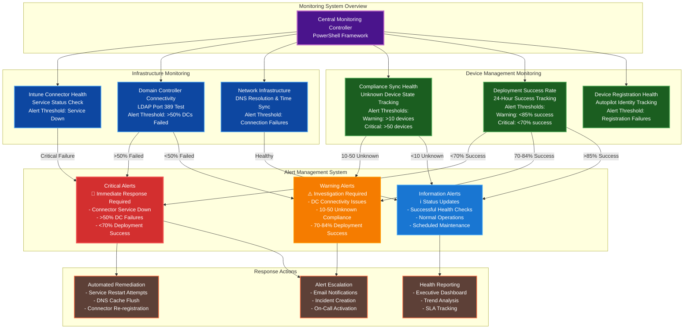

**Monitoring Thresholds and Response Matrix:**

| Monitoring Component | OK Status | Warning Threshold | Critical Threshold | Auto-Remediation | Escalation Time |
|---------------------|-----------|-------------------|-------------------|------------------|-----------------|
| **Intune Connector Service** | Running | Service Stopped | Service Failed + Restart Failed | Service restart attempt | Immediate |
| **Domain Controller Connectivity** | All DCs accessible | 1-49% DC failures | >50% DC failures | Network diagnostics | 15 minutes |
| **Compliance Sync Health** | <10 unknown devices | 10-50 unknown devices | >50 unknown devices | Force sync attempt | 30 minutes |
| **Deployment Success Rate** | >85% success | 70-84% success | <70% success | Deployment analysis | 1 hour |
| **Device Registration Health** | All registrations successful | <5% failure rate | >5% failure rate | Certificate refresh | 15 minutes |
| **Network Infrastructure** | All tests pass | DNS/Time sync issues | Complete connectivity failure | Cache flush/sync | Immediate |

**PowerShell Implementation Reference:**
```powershell
# Critical monitoring checks implementation
# See full PowerShell monitoring framework in supplementary scripts
$monitoringChecks = @{
    ConnectorService = { Get-Service "Microsoft Intune Connector" }
    DomainConnectivity = { Test-NetConnection -ComputerName $dcs -Port 389 }
    ComplianceSync = { Get-MgDeviceManagementManagedDevice | Where ComplianceState -eq "unknown" }
    DeploymentSuccess = { Calculate 24-hour success rate from Autopilot device identities }
}
```

## Migration Planning Framework

### Assessment Questionnaire for Cloud-Native Migration

#### Organizational Readiness Assessment

**Cloud-Native Migration Readiness Decision Tree:**

```mermaid
flowchart TD
    Start[Start Migration Assessment]
    
    subgraph Phase1 ["Phase 1: Application Dependencies"]
        AppStart{Applications require<br/>domain authentication?}
        AppCatalog[Catalog Domain Apps<br/>IIS Windows Auth<br/>Desktop AD Apps<br/>Database Integrated Security]
        AppHardCoded{Hard-coded domain<br/>dependencies exist?}
        AppModern[Assess Modernization<br/>API Authentication<br/>OAuth2 SAML Integration<br/>Application Proxy Support]
        AppCostBenefit[Calculate Migration Costs<br/>Development Effort<br/>Business Disruption<br/>Training Requirements]
    end
    
    subgraph Phase2 ["Phase 2: Infrastructure Dependencies"]
        InfraStart{Infrastructure depends<br/>on Active Directory?}
        FileShares[Document File Dependencies<br/>Windows File Servers<br/>DFS Namespaces<br/>NTFS Permissions]
        NetworkRes[Network Resources<br/>Print Services<br/>Network Devices<br/>Monitoring Systems]
        BackupSys[Backup and Monitoring<br/>Software Integration<br/>Tool Authentication<br/>Management Systems]
    end
    
    subgraph Phase3 ["Phase 3: Compliance and Security"]
        ComplianceStart{Regulatory requirements<br/>for on-premises AD?}
        Regulatory[Review Constraints<br/>Data Residency Laws<br/>Industry Compliance<br/>Security Requirements]
        DataSovereignty[Data Sovereignty<br/>Geographic Restrictions<br/>Cloud Limitations<br/>Cross-border Transfer]
        AuditReporting[Audit Requirements<br/>Compliance Reporting<br/>Log Retention<br/>Control Frameworks]
        SecurityPolicies[Security Compatibility<br/>Conditional Access<br/>Zero Trust Readiness<br/>Identity Governance]
    end
    
    subgraph Phase4 ["Phase 4: User Experience Impact"]
        UXStart{Migration impacts<br/>user experience?}
        UserTraining[Training Requirements<br/>New Authentication<br/>Self-service Support<br/>Procedures]
        SSOChanges[SSO Experience<br/>Application Access<br/>Authentication Flows<br/>Password Policies]
        RemoteAccess[Remote Access Impact<br/>VPN Dependencies<br/>Home Networks<br/>Mobile Devices]
    end
    
    subgraph Results ["Assessment Results"]
        LowComplexity[Low Complexity<br/>Minimal AD Dependencies<br/>Cloud-ready Apps<br/>Direct Migration]
        MediumComplexity[Medium Complexity<br/>Some Legacy Dependencies<br/>Modernization Needed<br/>Phased Approach]
        HighComplexity[High Complexity<br/>Extensive AD Integration<br/>Legacy Constraints<br/>Hybrid-first Strategy]
        BlockingIssues[Migration Blockers<br/>Compliance Constraints<br/>Unsupported Systems<br/>Remain Hybrid]
    end
    
    %% Phase 1 Flow
    Start --> AppStart
    AppStart -->|Yes| AppCatalog
    AppStart -->|No| InfraStart
    AppCatalog --> AppHardCoded
    AppHardCoded -->|Yes| AppModern
    AppHardCoded -->|No| AppCostBenefit
    AppModern --> AppCostBenefit
    AppCostBenefit --> InfraStart
    
    %% Phase 2 Flow
    InfraStart -->|Yes| FileShares
    InfraStart -->|No| ComplianceStart
    FileShares --> NetworkRes
    NetworkRes --> BackupSys
    BackupSys --> ComplianceStart
    
    %% Phase 3 Flow
    ComplianceStart -->|Yes| Regulatory
    ComplianceStart -->|No| UXStart
    Regulatory --> DataSovereignty
    DataSovereignty --> AuditReporting
    AuditReporting --> SecurityPolicies
    SecurityPolicies --> UXStart
    
    %% Phase 4 Flow
    UXStart -->|Yes| UserTraining
    UXStart -->|No| LowComplexity
    UserTraining --> SSOChanges
    SSOChanges --> RemoteAccess
    
    %% Results Flow
    RemoteAccess --> LowComplexity
    RemoteAccess --> MediumComplexity
    RemoteAccess --> HighComplexity
    RemoteAccess --> BlockingIssues
    
    %% Vibrant Autopilot Documentation Color Scheme
    classDef phase1 fill:#0d47a1,stroke:#64b5f6,stroke-width:2px,color:#ffffff
    classDef phase2 fill:#4a148c,stroke:#ba68c8,stroke-width:2px,color:#ffffff
    classDef phase3 fill:#5d4037,stroke:#ff9800,stroke-width:2px,color:#ffffff
    classDef phase4 fill:#1b5e20,stroke:#66bb6a,stroke-width:2px,color:#ffffff
    classDef decision fill:#880e4f,stroke:#ec407a,stroke-width:2px,color:#ffffff
    classDef result fill:#bf360c,stroke:#ff7043,stroke-width:3px,color:#ffffff
    classDef start fill:#4a148c,stroke:#ba68c8,stroke-width:3px,color:#ffffff
    
    class Start start
    class AppStart,AppHardCoded,InfraStart,ComplianceStart,UXStart decision
    class AppCatalog,AppModern,AppCostBenefit phase1
    class FileShares,NetworkRes,BackupSys phase2
    class Regulatory,DataSovereignty,AuditReporting,SecurityPolicies phase3
    class UserTraining,SSOChanges,RemoteAccess phase4
    class LowComplexity,MediumComplexity,HighComplexity,BlockingIssues result
```

**Assessment Scoring Matrix:**

| Assessment Category | Weight | Low Score (1-3) | Medium Score (4-6) | High Score (7-10) | Impact on Migration |
|-------------------|--------|-----------------|-------------------|------------------|-------------------|
| **Application Dependencies** | 35% | Few cloud-ready apps | Mixed app portfolio | Extensive legacy apps | Determines modernization effort |
| **Infrastructure Dependencies** | 25% | Cloud services ready | Some on-premises deps | Heavy infrastructure integration | Affects timeline and complexity |
| **Compliance & Security** | 25% | Cloud compliance ready | Some regulatory constraints | Strict compliance requirements | May block or delay migration |
| **User Experience Impact** | 15% | Minimal user impact | Moderate training needed | Significant workflow changes | Influences change management |

**Migration Path Decision Logic:**

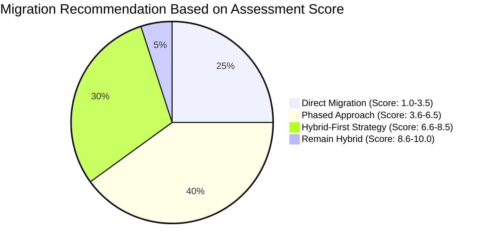

#### Migration Planning Timeline

**Enterprise Migration Project Timeline:**

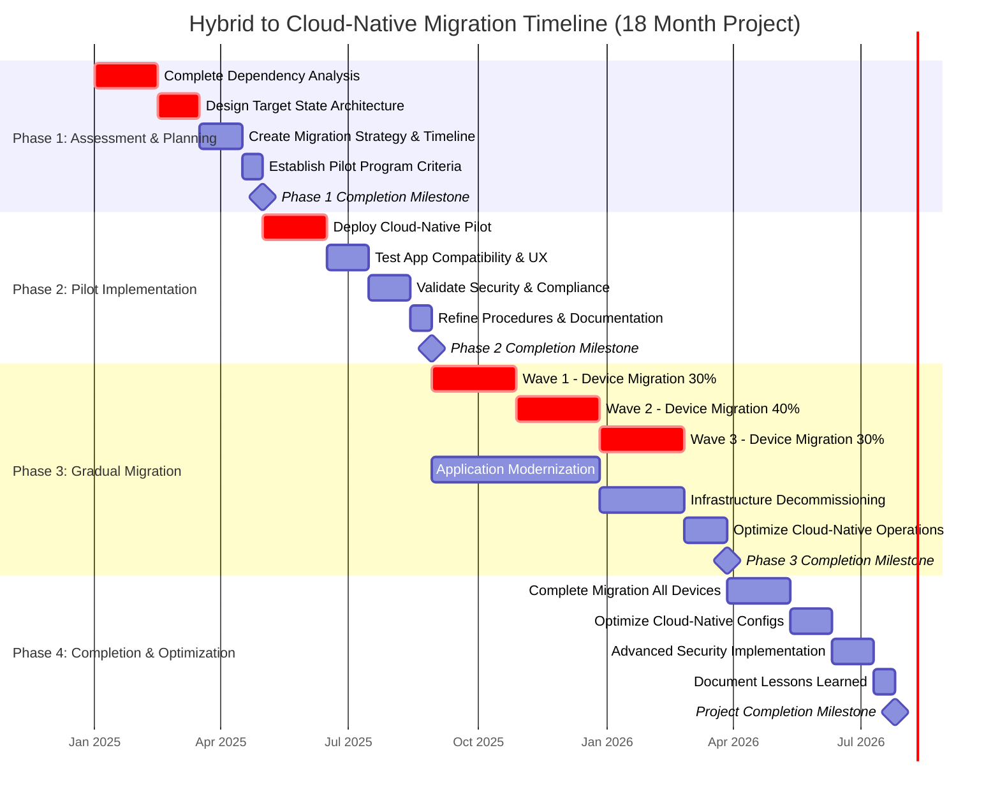

**Migration Wave Strategy and Risk Mitigation:**

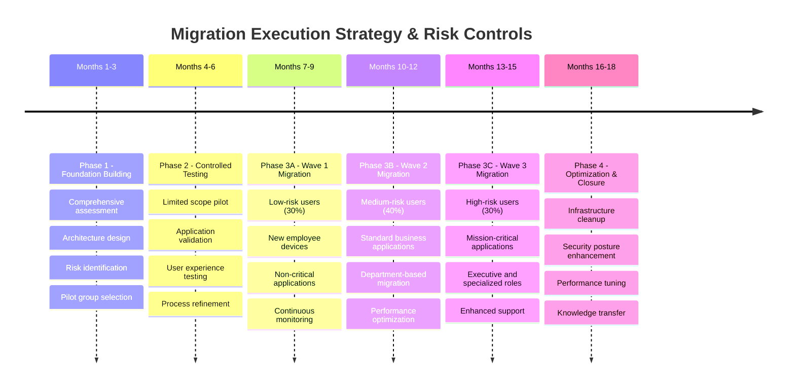

**Migration Success Criteria and Checkpoints:**

| Phase | Success Criteria | Key Deliverables | Go/No-Go Decision Points |
|-------|------------------|------------------|------------------------|
| **Phase 1: Assessment** | 100% inventory complete<br/>Architecture approved<br/>Strategy validated | Dependency matrix<br/>Target architecture<br/>Migration plan<br/>Pilot criteria | Executive approval<br/>Budget confirmation<br/>Resource allocation |
| **Phase 2: Pilot** | Pilot success >90%<br/>User satisfaction >80%<br/>No critical issues | Working pilot environment<br/>Validated procedures<br/>Performance baselines<br/>Issue resolution process | Technical validation<br/>User acceptance<br/>Security compliance |
| **Phase 3: Migration** | Wave completion rates<br/>Application functionality<br/>Security maintained<br/>Performance targets met | Migrated user groups<br/>Modernized applications<br/>Decommissioned infrastructure<br/>Operational procedures | Wave success criteria<br/>Risk tolerance levels<br/>Business continuity |
| **Phase 4: Completion** | 100% migration complete<br/>All objectives achieved<br/>Performance optimized<br/>Documentation complete | Cloud-native environment<br/>Optimized configurations<br/>Advanced security features<br/>Knowledge base | Final acceptance<br/>Performance validation<br/>Business sign-off |

## Conclusion and Recommendations

### Strategic Recommendations

1. **Immediate Actions (0-3 months):**
   - Upgrade Intune Connector before June 2025 deadline
   - Document all hybrid dependencies and constraints
   - Implement comprehensive monitoring and alerting
   - Create emergency recovery procedures

2. **Short-term Actions (3-12 months):**
   - Begin cloud-native pilot program for new devices
   - Assess application modernization opportunities
   - Implement hybrid-to-cloud bridge architecture
   - Train IT staff on cloud-native deployment procedures

3. **Long-term Strategy (12-24 months):**
   - Execute phased migration to cloud-native approach
   - Decommission hybrid infrastructure where possible
   - Optimize cloud-native security and compliance posture
   - Achieve strategic alignment with Microsoft's cloud-first direction

### Risk Mitigation Summary

**Enterprise Risk Assessment and Prioritization Matrix:**

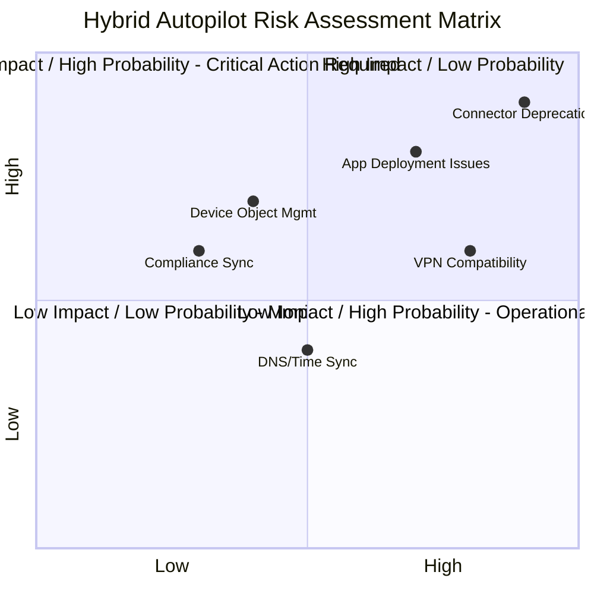

**Risk Prioritization and Response Strategy:**

| Risk Category | Risk Name | Impact Level | Probability | Priority Score | Response Strategy | Timeline | Owner |
|---------------|-----------|--------------|-------------|----------------|-------------------|----------|-------|
| **Critical Risks** | Intune Connector Deprecation (June 2025) | Very High | Very High | 9.9 | Immediate upgrade to new connector with MSA | Q1 2025 | Infrastructure Team |
| **High Priority** | Application Deployment Context Issues | High | High | 8.0 | Enhanced monitoring and staged deployment | Q1 2025 | Application Team |
| **High Priority** | VPN Compatibility Limitations | High | Medium | 6.8 | Always-On VPN implementation | Q2 2025 | Network Team |
| **Medium Priority** | Duplicate Device Object Management | Medium | Medium | 4.9 | Automated cleanup processes | Q2 2025 | Identity Team |
| **Medium Priority** | Compliance State Sync Delays | Low | Medium | 3.6 | User communication and grace periods | Q3 2025 | Compliance Team |
| **Low Priority** | DNS and Time Sync Dependencies | Medium | Low | 2.5 | Infrastructure hardening | Q3 2025 | Infrastructure Team |

**Risk Response Framework:**

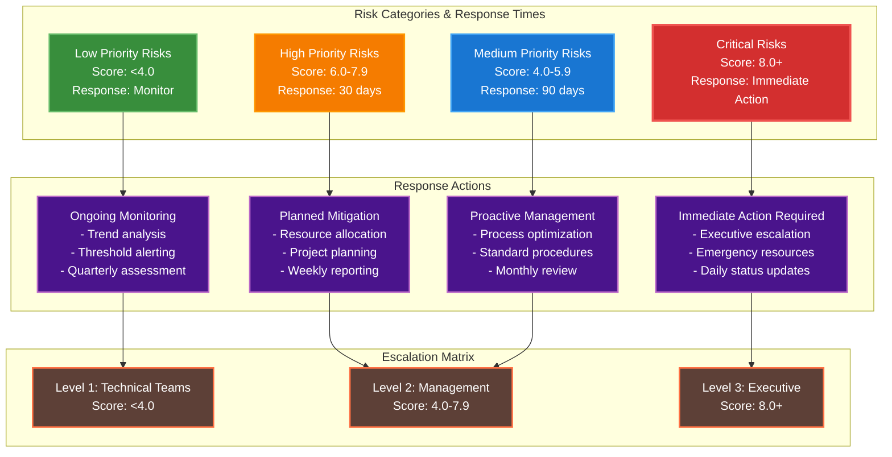

**Risk Monitoring Dashboard:**

| Risk Monitoring Area | Key Metrics | Alert Thresholds | Review Frequency |
|--------------------- |-------------|------------------|------------------|
| **Deployment Success Rates** | Success percentage, failure analysis, user feedback | Warning: <85%, Critical: <70% | Daily |
| **Connector Health** | Service status, MSA account health, connectivity | Warning: Service issues, Critical: Service down | Real-time |
| **Domain Controller Connectivity** | Response times, availability, authentication success | Warning: >5% failures, Critical: >20% failures | Every 5 minutes |
| **User Experience Metrics** | Satisfaction scores, help desk tickets, training completion | Warning: <80% satisfaction, Critical: <60% satisfaction | Weekly |
| **Security and Compliance** | Policy violations, audit findings, security incidents | Warning: Minor violations, Critical: Security breaches | Daily |

---

## Cross-References

### Related Documentation
- **[Complete Setup Guide](../setup-guides/)** - Complete setup and configuration procedures
- **[Administrator Quick Reference](../quick-reference/)** - Daily administration and troubleshooting reference

### Microsoft Official Resources
- **[Windows Autopilot Hybrid Known Issues](https://learn.microsoft.com/en-us/autopilot/known-issues)** - Latest known issues and Microsoft workarounds
- **[Intune Connector for Active Directory](https://learn.microsoft.com/en-us/mem/intune/enrollment/windows-autopilot-hybrid)** - Official connector documentation
- **[Microsoft Entra Join vs Hybrid Join Decision Guide](https://learn.microsoft.com/en-us/entra/identity/devices/device-join-plan)** - Strategic guidance for join type selection

### Community Resources
- **[Microsoft Tech Community - Intune Forum](https://techcommunity.microsoft.com/t5/microsoft-intune/ct-p/Microsoft-Intune)** - Peer support and discussion
- **[Microsoft 365 Roadmap](https://www.microsoft.com/microsoft-365/roadmap)** - Future feature and deprecation announcements

---

*This document provides comprehensive coverage of Windows Autopilot hybrid deployment limitations and workarounds for 2025. Organizations should use this information to make informed decisions about their device deployment strategy while planning migration to cloud-native approaches in alignment with Microsoft's strategic direction.*