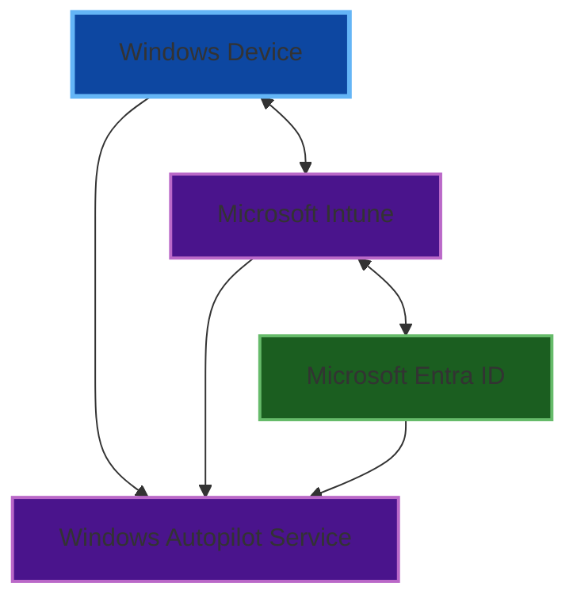

# Microsoft Autopilot Comprehensive Setup Guide (2025)

## Metadata
- **Document Type**: Microsoft Autopilot Setup Guide
- **Version**: 1.0.3
- **Last Updated**: 2025-08-27 (Added comprehensive dynamic group filters)
- **Target Audience**: IT Administrators, System Engineers, Infrastructure Teams
- **Scope**: Complete Windows Autopilot deployment configuration and management
- **Platform Compatibility**: Windows 10 (1809+), Windows 11, Intune, Microsoft Entra ID

## Executive Summary

Microsoft Windows Autopilot is a cloud-based deployment technology that provides a streamlined device provisioning experience for organizations. This guide covers Windows Autopilot setup, configuration, and deployment for 2025, incorporating the latest features, security enhancements, and best practices.

**Key 2025 Updates:**
- Enterprise App Catalog (EAM) Apps Support (June 2025)
- Enhanced Intune Connector for Active Directory with security improvements
- Low privileged account enhancements for hybrid join scenarios
- Deprecation timeline for legacy Intune Connector (June 2025)

**Microsoft's Current Recommendation:** Microsoft strongly recommends deploying new devices as cloud-native using Microsoft Entra join rather than hybrid join for optimal security and functionality.

## Service Overview

### What is Windows Autopilot?

Windows Autopilot is a collection of technologies used to set up and pre-configure new devices, getting them ready for productive use. It simplifies the Windows device lifecycle for both IT and end users, from initial deployment through end-of-life management.

### Core Capabilities
- **Zero-touch deployment** for new devices
- **Self-service deployment** for end users
- **Device reset and reprovisioning**
- **Integration with Microsoft Intune** for device management
- **Compliance and security policy enforcement**
- **Application deployment during provisioning**

### Deployment Scenarios Supported
1. **User-driven mode** - User initiates and completes setup
2. **Self-deploying mode** - Fully automated without user interaction
3. **Pre-provisioning mode** - Technician pre-configures before delivery
4. **Existing devices** - Transform existing Windows installations

## Architecture and Dependencies

### Core Service Dependencies

#### Required Microsoft Services
- **Microsoft Intune** - Primary device management platform
- **Microsoft Entra ID** - Identity and access management
- **Windows Autopilot Deployment Service** - Core provisioning engine
- **Windows 10/11** - Supported operating system versions

#### Infrastructure Requirements
- **Internet connectivity** - Required for cloud services access
- **DNS resolution** - For Microsoft service endpoints
- **Time synchronization** - Critical for certificate validation
- **Network bandwidth** - Sufficient for app downloads and updates

### Service Integration Architecture



### Hybrid Join Additional Dependencies (Not Recommended)

**⚠️ IMPORTANT: Microsoft does not recommend hybrid join for new deployments**

If hybrid join is required:
- **Active Directory Domain Services** - On-premises AD infrastructure
- **Azure AD Connect** - Identity synchronization service
- **Intune Connector for Active Directory** - Device join operations
- **Domain Controller Access** - Network connectivity for domain operations
- **VPN Solution** (if required) - For remote domain connectivity

## Prerequisites and Requirements

### Licensing Requirements

#### Required Licenses (Minimum)
- **Microsoft Intune** - Device management
- **Microsoft Entra ID P1** - Advanced identity features
- **Windows 10/11 Pro or Enterprise** - Device licensing

#### Recommended Licenses
- **Microsoft 365 Business Premium** - Complete productivity suite
- **Microsoft Entra ID P2** - Advanced security features
- **Microsoft Defender for Business** - Endpoint security

### Administrative Permissions

#### Microsoft Entra ID Roles
- **Global Administrator** - Initial setup and configuration
- **Intune Administrator** - Device management operations
- **Cloud Device Administrator** - Device registration and management

#### Intune Role-Based Access
- **Policy and Profile Manager** - Configuration profile management
- **Application Manager** - App deployment configuration
- **Help Desk Operator** - Device troubleshooting support

### Network Requirements

#### Required Endpoints (Firewall Configuration)

| Service | Direction | Port | Endpoint |
|---------|-----------|------|-----------|
| Microsoft Autopilot Services | Outbound | TCP 443 | login.microsoftonline.com <br/> *.manage.microsoft.com <br/> *.windowsupdate.com <br/> *.delivery.mp.microsoft.com |
| Device Registration | Outbound | TCP 443 | enterpriseregistration.windows.net <br/> device.login.microsoftonline.com |
| Certificate Services | Outbound | TCP 443 | crl.microsoft.com <br/> *.public-trust.com |
| Time Synchronization | Outbound | UDP 123 | time.windows.com |

#### DNS Configuration Requirements

For organizations using custom domains, a DNS CNAME record is required:

| Record Type | Name | Points To | Purpose |
|-------------|------|-----------|---------|
| CNAME | enterpriseregistration.yourdomain.com | enterpriseregistration.windows.net | Device registration for custom domain |

**Example DNS Configuration:**
```dns
enterpriseregistration.contoso.com    CNAME    enterpriseregistration.windows.net
```

**Notes:**
- Replace `yourdomain.com` with your organization's verified domain
- This CNAME record enables device registration using your custom domain
- Required for both Entra join and hybrid join scenarios
- Must be configured in your public DNS zone

### Hardware Requirements

#### Supported Devices
- **Windows 10** version 1809 or later
- **Windows 11** all versions
- **TPM 2.0** chip (recommended for security features)
- **UEFI firmware** (required for secure boot)
- **Network connectivity** (Ethernet or Wi-Fi)

#### Storage Requirements
- **Minimum 64 GB** available storage
- **SSD recommended** for optimal performance
- **Additional space** for applications and updates

## Step-by-Step Setup Process

### Phase 1: Initial Configuration

#### Step 1: Enable Automatic Intune Enrollment

**Location:** Microsoft Entra admin center > Mobility (MDM and MAM) > Microsoft Intune

1. Navigate to Microsoft Entra admin center
2. Go to **Identity** > **Mobility (MDM and MAM)**
3. Select **Microsoft Intune**
4. Configure MDM user scope:
   - **All** - For organization-wide deployment
   - **Some** - For pilot groups
   - **None** - Disabled

**Critical Settings:**
```
MDM User Scope: All
MDM URLs: (Auto-populated by Microsoft)
MAM User Scope: All (recommended)
```

#### Step 2: Configure Device Registration Settings

**Location:** Microsoft Entra admin center > Devices > Device settings

1. Navigate to **Devices** > **Device settings**
2. Configure key settings:
   - **Users may join devices to Microsoft Entra ID**: Yes
   - **Additional local administrators on Microsoft Entra joined devices**: Configure as needed
   - **Require Multi-Factor Authentication to register or join devices**: Yes (recommended)

### Phase 2: Windows Autopilot Configuration

#### Step 3: Create Device Groups

**Location:** Microsoft Entra admin center > Groups

1. Create dynamic device groups for Autopilot management:

**Example: All Autopilot Devices Group**
```
Group Type: Security
Membership Type: Dynamic Device
Dynamic membership rule:
(device.devicePhysicalIds -any _ -startswith "[ZTDId]")
```

**Example: Hybrid Autopilot Devices (if required)**
```
Group Type: Security
Membership Type: Dynamic Device
Dynamic membership rule:
(device.devicePhysicalIds -any _ -eq "[OrderID]:hybrid")
```

**Additional Dynamic Group Filter Examples:**

**Join Type Filtering:**
```
# Entra joined devices only
(device.trustType -eq "AzureAd")

# Hybrid joined devices only
(device.trustType -eq "ServerAd")
```

**Operating System Targeting:**
```
# Windows 11 devices
(device.deviceOSVersion -startswith "10.0.22")

# Windows 10 devices
(device.deviceOSVersion -startswith "10.0.19")
```

**Hardware-Based Groups:**
```
# Specific manufacturer
(device.deviceManufacturer -eq "Dell Inc.")

# Device model targeting
(device.deviceModel -contains "Latitude")
```

**Management State Filtering:**
```
# MDM enrolled devices
(device.managementType -eq "MDM")

# Recently registered (fixed date - update manually)
(device.registrationDateTime -ge "2024-08-01T00:00:00Z")

# NOTE: Dynamic groups do NOT support rolling dates like now() or relative dates
# You must update the timestamp manually or use PowerShell automation

# WORKAROUND: PowerShell script to update dynamic group rules monthly
# $thirtyDaysAgo = (Get-Date).AddDays(-30).ToString("yyyy-MM-ddTHH:mm:ssZ")
# $newRule = "(device.registrationDateTime -ge `"$thirtyDaysAgo`")"
# Update-MgGroup -GroupId $groupId -MembershipRule $newRule
```

**⚠️ Dynamic Group Limitations:**

**Cannot Do (Not Supported):**
```
# These DO NOT work - dynamic groups cannot reference other groups
(device.memberOf -contains "group-id")
(device.groups -any _ -eq "Pilot Devices")
-not (device.memberOf -contains "excluded-group-id")
```

**Workarounds for Group-Based Logic:**

**Option 1: Replicate Logic with Device Properties**
```
# Instead of excluding a "Pilot Group", use device properties
(device.devicePhysicalIds -any _ -startswith "[ZTDId]") and -not (device.devicePhysicalIds -any _ -eq "[OrderID]:pilot")

# Instead of targeting "Finance Group", use naming or tags
(device.displayName -startswith "FIN-") or (device.devicePhysicalIds -any _ -eq "[OrderID]:finance")
```

**Option 2: Use Static Groups with Nested Membership**
```
Static Group A: Contains Dynamic Group 1 + Dynamic Group 2
Static Group B: Contains Dynamic Group 1 - Static exclusion list
```

**Option 3: Administrative Units (Advanced)**
```
# Use administrative unit membership (limited scenarios)
(device.administrativeUnitIds -any _ -eq "au-id-here")
```

**Complex Combination Rules:**
```
# Hybrid Autopilot corporate devices
(device.trustType -eq "ServerAd") and (device.devicePhysicalIds -any _ -startswith "[ZTDId]") and (device.displayName -startswith "CORP-")

# New Windows 11 Entra devices
(device.trustType -eq "AzureAd") and (device.deviceOSVersion -startswith "10.0.22") and (device.registrationDateTime -ge "2024-01-01T00:00:00Z")
```

#### Step 4: Register Windows Autopilot Devices

**Method 1: Manual Registration (Small Scale)**

**Location:** Microsoft Intune admin center > Devices > Windows > Windows enrollment > Windows Autopilot

1. Navigate to **Devices** > **Windows** > **Windows enrollment** > **Windows Autopilot**
2. Select **Import**
3. Upload CSV file with device information:

**CSV Format:**
```csv
Device Serial Number,Windows Product ID,Hardware Hash,Group Tag,Assigned User
SERIALNUMBER1,PRODUCTID1,HARDWAREHASH1,hybrid,user@company.com
```

**Method 2: Automated Registration (Recommended)**

Use PowerShell script on devices:
```powershell
# Get-WindowsAutoPilotInfo.ps1
Install-Script -Name Get-WindowsAutoPilotInfo
Get-WindowsAutoPilotInfo.ps1 -OutputFile AutoPilotHWID.csv
```

**Alternative:** Use our comprehensive device registration script: **[device-registration-script.ps1](../templates/device-registration-script.ps1)**

#### Step 5: Create Autopilot Deployment Profile

**Location:** Microsoft Intune admin center > Devices > Windows > Windows enrollment > Windows Autopilot > Deployment profiles

1. Select **Create Profile** > **Windows PC**
2. Configure basic settings:

**Profile Configuration:**
```
Name: Corporate Devices - User Driven
Description: Standard corporate device deployment profile
Convert all targeted devices to Autopilot: Yes (recommended)
Deployment mode: User-driven
Join to Microsoft Entra ID as: Microsoft Entra joined
Microsoft Software License Terms: Hide
Privacy settings: Hide
Hide change account options: Hide
User account type: Standard
Allow White Glove OOBE: Yes (for pre-provisioning)
Apply device name template: Yes
Device name template: CORP-%RAND:5%
```

**Advanced Settings:**
```
Language (Region): Select appropriate region
Automatically configure keyboard: Yes
Apply device name template: Enable if standardized naming required
```

### Phase 3: Application and Policy Configuration

#### Step 6: Configure Enrollment Status Page (ESP)

**Location:** Microsoft Intune admin center > Devices > Windows > Windows enrollment > Enrollment Status Page

1. Create Enrollment Status Page profile:

**ESP Configuration:**
```
Name: Corporate Device ESP
Show app and profile installation progress: Yes
Show an error when installation takes longer than specified number of minutes: 60
Show custom message when an error occurs: Yes
Allow users to collect logs about installation errors: Yes
Block device use until all apps and profiles are installed: Yes
Allow users to reset device if installation error occurs: Yes
Block device use until required apps are installed: Yes
```

#### Step 7: Deploy Required Applications

**Location:** Microsoft Intune admin center > Apps > All apps

Configure applications for deployment during Autopilot:

**Win32 App Configuration (Recommended):**
```powershell
# Convert MSI to Win32 app using Content Prep Tool
IntuneWinAppUtil.exe -c C:\Source -s MyApp.msi -o C:\Output

# Assignment settings for Autopilot deployment:
Assignment Type: Required
Available for enrolled devices: Yes
Device install context: System
```

**Essential Applications to Consider:**
- Microsoft 365 Apps for Enterprise
- Company Portal app
- Security software (Defender, VPN client)
- Line-of-business applications

### Phase 4: Security and Compliance Configuration

#### Step 8: Configure Compliance Policies

**Location:** Microsoft Intune admin center > Devices > Compliance policies

Create device compliance policy:

**Windows 10/11 Compliance Policy:**
```
Name: Windows Corporate Compliance
Platform: Windows 10 and later

Device Health Settings:
- BitLocker: Require
- Secure Boot: Require
- Code integrity: Require

Device Properties:
- Minimum OS version: 10.0.19041 (Windows 10 20H2)
- Maximum OS version: Not configured

System Security:
- Password required: Yes
- Password complexity: Required
- Password minimum length: 8 characters
- Password required type: Complex
```

#### Step 9: Configure Conditional Access Policies

**Location:** Microsoft Entra admin center > Security > Conditional Access

Create device-based conditional access:

**Policy Configuration:**
```
Name: Autopilot Device Compliance
Assignments:
  Users: All users
  Cloud apps: All cloud apps
  Conditions:
    Device platforms: Windows
    Client apps: All

Access controls:
  Grant: Grant access
  Require device to be marked as compliant: Yes
  Require Microsoft Entra hybrid joined device: No (cloud-native recommended)
```

### Phase 5: Monitoring and Validation

#### Step 10: Configure Monitoring and Reporting

**Location:** Microsoft Intune admin center > Devices > Monitor

Set up monitoring for:
- **Autopilot deployments** - Track deployment success rates
- **Device compliance** - Monitor policy adherence
- **App installation status** - Verify application deployment
- **Enrollment failures** - Identify and resolve issues

**Key Reports to Monitor:**
```
- Windows Autopilot deployment report (30-day retention)
- Device compliance dashboard
- App installation status report
- Failed enrollment report
- Device registration report
```

## Profile Management and Configuration

### Deployment Profile Settings Reference

#### User-Driven Mode Configuration
```
Deployment mode: User-driven
Join type: Microsoft Entra joined
Out-of-box experience (OOBE):
  - Microsoft Software License Terms: Hide
  - Privacy settings: Hide
  - Hide change account options: Hide
  - User account type: Standard
  - Allow White Glove OOBE: Yes
Language and Region:
  - Language: Use device default
  - Automatically configure keyboard: Yes
  - Apply device name template: Optional
```

#### Self-Deploying Mode Configuration
```
Deployment mode: Self-deploying
Join type: Microsoft Entra joined
Out-of-box experience (OOBE):
  - Microsoft Software License Terms: Hide
  - Privacy settings: Hide
  - Skip keyboard selection page: Yes
Language and Region:
  - Language: Use OS default
  - Region: Use OS default
  - Apply device name template: Recommended
  - Device name template: KIOSK-%RAND:4%
```

### Profile Assignment Best Practices

#### Assignment Strategy
1. **Pilot groups first** - Test with limited device groups
2. **Progressive rollout** - Expand to larger groups gradually
3. **Exception handling** - Create specific profiles for special requirements
4. **Profile precedence** - Use oldest profile for conflict resolution

#### Dynamic Group Queries

**Template Available:** **[autopilot-group-rules.txt](../templates/autopilot-group-rules.txt)**

```powershell
# All Autopilot devices
(device.devicePhysicalIds -any _ -startswith "[ZTDId]")

# Devices with specific group tag
(device.devicePhysicalIds -any _ -eq "[OrderID]:finance")

# Hybrid Autopilot devices
(device.devicePhysicalIds -any _ -eq "[OrderID]:hybrid")

# Devices by manufacturer
(device.deviceManufacturer -eq "Dell Inc.")
```

## Application Deployment Configuration

### Win32 App Deployment Best Practices

#### Application Packaging Guidelines
1. **Use Win32 format** for all MSI-based applications
2. **Avoid mixing** Win32 and MSI apps during enrollment
3. **Test thoroughly** in pilot environment before deployment
4. **Configure dependencies** properly between applications

#### Deployment Settings for Autopilot
```
Assignment type: Required
Available for enrolled devices: Yes
Install behavior: System
Device restart behavior: Intune will force a mandatory device restart
Return codes:
  - Success: 0
  - Soft reboot: 1641, 3010
  - Hard reboot: 1618
  - Retry: 1618
```

### Enterprise App Catalog Integration (2025 Feature)

Microsoft introduced Enterprise App Catalog support in June 2025:

**Configuration:**
- Navigate to **Apps** > **Enterprise App Catalog**
- Configure catalog apps for Autopilot deployment
- Enable blocking during Enrollment Status Page
- Test app delivery during OOBE process

## Security Implementation

### BitLocker Configuration

**Location:** Microsoft Intune admin center > Endpoint security > Disk encryption

**BitLocker Policy Configuration:**
```
Platform: Windows 10 and later
Profile type: BitLocker

BitLocker Base Settings:
- Enable BitLocker for OS and data drives: Yes
- Configure drive encryption method and cipher strength: AES 256-bit XTS
- Configure startup key and PIN: TPM
- Configure recovery options: Save recovery information to Microsoft Entra ID
```

### Windows Hello for Business

**Location:** Microsoft Intune admin center > Devices > Configuration profiles

**Windows Hello Configuration:**
```
Platform: Windows 10 and later
Profile type: Identity protection

Windows Hello for Business:
- Configure Windows Hello for Business: Enable
- Use security keys for sign-in: Enable
- Minimum PIN length: 6 characters
- Maximum PIN length: 127 characters
- Lowercase letters in PIN: Not allowed
- Uppercase letters in PIN: Not allowed
- Special characters in PIN: Not allowed
```

### Endpoint Detection and Response

**Microsoft Defender Configuration:**
```
Platform: Windows 10 and later
Profile type: Microsoft Defender for Endpoint (Windows 10 Desktop)

Configuration settings:
- Sample sharing: All samples
- Telemetry reporting frequency: Expedited
- Network protection: Enable (block mode)
- Controlled folder access: Enable
- Attack surface reduction rules: Enable recommended rules
```

## Troubleshooting and Support

### Common Deployment Issues

#### Issue 1: Device Registration Failures

**Symptoms:**
- Device not appearing in Autopilot devices list
- Registration errors during OOBE

**Diagnostic Steps:**
```powershell
# Check device registration status
dsregcmd /status

# Verify hardware hash
Get-CimInstance -Namespace root/cimv2/mdm/dmmap -ClassName MDM_DevDetail_Ext01 -Filter "InstanceID='Ext' AND ParentID='./DevDetail'"
```

**Resolution:**
1. Verify CSV file format and data accuracy
2. Check device hardware compatibility
3. Ensure network connectivity to registration endpoints
4. Re-import device information if necessary

#### Issue 2: Profile Assignment Delays

**Symptoms:**
- Devices not receiving assigned profiles
- Extended wait times during profile assignment

**Resolution:**
1. Check group membership and dynamic rules
2. Verify profile assignment to correct groups
3. Monitor assignment status in Intune admin center
4. Allow up to 24 hours for initial synchronization

#### Issue 3: Application Installation Failures

**Symptoms:**
- Apps failing to install during ESP
- Deployment timeouts

**Diagnostic Tools:**
```powershell
# Check app installation logs
Get-EventLog -LogName Application -Source "Microsoft Intune Management Extension"

# Review Enrollment Status Page logs
Get-EventLog -LogName "Microsoft-Windows-Provisioning-Diagnostics-Provider/Admin"
```

**Resolution:**
1. Verify application package integrity
2. Check system requirements and dependencies
3. Review assignment settings and user context
4. Test application installation manually

### Diagnostic Commands and Tools

#### PowerShell Diagnostic Commands
```powershell
# Get Autopilot diagnostics (requires Get-AutopilotDiagnostics script)
Get-AutopilotDiagnostics -OutputPath C:\Temp\AutopilotDiagnostics.zip

# Check device compliance state
Get-MsolDevice -DeviceId $deviceId

# Review Intune enrollment status
Get-CimInstance -Namespace root/cimv2/mdm/dmmap -ClassName MDM_EnrollmentStatusTracking_TrackingInfo

# Check Windows Autopilot deployment status
Get-CimInstance -Namespace root/cimv2/mdm/dmmap -ClassName MDM_WindowsAutopilot
```

#### Log File Locations
```
Windows Autopilot Logs:
C:\Windows\Logs\Autopilot\

Intune Management Extension Logs:
C:\ProgramData\Microsoft\IntuneManagementExtension\Logs\

ESP Status Logs:
C:\Windows\Logs\ESPStatus\

Domain Join Logs (Hybrid):
C:\Windows\Debug\NetSetup.log
```

### Support Resources

#### Microsoft Documentation Links
- [Intune Device Enrollment](https://learn.microsoft.com/en-us/mem/intune/enrollment/)
- [Microsoft Entra Device Management](https://learn.microsoft.com/en-us/entra/identity/devices/)

#### Community Resources
- Microsoft Tech Community - Intune Forum
- Windows IT Pro Center
- Microsoft 365 Admin Center Message Center

#### Professional Support Options
- Microsoft Premier Support
- Microsoft Unified Support
- Microsoft Partner Support (through certified partners)

## Best Practices Summary

### Planning and Design
1. **Start with cloud-native approach** - Use Microsoft Entra join when possible
2. **Design for scalability** - Plan profile and group structure for growth
3. **Test thoroughly** - Validate configurations in pilot environment
4. **Document standards** - Maintain configuration documentation

### Implementation Guidelines
1. **Follow least privilege principle** - Grant minimal required permissions
2. **Use automation** - Leverage PowerShell and Graph API for scale
3. **Monitor continuously** - Set up proactive monitoring and alerting
4. **Plan for exceptions** - Create processes for non-standard requirements

### Security Considerations
1. **Enable all security features** - BitLocker, Windows Hello, Defender
2. **Implement compliance policies** - Enforce organizational security standards
3. **Use Conditional Access** - Control access based on device compliance
4. **Regular security reviews** - Audit configurations and permissions

### Operational Excellence
1. **Standardize processes** - Document procedures for common tasks
2. **Train support staff** - Ensure help desk can troubleshoot common issues
3. **Maintain current knowledge** - Stay updated with Microsoft feature releases
4. **Performance monitoring** - Track deployment success rates and user satisfaction

## Appendices

### Appendix A: PowerShell Script Examples

#### Device Registration Script
```powershell
<#
.SYNOPSIS
Register devices for Windows Autopilot

.DESCRIPTION
Collects hardware information and registers devices with Windows Autopilot service

.PARAMETER OutputPath
Path to save device registration CSV file

.PARAMETER GroupTag
Optional group tag for device categorization
#>

param(
    [Parameter(Mandatory=$true)]
    [string]$OutputPath,

    [Parameter(Mandatory=$false)]
    [string]$GroupTag = ""
)

# Install required module
if (!(Get-Module -ListAvailable -Name WindowsAutopilotIntune)) {
    Install-Module -Name WindowsAutopilotIntune -Force
}

# Get hardware hash
$hwid = ((Get-CimInstance -CimSession $session -Class Win32_ComputerSystemProduct).UUID +
         (Get-CimInstance -CimSession $session -Class Win32_ComputerSystem).Model +
         (Get-CimInstance -CimSession $session -Class Win32_BIOS).SerialNumber) -join ""

# Create registration data
$deviceInfo = @{
    'Device Serial Number' = (Get-CimInstance -Class Win32_BIOS).SerialNumber
    'Windows Product ID' = (Get-ItemProperty 'HKLM:\SOFTWARE\Microsoft\Windows NT\CurrentVersion').ProductId
    'Hardware Hash' = $hwid
}

if ($GroupTag) {
    $deviceInfo['Group Tag'] = $GroupTag
}

# Export to CSV
$deviceInfo | Export-Csv -Path $OutputPath -NoTypeInformation

Write-Output "Device registration data exported to: $OutputPath"
```

#### Bulk Profile Assignment Script

**Template Available:** **[bulk-profile-assignment.ps1](../templates/bulk-profile-assignment.ps1)**

```powershell
<#
.SYNOPSIS
Bulk assign Autopilot deployment profiles

.DESCRIPTION
Assigns specified Autopilot profile to multiple device groups

.PARAMETER ProfileName
Name of the Autopilot deployment profile

.PARAMETER GroupNames
Array of group names to assign the profile to
#>

param(
    [Parameter(Mandatory=$true)]
    [string]$ProfileName,

    [Parameter(Mandatory=$true)]
    [string[]]$GroupNames
)

# Connect to Microsoft Graph
Connect-MgGraph -Scopes "DeviceManagementServiceConfig.ReadWrite.All"

# Get the deployment profile
$profile = Get-MgDeviceManagementWindowsAutopilotDeploymentProfile -Filter "displayName eq '$ProfileName'"

if (!$profile) {
    Write-Error "Profile '$ProfileName' not found"
    return
}

foreach ($groupName in $GroupNames) {
    # Get the group
    $group = Get-MgGroup -Filter "displayName eq '$groupName'"

    if ($group) {
        # Assign profile to group
        $assignment = @{
            target = @{
                "@odata.type" = "#microsoft.graph.groupAssignmentTarget"
                groupId = $group.Id
            }
        }

        New-MgDeviceManagementWindowsAutopilotDeploymentProfileAssignment -WindowsAutopilotDeploymentProfileId $profile.Id -BodyParameter $assignment
        Write-Output "Assigned profile '$ProfileName' to group '$groupName'"
    } else {
        Write-Warning "Group '$groupName' not found"
    }
}

Write-Output "Profile assignment completed"
```

### Appendix B: Configuration Templates

#### Standard Corporate Profile Template

**Template Available:** **[corporate-profile-template.json](../templates/corporate-profile-template.json)**

```json
{
  "@odata.type": "#microsoft.graph.azureADWindowsAutopilotDeploymentProfile",
  "displayName": "Corporate Standard Profile",
  "description": "Standard deployment profile for corporate devices",
  "language": "os-default",
  "extractHardwareHash": false,
  "deviceNameTemplate": "CORP-%RAND:5%",
  "deviceType": "windowsPc",
  "enableWhiteGlove": true,
  "roleScopeTagIds": ["0"],
  "outOfBoxExperienceSettings": {
    "@odata.type": "microsoft.graph.outOfBoxExperienceSettings",
    "hidePrivacySettings": true,
    "hideEULA": true,
    "userType": "standard",
    "deviceUsageType": "singleUser",
    "skipKeyboardSelectionPage": true,
    "hideEscapeLink": true
  },
  "enrollmentStatusScreenSettings": {
    "@odata.type": "microsoft.graph.windowsEnrollmentStatusScreenSettings",
    "hideInstallationProgress": false,
    "allowDeviceUseBeforeProfileAndAppInstallComplete": false,
    "blockDeviceSetupRetryByUser": false,
    "allowLogCollectionOnInstallFailure": true,
    "customErrorMessage": "Please contact IT support for assistance with device setup.",
    "installProgressTimeoutInMinutes": 60,
    "allowDeviceUseOnInstallFailure": false
  }
}
```

#### Kiosk Self-Deploying Profile Template

**Template Available:** **[kiosk-profile-template.json](../templates/kiosk-profile-template.json)**

```json
{
  "@odata.type": "#microsoft.graph.azureADWindowsAutopilotDeploymentProfile",
  "displayName": "Kiosk Self-Deploying Profile",
  "description": "Self-deploying profile for kiosk devices",
  "language": "os-default",
  "extractHardwareHash": false,
  "deviceNameTemplate": "KIOSK-%RAND:4%",
  "deviceType": "windowsPc",
  "enableWhiteGlove": false,
  "roleScopeTagIds": ["0"],
  "outOfBoxExperienceSettings": {
    "@odata.type": "microsoft.graph.outOfBoxExperienceSettings",
    "hidePrivacySettings": true,
    "hideEULA": true,
    "userType": "administrator",
    "deviceUsageType": "shared",
    "skipKeyboardSelectionPage": true,
    "hideEscapeLink": true
  },
  "enrollmentStatusScreenSettings": {
    "@odata.type": "microsoft.graph.windowsEnrollmentStatusScreenSettings",
    "hideInstallationProgress": false,
    "allowDeviceUseBeforeProfileAndAppInstallComplete": false,
    "blockDeviceSetupRetryByUser": true,
    "allowLogCollectionOnInstallFailure": false,
    "installProgressTimeoutInMinutes": 90,
    "allowDeviceUseOnInstallFailure": false
  }
}
```

### Appendix C: Network Configuration Requirements

#### Firewall Rules for Windows Autopilot
```powershell
# Windows Autopilot Core Services
New-NetFirewallRule -DisplayName "Windows Autopilot - Registration" -Direction Outbound -Protocol TCP -RemotePort 443 -RemoteAddress *.manage.microsoft.com
New-NetFirewallRule -DisplayName "Windows Autopilot - Authentication" -Direction Outbound -Protocol TCP -RemotePort 443 -RemoteAddress login.microsoftonline.com
New-NetFirewallRule -DisplayName "Windows Autopilot - Device Registration" -Direction Outbound -Protocol TCP -RemotePort 443 -RemoteAddress enterpriseregistration.windows.net

# Windows Update Services
New-NetFirewallRule -DisplayName "Windows Update - Autopilot" -Direction Outbound -Protocol TCP -RemotePort 443 -RemoteAddress *.windowsupdate.com
New-NetFirewallRule -DisplayName "Windows Update - Delivery" -Direction Outbound -Protocol TCP -RemotePort 443 -RemoteAddress *.delivery.mp.microsoft.com

# Certificate and Time Services
New-NetFirewallRule -DisplayName "Certificate Validation" -Direction Outbound -Protocol TCP -RemotePort 443 -RemoteAddress crl.microsoft.com
New-NetFirewallRule -DisplayName "Time Synchronization" -Direction Outbound -Protocol UDP -RemotePort 123 -RemoteAddress time.windows.com
```

#### Proxy Configuration for Autopilot

**Template Available:** **[proxy-configuration.ps1](../templates/proxy-configuration.ps1)**

```powershell
# Configure proxy for Autopilot services (if required)
$proxySettings = @{
    ProxyServer = "proxy.company.com:8080"
    ProxyBypass = "*.microsoft.com;*.microsoftonline.com;*.windows.net"
    ProxyAutoConfigURL = "http://proxy.company.com/proxy.pac"
}

# Apply proxy settings to system
netsh winhttp set proxy proxy-server="$($proxySettings.ProxyServer)" bypass-list="$($proxySettings.ProxyBypass)"

# Verify proxy configuration
netsh winhttp show proxy
```

---

## Cross-References

### Related Microsoft Documentation
- **[Windows Autopilot Overview](https://learn.microsoft.com/en-us/autopilot/overview)** - Complete service overview and capabilities
- **[Microsoft Intune Device Enrollment](https://learn.microsoft.com/en-us/mem/intune/enrollment/)** - Device management platform integration
- **[Microsoft Entra Device Management](https://learn.microsoft.com/en-us/entra/identity/devices/)** - Identity and device relationships
- **[Windows Autopilot Known Issues](https://learn.microsoft.com/en-us/autopilot/known-issues)** - Current limitations and workarounds

### Supporting Documentation
- **[Administrator Cheat Sheet](../quick-reference/)** - Quick reference for daily administration
- **[Hybrid Deployment Limitations](../limitations-and-solutions/)** - Hybrid join specific guidance and limitations

### External Resources
- **[Microsoft Tech Community - Intune Forum](https://techcommunity.microsoft.com/t5/microsoft-intune/ct-p/Microsoft-Intune)** - Community support and discussions
- **[Microsoft 365 Roadmap](https://www.microsoft.com/microsoft-365/roadmap)** - Upcoming feature releases and timeline
- **[Microsoft Security Compliance Toolkit](https://www.microsoft.com/download/details.aspx?id=55319)** - Additional security hardening guidance

---

*This comprehensive setup guide provides complete coverage of Windows Autopilot configuration and deployment for 2025. For daily administration tasks and quick reference information, see the accompanying administrator cheat sheet document.*
