# Microsoft Autopilot Architecture and Workflow Diagrams (2025)

## Metadata
- **Document Type**: Technical Architecture Diagrams
- **Version**: 1.1.3
- **Last Updated**: 2025-08-27 (Fixed connectivity test node rendering)
- **Format**: Mermaid Diagrams (Dark Mode Optimized)
- **Scope**: Windows Autopilot service architecture and end-to-end workflow visualization

## Color Legend

| Category | Fill Color | Stroke Color | Usage |
|----------|------------|--------------|-------|
| **Device/Client** | Deep Blue (#1e3a5f / #0d47a1) | Light Blue (#4fc3f7 / #64b5f6) | End user devices, OOBE, ESP |
| **Cloud Services** | Deep Purple (#4a148c) | Light Purple (#ba68c8) | Microsoft cloud services (Intune, Entra ID, etc.) |
| **Security** | Deep Red (#7f1e1e / #b71c1c) | Light Red (#ef5350) | Security services (Defender, DLP, etc.) |
| **On-Premises** | Deep Brown (#5d4037 / #bf360c) | Orange (#ff9800 / #ff7043) | Hybrid infrastructure (AD, DC, etc.) |
| **Supporting** | Deep Green (#2e4e1f / #1b5e20) | Light Green (#8bc34a / #66bb6a) | Supporting services (DNS, NTP, etc.) |
| **Data Flow** | Deep Pink (#880e4f) | Light Pink (#ec407a) | Data types and flow indicators |
| **DMZ/Neutral** | Deep Amber (#5d4e37) | Yellow (#ffc107) | DMZ and neutral zone services |

## Service Integration Architecture (Expanded)

### High-Level Service Architecture

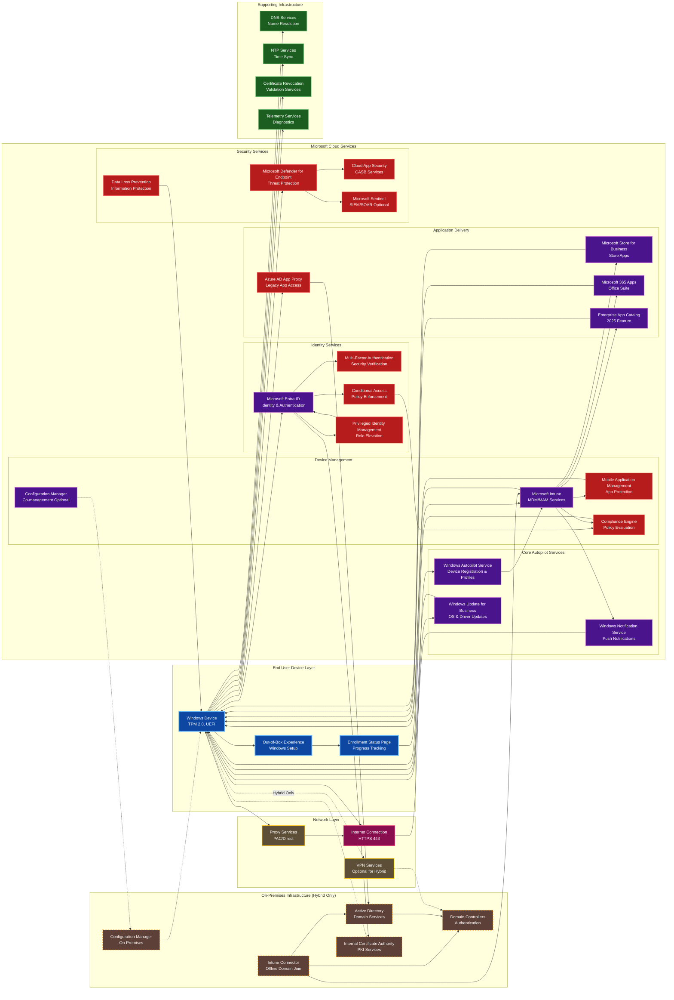
```mermaid
graph LR
    subgraph "End User Device Layer"
        Device[Windows Device<br/>TPM 2.0, UEFI]
        OOBE[Out-of-Box Experience<br/>Windows Setup]
        ESP[Enrollment Status Page<br/>Progress Tracking]
    end

    subgraph "Network Layer"
        Internet[Internet Connection<br/>HTTPS 443]
        VPN[VPN Services<br/>Optional for Hybrid]
        Proxy[Proxy Services<br/>PAC/Direct]
    end

    subgraph "Microsoft Cloud Services"
        subgraph "Core Autopilot Services"
            WAS[Windows Autopilot Service<br/>Device Registration & Profiles]
            WUFB[Windows Update for Business<br/>OS & Driver Updates]
            WNS[Windows Notification Service<br/>Push Notifications]
        end

        subgraph "Identity Services"
            EntraID[Microsoft Entra ID<br/>Identity & Authentication]
            MFA[Multi-Factor Authentication<br/>Security Verification]
            CA[Conditional Access<br/>Policy Enforcement]
            PIM[Privileged Identity Management<br/>Role Elevation]
        end

        subgraph "Device Management"
            Intune[Microsoft Intune<br/>MDM/MAM Services]
            MAM[Mobile Application Management<br/>App Protection]
            ComplianceEngine[Compliance Engine<br/>Policy Evaluation]
            ConfigManager[Configuration Manager<br/>Co-management Optional]
        end

        subgraph "Application Delivery"
            MSStore[Microsoft Store for Business<br/>Store Apps]
            M365Apps[Microsoft 365 Apps<br/>Office Suite]
            EAC[Enterprise App Catalog<br/>2025 Feature]
            AppProxy[Azure AD App Proxy<br/>Legacy App Access]
        end

        subgraph "Security Services"
            Defender[Microsoft Defender for Endpoint<br/>Threat Protection]
            DLP[Data Loss Prevention<br/>Information Protection]
            CloudAppSec[Cloud App Security<br/>CASB Services]
            Sentinel[Microsoft Sentinel<br/>SIEM/SOAR Optional]
        end
    end

    subgraph "On-Premises Infrastructure (Hybrid Only)"
        AD[Active Directory<br/>Domain Services]
        ODJConnector[Intune Connector<br/>Offline Domain Join]
        DC[Domain Controllers<br/>Authentication]
        CA_Internal[Internal Certificate Authority<br/>PKI Services]
        ConfigMgrOnPrem[Configuration Manager<br/>On-Premises]
    end

    subgraph "Supporting Infrastructure"
        DNS[DNS Services<br/>Name Resolution]
        NTP[NTP Services<br/>Time Sync]
        CRL[Certificate Revocation<br/>Validation Services]
        Telemetry[Telemetry Services<br/>Diagnostics]
    end

    %% Core Device Flow
    Device --> Internet
    Internet --> WAS
    Device --> OOBE
    OOBE --> ESP
    ESP --> Intune

    %% Authentication Flow
    Device --> EntraID
    EntraID --> MFA
    EntraID --> CA
    CA --> ComplianceEngine

    %% Profile and Policy Flow
    WAS --> Intune
    Intune --> Device
    Intune --> ComplianceEngine
    ComplianceEngine --> Device

    %% Application Flow
    Intune --> MSStore
    Intune --> M365Apps
    Intune --> EAC
    MSStore --> Device
    M365Apps --> Device
    EAC --> Device

    %% Security Flow
    Device --> Defender
    Defender --> CloudAppSec
    Defender --> Sentinel
    DLP --> Device

    %% Update Flow
    Device --> WUFB
    WUFB --> Device

    %% Hybrid Flow (Optional)
    ODJConnector --> AD
    ODJConnector --> DC
    ODJConnector --> Intune
    AD --> DC
    Device -.->|Hybrid Only| VPN
    VPN -.-> DC

    %% Supporting Services
    Device --> DNS
    Device --> NTP
    Device --> CRL
    Device --> Telemetry

    %% Notification Flow
    WNS --> Device
    Intune --> WNS

    %% Co-management (Optional)
    ConfigManager -.-> ConfigMgrOnPrem
    ConfigMgrOnPrem -.-> Device

    %% App Proxy Flow
    AppProxy --> AD
    Device --> AppProxy

    %% Certificate Flow
    CA_Internal -.-> Device
    EntraID --> CA_Internal

    %% Missing Connections - Fix Disconnected Nodes
    %% PIM Integration
    EntraID --> PIM
    PIM --> EntraID
    
    %% MAM Integration  
    Intune --> MAM
    MAM --> Device
    
    %% Proxy Integration
    Device --> Proxy
    Proxy --> Internet

    %% Color Legend Classification
    classDef deviceClass fill:#0d47a1,stroke:#64b5f6,stroke-width:3px,color:#ffffff
    classDef cloudClass fill:#4a148c,stroke:#ba68c8,stroke-width:2px,color:#ffffff
    classDef securityClass fill:#b71c1c,stroke:#ef5350,stroke-width:2px,color:#ffffff
    classDef onpremClass fill:#5d4037,stroke:#ff9800,stroke-width:2px,stroke-dasharray:5 5,color:#ffffff
    classDef supportClass fill:#1b5e20,stroke:#66bb6a,stroke-width:2px,color:#ffffff
    classDef dataFlowClass fill:#880e4f,stroke:#ec407a,stroke-width:2px,color:#ffffff
    classDef dmzClass fill:#5d4e37,stroke:#ffc107,stroke-width:2px,color:#ffffff

    class Device,OOBE,ESP deviceClass
    class WAS,Intune,EntraID,MSStore,M365Apps,EAC,WUFB,WNS,ConfigManager cloudClass
    class MFA,CA,PIM,Defender,DLP,CloudAppSec,Sentinel,MAM,ComplianceEngine,AppProxy securityClass
    class AD,ODJConnector,DC,CA_Internal,ConfigMgrOnPrem onpremClass
    class DNS,NTP,CRL,Telemetry supportClass
    class Internet dataFlowClass
    class VPN,Proxy dmzClass
```

### Detailed Service Dependencies and Data Flow

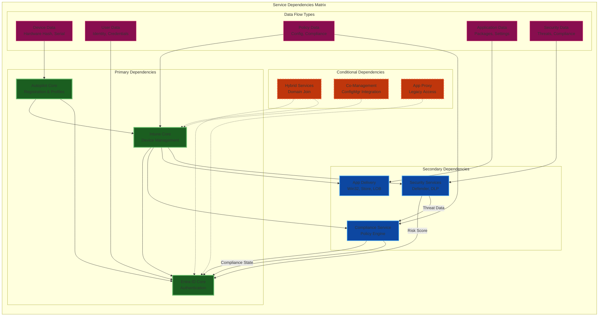
```mermaid
graph LR
    subgraph "Service Dependencies Matrix"
        subgraph "Primary Dependencies"
            AutopilotCore[Autopilot Core<br/>Registration & Profiles]
            IntuneCore[Intune Core<br/>Device Management]
            EntraCore[Entra ID Core<br/>Authentication]
        end

        subgraph "Secondary Dependencies"
            ComplianceService[Compliance Service<br/>Policy Engine]
            AppDelivery[App Delivery<br/>Win32, Store, LOB]
            SecurityServices[Security Services<br/>Defender, DLP]
        end

        subgraph "Conditional Dependencies"
            HybridServices[Hybrid Services<br/>Domain Join]
            CoMgmtServices[Co-Management<br/>ConfigMgr Integration]
            ProxyServices[App Proxy<br/>Legacy Access]
        end

        subgraph "Data Flow Types"
            DeviceData[Device Data<br/>Hardware Hash, Serial]
            UserData[User Data<br/>Identity, Credentials]
            PolicyData[Policy Data<br/>Config, Compliance]
            AppData[Application Data<br/>Packages, Settings]
            SecurityData[Security Data<br/>Threats, Compliance]
        end
    end

    %% Core Dependencies
    AutopilotCore --> IntuneCore
    AutopilotCore --> EntraCore
    IntuneCore --> EntraCore

    %% Secondary Dependencies
    IntuneCore --> ComplianceService
    IntuneCore --> AppDelivery
    IntuneCore --> SecurityServices
    ComplianceService --> EntraCore

    %% Conditional Dependencies
    HybridServices -.-> EntraCore
    HybridServices -.-> IntuneCore
    CoMgmtServices -.-> IntuneCore
    ProxyServices -.-> EntraCore

    %% Data Flow
    DeviceData --> AutopilotCore
    UserData --> EntraCore
    PolicyData --> IntuneCore
    PolicyData --> ComplianceService
    AppData --> AppDelivery
    SecurityData --> SecurityServices

    %% Feedback Loops
    ComplianceService -->|Compliance State| EntraCore
    SecurityServices -->|Risk Score| EntraCore
    SecurityServices -->|Threat Data| ComplianceService

    classDef coreClass fill:#1b5e20,stroke:#66bb6a,stroke-width:3px
    classDef secondaryClass fill:#0d47a1,stroke:#42a5f5,stroke-width:2px
    classDef conditionalClass fill:#bf360c,stroke:#ff7043,stroke-width:2px,stroke-dasharray: 5 5
    classDef dataClass fill:#880e4f,stroke:#ec407a,stroke-width:1px

    class AutopilotCore,IntuneCore,EntraCore coreClass
    class ComplianceService,AppDelivery,SecurityServices secondaryClass
    class HybridServices,CoMgmtServices,ProxyServices conditionalClass
    class DeviceData,UserData,PolicyData,AppData,SecurityData dataClass
```

## Complete Autopilot Workflow - Phase-Based Deployment

### Phase 1: Initial Boot and Network Connection

**Duration**: 0-60 seconds
**Key Activities**: System initialization, basic OS setup, network connectivity
**User Interaction**: Minimal - Region/keyboard selection and network connection

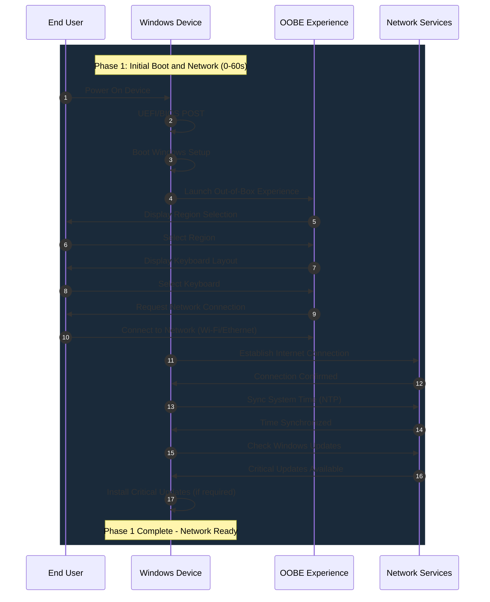
```mermaid
sequenceDiagram
    autonumber

    participant User as End User
    participant Device as Windows Device
    participant OOBE as OOBE Experience
    participant Network as Network Services

    rect rgb(26, 42, 58)
        Note over Device: Phase 1: Initial Boot and Network (0-60s)
        User->>Device: Power On Device
        Device->>Device: UEFI/BIOS POST
        Device->>Device: Boot Windows Setup
        Device->>OOBE: Launch Out-of-Box Experience

        OOBE->>User: Display Region Selection
        User->>OOBE: Select Region
        OOBE->>User: Display Keyboard Layout
        User->>OOBE: Select Keyboard

        OOBE->>User: Request Network Connection
        User->>OOBE: Connect to Network (Wi-Fi/Ethernet)
        Device->>Network: Establish Internet Connection
        Network->>Device: Connection Confirmed

        Device->>Network: Sync System Time (NTP)
        Network->>Device: Time Synchronized
        Device->>Network: Check Windows Updates
        Network->>Device: Critical Updates Available
        Device->>Device: Install Critical Updates (if required)

        Note over Device: Phase 1 Complete - Network Ready
    end
```

### Phase 2: Device Registration and Profile Discovery

**Duration**: 10-30 seconds
**Key Activities**: Hardware hash calculation, Autopilot service lookup, profile retrieval
**User Interaction**: None - Automated background process

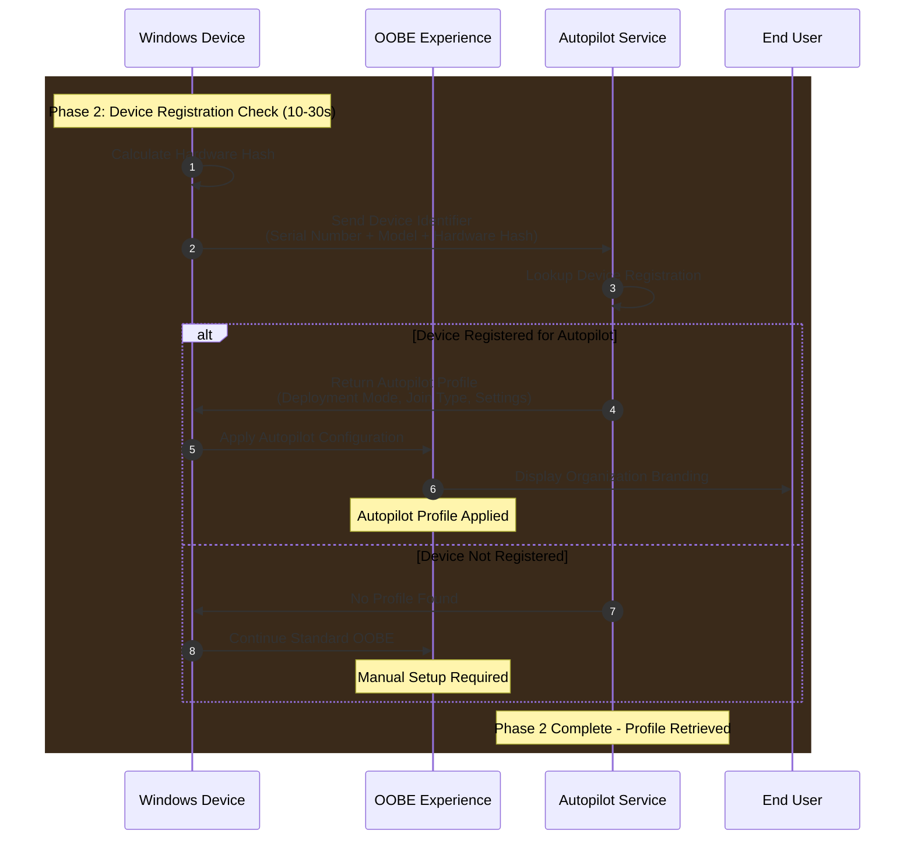
```mermaid
sequenceDiagram
    autonumber

    participant Device as Windows Device
    participant OOBE as OOBE Experience
    participant WAS as Autopilot Service
    participant User as End User

    rect rgb(58, 42, 26)
        Note over Device: Phase 2: Device Registration Check (10-30s)
        Device->>Device: Calculate Hardware Hash
        Device->>WAS: Send Device Identifier<br/>(Serial Number + Model + Hardware Hash)
        WAS->>WAS: Lookup Device Registration

        alt Device Registered for Autopilot
            WAS->>Device: Return Autopilot Profile<br/>(Deployment Mode, Join Type, Settings)
            Device->>OOBE: Apply Autopilot Configuration
            OOBE->>User: Display Organization Branding
            Note over OOBE: Autopilot Profile Applied
        else Device Not Registered
            WAS->>Device: No Profile Found
            Device->>OOBE: Continue Standard OOBE
            Note over OOBE: Manual Setup Required
        end

        Note over WAS: Phase 2 Complete - Profile Retrieved
    end
```

### Phase 3: Authentication and Directory Join

**Duration**: 30-120 seconds
**Key Activities**: User/device authentication, Azure AD join, MDM enrollment
**User Interaction**: High - Credential entry, MFA if required

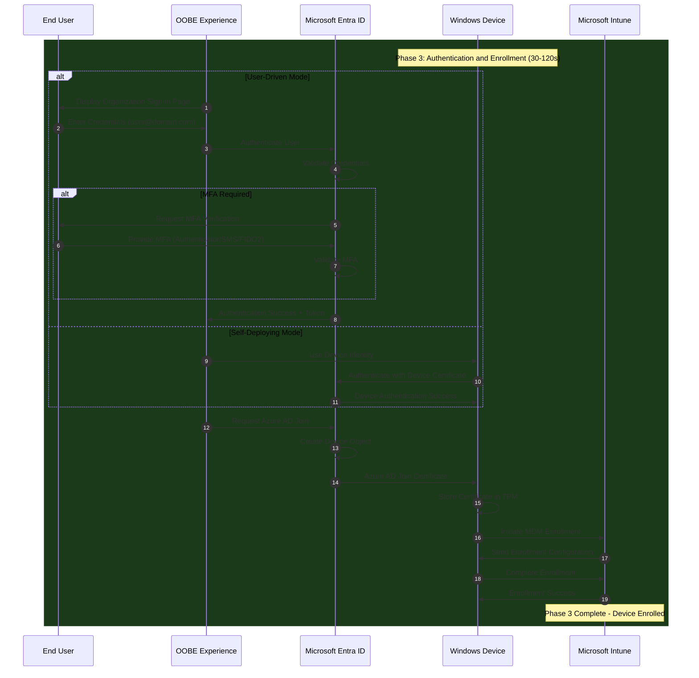
```mermaid
sequenceDiagram
    autonumber

    participant User as End User
    participant OOBE as OOBE Experience
    participant EntraID as Microsoft Entra ID
    participant Device as Windows Device
    participant Intune as Microsoft Intune

    rect rgb(26, 58, 26)
        Note over Device: Phase 3: Authentication and Enrollment (30-120s)

        alt User-Driven Mode
            OOBE->>User: Display Organization Sign-in Page
            User->>OOBE: Enter Credentials (user@domain.com)
            OOBE->>EntraID: Authenticate User
            EntraID->>EntraID: Validate Credentials

            alt MFA Required
                EntraID->>User: Request MFA Verification
                User->>EntraID: Provide MFA (Authenticator/SMS/FIDO2)
                EntraID->>EntraID: Validate MFA
            end

            EntraID->>OOBE: Authentication Success + Token

        else Self-Deploying Mode
            OOBE->>Device: Use Device Identity
            Device->>EntraID: Authenticate with Device Certificate
            EntraID->>Device: Device Authentication Success
        end

        OOBE->>EntraID: Request Azure AD Join
        EntraID->>EntraID: Create Device Object
        EntraID->>Device: Azure AD Join Certificate
        Device->>Device: Store Certificate in TPM

        Device->>Intune: Initiate MDM Enrollment
        Intune->>Device: Send Enrollment Configuration
        Device->>Intune: Complete Enrollment
        Intune->>Device: Enrollment Success

        Note over Intune: Phase 3 Complete - Device Enrolled
    end
```

### Phase 4: Device Security and Configuration (ESP)

**Duration**: 2-15 minutes
**Key Activities**: Security policy application, device configuration, compliance evaluation
**User Interaction**: None - Progress monitoring via ESP

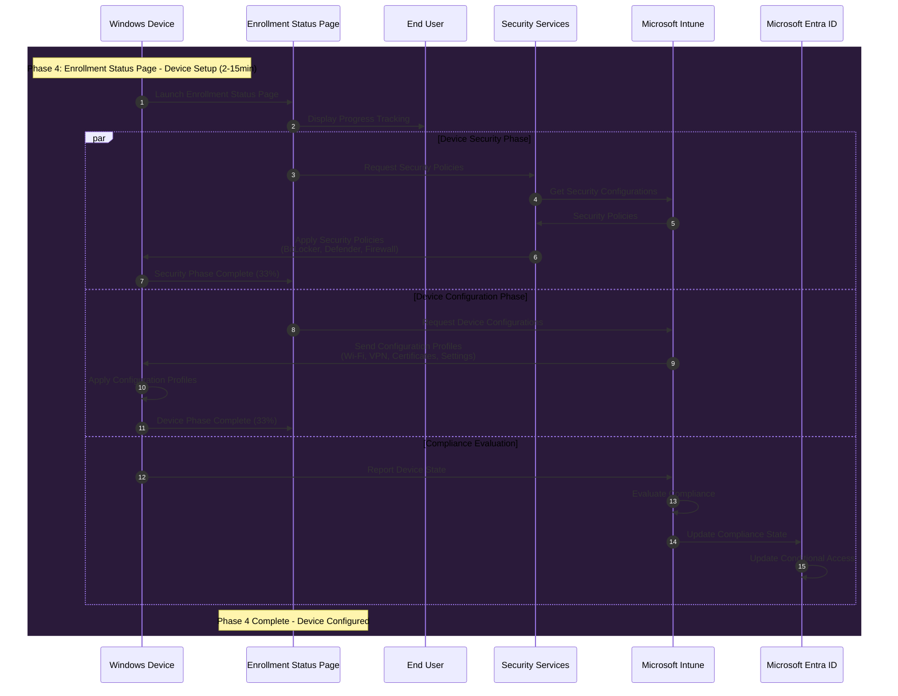
```mermaid
sequenceDiagram
    autonumber

    participant Device as Windows Device
    participant ESP as Enrollment Status Page
    participant User as End User
    participant Security as Security Services
    participant Intune as Microsoft Intune
    participant EntraID as Microsoft Entra ID

    rect rgb(42, 26, 58)
        Note over Device: Phase 4: Enrollment Status Page - Device Setup (2-15min)

        Device->>ESP: Launch Enrollment Status Page
        ESP->>User: Display Progress Tracking

        par Device Security Phase
            ESP->>Security: Request Security Policies
            Security->>Intune: Get Security Configurations
            Intune->>Security: Security Policies
            Security->>Device: Apply Security Policies<br/>(BitLocker, Defender, Firewall)
            Device->>ESP: Security Phase Complete (33%)
        and Device Configuration Phase
            ESP->>Intune: Request Device Configurations
            Intune->>Device: Send Configuration Profiles<br/>(Wi-Fi, VPN, Certificates, Settings)
            Device->>Device: Apply Configuration Profiles
            Device->>ESP: Device Phase Complete (33%)
        and Compliance Evaluation
            Device->>Intune: Report Device State
            Intune->>Intune: Evaluate Compliance
            Intune->>EntraID: Update Compliance State
            EntraID->>EntraID: Update Conditional Access
        end

        Note over ESP: Phase 4 Complete - Device Configured
    end
```

### Phase 5: Application Installation and Deployment

**Duration**: 5-45 minutes (depending on apps)
**Key Activities**: App discovery, download, installation, dependency resolution
**User Interaction**: None - Progress monitoring via ESP

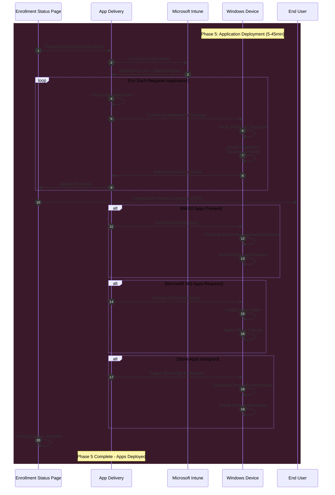
```mermaid
sequenceDiagram
    autonumber

    participant ESP as Enrollment Status Page
    participant Apps as App Delivery
    participant Intune as Microsoft Intune
    participant Device as Windows Device
    participant User as End User

    rect rgb(58, 26, 42)
        Note over Device: Phase 5: Application Deployment (5-45min)

        ESP->>Apps: Request Required Applications
        Apps->>Intune: Get App Assignments
        Intune->>Apps: Application List + Dependencies

        loop For Each Required Application
            Apps->>Apps: Check Dependencies
            Apps->>Device: Download Application Package
            Device->>Device: Verify Package Signature
            Device->>Device: Install Application<br/>(System Context)
            Device->>Apps: Report Installation Status
            Apps->>ESP: Update Progress
        end

        ESP->>User: Applications Phase Complete (33%)

        alt Win32 Apps Present
            Apps->>Device: Download Win32 Apps
            Device->>Device: Execute Intune Management Extension
            Device->>Device: Install Win32 Applications
        end

        alt Microsoft 365 Apps Required
            Apps->>Device: Stream Office Installation
            Device->>Device: Install Office Suite
            Device->>Device: Apply Office Policies
        end

        alt Store Apps Assigned
            Apps->>Device: Trigger Store App Installation
            Device->>Device: Download from Microsoft Store
            Device->>Device: Install Store Applications
        end

        ESP->>ESP: All Applications Installed

        Note over Apps: Phase 5 Complete - Apps Deployed
    end
```

### Phase 6: User Account and Profile Configuration

**Duration**: 1-5 minutes
**Key Activities**: User profile creation, settings sync, OneDrive setup
**User Interaction**: Low - Automated profile configuration

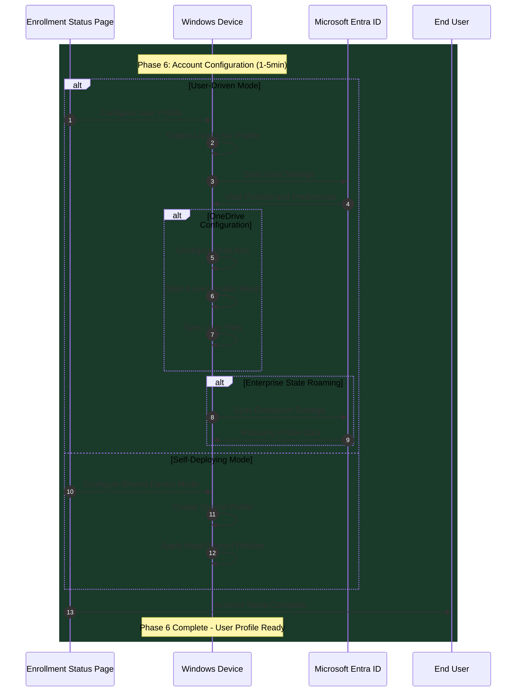
```mermaid
sequenceDiagram
    autonumber

    participant ESP as Enrollment Status Page
    participant Device as Windows Device
    participant EntraID as Microsoft Entra ID
    participant User as End User

    rect rgb(26, 58, 42)
        Note over Device: Phase 6: Account Configuration (1-5min)

        alt User-Driven Mode
            ESP->>Device: Configure User Profile
            Device->>Device: Create Local User Profile
            Device->>EntraID: Sync User Settings
            EntraID->>Device: User Policies and Preferences

            alt OneDrive Configuration
                Device->>Device: Configure OneDrive
                Device->>Device: Start Known Folder Move
                Device->>Device: Sync User Files
            end

            alt Enterprise State Roaming
                Device->>EntraID: Sync Enterprise Settings
                EntraID->>Device: Roaming Profile Data
            end

        else Self-Deploying Mode
            ESP->>Device: Configure Shared Device Mode
            Device->>Device: Create Shared Profile
            Device->>Device: Apply Kiosk/Shared Policies
        end

        ESP->>User: Account Setup Complete

        Note over Device: Phase 6 Complete - User Profile Ready
    end
```

### Phase 7: Final Validation and Desktop Handoff

**Duration**: 30-60 seconds
**Key Activities**: Final compliance check, enrollment completion, desktop launch
**User Interaction**: Low - Device handoff to user

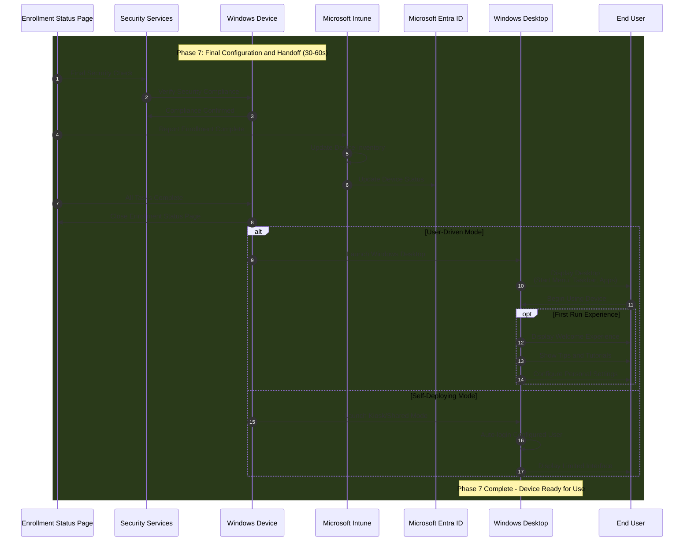
```mermaid
sequenceDiagram
    autonumber

    participant ESP as Enrollment Status Page
    participant Security as Security Services
    participant Device as Windows Device
    participant Intune as Microsoft Intune
    participant EntraID as Microsoft Entra ID
    participant Desktop as Windows Desktop
    participant User as End User

    rect rgb(42, 58, 26)
        Note over Device: Phase 7: Final Configuration and Handoff (30-60s)

        ESP->>Security: Final Security Check
        Security->>Device: Verify Security Compliance
        Device->>Security: Compliance Confirmed

        ESP->>Intune: Report Enrollment Complete
        Intune->>Intune: Update Device Inventory
        Intune->>EntraID: Update Device Status

        ESP->>Device: All Tasks Complete
        Device->>ESP: Close Enrollment Status Page

        alt User-Driven Mode
            Device->>Desktop: Launch Windows Desktop
            Desktop->>User: Display Desktop<br/>(Start Menu, Taskbar, Apps)
            User->>Desktop: Begin Using Device

            opt First Run Experience
                Desktop->>User: Display Welcome Experience
                Desktop->>User: Show Tips and Tutorials
                Desktop->>User: Configure Personal Settings
            end

        else Self-Deploying Mode
            Device->>Desktop: Launch Kiosk/Shared Mode
            Desktop->>Desktop: Auto-login Configured User
            Desktop->>User: Display Limited Interface
        end

        Note over Desktop: Phase 7 Complete - Device Ready for Use
    end
```

### Phase 8: Ongoing Management and Maintenance

**Duration**: Continuous (background operations)
**Key Activities**: Policy updates, app updates, security monitoring, compliance reporting
**User Interaction**: None - Transparent background operations

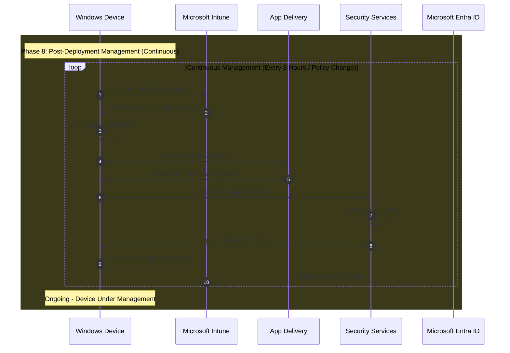
```mermaid
sequenceDiagram
    autonumber

    participant Device as Windows Device
    participant Intune as Microsoft Intune
    participant Apps as App Delivery
    participant Security as Security Services
    participant EntraID as Microsoft Entra ID

    rect rgb(58, 58, 26)
        Note over Device: Phase 8: Post-Deployment Management (Continuous)

        loop Continuous Management (Every 8 Hours / Policy Change)
            Device->>Intune: Check for Policy Updates
            Intune->>Device: Send Policy Changes (if any)
            Device->>Device: Apply Updated Policies

            Device->>Apps: Check for App Updates
            Apps->>Device: Download and Install Updates

            Device->>Security: Send Security Telemetry
            Security->>Security: Analyze Threats
            Security->>Device: Update Security Posture

            Device->>Intune: Report Compliance Status
            Intune->>EntraID: Update Device Health
        end

        Note over Device: Ongoing - Device Under Management
    end
```

---

## Phase Summary and Timelines

| Phase | Duration | Key Focus | User Interaction |
|-------|----------|-----------|------------------|
| **Phase 1** | 0-60s | Network & Basic Setup | Medium |
| **Phase 2** | 10-30s | Device Registration | None |
| **Phase 3** | 30-120s | Authentication & Join | High |
| **Phase 4** | 2-15min | Security & Configuration | None |
| **Phase 5** | 5-45min | Application Installation | None |
| **Phase 6** | 1-5min | User Profile Setup | Low |
| **Phase 7** | 30-60s | Final Validation | Low |
| **Phase 8** | Continuous | Ongoing Management | None |

**Total Deployment Time**: 15-60 minutes (typical: 20-30 minutes)
**Hands-on Time Required**: 2-5 minutes (Phases 1 & 3 only)

---

## Legacy Deployment Processes

### Detailed Sub-Process: Hybrid Azure AD Join Workflow

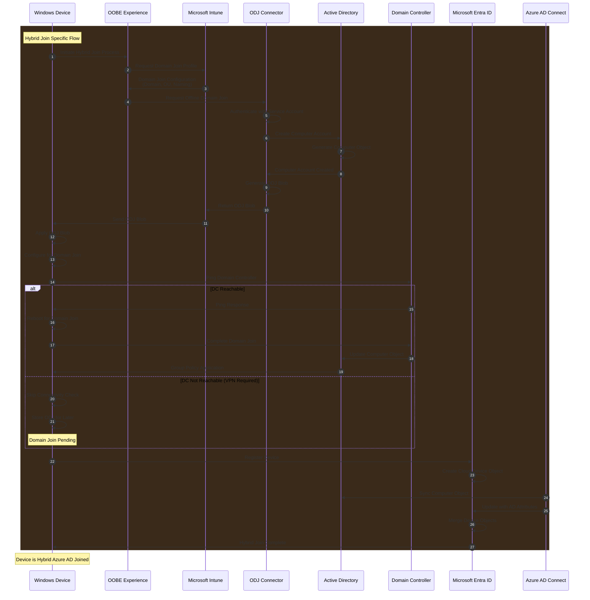
```mermaid
sequenceDiagram
    autonumber

    participant Device as Windows Device
    participant OOBE as OOBE Experience
    participant Intune as Microsoft Intune
    participant ODJ as ODJ Connector
    participant AD as Active Directory
    participant DC as Domain Controller
    participant EntraID as Microsoft Entra ID
    participant AADConnect as Azure AD Connect

    rect rgb(58, 42, 26)
        Note over Device: Hybrid Join Specific Flow

        Device->>OOBE: Initiate Hybrid Join Process
        OOBE->>Intune: Request Domain Join Profile
        Intune->>OOBE: Domain Join Configuration<br/>(Domain, OU, Naming)

        OOBE->>ODJ: Request Offline Domain Join
        ODJ->>ODJ: Authenticate with Service Account
        ODJ->>AD: Create Computer Account
        AD->>AD: Generate Computer Object
        AD->>ODJ: Computer Account Created

        ODJ->>ODJ: Generate ODJ Blob
        ODJ->>Intune: Return ODJ Blob
        Intune->>Device: Send ODJ Blob

        Device->>Device: Apply ODJ Blob
        Device->>Device: Configure for Domain Join

        Device->>DC: Ping Domain Controller

        alt DC Reachable
            DC->>Device: Ping Response
            Device->>Device: Reboot for Domain Join
            Device->>DC: Complete Domain Join
            DC->>AD: Update Computer Object
            AD->>Device: Group Policy Application
        else DC Not Reachable (VPN Required)
            Device->>Device: Skip Connectivity Check
            Device->>Device: Store ODJ for Later
            Note over Device: Domain Join Pending
        end

        Device->>EntraID: Register Device
        EntraID->>EntraID: Create Cloud Device Object

        AADConnect->>AD: Sync Computer Object
        AADConnect->>EntraID: Update with AD Attributes
        EntraID->>EntraID: Merge Device Objects
        EntraID->>Device: Hybrid Join Complete
    end

    Note over Device: Device is Hybrid Azure AD Joined
```

### Error Handling and Recovery Flows

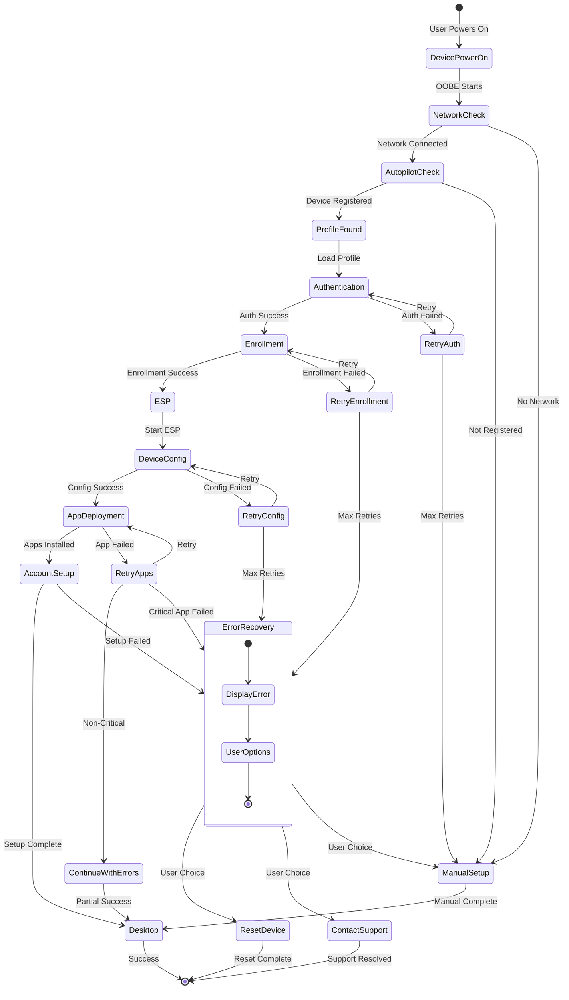
```mermaid
stateDiagram-v2
    [*] --> DevicePowerOn: User Powers On

    DevicePowerOn --> NetworkCheck: OOBE Starts

    NetworkCheck --> AutopilotCheck: Network Connected
    NetworkCheck --> ManualSetup: No Network

    AutopilotCheck --> ProfileFound: Device Registered
    AutopilotCheck --> ManualSetup: Not Registered

    ProfileFound --> Authentication: Load Profile

    Authentication --> Enrollment: Auth Success
    Authentication --> RetryAuth: Auth Failed
    RetryAuth --> Authentication: Retry
    RetryAuth --> ManualSetup: Max Retries

    Enrollment --> ESP: Enrollment Success
    Enrollment --> RetryEnrollment: Enrollment Failed
    RetryEnrollment --> Enrollment: Retry
    RetryEnrollment --> ErrorRecovery: Max Retries

    ESP --> DeviceConfig: Start ESP

    DeviceConfig --> AppDeployment: Config Success
    DeviceConfig --> RetryConfig: Config Failed
    RetryConfig --> DeviceConfig: Retry
    RetryConfig --> ErrorRecovery: Max Retries

    AppDeployment --> AccountSetup: Apps Installed
    AppDeployment --> RetryApps: App Failed
    RetryApps --> AppDeployment: Retry
    RetryApps --> ContinueWithErrors: Non-Critical
    RetryApps --> ErrorRecovery: Critical App Failed

    AccountSetup --> Desktop: Setup Complete
    AccountSetup --> ErrorRecovery: Setup Failed

    ContinueWithErrors --> Desktop: Partial Success

    ErrorRecovery --> ResetDevice: User Choice
    ErrorRecovery --> ContactSupport: User Choice
    ErrorRecovery --> ManualSetup: User Choice

    ResetDevice --> [*]: Reset Complete
    ContactSupport --> [*]: Support Resolved
    ManualSetup --> Desktop: Manual Complete
    Desktop --> [*]: Success

    state ErrorRecovery {
        [*] --> DisplayError
        DisplayError --> UserOptions
        UserOptions --> [*]
    }
```

### Network Communication Flow

The network communication during Windows Autopilot follows a sequential pattern across multiple phases. Each phase builds upon the previous one, establishing the necessary connections and authentication for device deployment.

#### Phase 1: Initial Network Discovery and Time Sync

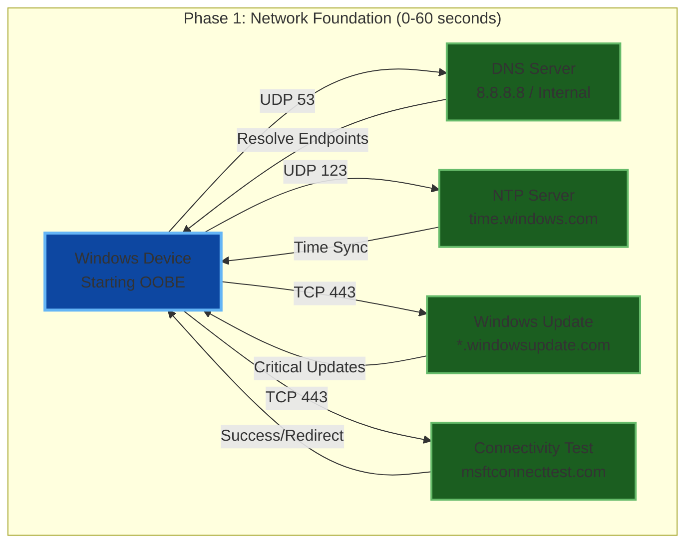
```mermaid
graph TD
    subgraph "Phase 1: Network Foundation (0-60 seconds)"
        Device[Windows Device<br/>Starting OOBE] -->|UDP 53| DNS[DNS Server<br/>8.8.8.8 / Internal]
        Device -->|UDP 123| NTP[NTP Server<br/>time.windows.com]
        Device -->|TCP 443| WU[Windows Update<br/>*.windowsupdate.com]

        DNS -->|Resolve Endpoints| Device
        NTP -->|Time Sync| Device
        WU -->|Critical Updates| Device

        Device -->|TCP 443| NC[Connectivity Test<br/>msftconnecttest.com]
        NC -->|Success/Redirect| Device
    end

    classDef deviceClass fill:#0d47a1,stroke:#64b5f6,stroke-width:3px
    classDef infraClass fill:#1b5e20,stroke:#66bb6a,stroke-width:2px

    class Device deviceClass
    class DNS,NTP,WU,NC infraClass
```

#### Phase 2: Autopilot Service Discovery and Registration

```mermaid
graph TD
    subgraph "Phase 2: Autopilot Registration (60-90 seconds)"
        Device[Device with<br/>Hardware Hash] -->|HTTPS GET| Discovery[Discovery Endpoint<br/>enrollment.manage.microsoft.com]

        Discovery -->|302 Redirect| Device
        Device -->|Follow Redirect| AutopilotService[Windows Autopilot Service<br/>ztd.manage.microsoft.com]

        Device -->|POST Hardware Info| AutopilotService
        AutopilotService -->|Lookup Registration| Database[(Autopilot Database)]
        Database -->|Device Found| AutopilotService
        AutopilotService -->|Return Profile| Device

        Device -->|Store Profile| LocalStorage[Local Profile Cache]
    end

    classDef deviceClass fill:#0d47a1,stroke:#64b5f6,stroke-width:3px
    classDef serviceClass fill:#4a148c,stroke:#ba68c8,stroke-width:2px
    classDef storageClass fill:#2e4e1f,stroke:#8bc34a,stroke-width:1px

    class Device deviceClass
    class Discovery,AutopilotService serviceClass
    class Database,LocalStorage storageClass
```

#### Phase 3: Authentication Flow

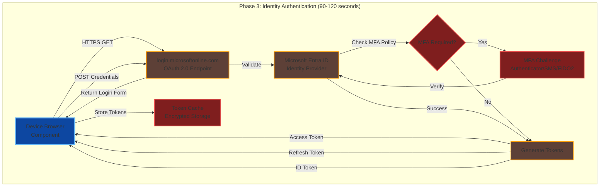
```mermaid
graph TD
    subgraph "Phase 3: Identity Authentication (90-120 seconds)"
        Device[Device Browser<br/>Component] -->|HTTPS GET| LoginPage[login.microsoftonline.com<br/>OAuth 2.0 Endpoint]

        LoginPage -->|Return Login Form| Device
        Device -->|POST Credentials| LoginPage

        LoginPage -->|Validate| EntraID[Microsoft Entra ID<br/>Identity Provider]

        EntraID -->|Check MFA Policy| MFA{MFA Required?}
        MFA -->|Yes| MFAChallenge[MFA Challenge<br/>Authenticator/SMS/FIDO2]
        MFA -->|No| GenerateToken

        MFAChallenge -->|Verify| EntraID
        EntraID -->|Success| GenerateToken[Generate Tokens]

        GenerateToken -->|Access Token| Device
        GenerateToken -->|Refresh Token| Device
        GenerateToken -->|ID Token| Device

        Device -->|Store Tokens| TokenCache[Token Cache<br/>Encrypted Storage]
    end

    classDef deviceClass fill:#0d47a1,stroke:#64b5f6,stroke-width:3px
    classDef authClass fill:#5d4037,stroke:#ff9800,stroke-width:2px
    classDef securityClass fill:#7f1e1e,stroke:#ef5350,stroke-width:2px

    class Device deviceClass
    class LoginPage,EntraID,GenerateToken authClass
    class MFA,MFAChallenge,TokenCache securityClass
```

#### Phase 4: MDM Enrollment and Azure AD Join

```mermaid
graph TD
    subgraph "Phase 4: Device Enrollment (120-180 seconds)"
        Device[Authenticated Device] -->|POST /EnrollmentServer/Discovery| MDMDiscovery[MDM Discovery<br/>enrollment.manage.microsoft.com]

        MDMDiscovery -->|Return MDM URLs| Device
        Device -->|POST /deviceenrollmentwebservice| EnrollmentService[Device Enrollment Service]

        EnrollmentService -->|Create Enrollment| IntuneBackend[Intune Backend Services]
        IntuneBackend -->|Generate Certificate| CertService[Certificate Service]
        CertService -->|Device Certificate| IntuneBackend

        IntuneBackend -->|Return Enrollment Package| EnrollmentService
        EnrollmentService -->|Enrollment Success| Device

        Device -->|POST /deviceregistration| AADRegistration[Azure AD Device Registration]
        AADRegistration -->|Create Device Object| AAD[(Azure AD Directory)]
        AAD -->|Device ID| AADRegistration
        AADRegistration -->|PRT Token| Device

        Device -->|Store Credentials| TPM[TPM 2.0 Chip]
    end

    classDef deviceClass fill:#0d47a1,stroke:#64b5f6,stroke-width:3px
    classDef serviceClass fill:#4a148c,stroke:#ba68c8,stroke-width:2px
    classDef securityClass fill:#7f1e1e,stroke:#ef5350,stroke-width:2px
    classDef storageClass fill:#2e4e1f,stroke:#8bc34a,stroke-width:1px

    class Device deviceClass
    class MDMDiscovery,EnrollmentService,IntuneBackend,AADRegistration serviceClass
    class CertService,TPM securityClass
    class AAD storageClass
```

#### Phase 5: Policy and Configuration Retrieval

```mermaid
graph TD
    subgraph "Phase 5: Policy Download (180-240 seconds)"
        Device[Enrolled Device] -->|GET /deviceManagement/managedDevices/id| DeviceAPI[Intune Device API]

        DeviceAPI -->|Return Device Details| Device
        Device -->|GET /deviceManagement/deviceConfigurations| ConfigAPI[Configuration API]

        ConfigAPI -->|List Assigned Configs| PolicyEngine[Policy Engine]
        PolicyEngine -->|Evaluate Targeting| Groups[(Group Membership)]
        Groups -->|Applicable Policies| PolicyEngine
        PolicyEngine -->|Filtered Configs| ConfigAPI

        ConfigAPI -->|Return Config List| Device

        Device -->|GET /deviceManagement/deviceCompliancePolicies| ComplianceAPI[Compliance API]
        ComplianceAPI -->|Compliance Policies| Device

        Device -->|GET /deviceManagement/configurationPolicies| SettingsAPI[Settings Catalog API]
        SettingsAPI -->|Settings Policies| Device

        Device -->|Apply All Policies| LocalPolicy[Local Policy Engine]
    end

    classDef deviceClass fill:#0d47a1,stroke:#64b5f6,stroke-width:3px
    classDef serviceClass fill:#4a148c,stroke:#ba68c8,stroke-width:2px
    classDef engineClass fill:#1b5e20,stroke:#66bb6a,stroke-width:2px
    classDef storageClass fill:#2e4e1f,stroke:#8bc34a,stroke-width:1px

    class Device deviceClass
    class DeviceAPI,ConfigAPI,ComplianceAPI,SettingsAPI serviceClass
    class PolicyEngine,LocalPolicy engineClass
    class Groups storageClass
```

#### Phase 6: Application Deployment

```mermaid
graph TD
    subgraph "Phase 6: App Installation (240-600+ seconds)"
        Device[Device with Policies] -->|GET /deviceAppManagement/mobileApps| AppAPI[Intune App API]

        AppAPI -->|List Assigned Apps| AppEngine[App Assignment Engine]
        AppEngine -->|Check Requirements| Requirements{Meet Requirements?}

        Requirements -->|No| SkipApp[Skip Application]
        Requirements -->|Yes| AppDetails[Get App Details]

        AppDetails -->|GET /mobileApps/id| AppAPI
        AppAPI -->|App Metadata| Device

        Device -->|Check App Type| AppType{App Type?}

        AppType -->|Win32| Win32Flow[Download from CDN<br/>*.delivery.mp.microsoft.com]
        AppType -->|MSI| MSIFlow[Download MSI Package]
        AppType -->|Store| StoreFlow[Microsoft Store<br/>Business Store API]
        AppType -->|M365| M365Flow[Office CDN<br/>officecdn.microsoft.com]

        Win32Flow -->|.intunewin Package| Device
        MSIFlow -->|.msi Package| Device
        StoreFlow -->|Store Package| Device
        M365Flow -->|Office Package| Device

        Device -->|Install Apps| IME[Intune Management<br/>Extension]
        IME -->|Report Status| AppAPI
        AppAPI -->|Update Inventory| Inventory[(App Inventory)]
    end

    classDef deviceClass fill:#0d47a1,stroke:#64b5f6,stroke-width:3px
    classDef serviceClass fill:#4a148c,stroke:#ba68c8,stroke-width:2px
    classDef cdnClass fill:#5d4e37,stroke:#ffc107,stroke-width:2px
    classDef engineClass fill:#1b5e20,stroke:#66bb6a,stroke-width:2px
    classDef storageClass fill:#2e4e1f,stroke:#8bc34a,stroke-width:1px

    class Device deviceClass
    class AppAPI,StoreFlow serviceClass
    class Win32Flow,MSIFlow,M365Flow cdnClass
    class AppEngine,IME engineClass
    class Requirements,AppType,Inventory storageClass
```

#### Phase 7: Security and Compliance Evaluation

```mermaid
graph TD
    subgraph "Phase 7: Security & Compliance (Continuous)"
        Device[Managed Device] -->|POST /deviceManagement/managedDevices/id/syncDevice| SyncAPI[Sync API]

        SyncAPI -->|Trigger Evaluation| ComplianceEngine[Compliance Engine]

        ComplianceEngine -->|Check Policies| Checks{All Checks}
        Checks -->|BitLocker Status| BitLocker[BitLocker Check]
        Checks -->|Defender Status| Defender[Defender Check]
        Checks -->|Update Status| Updates[Update Check]
        Checks -->|Firewall Status| Firewall[Firewall Check]

        BitLocker -->|Result| ComplianceEngine
        Defender -->|Result| ComplianceEngine
        Updates -->|Result| ComplianceEngine
        Firewall -->|Result| ComplianceEngine

        ComplianceEngine -->|Calculate State| ComplianceState{Compliant?}

        ComplianceState -->|Yes| MarkCompliant[Mark Compliant]
        ComplianceState -->|No| MarkNonCompliant[Mark Non-Compliant]

        MarkCompliant -->|Update| AADCompliance[Azure AD<br/>Compliance State]
        MarkNonCompliant -->|Update| AADCompliance

        AADCompliance -->|Enforce| ConditionalAccess[Conditional Access<br/>Policy Engine]

        Device -->|Send Telemetry| Telemetry[Telemetry Service<br/>*.events.data.microsoft.com]
        Telemetry -->|Store| Analytics[(Analytics Database)]
    end

    classDef deviceClass fill:#0d47a1,stroke:#64b5f6,stroke-width:3px
    classDef serviceClass fill:#4a148c,stroke:#ba68c8,stroke-width:2px
    classDef securityClass fill:#7f1e1e,stroke:#ef5350,stroke-width:2px
    classDef engineClass fill:#1b5e20,stroke:#66bb6a,stroke-width:2px
    classDef storageClass fill:#2e4e1f,stroke:#8bc34a,stroke-width:1px

    class Device deviceClass
    class SyncAPI,AADCompliance,ConditionalAccess serviceClass
    class BitLocker,Defender,Updates,Firewall,ComplianceState securityClass
    class ComplianceEngine,Telemetry engineClass
    class Checks,Analytics storageClass
```

#### Complete Network Endpoint Summary

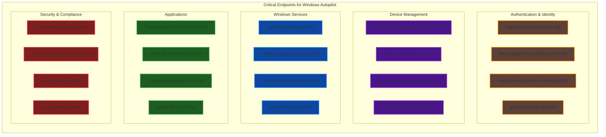
```mermaid
graph LR
    subgraph "Critical Endpoints for Windows Autopilot"
        subgraph "Authentication & Identity"
            E1[login.microsoftonline.com:443]
            E2[device.login.microsoftonline.com:443]
            E3[enterpriseregistration.windows.net:443]
            E4[graph.microsoft.com:443]
        end

        subgraph "Device Management"
            E5[enrollment.manage.microsoft.com:443]
            E6[manage.microsoft.com:443]
            E7[portal.manage.microsoft.com:443]
            E8[m.manage.microsoft.com:443]
        end

        subgraph "Windows Services"
            E9[*.windowsupdate.com:443]
            E10[*.delivery.mp.microsoft.com:443]
            E11[*.do.dsp.mp.microsoft.com:443]
            E12[time.windows.com:123]
        end

        subgraph "Applications"
            E13[*.businessstore.microsoft.com:443]
            E14[officecdn.microsoft.com:443]
            E15[*.officeconfig.msocdn.com:443]
            E16[config.office.com:443]
        end

        subgraph "Security & Compliance"
            E17[*.protection.outlook.com:443]
            E18[*.events.data.microsoft.com:443]
            E19[crl.microsoft.com:443]
            E20[*.public-trust.com:443]
        end
    end

    classDef authClass fill:#5d4037,stroke:#ff9800,stroke-width:2px
    classDef mgmtClass fill:#4a148c,stroke:#ba68c8,stroke-width:2px
    classDef winClass fill:#0d47a1,stroke:#64b5f6,stroke-width:2px
    classDef appClass fill:#1b5e20,stroke:#66bb6a,stroke-width:2px
    classDef secClass fill:#7f1e1e,stroke:#ef5350,stroke-width:2px

    class E1,E2,E3,E4 authClass
    class E5,E6,E7,E8 mgmtClass
    class E9,E10,E11,E12 winClass
    class E13,E14,E15,E16 appClass
    class E17,E18,E19,E20 secClass
```

### Timing and Performance Metrics

```mermaid
gantt
    title Windows Autopilot Deployment Timeline
    dateFormat mm:ss
    axisFormat %M:%S

    section Initial Boot
    BIOS/UEFI POST                :done, boot1, 00:00, 15s
    Windows Setup Loading          :done, boot2, after boot1, 20s
    OOBE Launch                    :done, boot3, after boot2, 10s

    section Network Setup
    Network Detection              :done, net1, after boot3, 5s
    Network Connection             :active, net2, after net1, 10s
    Time Sync (NTP)                :active, net3, after net2, 3s
    Critical Updates Check         :active, net4, after net3, 30s

    section Autopilot Registration
    Hardware Hash Calculation      :crit, reg1, after net4, 5s
    Device Lookup                  :crit, reg2, after reg1, 8s
    Profile Download               :crit, reg3, after reg2, 5s

    section Authentication
    Sign-in Page Display          :auth1, after reg3, 3s
    User Credential Entry         :auth2, after auth1, 15s
    MFA Challenge                 :auth3, after auth2, 10s
    Token Generation              :auth4, after auth3, 3s

    section Azure AD Join
    Device Registration           :join1, after auth4, 10s
    Certificate Generation        :join2, after join1, 5s
    TPM Provisioning             :join3, after join2, 8s

    section MDM Enrollment
    Enrollment Initiation        :mdm1, after join3, 5s
    Configuration Download       :mdm2, after mdm1, 15s
    Enrollment Completion        :mdm3, after mdm2, 10s

    section ESP Phase 1 - Security
    Security Policy Download     :esp1, after mdm3, 10s
    BitLocker Configuration      :esp2, after esp1, 45s
    Defender Configuration       :esp3, after esp2, 20s
    Firewall Rules              :esp4, after esp3, 5s

    section ESP Phase 2 - Device
    Configuration Profiles       :dev1, after esp4, 20s
    Certificate Deployment      :dev2, after dev1, 15s
    Network Profiles           :dev3, after dev2, 10s

    section ESP Phase 3 - Apps
    App List Retrieval         :app1, after dev3, 5s
    Win32 Apps Download        :app2, after app1, 180s
    Win32 Apps Installation    :app3, after app2, 300s
    Store Apps Download        :app4, after app3, 60s
    Store Apps Installation    :app5, after app4, 120s

    section Account Setup
    Profile Creation           :prof1, after app5, 20s
    OneDrive Configuration     :prof2, after prof1, 30s
    Settings Sync             :prof3, after prof2, 15s

    section Finalization
    Compliance Check          :fin1, after prof3, 10s
    Final Inventory          :fin2, after fin1, 5s
    Desktop Launch           :fin3, after fin2, 10s
```

### State Machine for Device Lifecycle

```mermaid
stateDiagram-v2
    [*] --> Unregistered: New Device

    Unregistered --> Registered: Import to Autopilot
    Registered --> Assigned: Profile Assignment

    Assigned --> Deploying: User/IT Initiates

    state Deploying {
        [*] --> NetworkSetup
        NetworkSetup --> DeviceIdentification
        DeviceIdentification --> Authentication
        Authentication --> AzureADJoin
        AzureADJoin --> MDMEnrollment
        MDMEnrollment --> PolicyApplication
        PolicyApplication --> AppInstallation
        AppInstallation --> AccountConfiguration
        AccountConfiguration --> [*]
    }

    Deploying --> Deployed: Success
    Deploying --> Failed: Error

    Failed --> Deploying: Retry
    Failed --> Reset: User Reset

    Deployed --> InUse: User Productive

    state InUse {
        [*] --> Compliant
        Compliant --> NonCompliant: Policy Violation
        NonCompliant --> Compliant: Remediated
        NonCompliant --> Blocked: Critical Violation
        Blocked --> Compliant: Issue Resolved
    }

    InUse --> Maintenance: Updates/Changes
    Maintenance --> InUse: Complete

    InUse --> Retired: End of Life
    Deployed --> Reset: Wipe/Reset

    Reset --> Assigned: Re-deployment
    Reset --> Unregistered: Remove from Autopilot

    Retired --> [*]: Decommissioned
```

### Data Flow and Security Boundaries

```mermaid
graph LR
    subgraph "Security Zones"
        subgraph "Untrusted Zone"
            Internet[Public Internet]
            PublicDNS[Public DNS]
        end

        subgraph "DMZ"
            WAF[Web Application Firewall]
            RevProxy[Reverse Proxy]
            LoadBalancer[Load Balancer]
        end

        subgraph "Microsoft Cloud (Trusted)"
            subgraph "Edge Services"
                CDN[Content Delivery Network]
                DDoSProtection[DDoS Protection]
            end

            subgraph "Authentication Layer"
                EntraIDAuth[Entra ID Authentication]
                MFAService[MFA Service]
                ConditionalAccess[Conditional Access Engine]
            end

            subgraph "Application Layer"
                AutopilotAPI[Autopilot API]
                IntuneAPI[Intune API]
                GraphAPI[Graph API]
            end

            subgraph "Data Layer"
                DeviceDB[(Device Database)]
                PolicyDB[(Policy Database)]
                ComplianceDB[(Compliance Database)]
                TelemetryDB[(Telemetry Database)]
            end
        end

        subgraph "Corporate Network"
            CorpFirewall[Corporate Firewall]
            ProxyServer[Proxy Server]
            InternalDNS[Internal DNS]

            subgraph "Client Devices"
                Device1[Autopilot Device 1]
                Device2[Autopilot Device 2]
                DeviceN[Autopilot Device N]
            end
        end

        subgraph "Hybrid Infrastructure"
            VPNGateway[VPN Gateway]
            DomainController[Domain Controller]
            IntuneConnector[Intune Connector]
        end
    end

    %% Data Flow Paths
    Device1 --> CorpFirewall
    Device2 --> CorpFirewall
    DeviceN --> CorpFirewall

    CorpFirewall --> ProxyServer
    ProxyServer --> Internet

    Internet --> WAF
    WAF --> RevProxy
    RevProxy --> LoadBalancer

    LoadBalancer --> CDN
    LoadBalancer --> DDoSProtection

    DDoSProtection --> EntraIDAuth
    EntraIDAuth --> MFAService
    EntraIDAuth --> ConditionalAccess

    ConditionalAccess --> AutopilotAPI
    ConditionalAccess --> IntuneAPI
    ConditionalAccess --> GraphAPI

    AutopilotAPI --> DeviceDB
    IntuneAPI --> PolicyDB
    IntuneAPI --> ComplianceDB
    GraphAPI --> TelemetryDB

    %% Hybrid Flow
    Device1 -.-> VPNGateway
    VPNGateway -.-> DomainController
    IntuneConnector -.-> DomainController
    IntuneConnector -.-> IntuneAPI

    %% DNS Resolution
    Device1 --> InternalDNS
    InternalDNS --> PublicDNS

    classDef untrustedClass fill:#b71c1c,stroke:#ef5350,stroke-width:3px
    classDef dmzClass fill:#5d4e37,stroke:#ffc107,stroke-width:2px
    classDef trustedClass fill:#1b5e20,stroke:#66bb6a,stroke-width:2px
    classDef corpClass fill:#0d47a1,stroke:#42a5f5,stroke-width:2px
    classDef hybridClass fill:#bf360c,stroke:#ff7043,stroke-width:2px,stroke-dasharray: 5 5

    class Internet,PublicDNS untrustedClass
    class WAF,RevProxy,LoadBalancer dmzClass
    class EntraIDAuth,MFAService,ConditionalAccess,AutopilotAPI,IntuneAPI,GraphAPI trustedClass
    class CorpFirewall,ProxyServer,InternalDNS,Device1,Device2,DeviceN corpClass
    class VPNGateway,DomainController,IntuneConnector hybridClass
```

## Summary

These comprehensive Mermaid diagrams illustrate:

1. **Service Integration Architecture**: Complete view of all Microsoft services and their relationships in Windows Autopilot deployments

2. **End-to-End Workflow**: Detailed sequence diagram showing every step from device power-on to fully operational desktop

3. **Hybrid Join Specifics**: Additional complexity introduced by hybrid Azure AD join requirements

4. **Error Handling**: State machine showing all possible error states and recovery paths

5. **Network Communications**: Detailed network flow showing all API calls and service interactions

6. **Timing Metrics**: Gantt chart showing typical deployment timeline and phase durations

7. **Security Boundaries**: Data flow across security zones and trust boundaries

8. **Device Lifecycle**: Complete state machine for device management from registration to retirement

These diagrams provide a comprehensive technical reference for understanding Windows Autopilot's architecture, dependencies, and operational flow in 2025 enterprise environments.

---

### Related Documentation
- **[Complete Setup Guide](../setup-guides/)** - Comprehensive setup and configuration procedures
- **[Administrator Quick Reference](../quick-reference/)** - Daily administration and troubleshooting reference
- **[Hybrid Deployment Limitations](../limitations-and-solutions/)** - Hybrid join specific limitations and workarounds
- **[Cloud Migration Framework](../cloud-migration/)** - Strategic migration guidance from hybrid to cloud-native

### External Resources
- **[Microsoft Tech Community - Intune Forum](https://techcommunity.microsoft.com/t5/microsoft-intune/ct-p/Microsoft-Intune)** - Community support and discussions
- **[Microsoft 365 Roadmap](https://www.microsoft.com/microsoft-365/roadmap)** - Upcoming feature releases and timeline
- **[Microsoft Security Compliance Toolkit](https://www.microsoft.com/download/details.aspx?id=55319)** - Additional security hardening guidance

---

*These diagrams are optimized for rendering in Markdown viewers that support Mermaid syntax. For best viewing experience with dark mode optimization, use tools like GitHub, GitLab, VS Code, or dedicated Mermaid diagram viewers with dark themes enabled.*
