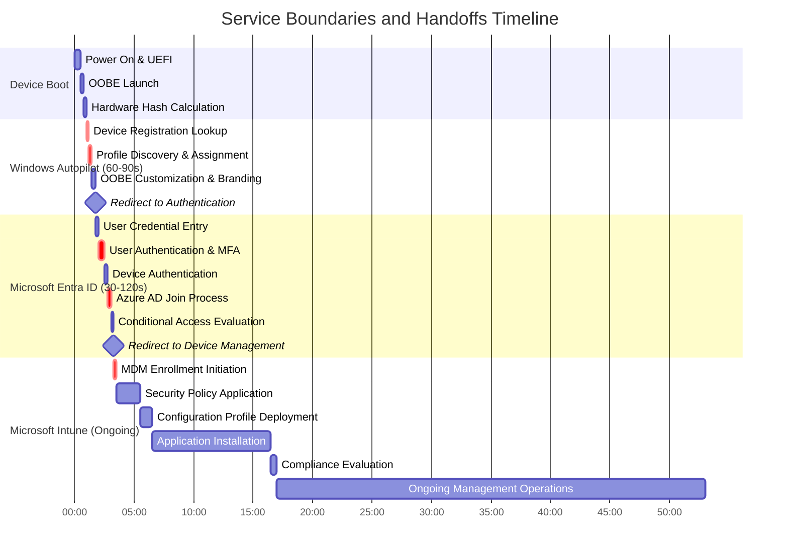
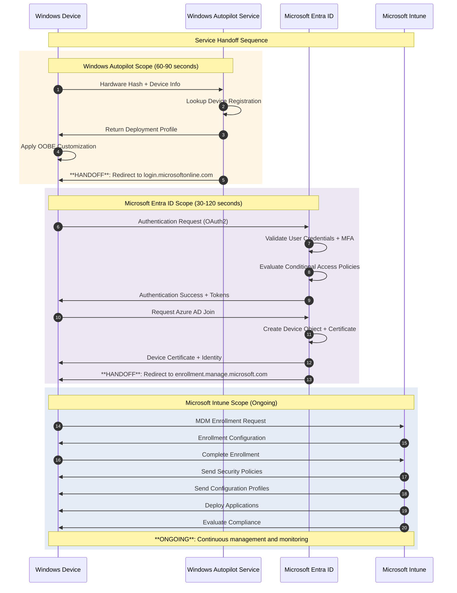
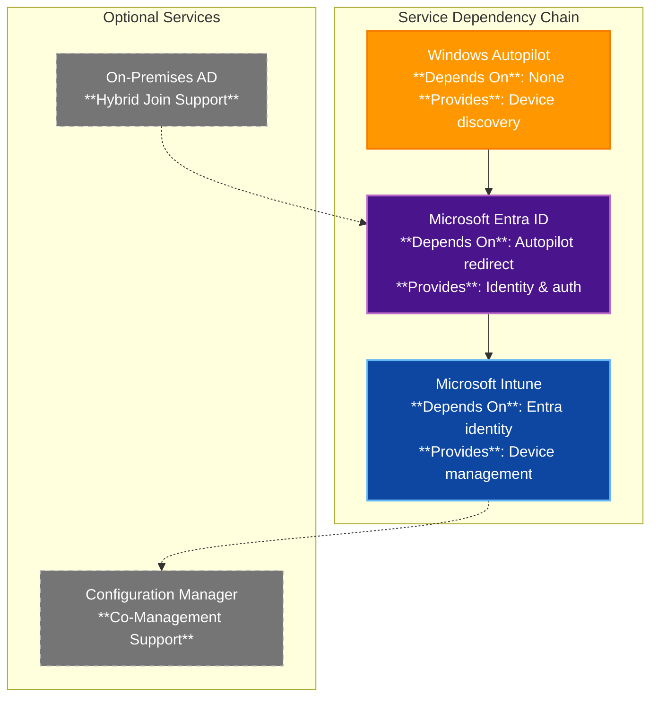

# Windows Autopilot, Entra ID, and Intune: Service Boundaries and Handoffs (2025)

## Executive Summary

**Common Misconception**: "Windows Autopilot manages and configures devices"
**Reality**: Windows Autopilot is a **device discovery and redirection service** that hands devices off to Entra ID (authentication) and Intune (management).

This document provides clear boundaries showing where each service starts, stops, and hands off to the next service in the chain.

## Service Ownership and Responsibilities

### Windows Autopilot: Device Discovery Service (60-90 seconds)
**What it DOES:**
- Device registration and hardware hash lookup
- Profile discovery and assignment
- Initial OOBE customization and branding
- **Redirect device to Entra ID for authentication**

**What it DOES NOT do:**
- Device authentication or identity management
- Policy application or configuration management
- Application installation or ongoing device management
- Compliance evaluation or security enforcement

### Microsoft Entra ID: Identity and Authentication Service (30-120 seconds)
**What it DOES:**
- User and device authentication
- Azure AD join and device identity creation
- Conditional access policy evaluation
- **Redirect device to Intune for management**

**What it DOES NOT do:**
- Device configuration or policy application
- Application installation or deployment
- Ongoing device management or monitoring
- Compliance policy enforcement (evaluation only)

### Microsoft Intune: Device Management Service (Ongoing)
**What it DOES:**
- Device enrollment and management
- Policy application and configuration
- Application deployment and management
- Compliance enforcement and monitoring
- Ongoing device lifecycle management

**What it DOES NOT do:**
- Initial device discovery or registration
- User authentication or identity management
- Hardware hash calculation or profile assignment

## Service Handoff Visualization

### Complete Service Chain Overview

```mermaid
flowchart TD
    subgraph "Device Boot & Discovery"
        DeviceBoot[Device Powers On<br/>OOBE Starts]
        HardwareHash[Calculate Hardware Hash<br/>Device Identification]
    end

    subgraph "Windows Autopilot Service"
        AutopilotLookup[Device Registration Lookup<br/>Hardware Hash → Profile]
        ProfileAssignment[Profile Assignment<br/>Deployment Configuration]
        OOBECustomization[OOBE Customization<br/>Branding & Experience]
        AutopilotHandoff[**HANDOFF TO ENTRA ID**<br/>Authentication Required]
    end

    subgraph "Microsoft Entra ID Service"
        UserAuth[User Authentication<br/>Credentials & MFA]
        DeviceAuth[Device Authentication<br/>Certificate & Trust]
        AADJoin[Azure AD Join<br/>Device Identity Creation]
        ConditionalAccess[Conditional Access<br/>Policy Evaluation]
        EntraHandoff[**HANDOFF TO INTUNE**<br/>Management Required]
    end

    subgraph "Microsoft Intune Service"
        MDMEnrollment[MDM Enrollment<br/>Management Registration]
        PolicyApplication[Policy Application<br/>Configuration & Security]
        AppDeployment[Application Deployment<br/>Software Installation]
        ComplianceEnforcement[Compliance Enforcement<br/>Ongoing Monitoring]
        OngoingManagement[Ongoing Management<br/>Lifecycle Operations]
    end

    %% Flow connections
    DeviceBoot --> HardwareHash
    HardwareHash --> AutopilotLookup
    AutopilotLookup --> ProfileAssignment
    ProfileAssignment --> OOBECustomization
    OOBECustomization --> AutopilotHandoff

    AutopilotHandoff --> UserAuth
    UserAuth --> DeviceAuth
    DeviceAuth --> AADJoin
    AADJoin --> ConditionalAccess
    ConditionalAccess --> EntraHandoff

    EntraHandoff --> MDMEnrollment
    MDMEnrollment --> PolicyApplication
    PolicyApplication --> AppDeployment
    AppDeployment --> ComplianceEnforcement
    ComplianceEnforcement --> OngoingManagement

    %% Styling
    classDef autopilotService fill:#ff9800,stroke:#f57c00,stroke-width:3px,color:#ffffff
    classDef entraService fill:#4a148c,stroke:#ba68c8,stroke-width:3px,color:#ffffff
    classDef intuneService fill:#0d47a1,stroke:#64b5f6,stroke-width:3px,color:#ffffff
    classDef handoff fill:#d32f2f,stroke:#ef5350,stroke-width:4px,color:#ffffff
    classDef device fill:#1b5e20,stroke:#66bb6a,stroke-width:2px,color:#ffffff

    class AutopilotLookup,ProfileAssignment,OOBECustomization autopilotService
    class UserAuth,DeviceAuth,AADJoin,ConditionalAccess entraService
    class MDMEnrollment,PolicyApplication,AppDeployment,ComplianceEnforcement,OngoingManagement intuneService
    class AutopilotHandoff,EntraHandoff handoff
    class DeviceBoot,HardwareHash device
```



### Detailed Timeline with Service Boundaries



### Service Boundary Responsibilities Matrix

| Responsibility Area | Windows Autopilot | Microsoft Entra ID | Microsoft Intune | Notes |
|-------------------|-------------------|-------------------|------------------|-------|
| **Device Discovery** | ✅ **Primary Owner** | ❌ Not Involved | ❌ Not Involved | Hardware hash lookup and profile assignment |
| **Device Registration** | ✅ **Initiates Only** | ✅ **Primary Owner** | ❌ Not Involved | Autopilot triggers, Entra creates device identity |
| **User Authentication** | ❌ Not Involved | ✅ **Primary Owner** | ❌ Not Involved | Credentials, MFA, conditional access |
| **Device Authentication** | ❌ Not Involved | ✅ **Primary Owner** | ❌ Not Involved | Device certificates and trust relationships |
| **Device Join** | ❌ Not Involved | ✅ **Primary Owner** | ❌ Not Involved | Azure AD join, hybrid join coordination |
| **MDM Enrollment** | ❌ Not Involved | ✅ **Initiates Only** | ✅ **Primary Owner** | Entra triggers, Intune manages |
| **Policy Application** | ❌ Not Involved | ❌ Not Involved | ✅ **Primary Owner** | All device configuration policies |
| **Security Configuration** | ❌ Not Involved | ❌ Not Involved | ✅ **Primary Owner** | BitLocker, Defender, firewall, etc. |
| **Application Deployment** | ❌ Not Involved | ❌ Not Involved | ✅ **Primary Owner** | All application installation and management |
| **Compliance Evaluation** | ❌ Not Involved | ✅ **Policy Storage** | ✅ **Primary Owner** | Entra stores results, Intune evaluates |
| **Ongoing Management** | ❌ Not Involved | ❌ Not Involved | ✅ **Primary Owner** | Lifecycle management and monitoring |

## Common Misconceptions vs. Reality

### Misconception 1: "Autopilot configures and manages devices"
**Reality**: Autopilot only does device discovery and profile assignment (60-90 seconds), then hands off to Entra ID and Intune.

**What Actually Happens**:
```
User thinks: Autopilot → Fully configured device
Reality: Autopilot → Entra ID → Intune → Fully configured device
```

### Misconception 2: "Autopilot handles user authentication"
**Reality**: Autopilot displays the sign-in page but Entra ID handles all authentication.

**Service Boundary**:
```
Autopilot: Displays branded sign-in page
Entra ID: Validates credentials, enforces MFA, evaluates conditional access
Intune: Not involved in authentication
```

### Misconception 3: "Autopilot installs applications"
**Reality**: Autopilot never installs applications. Intune handles all application deployment.

**Application Flow**:
```
Autopilot: No application involvement
Entra ID: No application involvement
Intune: Downloads, installs, configures, and manages all applications
```

### Misconception 4: "Autopilot enforces compliance"
**Reality**: Autopilot has no compliance capabilities. Intune evaluates compliance, Entra ID stores the results.

**Compliance Chain**:
```
Autopilot: No compliance involvement
Entra ID: Stores compliance state, enforces conditional access based on compliance
Intune: Evaluates device compliance against policies
```

## Technical Implementation Details

### Service Communication Flow



### API Endpoint Ownership

| Endpoint Pattern | Service Owner | Purpose | Example |
|-----------------|---------------|---------|---------|
| `*.manage.microsoft.com/autopilot/*` | **Windows Autopilot** | Device registration and profiles | Device lookup, profile assignment |
| `login.microsoftonline.com/*` | **Microsoft Entra ID** | Authentication and OAuth2 | User sign-in, token issuance |
| `device.login.microsoftonline.com/*` | **Microsoft Entra ID** | Device authentication | Device certificates, join |
| `graph.microsoft.com/v1.0/devices/*` | **Microsoft Entra ID** | Device identity management | Device objects, properties |
| `*.manage.microsoft.com/devicemanagement/*` | **Microsoft Intune** | Device management APIs | Policies, apps, compliance |
| `enrollment.manage.microsoft.com/*` | **Microsoft Intune** | MDM enrollment services | Device enrollment, configuration |

## Architectural Decision Points

### When to Use Each Service

#### Use Windows Autopilot When:
- ✅ You need automated device discovery and deployment initiation
- ✅ You want customized OOBE experience with organizational branding
- ✅ You need to redirect devices to specific management tenants
- ✅ You require zero-touch deployment initiation

#### Use Microsoft Entra ID When:
- ✅ You need user or device authentication and authorization
- ✅ You require conditional access policy enforcement
- ✅ You need device identity and trust establishment
- ✅ You want single sign-on across Microsoft 365 services

#### Use Microsoft Intune When:
- ✅ You need ongoing device configuration and management
- ✅ You require application deployment and lifecycle management
- ✅ You need compliance policy enforcement and monitoring
- ✅ You want mobile device management (MDM) capabilities

### Service Dependencies



## Key Takeaways

### Windows Autopilot Reality Check
1. **Autopilot is NOT a device management solution** - it's a device discovery service
2. **Autopilot does NOT configure devices** - it identifies them and starts the process
3. **Autopilot does NOT install applications** - it hands off to Intune for that
4. **Autopilot's job ends after ~90 seconds** - everything else is Entra ID and Intune

### Service Scope Summary
- **Windows Autopilot**: Hardware hash → Profile → Redirect to Entra (90 seconds)
- **Microsoft Entra ID**: Authentication → Device identity → Redirect to Intune (2 minutes)
- **Microsoft Intune**: Enrollment → Configuration → Apps → Ongoing management (forever)

### Planning Implications
- **Autopilot failures** are usually network/registration issues (first 90 seconds)
- **Authentication failures** are Entra ID issues (identity, conditional access, MFA)
- **Configuration/app failures** are Intune issues (policies, applications, compliance)
- **Ongoing issues** are almost always Intune management problems

---

## Cross-References

### Related Documentation
- **[Complete Autopilot Architecture](Microsoft-Autopilot-Mermaid-Diagrams.md)** - Detailed technical diagrams
- **[Setup Guide](../setup-guides/)** - Implementation procedures
- **[Limitations and Solutions](../limitations-and-solutions/)** - Known issues and workarounds

### Microsoft Resources
- **[Windows Autopilot Overview](https://learn.microsoft.com/autopilot/windows-autopilot)** - Official Microsoft documentation
- **[Microsoft Entra Device Management](https://learn.microsoft.com/entra/identity/devices/)** - Device identity documentation
- **[Microsoft Intune Device Management](https://learn.microsoft.com/mem/intune/fundamentals/)** - Intune management documentation

---

*This document clarifies the distinct roles and boundaries of Windows Autopilot, Microsoft Entra ID, and Microsoft Intune to help architects and administrators understand each service's scope and responsibilities.*
