# Autopilot Architecture Diagrams

Mermaid diagrams depicting Windows Autopilot service architecture, deployment flows, and service boundary handoffs. All diagrams use the colour scheme defined in the legend below.

For service ownership details and boundary definitions, see the [Service Boundaries and Handoffs reference](Service-Boundaries-and-Handoffs.md). For the official service overview, see [Windows Autopilot overview — Microsoft Learn](https://learn.microsoft.com/en-us/autopilot/overview).

## Colour Legend

| Category | Fill Colour | Stroke Colour | Usage |
|----------|------------|--------------|-------|
| Device / Client | Deep Blue (`#1e3a5f` / `#0d47a1`) | Light Blue (`#4fc3f7` / `#64b5f6`) | End user devices, OOBE, ESP |
| Cloud Services | Deep Purple (`#4a148c`) | Light Purple (`#ba68c8`) | Microsoft cloud services (Intune, Entra ID, Autopilot service) |
| Security | Deep Red (`#7f1e1e` / `#b71c1c`) | Light Red (`#ef5350`) | Security services (Defender, Conditional Access, DLP) |
| On-Premises | Deep Brown (`#5d4037` / `#bf360c`) | Orange (`#ff9800` / `#ff7043`) | Hybrid infrastructure (AD, DC, Intune Connector) |
| Supporting | Deep Green (`#2e4e1f` / `#1b5e20`) | Light Green (`#8bc34a` / `#66bb6a`) | Supporting services (DNS, NTP, CRL) |
| Data Flow | Deep Pink (`#880e4f`) | Light Pink (`#ec407a`) | Data types and flow indicators |
| DMZ / Neutral | Deep Amber (`#5d4e37`) | Yellow (`#ffc107`) | DMZ, proxy, and neutral zone services |

## Service Integration Architecture

### High-Level Service Architecture

Depicts all service layers involved in a Windows Autopilot deployment, including optional hybrid and co-management paths. Source: [Windows Autopilot requirements — Microsoft Learn](https://learn.microsoft.com/en-us/autopilot/requirements).

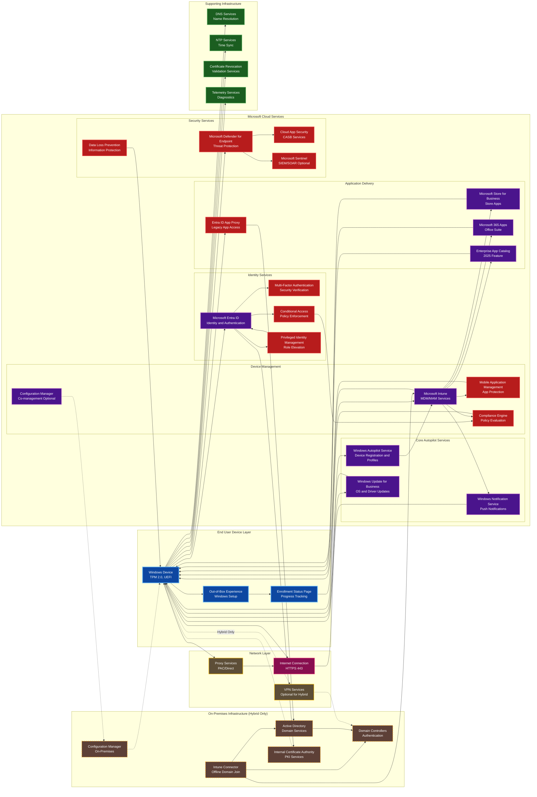

### Service Dependencies Matrix

Depicts the dependency chain between core, secondary, and conditional services, and the data flow types between them.

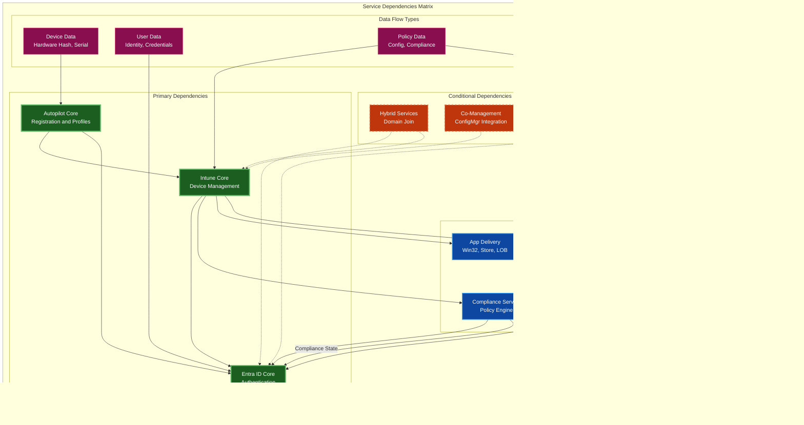

## Deployment Flow Diagrams

### User-Driven Mode: Phase 1 — Initial Boot and Network Connection

Duration approximately 0–60 seconds. Covers system initialisation, basic OS setup, and network connectivity establishment. Source: [Windows Autopilot user-driven mode — Microsoft Learn](https://learn.microsoft.com/en-us/autopilot/user-driven).

```mermaid
sequenceDiagram
    autonumber

    participant User as End User
    participant Device as Windows Device
    participant OOBE as OOBE Experience
    participant Network as Network Services

    rect rgb(26, 42, 58)
        Note over Device: Phase 1: Initial Boot and Network (0-60s)
        User->>Device: Power On Device
        Device->>Device: UEFI/BIOS POST
        Device->>Device: Boot Windows Setup
        Device->>OOBE: Launch Out-of-Box Experience

        OOBE->>User: Display Region Selection
        User->>OOBE: Select Region
        OOBE->>User: Display Keyboard Layout
        User->>OOBE: Select Keyboard

        OOBE->>User: Request Network Connection
        User->>OOBE: Connect to Network (Wi-Fi/Ethernet)
        Device->>Network: Establish Internet Connection
        Network->>Device: Connection Confirmed

        Device->>Network: Sync System Time (NTP - UDP 123)
        Network->>Device: Time Synchronised
        Device->>Network: Check Windows Updates
        Network->>Device: Critical Updates Available
        Device->>Device: Install Critical Updates (if required)

        Note over Device: Phase 1 Complete - Network Ready
    end
```

### User-Driven Mode: Phase 2 — Device Registration and Profile Discovery

Duration approximately 10–30 seconds. Covers hardware hash calculation, Autopilot service lookup, and profile retrieval. Source: [Windows Autopilot deployment profiles — Microsoft Learn](https://learn.microsoft.com/en-us/autopilot/profiles).

```mermaid
sequenceDiagram
    autonumber

    participant Device as Windows Device
    participant OOBE as OOBE Experience
    participant WAS as Autopilot Service
    participant User as End User

    rect rgb(58, 42, 26)
        Note over Device: Phase 2: Device Registration Check (10-30s)
        Device->>Device: Calculate Hardware Hash
        Device->>WAS: Send Device Identifier (Serial + Model + Hardware Hash)
        WAS->>WAS: Lookup Device Registration

        alt Device Registered for Autopilot
            WAS->>Device: Return Autopilot Profile (Mode, Join Type, Settings)
            Device->>OOBE: Apply Autopilot Configuration
            OOBE->>User: Display Organisation Branding
            Note over OOBE: Autopilot Profile Applied
        else Device Not Registered
            WAS->>Device: No Profile Found
            Device->>OOBE: Continue Standard OOBE
            Note over OOBE: Manual Setup Required
        end

        Note over WAS: Phase 2 Complete - Profile Retrieved
    end
```

### User-Driven Mode: Phase 3 — Authentication and Directory Join

Duration approximately 30–120 seconds. Covers user authentication, Azure AD join, and MDM enrolment. Source: [Windows Autopilot user-driven Microsoft Entra join — Microsoft Learn](https://learn.microsoft.com/en-us/autopilot/tutorial/user-driven/azure-ad-join-workflow).

```mermaid
sequenceDiagram
    autonumber

    participant User as End User
    participant OOBE as OOBE Experience
    participant EntraID as Microsoft Entra ID
    participant Device as Windows Device
    participant Intune as Microsoft Intune

    rect rgb(26, 58, 26)
        Note over Device: Phase 3: Authentication and Enrolment (30-120s)

        alt User-Driven Mode
            OOBE->>User: Display Organisation Sign-in Page
            User->>OOBE: Enter Credentials (user@domain.com)
            OOBE->>EntraID: Authenticate User
            EntraID->>EntraID: Validate Credentials

            alt MFA Required
                EntraID->>User: Request MFA Verification
                User->>EntraID: Provide MFA (Authenticator/SMS/FIDO2)
                EntraID->>EntraID: Validate MFA
            end

            EntraID->>OOBE: Authentication Success + Token

        else Self-Deploying Mode
            OOBE->>Device: Use Device Identity
            Device->>EntraID: Authenticate with Device Certificate (TPM)
            EntraID->>Device: Device Authentication Success
        end

        OOBE->>EntraID: Request Azure AD Join
        EntraID->>EntraID: Create Device Object
        EntraID->>Device: Azure AD Join Certificate
        Device->>Device: Store Certificate in TPM

        Device->>Intune: Initiate MDM Enrolment
        Intune->>Device: Send Enrolment Configuration
        Device->>Intune: Complete Enrolment
        Intune->>Device: Enrolment Success

        Note over Intune: Phase 3 Complete - Device Enrolled
    end
```

### Self-Deploying Mode Flow

Fully automated deployment with no user interaction. Requires TPM 2.0 for device attestation. Source: [Windows Autopilot self-deploying mode — Microsoft Learn](https://learn.microsoft.com/en-us/autopilot/self-deploying).

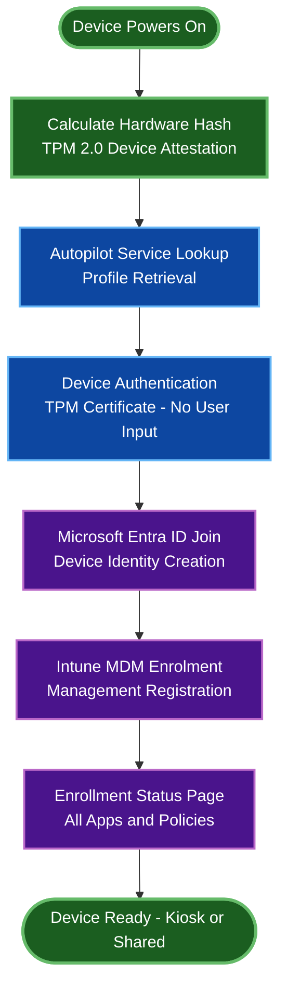

### Pre-Provisioning (White Glove) Flow

Two-phase deployment: technician phase pre-stages device; user phase completes personalisation. Source: [Windows Autopilot pre-provisioned deployment — Microsoft Learn](https://learn.microsoft.com/en-us/autopilot/pre-provision).

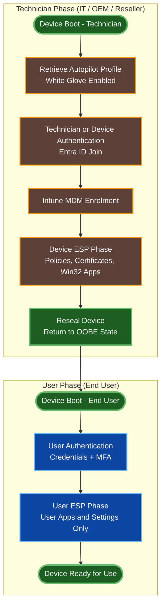

## Service Boundary Diagrams

These diagrams clarify the distinct responsibilities of Windows Autopilot, Microsoft Entra ID, and Microsoft Intune. A common misconception is that Autopilot manages and configures devices — in reality Autopilot is a device discovery and redirection service with a scope of approximately 60–90 seconds. Source: [Windows Autopilot overview — Microsoft Learn](https://learn.microsoft.com/en-us/autopilot/overview).

### Service Responsibility Matrix

| Responsibility Area | Windows Autopilot | Microsoft Entra ID | Microsoft Intune |
|--------------------|-------------------|-------------------|-----------------|
| Device discovery | Primary owner | Not involved | Not involved |
| Device registration | Initiates only | Primary owner | Not involved |
| User authentication | Not involved | Primary owner | Not involved |
| Device authentication | Not involved | Primary owner | Not involved |
| Device join (Entra / Hybrid) | Not involved | Primary owner | Not involved |
| MDM enrolment | Not involved | Initiates only | Primary owner |
| Policy application | Not involved | Not involved | Primary owner |
| Security configuration | Not involved | Not involved | Primary owner |
| Application deployment | Not involved | Not involved | Primary owner |
| Compliance evaluation | Not involved | Stores results | Primary owner |
| Ongoing management | Not involved | Not involved | Primary owner |

### Complete Service Handoff Sequence

Depicts the full handoff chain from device boot through to ongoing Intune management. Source: [Windows Autopilot deployment — Microsoft Learn](https://learn.microsoft.com/en-us/autopilot/windows-autopilot).

```mermaid
flowchart TD
    subgraph "Device Boot and Discovery"
        DeviceBoot[Device Powers On<br/>OOBE Starts]
        HardwareHash[Calculate Hardware Hash<br/>Device Identification]
    end

    subgraph "Windows Autopilot Service (60-90 seconds)"
        AutopilotLookup[Device Registration Lookup<br/>Hardware Hash to Profile]
        ProfileAssignment[Profile Assignment<br/>Deployment Configuration]
        OOBECustomization[OOBE Customisation<br/>Branding and Experience]
        AutopilotHandoff[HANDOFF TO ENTRA ID<br/>Authentication Required]
    end

    subgraph "Microsoft Entra ID Service (30-120 seconds)"
        UserAuth[User Authentication<br/>Credentials and MFA]
        DeviceAuth[Device Authentication<br/>Certificate and Trust]
        AADJoin[Azure AD Join<br/>Device Identity Creation]
        ConditionalAccess[Conditional Access<br/>Policy Evaluation]
        EntraHandoff[HANDOFF TO INTUNE<br/>Management Required]
    end

    subgraph "Microsoft Intune Service (Ongoing)"
        MDMEnrollment[MDM Enrolment<br/>Management Registration]
        PolicyApplication[Policy Application<br/>Configuration and Security]
        AppDeployment[Application Deployment<br/>Software Installation]
        ComplianceEnforcement[Compliance Enforcement<br/>Ongoing Monitoring]
        OngoingManagement[Ongoing Management<br/>Lifecycle Operations]
    end

    DeviceBoot --> HardwareHash
    HardwareHash --> AutopilotLookup
    AutopilotLookup --> ProfileAssignment
    ProfileAssignment --> OOBECustomization
    OOBECustomization --> AutopilotHandoff

    AutopilotHandoff --> UserAuth
    UserAuth --> DeviceAuth
    DeviceAuth --> AADJoin
    AADJoin --> ConditionalAccess
    ConditionalAccess --> EntraHandoff

    EntraHandoff --> MDMEnrollment
    MDMEnrollment --> PolicyApplication
    PolicyApplication --> AppDeployment
    AppDeployment --> ComplianceEnforcement
    ComplianceEnforcement --> OngoingManagement

    classDef autopilotService fill:#ff9800,stroke:#f57c00,stroke-width:3px,color:#ffffff
    classDef entraService fill:#4a148c,stroke:#ba68c8,stroke-width:3px,color:#ffffff
    classDef intuneService fill:#0d47a1,stroke:#64b5f6,stroke-width:3px,color:#ffffff
    classDef handoff fill:#d32f2f,stroke:#ef5350,stroke-width:4px,color:#ffffff
    classDef device fill:#1b5e20,stroke:#66bb6a,stroke-width:2px,color:#ffffff

    class AutopilotLookup,ProfileAssignment,OOBECustomization autopilotService
    class UserAuth,DeviceAuth,AADJoin,ConditionalAccess entraService
    class MDMEnrollment,PolicyApplication,AppDeployment,ComplianceEnforcement,OngoingManagement intuneService
    class AutopilotHandoff,EntraHandoff handoff
    class DeviceBoot,HardwareHash device
```

### Service Communication Sequence (API-Level)

Depicts the API endpoint ownership for each service handoff. Source: [Windows Autopilot requirements — Microsoft Learn](https://learn.microsoft.com/en-us/autopilot/requirements).

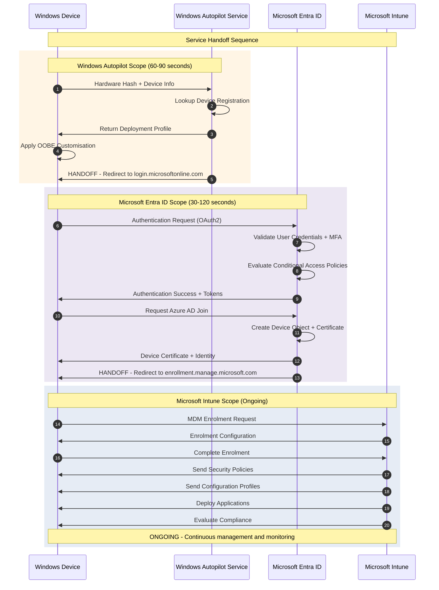

### Service Dependency Chain

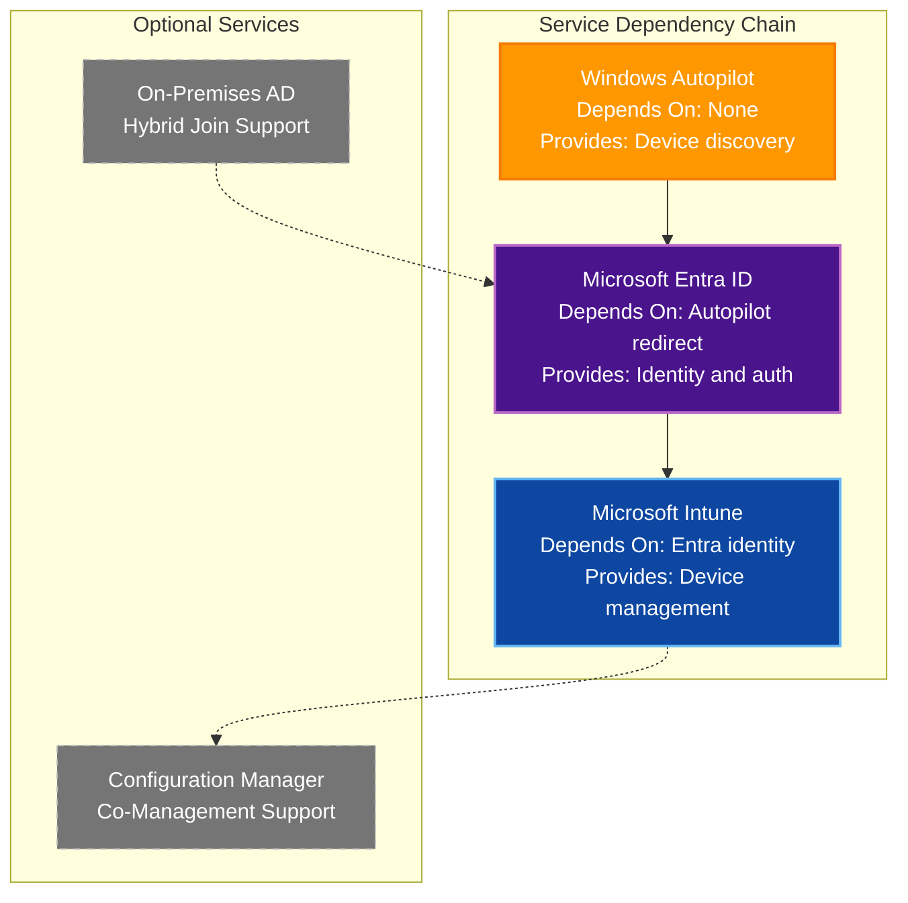

### Deployment Timeline with Service Boundaries

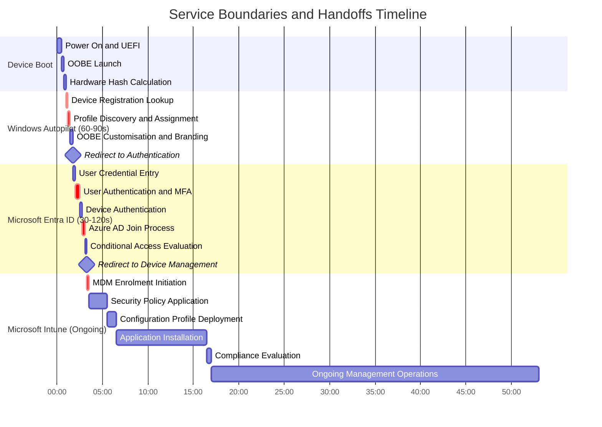

## Related Resources

- [Windows Autopilot overview — Microsoft Learn](https://learn.microsoft.com/en-us/autopilot/overview)
- [Windows Autopilot user-driven mode — Microsoft Learn](https://learn.microsoft.com/en-us/autopilot/user-driven)
- [Windows Autopilot self-deploying mode — Microsoft Learn](https://learn.microsoft.com/en-us/autopilot/self-deploying)
- [Windows Autopilot pre-provisioned deployment — Microsoft Learn](https://learn.microsoft.com/en-us/autopilot/pre-provision)
- [Windows Autopilot deployment profiles — Microsoft Learn](https://learn.microsoft.com/en-us/autopilot/profiles)
- [Microsoft Entra device management — Microsoft Learn](https://learn.microsoft.com/en-us/entra/identity/devices/)
- [Microsoft Intune device management — Microsoft Learn](https://learn.microsoft.com/en-us/intune/intune-service/fundamentals/)
- [Windows Autopilot requirements — Microsoft Learn](https://learn.microsoft.com/en-us/autopilot/requirements)
