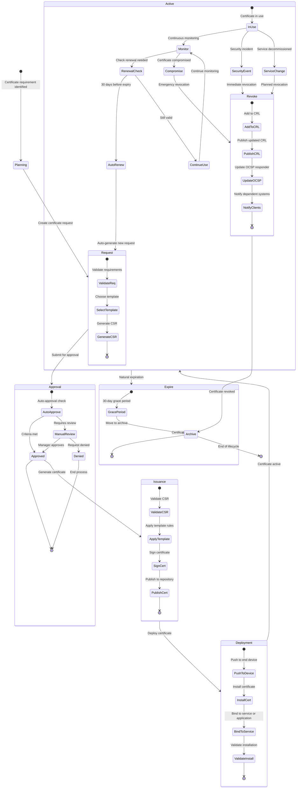
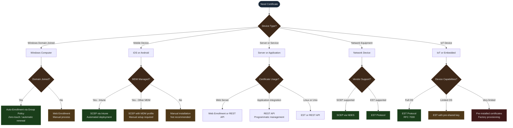
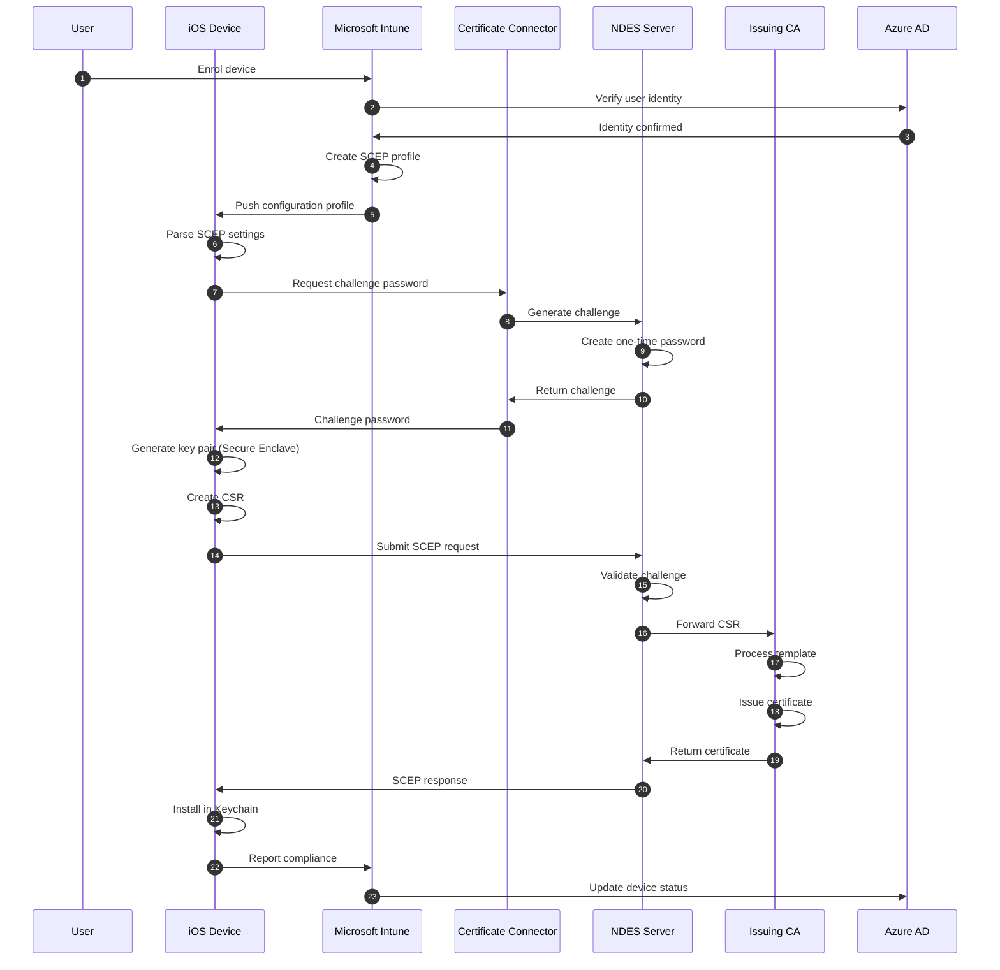

# Certificate Enrolment Protocols and Lifecycle

## The Enrolment Problem

Certificate enrollment is the process by which an end entity — a device, user, or service — acquires a certificate signed by a trusted CA. The challenge is that this process must be secure (the CA should only issue certificates to legitimate, authenticated requesters), automated at scale (10,000+ endpoints cannot rely on manual processes), and protocol-appropriate (different platforms speak different enrollment languages).

No single protocol satisfies all environments. Windows domain-joined devices have deep OS-level integration with AD CS. Mobile devices managed by [Microsoft Intune](https://learn.microsoft.com/en-us/mem/intune/protect/certificates-scep-configure) use SCEP over HTTPS. Linux servers and IoT devices may use REST-based protocols. Network switches enroll via SCEP directly. This document explains what each protocol is, why it exists, and which platform considerations govern its use.

## Certificate Lifecycle Concepts

Before examining individual protocols, it helps to understand the stages every certificate passes through regardless of how it was enrolled.

**Planning** involves determining what the certificate is for, which template governs it, and what assurance level applies. Template selection at this stage determines almost every downstream property of the certificate.

**Request** involves generating a key pair on the requesting device and creating a Certificate Signing Request. The private key is generated locally and should never leave the device — the CA only receives the public key embedded in the CSR, plus the requester's identity claims.

**Issuance** is the CA's role: validate the CSR against the template's constraints, verify the requester's identity through whatever authentication mechanism the protocol provides, and sign the certificate. The template determines key usage extensions, Enhanced Key Usage OIDs, subject name format, validity period, and whether private key archival is permitted.

**Active** is the operational phase. The certificate is in use, monitored for approaching expiry, and subject to revocation if a security event occurs. Renewal is triggered at 80% of the certificate's lifetime for most template types, giving a substantial overlap window during which both old and new certificates are valid.

**Revocation** updates the CRL and OCSP responder. The CA adds the certificate serial number and revocation reason code to the CRL. The OCSP responder's cache is updated within its normal refresh cycle (4 hours). For immediate-effect revocation (key compromise), the OCSP responder should be updated out of band.

## Enrollment Protocol Comparison

### Windows Auto-Enrollment (Group Policy)

Auto-enrollment is the native Windows mechanism for domain-joined computers and users to obtain certificates without any user interaction. It is driven by [Group Policy](https://learn.microsoft.com/en-us/windows-server/identity/ad-cs/certificate-autoenrollment-overview), which configures a registry value (`AEPolicy = 7`) that instructs the Windows Certificate Services client to enrol, renew expiring certificates, update pending requests, and remove revoked certificates automatically.

The enrollment protocol used under the hood is the [MS-WCCE (Windows Client Certificate Enrollment Protocol)](https://learn.microsoft.com/en-us/openspecs/windows_protocols/ms-wcce/446a0fca-7f27-4436-965d-191635518466), a Microsoft-proprietary RPC-based protocol that communicates directly with the AD CS CA. This protocol is what makes auto-enrollment tightly bound to the Windows and AD CS ecosystem — it cannot be used by non-Windows clients or non-AD CS CAs.

The auto-enrollment cycle runs every 8 hours (or on user logon and computer startup). At each cycle, the client checks the Trusted Root and Intermediate certificate stores against the templates it has enrolment rights to, compares the current certificate state against expected state, and submits new requests or renewals as needed. All of this occurs without user visibility.

**What auto-enrollment is not**: it is not a general-purpose enrollment mechanism. It requires Active Directory, domain membership, and an AD CS CA that is a member of the domain. Workgroup machines, Azure AD-only joined devices, and non-Windows platforms cannot use it.

### SCEP (Simple Certificate Enrolment Protocol)

[SCEP](https://datatracker.ietf.org/doc/html/rfc8894) was originally developed by Cisco for network device enrollment in the late 1990s and has since become the de facto standard for mobile device certificate enrollment. Its appeal is simplicity: it operates over HTTP/HTTPS, requires no client-side PKI infrastructure, and uses a one-time challenge password to authenticate the initial enrollment request.

In the enterprise architecture, SCEP is served by the [Network Device Enrolment Service (NDES)](https://learn.microsoft.com/en-us/windows-server/identity/ad-cs/network-device-enrollment-service-overview), a role service that acts as a registration authority between SCEP clients and the AD CS CA. NDES generates a one-time challenge password for each enrollment attempt; the client must include this password in its SCEP request as proof of authorisation.

The SCEP flow involves three operations:

1. **GetCACert** — the client retrieves the CA's certificate to use as the encryption target for its request
2. **GetCACaps** — the client queries what operations and algorithms the SCEP server supports
3. **PKCSReq** — the client submits its CSR, encrypted to the CA certificate and signed with the challenge password

For mobile devices managed by [Microsoft Intune](https://learn.microsoft.com/en-us/mem/intune/protect/certificates-scep-configure), the challenge password is generated dynamically by Intune via the Certificate Connector, removing the operational burden of pre-generating and distributing passwords. Intune pushes a SCEP configuration profile to the device specifying the NDES URL, subject name format, certificate template parameters, and renewal threshold. The device generates its key pair locally (using hardware-backed storage where the platform supports it) and exchanges the SCEP transaction transparently.

A critical property of SCEP is that the private key is generated on the device and never transmitted. The CA receives only the public key. This is correct security behaviour and is why SCEP-enrolled certificates are considered device-bound — the private key lives in the device's secure enclave or TPM and cannot be extracted.

### EST (Enrolment over Secure Transport)

[EST (RFC 7030)](https://datatracker.ietf.org/doc/html/rfc7030) is the modern successor to SCEP, designed to address SCEP's limitations. Where SCEP uses a custom binary protocol over HTTP, EST uses standard HTTPS with TLS mutual authentication. Where SCEP relies on a challenge password for initial authentication, EST can use any TLS authentication mechanism including client certificates, HTTP Basic Auth, or pre-shared keys.

EST is preferred for Linux servers and IoT devices for several reasons. Linux servers typically have full TLS stacks and can participate in mutual TLS without ceremony. IoT devices with constrained resources benefit from EST's support for [RFC 5272 (CMC over HTTP)](https://datatracker.ietf.org/doc/html/rfc5272) simplified requests, which reduce message overhead. EST also natively supports automatic renewal (re-enrolment) using an existing certificate as proof of identity, which is the correct model for long-lived infrastructure certificates.

The architecture uses EST for Linux servers (200 systems) and IoT endpoints (1,000 devices) via the PKI REST API layer. Network equipment from Juniper and other vendors that supports RFC 7030 also uses EST where available, falling back to SCEP for legacy devices.

### Manual Web Enrollment

[AD CS Web Enrollment](https://learn.microsoft.com/en-us/windows-server/identity/ad-cs/certificate-services-web-enrollment-role-service) provides a browser-based interface for requesting certificates that cannot be obtained through automated means. The primary use case is macOS workstations (500 devices) that are not domain-joined and therefore cannot use auto-enrollment.

Web enrollment is a deliberate manual process, which is appropriate for the certificate types it typically handles: SSL/TLS certificates for internal web services, code signing certificates (which require two-person approval regardless of channel), and one-off certificates for special-purpose services. The manual nature is a feature rather than a limitation for these cases — it creates an explicit human approval step that is desirable for high-value certificates.

The web enrollment service is hosted in the Certificate Services zone (Zone 3) and accessible through the NetScaler VIP. It authenticates users via Kerberos for domain users and via username/password for external requesters presenting valid client certificates.

### REST API Enrollment

The PKI REST API (hosted at 10.50.4.50) provides a programmatic enrollment interface for applications and automation pipelines. It sits above the CA's native interfaces and translates REST calls to the appropriate AD CS request format.

The REST API is the correct channel for certificates that are managed by automation: certificates for CI/CD pipeline signing, short-lived certificates for containers, certificates for application service accounts, and any scenario where certificate lifecycle management is embedded in a deployment pipeline rather than triggered by a human or OS mechanism. Linux servers (200 systems) use this path where direct API integration is possible, falling back to EST for simpler automation.

The REST API enforces the same template constraints and permission checks as every other enrollment path — it is not a bypass mechanism. It adds API gateway authentication (OAuth 2.0 with Azure AD service principals) and rate limiting per endpoint.

### Protocol Selection by Platform

## Certificate Template Architecture

### What Templates Do

A certificate template is a policy object stored in Active Directory that defines every configurable aspect of a certificate type: key algorithm and minimum size, validity period, Extended Key Usage OIDs, subject name source (built from AD attributes or supplied by the requester), whether private key archival is permitted, the approval workflow (auto-issue or manager review), and which security principals have enrolment and auto-enrolment permissions.

Templates are not merely configuration — they are the mechanism by which the CA enforces separation of purpose across certificate types. A Domain Computer template has `Client Authentication` (1.3.6.1.5.5.7.3.2) in its EKU. A Web Server template has `Server Authentication` (1.3.6.1.5.5.7.3.1). A Code Signing template has `Code Signing` (1.3.6.1.5.5.7.3.3) and requires HSM key storage with two-person approval. These distinctions prevent a computer certificate from being used to sign code, or a code signing certificate from being used to authenticate a network connection.

### Template Schema Versions

AD CS supports four template schema versions. The architecture uses Version 4 templates (the current maximum) for all new templates, which enables SHA-2 algorithms, key attestation, and the most granular issuance policy controls. Older templates in the environment are being migrated to Version 4 as part of the modernisation effort.

### Policy Modules and Issuance Requirements

AD CS policy modules intercept each certificate request before issuance and evaluate it against rules. The default policy module checks that:

1. The requester has Enrol permission on the requested template
2. The CSR's key parameters meet the template's minimums
3. The subject name matches the template's subject name policy
4. For templates requiring manager approval, the request is queued rather than immediately issued

Custom policy module logic extends these checks to enforce organisation-specific rules: for example, requiring that certificate subject names match Active Directory attributes (preventing requesters from embedding arbitrary names in certificates), or enforcing that external-facing certificates include a Subject Alternative Name that matches an approved DNS namespace.

### Renewal and Overlap

The architecture uses an 80% lifetime trigger for automated renewal across all standard certificate types. For a 2-year certificate, renewal begins at 1 year and 7 months. The old certificate remains valid for the remaining 20% of its lifetime — approximately 5 months — providing an overlap window during which both old and new certificates are trusted. This overlap is intentional: it prevents hard cutover failures if renewal is delayed, and it gives load balancers and service bindings time to pick up the new certificate without a synchronised change window.

Code Signing certificates use a 60-day manual renewal trigger (last 60 days of validity) with a 30-day overlap. The longer lead time reflects the approval workflow overhead and the risk of a signing interruption if a developer attempts to sign code after expiry.

## Platform-Specific Enrollment Considerations

### Windows (5,000 Workstations and 500 Servers)

Domain-joined Windows devices use auto-enrollment for all standard certificate types. The 8-hour refresh cycle means that a new template or policy change reaches all devices within 8 hours of deployment without any manual action. Server certificates for IIS and other services use auto-enrollment where the service runs on a domain-joined host, or the REST API where the service is in a container or runs as a service account rather than under a machine identity.

The Windows Cryptography API Next Generation (CNG) and Cryptographic Service Providers (CSPs) handle key generation. For workstations with TPM 2.0, the [Platform Crypto Provider](https://learn.microsoft.com/en-us/windows/security/hardware-security/tpm/how-windows-uses-the-tpm) binds the private key to the TPM, making it non-extractable even by the OS. This hardware binding is enforced at the template level by selecting the appropriate key storage provider.

### iOS and Android (3,500 Mobile Devices)

Mobile devices enrolled in [Microsoft Intune](https://learn.microsoft.com/en-us/mem/intune/protect/certificates-scep-configure) receive certificate configuration profiles pushed by Intune. The profile specifies the NDES URL, subject name format (using Intune device attribute variables such as `{{AAD_DeviceId}}` and `{{UserPrincipalName}}`), key size, validity, and renewal threshold.

iOS stores certificates in the device Keychain, with private keys in the Secure Enclave on devices with A7 chips or later. Android Enterprise uses the hardware-backed Keystore where the device supports it (Android 6.0 and later with StrongBox support). Both platforms enforce that the private key cannot be exported from the device, providing the same non-extractability property as TPM-bound Windows keys.

The Intune Certificate Connector runs on-premises (Zone 3, 10.50.4.40) and brokers the SCEP challenge password generation. Intune sends the connector a notification that a device needs a certificate; the connector requests a one-time password from NDES and returns it to Intune, which embeds it in the SCEP profile delivered to the device. This flow means devices never directly contact NDES without a valid, time-limited challenge.

### iOS Enrollment Flow

### macOS (500 Devices)

macOS devices in this environment are not domain-joined and therefore cannot use auto-enrollment. They use the Web Enrollment service for certificates that require manual issuance, and [Intune SCEP profiles via the Company Portal](https://learn.microsoft.com/en-us/mem/intune/protect/certificates-scep-configure) for device authentication certificates where the device is MDM-managed.

The split reflects the macOS enrollment model: MDM-managed Macs can receive SCEP profiles just like iOS devices, including hardware-backed key storage via the macOS Secure Enclave on Apple Silicon. Non-MDM-managed Macs (typically administrator and developer machines) require manual enrollment, which is acceptable because this population is small and high-trust.

### Linux Servers (200 Systems)

Linux servers have no native AD CS integration. They use either the EST protocol directly or the REST API, depending on whether the enrollment is driven by the OS or by an application deployment pipeline.

For servers that need machine authentication certificates (for 802.1X or mutual TLS with internal services), the preferred path is EST with an existing bootstrap certificate for re-enrolment, or EST with a pre-shared key for initial enrollment. For application-layer certificates managed by infrastructure-as-code (Terraform, Ansible), the REST API is more appropriate because it integrates naturally into pipeline tooling.

Linux key pairs are generated using OpenSSL or the platform's native cryptographic library and stored in the system certificate store. Unlike Windows and Apple platforms, Linux does not have a universal hardware-backed key store — TPM integration for private keys requires [tpm2-pkcs11](https://github.com/tpm2-software/tpm2-pkcs11) or similar, which is implemented for security-sensitive servers but not universally deployed.

### Network Infrastructure (Switches, Wireless APs, Branch Firewalls)

Network infrastructure devices use SCEP for 802.1X client certificates and for VPN authentication certificates. Cisco devices support SCEP natively via `crypto pki trustpoint` configuration. Juniper devices support both SCEP and EST depending on JunOS version. Generic network devices that lack native SCEP support require manual certificate deployment.

802.1X certificate authentication for network access follows [EAP-TLS](https://datatracker.ietf.org/doc/html/rfc5216), the standard for certificate-based 802.1X. The network device presents its certificate during the EAP handshake; the RADIUS server (NPS) validates the certificate chain against the trusted root and checks that the certificate's EKU includes Client Authentication.

IoT devices (1,000 endpoints) present the most constrained enrollment environment. Those with sufficient processing capability use EST with pre-shared keys. Those with very limited resources use factory-provisioned certificates loaded at manufacturing time. Factory provisioning does not scale well and is not preferred — it requires coordination with device vendors and creates certificate management challenges at renewal time. EST is therefore used wherever the device's firmware permits it.

## Revocation and Its Relationship to Enrollment

Revocation is conceptually separate from enrollment but is deeply linked to it in the infrastructure design. Every certificate issued must be revocable, and the revocation infrastructure (CRL distribution points and OCSP responders) must be accessible to all relying parties that may encounter a certificate issued by this PKI.

The CDP URLs embedded in every issued certificate must resolve to HTTP (not HTTPS) for CRL downloads, because the certificate being validated cannot be used to establish a TLS connection to retrieve its own revocation status — that would be circular. [RFC 5280](https://datatracker.ietf.org/doc/html/rfc5280) specifies this: CRL distribution points must be accessible via HTTP or LDAP without requiring a certificate to authenticate the client. Azure Storage serves the CRL files via HTTP with CDN integration, providing global distribution and high availability for external relying parties.

OCSP stapling at the load balancer layer (NetScaler and F5) pre-fetches the OCSP response for each server certificate and embeds it in the TLS handshake. This means clients receive the revocation status without making a separate OCSP query, reducing latency for every TLS connection and eliminating OCSP as a potential bottleneck or single point of failure for TLS availability.

## Related Resources

- [SCEP RFC 8894](https://datatracker.ietf.org/doc/html/rfc8894)
- [EST RFC 7030 — Enrolment over Secure Transport](https://datatracker.ietf.org/doc/html/rfc7030)
- [EAP-TLS RFC 5216](https://datatracker.ietf.org/doc/html/rfc5216)
- [RFC 5280 — Internet X.509 PKI Certificate and CRL Profile](https://datatracker.ietf.org/doc/html/rfc5280)
- [Microsoft Learn — Configure SCEP Certificate Profiles in Intune](https://learn.microsoft.com/en-us/mem/intune/protect/certificates-scep-configure)
- [Microsoft Learn — NDES Overview](https://learn.microsoft.com/en-us/windows-server/identity/ad-cs/network-device-enrollment-service-overview)
- [Microsoft Learn — Certificate Auto-Enrollment](https://learn.microsoft.com/en-us/windows-server/identity/ad-cs/certificate-autoenrollment-overview)
- [Microsoft Learn — Trusted Root Certificate Profiles in Intune](https://learn.microsoft.com/en-us/mem/intune/protect/certificates-trusted-root)
- [Microsoft Learn — Windows Client Certificate Enrolment Protocol (MS-WCCE)](https://learn.microsoft.com/en-us/openspecs/windows_protocols/ms-wcce/446a0fca-7f27-4436-965d-191635518466)
- [ACSC ISM — Cryptography](https://www.cyber.gov.au/resources-business-and-government/essential-cyber-security/ism)
- [tpm2-pkcs11 — TPM2 PKCS11 Provider](https://github.com/tpm2-software/tpm2-pkcs11)
