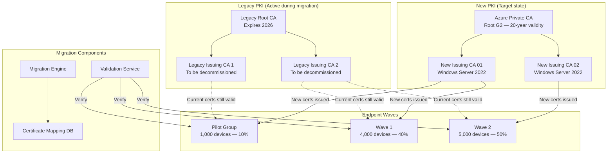
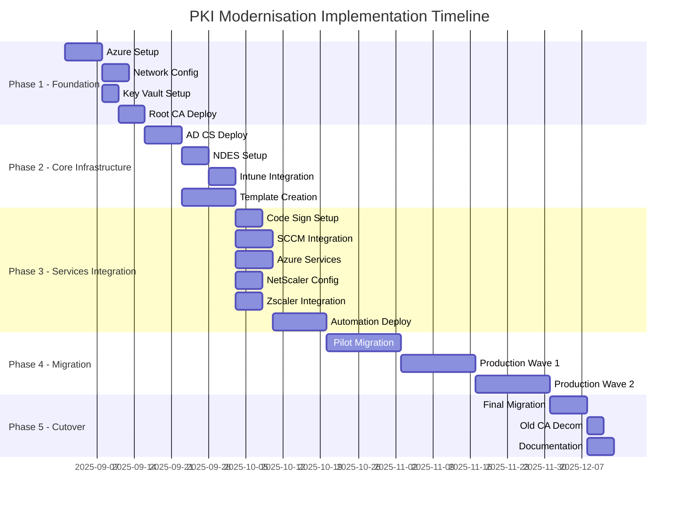

# PKI Migration Strategy and Rationale

## Why Migrate at All

Legacy PKI infrastructure ages in ways that are not always visible until a crisis forces the issue. The drivers for this migration fall into three categories: technical debt, security posture, and operational capability.

**Technical debt** accumulates when a PKI is built incrementally without a coherent design. The legacy root CA was approaching its expiry boundary (2026), which would have required every certificate in the estate to be reissued under a new root regardless of any other modernisation effort. The forced re-issuance event created a natural migration window: rather than simply renewing the old root in place, the opportunity existed to redesign the hierarchy at the same time.

**Security posture** under the legacy deployment did not meet current [ACSC ISM](https://www.cyber.gov.au/resources-business-and-government/essential-cyber-security/ism) expectations. Root CA private keys were held on-premises in software key storage without HSM protection. There was no separation between the root and issuing CAs in terms of operational risk — both were effectively online. Key ceremony documentation was incomplete. These gaps represented material risk to the organisation's trust anchor.

**Operational capability** was limited by the legacy infrastructure's inability to support modern enrollment protocols at scale. SCEP via NDES for mobile devices was not integrated with Intune in an automated way. Linux and IoT certificate enrollment had no structured path. Certificate lifecycle management was largely manual, with no programmatic API. As the device estate grew to include 3,500 mobile devices, 200 Linux servers, and 1,000 IoT endpoints, the legacy enrollment model could not keep pace.

The migration is therefore not a lift-and-shift of the old PKI into a new data centre. It is a replacement of both the trust hierarchy and the enrollment infrastructure, executed in a way that minimises disruption to the existing estate.

## Migration Architecture: Dual PKI Operation

The central architectural decision in the migration is running both PKIs in parallel during the transition rather than performing a hard cutover. This dual operation model is the foundation of the zero-downtime commitment.

During dual operation, both the legacy and new PKIs are active. A device that has been migrated holds certificates from the new PKI; a device that has not yet been migrated holds certificates from the legacy PKI. Both sets of certificates are simultaneously trusted because both root CAs are present in the estate's Trusted Root stores — the new root is distributed via Group Policy and Intune profiles before migration begins.

This approach means migration progress can be measured, individual device failures can be rolled back, and the migration can be paused or reversed at any wave boundary without affecting the unmigrated population. It also means the legacy PKI's CRL and OCSP infrastructure must remain operational throughout the entire migration period, because unmigrated devices still rely on it for certificate validation.

## Phased Migration Approach

### Why Phased Rather Than Big-Bang

A simultaneous migration of 10,000 devices carries risks that are disproportionate to its benefits. A single defect in the migration tooling, an unanticipated application dependency on the legacy CA's subject DN format, or an edge case in certificate chain validation could affect the entire estate simultaneously. The blast radius is maximised.

Phased migration inverts this: the blast radius of any given defect is limited to the current wave. Lessons learned in the Pilot directly inform Wave 1's execution. Wave 1's lessons inform Wave 2. By the time the largest population (Wave 2, 50% of devices) is migrated, the process has been validated against a representative 50% of the estate.

The [ACSC ISM guidance on change management](https://www.cyber.gov.au/resources-business-and-government/essential-cyber-security/ism) supports this approach — changes to cryptographic infrastructure should be tested in controlled environments before broad deployment, with rollback capability maintained throughout.

### Pilot (10% — approximately 1,000 Devices)

The Pilot targets the IT department and volunteers from other departments. This group is selected deliberately for its tolerance of disruption and its ability to provide quality feedback. IT staff understand certificate errors and can articulate what broke; volunteers from the business have consented to participate and are available for direct follow-up.

Pilot group selection criteria balance three concerns:

- **Technical coverage**: IT staff represent the population most likely to exercise unusual certificate usage (code signing, smart card logon, VPN with certificate authentication, administrative tools that validate certificate properties).
- **Representative sampling**: volunteers from Sales, Finance, HR, and Operations ensure that the pilot exercises certificate dependencies that IT staff may not encounter in their own workflows.
- **Rollback feasibility**: 1,000 devices is large enough to surface systemic issues but small enough that a full rollback is operationally manageable within a maintenance window.

During the Pilot, a parallel validation service runs real-time checks against every migrated device, confirming that new certificates are installed, that certificate chains validate, and that critical services (RDP, SMB, WinRM) remain functional after migration. Failures trigger automatic rollback — the old certificates are restored from backup and the migration state for that device is marked for manual review.

The Pilot produces a catalogue of exceptions: applications that pinned the legacy CA's certificate thumbprint, services that hard-coded subject DN patterns, and edge cases in the migration tooling. These exceptions are resolved before Wave 1 begins.

### Production Wave 1 (40% — approximately 4,000 Devices)

Wave 1 targets the broader corporate population excluding the highest-risk systems. The 40% scope is chosen to be large enough to validate the migration tooling at production scale while still leaving the 50% Wave 2 population as a fallback if a systemic issue emerges.

Wave 1 is executed in batches of approximately 50 devices, with a 5-minute delay between batches. The batching rate reflects the capacity of the migration validation service and the CA issuance infrastructure: 50 devices per batch at 5-minute intervals translates to 600 devices per hour, allowing Wave 1 to complete within a week of continuous operation while avoiding burst load spikes that could affect the CAs' response times for non-migration certificate operations.

The success criteria gate Wave 2:

- Certificate validation rate above 99.9% across migrated devices
- Fewer than 5 user-reported impact incidents per 1,000 devices
- Zero unplanned service outages attributable to the migration
- Rollback procedures tested and confirmed functional

### Production Wave 2 (50% — remaining 5,000 Devices)

Wave 2 migrates the remainder of the estate, including the highest-complexity systems: servers with multiple certificate bindings, network infrastructure, and any systems that were deferred from Wave 1 due to planned maintenance conflicts or application-specific migration prerequisites.

By this stage, the migration tooling has been exercised against 5,000 devices and the exception catalogue is comprehensive. Wave 2's execution is mechanically similar to Wave 1 but with a refined exception handling playbook and faster batch processing where the validation data supports it.

### Overall Migration Timeline

The full migration spans 5 phases across approximately 8 months:

Phases 1 through 3 establish the new PKI infrastructure before any migration occurs. Phase 4 is the migration itself. Phase 5 is the final cutover and legacy decommissioning.

## Certificate Replacement Strategy

### The Replacement Problem

Replacing a certificate on a device is straightforward in isolation: install the new certificate, update any service bindings, remove the old certificate. The complexity arises from the dependencies that certificate consumers have built on specific certificate properties.

Applications may depend on:

- The **issuer DN** (subject of the CA certificate) — hard-coded in application configuration, LDAP filters, or certificate validation logic
- The **subject DN format** — applications that parse the subject CN to extract a device name or username will fail if the new PKI uses a different naming convention
- **Certificate thumbprint** — applications that pin a specific certificate thumbprint for mutual TLS rather than validating the chain will fail when the thumbprint changes
- **Key usage and EKU values** — applications that explicitly check Extended Key Usage OIDs may reject certificates with different EKU combinations even if both are cryptographically valid
- **Validity period** — some applications enforce a maximum certificate validity that differs from the PKI's issued validity

The migration tooling addresses the first two through template design: the new issuing CAs use the same subject naming conventions as the legacy CAs for all standard certificate types, minimising the impact of issuer DN changes. The latter three — thumbprint pinning, EKU validation, and validity enforcement — are discovered through the Pilot and documented in the exception catalogue.

### Application Compatibility Assessment

Before Wave 1, every application in the estate is assessed against a compatibility matrix. Applications are categorised:

- **Compatible**: validates certificate chain to trusted root, no thumbprint pinning, standard EKU requirements. These applications require no changes.
- **Issuer-dependent**: parses or filters on the issuer DN. These require configuration updates to accept the new issuer DN alongside (or instead of) the legacy issuer.
- **Thumbprint-pinned**: hard-codes certificate thumbprints. These require code or configuration changes and must be updated before the device hosting that certificate is migrated.
- **Incompatible**: cannot be made to work with the new PKI without vendor support or application replacement. These are escalated.

The incompatible category is expected to be small. Modern applications built on standard TLS libraries perform chain validation rather than thumbprint pinning — thumbprint pinning is an anti-pattern that [Microsoft's own security guidance](https://learn.microsoft.com/en-us/azure/security/fundamentals/certificate-pinning) discourages precisely because it breaks at certificate renewal events.

### Trust Store Distribution Before Migration

The new root CA certificate is distributed to all endpoints before any migration wave begins. This is the prerequisite that makes the dual PKI model work: if the new root is not in an endpoint's Trusted Root store when its certificate is replaced, the new certificate will not be trusted and every certificate-dependent service will fail simultaneously.

Distribution uses:

- [Group Policy](https://learn.microsoft.com/en-us/windows-server/identity/ad-cs/certificate-group-policy-overview) for domain-joined Windows devices — pushed to the Trusted Root Certification Authorities store at the Computer Configuration level, taking effect at the next Group Policy refresh (up to 90 minutes, or immediately on a `gpupdate /force`)
- [Microsoft Intune Trusted Certificate profiles](https://learn.microsoft.com/en-us/mem/intune/protect/certificates-trusted-root) for mobile devices and Azure AD-joined Windows devices
- Manual distribution via configuration management (Ansible, Chef) for Linux servers
- Network device configuration templates for switches and firewalls

Trust store distribution is validated across the estate before Pilot begins — a device that has not received the new root is not eligible for migration.

## Risk Management

### The Rollback Design

Every migration batch maintains the ability to roll back to the legacy certificate state. Before replacing a device's certificates, the migration tooling exports the existing certificates to an encrypted backup at a network share (`\\FileServer\PKI-Backup\<wave>\<device>`). The backup path is recorded in the migration tracking database.

If post-migration validation fails — new certificates are not present, chain validation fails, or a critical service connectivity test fails — the rollback path restores the backed-up certificates from the legacy PKI and removes the new certificates. The device is returned to its pre-migration state and flagged for manual investigation.

Rollback capability is preserved for 30 days after each wave completes. After 30 days, backup materials are archived (not deleted) per certificate lifecycle policy.

### Dual CRL and OCSP Operation

During the migration period, both the legacy PKI's and the new PKI's revocation infrastructure must remain operational. A relying party validating a certificate from the legacy PKI will attempt to reach the legacy CRL distribution points and OCSP responders. These cannot be decommissioned until the last legacy certificate expires or is replaced.

This means the migration period requires operating two complete sets of revocation infrastructure in parallel. The operational cost is accepted as the price of zero-downtime migration. Legacy PKI revocation infrastructure is scheduled for decommissioning 6 months after the final legacy certificate expiry, providing a safety margin for any certificates that were issued close to the end of the legacy PKI's operational life.

### Monitoring During Migration

The migration tracking database provides a real-time view of migration state across the estate. The operations team monitors:

- **Migration success rate** per batch — a rate below 95% pauses migration automatically pending investigation
- **Validation test pass rate** per migrated device — fails trigger rollback and generate an incident
- **CA issuance latency** — migration-driven enrollment should not degrade latency for non-migration certificate operations; a sustained increase above the baseline triggers a batch rate reduction
- **OCSP query volume** — both legacy and new OCSP responders are monitored; unexpected spikes in legacy OCSP volume during a wave may indicate that rollbacks are occurring at a higher rate than the migration success metrics show

## Legacy PKI Decommissioning Rationale

### Why Not Decommission Immediately

The legacy PKI cannot be decommissioned when the last device is migrated. Two constraints persist:

**Certificate validity overlap**: certificates issued by the legacy PKI remain valid until their natural expiry. A legacy computer certificate with a 2-year validity issued the day before Wave 1 began will remain valid for nearly two years after the Pilot starts. Any service that accepted that certificate at connection time and cached the acceptance decision (rather than re-validating at each connection) may continue to function for weeks or months after the certificate's CA is gone. Decommissioning the legacy CA before its last certificate expires risks breaking these cached-acceptance scenarios.

**CRL accessibility obligation**: [RFC 5280](https://datatracker.ietf.org/doc/html/rfc5280) requires that CRL distribution points remain accessible for the lifetime of any certificate that references them. If a relying party builds a chain to a legacy CA certificate and checks the CRL, the CRL URL embedded in that certificate must respond. Taking the legacy CRL offline while legacy certificates are still in their validity period violates this obligation and will cause chain validation failures for any service that performs fresh CRL checks.

The planned decommissioning timeline is therefore:

1. Migration complete (all devices holding new PKI certificates)
2. Legacy certificates expire naturally, or are replaced early where expedient
3. Last legacy certificate expiry date confirmed via the migration tracking database
4. Legacy CRL and OCSP infrastructure maintained for 6 months beyond last legacy certificate expiry
5. Legacy CA servers decommissioned after the 6-month holdover period

### What Decommissioning Involves

Decommissioning the legacy PKI is not simply powering off the CA servers. The following must be completed in order to prevent residual trust issues:

1. **Remove the legacy root from trust stores**: the legacy root CA certificate must be removed from all endpoints' Trusted Root stores. This is done via Group Policy and Intune profile updates. Removing it ensures that any forged certificate signed by the legacy root (in the event of a future key compromise) would not be trusted.
2. **Revoke all legacy CA certificates**: the intermediate and issuing CA certificates are revoked at the root, and the root CA certificate is self-revoked by publishing a final CRL. This is a belt-and-suspenders measure — the certificates have already expired — but it creates an explicit record of intentional decommissioning.
3. **Archive the CA database**: the CA database (containing all issued certificate records) is archived to long-term storage for audit and compliance purposes. Certificate records may be required for forensic investigation or compliance reporting years after the CA is decommissioned.
4. **Destroy key material**: the legacy CA private keys are destroyed following the organisation's key destruction procedures, with destruction witnessed and documented in the CA audit log.

## The Rationale for Azure-Based Root Authority

The decision to place the root CA in [Azure Private CA](https://learn.microsoft.com/en-us/azure/private-ca/overview) backed by [Azure Key Vault Managed HSM](https://learn.microsoft.com/en-us/azure/key-vault/managed-hsm/overview) rather than on on-premises infrastructure reflects several considerations.

**Eliminating on-premises attack surface for the root key**: an on-premises HSM requires physical security controls (locked cage, access logging, tamper detection), power and environmental infrastructure, and ongoing hardware maintenance. These controls are achievable but represent a concentration of risk — the root key is co-located with the organisation's other on-premises systems. Azure Key Vault Managed HSM provides FIPS 140-2 Level 3 protection in Microsoft's physically secured data centres, with geo-replication between Australia East and Australia Southeast. The root key's security does not depend on the organisation's on-premises physical security posture.

**Geographic redundancy without infrastructure duplication**: replicating an on-premises HSM to a secondary site requires purchasing and maintaining two HSMs, synchronising key material between them, and testing failover. Azure Key Vault's geo-replication is automatic and managed by Microsoft as part of the service SLA.

**Alignment with cloud-first infrastructure direction**: the broader infrastructure modernisation programme moves workloads to Azure progressively. An Azure-hosted root authority is consistent with this direction and positions the PKI to integrate with future [Azure Certificate Manager](https://learn.microsoft.com/en-us/azure/api-management/api-management-howto-mutual-certificates) and [Azure Arc](https://learn.microsoft.com/en-us/azure/azure-arc/overview) capabilities as they mature.

The on-premises AD CS issuing layer is retained — rather than replaced by Azure Private CA end-to-end — specifically because [Windows auto-enrollment](https://learn.microsoft.com/en-us/windows-server/identity/ad-cs/certificate-autoenrollment-overview) and [SCCM certificate deployment](https://learn.microsoft.com/en-us/mem/configmgr/protect/deploy-use/introduction-to-certificate-profiles) require AD CS. This is not a permanent constraint: as the Windows device population transitions further toward Intune-managed enrollment, the dependency on on-premises AD CS will reduce. The architecture is designed so that the issuing CAs can be migrated to Azure Private CA in a future phase without requiring a new root key ceremony.

## Related Resources

- [Azure Private CA Overview](https://learn.microsoft.com/en-us/azure/private-ca/overview)
- [Azure Key Vault Managed HSM](https://learn.microsoft.com/en-us/azure/key-vault/managed-hsm/overview)
- [Microsoft Learn — Certificate Auto-Enrollment](https://learn.microsoft.com/en-us/windows-server/identity/ad-cs/certificate-autoenrollment-overview)
- [Microsoft Learn — Trusted Certificate Profiles in Intune](https://learn.microsoft.com/en-us/mem/intune/protect/certificates-trusted-root)
- [Microsoft Learn — Certificate Pinning Guidance](https://learn.microsoft.com/en-us/azure/security/fundamentals/certificate-pinning)
- [Microsoft Learn — SCCM Certificate Profiles](https://learn.microsoft.com/en-us/mem/configmgr/protect/deploy-use/introduction-to-certificate-profiles)
- [Microsoft Learn — Azure Arc](https://learn.microsoft.com/en-us/azure/azure-arc/overview)
- [RFC 5280 — Internet X.509 PKI Certificate and CRL Profile](https://datatracker.ietf.org/doc/html/rfc5280)
- [RFC 3647 — Certificate Policy and Certification Practices Framework](https://datatracker.ietf.org/doc/html/rfc3647)
- [ACSC Information Security Manual (ISM)](https://www.cyber.gov.au/resources-business-and-government/essential-cyber-security/ism)
- [ACSC Essential Eight Maturity Model](https://www.cyber.gov.au/resources-business-and-government/essential-cyber-security/essential-eight)
- [PSPF — Protective Security Policy Framework](https://www.protectivesecurity.gov.au/)
