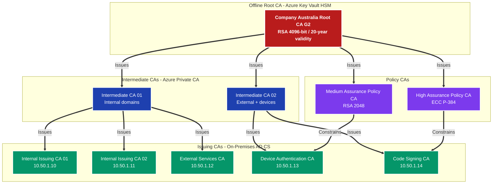
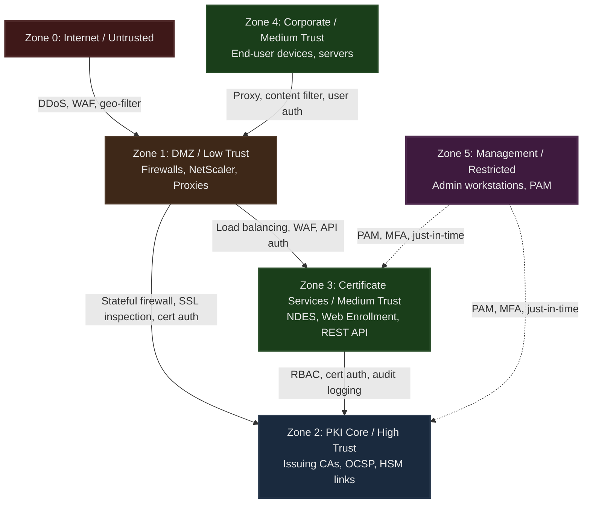

# PKI Architecture and Design

## Overview

The enterprise PKI infrastructure is a hybrid architecture that combines [Azure Private CA](https://learn.microsoft.com/en-us/azure/private-ca/overview) as the cloud-hosted root authority with on-premises [Active Directory Certificate Services (AD CS)](https://learn.microsoft.com/en-us/windows-server/identity/ad-cs/active-directory-certificate-services-overview) as the issuing layer. This design separates the trust anchor from the operational issuance path, placing the most sensitive cryptographic material in a managed cloud HSM while keeping high-throughput certificate operations close to the endpoints that consume them.

The PKI serves over 10,000 endpoints across Windows workstations, servers, mobile devices, IoT endpoints, and network infrastructure. Certificate-based authentication underpins 802.1X network access control, VPN authentication, code signing, TLS for internal and external services, and S/MIME for email encryption.

## CA Hierarchy and Trust Model

### Three-Tier Design Rationale

The hierarchy uses three tiers — offline root, intermediate, and issuing — rather than the simpler two-tier model common in smaller deployments. The additional tier exists because of competing operational requirements that cannot be satisfied by a single subordinate layer.

A two-tier model places the root CA's private key at risk whenever the issuing CA is operational. Because issuing CAs must be online and accessible to thousands of endpoints, they are exposed to a wider attack surface. By interposing an [intermediate CA layer](https://learn.microsoft.com/en-us/windows-server/identity/ad-cs/certification-authority-role), the root key can be stored completely offline in an [Azure Key Vault Managed HSM](https://learn.microsoft.com/en-us/azure/key-vault/managed-hsm/overview) at FIPS 140-2 Level 3, only ever engaged during intermediate CA certificate issuance ceremonies that occur on a multi-year cadence. Compromise of an issuing CA requires only re-issuance of that CA's certificate from the intermediate — the root trust anchor remains intact.

The intermediate tier also enables policy separation. Intermediate CA 01 constrains its name space to internal domains and issues certificates through the internal issuing CAs. Intermediate CA 02 covers external services and device authentication. This containment means a misconfigured or compromised issuing CA under one intermediate cannot issue certificates that would be trusted in the scope governed by the other.

### Root CA

The root CA (Company Australia Root CA G2) is a self-signed, 4096-bit RSA certificate with a 20-year validity period. Its private key never leaves the Azure Key Vault HSM in the Australia East region. The root is not operational in day-to-day terms — it is activated only to sign intermediate CA certificates or respond to a key ceremony event. Its extended validity reflects the cost and ceremony overhead of key generation: the root must outlive all subordinate CAs it will ever sign.

The root certificate is distributed to all managed endpoints via [Group Policy](https://learn.microsoft.com/en-us/windows-server/identity/ad-cs/certificate-group-policy-overview) to the Trusted Root Certification Authorities store, and via [Microsoft Intune](https://learn.microsoft.com/en-us/mem/intune/protect/certificates-trusted-root) configuration profiles to mobile and cloud-managed devices. This distribution is what makes certificates issued by this hierarchy trusted across the estate.

### Intermediate CAs

Two intermediate CAs sit between the root and the issuing layer, each hosted in [Azure Private CA](https://learn.microsoft.com/en-us/azure/private-ca/overview). They have 10-year validity and a path length constraint of 1, meaning they may only sign one additional level of subordinate CA — the issuing tier. The path length constraint is a hard cryptographic control encoded in the certificate itself, enforced by all compliant X.509 implementations.

Each intermediate CA publishes [CRL Distribution Points (CDP)](https://learn.microsoft.com/en-us/windows-server/identity/ad-cs/certificate-revocation) and [Authority Information Access (AIA)](https://learn.microsoft.com/en-us/windows-server/identity/ad-cs/aia-aiaextension-for-cas) extensions pointing to the organisation's hosted distribution endpoints. These URLs must remain permanently accessible for as long as any certificate issued under each intermediate remains valid — a consequence of the certificate chain validation model where relying parties must be able to reach revocation information for every CA in the chain.

### Issuing CAs

Five issuing CAs handle day-to-day certificate operations, each scoped to a distinct purpose:

- **Internal Issuing CA 01 and 02** — Domain-joined computers, users, domain controllers, and internal web servers. These two CAs operate in an active-active configuration, with load balancing ensuring requests are distributed and either CA can service any template in its scope. Active-active provides horizontal scaling and eliminates the CA as a single point of failure.
- **External Services CA** — Public-facing TLS certificates for services accessible from outside the corporate network. This CA is constrained to external domain names and enforces Subject Alternative Names.
- **Device Authentication CA** — Mobile devices, IoT endpoints, and network infrastructure using SCEP enrollment via NDES.
- **Code Signing CA** — Software and script signing. This CA requires two-person authorisation (development manager and security officer) before issuance, with all keys stored in HSM and non-exportable.

All issuing CAs publish delta CRLs every 24 hours and base CRLs weekly. OCSP responders provide real-time revocation status with sub-100ms response time targets, cached at the OCSP layer for 4 hours to reduce load on the CAs.

### Policy CAs and Certificate Policy OIDs

Two policy CAs — High Assurance and Medium Assurance — sit in the hierarchy alongside the issuing tier, constrained by path length 0. These are not issuing CAs; they define and enforce assurance levels through [certificate policy OIDs](https://learn.microsoft.com/en-us/windows/win32/seccrypto/certificate-policies-extension). The High Assurance Policy CA constrains the Code Signing CA, requiring HSM key storage, multi-factor authentication, and in-person identity verification for all certificates issued under that policy. The Medium Assurance Policy CA constrains the Device Authentication CA, allowing software key storage and remote identity verification through domain authentication.

This model follows [RFC 3647 (Certificate Policy and Certification Practices Framework)](https://datatracker.ietf.org/doc/html/rfc3647), which structures PKI governance around policy OIDs as machine-readable assertions about the assurance level of a certificate's issuance process.

## PKI Hierarchy Diagram

## Azure Private CA and AD CS Integration

### Why Both Azure Private CA and AD CS

A pure Azure Private CA deployment would satisfy many use cases but does not support [Windows auto-enrollment via Group Policy](https://learn.microsoft.com/en-us/windows-server/identity/ad-cs/certificate-autoenrollment-overview), which is the lowest-friction enrollment path for domain-joined Windows devices. Auto-enrollment depends on the AD CS request/response protocol and Active Directory's NTAuth store, neither of which is supported by Azure Private CA as an issuing CA directly.

Conversely, a pure on-premises AD CS deployment would require the root CA private key to be held on an on-premises system with the operational risk that entails, and would lack the geographic redundancy and managed HSM capabilities that Azure provides.

The hybrid model resolves this: Azure Private CA and Azure Key Vault Managed HSM hold the root and intermediate keys with FIPS 140-2 Level 3 protection and geo-replication, while on-premises AD CS issuing CAs handle the high-volume, low-latency enrollment operations that Windows auto-enrollment, NDES, and SCCM require.

### Key Storage and Protection

Key generation and storage follows a tiered model aligned with [ACSC ISM cryptography requirements](https://www.cyber.gov.au/resources-business-and-government/essential-cyber-security/ism):

| CA Level | Key Storage | Protection Standard |
|----------|-------------|---------------------|
| Root CA | Azure Key Vault Managed HSM | FIPS 140-2 Level 3 |
| Intermediate CAs | Azure Key Vault Managed HSM | FIPS 140-2 Level 3 |
| Issuing CAs | Software + TPM 2.0 | TPM-bound, non-exportable |
| Service accounts | Azure Key Vault (standard) | Managed, geo-replicated |

The root CA key was generated during a formal key ceremony with six required participants: a Security Officer, two PKI Administrators, an Internal Auditor, an External Auditor, and a Legal Representative. The ceremony produced a 5-of-9 key share threshold, distributed to separate secure custodians. No single party can reconstruct the key, and any future ceremony requires quorum.

### Active Directory Integration

The on-premises issuing CAs are published to Active Directory in three locations that Windows clients rely on for certificate trust and enrollment:

- **NTAuth store** — Contains CA certificates that Windows trusts for smart card logon and domain controller authentication. Only CAs whose certificates appear here can issue certificates that satisfy Kerberos authentication requirements.
- **AIA container** — Holds the certificate chains for all CAs in the hierarchy, enabling clients to build chains without external HTTP lookups on the internal network.
- **CDP container** — Holds CRL data for internal revocation checking.

[Group Policy distributes](https://learn.microsoft.com/en-us/windows-server/identity/ad-cs/certificate-group-policy-overview) the root and intermediate CA certificates to all domain members' Trusted Root and Intermediate Certification Authorities stores automatically, ensuring that new devices joining the domain immediately trust certificates issued by the hierarchy without manual intervention.

## Network Architecture and Security Zones

### Zone Segmentation Model

The PKI infrastructure is segmented across six security zones with distinct trust levels and controls at each boundary. This segmentation limits the blast radius of any compromise — an attacker who reaches a lower-trust zone cannot directly access PKI core components without traversing additional security controls.

### PKI Core Zone (Zone 2)

The PKI Core zone houses the issuing CAs, OCSP responders, and the Validation Authority. It is the highest-trust on-premises zone and is defended by micro-segmentation, hardware-bound key storage, role-based access control with certificate authentication, and comprehensive audit logging to the SIEM. Network access control via 802.1X ensures that only authorised infrastructure can connect to this segment.

The two issuing CAs (10.50.1.10 and 10.50.1.11) replicate their certificate databases to each other, providing consistent issuance state across both nodes. OCSP responders (10.50.1.30 and 10.50.1.31) are fed certificate status data from the issuing CAs and operate behind a NetScaler VIP for high availability, with a 5-second health check interval and a 2-second response timeout.

### DMZ Zone (Zone 1)

Internet-facing certificate operations — external OCSP queries, CRL downloads, and public web enrollment — traverse the DMZ. The Palo Alto PA-5250 performs SSL decryption and deep packet inspection on inbound traffic before it reaches the internal load balancers. Certificate validation traffic (OCSP and CRL) is exempted from decryption because decrypting and re-encrypting revocation status would break the signature verification that relying parties perform on OCSP responses.

NetScaler ADC pairs (10.20.1.10 and 10.20.1.11) operate in active-passive HA and terminate SSL for web-facing PKI services. They perform OCSP stapling, removing the need for every relying party client to independently query the OCSP responder for each TLS handshake.

### Certificate Services Zone (Zone 3)

Zone 3 hosts the services that translate between enrollment protocols and the CA's native RPC interface: the NDES server for SCEP, the Web Enrollment service for browser-based requests, the REST API for programmatic certificate management, and the Intune Connector that bridges Intune SCEP profiles to the on-premises NDES. This zone sits between the DMZ and PKI Core, meaning it can accept requests from external systems and forward them inward, but its own access to the CA is gated by certificate authentication and RBAC.

### Azure Cloud Zone

The Azure footprint — Key Vault, Azure Private CA, Azure Front Door, and Application Gateway — is treated as a separate trust domain that communicates with the on-premises PKI Core via [Azure ExpressRoute](https://learn.microsoft.com/en-us/azure/expressroute/expressroute-introduction) with private peering. Two ExpressRoute circuits provide redundancy: a 200 Mbps primary circuit via Telstra from Sydney, and a 100 Mbps backup via Optus. PKI traffic is marked with DSCP EF (Expedited Forwarding) for highest-priority queue treatment. A Site-to-Site VPN provides a tertiary path if both ExpressRoute circuits fail.

Azure Key Vault is geo-replicated between Australia East and Australia Southeast, ensuring that root CA signing operations remain available even during an Azure Australia East regional outage.

## High Availability and Disaster Recovery

### Active-Active Issuing CAs

The two internal issuing CAs operate active-active with no manual failover required. The NetScaler VIP distributes enrollment requests across both nodes using a least-connection algorithm. Because both CAs share the same configuration, templates, and Active Directory publication, clients receive equivalent service from either node. Certificate database replication between the two CAs ensures that revocation status is consistent regardless of which CA issued a given certificate.

### Disaster Recovery Site

A Melbourne site (10.60.0.0/16) provides disaster recovery. During normal operations, it holds a CRL and OCSP cache (10.60.1.10) that allows Melbourne-connected endpoints to validate certificates without routing to Sydney. In the event of a Sydney primary failure, the Melbourne site can be promoted to a full PKI operation: a standby Azure Private CA instance in Australia Southeast activates, and BGP routes converge to the Melbourne endpoints within approximately 30 seconds of route advertisement. DNS records for pki, ocsp, and crl hostnames are updated to point to Melbourne endpoints, with a 300-second TTL designed to minimise propagation delay.

The Root CA RTO is 4 hours (manual activation of the standby) with RPO of zero because the key material is geo-replicated. Issuing CAs have zero RTO and RPO due to active-active clustering. OCSP responders achieve sub-second failover via load balancer health checks.

## Service Boundaries and Component Handoffs

Certificate issuance involves a chain of component handoffs that are worth understanding as a whole:

1. An endpoint generates a key pair locally and submits a Certificate Signing Request (CSR) via its protocol-appropriate path (auto-enrollment RPC, SCEP via NDES, REST API, or web enrollment).
2. The issuing CA validates the CSR against the requested certificate template, verifies the requester's permissions in Active Directory, applies the template's constraints (key usage, validity, extensions), and signs the certificate with its private key.
3. The signed certificate is returned to the requester and simultaneously published to Active Directory (for domain certificates) and the CA database.
4. The CA publishes a delta CRL within 24 hours incorporating any revocations, and the OCSP responder caches the updated status.
5. Relying parties (load balancers, firewalls, application servers) validate presented certificates by building the chain to the root, checking OCSP or CRL for revocation status, and verifying that the certificate's Extended Key Usage (EKU) is appropriate for the intended purpose.

The Validation Authority (10.50.1.40) provides an additional chain verification service used by network appliances that need to confirm the full trust path without maintaining their own CRL cache. It aggregates OCSP status from both responders and presents a unified validation interface.

## Compliance Alignment

The PKI architecture aligns with the [ACSC Information Security Manual (ISM)](https://www.cyber.gov.au/resources-business-and-government/essential-cyber-security/ism) requirements for cryptographic key management, specifically:

- Use of FIPS 140-2 validated cryptographic modules for root and intermediate CA key storage
- RSA minimum key sizes of 2048 bits (3072+ recommended) and SHA-256 or stronger signature algorithms
- Separation of duties for CA administration and key ceremony operations
- Audit logging of all CA operations to the SIEM

The Certificate Practice Statement (CPS) documents all issuance policies, identity verification requirements, revocation procedures, and audit arrangements in the format specified by [RFC 3647](https://datatracker.ietf.org/doc/html/rfc3647), and is made available at the PKI repository URL embedded in every issued certificate.

## Related Resources

- [Azure Private CA Overview](https://learn.microsoft.com/en-us/azure/private-ca/overview)
- [Active Directory Certificate Services Overview](https://learn.microsoft.com/en-us/windows-server/identity/ad-cs/active-directory-certificate-services-overview)
- [Azure Key Vault Managed HSM](https://learn.microsoft.com/en-us/azure/key-vault/managed-hsm/overview)
- [Certificate Auto-Enrollment in Windows](https://learn.microsoft.com/en-us/windows-server/identity/ad-cs/certificate-autoenrollment-overview)
- [Azure ExpressRoute](https://learn.microsoft.com/en-us/azure/expressroute/expressroute-introduction)
- [ACSC Information Security Manual (ISM)](https://www.cyber.gov.au/resources-business-and-government/essential-cyber-security/ism)
- [ACSC Essential Eight Maturity Model](https://www.cyber.gov.au/resources-business-and-government/essential-cyber-security/essential-eight)
- [RFC 3647 — Certificate Policy and Certification Practices Framework](https://datatracker.ietf.org/doc/html/rfc3647)
- [RFC 5280 — Internet X.509 PKI Certificate and CRL Profile](https://datatracker.ietf.org/doc/html/rfc5280)
- [FIPS 140-2 — Security Requirements for Cryptographic Modules](https://csrc.nist.gov/publications/detail/fips/140/2/final)
