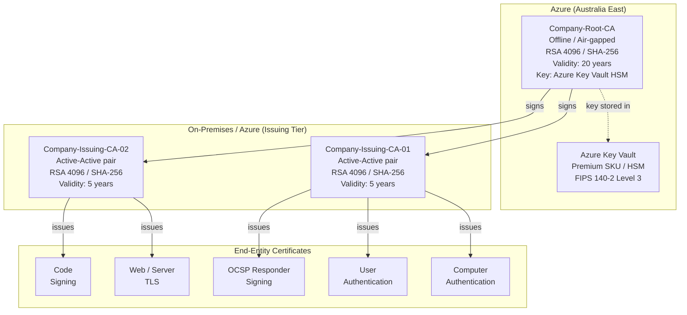
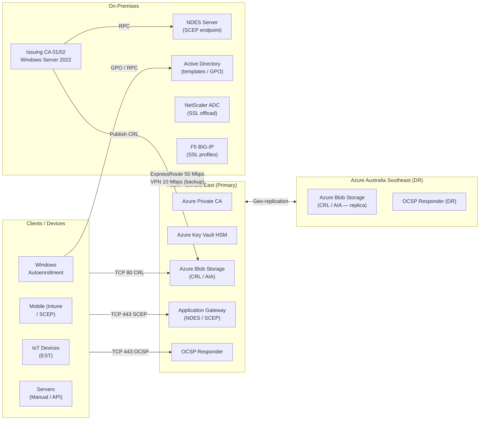
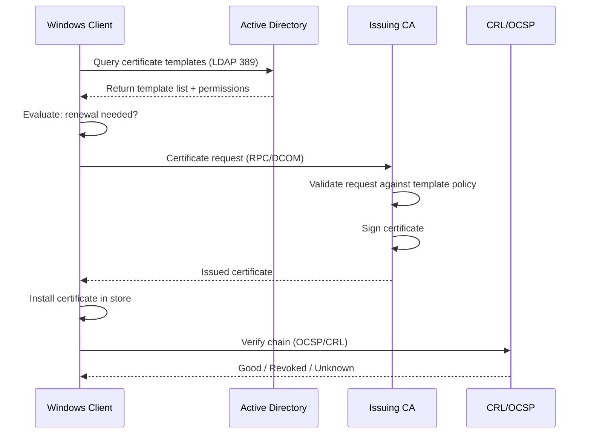
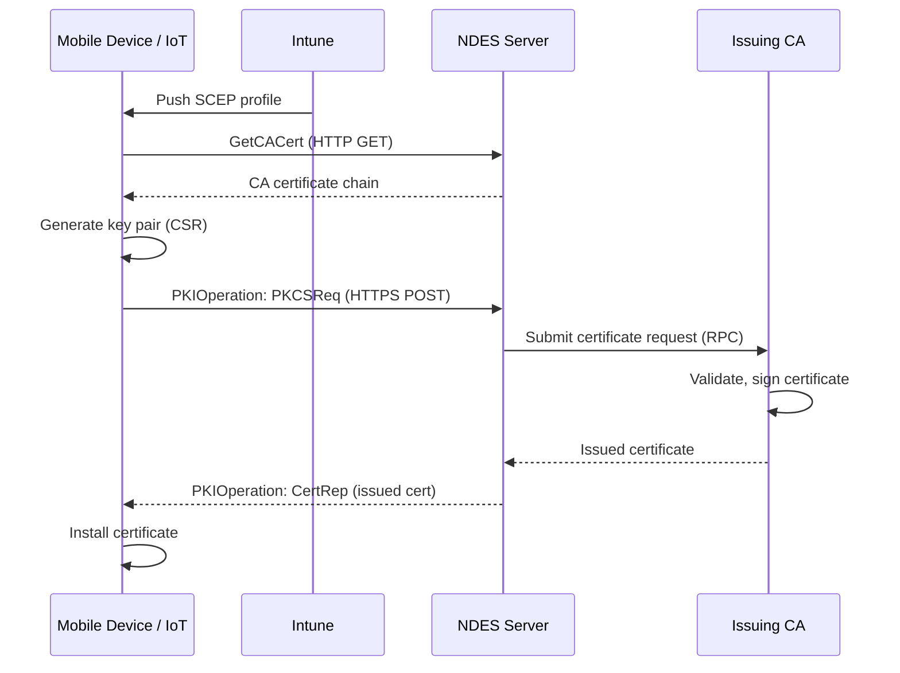
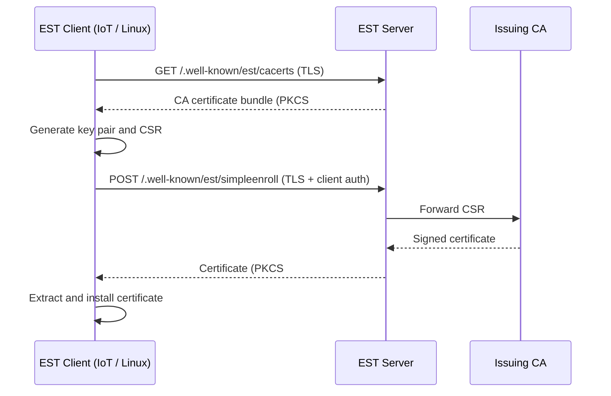
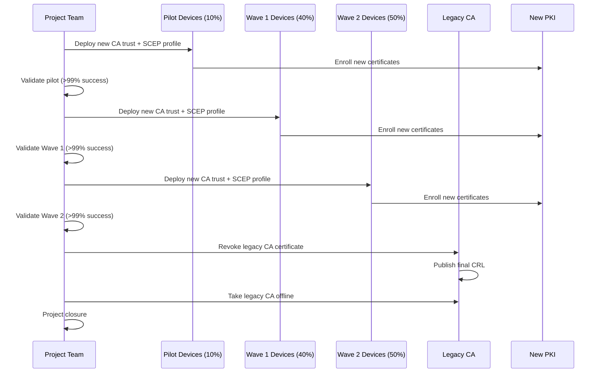
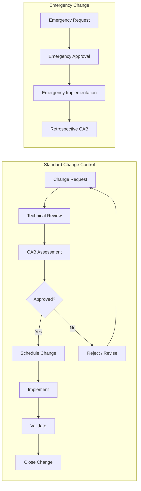
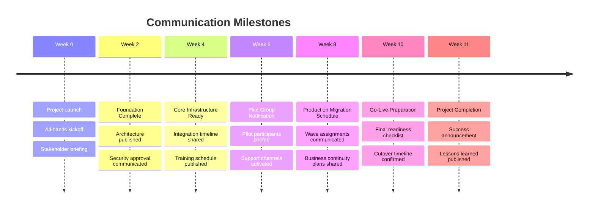
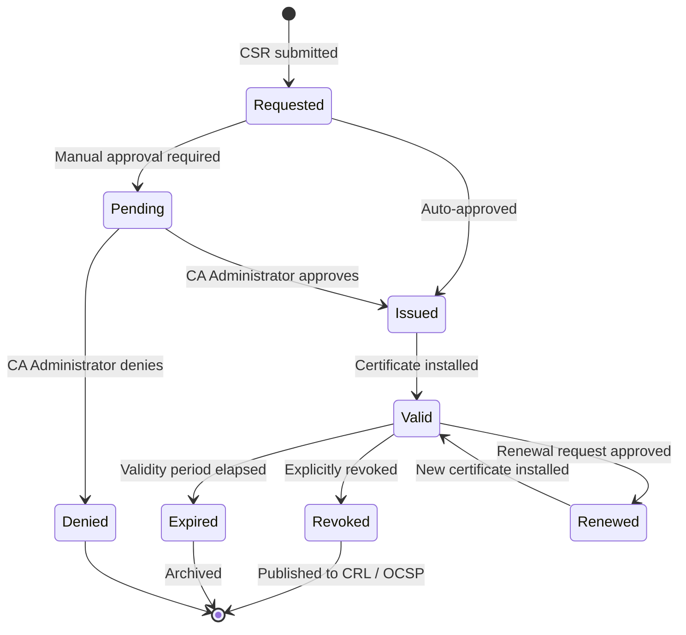
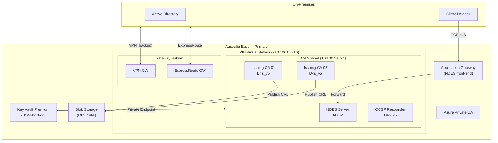

# PKI Modernisation — Architecture Diagrams

## CA Hierarchy and Trust Model

---

## Network Topology

---

## Certificate Enrollment Flow — Windows Autoenrollment

---

## Certificate Enrollment Flow — SCEP (NDES / Intune)

---

## Certificate Enrollment Flow — EST (IoT / Linux)

---

## Migration Sequence

---

## Change Control Flow

---

## Project Communication Timeline

---

## Certificate Lifecycle State Machine

---

## Azure Resource Architecture

---

## Related Resources

- [Microsoft Learn — Azure Private CA Architecture](https://learn.microsoft.com/en-us/azure/private-ca/overview)
- [Microsoft Learn — AD CS Design Guide](https://learn.microsoft.com/en-us/windows-server/security/certificates-and-public-key-infrastructure-pki/certification-authority-role)
- [RFC 5280 — Internet X.509 PKI Certificate and CRL Profile](https://datatracker.ietf.org/doc/html/rfc5280)
- [RFC 6960 — X.509 Internet PKI Online Certificate Status Protocol (OCSP)](https://datatracker.ietf.org/doc/html/rfc6960)
- [RFC 7030 — Enrollment over Secure Transport (EST)](https://datatracker.ietf.org/doc/html/rfc7030)
- [ACSC Information Security Manual (ISM)](https://www.cyber.gov.au/resources-business-and-government/essential-cyber-security/ism)
- [Mermaid Diagram Documentation](https://mermaid.js.org/intro/)

---

Navigation: [PKI README](README.md) | [Parent: infrastructure/](../README.md)
