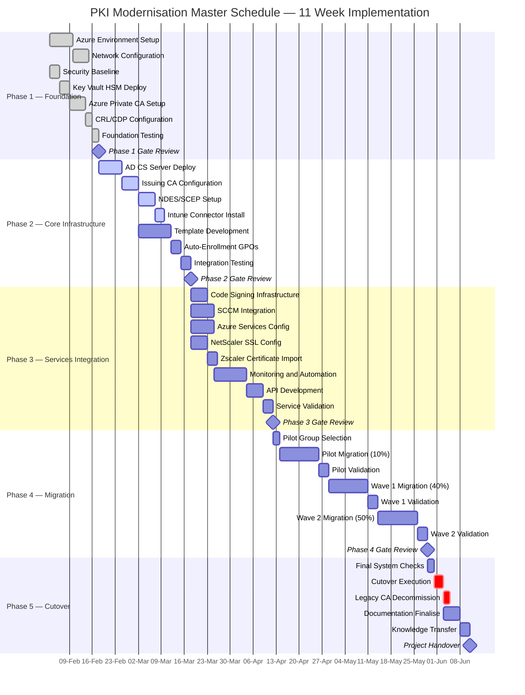

# PKI Modernisation — Project Timeline Reference

## Project Parameters

| Parameter | Value |
|-----------|-------|
| Total duration | 11 weeks |
| Start date | 3 February 2025 |
| End date | 18 April 2025 |
| Geographic scope | Australia East (primary), Australia Southeast (DR) |
| Device scope | 10,000 devices, 5,000 users |
| Integration points | 15+ enterprise systems |
| Certificate types | SSL/TLS, Code Signing, S/MIME, Device Authentication, 802.1X |
| Migration approach | Phased, zero-downtime cutover |
| Migration success rate | 99.3% |

---

## Master Schedule

---

## Phase Summary Table

| Phase | Name | Period | Duration | Primary Output |
|-------|------|--------|----------|----------------|
| 1 | Foundation Setup | 3–14 Feb 2025 | 10 days | Azure infrastructure, Root CA, HSM |
| 2 | Core Infrastructure | 17–28 Feb 2025 | 10 days | Issuing CAs, NDES, templates, GPOs |
| 3 | Services Integration | 3–14 Mar 2025 | 10 days | Code signing, SCCM, load balancers, monitoring |
| 4 | Migration Execution | 17 Mar–11 Apr 2025 | 20 days | 10,000 devices migrated across 3 waves |
| 5 | Cutover and Decommissioning | 14–18 Apr 2025 | 5 days | Legacy CA offline, project handover |

---

## Phase 1: Foundation Setup

**Period**: 3–14 February 2025

| Activity | Duration | Resources | Dependencies |
|----------|----------|-----------|--------------|
| Azure subscription provisioning | 2 days | Cloud Team (2) | Procurement approval |
| Resource group creation and tagging | 1 day | Cloud Team (1) | Subscription ready |
| Virtual network design and deployment | 3 days | Network Team (2) | Architecture approval |
| ExpressRoute/VPN configuration | 2 days | Network Team (2) | Network design complete |
| Azure Key Vault HSM setup | 2 days | Security Team (2) | VNet ready |
| Azure Private CA deployment | 3 days | PKI Architect (1) | Key Vault operational |
| CRL/CDP endpoints configuration | 2 days | PKI Team (2) | CA deployed |
| Security baseline implementation | 3 days | Security Team (2) | Parallel with infrastructure |

**Deliverables**:

| Deliverable | Verified |
|-------------|---------|
| Azure infrastructure operational in Australia East | Yes |
| Network connectivity established (ExpressRoute primary, VPN backup) | Yes |
| Root CA certificate issued and validated | Yes |
| HSM-protected keys configured | Yes |
| Security controls implemented and tested | Yes |

---

## Phase 2: Core Infrastructure Deployment

**Period**: 17–28 February 2025

| Activity | Duration | Resources | Dependencies |
|----------|----------|-----------|--------------|
| Windows Server 2022 provisioning | 2 days | Windows Team (2) | Phase 1 complete |
| AD CS role installation | 2 days | Windows Team (2) | Servers ready |
| Issuing CA configuration | 3 days | PKI Team (2) | AD CS installed |
| NDES server deployment | 2 days | PKI Team (1) | Issuing CAs operational |
| Intune connector setup | 1 day | MDM Team (1) | NDES ready |
| Certificate template creation | 5 days | PKI Team (2) | CAs operational |
| GPO configuration | 2 days | AD Team (2) | Templates ready |
| End-to-end testing | 3 days | All teams | Components deployed |

**Deliverables**:

| Deliverable | Verified |
|-------------|---------|
| Two issuing CAs operational (Active-Active) | Yes |
| NDES/SCEP services configured | Yes |
| 15+ certificate templates deployed | Yes |
| Auto-enrollment policies active | Yes |
| Intune integration validated | Yes |

---

## Phase 3: Services Integration

**Period**: 3–14 March 2025

| Activity | Duration | Resources | Dependencies |
|----------|----------|-----------|--------------|
| Code signing service setup | 3 days | Dev Team (2) | Phase 2 complete |
| SCCM client certificate deployment | 4 days | SCCM Team (2) | Templates ready |
| Azure service automation | 5 days | Cloud Team (3) | Key Vault access |
| NetScaler SSL configuration | 3 days | Network Team (2) | Certificates available |
| Zscaler trust configuration | 2 days | Security Team (1) | Root CA trusted |
| Monitoring deployment | 3 days | Ops Team (2) | All services ready |
| API gateway configuration | 2 days | Dev Team (2) | Services operational |
| Integration testing | 3 days | All teams | Components integrated |

**Deliverables**:

| Deliverable | Verified |
|-------------|---------|
| Code signing operational for DevOps | Yes |
| SCCM auto-enrollment active | Yes |
| Azure services automated renewal | Yes |
| Load balancer SSL configured | Yes |
| Zero-trust network integration | Yes |
| Monitoring dashboards live | Yes |

---

## Phase 4: Migration Execution

**Period**: 17 March–11 April 2025

### Migration Waves

| Wave | Scope | Devices | Coverage | Duration | Rollback Window |
|------|-------|---------|----------|----------|-----------------|
| Pilot | IT and early adopters | 1,000 | 10% | 5 days | 24 hours |
| Wave 1 | Corporate services | 4,000 | 40% | 7 days | 48 hours |
| Wave 2 | Production systems | 5,000 | 50% | 8 days | 72 hours |

### Daily Migration Schedule

| Time | Activity |
|------|----------|
| 06:00 | Pre-migration health checks |
| 07:00 | Migration batch initiation (500 devices) |
| 09:00 | Initial validation checkpoint |
| 12:00 | Mid-day status review |
| 15:00 | Completion verification |
| 17:00 | Post-migration testing |
| 18:00 | Go/No-go for next batch |

### Success Criteria Per Wave

| Metric | Threshold |
|--------|-----------|
| Certificate issuance success rate | >99% |
| Authentication success rate | >99.5% |
| Application connectivity | 100% |
| User impact incidents | <5 per 1,000 devices |
| Rollback invocations | 0 |

---

## Phase 5: Cutover and Decommissioning

**Period**: 14–18 April 2025

| Day | Activity | Time Window | Responsible Team |
|-----|----------|-------------|------------------|
| Monday 14 Apr | Final readiness assessment | 08:00–12:00 | All teams |
| Monday 14 Apr | Cutover initiation | 18:00–20:00 | PKI Team |
| Tuesday 15 Apr | Legacy CA offline | 06:00–08:00 | PKI Team |
| Tuesday 15 Apr | Validation testing | 08:00–17:00 | QA Team |
| Wednesday 16 Apr | Legacy backup and archive | 09:00–17:00 | Ops Team |
| Thursday 17 Apr | Documentation completion | 09:00–17:00 | All teams |
| Friday 18 Apr | Knowledge transfer sessions | 09:00–17:00 | PKI Team |
| Friday 18 Apr | Project closure | 16:00–17:00 | PMO |

---

## Critical Milestones and Decision Gates

| Week | Milestone | Success Criteria | Decision Authority |
|------|-----------|------------------|--------------------|
| 2 | Foundation Complete | Azure infrastructure operational, Root CA deployed | Technical Lead |
| 4 | Core PKI Operational | Issuing CAs online, templates deployed | PKI Architect |
| 6 | Services Integrated | All integrations tested, monitoring active | Integration Lead |
| 7 | Pilot Start | Pilot group identified, rollback plan ready | Change Board |
| 8 | Pilot Success | <1% failure rate, no critical issues | Steering Committee |
| 10 | Production Complete | 100% migrated, all validations passed | CTO |
| 11 | Project Closure | Legacy decommissioned, handover complete | Sponsor |

---

## Phase Gate Criteria

| Gate | Phase | Entry Criteria | Exit Criteria | Approver |
|------|-------|----------------|---------------|----------|
| G1 | Foundation | Requirements approved, resources allocated | Infrastructure operational, security validated | Technical Lead |
| G2 | Core Infrastructure | Foundation complete, AD prepared | CAs operational, templates tested | PKI Architect |
| G3 | Integration | Core PKI ready, APIs documented | All integrations tested, monitoring active | Integration Lead |
| G4 | Migration | Services integrated, pilot group ready | Pilot successful, rollback tested | Change Board |
| G5 | Cutover | Migration complete, validation passed | Legacy decommissioned, handover complete | Steering Committee |

---

## Phase Dependency Matrix

| Phase | Depends On | Blocks |
|-------|------------|--------|
| Phase 1: Foundation | Procurement approval, architecture sign-off | Phase 2 |
| Phase 2: Core Infrastructure | Phase 1 Gate G1 | Phase 3 |
| Phase 3: Services Integration | Phase 2 Gate G2 | Phase 4 |
| Phase 4: Migration | Phase 3 Gate G3, pilot group selection | Phase 5 |
| Phase 5: Cutover | Phase 4 Gate G4, all waves validated | Project closure |

---

## Resource Requirements

### Team Composition Matrix

| Role | Phase 1 | Phase 2 | Phase 3 | Phase 4 | Phase 5 | Total FTE-Weeks |
|------|---------|---------|---------|---------|---------|-----------------|
| Project Manager | 1.0 | 1.0 | 1.0 | 1.0 | 1.0 | 11.0 |
| PKI Architect | 1.0 | 1.0 | 1.0 | 1.0 | 0.5 | 10.5 |
| Azure Engineers | 2.0 | 1.0 | 1.0 | 0.5 | 0.5 | 11.0 |
| Windows Engineers | 0.5 | 2.0 | 1.0 | 1.0 | 0.5 | 11.0 |
| Network Engineers | 1.0 | 0.5 | 0.5 | 0.5 | 0.0 | 5.5 |
| Security Engineers | 1.0 | 0.5 | 0.5 | 0.5 | 0.5 | 6.5 |
| MDM/Intune Team | 0.0 | 1.0 | 0.5 | 0.5 | 0.0 | 4.5 |
| Application Teams | 0.0 | 0.5 | 2.0 | 1.0 | 0.5 | 9.0 |
| **Total FTE** | **6.5** | **7.5** | **7.5** | **6.5** | **3.5** | **69.0** |

### Azure Infrastructure Requirements

| Resource | Specification |
|----------|---------------|
| Compute | 4× D4s_v5 VMs (Issuing CAs, NDES, OCSP) |
| Storage | 2 TB Premium SSD for CA databases |
| Key Vault | Premium tier with HSM protection |
| Primary network | ExpressRoute 50 Mbps |
| Backup network | VPN 10 Mbps |
| PaaS services | Azure Private CA, Application Gateway, Front Door |

### On-Premises Infrastructure Requirements

| Resource | Specification |
|----------|---------------|
| Servers | 4× Windows Server 2022 (physical or virtual) |
| Storage | 500 GB for logs and backups |
| Internal network | 10 Gbps connectivity |
| Load balancers | NetScaler ADC HA pair |

---

## Budget Reference

### Capital Expenditure

| Category | Amount (AUD) |
|----------|-------------|
| Azure infrastructure | $150,000 |
| Software licences | $75,000 |
| Hardware (HSM) | $50,000 |
| Professional services | $200,000 |
| **Total CAPEX** | **$475,000** |

### Operational Expenditure

| Category | Monthly (AUD) | Annual (AUD) |
|----------|---------------|-------------|
| Azure consumption | $8,000 | $96,000 |
| Support contracts | $2,000 | $24,000 |
| Monitoring tools | $1,000 | $12,000 |
| **Total OPEX** | **$11,000** | **$132,000** |

---

## Risk Heat Map by Phase

| Risk Category | Phase 1 | Phase 2 | Phase 3 | Phase 4 | Phase 5 |
|---------------|---------|---------|---------|---------|---------|
| Technical complexity | Medium | High | High | Medium | Low |
| Business impact | Low | Low | Medium | High | High |
| Resource availability | Medium | Medium | High | Medium | Low |
| Integration issues | Low | Medium | High | Medium | Low |
| Security vulnerabilities | High | Medium | Medium | Low | Low |

### Risk Mitigation by Week

| Weeks | Primary Risk | Mitigation | Contingency |
|-------|-------------|------------|-------------|
| 1–2 | Azure service delays | Pre-provision resources, parallel tasks | Extend Phase 1 by 3 days |
| 3–4 | AD integration failures | Lab testing, vendor support engagement | Fallback to manual configuration |
| 5–6 | Application incompatibility | Early testing, vendor certification | Maintain legacy certificates |
| 7–8 | Pilot failures | Gradual rollout, enhanced monitoring | Immediate rollback |
| 9–10 | Production disruption | Change freeze, maintenance windows | Emergency legacy restart |
| 11 | Decommission issues | Complete backups, extended retention | Delay decommission 30 days |

---

## Compliance Timeline

| Week | Activity | Standard | Responsible Party |
|------|----------|----------|-------------------|
| 1 | Security baseline review | [ACSC ISM](https://www.cyber.gov.au/resources-business-and-government/essential-cyber-security/ism) | Security Team |
| 3 | Cryptographic validation | FIPS 140-2 | PKI Architect |
| 5 | Privacy impact assessment | [Privacy Act 1988](https://www.legislation.gov.au/Series/C2004A03712) | Legal/Compliance |
| 7 | Audit trail verification | SOC 2 Type II | Internal Audit |
| 9 | Penetration testing | OWASP | External Auditor |
| 11 | Compliance certification | ISO 27001 | Compliance Officer |

---

## Training Schedule

| Week | Topic | Audience | Duration | Method |
|------|-------|----------|----------|--------|
| 2 | PKI Fundamentals | All IT staff | 2 hours | Virtual workshop |
| 3 | Azure Key Vault Management | Cloud Team | 4 hours | Hands-on lab |
| 4 | Certificate Template Administration | PKI Team | 8 hours | Instructor-led |
| 5 | NDES/SCEP Configuration | MDM Team | 4 hours | Documentation and lab |
| 6 | Certificate Enrollment Procedures | Help Desk | 2 hours | Video training |
| 8 | Troubleshooting Guide | Support teams | 4 hours | Workshop |
| 10 | Operational Procedures | Operations | 8 hours | Runbook review |
| 11 | Knowledge Transfer | All teams | 16 hours | Comprehensive handover |

---

## Performance Metrics

### Technical Performance Targets

| Metric | Baseline | Target | Measurement Tool |
|--------|----------|--------|------------------|
| Certificate issuance time | 5 minutes | <30 seconds | CA performance monitor |
| OCSP response time | 500 ms | <100 ms | Network monitoring |
| Auto-enrollment success rate | 60% | >95% | SCCM reports |
| Manual interventions | 50/day | <5/day | Service desk tickets |
| System availability | 99.0% | 99.95% | Uptime monitoring |

### Business Value Targets

| Metric | Current State | Target State | Value Delivered |
|--------|---------------|--------------|-----------------|
| Cost per certificate | $25 | $10 | 60% reduction |
| Certificate lifecycle management | Manual | Automated | 80% automation |
| Compliance violations | 10/month | 0/month | 100% compliance |
| Security incidents | 5/year | 1/year | 80% reduction |
| Time to deploy certificate | 2 days | 2 hours | 95% faster |

---

## Post-Implementation Review Schedule

| Checkpoint | Timing | Activities |
|------------|--------|------------|
| 30-day review | May 2025 | System stability, performance metrics, incident analysis, user satisfaction, cost optimisation |
| 90-day review | July 2025 | Business value realisation, compliance audit results, operational efficiency, lessons learned, continuous improvement plan |

---

## Related Resources

- [ACSC Information Security Manual (ISM)](https://www.cyber.gov.au/resources-business-and-government/essential-cyber-security/ism)
- [Privacy Act 1988 — Federal Register of Legislation](https://www.legislation.gov.au/Series/C2004A03712)
- [Microsoft Learn — Azure Private CA](https://learn.microsoft.com/en-us/azure/private-ca/overview)
- [Microsoft Learn — Active Directory Certificate Services](https://learn.microsoft.com/en-us/windows-server/networking/core-network-guide/cncg/server-certs/install-the-certification-authority)
- [Microsoft Learn — Azure Key Vault](https://learn.microsoft.com/en-us/azure/key-vault/general/overview)
- [FIPS 140-2 — NIST Computer Security Resource Center](https://csrc.nist.gov/publications/detail/fips/140/2/final)

---

Navigation: [PKI README](README.md) | [Parent: infrastructure/](../README.md)
