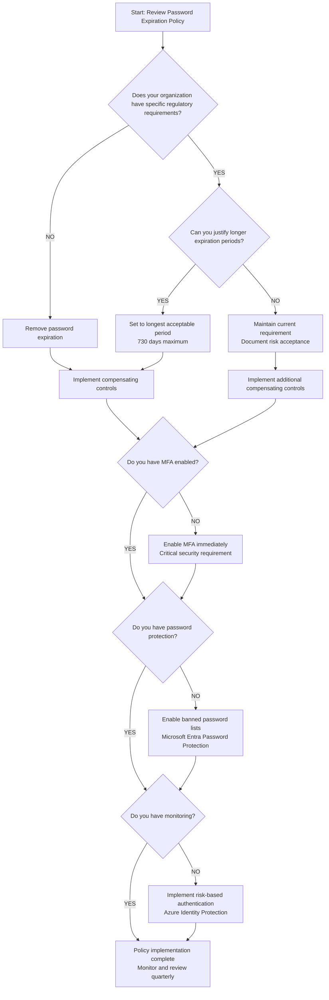

# Password Expiration Policies: Why They're Counterproductive

## Executive Summary

Modern security research continues to demonstrate that mandatory password expiration policies harm security more than help it [[1]](https://learn.microsoft.com/en-us/microsoft-365/admin/misc/password-policy-recommendations) [[2]](https://pages.nist.gov/800-63-4/sp800-63b.html). Both Microsoft and NIST have maintained their positions against password expiration, with NIST publishing the final version of SP 800-63B-4 in July 2025 [[3]](https://pages.nist.gov/800-63-4/sp800-63b.html). These evidence-based guidelines confirm that forced password changes lead to weaker, more predictable passwords [[4]](https://www.microsoft.com/en-us/research/publication/password-guidance/).

Organizations should confidently move away from password expiration while implementing modern security controls including multi-factor authentication, banned password lists, risk-based authentication, and passwordless authentication methods [[1]](https://learn.microsoft.com/en-us/microsoft-365/admin/misc/password-policy-recommendations) [[3]](https://pages.nist.gov/800-63-4/sp800-63b.html).

## Table of Contents

- [The Case Against Password Expiration](#the-case-against-password-expiration)
- [Evolution of Password Expiration Guidance](#evolution-of-password-expiration-guidance)
- [Official Standards and Guidelines](#official-standards-and-guidelines)
- [Industry Research and Analysis](#industry-research-and-analysis)
- [Why Password Expiration is Counterproductive](#why-password-expiration-is-counterproductive)
- [Modern Security Recommendations](#modern-security-recommendations)
- [Special Compliance Considerations](#special-compliance-considerations)
- [Quick Decision Framework](#quick-decision-framework)
- [Complete Resource Library](#complete-resource-library)
- [Conclusion and Final Recommendations](#conclusion-and-final-recommendations)

---

## The Case Against Password Expiration

### Research Evidence

Current research strongly indicates that mandated password changes do more harm than good. They drive users to choose weaker passwords, reuse passwords, or update old passwords in ways that are easily guessed by hackers [[1]](https://learn.microsoft.com/en-us/microsoft-365/admin/misc/password-policy-recommendations).

Understanding human nature is critical because research shows that almost every rule you impose on your users results in a weakening of password quality. Length requirements, special character requirements, and password change requirements all result in normalization of passwords, which makes it easier for attackers to guess or crack passwords [[1]](https://learn.microsoft.com/en-us/microsoft-365/admin/misc/password-policy-recommendations).

### Behavioral Impact Analysis

When forced to change passwords regularly, users develop predictable patterns:

- Sequential numbering: Password1, Password2, Password3
- Seasonal patterns: Spring2024, Summer2024, Fall2024
- Minor character substitutions: P@ssword1, P@ssword2

Experiments have shown that users do not choose a new independent password; rather, they choose an update of the old one [[5]](https://news.ycombinator.com/item?id=26863907). One study at the University of North Carolina found that 17% of new passwords could be guessed given the old one in at most 5 tries [[5]](https://news.ycombinator.com/item?id=26863907).

### Security Theater vs. Real Security

The core logic flaw in password expiration policies:

> "If a password is never stolen, there's no need to expire it. And if you have evidence that a password has been stolen, you would presumably act immediately rather than wait for expiration to fix the problem."

Password expiration is a defense only against the probability that a password (or hash) will be stolen during its validity interval and the attacker will be unable to crack it before it expires.

---

## Evolution of Password Expiration Guidance

### Historical Context (Pre-2016)

Traditional security thinking emphasized regular password changes as a fundamental security practice. This approach was based on the assumption that:

- Regular changes would limit the window of exposure if passwords were compromised
- Users would create strong, unique passwords each time
- The inconvenience was justified by the security benefit

### Research Breakthrough Period (2016-2019)

**2016**: FTC Chief Technologist Lorrie Cranor publishes groundbreaking research demonstrating that password expiration policies actually weaken security by encouraging predictable password patterns.

**2017**: NIST publishes SP 800-63B removing password expiration requirements, marking the first major standards body to officially reject mandatory password changes based on empirical evidence [[7]](https://pages.nist.gov/800-63-3/sp800-63b.html).

**2019**: Microsoft removes password expiration from Windows 10 security baseline, with Aaron Margosis stating that "Periodic password expiration is an ancient and obsolete mitigation of very low value" [[8]](https://techcrunch.com/2019/04/24/windows-password-expiry/).

### Industry Transformation (2020-2024)

**2020-2021**: Industry-wide adoption accelerates as organizations recognize the research validity. Major cloud providers begin defaulting to non-expiring passwords.

**2021**: New Microsoft/Azure tenants default to passwords never expiring, representing a fundamental shift in enterprise security posture [[9]](https://learn.microsoft.com/en-us/answers/questions/2137658/entra-id-user-default-password-expiration-policy).

**August 2024**: NIST releases second public draft of SP 800-63B-4, further strengthening their position against mandatory password expiration [[10]](https://nvlpubs.nist.gov/nistpubs/SpecialPublications/NIST.SP.800-63B-4.2pd.pdf).

### Current Standards (2025)

**July 2025**: NIST publishes final version of SP 800-63B-4, maintaining and strengthening their position against mandatory password expiration with enhanced support for passphrases, expanded character set support, and strengthened recommendations for risk-based authentication [[3]](https://pages.nist.gov/800-63-4/sp800-63b.html).

### Key Milestones Documentation

The evolution represents a fundamental shift from compliance-based security to evidence-based security practices, with major standards bodies, technology vendors, and security organizations aligning on the research consensus.

---

## Official Standards and Guidelines

### Microsoft Guidelines

#### Current Position

Microsoft has published multiple official documents explaining their stance against password expiration:

**From Password Policy Recommendations:**

> "Current research strongly indicates that mandated password changes do more harm than good. They drive users to choose weaker passwords, reuse passwords, or update old passwords in ways that are easily guessed by hackers."

**Microsoft's Research Findings:**

> "Understanding human nature is critical because research shows that almost every rule you impose on your users results in a weakening of password quality. Length requirements, special character requirements, and password change requirements all result in normalization of passwords, which makes it easier for attackers to guess or crack passwords."

#### Default Policies for Modern Tenants

For tenants created after 2021, passwords are set to never expire by default [[9]](https://learn.microsoft.com/en-us/answers/questions/2137658/entra-id-user-default-password-expiration-policy). The password validity period is configured as unlimited unless specifically overridden. This can be modified on a per-user basis using PowerShell: `Update-MgUser -UserId <user ID> -PasswordPolicies DisablePasswordExpiration` [[11]](https://learn.microsoft.com/en-us/microsoft-365/admin/manage/set-password-expiration-policy).

Organizations can still configure expiration if required for compliance, but Microsoft recommends against it [[1]](https://learn.microsoft.com/en-us/microsoft-365/admin/misc/password-policy-recommendations).

#### Implementation Resources

Microsoft provides comprehensive guidance for implementing modern password policies while maintaining security through alternative controls.

### NIST Standards

#### NIST SP 800-63-4 Framework (2025 Final)

The National Institute of Standards and Technology published the final version of SP 800-63B-4 in July 2025, maintaining and strengthening their position against mandatory password expiration [[3]](https://pages.nist.gov/800-63-4/sp800-63b.html).

**Complete Framework Components:**

- **SP 800-63-4**: Digital Identity Guidelines - Complete framework covering identity proofing, authentication, and federation [[12]](https://pages.nist.gov/800-63-4/sp800-63.html)
- **SP 800-63A-4**: Identity Proofing and Enrollment - Identity verification and credential service provider requirements [[13]](https://pages.nist.gov/800-63-4/sp800-63a.html)
- **SP 800-63B-4**: Authentication Guidelines - Authentication methods and password security standards [[3]](https://pages.nist.gov/800-63-4/sp800-63b.html)
- **SP 800-63C-4**: Federation Guidelines - Identity federation and assertion protocols [[14]](https://pages.nist.gov/800-63-4/sp800-63c.html)

#### Key Recommendations Summary

**From SP 800-63B-4 (July 2025):** [[3]](https://pages.nist.gov/800-63-4/sp800-63b.html)

- Verifiers SHALL NOT require memorized secrets to be changed arbitrarily (e.g., periodically)
- Verifiers SHALL NOT impose composition rules (mixtures of character types)
- Minimum password length increased to 8 characters, with 12-16 characters strongly recommended
- Maximum password length remains at 64 characters
- Compare passwords against known compromised password lists
- Strong emphasis on passwordless authentication methods
- Support for password managers is mandatory

**2025 Updates Focus:**

- Enhanced support for passphrases over complex passwords
- Expanded character set support including Unicode
- Continuous prohibition of password hints
- Strengthened recommendations for risk-based authentication
- Introduction of adaptive authentication policies

#### User Guidance Resources

NIST provides practical guidance emphasizing that "The most important part of a good password is its length" and recommends using password managers, multi-factor authentication, and considering passkeys as alternatives to traditional passwords [[15]](https://www.nist.gov/cybersecurity/how-do-i-create-good-password).

---

## Industry Research and Analysis

### Academic Research Foundation

Microsoft Research published foundational studies demonstrating that organizations see over 10 million username/password pair attacks every day, providing unique insights from their perspective as a large Identity Provider into the real-world effectiveness of various password policies [[16]](https://www.microsoft.com/en-us/research/publication/password-guidance/).

### Security Community Perspectives

Security professionals across major forums consistently support the move away from password expiration:

- ISC2 community members note that expiration has side effects that make the 'weak password' problem worse, not better [[17]](https://community.isc2.org/t5/Industry-News/Microsoft-and-NIST-Say-Password-Expiration-Policies-Are-No/td-p/39893)
- Information Security Stack Exchange discussions emphasize that complexity rules often make users angry and incite creative workarounds [[18]](https://security.stackexchange.com/questions/32222/are-password-complexity-rules-counterproductive)
- Industry practitioners report that strict password rules fail to filter out weak passwords while encouraging predictable patterns [[18]](https://security.stackexchange.com/questions/32222/are-password-complexity-rules-counterproductive)

### Vendor and Industry Analysis

Security vendors and compliance organizations have aligned their recommendations with the research:

- Major security vendors emphasize multi-factor authentication and risk-based controls over password expiration [[19]](https://www.varonis.com/blog/microsofts-expiring-passwords)
- Compliance management platforms recommend longer password lifespans with enhanced monitoring [[20]](https://auditboard.com/blog/nist-password-guidelines)
- Technology analysts consistently report that forced password changes often result in incrementally modified, easily guessable passwords [[21]](https://techcrunch.com/2019/04/24/windows-password-expiry/)

### Technology Journalism Coverage

Major technology publications have covered the shift extensively, with consistent reporting on Microsoft's 2019 announcement and subsequent industry adoption of evidence-based password policies [[21]](https://techcrunch.com/2019/04/24/windows-password-expiry/) [[22]](https://www.engadget.com/2019-04-24-microsoft-password-expiration-security.html).

---

## Why Password Expiration is Counterproductive

### 1. Predictable Pattern Creation

When forced to change passwords regularly, users develop predictable patterns that attackers can exploit:

**Common Patterns Users Develop:**

- Sequential numbering: Password1, Password2, Password3
- Seasonal patterns: Spring2024, Summer2024, Fall2024
- Minor character substitutions: P@ssword1, P@ssword2
- Date-based modifications: Password2024, Password2025

These patterns make passwords vulnerable to dictionary attacks and social engineering, as the next password can often be predicted based on the previous one.

### 2. Decreased Password Strength

**Key Finding:** Users compensate for frequent changes by:

- Creating weaker initial passwords that are easier to modify
- Writing passwords down in insecure locations
- Reusing passwords across systems with slight variations
- Choosing passwords that follow predictable modification patterns

Research shows that 82% of users create passwords following predictable patterns when faced with strict complexity requirements, making them vulnerable to automated attacks [[23]](https://proton.me/blog/nist-password-guidelines).

### 3. False Security Theater

Password expiration policies create the illusion of security without providing meaningful protection:

**Core Logic Flaw:** If a password is never stolen, there's no need to expire it. If you have evidence that a password has been stolen, you would act immediately rather than wait for expiration to fix the problem [[8]](https://techcrunch.com/2019/04/24/windows-password-expiry/).

**Real-World Impact:** Cybercriminals almost always use credentials as soon as they compromise them, making periodic expiration ineffective as a containment measure [[3]](https://pages.nist.gov/800-63-4/sp800-63b.html).

---

## Modern Security Recommendations

### Removing Password Expiration

#### Step-by-Step Implementation

1. **Assess Current Environment**
   - Review existing password policies across all systems [[27]](https://learn.microsoft.com/en-us/microsoft-365/admin/misc/password-policy-recommendations)
   - Identify compliance requirements that may mandate expiration [[20]](https://auditboard.com/blog/nist-password-guidelines)
   - Document current security controls and gaps [[24]](https://learn.microsoft.com/en-us/entra/identity/conditional-access/overview)

2. **Plan Implementation**
   - Develop phased approach starting with least sensitive systems [[1]](https://learn.microsoft.com/en-us/microsoft-365/admin/misc/password-policy-recommendations)
   - Prepare user communication about policy changes [[11]](https://learn.microsoft.com/en-us/microsoft-365/admin/manage/set-password-expiration-policy)
   - Ensure compensating controls are in place before removing expiration [[1]](https://learn.microsoft.com/en-us/microsoft-365/admin/misc/password-policy-recommendations)

3. **Execute Changes**
   - Update password policies to remove expiration requirements [[11]](https://learn.microsoft.com/en-us/microsoft-365/admin/manage/set-password-expiration-policy)
   - Configure systems to allow longer password lifespans [[11]](https://learn.microsoft.com/en-us/microsoft-365/admin/manage/set-password-expiration-policy)
   - Monitor for any authentication issues during transition [[26]](https://learn.microsoft.com/en-us/entra/id-protection/overview-identity-protection)

#### Default Policy Configuration

**Recommended Approach:**

- Set password expiration to "never expire" or maximum allowed period (730 days) [[1]](https://learn.microsoft.com/en-us/microsoft-365/admin/misc/password-policy-recommendations)
- Maintain minimum 14-character length requirement [[1]](https://learn.microsoft.com/en-us/microsoft-365/admin/misc/password-policy-recommendations)
- Remove character composition requirements [[3]](https://pages.nist.gov/800-63-4/sp800-63b.html)
- Enable password visibility options during entry [[3]](https://pages.nist.gov/800-63-4/sp800-63b.html)
- Implement real-time password strength feedback [[15]](https://www.nist.gov/cybersecurity/how-do-i-create-good-password)

### Essential Compensating Controls

#### Multi-Factor Authentication

- **Requirement Level**: Critical - must be implemented before removing password expiration [[1]](https://learn.microsoft.com/en-us/microsoft-365/admin/misc/password-policy-recommendations)
- **Implementation**: Risk-based MFA with multiple factor options [[24]](https://learn.microsoft.com/en-us/entra/identity/conditional-access/overview)
- **Coverage**: All privileged accounts and sensitive system access [[1]](https://learn.microsoft.com/en-us/microsoft-365/admin/misc/password-policy-recommendations)

#### Password Protection and Banned Lists

- **Global Lists**: Implement protection against commonly compromised passwords [[25]](https://learn.microsoft.com/en-us/entra/identity/authentication/concept-password-ban-bad)
- **Custom Lists**: Add organization-specific terms (company name, common patterns) [[25]](https://learn.microsoft.com/en-us/entra/identity/authentication/concept-password-ban-bad)
- **Real-time Screening**: Check passwords against known breach databases [[3]](https://pages.nist.gov/800-63-4/sp800-63b.html)

#### Risk-Based Authentication

- **Behavioral Analysis**: Monitor for unusual sign-in patterns [[26]](https://learn.microsoft.com/en-us/entra/id-protection/overview-identity-protection)
- **Location Awareness**: Flag access from unexpected geographic locations [[24]](https://learn.microsoft.com/en-us/entra/identity/conditional-access/overview)
- **Device Recognition**: Require additional verification for new devices [[24]](https://learn.microsoft.com/en-us/entra/identity/conditional-access/overview)

#### Monitoring and Detection

- **Account Compromise Indicators**: Automated detection of suspicious activity [[26]](https://learn.microsoft.com/en-us/entra/id-protection/overview-identity-protection)
- **Password Breach Monitoring**: Services that alert when organizational credentials appear in breaches [[16]](https://www.microsoft.com/en-us/research/publication/password-guidance/)
- **Behavioral Analytics**: Machine learning-based anomaly detection [[26]](https://learn.microsoft.com/en-us/entra/id-protection/overview-identity-protection)

---

## Special Compliance Considerations

### When Expiration May Still Be Required

**Regulatory Requirements:**
Some organizations must maintain password expiration due to:

- Specific compliance mandates (certain PCI-DSS implementations, legacy HIPAA interpretations)
- Insurance requirements that haven't updated to current standards
- Legacy audit standards that haven't incorporated modern research

### Mitigation Strategies for Compliance

**Best Practices When Expiration Cannot Be Eliminated:**

- Use the longest acceptable expiration period (up to 730 days) [[11]](https://learn.microsoft.com/en-us/microsoft-365/admin/manage/set-password-expiration-policy)
- Implement the strongest possible compensating controls [[1]](https://learn.microsoft.com/en-us/microsoft-365/admin/misc/password-policy-recommendations)
- Document risk acceptance rationale for audit purposes [[20]](https://auditboard.com/blog/nist-password-guidelines)
- Plan for policy updates as compliance frameworks evolve [[20]](https://auditboard.com/blog/nist-password-guidelines)

### Risk Acceptance Documentation

**Required Elements:**

- Business justification for maintaining expiration requirements
- Comprehensive list of compensating controls implemented
- Regular review schedule for policy updates
- Executive acknowledgment of security trade-offs

---

## Quick Decision Framework

### Decision Flowchart

### Traditional vs. Modern Password Policies Comparison

| Aspect                | Traditional Policy           | Modern Policy                      | Evidence                                                                                                                                                                        |
| --------------------- | ---------------------------- | ---------------------------------- | ------------------------------------------------------------------------------------------------------------------------------------------------------------------------------- |
| **Password Changes**  | Every 60-90 days mandatory   | Only when compromised              | [[3]](https://pages.nist.gov/800-63-4/sp800-63b.html) [[16]](https://www.microsoft.com/en-us/research/publication/password-guidance/)                                           |
| **Complexity Rules**  | Mixed case, numbers, symbols | Length over complexity (12+ chars) | [[18]](https://security.stackexchange.com/questions/32222/are-password-complexity-rules-counterproductive) [[23]](https://proton.me/blog/nist-password-guidelines)              |
| **Password Length**   | 8 characters minimum         | 12-16 characters recommended       | [[15]](https://www.nist.gov/cybersecurity/how-do-i-create-good-password) [[3]](https://pages.nist.gov/800-63-4/sp800-63b.html)                                                  |
| **Password Hints**    | Often allowed                | Prohibited                         | [[3]](https://pages.nist.gov/800-63-4/sp800-63b.html)                                                                                                                           |
| **Password Managers** | Discouraged/blocked          | Encouraged/required                | [[3]](https://pages.nist.gov/800-63-4/sp800-63b.html) [[15]](https://www.nist.gov/cybersecurity/how-do-i-create-good-password)                                                  |
| **Multi-Factor Auth** | Optional add-on              | Essential requirement              | [[1]](https://learn.microsoft.com/en-us/microsoft-365/admin/misc/password-policy-recommendations) [[3]](https://pages.nist.gov/800-63-4/sp800-63b.html)                         |
| **Banned Passwords**  | Basic dictionary             | Real-time breach screening         | [[25]](https://learn.microsoft.com/en-us/entra/identity/authentication/concept-password-ban-bad) [[3]](https://pages.nist.gov/800-63-4/sp800-63b.html)                          |
| **User Experience**   | Frequent disruption          | Stable, secure access              | [[1]](https://learn.microsoft.com/en-us/microsoft-365/admin/misc/password-policy-recommendations)                                                                               |
| **Security Approach** | Checkbox compliance          | Risk-based adaptive                | [[24]](https://learn.microsoft.com/en-us/entra/identity/conditional-access/overview) [[26]](https://learn.microsoft.com/en-us/entra/id-protection/overview-identity-protection) |
| **Password Reuse**    | Common across systems        | Unique per system                  | [[15]](https://www.nist.gov/cybersecurity/how-do-i-create-good-password)                                                                                                        |

---

## Complete Resource Library

### Essential Microsoft Documentation

- **[Password Policy Recommendations](https://learn.microsoft.com/en-us/microsoft-365/admin/misc/password-policy-recommendations)** - Primary guidance on modern password policies
- **[Set Password Expiration Policy](https://learn.microsoft.com/en-us/microsoft-365/admin/manage/set-password-expiration-policy)** - Step-by-step implementation guide
- **[Maximum Password Age Settings](https://learn.microsoft.com/en-us/windows/security/threat-protection/security-policy-settings/maximum-password-age)** - Technical configuration details
- **[Microsoft Entra Password Policies](https://learn.microsoft.com/en-us/entra/identity/authentication/concept-password-ban-bad-combined-policy)** - Cloud-based password protection
- **[Self-Service Password Reset Policies](https://learn.microsoft.com/en-us/entra/identity/authentication/concept-sspr-policy)** - Alternative user management approaches
- **[Microsoft Password Guidance Research Paper](https://www.microsoft.com/en-us/research/publication/password-guidance/)** - Academic research foundation
- **[Azure Identity Protection](https://learn.microsoft.com/en-us/entra/id-protection/overview-identity-protection)** - Risk-based access controls
- **[Conditional Access Policies](https://learn.microsoft.com/en-us/entra/identity/conditional-access/overview)** - Context-aware authentication
- **[Entra ID User Default Password Expiration Policy](https://learn.microsoft.com/en-us/answers/questions/2137658/entra-id-user-default-password-expiration-policy)** - Default policy clarification
- **[How to Migrate to Authentication Methods Policy](https://learn.microsoft.com/en-us/entra/identity/authentication/how-to-authentication-methods-manage)** - Modern authentication migration

### NIST Official Publications

- **[SP 800-63-4 Digital Identity Guidelines](https://pages.nist.gov/800-63-4/sp800-63.html)** - Complete framework covering identity proofing, authentication, and federation
- **[SP 800-63A-4 Identity Proofing and Enrollment](https://pages.nist.gov/800-63-4/sp800-63a.html)** - Identity verification and credential service provider requirements
- **[SP 800-63B-4 Authentication Guidelines](https://pages.nist.gov/800-63-4/sp800-63b.html)** - Authentication methods and password security standards
- **[SP 800-63C-4 Federation Guidelines](https://pages.nist.gov/800-63-4/sp800-63c.html)** - Identity federation and assertion protocols
- **[NIST FAQ](https://pages.nist.gov/800-63-FAQ/)** - Clarifications and implementation guidance
- **[How Do I Create a Good Password?](https://www.nist.gov/cybersecurity/how-do-i-create-good-password)** - User guidance on password creation
- **[NIST SP 800-63B Publication (2017)](https://pages.nist.gov/800-63-3/sp800-63b.html)** - Original foundational guidance

### Implementation and Migration Resources

- **[Microsoft Q&A - Password Expiration Benefits](https://learn.microsoft.com/en-us/answers/questions/2155037/the-benefits-in-setting-password-expiration-policy)** - Community discussion on implementation
- **[CalCom Software - Windows Password Guidelines 2024](https://calcomsoftware.com/windows-passwords-setting-guide/)** - Updated best practices for Windows environments
- **[Minimum Password Age Settings](https://learn.microsoft.com/en-us/previous-versions/windows/it-pro/windows-10/security/threat-protection/security-policy-settings/minimum-password-age)** - Preventing rapid password changes

### Industry Analysis and Research

- **[AuditBoard - NIST Password Guidelines](https://auditboard.com/blog/nist-password-guidelines)** - Comprehensive implementation guidance from compliance perspective
- **[Proton - 2025 NIST Password Guidelines for Businesses](https://proton.me/blog/nist-password-guidelines)** - Business-focused implementation guide
- **[Varonis - Microsoft's Expiring Passwords](https://www.varonis.com/blog/microsofts-expiring-passwords)** - Industry analysis of Microsoft's policy changes
- **[Sprinto - NIST Password Guidelines Updated](https://sprinto.com/blog/nist-password-guidelines/)** - Current implementation analysis
- **[TrustCloud - NIST Password Guidelines 2025](https://community.trustcloud.ai/docs/grc-launchpad/grc-101/governance/nist-password-guidelines-2025-what-you-need-to-know-to-stay-secure/)** - GRC perspective on implementation

### Community and Professional Forums

- **[ISC2 Community](https://community.isc2.org/t5/Industry-News/Microsoft-and-NIST-Say-Password-Expiration-Policies-Are-No/td-p/39893)** - Security professional perspectives and discussion
- **[Information Security Stack Exchange](https://security.stackexchange.com/questions/32222/are-password-complexity-rules-counterproductive)** - Technical community analysis
- **[Hacker News Discussion (2021)](https://news.ycombinator.com/item?id=26863907)** - Developer and technical community perspectives

### Technology Journalism Coverage

- **[TechCrunch Coverage](https://techcrunch.com/2019/04/24/windows-password-expiry/)** - Industry reporting on Microsoft's 2019 announcement
- **[Engadget Analysis](https://www.engadget.com/2019-04-24-microsoft-password-expiration-security.html)** - Technology journalism perspective on policy changes

---

## Conclusion and Final Recommendations

The evidence remains clear in 2025: mandatory password expiration policies are counterproductive to security goals. Both Microsoft and NIST have maintained and strengthened their positions against forced password changes. With the final release of NIST SP 800-63B-4 in July 2025 and Microsoft's continued reinforcement of this guidance, organizations should confidently move away from password expiration while implementing modern security controls.

### Final Recommendation

Remove password expiration requirements while implementing strong compensating controls including multi-factor authentication, banned password lists, risk-based authentication, and transitioning to passwordless authentication methods where possible [[1]](https://learn.microsoft.com/en-us/microsoft-365/admin/misc/password-policy-recommendations) [[3]](https://pages.nist.gov/800-63-4/sp800-63b.html).

### Next Steps

1. **Immediate Actions**
   - Assess current password policies against modern standards [[1]](https://learn.microsoft.com/en-us/microsoft-365/admin/misc/password-policy-recommendations)
   - Implement multi-factor authentication if not already deployed [[24]](https://learn.microsoft.com/en-us/entra/identity/conditional-access/overview)
   - Enable password protection and banned password lists [[25]](https://learn.microsoft.com/en-us/entra/identity/authentication/concept-password-ban-bad)

2. **Short-term Implementation (30-90 days)**
   - Remove or extend password expiration requirements [[11]](https://learn.microsoft.com/en-us/microsoft-365/admin/manage/set-password-expiration-policy)
   - Deploy risk-based authentication controls [[24]](https://learn.microsoft.com/en-us/entra/identity/conditional-access/overview)
   - Update user training and communication [[1]](https://learn.microsoft.com/en-us/microsoft-365/admin/misc/password-policy-recommendations)

3. **Long-term Strategy (6-12 months)**
   - Transition to passwordless authentication where feasible [[3]](https://pages.nist.gov/800-63-4/sp800-63b.html)
   - Implement comprehensive monitoring and analytics [[26]](https://learn.microsoft.com/en-us/entra/id-protection/overview-identity-protection)
   - Regular review and update of security policies [[20]](https://auditboard.com/blog/nist-password-guidelines)

---

## Appendix

### Glossary of Terms

| Term                                                      | Definition                                                                                      | Source                                                                                                              |
| --------------------------------------------------------- | ----------------------------------------------------------------------------------------------- | ------------------------------------------------------------------------------------------------------------------- |
| **AAL (Authentication Assurance Level)**                  | NIST framework levels (1-3) defining confidence in authentication processes                     | [[3]](https://pages.nist.gov/800-63-4/sp800-63b.html)                                                               |
| **Banned Password Lists**                                 | Collections of commonly compromised or weak passwords that are prohibited from use              | [[25]](https://learn.microsoft.com/en-us/entra/identity/authentication/concept-password-ban-bad)                    |
| **Behavioral Analytics**                                  | Machine learning-based systems that detect unusual user behavior patterns                       | [[26]](https://learn.microsoft.com/en-us/entra/id-protection/overview-identity-protection)                          |
| **Breach Monitoring**                                     | Services that monitor for organizational credentials appearing in data breaches                 | [[16]](https://www.microsoft.com/en-us/research/publication/password-guidance/)                                     |
| **Compliance Framework**                                  | Structured approach to meeting regulatory and industry security requirements                    | [[20]](https://auditboard.com/blog/nist-password-guidelines)                                                        |
| **Conditional Access**                                    | Microsoft security feature that applies access controls based on conditions and risk            | [[24]](https://learn.microsoft.com/en-us/entra/identity/conditional-access/overview)                                |
| **CSP (Credential Service Provider)**                     | Entity that manages credentials and provides authentication services                            | [[3]](https://pages.nist.gov/800-63-4/sp800-63b.html)                                                               |
| **Dictionary Attack**                                     | Automated attack using common passwords and variations to gain unauthorized access              | [[1]](https://learn.microsoft.com/en-us/microsoft-365/admin/misc/password-policy-recommendations)                   |
| **Enterprise Security Baseline**                          | Standardized security configuration settings for organizational systems                         | [[8]](https://techcrunch.com/2019/04/24/windows-password-expiry/)                                                   |
| **Evidence-Based Security**                               | Security practices based on empirical research rather than traditional assumptions              | [[3]](https://pages.nist.gov/800-63-4/sp800-63b.html)                                                               |
| **Federation**                                            | Process of authenticating users across multiple systems without direct credential verification  | [[14]](https://pages.nist.gov/800-63-4/sp800-63c.html)                                                              |
| **IAL (Identity Assurance Level)**                        | NIST framework levels (1-3) defining confidence in identity proofing processes                  | [[13]](https://pages.nist.gov/800-63-4/sp800-63a.html)                                                              |
| **Identity Protection**                                   | Microsoft cloud service that detects identity-based risks and suspicious activities             | [[26]](https://learn.microsoft.com/en-us/entra/id-protection/overview-identity-protection)                          |
| **MFA (Multi-Factor Authentication)**                     | Authentication using two or more different factors (something you know, have, or are)           | [[24]](https://learn.microsoft.com/en-us/entra/identity/conditional-access/overview)                                |
| **Microsoft Entra**                                       | Microsoft's cloud-based identity and access management service (formerly Azure AD)              | [[24]](https://learn.microsoft.com/en-us/entra/identity/conditional-access/overview)                                |
| **NIST (National Institute of Standards and Technology)** | U.S. federal agency that develops cybersecurity standards and guidelines                        | [[3]](https://pages.nist.gov/800-63-4/sp800-63b.html)                                                               |
| **Passphrase**                                            | A longer password composed of multiple words, often easier to remember than complex passwords   | [[3]](https://pages.nist.gov/800-63-4/sp800-63b.html)                                                               |
| **Password Normalization**                                | The tendency for password policies to reduce password variety and increase predictability       | [[1]](https://learn.microsoft.com/en-us/microsoft-365/admin/misc/password-policy-recommendations)                   |
| **Passwordless Authentication**                           | Authentication methods that don't require memorized secrets (e.g., biometrics, hardware tokens) | [[3]](https://pages.nist.gov/800-63-4/sp800-63b.html)                                                               |
| **Regulatory Compliance**                                 | Adherence to laws, regulations, and industry standards governing data protection and security   | [[20]](https://auditboard.com/blog/nist-password-guidelines)                                                        |
| **Risk Acceptance**                                       | Formal acknowledgment and documentation of security risks that cannot be eliminated             | [[20]](https://auditboard.com/blog/nist-password-guidelines)                                                        |
| **Risk-Based Authentication**                             | Dynamic authentication requirements based on assessed risk factors                              | [[26]](https://learn.microsoft.com/en-us/entra/id-protection/overview-identity-protection)                          |
| **Security Theater**                                      | Security measures that provide the appearance of security without meaningful protection         | [[8]](https://techcrunch.com/2019/04/24/windows-password-expiry/)                                                   |
| **Semantic Versioning**                                   | Version numbering scheme using MAJOR.MINOR.PATCH format to indicate compatibility               | [[3]](https://pages.nist.gov/800-63-4/sp800-63b.html)                                                               |
| **Social Engineering**                                    | Manipulation techniques used to trick people into revealing confidential information            | [[1]](https://learn.microsoft.com/en-us/microsoft-365/admin/misc/password-policy-recommendations)                   |
| **SSPR (Self-Service Password Reset)**                    | System allowing users to reset their own passwords without administrator intervention           | [[11]](https://learn.microsoft.com/en-us/microsoft-365/admin/manage/set-password-expiration-policy)                 |
| **Tenant**                                                | A dedicated instance of a cloud service for an organization                                     | [[9]](https://learn.microsoft.com/en-us/answers/questions/2137658/entra-id-user-default-password-expiration-policy) |
| **Unicode Support**                                       | Ability to use international characters and symbols in passwords                                | [[3]](https://pages.nist.gov/800-63-4/sp800-63b.html)                                                               |
| **Zero Trust**                                            | Security model that requires verification for every user and device, regardless of location     | [[1]](https://learn.microsoft.com/en-us/microsoft-365/admin/misc/password-policy-recommendations)                   |

### **Regulatory and Compliance Acronyms**

| Term | Definition | Source |
|------|------------|---------|
| **CISA (Cybersecurity and Infrastructure Security Agency)** | U.S. federal agency responsible for cybersecurity and infrastructure protection | [CISA.gov](https://www.cisa.gov/) |
| **FedRAMP (Federal Risk and Authorization Management Program)** | U.S. government program for standardizing security assessment and authorization for cloud services | [FedRAMP.gov](https://www.fedramp.gov/) |
| **FISMA (Federal Information Security Management Act)** | U.S. legislation defining framework for protecting government information and systems | [NIST.gov](https://www.nist.gov/itl/federal-risk-and-authorization-management-program) |
| **FTC (Federal Trade Commission)** | U.S. federal agency that enforces consumer protection laws and privacy regulations | [FTC.gov](https://www.ftc.gov/) |
| **GDPR (General Data Protection Regulation)** | European Union regulation governing data protection and privacy for individuals | [GDPR.eu](https://gdpr.eu/) |
| **HIPAA (Health Insurance Portability and Accountability Act)** | U.S. legislation protecting sensitive patient health information | [HHS.gov](https://www.hhs.gov/hipaa/) |
| **ISO 27001** | International standard for information security management systems | [ISO.org](https://www.iso.org/) |
| **PCI-DSS (Payment Card Industry Data Security Standard)** | Security standard for organizations handling credit card information | [PCISecurityStandards.org](https://www.pcisecuritystandards.org/) |
| **SOC 2 (Service Organization Control 2)** | Auditing procedure ensuring service providers securely manage data to protect client interests | [AICPA.org](https://www.aicpa-cima.com/) |

### **Australian Regulatory Framework**

| Term | Definition | Source |
|------|------------|---------|
| **ACSC (Australian Cyber Security Centre)** | Australian government agency providing cybersecurity guidance and threat intelligence | [Cyber.gov.au](https://www.cyber.gov.au/) |
| **ASD (Australian Signals Directorate)** | Australian intelligence agency responsible for cyber warfare and signals intelligence | [ASD.gov.au](https://www.asd.gov.au/) |
| **Essential Eight** | Australian government's prioritized mitigation strategies to protect against cyber threats | [Cyber.gov.au](https://www.cyber.gov.au/) |
| **ISM (Information Security Manual)** | Australian government's framework for protecting sensitive and classified information | [Cyber.gov.au](https://www.cyber.gov.au/) |
| **OAIC (Office of the Australian Information Commissioner)** | Australian regulatory body overseeing privacy law compliance and data protection | [OAIC.gov.au](https://www.oaic.gov.au/) |
| **Privacy Act 1988** | Australian legislation governing collection, use, and disclosure of personal information | [Legislation.gov.au](https://www.legislation.gov.au/) |
| **PSPF (Protective Security Policy Framework)** | Australian government policy for protecting people, information, and assets | [ProtectiveSecurity.gov.au](https://www.protectivesecurity.gov.au/) |

---
