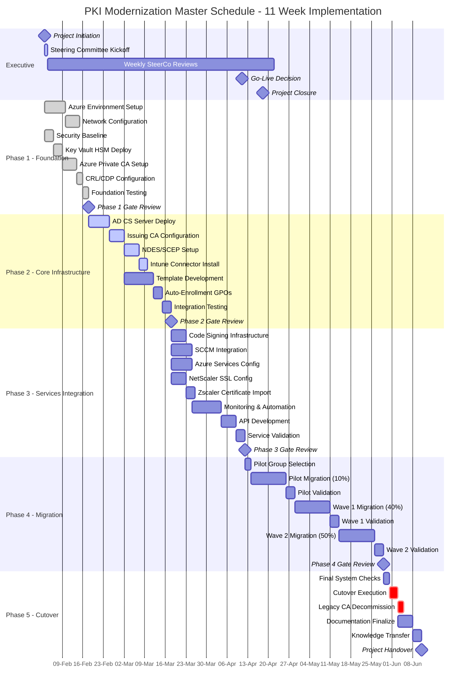
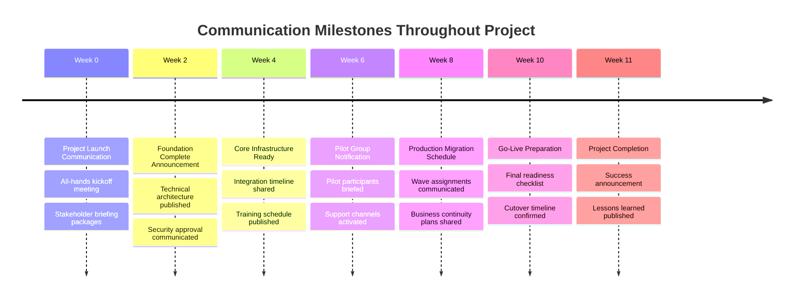
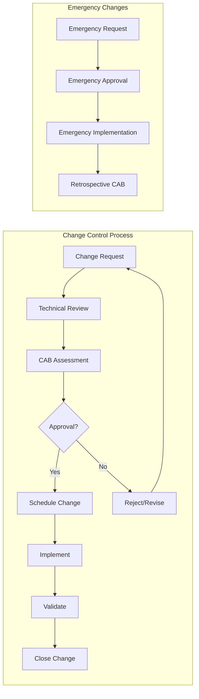

# PKI Modernization - Enterprise Project Timeline & Execution Plan

[← Back to Index](00-index.md) | [Next: Network Architecture →](02-network-architecture.md)

## Executive Summary

This document outlines the comprehensive 11-week implementation timeline for the enterprise PKI modernization project, deploying a hybrid Azure-based public key infrastructure with on-premises integration across Australian regions. The project will establish a robust, scalable, and compliant certificate services architecture supporting 10,000+ endpoints.

## Project Overview

### Strategic Objectives
- **Modernize** legacy PKI infrastructure with cloud-native capabilities
- **Enhance** security posture with HSM-protected root CA in Azure
- **Automate** certificate lifecycle management reducing manual overhead by 80%
- **Integrate** seamlessly with existing enterprise services (AD, Intune, SCCM)
- **Ensure** compliance with Australian regulatory requirements (ACSC ISM, Privacy Act)

### Project Scope
- **Geographic Coverage**: Australia East (Primary), Australia Southeast (DR)
- **User Base**: 10,000+ devices, 5,000+ users
- **Certificate Types**: SSL/TLS, Code Signing, S/MIME, Device Authentication, 802.1X
- **Integration Points**: 15+ enterprise systems
- **Migration Approach**: Phased with zero-downtime cutover

## Master Implementation Timeline



## Detailed Phase Breakdown

### Phase 1: Foundation Setup (Weeks 1-2)
**Duration**: February 3-14, 2025 (10 business days)

#### Key Activities
| Activity | Duration | Resources | Dependencies |
|----------|----------|-----------|--------------|
| Azure subscription provisioning | 2 days | Cloud Team (2) | Procurement approval |
| Resource group creation & tagging | 1 day | Cloud Team (1) | Subscription ready |
| Virtual network design & deployment | 3 days | Network Team (2) | Architecture approval |
| ExpressRoute/VPN configuration | 2 days | Network Team (2) | Network design complete |
| Azure Key Vault HSM setup | 2 days | Security Team (2) | VNET ready |
| Azure Private CA deployment | 3 days | PKI Architect (1) | Key Vault operational |
| CRL/CDP endpoints configuration | 2 days | PKI Team (2) | CA deployed |
| Security baseline implementation | 3 days | Security Team (2) | Parallel with infrastructure |

#### Deliverables
- ✅ Azure infrastructure operational in Australia East
- ✅ Network connectivity established (ExpressRoute + VPN backup)
- ✅ Root CA certificate issued and validated
- ✅ HSM-protected keys configured
- ✅ Security controls implemented and tested

### Phase 2: Core Infrastructure Deployment (Weeks 3-4)
**Duration**: February 17-28, 2025 (10 business days)

#### Key Activities
| Activity | Duration | Resources | Dependencies |
|----------|----------|-----------|--------------|
| Windows Server 2022 provisioning | 2 days | Windows Team (2) | Phase 1 complete |
| AD CS role installation | 2 days | Windows Team (2) | Servers ready |
| Issuing CA configuration | 3 days | PKI Team (2) | AD CS installed |
| NDES server deployment | 2 days | PKI Team (1) | Issuing CAs operational |
| Intune connector setup | 1 day | MDM Team (1) | NDES ready |
| Certificate template creation | 5 days | PKI Team (2) | CAs operational |
| GPO configuration | 2 days | AD Team (2) | Templates ready |
| End-to-end testing | 3 days | All teams | Components deployed |

#### Deliverables
- ✅ Two issuing CAs operational (Active-Active)
- ✅ NDES/SCEP services configured
- ✅ 15+ certificate templates deployed
- ✅ Auto-enrollment policies active
- ✅ Intune integration validated

### Phase 3: Services Integration (Weeks 5-6)
**Duration**: March 3-14, 2025 (10 business days)

#### Key Activities
| Activity | Duration | Resources | Dependencies |
|----------|----------|-----------|--------------|
| Code signing service setup | 3 days | Dev Team (2) | Phase 2 complete |
| SCCM client certificate deployment | 4 days | SCCM Team (2) | Templates ready |
| Azure service automation | 5 days | Cloud Team (3) | Key Vault access |
| NetScaler SSL configuration | 3 days | Network Team (2) | Certificates available |
| Zscaler trust configuration | 2 days | Security Team (1) | Root CA trusted |
| Monitoring deployment | 3 days | Ops Team (2) | All services ready |
| API gateway configuration | 2 days | Dev Team (2) | Services operational |
| Integration testing | 3 days | All teams | Components integrated |

#### Deliverables
- ✅ Code signing operational for DevOps
- ✅ SCCM auto-enrollment active
- ✅ Azure services automated renewal
- ✅ Load balancer SSL configured
- ✅ Zero-trust network integration
- ✅ Monitoring dashboards live

### Phase 4: Migration Execution (Weeks 7-10)
**Duration**: March 17-April 11, 2025 (20 business days)

#### Migration Waves

| Wave | Scope | Devices | Duration | Rollback Window |
|------|-------|---------|----------|-----------------|
| Pilot | IT & Early Adopters | 1,000 (10%) | 5 days | 24 hours |
| Wave 1 | Corporate Services | 4,000 (40%) | 7 days | 48 hours |
| Wave 2 | Production Systems | 5,000 (50%) | 8 days | 72 hours |

#### Daily Migration Schedule
```
06:00 - Pre-migration health checks
07:00 - Migration batch initiation (500 devices)
09:00 - Initial validation checkpoint
12:00 - Mid-day status review
15:00 - Completion verification
17:00 - Post-migration testing
18:00 - Go/No-go for next batch
```

#### Success Criteria Per Wave
- Certificate issuance success rate: >99%
- Authentication success rate: >99.5%
- Application connectivity: 100%
- User impact incidents: <5 per 1000 devices
- Rollback invocations: 0

### Phase 5: Cutover and Decommissioning (Week 11)
**Duration**: April 14-18, 2025 (5 business days)

#### Cutover Activities
| Day | Activity | Time | Responsible Team |
|-----|----------|------|------------------|
| Monday | Final readiness assessment | 08:00-12:00 | All teams |
| Monday | Cutover initiation | 18:00-20:00 | PKI Team |
| Tuesday | Legacy CA offline | 06:00-08:00 | PKI Team |
| Tuesday | Validation testing | 08:00-17:00 | QA Team |
| Wednesday | Legacy backup & archive | 09:00-17:00 | Ops Team |
| Thursday | Documentation completion | 09:00-17:00 | All teams |
| Friday | Knowledge transfer sessions | 09:00-17:00 | PKI Team |
| Friday | Project closure | 16:00-17:00 | PMO |

## Resource Requirements

### Team Composition Matrix

| Role | Phase 1 | Phase 2 | Phase 3 | Phase 4 | Phase 5 | Total FTE-Weeks |
|------|---------|---------|---------|---------|---------|-----------------|
| Project Manager | 1.0 | 1.0 | 1.0 | 1.0 | 1.0 | 11.0 |
| PKI Architect | 1.0 | 1.0 | 1.0 | 1.0 | 0.5 | 10.5 |
| Azure Engineers | 2.0 | 1.0 | 1.0 | 0.5 | 0.5 | 11.0 |
| Windows Engineers | 0.5 | 2.0 | 1.0 | 1.0 | 0.5 | 11.0 |
| Network Engineers | 1.0 | 0.5 | 0.5 | 0.5 | 0.0 | 5.5 |
| Security Engineers | 1.0 | 0.5 | 0.5 | 0.5 | 0.5 | 6.5 |
| MDM/Intune Team | 0.0 | 1.0 | 0.5 | 0.5 | 0.0 | 4.5 |
| Application Teams | 0.0 | 0.5 | 2.0 | 1.0 | 0.5 | 9.0 |
| **Total FTE** | **6.5** | **7.5** | **7.5** | **6.5** | **3.5** | **69.0** |

### Infrastructure Requirements

#### Azure Resources (Australia East)
- **Compute**: 4x D4s_v5 VMs (Issuing CAs, NDES, OCSP)
- **Storage**: 2TB Premium SSD for CA databases
- **Key Vault**: Premium tier with HSM protection
- **Networking**: ExpressRoute 50 Mbps primary, VPN 10 Mbps backup
- **PaaS Services**: Azure Private CA, Application Gateway, Front Door

#### On-Premises Resources
- **Servers**: 4x Windows Server 2022 (physical or virtual)
- **Storage**: 500GB for logs and backups
- **Network**: 10 Gbps internal connectivity
- **Load Balancers**: NetScaler ADC HA pair

## Critical Milestones & Decision Gates

| Week | Milestone | Success Criteria | Decision Authority |
|------|-----------|------------------|-------------------|
| 2 | Foundation Complete | Azure infrastructure operational, Root CA deployed | Technical Lead |
| 4 | Core PKI Operational | Issuing CAs online, templates deployed | PKI Architect |
| 6 | Services Integrated | All integrations tested, monitoring active | Integration Lead |
| 7 | Pilot Start | Pilot group identified, rollback plan ready | Change Board |
| 8 | Pilot Success | <1% failure rate, no critical issues | Steering Committee |
| 10 | Production Complete | 100% migrated, all validations passed | CTO |
| 11 | Project Closure | Legacy decommissioned, handover complete | Sponsor |

## Risk Management Timeline

### Risk Heat Map by Phase

| Risk Category | Phase 1 | Phase 2 | Phase 3 | Phase 4 | Phase 5 |
|---------------|---------|---------|---------|---------|---------|
| Technical Complexity | 🟡 Medium | 🔴 High | 🔴 High | 🟡 Medium | 🟢 Low |
| Business Impact | 🟢 Low | 🟢 Low | 🟡 Medium | 🔴 High | 🔴 High |
| Resource Availability | 🟡 Medium | 🟡 Medium | 🔴 High | 🟡 Medium | 🟢 Low |
| Integration Issues | 🟢 Low | 🟡 Medium | 🔴 High | 🟡 Medium | 🟢 Low |
| Security Vulnerabilities | 🔴 High | 🟡 Medium | 🟡 Medium | 🟢 Low | 🟢 Low |

### Mitigation Strategies

| Week | Primary Risk | Mitigation Action | Contingency Plan |
|------|--------------|-------------------|------------------|
| 1-2 | Azure service delays | Pre-provision resources, parallel tasks | Extend Phase 1 by 3 days |
| 3-4 | AD integration failures | Lab testing, vendor support engagement | Fallback to manual config |
| 5-6 | Application incompatibility | Early testing, vendor certification | Maintain legacy certs |
| 7-8 | Pilot failures | Gradual rollout, enhanced monitoring | Immediate rollback |
| 9-10 | Production disruption | Change freeze, maintenance windows | Emergency legacy restart |
| 11 | Decommission issues | Complete backups, extended retention | Delay decommission 30 days |

## Communication Plan

### Stakeholder Communication Matrix

| Audience | Frequency | Channel | Content | Owner |
|----------|-----------|---------|---------|-------|
| Executive Sponsor | Weekly | Email + Dashboard | Status, risks, decisions needed | PM |
| Steering Committee | Weekly | Teams Meeting | Progress, issues, upcoming milestones | PM |
| Technical Teams | Daily | Standup | Tasks, blockers, coordination | Tech Lead |
| Business Units | Bi-weekly | Newsletter | Impact, schedule, preparation needed | Comms Lead |
| End Users | Phase-based | Email + Portal | Migration schedule, actions required | Service Desk |
| External Vendors | As needed | Scheduled calls | Integration requirements, support | Vendor Manager |

### Communication Milestones



## Success Metrics & KPIs

### Project Delivery Metrics

| Metric | Target | Measurement Method | Reporting Frequency |
|--------|--------|-------------------|-------------------|
| Schedule Adherence | ±5% variance | Earned value analysis | Weekly |
| Budget Compliance | ±10% variance | Financial tracking | Bi-weekly |
| Scope Completion | 100% | Requirements traceability | Phase gates |
| Quality Score | >95% | Defect density analysis | Daily during testing |
| Risk Mitigation | <5 high risks | Risk register review | Weekly |

### Technical Performance Metrics

| Metric | Baseline | Target | Measurement Tool |
|--------|----------|--------|------------------|
| Certificate Issuance Time | 5 minutes | <30 seconds | CA performance monitor |
| OCSP Response Time | 500ms | <100ms | Network monitoring |
| Auto-Enrollment Success | 60% | >95% | SCCM reports |
| Manual Interventions | 50/day | <5/day | Service desk tickets |
| System Availability | 99.0% | 99.95% | Uptime monitoring |

### Business Value Metrics

| Metric | Current State | Future State | Value Delivered |
|--------|---------------|--------------|-----------------|
| Cost per Certificate | $25 | $10 | 60% reduction |
| Certificate Lifecycle | Manual | Automated | 80% automation |
| Compliance Violations | 10/month | 0/month | 100% compliance |
| Security Incidents | 5/year | 1/year | 80% reduction |
| Time to Deploy Certificate | 2 days | 2 hours | 95% faster |

## Budget Overview

### Capital Expenditure (CAPEX)

| Category | Amount (AUD) | Notes |
|----------|--------------|-------|
| Azure Infrastructure | $150,000 | Annual commitment |
| Software Licenses | $75,000 | Windows Server, CALs |
| Hardware (HSM) | $50,000 | Included in Key Vault |
| Professional Services | $200,000 | External PKI consultants |
| **Total CAPEX** | **$475,000** | |

### Operational Expenditure (OPEX)

| Category | Monthly (AUD) | Annual (AUD) | Notes |
|----------|---------------|--------------|-------|
| Azure Consumption | $8,000 | $96,000 | Compute, storage, network |
| Support Contracts | $2,000 | $24,000 | Microsoft Premier |
| Monitoring Tools | $1,000 | $12,000 | Third-party solutions |
| **Total OPEX** | **$11,000** | **$132,000** | |

## Compliance & Governance

### Regulatory Compliance Timeline

| Week | Compliance Activity | Standard | Responsible Party |
|------|-------------------|----------|-------------------|
| 1 | Security baseline review | ACSC ISM | Security Team |
| 3 | Cryptographic validation | FIPS 140-2 | PKI Architect |
| 5 | Privacy impact assessment | Privacy Act 1988 | Legal/Compliance |
| 7 | Audit trail verification | SOC 2 Type II | Internal Audit |
| 9 | Penetration testing | OWASP | External Auditor |
| 11 | Compliance certification | ISO 27001 | Compliance Officer |

### Change Management Process



## Training & Knowledge Transfer Plan

### Training Schedule

| Week | Training Topic | Audience | Duration | Delivery Method |
|------|---------------|----------|----------|-----------------|
| 2 | PKI Fundamentals | All IT Staff | 2 hours | Virtual workshop |
| 3 | Azure Key Vault Management | Cloud Team | 4 hours | Hands-on lab |
| 4 | Certificate Template Administration | PKI Team | 8 hours | Instructor-led |
| 5 | NDES/SCEP Configuration | MDM Team | 4 hours | Documentation + lab |
| 6 | Certificate Enrollment Procedures | Help Desk | 2 hours | Video training |
| 8 | Troubleshooting Guide | Support Teams | 4 hours | Workshop |
| 10 | Operational Procedures | Operations | 8 hours | Runbook review |
| 11 | Knowledge Transfer Sessions | All Teams | 16 hours | Comprehensive handover |

### Documentation Deliverables

| Document | Target Audience | Delivery Week | Format |
|----------|----------------|---------------|--------|
| Architecture Design | Technical Teams | 2 | Visio + Wiki |
| Security Controls | Security/Audit | 3 | PDF + SharePoint |
| Operations Runbook | Operations Team | 10 | Wiki + Automation |
| Troubleshooting Guide | Support Teams | 10 | Knowledge Base |
| User Guide | End Users | 8 | Portal + Video |
| Disaster Recovery Plan | Operations/Management | 11 | Tested procedures |

## Quality Assurance Gates

### Phase Gate Criteria

| Gate | Phase | Entry Criteria | Exit Criteria | Approver |
|------|-------|---------------|--------------|----------|
| G1 | Foundation | Requirements approved, resources allocated | Infrastructure operational, security validated | Technical Lead |
| G2 | Core Infra | Foundation complete, AD prepared | CAs operational, templates tested | PKI Architect |
| G3 | Integration | Core PKI ready, APIs documented | All integrations tested, monitoring active | Integration Lead |
| G4 | Migration | Services integrated, pilot group ready | Pilot successful, rollback tested | Change Board |
| G5 | Cutover | Migration complete, validation passed | Legacy decommissioned, handover complete | Steering Committee |

## Post-Implementation Review

### 30-Day Review Checkpoint
- System stability assessment
- Performance metrics validation
- Incident analysis and resolution
- User satisfaction survey
- Cost optimization opportunities

### 90-Day Review Checkpoint
- Business value realization
- Compliance audit results
- Operational efficiency gains
- Lessons learned documentation
- Continuous improvement plan

## Appendices

### A. Contact List
- **Project Sponsor**: John Smith (john.smith@company.com.au)
- **Project Manager**: Sarah Johnson (sarah.johnson@company.com.au)
- **PKI Architect**: Michael Chen (michael.chen@company.com.au)
- **Technical Lead**: Emma Wilson (emma.wilson@company.com.au)
- **Change Manager**: David Brown (david.brown@company.com.au)

### B. Reference Documents
- PKI Architecture Design v2.0
- Security Requirements Specification
- Network Architecture Diagram
- Integration Requirements Matrix
- Testing Strategy Document

### C. Tools & Resources
- **Project Management**: Microsoft Project Online
- **Collaboration**: Microsoft Teams
- **Documentation**: SharePoint/Confluence
- **Monitoring**: Azure Monitor + Datadog
- **Service Management**: ServiceNow

---

**Document Control**
- Version: 1.0
- Last Updated: February 2025
- Next Review: Weekly during implementation
- Owner: PKI Modernization Team
- Classification: Internal Use Only

---
[← Back to Index](00-index.md) | [Next: Network Architecture →](02-network-architecture.md)