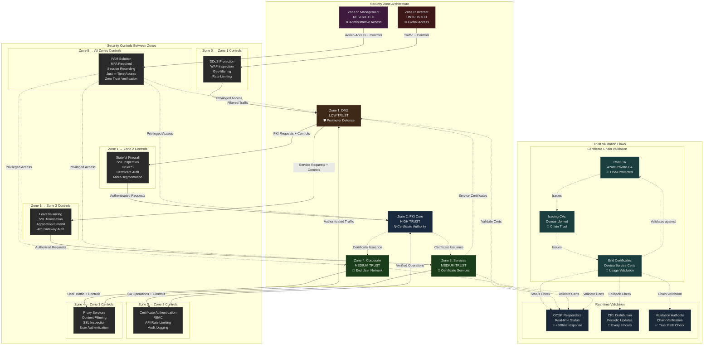
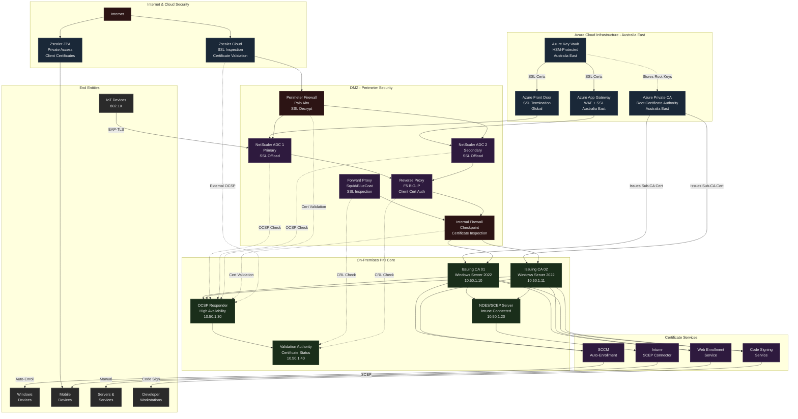

# PKI Modernization - Complete Network Architecture with Security Appliances

[← Previous: Project Timeline](01-project-timeline.md) | [Back to Index](00-index.md) | [Next: PKI Hierarchy →](03-pki-hierarchy.md)

## Enterprise PKI Infrastructure with Security Layers

This document details the complete network architecture for the PKI modernization project, including all security appliances, network segments, and data flows.

## Comprehensive PKI Architecture Overview

```mermaid
graph TD
    %% Define dark mode friendly color styles
    classDef internetStyle fill:#2c1414,stroke:#4a2020,stroke-width:3px,color:#e8e8e8
    classDef azureStyle fill:#1a2838,stroke:#2a3848,stroke-width:2px,color:#e8e8e8
    classDef dmzStyle fill:#382818,stroke:#483828,stroke-width:2px,color:#e8e8e8
    classDef pkiStyle fill:#1a2e1a,stroke:#2a3e2a,stroke-width:2px,color:#e8e8e8
    classDef endpointStyle fill:#2a2a2a,stroke:#3a3a3a,stroke-width:2px,color:#e8e8e8
    classDef securityStyle fill:#2e1a3e,stroke:#3e2a4e,stroke-width:2px,color:#e8e8e8
    classDef mgmtStyle fill:#3a2a1a,stroke:#4a3a2a,stroke-width:2px,color:#e8e8e8
    classDef drStyle fill:#2e2318,stroke:#3e3328,stroke-width:2px,color:#e8e8e8

    subgraph "Zone 0: Internet & Cloud Security"
        INTERNET[Internet<br/>Global Access]:::internetStyle
        CLOUDFLARE[Cloudflare<br/>DDoS + WAF]:::securityStyle
        ZSCALER[Zscaler ZIA<br/>SSL Inspection]:::securityStyle
        ZPA[Zscaler ZPA<br/>Zero Trust Access]:::securityStyle
    end

    subgraph "Zone 1: Azure Cloud - Australia East"
        subgraph "Azure Security Services"
            AFD[Azure Front Door<br/>Global Load Balancer]:::azureStyle
            APPGW[Application Gateway<br/>WAF + SSL Termination]:::azureStyle
            AZFW[Azure Firewall<br/>Premium + TLS Inspection]:::azureStyle
        end

        subgraph "Azure PKI Core Services"
            AKV[Azure Key Vault<br/>HSM-Protected Keys<br/>FIPS 140-2 Level 3]:::azureStyle
            APCA[Azure Private CA<br/>Root Certificate Authority<br/>20-year Validity]:::azureStyle
            ASTORAGE[Azure Storage<br/>CRL/AIA Distribution<br/>CDN Integration]:::azureStyle
        end
    end

    subgraph "Zone 2: DMZ - Perimeter Security"
        subgraph "External Perimeter"
            PAFW[Palo Alto PA-5250<br/>External Firewall<br/>SSL Decrypt + IPS]:::dmzStyle
            CLOUDPROXY[Cloud Proxy<br/>Threat Intelligence]:::securityStyle
        end

        subgraph "Load Balancing Tier"
            NS1[NetScaler ADC<br/>Primary SSL Offload<br/>10.20.1.10]:::dmzStyle
            NS2[NetScaler ADC<br/>Secondary HA<br/>10.20.1.11]:::dmzStyle
            F5LTM[F5 BIG-IP LTM<br/>Advanced Routing<br/>10.20.1.20]:::dmzStyle
        end

        subgraph "Proxy Services"
            FWDPROXY[Forward Proxy<br/>Outbound Inspection<br/>10.20.2.10]:::dmzStyle
            REVPROXY[Reverse Proxy<br/>Inbound Services<br/>10.20.2.20]:::dmzStyle
        end

        CPFW[CheckPoint 6500<br/>Internal Firewall<br/>Application Control]:::dmzStyle
    end

    subgraph "Zone 3: PKI Core Infrastructure"
        subgraph "Certificate Authorities"
            ICA1[Issuing CA 01<br/>Windows Server 2022<br/>10.50.1.10<br/>Active-Active]:::pkiStyle
            ICA2[Issuing CA 02<br/>Windows Server 2022<br/>10.50.1.11<br/>Active-Active]:::pkiStyle
        end

        subgraph "PKI Services"
            NDES[NDES/SCEP Server<br/>Mobile Enrollment<br/>10.50.1.20]:::pkiStyle
            OCSP1[OCSP Responder 1<br/>Revocation Status<br/>10.50.1.30]:::pkiStyle
            OCSP2[OCSP Responder 2<br/>Revocation Status<br/>10.50.1.31]:::pkiStyle
            VA[Validation Authority<br/>Chain Validation<br/>10.50.1.40]:::pkiStyle
        end
    end

    subgraph "Zone 4: Certificate Services"
        CS[Code Signing Service<br/>Secure Code Signing<br/>10.50.4.10]:::pkiStyle
        WEB[Web Enrollment<br/>Browser-based Requests<br/>10.50.4.30]:::pkiStyle
        API[PKI REST API<br/>Programmatic Access<br/>10.50.4.50]:::pkiStyle
        INTCON[Intune Connector<br/>Mobile Device Bridge<br/>10.50.4.40]:::pkiStyle
    end

    subgraph "Zone 5: Enterprise Integration"
        subgraph "Microsoft Integration"
            SCCM[SCCM Site Server<br/>Auto-Enrollment<br/>Computer Certificates]:::mgmtStyle
            INTUNE[Microsoft Intune<br/>Mobile Device Management<br/>Cloud-based]:::mgmtStyle
            AAD[Azure Active Directory<br/>Identity Provider<br/>Device Registration]:::mgmtStyle
        end

        subgraph "Enterprise Systems"
            ADCS[Active Directory<br/>Domain Controllers<br/>Authentication]:::mgmtStyle
            DHCP[DHCP/DNS Servers<br/>Network Services<br/>Name Resolution]:::mgmtStyle
            MONITORING[Monitoring Stack<br/>SCOM + Splunk<br/>10.50.3.30]:::mgmtStyle
        end
    end

    subgraph "Zone 6: End Entities (10,000+ Devices)"
        subgraph "Corporate Devices"
            WINCLIENTS[Windows Clients<br/>5,000 Devices<br/>802.1X + Auto-Enroll]:::endpointStyle
            MACCLIENTS[macOS Clients<br/>500 Devices<br/>SCEP Enrollment]:::endpointStyle
            SERVERS[Windows Servers<br/>500 Systems<br/>Auto-Enrollment]:::endpointStyle
            LINUX[Linux Servers<br/>200 Systems<br/>API/EST Enrollment]:::endpointStyle
        end

        subgraph "Mobile & IoT"
            IOS[iOS Devices<br/>2,000 Devices<br/>Intune SCEP]:::endpointStyle
            ANDROID[Android Enterprise<br/>1,500 Devices<br/>Work Profile]:::endpointStyle
            IOT[IoT Devices<br/>1,000 Endpoints<br/>EST Protocol]:::endpointStyle
        end

        subgraph "Network Equipment"
            SWITCHES[Network Switches<br/>802.1X Supplicant<br/>SCEP Enrollment]:::endpointStyle
            WIRELESS[Wireless APs<br/>WPA2-Enterprise<br/>Certificate Auth]:::endpointStyle
            FIREWALLS[Branch Firewalls<br/>VPN Authentication<br/>Certificate-based]:::endpointStyle
        end
    end

    subgraph "Zone 7: Disaster Recovery (Melbourne)"
        MELFW[Melbourne Firewall<br/>DR Site Gateway]:::drStyle
        MELCACHE[Certificate Cache<br/>Local CRL/OCSP<br/>10.60.1.10]:::drStyle
        DRAZURE[Azure Australia Southeast<br/>DR Key Vault<br/>Standby Root CA]:::drStyle
    end

    %% Internet connectivity
    INTERNET ==> CLOUDFLARE
    CLOUDFLARE ==> ZSCALER
    ZSCALER ==> PAFW
    INTERNET ==> AFD
    AFD ==> APPGW

    %% Zone traversal
    PAFW ==> CLOUDPROXY
    CLOUDPROXY ==> NS1
    CLOUDPROXY ==> NS2
    NS1 ==> F5LTM
    NS2 ==> F5LTM
    F5LTM ==> FWDPROXY
    F5LTM ==> REVPROXY
    FWDPROXY ==> CPFW
    REVPROXY ==> CPFW

    %% Internal PKI flows
    CPFW ==> ICA1
    CPFW ==> ICA2
    CPFW ==> NDES
    CPFW ==> WEB
    CPFW ==> API

    %% Azure integration
    APPGW ==> AZFW
    AZFW ==> AKV
    AZFW ==> APCA
    APCA -.->|Issues SubCA Certs| ICA1
    APCA -.->|Issues SubCA Certs| ICA2
    AKV -.->|HSM Keys| APCA
    ASTORAGE -.->|CRL/AIA| INTERNET

    %% PKI service relationships
    ICA1 -.->|Replication| ICA2
    ICA1 ==> OCSP1
    ICA2 ==> OCSP2
    OCSP1 -.->|Status| VA
    OCSP2 -.->|Status| VA
    NDES ==> ICA1

    %% Enterprise integration
    ICA1 ==> SCCM
    ICA2 ==> SCCM
    NDES ==> INTCON
    INTCON ==> INTUNE
    INTUNE ==> AAD
    SCCM ==> ADCS

    %% End entity enrollment paths
    SCCM -.->|Auto-Enroll| WINCLIENTS
    SCCM -.->|Auto-Enroll| SERVERS
    INTUNE -.->|SCEP Profile| IOS
    INTUNE -.->|SCEP Profile| ANDROID
    WEB -.->|Manual Request| MACCLIENTS
    API -.->|Programmatic| LINUX
    NDES -.->|SCEP| SWITCHES
    NDES -.->|SCEP| WIRELESS

    %% Certificate validation flows
    NS1 -.->|OCSP Check| OCSP1
    NS2 -.->|OCSP Check| OCSP2
    F5LTM -.->|CRL Check| VA
    PAFW -.->|Chain Validation| VA

    %% Zero Trust Access
    ZPA -.->|Client Certs| IOS
    ZPA -.->|Client Certs| ANDROID
    ZPA -.->|Client Certs| MACCLIENTS

    %% Disaster Recovery
    ICA1 -.->|Backup| MELCACHE
    ICA2 -.->|Backup| MELCACHE
    AKV -.->|Geo-Replication| DRAZURE
    MELFW -.->|DR Failover| MELCACHE

    %% Monitoring flows
    ICA1 -.->|Logs/Metrics| MONITORING
    ICA2 -.->|Logs/Metrics| MONITORING
    NDES -.->|Logs/Metrics| MONITORING
    OCSP1 -.->|Logs/Metrics| MONITORING
    OCSP2 -.->|Logs/Metrics| MONITORING
```



This comprehensive diagram shows the complete PKI ecosystem including all security zones, trust relationships, certificate flows, and integration points across the enterprise infrastructure.

## Security Zone Interaction & Trust Model



## Trust Chain Validation Flow

```mermaid
sequenceDiagram
    %% Define consistent color styles for sequence diagram
    autonumber
    participant CLIENT as Client/Service
    participant LB as Load Balancer
    participant OCSP as OCSP Responder
    participant VA as Validation Authority
    participant CA as Issuing CA
    participant ROOT as Root CA (Azure)
    participant AKV as Azure Key Vault

    Note over CLIENT,AKV: Certificate Trust Validation Process

    rect rgb(26, 42, 62)
    note right of CLIENT: Initial Certificate Presentation
    CLIENT->>LB: Present Certificate
    LB->>LB: Extract Certificate Chain
    end

    alt Real-time OCSP Check
        rect rgb(26, 46, 26)
        note right of OCSP: Real-time Validation Path
        LB->>OCSP: OCSP Status Request
        OCSP->>CA: Query Certificate Status
        CA->>OCSP: Return Status (Valid/Revoked)
        OCSP->>LB: OCSP Response
        end
    else OCSP Unavailable
        rect rgb(62, 40, 24)
        note right of VA: Fallback CRL Path
        LB->>VA: Download Latest CRL
        VA->>CA: Retrieve CRL
        CA->>VA: Return CRL
        VA->>LB: CRL Response
        LB->>LB: Check Certificate Against CRL
        end
    end

    rect rgb(26, 35, 52)
    note right of VA: Certificate Chain Validation
    LB->>VA: Validate Certificate Chain
    VA->>VA: Extract Issuing CA Certificate
    VA->>CA: Verify CA Certificate
    CA->>ROOT: Validate Against Root CA
    end

    rect rgb(26, 46, 42)
    note right of ROOT: HSM Signature Verification
    ROOT->>AKV: Verify HSM Signature
    AKV->>ROOT: HSM Validation Response
    ROOT->>CA: Root CA Validation Response
    CA->>VA: CA Validation Response
    VA->>LB: Chain Validation Result
    end

    alt Certificate Valid
        rect rgb(30, 48, 30)
        note right of CLIENT: ✅ Success Path
        LB->>CLIENT: Allow Connection
        Note over CLIENT,LB: Connection Established
        end
    else Certificate Invalid
        rect rgb(62, 24, 24)
        note right of CLIENT: ❌ Failure Path
        LB->>CLIENT: Reject Connection
        LB->>VA: Log Security Event
        VA->>OCSP: Update Monitoring
        end
    end

    rect rgb(46, 26, 52)
    note right of VA: Monitoring & Metrics
    VA->>VA: Update Trust Metrics
    OCSP->>OCSP: Log Validation Event
    end

    Note over CLIENT,AKV: End-to-End Trust Validation Complete
```





## Network Segments

### Azure Cloud (Australia Regions)

| Segment | CIDR | Location | Purpose |
|---------|------|----------|---------|
| Azure PKI VNet | 10.50.0.0/16 | Australia East | Primary PKI infrastructure |
| PKI-Core Subnet | 10.50.1.0/24 | Australia East | CA servers and services |
| PKI-HSM Subnet | 10.50.2.0/24 | Australia East | HSM and Key Vault integration |
| Gateway Subnet | 10.50.255.0/24 | Australia East | VPN/ExpressRoute gateway |
| DR PKI VNet | 10.51.0.0/16 | Australia Southeast | Disaster recovery PKI |
| DR Gateway Subnet | 10.51.255.0/24 | Australia Southeast | DR VPN/ExpressRoute gateway |

### On-Premises Networks

| Segment | CIDR | Location | Purpose |
|---------|------|----------|---------|
| Client Network | 10.10.0.0/16 | Sydney DC | End-user devices |
| Server Network | 10.10.2.0/24 | Sydney DC | Infrastructure servers |
| DMZ Network | 10.20.0.0/16 | Sydney DC | Perimeter security |
| PKI Core | 10.50.0.0/24 | Sydney DC | PKI services (stretched from Azure) |
| Melbourne Site | 10.60.0.0/16 | Melbourne DC | Secondary site and DR cache |

## Security Zones

| Zone | Trust Level | Description | Key Controls |
|------|-------------|-------------|--------------|
| Zone 0 - Internet | Untrusted | Public internet traffic | DDoS protection, WAF, IPS, geographic filtering |
| Zone 1 - DMZ | Low Trust | Perimeter security services | Network segmentation, SSL inspection, client cert auth |
| Zone 2 - PKI Core | High Trust | Certificate authorities | Micro-segmentation, HSM protection, audit logging |
| Zone 3 - Services | Medium Trust | Certificate services | RBAC, API gateway, service authentication |
| Zone 4 - Corporate | Medium Trust | End user devices | 802.1X, auto-enrollment, compliance validation |
| Zone 5 - Management | Restricted | Administrative access | Jump servers, MFA, privileged access management |

### Zone Details

#### Zone 0: Internet Edge
- **Components**: Zscaler, Azure Front Door, CDN
- **Trust Level**: Untrusted
- **Security Controls**:
  - DDoS protection (Cloudflare, Azure)
  - Web Application Firewall (WAF)
  - SSL/TLS termination and inspection
  - Geographic filtering (Australia/APAC focus)
  - Rate limiting and bot protection

#### Zone 1: DMZ (Perimeter)
- **Components**: Firewalls, NetScaler ADCs, Proxies, Load Balancers
- **Trust Level**: Low Trust
- **Security Controls**:
  - Network segmentation with stateful inspection
  - SSL decryption and re-encryption
  - Certificate validation and CRL checking
  - IDS/IPS with signature updates
  - Client certificate authentication for admin access

#### Zone 2: PKI Core (High Security)
- **Components**: Issuing CAs, Root CA connections, HSM
- **Trust Level**: High Trust
- **Security Controls**:
  - Physical and logical micro-segmentation
  - Role-based access control with certificate authentication
  - Comprehensive audit logging to SIEM
  - HSM protection for all private keys
  - Automated backup and recovery procedures
  - Network access control with 802.1X

#### Zone 3: Certificate Services
- **Components**: NDES, Web Enrollment, Code Signing, API Gateway
- **Trust Level**: Medium Trust
- **Security Controls**:
  - API gateway with OAuth 2.0/certificate authentication
  - Service-to-service authentication with certificates
  - Application-level logging and monitoring
  - Input validation and sanitization
  - Rate limiting per service endpoint

#### Zone 4: Corporate Network
- **Components**: End-user devices, servers, IoT devices
- **Trust Level**: Medium Trust
- **Security Controls**:
  - 802.1X network authentication with certificates
  - Auto-enrollment policies via Group Policy/Intune
  - Device compliance validation
  - Certificate-based authentication for all services
  - Endpoint detection and response (EDR)

#### Zone 5: Management Network
- **Components**: Admin workstations, jump servers, monitoring systems
- **Trust Level**: Restricted
- **Security Controls**:
  - Privileged access management (PAM) solution
  - Multi-factor authentication (MFA) mandatory
  - Session recording and monitoring
  - Just-in-time access provisioning
  - Certificate-based admin authentication

## Port Requirements

### Inbound Ports (Internet to DMZ)

| Port | Protocol | Service | Source | Destination |
|------|----------|---------|--------|-------------|
| 443 | TCP | HTTPS | Internet | Azure Front Door |
| 443 | TCP | HTTPS | Internet | NetScaler VIP |
| 80 | TCP | HTTP/CRL | Internet | CRL Distribution Point |

### DMZ to Internal

| Port | Protocol | Service | Source | Destination |
|------|----------|---------|--------|-------------|
| 135 | TCP | RPC Endpoint Mapper | DMZ Proxies | Issuing CAs |
| 445 | TCP | SMB/File Shares | DMZ Proxies | Issuing CAs |
| 443 | TCP | HTTPS/SCEP | DMZ Proxies | NDES Server |
| 80 | TCP | HTTP/OCSP | DMZ Proxies | OCSP Responder |
| 49152-65535 | TCP | Dynamic RPC Ports | DMZ Proxies | Issuing CAs |
| 389 | TCP | LDAP | PKI Servers | Domain Controllers |
| 636 | TCP | LDAPS (Secure LDAP) | PKI Servers | Domain Controllers |
| 88 | TCP/UDP | Kerberos Authentication | PKI Servers | Domain Controllers |
| 53 | TCP/UDP | DNS Resolution | PKI Servers | DNS Servers |
| 123 | UDP | NTP Time Sync | PKI Servers | NTP Servers |

### Internal to Azure

| Port | Protocol | Service | Source | Destination |
|------|----------|---------|--------|-------------|
| 443 | TCP | HTTPS | Issuing CAs | Azure Key Vault |
| 443 | TCP | HTTPS | Issuing CAs | Azure Private CA |
| 443 | TCP | HTTPS | NDES Server | Microsoft Intune |

## High Availability Design

### Azure Components
- **Azure Key Vault**: Geo-replicated between Australia East and Australia Southeast
- **Azure Private CA**: Active in Australia East, passive standby in Australia Southeast
- **Azure Front Door**: Global distribution with Australia East as primary origin

### On-Premises Components
- **Issuing CAs**: Active-Active configuration with load balancing
- **NDES Server**: Single instance with VM-level HA
- **OCSP Responders**: Active-Active behind NetScaler VIP
- **NetScaler ADCs**: Active-Passive HA pair

## Network Security Controls

### Network Security Groups (NSGs)

```json
{
  "PKI-Core-NSG": {
    "rules": [
      {
        "name": "Allow-HTTPS-Inbound",
        "priority": 100,
        "direction": "Inbound",
        "protocol": "TCP",
        "sourcePortRange": "*",
        "destinationPortRange": "443",
        "sourceAddressPrefix": "10.20.0.0/16",
        "destinationAddressPrefix": "10.50.1.0/24",
        "access": "Allow"
      },
      {
        "name": "Allow-RPC-Inbound",
        "priority": 110,
        "direction": "Inbound",
        "protocol": "TCP",
        "sourcePortRange": "*",
        "destinationPortRange": "135",
        "sourceAddressPrefix": "10.20.0.0/16",
        "destinationAddressPrefix": "10.50.1.0/24",
        "access": "Allow"
      },
      {
        "name": "Allow-CRL-HTTP",
        "priority": 120,
        "direction": "Inbound",
        "protocol": "TCP",
        "sourcePortRange": "*",
        "destinationPortRange": "80",
        "sourceAddressPrefix": "*",
        "destinationAddressPrefix": "10.50.1.30/32",
        "access": "Allow"
      },
      {
        "name": "Deny-All-Inbound",
        "priority": 1000,
        "direction": "Inbound",
        "protocol": "*",
        "sourcePortRange": "*",
        "destinationPortRange": "*",
        "sourceAddressPrefix": "*",
        "destinationAddressPrefix": "*",
        "access": "Deny"
      }
    ]
  }
}
```

### Firewall Rules

| Rule Name | Source | Destination | Port | Protocol | Action |
|-----------|--------|-------------|------|----------|--------|
| PKI-HTTPS | DMZ | PKI Core | 443 | TCP | Allow |
| PKI-RPC | DMZ | PKI Core | 135,445 | TCP | Allow |
| PKI-OCSP | Any | OCSP (10.50.1.30) | 80 | TCP | Allow |
| PKI-CRL | Any | CRL Endpoint | 80 | TCP | Allow |
| PKI-Azure | PKI Core | Azure (Australia East) | 443 | TCP | Allow |
| Block-All | Any | PKI Core | Any | Any | Deny |

## Bandwidth Requirements

### Estimated Traffic Patterns

| Service | Peak Transactions/Hour | Bandwidth Required |
|---------|------------------------|-------------------|
| Certificate Enrollment | 500 | 10 Mbps |
| OCSP Queries | 10,000 | 5 Mbps |
| CRL Downloads | 1,000 | 20 Mbps |
| Certificate Renewal | 200 | 5 Mbps |
| Management Traffic | Continuous | 2 Mbps |
| **Total Required** | - | **50 Mbps** |

### Azure ExpressRoute Configuration
- **Primary Circuit**: 200 Mbps (Telstra, Sydney)
- **Secondary Circuit**: 100 Mbps (Optus, Sydney - backup)
- **Melbourne Circuit**: 100 Mbps (Telstra, Melbourne - DR)
- **Peering**: Private + Microsoft peering enabled
- **Redundancy**: Site-to-Site VPN backup (100 Mbps)
- **QoS Marking**: PKI traffic marked as EF (Expedited Forwarding)

### BGP Routing Configuration

| Neighbor | AS Number | Networks Advertised | Communities |
|----------|-----------|-------------------|-------------|
| Azure ExpressRoute | 12076 | 10.50.0.0/16, 10.51.0.0/16 | 12076:5020 |
| Sydney Core | 65001 | 10.10.0.0/16, 10.12.0.0/16, 10.20.0.0/16 | 65001:100 |
| Melbourne Core | 65002 | 10.60.0.0/16 | 65002:100 |
| Internet Edge | 65000 | 0.0.0.0/0 (default route) | 65000:666 |

### QoS Traffic Classification

| Class | DSCP | Traffic Type | Bandwidth Allocation | Priority |
|-------|------|--------------|---------------------|----------|
| PKI-Critical | EF (46) | OCSP responses, time-sensitive | 20% | Highest |
| PKI-High | AF41 (34) | Certificate enrollment | 30% | High |
| PKI-Medium | AF31 (26) | CRL downloads | 20% | Medium |
| PKI-Management | AF21 (18) | Administrative traffic | 10% | Low |
| PKI-Backup | AF11 (10) | Backup/replication | 15% | Bulk |
| Best-Effort | 0 | Other traffic | 5% | None |

## Load Balancer Configuration

### NetScaler ADC Virtual Servers

**PKI Web Services VIP (10.20.1.100)**
- **Protocol**: SSL (TLS 1.2+)
- **Method**: Least Connection
- **Persistence**: Source IP (2 hours)
- **Backend Pool**: 10.50.4.30:443, 10.50.4.31:443
- **Health Check**: HTTPS GET /certsrv/health (10s interval)
- **SSL Profile**: Perfect Forward Secrecy enabled

**OCSP Services VIP (10.20.1.101)**
- **Protocol**: HTTP
- **Method**: Round Robin
- **Backend Pool**: 10.50.1.30:80, 10.50.1.31:80
- **Health Check**: HTTP GET /ocsp/health (5s interval)
- **Timeout**: 2s response timeout

**SCEP/NDES VIP (10.20.1.102)**
- **Protocol**: SSL
- **Method**: Cookie-based persistence
- **Backend**: 10.50.1.20:443 (NDES Server)
- **Health Check**: TCP port 443 (10s interval)

### F5 BIG-IP Configuration

**PKI API Virtual Server (10.20.1.200)**
- **Pool Members**: 10.50.4.50:443, 10.50.4.51:443
- **Load Balancing**: Least connections
- **SSL Profiles**: Client + Server SSL with certificate authentication
- **Monitors**: HTTPS with custom URI health check

## Network Monitoring & Performance

### Monitoring Framework

| Component | Tool | Metrics | Threshold | Alert Level |
|-----------|------|---------|-----------|-------------|
| Bandwidth Utilization | PRTG/SolarWinds | % utilization | >80% | Warning |
| Network Latency | ThousandEyes | Milliseconds | >100ms | Critical |
| Packet Loss | NetFlow Analyzer | Percentage | >1% | Warning |
| SSL Certificate Expiry | Certificate Monitor | Days remaining | <30 | Warning |
| Connection Health | Load Balancer | Active connections | >90% capacity | Critical |
| DNS Resolution | DNS Monitor | Response time | >500ms | Warning |

### Performance Baselines

| Metric | Baseline | Acceptable | Degraded | Critical |
|--------|----------|------------|----------|----------|
| LAN Latency (Sydney) | <1ms | <5ms | 5-10ms | >10ms |
| WAN Latency (Syd-Mel) | <20ms | <50ms | 50-100ms | >100ms |
| Azure Latency | <30ms | <100ms | 100-200ms | >200ms |
| ExpressRoute Throughput | 200Mbps | >160Mbps | 100-160Mbps | <100Mbps |
| Certificate Enrollment | <2s | <5s | 5-10s | >10s |
| OCSP Response Time | <100ms | <500ms | 500ms-1s | >1s |

## Capacity Planning & Scaling

### Growth Projections

| Metric | Current | Year 1 | Year 2 | Year 3 |
|--------|---------|--------|--------|--------|
| Total Devices | 10,000 | 12,000 | 15,000 | 18,000 |
| Certificates/Day | 500 | 750 | 1,000 | 1,500 |
| OCSP Queries/Second | 100 | 150 | 200 | 300 |
| ExpressRoute Bandwidth | 200 Mbps | 300 Mbps | 400 Mbps | 500 Mbps |
| Storage Requirements | 2 TB | 3 TB | 5 TB | 8 TB |

### Scaling Triggers

- **Bandwidth**: Upgrade when >70% utilization for 7 consecutive days
- **Latency**: Scale when P95 latency >100ms for PKI-critical traffic
- **Connection Count**: Add load balancer capacity when >80% concurrent connections
- **Storage**: Expand when <20% free space remaining
- **Processing**: Scale CAs when average CPU >60% for 24 hours

## Disaster Recovery Network Design

### Component Failover Matrix

| Component | Primary | Secondary | Failover Method | RTO | RPO |
|-----------|---------|-----------|-----------------|-----|-----|
| Root CA | Azure East | Azure Southeast | Manual activation | 4h | 0 |
| Issuing CAs | ICA01 | ICA02 | Automatic clustering | 0 | 0 |
| OCSP Responders | OCSP01 | OCSP02 | Load balancer health check | <1s | 0 |
| Load Balancers | NS-ADC-01 | NS-ADC-02 | VRRP failover | <3s | 0 |
| Network Links | ExpressRoute | Site-to-Site VPN | BGP route convergence | <30s | 0 |
| Melbourne Site | Cache Only | Full PKI Services | Manual promotion | 2h | 15min |

### DR Activation Process

1. **Detection** (0-5 minutes): Automated monitoring detects primary failure
2. **Assessment** (5-10 minutes): Confirm scope of failure and decide activation
3. **DNS Updates** (10-15 minutes): Switch DNS records to DR endpoints
4. **BGP Reconvergence** (15-20 minutes): Route traffic to Melbourne site
5. **Service Validation** (20-30 minutes): Confirm all PKI services operational
6. **Stakeholder Notification** (30-45 minutes): Inform users of DR activation

## PKI Disaster Recovery Flow

```mermaid
sequenceDiagram
    %% Define consistent color styles for sequence diagram
    autonumber
    participant MON as Monitoring System
    participant OPS as Operations Team
    participant DNS as DNS Manager
    participant BGP as BGP Router
    participant SYD as Sydney PKI (Primary)
    participant MEL as Melbourne PKI (DR)
    participant AZURE_E as Azure East (Primary)
    participant AZURE_SE as Azure Southeast (DR)
    participant CLIENTS as Client Systems

    Note over MON,CLIENTS: PKI Disaster Recovery Activation Process

    %% Failure Detection Phase (0-5 minutes)
    rect rgb(62, 24, 24)
    note right of MON: 🔴 FAILURE DETECTION (0-5 min)
    SYD->>SYD: 🔥 Primary Site Failure
    MON->>MON: Health Checks Fail
    MON->>OPS: 🚨 CRITICAL ALERT: PKI Down
    end

    par
        rect rgb(62, 40, 24)
        MON->>MON: Validate Multiple Failure Points
        end
    and
        rect rgb(62, 40, 24)
        MON->>AZURE_E: Check Azure Services
        AZURE_E-->>MON: Azure PKI Services Down
        end
    and
        rect rgb(62, 40, 24)
        MON->>SYD: Attempt Service Restart
        SYD-->>MON: No Response
        end
    end

    %% Assessment Phase (5-10 minutes)
    rect rgb(26, 42, 62)
    note right of OPS: 🔵 ASSESSMENT PHASE (5-10 min)
    OPS->>OPS: Assess Failure Scope
    OPS->>MEL: Check DR Site Readiness
    MEL->>OPS: ✅ DR Site Ready
    end

    rect rgb(26, 42, 62)
    OPS->>AZURE_SE: Validate DR Azure Services
    AZURE_SE->>OPS: ✅ Standby Services Ready
    end

    rect rgb(62, 48, 24)
    note right of OPS: ⚠️ CRITICAL DECISION
    OPS->>OPS: 📋 Decision: Activate DR
    end

    %% DNS Update Phase (10-15 minutes)
    rect rgb(26, 46, 52)
    note right of DNS: 🔄 DNS UPDATE (10-15 min)
    OPS->>DNS: Update DNS Records
    end

    par
        rect rgb(26, 46, 52)
        DNS->>DNS: pki.company.com.au → Melbourne IPs
        end
    and
        rect rgb(26, 46, 52)
        DNS->>DNS: ocsp.company.com.au → Melbourne OCSP
        end
    and
        rect rgb(26, 46, 52)
        DNS->>DNS: crl.company.com.au → Melbourne CRL
        end
    end

    rect rgb(26, 46, 42)
    DNS->>CLIENTS: 📡 DNS Propagation (TTL: 300s)
    end

    %% BGP Reconvergence Phase (15-20 minutes)
    rect rgb(46, 26, 52)
    note right of BGP: 🌐 BGP RECONVERGENCE (15-20 min)
    OPS->>BGP: Withdraw Sydney Routes
    BGP->>BGP: Remove Primary AS 65001
    end

    rect rgb(46, 26, 52)
    OPS->>MEL: Advertise Melbourne Routes
    MEL->>BGP: Announce AS 65002
    BGP->>BGP: ⚡ Route Convergence
    end

    rect rgb(42, 24, 48)
    BGP->>CLIENTS: Traffic Rerouted to Melbourne
    end

    %% Service Activation Phase (20-30 minutes)
    rect rgb(26, 46, 26)
    note right of AZURE_SE: 🟢 SERVICE ACTIVATION (20-30 min)
    OPS->>AZURE_SE: Activate DR Azure Services
    end

    par
        rect rgb(26, 46, 26)
        AZURE_SE->>AZURE_SE: Promote Standby Root CA
        end
    and
        rect rgb(26, 46, 26)
        AZURE_SE->>AZURE_SE: Activate Key Vault Replica
        end
    and
        rect rgb(26, 46, 26)
        AZURE_SE->>AZURE_SE: Start OCSP Services
        end
    end

    rect rgb(30, 48, 30)
    OPS->>MEL: Start PKI Services
    end

    par
        rect rgb(30, 48, 30)
        MEL->>MEL: Start Issuing CA Services
        end
    and
        rect rgb(30, 48, 30)
        MEL->>MEL: Start NDES Server
        end
    and
        rect rgb(30, 48, 30)
        MEL->>MEL: Activate Web Enrollment
        end
    and
        rect rgb(30, 48, 30)
        MEL->>MEL: Start Certificate Validation
        end
    end

    %% Validation Phase (30-40 minutes)
    rect rgb(26, 46, 42)
    note right of MEL: ✅ VALIDATION PHASE (30-40 min)
    OPS->>MEL: Test Certificate Issuance
    MEL->>OPS: ✅ Issuance Working
    end

    rect rgb(26, 46, 42)
    OPS->>AZURE_SE: Test OCSP Responses
    AZURE_SE->>OPS: ✅ OCSP Responding
    end

    rect rgb(26, 46, 42)
    OPS->>CLIENTS: Test Client Connectivity
    CLIENTS->>MEL: Certificate Requests
    MEL->>CLIENTS: ✅ Certificates Issued
    end

    rect rgb(26, 46, 42)
    CLIENTS->>AZURE_SE: OCSP Status Checks
    AZURE_SE->>CLIENTS: ✅ Status Responses
    end

    %% Notification Phase (40-45 minutes)
    rect rgb(46, 26, 52)
    note right of OPS: 📧 NOTIFICATION (40-45 min)
    OPS->>OPS: 📧 Stakeholder Notification
    end

    par
        rect rgb(46, 26, 52)
        OPS->>OPS: Email IT Teams
        end
    and
        rect rgb(46, 26, 52)
        OPS->>OPS: Update Service Status Page
        end
    and
        rect rgb(46, 26, 52)
        OPS->>OPS: Notify Management
        end
    and
        rect rgb(46, 26, 52)
        OPS->>OPS: Update Incident Ticket
        end
    end

    Note over MON,CLIENTS: ✅ DR Activation Complete - Melbourne Active

    %% Recovery Monitoring
    loop Every 15 minutes
        rect rgb(42, 26, 48)
        note right of MON: 📊 CONTINUOUS MONITORING
        MON->>MEL: Health Check DR Services
        MEL->>MON: Status Report
        MON->>AZURE_SE: Health Check Azure DR
        AZURE_SE->>MON: Status Report
        end
    end

    Note over MON,CLIENTS: Continuous Monitoring Until Primary Recovery
```



## DR Failback Process

```mermaid
flowchart TD
    START([Primary Site<br/>Restored]) --> ASSESS{DR Site<br/>Assessment}

    ASSESS --> VALIDATE[Validate Primary<br/>Infrastructure]
    VALIDATE --> SYNC[Synchronize<br/>Certificate Database]

    SYNC --> TEST[Test Primary<br/>Services]
    TEST --> TESTOK{All Tests<br/>Passing?}

    TESTOK -->|No| FIX[Fix Issues<br/>Re-test]
    FIX --> TEST

    TESTOK -->|Yes| PLAN[Plan Failback<br/>Window]
    PLAN --> NOTIFY[Notify<br/>Stakeholders]

    NOTIFY --> CUTOVER[Execute Failback<br/>Cutover]

    subgraph "Cutover Process"
        CUTOVER --> STOP_DR[Stop DR<br/>Certificate Issuance]
        STOP_DR --> SYNC_FINAL[Final Database<br/>Synchronization]
        SYNC_FINAL --> DNS_SWITCH[Switch DNS<br/>to Primary]
        DNS_SWITCH --> BGP_SWITCH[Update BGP<br/>Routes]
        BGP_SWITCH --> START_PRIMARY[Start Primary<br/>Services]
        START_PRIMARY --> VALIDATE_PRIMARY[Validate Primary<br/>Operations]
        VALIDATE_PRIMARY --> STANDBY_DR[DR to<br/>Standby Mode]
    end

    STANDBY_DR --> MONITOR[Monitor Primary<br/>Performance]
    MONITOR --> SUCCESS([Failback<br/>Complete])

    %% Style the nodes with dark mode friendly colors
    classDef startStyle fill:#1a2838,stroke:#2a3848,stroke-width:2px,color:#e8e8e8
    classDef processStyle fill:#1a3e1a,stroke:#2a4e2a,stroke-width:2px,color:#e8e8e8
    classDef decisionStyle fill:#3e2818,stroke:#4e3828,stroke-width:2px,color:#e8e8e8
    classDef cautionStyle fill:#3e1818,stroke:#4e2828,stroke-width:2px,color:#e8e8e8

    class START,SUCCESS startStyle
    class VALIDATE,SYNC,TEST,PLAN,NOTIFY,STOP_DR,SYNC_FINAL,DNS_SWITCH,BGP_SWITCH,START_PRIMARY,VALIDATE_PRIMARY,STANDBY_DR,MONITOR processStyle
    class ASSESS,TESTOK decisionStyle
    class FIX cautionStyle
```



---
[← Previous: Project Timeline](01-project-timeline.md) | [Back to Index](00-index.md) | [Next: PKI Hierarchy →](03-pki-hierarchy.md)
