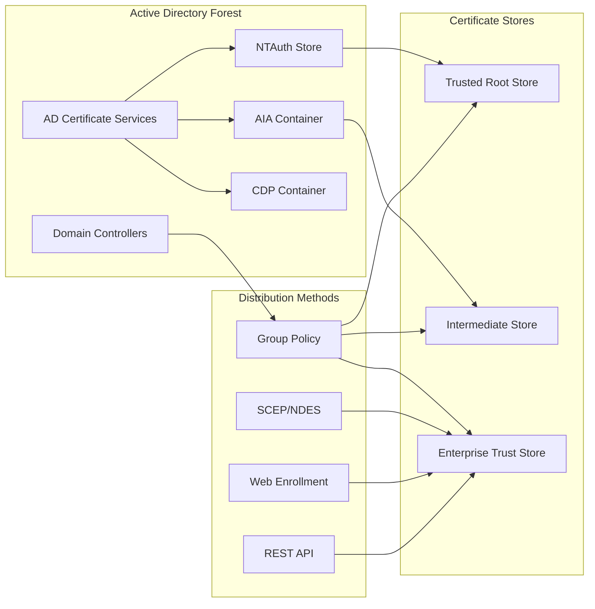
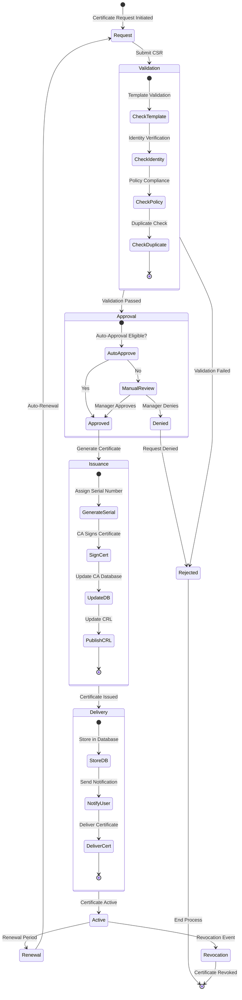
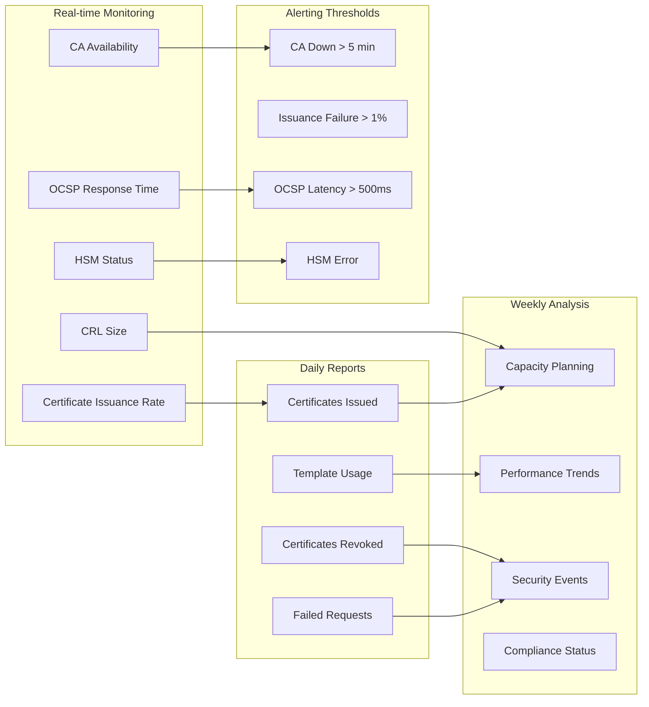

# PKI Modernization - Enterprise PKI Hierarchy & Trust Architecture

[← Previous: Network Architecture](02-network-architecture.md) | [Back to Index](00-index.md) | [Next: Enrollment Flows →](04-enrollment-flows.md)

## Executive Summary

This document defines the complete PKI hierarchy architecture, including the root certificate authority, subordinate issuing CAs, trust relationships, certificate policies, and template designs. The architecture implements a three-tier hierarchy optimized for security, scalability, and operational efficiency across the Australian enterprise environment.

## PKI Hierarchy Overview

### Architectural Design Principles

- **Three-Tier Hierarchy**: Offline root → Online intermediate → Issuing CAs
- **Geographic Distribution**: Multi-region deployment for resilience
- **HSM Protection**: Hardware security modules for all CA private keys
- **Separation of Duties**: Distinct CAs for different certificate purposes
- **Policy Constraints**: Strict certificate policies and OID controls
- **Cross-Certification Ready**: Support for partner trust relationships

## Complete PKI Hierarchy Structure

```mermaid
graph TB
    %% Define styles
    classDef rootCA fill:#b91c1c,stroke:#ffffff,stroke-width:3px,color:#ffffff,font-weight:bold
    classDef intermediateCA fill:#1e40af,stroke:#ffffff,stroke-width:2px,color:#ffffff
    classDef issuingCA fill:#059669,stroke:#ffffff,stroke-width:2px,color:#ffffff
    classDef policyCA fill:#7c3aed,stroke:#ffffff,stroke-width:2px,color:#ffffff
    classDef serviceCA fill:#ea580c,stroke:#ffffff,stroke-width:2px,color:#ffffff
    classDef crossCA fill:#64748b,stroke:#ffffff,stroke-width:2px,color:#ffffff

    subgraph "Offline Root CA - Azure Key Vault HSM"
        ROOT[Company Australia Root CA G2<br/>RSA 4096-bit<br/>Valid: 2025-2045<br/>Serial: 01]:::rootCA
    end

    subgraph "Intermediate CAs - Azure Private CA"
        INTCA1[Company Intermediate CA 01<br/>RSA 4096-bit<br/>Valid: 2025-2035<br/>Serial: 1001]:::intermediateCA
        INTCA2[Company Intermediate CA 02<br/>RSA 4096-bit<br/>Valid: 2025-2035<br/>Serial: 1002]:::intermediateCA
    end

    subgraph "Issuing CAs - On-Premises"
        subgraph "Internal Services"
            ICA_INT1[Internal Issuing CA 01<br/>RSA 4096-bit<br/>Valid: 2025-2030<br/>10.50.1.10]:::issuingCA
            ICA_INT2[Internal Issuing CA 02<br/>RSA 4096-bit<br/>Valid: 2025-2030<br/>10.50.1.11]:::issuingCA
        end
        
        subgraph "External Services"
            ICA_EXT[External Services CA<br/>RSA 4096-bit<br/>Valid: 2025-2030<br/>10.50.1.12]:::issuingCA
        end
        
        subgraph "Device Authentication"
            ICA_DEV[Device Authentication CA<br/>RSA 4096-bit<br/>Valid: 2025-2030<br/>10.50.1.13]:::issuingCA
        end
        
        subgraph "Code Signing"
            ICA_CODE[Code Signing CA<br/>RSA 4096-bit<br/>Valid: 2025-2030<br/>10.50.1.14]:::issuingCA
        end
    end

    subgraph "Policy CAs"
        PCA_HIGH[High Assurance Policy CA<br/>ECC P-384<br/>Valid: 2025-2030]:::policyCA
        PCA_MED[Medium Assurance Policy CA<br/>RSA 2048-bit<br/>Valid: 2025-2030]:::policyCA
    end

    subgraph "Special Purpose CAs"
        SCA_TEMP[Temporary Certificate CA<br/>RSA 2048-bit<br/>Valid: 2025-2027]:::serviceCA
        SCA_IOT[IoT Device CA<br/>ECC P-256<br/>Valid: 2025-2030]:::serviceCA
        SCA_CLOUD[Cloud Services CA<br/>RSA 3072-bit<br/>Valid: 2025-2030]:::serviceCA
    end

    subgraph "Cross-Certification"
        CROSS1[Partner Organization CA<br/>Cross-Certified<br/>Limited Trust]:::crossCA
        CROSS2[Government CA<br/>Bridge Trust<br/>Restricted Scope]:::crossCA
    end

    %% Hierarchy relationships
    ROOT ==>|Issues| INTCA1
    ROOT ==>|Issues| INTCA2
    
    INTCA1 ==>|Issues| ICA_INT1
    INTCA1 ==>|Issues| ICA_INT2
    INTCA1 ==>|Issues| ICA_EXT
    
    INTCA2 ==>|Issues| ICA_DEV
    INTCA2 ==>|Issues| ICA_CODE
    
    ROOT ==>|Issues| PCA_HIGH
    ROOT ==>|Issues| PCA_MED
    
    PCA_HIGH ==>|Constrains| ICA_CODE
    PCA_MED ==>|Constrains| ICA_DEV
    
    INTCA1 ==>|Issues| SCA_TEMP
    INTCA2 ==>|Issues| SCA_IOT
    INTCA2 ==>|Issues| SCA_CLOUD
    
    ROOT -.->|Cross-Certifies| CROSS1
    ROOT -.->|Bridge Trust| CROSS2
```



## Certificate Authority Detailed Specifications

### Root Certificate Authority

```yaml
Certificate:
  Subject:
    CN: Company Australia Root CA G2
    O: Company Australia Pty Ltd
    OU: Information Security
    L: Sydney
    S: New South Wales
    C: AU
    
  Key Specifications:
    Algorithm: RSA
    Key Size: 4096 bits
    Key Usage: Certificate Sign, CRL Sign
    Key Storage: Azure Key Vault HSM (FIPS 140-2 Level 3)
    
  Validity:
    Not Before: 2025-03-01 00:00:00 UTC
    Not After: 2045-03-01 00:00:00 UTC
    
  Extensions:
    Basic Constraints: CA:TRUE, pathlen:2
    Subject Key Identifier: Auto-generated
    Authority Key Identifier: Self-signed
    CRL Distribution Points:
      - http://crl.company.com.au/root-g2.crl
      - ldap://directory.company.com.au/cn=Root-G2,ou=PKI,o=Company
    Authority Information Access:
      - CA Issuers: http://aia.company.com.au/root-g2.crt
      - OCSP: http://ocsp.company.com.au/root
    Certificate Policies:
      - 1.3.6.1.4.1.company.1.1 (High Assurance)
      - 1.3.6.1.4.1.company.1.2 (Medium Assurance)
      - 1.3.6.1.4.1.company.1.3 (Basic Assurance)
```

### Intermediate Certificate Authorities

| Property | Intermediate CA 01 | Intermediate CA 02 |
|----------|-------------------|-------------------|
| **Common Name** | Company Intermediate CA 01 | Company Intermediate CA 02 |
| **Serial Number** | 1001 | 1002 |
| **Key Algorithm** | RSA 4096-bit | RSA 4096-bit |
| **Signature Algorithm** | SHA384withRSA | SHA384withRSA |
| **Validity Period** | 10 years | 10 years |
| **Path Length** | 1 | 1 |
| **Name Constraints** | Internal domains only | External + devices |
| **Policy Mappings** | Internal policies | External policies |
| **CRL Period** | 6 months | 6 months |
| **OCSP Responder** | ocsp-int.company.com.au | ocsp-ext.company.com.au |

### Issuing Certificate Authorities

```json
{
  "Internal_Issuing_CA_01": {
    "purpose": "Domain-joined computers and users",
    "key_specs": {
      "algorithm": "RSA",
      "size": 4096,
      "provider": "Microsoft Software Key Storage Provider"
    },
    "validity": "5 years",
    "templates": [
      "Domain Computer",
      "Domain User",
      "Domain Controller",
      "Web Server Internal"
    ],
    "constraints": {
      "name_constraints": "*.company.local, *.company.com.au",
      "path_length": 0,
      "policy_oids": ["1.3.6.1.4.1.company.2.1"]
    },
    "performance": {
      "certificates_per_day": 1000,
      "peak_rate": "50/minute",
      "database_size": "50GB"
    }
  },
  
  "External_Services_CA": {
    "purpose": "Public-facing services",
    "key_specs": {
      "algorithm": "RSA",
      "size": 4096,
      "provider": "nCipher HSM"
    },
    "validity": "5 years",
    "templates": [
      "Web Server External",
      "API Gateway",
      "Load Balancer SSL"
    ],
    "constraints": {
      "name_constraints": "*.company.com.au, *.company-cloud.com",
      "enhanced_key_usage": ["1.3.6.1.5.5.7.3.1"],
      "require_subject_alt_name": true
    }
  },
  
  "Code_Signing_CA": {
    "purpose": "Software and script signing",
    "key_specs": {
      "algorithm": "RSA",
      "size": 4096,
      "provider": "Azure Key Vault HSM"
    },
    "validity": "5 years",
    "templates": [
      "Code Signing - Standard",
      "Code Signing - EV",
      "PowerShell Script Signing"
    ],
    "constraints": {
      "enhanced_key_usage": ["1.3.6.1.5.5.7.3.3"],
      "require_manager_approval": true,
      "maximum_validity": "2 years"
    }
  }
}
```

## Certificate Templates

### User Certificate Templates

| Template Name | Purpose | Key Size | Validity | Auto-Enroll | Approval | EKU |
|--------------|---------|----------|----------|-------------|----------|-----|
| Company-User-Authentication | Smart card logon | RSA 2048 | 1 year | Yes | Auto | 1.3.6.1.5.5.7.3.2 |
| Company-User-Email | S/MIME encryption | RSA 2048 | 1 year | Yes | Auto | 1.3.6.1.5.5.7.3.4 |
| Company-User-EFS | File system encryption | RSA 2048 | 2 years | No | Auto | 1.3.6.1.4.1.311.10.3.4 |
| Company-User-VPN | VPN authentication | RSA 2048 | 1 year | Yes | Auto | 1.3.6.1.5.5.7.3.2 |
| Company-User-WiFi | 802.1X authentication | RSA 2048 | 1 year | Yes | Auto | 1.3.6.1.5.5.7.3.2 |
| Company-Admin-Authentication | Privileged admin auth | RSA 4096 | 6 months | No | Manager | 1.3.6.1.5.5.7.3.2 |

### Computer Certificate Templates

| Template Name | Purpose | Key Size | Validity | Auto-Enroll | SAN Support |
|--------------|---------|----------|----------|-------------|-------------|
| Company-Computer-Authentication | Machine auth | RSA 2048 | 2 years | Yes | DNS |
| Company-Domain-Controller | DC authentication | RSA 4096 | 3 years | Yes | DNS, IP |
| Company-Web-Server-Internal | Internal HTTPS | RSA 2048 | 1 year | No | DNS, IP |
| Company-Web-Server-External | Public HTTPS | RSA 2048 | 1 year | No | DNS |
| Company-RDP-Server | RDP encryption | RSA 2048 | 2 years | Yes | DNS |
| Company-SCCM-Client | SCCM authentication | RSA 2048 | 2 years | Yes | DNS |
| Company-802.1X-Computer | Network auth | RSA 2048 | 1 year | Yes | DNS |

### Special Purpose Templates

```yaml
Code_Signing_Standard:
  Template_Name: Company-Code-Signing-Standard
  Schema_Version: 4
  Validity_Period: 1 year
  Key_Specifications:
    Minimum_Key_Size: 3072
    Key_Usage: Digital Signature
    Key_Storage: HSM_Required
  Enhanced_Key_Usage:
    - 1.3.6.1.5.5.7.3.3  # Code Signing
    - 1.3.6.1.4.1.311.10.3.6  # Windows System Component Verification
  Subject_Name: CN=<RequesterName>-CodeSign,OU=Development,O=Company
  Extensions:
    Certificate_Policies:
      - PolicyID: 1.3.6.1.4.1.company.3.1
        Policy_Qualifiers:
          - CPS: https://pki.company.com.au/cps
          - User_Notice: "Code signing certificate for internal use only"
  Issuance_Requirements:
    RA_Signature_Count: 2
    Authorized_Signatures:
      - Development Manager
      - Security Officer
  Security_Settings:
    Private_Key_Archival: Disabled
    Export_Private_Key: Disabled
    Strong_Key_Protection: Required

Mobile_Device_Certificate:
  Template_Name: Company-Mobile-SCEP
  Protocol: SCEP
  Validity_Period: 2 years
  Key_Specifications:
    Algorithm: RSA
    Key_Size: 2048
    Key_Generation: On_Device
  Subject_Name_Format: CN={{DeviceId}},OU=Mobile,O=Company
  Subject_Alternative_Names:
    - Type: User Principal Name
      Value: {{UserPrincipalName}}
    - Type: DNS
      Value: {{DeviceName}}.mobile.company.com.au
  Challenge_Password:
    Type: Dynamic
    Validity: 60 minutes
    Complexity: 16 characters
  Enrollment_Agent_Rights:
    - NDES Service Account
    - Intune Connector Account
```

## Trust Relationships

### Internal Trust Architecture



### External Trust Relationships

| External Entity | Trust Type | Scope | Validation | Constraints |
|-----------------|------------|-------|------------|-------------|
| **DigiCert Public CA** | Chain trust | Public web services | EV validation | Public DNS names only |
| **Partner Org A** | Cross-certification | B2B federation | Certificate bridge | Specific OUs, 1-year limit |
| **Government PKI** | Bridge CA | Regulatory compliance | Mutual authentication | Restricted attributes |
| **Cloud Provider PKI** | Subordination | Cloud services | API validation | Cloud resources only |
| **Zscaler CA** | Import trust | SSL inspection | Proxy authentication | Internal traffic only |
| **Azure AD** | Federation trust | Hybrid identity | SAML/OAuth | User principals only |

### Certificate Policy OIDs

```json
{
  "policy_definitions": {
    "1.3.6.1.4.1.company.1": {
      "name": "Company Certificate Policies",
      "sub_policies": {
        "1.3.6.1.4.1.company.1.1": {
          "name": "High Assurance",
          "requirements": [
            "HSM key storage",
            "Multi-factor authentication",
            "In-person identity verification",
            "Annual audit required"
          ]
        },
        "1.3.6.1.4.1.company.1.2": {
          "name": "Medium Assurance",
          "requirements": [
            "Software key storage acceptable",
            "Domain authentication required",
            "Remote identity verification",
            "Automated compliance checks"
          ]
        },
        "1.3.6.1.4.1.company.1.3": {
          "name": "Basic Assurance",
          "requirements": [
            "Minimal identity verification",
            "Email validation only",
            "No audit requirements"
          ]
        }
      }
    },
    "1.3.6.1.4.1.company.2": {
      "name": "Certificate Usage Policies",
      "sub_policies": {
        "1.3.6.1.4.1.company.2.1": "Internal Use Only",
        "1.3.6.1.4.1.company.2.2": "External Services",
        "1.3.6.1.4.1.company.2.3": "Partner Federation",
        "1.3.6.1.4.1.company.2.4": "Regulatory Compliance"
      }
    },
    "1.3.6.1.4.1.company.3": {
      "name": "Special Purpose Policies",
      "sub_policies": {
        "1.3.6.1.4.1.company.3.1": "Code Signing",
        "1.3.6.1.4.1.company.3.2": "Document Signing",
        "1.3.6.1.4.1.company.3.3": "Time Stamping",
        "1.3.6.1.4.1.company.3.4": "OCSP Signing"
      }
    }
  }
}
```

## Certificate Lifecycle Management

### Certificate Issuance Workflow



### Certificate Renewal Strategy

| Certificate Type | Renewal Trigger | Renewal Window | Method | Overlap Period |
|------------------|-----------------|----------------|--------|----------------|
| User Certificates | 80% lifetime | 20% remaining | Auto-enrollment | 30 days |
| Computer Certificates | 80% lifetime | 20% remaining | Auto-enrollment | 30 days |
| Web Server Certificates | 30 days before | Last 30 days | Manual/API | 7 days |
| Code Signing | 60 days before | Last 60 days | Manual approval | 30 days |
| Domain Controller | 90% lifetime | 10% remaining | Auto-enrollment | 90 days |
| Root CA | 2 years before | Last 2 years | Ceremony | 2 years |

### Revocation Management

```yaml
CRL_Configuration:
  Base_CRL:
    Publication_Schedule: Weekly (Sunday 02:00 AEST)
    Validity_Period: 7 days
    Overlap_Period: 2 days
    Next_Update: Current + 7 days
    Distribution_Points:
      - http://crl.company.com.au/IssuingCA1.crl
      - ldap://directory.company.com.au/CN=IssuingCA1,OU=PKI
    Extensions:
      CRL_Number: Incremental
      Authority_Key_Identifier: Included
      Issuing_Distribution_Point: Critical
    
  Delta_CRL:
    Publication_Schedule: Daily (02:00 AEST)
    Validity_Period: 25 hours
    Overlap_Period: 1 hour
    Base_CRL_Reference: Required
    Size_Threshold: 1MB
    
OCSP_Configuration:
  Responder_Certificate:
    Validity: 2 weeks
    Auto_Renewal: 10 days before expiry
    Signing_Algorithm: SHA256withRSA
    
  Response_Settings:
    Default_Validity: 24 hours
    Maximum_Age: 7 days
    Nonce_Support: Optional
    
  Performance:
    Cache_Duration: 4 hours
    Response_Time_Target: <100ms
    Queries_Per_Second: 1000
    
Revocation_Reasons:
  0: Unspecified
  1: Key_Compromise
  2: CA_Compromise
  3: Affiliation_Changed
  4: Superseded
  5: Cessation_Of_Operation
  6: Certificate_Hold
  8: Remove_From_CRL
  9: Privilege_Withdrawn
  10: AA_Compromise
```

## Key Management Architecture

### Key Generation and Storage

| CA Level | Key Generation | Storage Type | Protection Level | Backup Method |
|----------|---------------|--------------|------------------|---------------|
| Root CA | Ceremony | Azure HSM | FIPS 140-2 Level 3 | Multi-party shares |
| Intermediate CA | Automated | Azure HSM | FIPS 140-2 Level 3 | HSM replication |
| Issuing CA | Automated | Software + TPM | TPM 2.0 | Encrypted export |
| Service Accounts | Automated | Azure Key Vault | Managed HSM | Geo-replication |
| End Entities | User/Device | Local store | DPAPI/Keychain | User responsibility |

### Key Ceremony Procedures

```markdown
## Root CA Key Ceremony

### Participants Required
- Security Officer (Ceremony Administrator)
- PKI Administrator #1 (Key Operator)
- PKI Administrator #2 (Key Operator)
- Internal Auditor (Witness)
- External Auditor (Witness)
- Legal Representative (Witness)

### Pre-Ceremony Checklist
- [ ] HSM initialized and configured
- [ ] Ceremony room secured and inspected
- [ ] Video recording equipment ready
- [ ] Tamper-evident bags prepared
- [ ] Key share envelopes ready
- [ ] Ceremony script reviewed by all parties

### Ceremony Steps
1. **Room Preparation** (30 minutes)
   - Secure room and enable recording
   - Verify all participants' identity
   - Distribute ceremony materials

2. **HSM Initialization** (1 hour)
   - Initialize HSM with N-of-M threshold
   - Generate administrator card set
   - Verify HSM firmware integrity

3. **Key Generation** (2 hours)
   - Generate root CA key pair (RSA 4096)
   - Create key backup shares (5-of-9 threshold)
   - Generate self-signed root certificate

4. **Key Share Distribution** (1 hour)
   - Distribute shares to custodians
   - Seal shares in tamper-evident envelopes
   - Store in separate secure locations

5. **Validation** (30 minutes)
   - Verify certificate properties
   - Test signature operation
   - Confirm backup restoration procedure

6. **Ceremony Closure** (30 minutes)
   - Sign ceremony log
   - Secure all materials
   - Distribute ceremony report
```

## Certificate Profiles

### SSL/TLS Certificate Profile

```json
{
  "profile_name": "Company-TLS-Server",
  "version": "2.0",
  "key_specifications": {
    "algorithm": "RSA",
    "minimum_size": 2048,
    "recommended_size": 3072,
    "signature_algorithm": "SHA256withRSA"
  },
  "subject_requirements": {
    "common_name": {
      "format": "FQDN",
      "validation": "DNS resolution required",
      "wildcards": "Allowed for internal only"
    },
    "organization": "Company Australia Pty Ltd",
    "organizational_unit": "Optional",
    "country": "AU"
  },
  "extensions": {
    "subject_alternative_names": {
      "required": true,
      "types": ["DNS", "IP"],
      "maximum": 100
    },
    "key_usage": {
      "critical": true,
      "values": ["Digital Signature", "Key Encipherment"]
    },
    "extended_key_usage": {
      "critical": true,
      "values": ["1.3.6.1.5.5.7.3.1"]
    },
    "authority_information_access": {
      "ca_issuers": "http://aia.company.com.au/issuing.crt",
      "ocsp": "http://ocsp.company.com.au"
    },
    "crl_distribution_points": [
      "http://crl.company.com.au/issuing.crl"
    ],
    "certificate_transparency": {
      "required": false,
      "logs": ["Google Argon", "DigiCert Yeti"]
    }
  },
  "validity": {
    "maximum": 397,
    "recommended": 365,
    "minimum": 90
  },
  "validation_level": {
    "internal": "Domain Validated",
    "external": "Organization Validated"
  }
}
```

### Code Signing Certificate Profile

```yaml
Profile: Company-Code-Signing-EV
Type: Extended Validation Code Signing
Version: 1.0

Key_Requirements:
  Algorithm: RSA
  Minimum_Size: 3072
  Recommended_Size: 4096
  Storage: HSM_Required
  Exportable: Never

Subject_Requirements:
  Common_Name: "{{LegalEntityName}} - Code Signing"
  Organization: Verified Legal Entity Name
  Organizational_Unit: Development Team
  Locality: Sydney
  State: New South Wales
  Country: AU
  Serial_Number: ABN or ACN required

Validation_Requirements:
  Identity_Verification:
    - Government-issued ID check
    - Company registration verification
    - Authorized representative confirmation
  Background_Check:
    - Criminal history check
    - Sanctions list screening
  Physical_Presence: Required for initial issuance

Extensions:
  Key_Usage:
    Critical: true
    Values: [Digital Signature]
  Extended_Key_Usage:
    Critical: true
    Values:
      - 1.3.6.1.5.5.7.3.3  # Code Signing
      - 1.3.6.1.4.1.311.10.3.6  # Windows System Component
  Certificate_Policies:
    - PolicyID: 2.23.140.1.4.1  # EV Code Signing
    - PolicyID: 1.3.6.1.4.1.company.3.1  # Company Code Signing
  
Time_Stamping:
  Required: true
  Service: http://timestamp.company.com.au
  Hash_Algorithm: SHA256

Validity:
  Maximum_Days: 1095  # 3 years
  Standard_Days: 365  # 1 year
  
Audit_Requirements:
  All_Operations_Logged: true
  Quarterly_Review: true
  Annual_External_Audit: true
```

## Compliance and Standards

### Regulatory Compliance Matrix

| Standard | Requirement | Implementation | Evidence |
|----------|-------------|----------------|----------|
| **ACSC ISM** | Approved cryptography | RSA 2048+, SHA-256+ | Algorithm audit |
| **ISO 21188** | PKI practices | CPS documented | Annual assessment |
| **WebTrust** | CA operations | Audit procedures | WebTrust seal |
| **PCI DSS** | Key management | HSM usage, rotation | QSA validation |
| **eIDAS** | Electronic signatures | Qualified certificates | EU recognition |
| **Common Criteria** | Product certification | EAL4+ for HSMs | Certification report |

### Certificate Practice Statement (CPS) Structure

```markdown
## Company PKI Certificate Practice Statement

### 1. Introduction
- 1.1 Overview
- 1.2 Document Identification
- 1.3 PKI Participants
- 1.4 Certificate Usage
- 1.5 Policy Administration

### 2. Publication and Repository
- 2.1 Repositories
- 2.2 Publication of Certificate Information
- 2.3 Time or Frequency of Publication
- 2.4 Access Controls

### 3. Identification and Authentication
- 3.1 Naming
- 3.2 Initial Identity Validation
- 3.3 Re-key Identity Validation
- 3.4 Revocation Request Validation

### 4. Certificate Lifecycle Operations
- 4.1 Certificate Application
- 4.2 Certificate Issuance
- 4.3 Certificate Acceptance
- 4.4 Certificate Suspension and Revocation
- 4.5 Security Audit Procedures

### 5. Physical and Environmental Security
- 5.1 Physical Security
- 5.2 Procedural Controls
- 5.3 Personnel Security
- 5.4 Audit Logging

### 6. Technical Security Controls
- 6.1 Key Pair Generation
- 6.2 Private Key Protection
- 6.3 Key Escrow and Recovery
- 6.4 Key Destruction
- 6.5 Cryptographic Module Rating

### 7. Certificate and CRL Profiles
- 7.1 Certificate Profile
- 7.2 CRL Profile
- 7.3 OCSP Profile

### 8. Compliance Audit
- 8.1 Frequency of Audits
- 8.2 Identity of Auditor
- 8.3 Audit Scope
- 8.4 Actions Taken on Deficiencies

### 9. Legal Matters
- 9.1 Fees
- 9.2 Financial Responsibility
- 9.3 Confidentiality
- 9.4 Privacy
- 9.5 Intellectual Property
- 9.6 Liability
- 9.7 Warranties
- 9.8 Indemnification
- 9.9 Term and Termination
```

## Monitoring and Reporting

### PKI Health Metrics



### Performance Baselines

| Metric | Baseline | Warning | Critical | Measurement |
|--------|----------|---------|----------|-------------|
| CA Availability | 99.99% | <99.95% | <99.9% | Uptime monitor |
| Certificate Issuance Time | <5 sec | >10 sec | >30 sec | Transaction log |
| OCSP Response Time | <100ms | >200ms | >500ms | Synthetic monitor |
| CRL Generation Time | <5 min | >10 min | >30 min | CA performance |
| HSM Operation Time | <500ms | >1 sec | >5 sec | HSM metrics |
| Database Query Time | <100ms | >500ms | >2 sec | SQL performance |

## Disaster Recovery

### CA Recovery Procedures

```yaml
Recovery_Scenarios:
  Root_CA_Compromise:
    Severity: Critical
    RTO: 24 hours
    RPO: 0 (no data loss acceptable)
    Steps:
      1. Immediate revocation of root certificate
      2. Notify all relying parties
      3. Execute key ceremony for new root
      4. Re-issue all subordinate certificates
      5. Deploy new trust anchors
      6. Full security audit
    
  Issuing_CA_Failure:
    Severity: High
    RTO: 4 hours
    RPO: 1 hour
    Steps:
      1. Activate standby CA
      2. Restore from last backup
      3. Replay transaction logs
      4. Verify certificate database
      5. Resume operations
      6. Root cause analysis
    
  HSM_Failure:
    Severity: High
    RTO: 2 hours
    RPO: 0
    Steps:
      1. Switch to backup HSM
      2. Restore key material
      3. Verify key integrity
      4. Test signing operations
      5. Update CA configuration
      6. Resume services
    
  Database_Corruption:
    Severity: Medium
    RTO: 8 hours
    RPO: 4 hours
    Steps:
      1. Stop CA services
      2. Restore database from backup
      3. Apply transaction logs
      4. Verify database integrity
      5. Reconcile with issued certificates
      6. Resume operations
```

## Appendices

### A. Certificate Field Mappings

| X.509 Field | AD Attribute | LDAP Attribute | Claim Type |
|-------------|--------------|----------------|------------|
| CN | cn | cn | CommonName |
| O | company | o | Organization |
| OU | department | ou | OrganizationalUnit |
| E | mail | mail | EmailAddress |
| UPN | userPrincipalName | userPrincipalName | UPN |
| DNS | dNSHostName | dNSHostName | DNS |
| SID | objectSid | objectSid | SID |

### B. Algorithm Support Matrix

| Algorithm | Key Size | Usage | Support Status | EOL Date |
|-----------|----------|-------|----------------|----------|
| RSA | 2048 | Legacy | Supported | 2025-12-31 |
| RSA | 3072 | Standard | Recommended | 2030-12-31 |
| RSA | 4096 | High Security | Recommended | No EOL |
| ECC P-256 | 256 | Mobile/IoT | Supported | No EOL |
| ECC P-384 | 384 | High Security | Supported | No EOL |
| SHA-256 | - | Signing | Required | No EOL |
| SHA-384 | - | High Security | Recommended | No EOL |

### C. Certificate Template Security Settings

[Detailed template security configurations available in separate document]

---

**Document Control**
- Version: 1.0
- Last Updated: February 2025
- Next Review: Quarterly
- Owner: PKI Architecture Team
- Classification: Confidential

---
[← Previous: Network Architecture](02-network-architecture.md) | [Back to Index](00-index.md) | [Next: Enrollment Flows →](04-enrollment-flows.md)