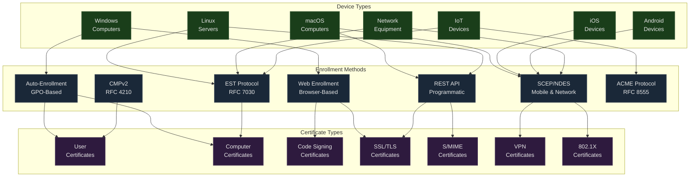
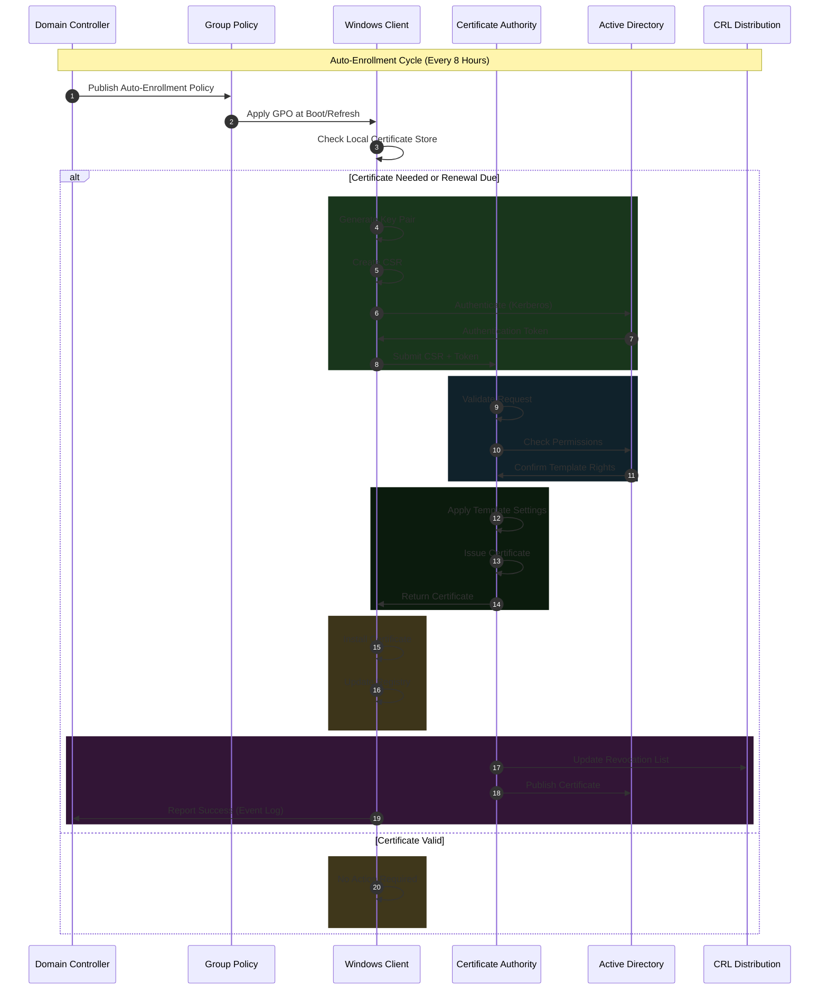
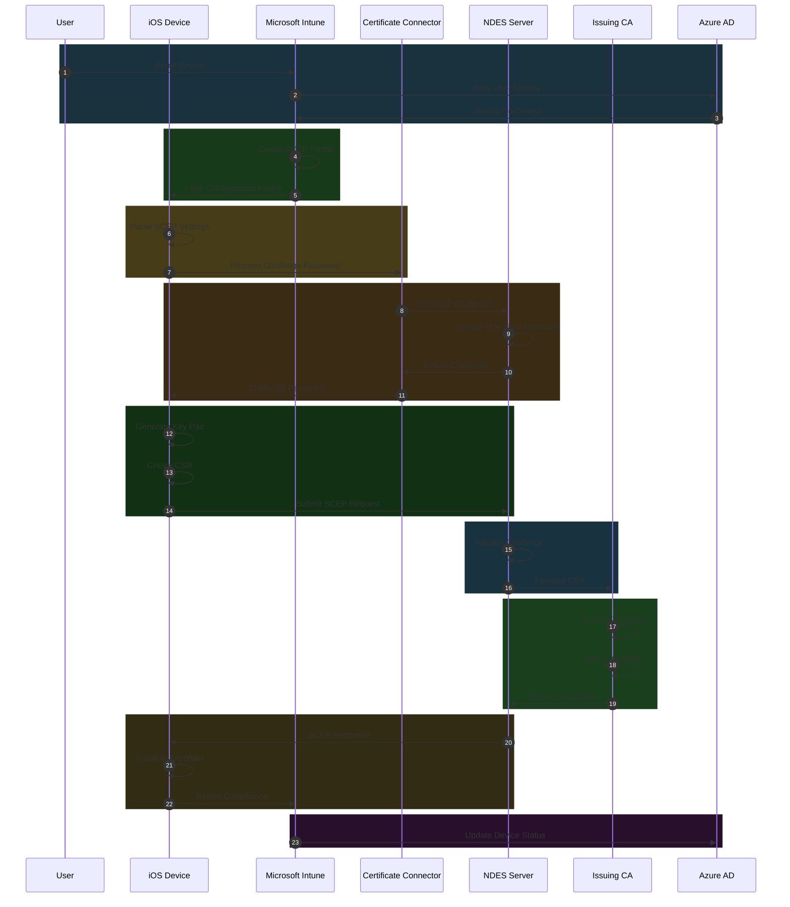
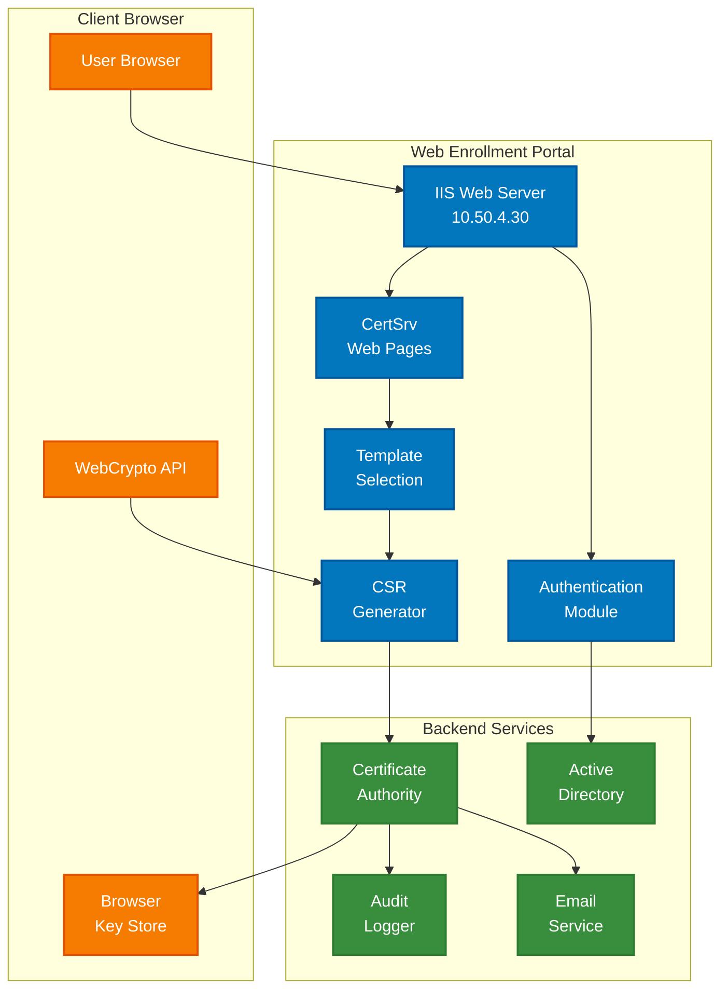
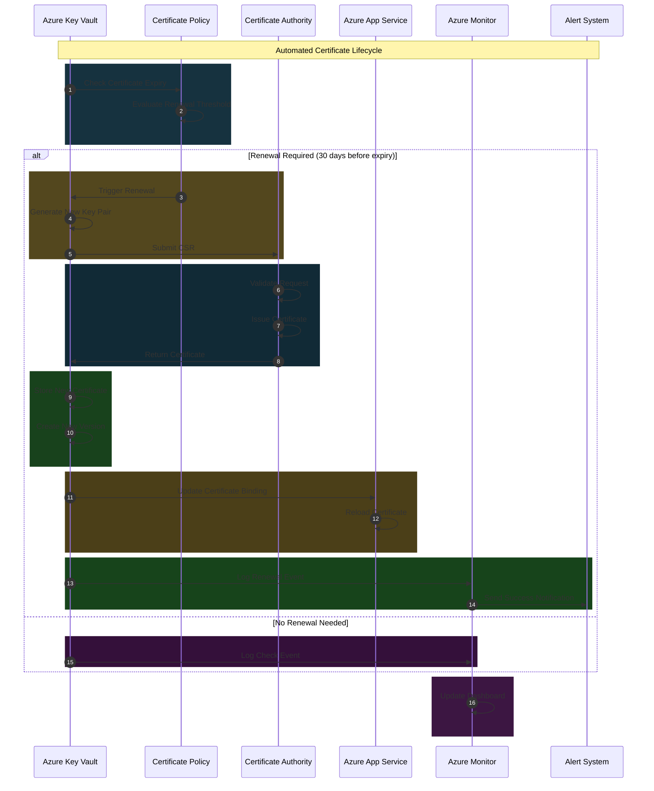

# PKI Modernization - Enterprise Certificate Enrollment Architecture

[← Previous: PKI Hierarchy](03-pki-hierarchy.md) | [Back to Index](00-index.md) | [Next: Phase 1 Foundation →](05-phase1-foundation.md)

## Executive Summary

This document provides comprehensive documentation of all certificate enrollment flows, methods, and protocols for the enterprise PKI infrastructure. It covers enrollment for various device types, platforms, and use cases, including automated and manual processes, with detailed technical specifications and troubleshooting guidance.

## Enrollment Architecture Overview

### Design Principles

- **Zero-Touch Automation**: Minimize manual intervention through auto-enrollment
- **Multi-Protocol Support**: SCEP, EST, CMPv2, Web Services, REST API
- **Platform Agnostic**: Support for Windows, Linux, macOS, iOS, Android, IoT
- **Security First**: Certificate-based authentication for enrollment where possible
- **High Availability**: Multiple enrollment endpoints with automatic failover
- **Audit Compliance**: Complete enrollment tracking and reporting

## Certificate Lifecycle Management

```mermaid
stateDiagram-v2
    %% Define dark mode friendly color styles
    classDef startStyle fill:#1a2838,stroke:#2a3848,stroke-width:2px,color:#e8e8e8
    classDef processStyle fill:#1a3e1a,stroke:#2a4e2a,stroke-width:2px,color:#e8e8e8
    classDef activeStyle fill:#3e3838,stroke:#4e3828,stroke-width:2px,color:#e8e8e8
    classDef cautionStyle fill:#4e3818,stroke:#5e4828,stroke-width:2px,color:#e8e8e8
    classDef errorStyle fill:#3e1818,stroke:#4e2828,stroke-width:2px,color:#e8e8e8
    classDef archiveStyle fill:#3e1a3e,stroke:#4e2a4e,stroke-width:2px,color:#e8e8e8

    [*] --> Planning: Certificate Requirement Identified

    Planning --> Request: Create Certificate Request
    state Request {
        [*] --> ValidateReq: Validate Requirements
        ValidateReq --> SelectTemplate: Choose Template
        SelectTemplate --> GenerateCSR: Generate CSR
        GenerateCSR --> [*]
    }

    Request --> Approval: Submit for Approval
    state Approval {
        [*] --> AutoApprove: Auto-Approval Check
        AutoApprove --> Approved: Criteria Met
        AutoApprove --> ManualReview: Requires Review
        ManualReview --> Approved: Manager Approves
        ManualReview --> Denied: Request Denied
        Denied --> [*]: End Process
        Approved --> [*]
    }

    Approved --> Issuance: Generate Certificate
    state Issuance {
        [*] --> ValidateCSR: Validate CSR
        ValidateCSR --> ApplyTemplate: Apply Template Rules
        ApplyTemplate --> SignCert: Sign Certificate
        SignCert --> PublishCert: Publish to Repository
        PublishCert --> [*]
    }

    Issuance --> Deployment: Deploy Certificate
    state Deployment {
        [*] --> PushToDevice: Push to End Device
        PushToDevice --> InstallCert: Install Certificate
        InstallCert --> BindToService: Bind to Service/App
        BindToService --> ValidateInstall: Validate Installation
        ValidateInstall --> [*]
    }

    Deployment --> Active: Certificate Active
    state Active {
        [*] --> InUse: Certificate in Use
        InUse --> Monitor: Continuous Monitoring
        Monitor --> RenewalCheck: Check Renewal Needed
        RenewalCheck --> AutoRenew: 30 Days Before Expiry
        AutoRenew --> Request: Auto-Generate New Request
        RenewalCheck --> ContinueUse: Still Valid
        ContinueUse --> Monitor: Continue Monitoring

        InUse --> SecurityEvent: Security Incident
        SecurityEvent --> Revoke: Immediate Revocation
        Monitor --> Compromise: Certificate Compromised
        Compromise --> Revoke: Emergency Revocation

        InUse --> ServiceChange: Service Decommissioned
        ServiceChange --> Revoke: Planned Revocation
    }

    state Revoke {
        [*] --> AddToCRL: Add to CRL
        AddToCRL --> PublishCRL: Publish Updated CRL
        PublishCRL --> UpdateOCSP: Update OCSP Responder
        UpdateOCSP --> NotifyClients: Notify Dependent Systems
        NotifyClients --> [*]
    }

    Active --> Expire: Natural Expiration
    state Expire {
        [*] --> GracePeriod: 30-day Grace Period
        GracePeriod --> Archive: Move to Archive
        Archive --> [*]
    }

    Revoke --> Archive: Certificate Revoked
    Expire --> Archive: Certificate Expired

    Archive --> [*]: End of Lifecycle

    %% Apply styles to states
    class Planning startStyle
    class Request,Issuance,Deployment processStyle
    class Active,Monitor,RenewalCheck activeStyle
    class AutoRenew,SecurityEvent,Compromise,ServiceChange cautionStyle
    class Revoke,Denied errorStyle
    class Archive,Expire archiveStyle

    note right of Planning : Templates define <br/>- Key usage<br/>- Validity period<br/>- Subject format<br/>- Extensions

    note right of Active : Monitoring includes <br/>- Expiry tracking<br/>- Usage analytics<br/>- Security events<br/>- Performance metrics

    note right of Deployment : Deployment methods <br/>- Auto-enrollment (GPO)<br/>- SCEP (Mobile)<br/>- API (Programmatic)<br/>- Web portal (Manual)

```




## Enrollment Method Decision Tree

```mermaid
flowchart TD
    START([Need Certificate]) --> DEVICE{Device Type?}

    DEVICE -->|Windows Domain| WINDOWS[Windows Computer]
    DEVICE -->|Mobile Device| MOBILE[iOS/Android/Mobile]
    DEVICE -->|Server/Service| SERVER[Server/Application]
    DEVICE -->|Network Equipment| NETWORK[Network Device]
    DEVICE -->|IoT Device| IOT[IoT/Embedded]
    DEVICE -->|Developer Workstation| DEV[Development]

    WINDOWS --> AUTOENROLL{Domain Joined?}
    AUTOENROLL -->|Yes| GPO[Use Auto-Enrollment<br/>via Group Policy<br/>✅ Zero-touch<br/>✅ Automatic renewal]
    AUTOENROLL -->|No| WEBWIN[Use Web Enrollment<br/>Manual process<br/>⚠️ Requires user action]

    MOBILE --> MGMT{MDM Managed?}
    MGMT -->|Yes - Intune| SCEPINTUNE[Use SCEP via Intune<br/>✅ Automated deployment<br/>✅ Compliance tracking]
    MGMT -->|Yes - Other MDM| SCEPOTHER[Use SCEP with MDM<br/>Configure SCEP profile<br/>⚠️ Manual setup required]
    MGMT -->|No| MANUAL[Manual Installation<br/>Export from web portal<br/>❌ Not recommended]

    SERVER --> USAGE{Certificate Usage?}
    USAGE -->|Web Server| SSL[SSL/TLS Certificate<br/>Use API or Web Enrollment<br/>Consider wildcard or SAN]
    USAGE -->|Service Account| SVCACCT[Service Account Cert<br/>Use Auto-enrollment<br/>Store in service account]
    USAGE -->|Application| APPINT[Application Integration<br/>Use REST API<br/>Programmatic management]

    NETWORK --> VENDOR{Network Vendor?}
    VENDOR -->|Cisco| CISCO[Cisco SCEP<br/>Use crypto pki trustpoint<br/>✅ Native support]
    VENDOR -->|Juniper| JUNIPER[Juniper SCEP<br/>Use security certificates<br/>✅ Native support]
    VENDOR -->|Other| OTHERNET[Generic SCEP<br/>Check vendor documentation<br/>⚠️ May need custom config]

    IOT --> CAPABILITY{Device Capabilities?}
    CAPABILITY -->|Full OS| ESTFULL[Use EST Protocol<br/>RFC 7030 compliant<br/>✅ Standards-based]
    CAPABILITY -->|Limited| ESTLIMITED[Use EST with<br/>pre-shared key<br/>⚠️ Less secure]
    CAPABILITY -->|Very Limited| PREINSTALL[Pre-installed Certificates<br/>Factory provisioning<br/>❌ Not scalable]

    DEV --> PURPOSE{Certificate Purpose?}
    PURPOSE -->|Code Signing| CODESIGN[Code Signing Certificate<br/>Use approval workflow<br/>🔒 High security]
    PURPOSE -->|Client Auth| CLIENTAUTH[Client Authentication<br/>Use smart card or<br/>software certificate]
    PURPOSE -->|Testing| TESTCERT[Test Certificates<br/>Use web portal or API<br/>Short validity period]

    %% Style the nodes with dark mode friendly colors
    classDef startStyle fill:#1a2838,stroke:#2a3848,stroke-width:2px,color:#e8e8e8
    classDef decisionStyle fill:#3e2818,stroke:#4e3828,stroke-width:2px,color:#e8e8e8
    classDef recommendedStyle fill:#1a3e1a,stroke:#2a4e2a,stroke-width:2px,color:#e8e8e8
    classDef cautionStyle fill:#4e3818,stroke:#5e4828,stroke-width:2px,color:#e8e8e8
    classDef notRecommendedStyle fill:#3e1818,stroke:#4e2828,stroke-width:2px,color:#e8e8e8

    class START startStyle
    class DEVICE,AUTOENROLL,MGMT,USAGE,VENDOR,CAPABILITY,PURPOSE decisionStyle
    class GPO,SCEPINTUNE,CISCO,JUNIPER,ESTFULL,CODESIGN recommendedStyle
    class WEBWIN,SCEPOTHER,OTHERNET,ESTLIMITED,CLIENTAUTH,TESTCERT cautionStyle
    class MANUAL,PREINSTALL notRecommendedStyle
```



## Enrollment Methods Overview



## Windows Auto-Enrollment Flow

### Detailed Auto-Enrollment Process



### Auto-Enrollment Configuration

```powershell
# Configure Auto-Enrollment GPO
$GPOName = "PKI-AutoEnrollment-Policy"

# Computer Configuration
Set-GPRegistryValue -Name $GPOName -Key "HKLM\SOFTWARE\Policies\Microsoft\Cryptography\AutoEnrollment" `
    -ValueName "AEPolicy" -Type DWord -Value 7
# Value 7 = Enroll certificates + Renew expired + Update pending + Remove revoked

Set-GPRegistryValue -Name $GPOName -Key "HKLM\SOFTWARE\Policies\Microsoft\Cryptography\AutoEnrollment" `
    -ValueName "OfflineExpirationPercent" -Type DWord -Value 10

Set-GPRegistryValue -Name $GPOName -Key "HKLM\SOFTWARE\Policies\Microsoft\Cryptography\AutoEnrollment" `
    -ValueName "OfflineExpirationStoreNames" -Type MultiString -Value @("MY","Root","CA")

# User Configuration
Set-GPRegistryValue -Name $GPOName -Key "HKCU\SOFTWARE\Policies\Microsoft\Cryptography\AutoEnrollment" `
    -ValueName "AEPolicy" -Type DWord -Value 7
```

### Template Configuration for Auto-Enrollment

| Template Setting | Value | Purpose |
|------------------|-------|---------|
| **Enroll permissions** | Domain Computers, Domain Users | Who can request |
| **Autoenroll permissions** | Domain Computers, Domain Users | Who can auto-enroll |
| **Subject Name** | Build from AD | CN from AD attributes |
| **Private Key** | Not exportable | Security requirement |
| **Key Usage** | Digital Signature, Key Encipherment | Standard usage |
| **Application Policies** | Client Authentication | 1.3.6.1.5.5.7.3.2 |
| **Validity Period** | 2 years | Balance security/convenience |
| **Renewal Period** | 6 weeks before expiry | 80% of validity |

## Mobile Device Enrollment (SCEP)

### iOS/iPadOS Enrollment via Intune



### Android Enterprise Enrollment

```yaml
Android_SCEP_Configuration:
  Profile_Type: Android Enterprise
  Deployment_Method: Managed Google Play

  Certificate_Profile:
    Name: Company-Android-WiFi
    Profile_Type: SCEP

  SCEP_Settings:
    Server_URL: https://ndes.company.com.au/certsrv/mscep/mscep.dll
    Server_Timeout: 30 seconds
    Retry_Count: 3
    Retry_Delay: 10 seconds

  Subject_Name:
    Format: CN={{AAD_DeviceId}},OU=Mobile,O=Company
    Include_Email: false

  Subject_Alternative_Names:
    - Type: User_Principal_Name
      Value: {{UserPrincipalName}}
    - Type: DNS
      Value: {{DeviceName}}.mobile.company.com.au

  Key_Settings:
    Size: 2048
    Storage: Hardware_Backed_Keystore
    Usage: Digital Signature, Key Encipherment

  Certificate_Settings:
    Validity: 2 years
    Purpose: WiFi Authentication
    Extended_Key_Usage: 1.3.6.1.5.5.7.3.2

  Hash_Algorithm: SHA-256

  Challenge_Password:
    Type: Dynamic_Per_Device
    Validity: 60 minutes
    Source: Intune Connector

  Renewal:
    Threshold: 80%
    Method: Automatic
    Notification: 30 days before expiry
```

### Network Device SCEP Enrollment

```python
#!/usr/bin/env python3
# cisco_scep_enrollment.py

import requests
import hashlib
import base64
from cryptography import x509
from cryptography.hazmat.primitives import hashes, serialization
from cryptography.hazmat.primitives.asymmetric import rsa

class SCEPClient:
    def __init__(self, scep_url, challenge_password):
        self.scep_url = scep_url
        self.challenge = challenge_password

    def get_ca_cert(self):
        """Retrieve CA certificate"""
        response = requests.get(
            f"{self.scep_url}?operation=GetCACert",
            headers={'Content-Type': 'application/x-pki-message'}
        )
        return x509.load_der_x509_certificate(response.content)

    def generate_csr(self, common_name, key_size=2048):
        """Generate key pair and CSR"""
        # Generate private key
        private_key = rsa.generate_private_key(
            public_exponent=65537,
            key_size=key_size
        )

        # Build CSR
        subject = x509.Name([
            x509.NameAttribute(x509.oid.NameOID.COMMON_NAME, common_name),
            x509.NameAttribute(x509.oid.NameOID.ORGANIZATION_NAME, "Company"),
            x509.NameAttribute(x509.oid.NameOID.COUNTRY_NAME, "AU")
        ])

        csr = x509.CertificateSigningRequestBuilder().subject_name(
            subject
        ).add_extension(
            x509.SubjectAlternativeName([
                x509.DNSName(common_name),
                x509.DNSName(f"{common_name}.company.com.au")
            ]),
            critical=False
        ).sign(private_key, hashes.SHA256())

        return private_key, csr

    def enroll_certificate(self, csr):
        """Submit SCEP enrollment request"""
        # Create PKCS#7 message
        pkcs7_data = self.create_pkcs7_request(csr)

        response = requests.post(
            f"{self.scep_url}?operation=PKIOperation",
            data=pkcs7_data,
            headers={
                'Content-Type': 'application/x-pki-message',
                'Content-Transfer-Encoding': 'base64'
            }
        )

        if response.status_code == 200:
            return self.parse_certificate_response(response.content)
        else:
            raise Exception(f"Enrollment failed: {response.status_code}")

# Cisco IOS Configuration
cisco_config = """
crypto pki trustpoint COMPANY-SCEP
 enrollment mode ra
 enrollment url http://ndes.company.com.au/certsrv/mscep/mscep.dll
 enrollment retry count 3
 enrollment retry period 1
 fqdn switch01.company.com.au
 subject-name CN=switch01.company.com.au,OU=Network,O=Company,C=AU
 revocation-check crl
 rsakeypair COMPANY-KEY 2048
 auto-enroll 80

crypto pki authenticate COMPANY-SCEP
crypto pki enroll COMPANY-SCEP
"""
```

## Web-Based Certificate Enrollment

### Web Enrollment Portal Architecture



### Advanced Web Enrollment Flow

```html
<!-- Custom Web Enrollment Portal -->
<!DOCTYPE html>
<html>
<head>
    <title>Company PKI Certificate Enrollment</title>
    <script src="https://cdnjs.cloudflare.com/ajax/libs/forge/0.10.0/forge.min.js"></script>
</head>
<body>
    <div id="enrollment-wizard">
        <h2>Certificate Enrollment Portal</h2>

        <!-- Step 1: Authentication -->
        <div id="step-auth" class="wizard-step">
            <h3>Step 1: Authentication</h3>
            <form id="auth-form">
                <input type="text" id="username" placeholder="Domain Username" required>
                <input type="password" id="password" placeholder="Password" required>
                <button type="submit">Authenticate</button>
            </form>
        </div>

        <!-- Step 2: Certificate Type -->
        <div id="step-type" class="wizard-step" style="display:none;">
            <h3>Step 2: Select Certificate Type</h3>
            <select id="cert-template">
                <option value="">Select Template...</option>
                <option value="WebServer">Web Server (SSL/TLS)</option>
                <option value="CodeSigning">Code Signing</option>
                <option value="EmailSigning">Email (S/MIME)</option>
                <option value="ClientAuth">Client Authentication</option>
            </select>
            <button onclick="loadTemplateDetails()">Next</button>
        </div>

        <!-- Step 3: Certificate Details -->
        <div id="step-details" class="wizard-step" style="display:none;">
            <h3>Step 3: Certificate Details</h3>
            <form id="cert-details">
                <input type="text" id="cn" placeholder="Common Name" required>
                <input type="text" id="san" placeholder="SAN (comma-separated)">
                <select id="keysize">
                    <option value="2048">2048-bit RSA</option>
                    <option value="3072">3072-bit RSA</option>
                    <option value="4096">4096-bit RSA</option>
                </select>
                <button type="button" onclick="generateCSR()">Generate CSR</button>
            </form>
        </div>

        <!-- Step 4: Submit Request -->
        <div id="step-submit" class="wizard-step" style="display:none;">
            <h3>Step 4: Submit Request</h3>
            <textarea id="csr-display" readonly></textarea>
            <button onclick="submitCertificateRequest()">Submit Request</button>
        </div>

        <!-- Step 5: Download Certificate -->
        <div id="step-download" class="wizard-step" style="display:none;">
            <h3>Step 5: Certificate Issued</h3>
            <p>Certificate Serial: <span id="serial"></span></p>
            <p>Valid Until: <span id="expiry"></span></p>
            <button onclick="downloadCertificate()">Download Certificate</button>
            <button onclick="downloadPFX()">Download PFX</button>
        </div>
    </div>

    <script>
        // WebCrypto API Certificate Generation
        async function generateCSR() {
            const cn = document.getElementById('cn').value;
            const keySize = parseInt(document.getElementById('keysize').value);

            // Generate key pair using WebCrypto API
            const keyPair = await window.crypto.subtle.generateKey(
                {
                    name: "RSASSA-PKCS1-v1_5",
                    modulusLength: keySize,
                    publicExponent: new Uint8Array([0x01, 0x00, 0x01]),
                    hash: {name: "SHA-256"}
                },
                true,
                ["sign", "verify"]
            );

            // Create CSR using forge
            const csr = forge.pki.createCertificationRequest();
            csr.publicKey = await exportPublicKey(keyPair.publicKey);
            csr.setSubject([
                {name: 'commonName', value: cn},
                {name: 'organizationName', value: 'Company'},
                {name: 'countryName', value: 'AU'}
            ]);

            // Add extensions
            csr.setAttributes([{
                name: 'extensionRequest',
                extensions: [{
                    name: 'subjectAltName',
                    altNames: getSANs()
                }]
            }]);

            // Sign CSR
            csr.sign(keyPair.privateKey, forge.md.sha256.create());

            // Display CSR
            const pem = forge.pki.certificationRequestToPem(csr);
            document.getElementById('csr-display').value = pem;

            // Store private key
            await storePrivateKey(keyPair.privateKey);

            showStep('step-submit');
        }

        async function submitCertificateRequest() {
            const csr = document.getElementById('csr-display').value;
            const template = document.getElementById('cert-template').value;

            const response = await fetch('/api/certificate/request', {
                method: 'POST',
                headers: {
                    'Content-Type': 'application/json',
                    'Authorization': 'Bearer ' + sessionToken
                },
                body: JSON.stringify({
                    csr: csr,
                    template: template,
                    attributes: getRequestAttributes()
                })
            });

            if (response.ok) {
                const result = await response.json();
                document.getElementById('serial').textContent = result.serialNumber;
                document.getElementById('expiry').textContent = result.validTo;
                certificateData = result.certificate;
                showStep('step-download');
            } else {
                alert('Certificate request failed: ' + await response.text());
            }
        }
    </script>
</body>
</html>
```

## REST API Certificate Enrollment

### API Architecture

```yaml
API_Endpoints:
  Base_URL: https://api-pki.company.com.au/v1

  Authentication:
    Type: OAuth 2.0
    Token_Endpoint: /auth/token
    Scopes:
      - certificate.request
      - certificate.renew
      - certificate.revoke
      - certificate.read

  Rate_Limiting:
    Requests_Per_Minute: 60
    Burst_Size: 10

  Endpoints:
    - Path: /certificates/request
      Method: POST
      Description: Submit new certificate request

    - Path: /certificates/{id}
      Method: GET
      Description: Retrieve certificate details

    - Path: /certificates/{id}/renew
      Method: POST
      Description: Renew existing certificate

    - Path: /certificates/{id}/revoke
      Method: POST
      Description: Revoke certificate

    - Path: /certificates/validate
      Method: POST
      Description: Validate certificate chain
```

### API Request Examples

```python
# Python API Client Example
import requests
import json
from cryptography import x509
from cryptography.x509.oid import NameOID
from cryptography.hazmat.primitives import hashes
from cryptography.hazmat.primitives.asymmetric import rsa
from cryptography.hazmat.primitives import serialization

class PKIAPIClient:
    def __init__(self, api_url, client_id, client_secret):
        self.api_url = api_url
        self.token = self.authenticate(client_id, client_secret)

    def authenticate(self, client_id, client_secret):
        """OAuth 2.0 authentication"""
        response = requests.post(
            f"{self.api_url}/auth/token",
            data={
                'grant_type': 'client_credentials',
                'client_id': client_id,
                'client_secret': client_secret,
                'scope': 'certificate.request certificate.read'
            }
        )
        return response.json()['access_token']

    def request_certificate(self, common_name, template='WebServer', sans=None):
        """Request new certificate"""
        # Generate key pair
        private_key = rsa.generate_private_key(
            public_exponent=65537,
            key_size=2048
        )

        # Build CSR
        subject = x509.Name([
            x509.NameAttribute(NameOID.COMMON_NAME, common_name),
            x509.NameAttribute(NameOID.ORGANIZATION_NAME, "Company"),
            x509.NameAttribute(NameOID.COUNTRY_NAME, "AU")
        ])

        builder = x509.CertificateSigningRequestBuilder()
        builder = builder.subject_name(subject)

        # Add SANs if provided
        if sans:
            san_list = [x509.DNSName(san) for san in sans]
            builder = builder.add_extension(
                x509.SubjectAlternativeName(san_list),
                critical=False
            )

        # Sign CSR
        csr = builder.sign(private_key, hashes.SHA256())

        # Submit request
        response = requests.post(
            f"{self.api_url}/certificates/request",
            headers={
                'Authorization': f'Bearer {self.token}',
                'Content-Type': 'application/json'
            },
            json={
                'csr': csr.public_bytes(serialization.Encoding.PEM).decode(),
                'template': template,
                'validity_days': 365,
                'attributes': {
                    'department': 'IT',
                    'environment': 'Production'
                }
            }
        )

        if response.status_code == 201:
            result = response.json()
            return {
                'certificate_id': result['id'],
                'certificate': result['certificate'],
                'chain': result['chain'],
                'private_key': private_key
            }
        else:
            raise Exception(f"Certificate request failed: {response.text}")

    def get_certificate(self, certificate_id):
        """Retrieve certificate details"""
        response = requests.get(
            f"{self.api_url}/certificates/{certificate_id}",
            headers={'Authorization': f'Bearer {self.token}'}
        )
        return response.json()

    def renew_certificate(self, certificate_id):
        """Renew existing certificate"""
        response = requests.post(
            f"{self.api_url}/certificates/{certificate_id}/renew",
            headers={'Authorization': f'Bearer {self.token}'}
        )
        return response.json()

    def revoke_certificate(self, certificate_id, reason='unspecified'):
        """Revoke certificate"""
        response = requests.post(
            f"{self.api_url}/certificates/{certificate_id}/revoke",
            headers={'Authorization': f'Bearer {self.token}'},
            json={'reason': reason}
        )
        return response.status_code == 200

# Usage example
client = PKIAPIClient(
    api_url='https://api-pki.company.com.au/v1',
    client_id='app-client-id',
    client_secret='app-client-secret'
)

# Request new certificate
result = client.request_certificate(
    common_name='app.company.com.au',
    template='WebServer',
    sans=['app.company.com.au', 'www.app.company.com.au']
)

print(f"Certificate ID: {result['certificate_id']}")
```

## EST Protocol Enrollment

### EST Implementation for IoT Devices

```c
// EST Client Implementation for IoT Devices
#include <stdio.h>
#include <stdlib.h>
#include <string.h>
#include <openssl/x509.h>
#include <openssl/pem.h>
#include <curl/curl.h>

typedef struct {
    char *server_url;
    char *username;
    char *password;
    char *client_cert;
    char *client_key;
} EST_Client;

// EST Simple Enrollment
int est_simple_enroll(EST_Client *client, const char *csr_pem, char **cert_out) {
    CURL *curl;
    CURLcode res;
    struct curl_slist *headers = NULL;

    curl = curl_easy_init();
    if (!curl) return -1;

    // Build EST URL
    char url[256];
    snprintf(url, sizeof(url), "%s/.well-known/est/simpleenroll", client->server_url);

    // Set headers
    headers = curl_slist_append(headers, "Content-Type: application/pkcs10");
    headers = curl_slist_append(headers, "Content-Transfer-Encoding: base64");

    // Configure CURL
    curl_easy_setopt(curl, CURLOPT_URL, url);
    curl_easy_setopt(curl, CURLOPT_HTTPHEADER, headers);
    curl_easy_setopt(curl, CURLOPT_POSTFIELDS, csr_pem);
    curl_easy_setopt(curl, CURLOPT_HTTPAUTH, CURLAUTH_BASIC);
    curl_easy_setopt(curl, CURLOPT_USERNAME, client->username);
    curl_easy_setopt(curl, CURLOPT_PASSWORD, client->password);

    // Use client certificate if available
    if (client->client_cert) {
        curl_easy_setopt(curl, CURLOPT_SSLCERT, client->client_cert);
        curl_easy_setopt(curl, CURLOPT_SSLKEY, client->client_key);
    }

    // Response handling
    curl_easy_setopt(curl, CURLOPT_WRITEFUNCTION, write_callback);
    curl_easy_setopt(curl, CURLOPT_WRITEDATA, cert_out);

    // Perform request
    res = curl_easy_perform(curl);

    // Cleanup
    curl_easy_cleanup(curl);
    curl_slist_free_all(headers);

    return (res == CURLE_OK) ? 0 : -1;
}

// EST Re-enrollment
int est_simple_reenroll(EST_Client *client, const char *old_cert,
                        const char *csr_pem, char **new_cert_out) {
    // Similar to simple_enroll but uses /simplereenroll endpoint
    // and includes old certificate for authentication
    char url[256];
    snprintf(url, sizeof(url), "%s/.well-known/est/simplereenroll", client->server_url);

    // Use old certificate for authentication
    // Implementation continues...
    return 0;
}

// EST CA Certificates Distribution
int est_get_cacerts(EST_Client *client, char **cacerts_out) {
    CURL *curl;
    char url[256];

    curl = curl_easy_init();
    snprintf(url, sizeof(url), "%s/.well-known/est/cacerts", client->server_url);

    curl_easy_setopt(curl, CURLOPT_URL, url);
    curl_easy_setopt(curl, CURLOPT_HTTPGET, 1L);
    curl_easy_setopt(curl, CURLOPT_WRITEFUNCTION, write_callback);
    curl_easy_setopt(curl, CURLOPT_WRITEDATA, cacerts_out);

    CURLcode res = curl_easy_perform(curl);
    curl_easy_cleanup(curl);

    return (res == CURLE_OK) ? 0 : -1;
}
```

### EST Server Configuration

```yaml
EST_Server_Configuration:
  Server: Cisco ISE or Custom EST Server
  URL: https://est.company.com.au:8443

  Authentication_Methods:
    - HTTP_Basic_Auth
    - Client_Certificate
    - Shared_Secret

  Endpoints:
    /cacerts:
      Description: Get CA certificates
      Authentication: Optional
      Response: PKCS#7 certificate chain

    /simpleenroll:
      Description: Initial enrollment
      Authentication: Required
      Request: PKCS#10 CSR
      Response: PKCS#7 certificate

    /simplereenroll:
      Description: Certificate renewal
      Authentication: Client certificate
      Request: PKCS#10 CSR
      Response: PKCS#7 certificate

    /serverkeygen:
      Description: Server-side key generation
      Authentication: Required
      Response: PKCS#12 with private key

  Certificate_Templates:
    IoT_Device:
      Validity: 1 year
      Key_Size: 2048
      Subject_Format: CN=iot-{{MAC}}.company.com.au

    Network_Device:
      Validity: 2 years
      Key_Size: 3072
      Subject_Format: CN={{FQDN}}
```

## Linux Certificate Enrollment

### Certbot/ACME Integration

```bash
#!/bin/bash
# Linux ACME Certificate Enrollment Script

# Configuration
ACME_SERVER="https://acme.company.com.au/directory"
CERT_PATH="/etc/pki/tls/certs"
KEY_PATH="/etc/pki/tls/private"
ACCOUNT_KEY="/etc/acme/account.key"

# Install certbot if not present
if ! command -v certbot &> /dev/null; then
    yum install -y certbot || apt-get install -y certbot
fi

# Register ACME account
certbot register \
    --server $ACME_SERVER \
    --agree-tos \
    --email admin@company.com.au \
    --no-eff-email

# Request certificate with DNS challenge
request_certificate() {
    local domain=$1
    local type=${2:-"webserver"}

    certbot certonly \
        --server $ACME_SERVER \
        --dns-route53 \
        --dns-route53-propagation-seconds 30 \
        -d $domain \
        -d www.$domain \
        --cert-name $domain \
        --key-type rsa \
        --rsa-key-size 2048 \
        --cert-path $CERT_PATH \
        --key-path $KEY_PATH \
        --preferred-challenges dns-01 \
        --non-interactive
}

# Automated renewal
setup_renewal() {
    cat > /etc/cron.d/certbot-renewal << EOF
# Certbot renewal job
0 2 * * * root certbot renew --quiet --no-self-upgrade --post-hook "systemctl reload nginx"
EOF

    # Systemd timer alternative
    cat > /etc/systemd/system/certbot-renewal.service << EOF
[Unit]
Description=Certbot Renewal
After=network-online.target
Wants=network-online.target

[Service]
Type=oneshot
ExecStart=/usr/bin/certbot renew --quiet --no-self-upgrade
ExecStartPost=/bin/systemctl reload nginx

[Install]
WantedBy=multi-user.target
EOF

    cat > /etc/systemd/system/certbot-renewal.timer << EOF
[Unit]
Description=Run certbot renewal twice daily

[Timer]
OnCalendar=*-*-* 00,12:00:00
RandomizedDelaySec=3600
Persistent=true

[Install]
WantedBy=timers.target
EOF

    systemctl daemon-reload
    systemctl enable --now certbot-renewal.timer
}

# OpenSSL manual enrollment
manual_enrollment() {
    local cn=$1
    local sans=$2

    # Generate private key
    openssl genrsa -out ${KEY_PATH}/${cn}.key 2048

    # Create config file
    cat > /tmp/${cn}.cnf << EOF
[req]
distinguished_name = req_distinguished_name
req_extensions = v3_req
prompt = no

[req_distinguished_name]
C = AU
ST = New South Wales
L = Sydney
O = Company
OU = IT Department
CN = ${cn}

[v3_req]
keyUsage = digitalSignature, keyEncipherment
extendedKeyUsage = serverAuth
subjectAltName = @alt_names

[alt_names]
DNS.1 = ${cn}
${sans}
EOF

    # Generate CSR
    openssl req -new \
        -key ${KEY_PATH}/${cn}.key \
        -out /tmp/${cn}.csr \
        -config /tmp/${cn}.cnf

    # Submit to CA (via curl)
    curl -X POST https://ca.company.com.au/api/request \
        -H "Content-Type: application/pkcs10" \
        -H "Authorization: Bearer ${API_TOKEN}" \
        --data-binary @/tmp/${cn}.csr \
        -o ${CERT_PATH}/${cn}.crt
}

# Main execution
case "$1" in
    request)
        request_certificate $2 $3
        ;;
    renew)
        certbot renew
        ;;
    setup)
        setup_renewal
        ;;
    manual)
        manual_enrollment $2 "$3"
        ;;
    *)
        echo "Usage: $0 {request|renew|setup|manual} [domain] [SANs]"
        exit 1
        ;;
esac
```

## Azure Services Certificate Automation

### Key Vault Certificate Lifecycle



### Azure Automation Scripts

```powershell
# Azure Key Vault Certificate Automation
# Manage-AzureKeyVaultCertificates.ps1

param(
    [Parameter(Mandatory=$true)]
    [string]$KeyVaultName,

    [Parameter(Mandatory=$true)]
    [string]$ResourceGroup,

    [Parameter(Mandatory=$false)]
    [int]$RenewalThresholdDays = 30
)

# Connect to Azure
Connect-AzAccount -Identity

# Function to create certificate policy
function New-CertificatePolicy {
    param(
        [string]$SubjectName,
        [string[]]$DnsNames,
        [int]$ValidityInMonths = 12
    )

    $policy = New-AzKeyVaultCertificatePolicy `
        -SubjectName "CN=$SubjectName, O=Company, C=AU" `
        -DnsNames $DnsNames `
        -IssuerName "Company-Issuing-CA" `
        -ValidityInMonths $ValidityInMonths `
        -RenewAtPercentageLifetime 80 `
        -KeyType RSA `
        -KeySize 2048 `
        -SecretContentType "application/x-pkcs12" `
        -ReuseKeyOnRenewal $false

    return $policy
}

# Function to request new certificate
function Request-NewCertificate {
    param(
        [string]$CertificateName,
        [string]$CommonName,
        [string[]]$SANs
    )

    $policy = New-CertificatePolicy -SubjectName $CommonName -DnsNames $SANs

    $cert = Add-AzKeyVaultCertificate `
        -VaultName $KeyVaultName `
        -Name $CertificateName `
        -CertificatePolicy $policy

    # Wait for certificate to be issued
    $operation = Get-AzKeyVaultCertificateOperation `
        -VaultName $KeyVaultName `
        -Name $CertificateName

    while ($operation.Status -eq "inProgress") {
        Start-Sleep -Seconds 10
        $operation = Get-AzKeyVaultCertificateOperation `
            -VaultName $KeyVaultName `
            -Name $CertificateName
    }

    if ($operation.Status -eq "completed") {
        Write-Host "Certificate $CertificateName issued successfully"
        return $cert
    } else {
        throw "Certificate issuance failed: $($operation.ErrorMessage)"
    }
}

# Function to check and renew certificates
function Check-CertificateRenewal {
    $certificates = Get-AzKeyVaultCertificate -VaultName $KeyVaultName

    foreach ($cert in $certificates) {
        $certDetails = Get-AzKeyVaultCertificate `
            -VaultName $KeyVaultName `
            -Name $cert.Name `
            -IncludeVersions

        $latestVersion = $certDetails | Sort-Object Created -Descending | Select-Object -First 1
        $expiryDate = $latestVersion.Attributes.Expires
        $daysUntilExpiry = ($expiryDate - (Get-Date)).Days

        if ($daysUntilExpiry -le $RenewalThresholdDays) {
            Write-Host "Certificate $($cert.Name) expires in $daysUntilExpiry days. Renewing..."

            # Trigger renewal
            $renewalOperation = Add-AzKeyVaultCertificate `
                -VaultName $KeyVaultName `
                -Name $cert.Name `
                -RenewCertificate

            # Log renewal
            $logEntry = @{
                Timestamp = Get-Date
                Certificate = $cert.Name
                Action = "Renewal Initiated"
                DaysUntilExpiry = $daysUntilExpiry
                OperationId = $renewalOperation.Id
            }

            Write-Output $logEntry | ConvertTo-Json
        }
    }
}

# Function to bind certificate to App Service
function Update-AppServiceCertificate {
    param(
        [string]$AppServiceName,
        [string]$CertificateName
    )

    # Get certificate from Key Vault
    $certificate = Get-AzKeyVaultCertificate `
        -VaultName $KeyVaultName `
        -Name $CertificateName

    # Import to App Service
    $appServiceCert = New-AzWebAppSSLBinding `
        -ResourceGroupName $ResourceGroup `
        -WebAppName $AppServiceName `
        -CertificateFilePath $certificate.SecretId `
        -CertificatePassword $null `
        -SslState "SniEnabled"

    Write-Host "Certificate bound to App Service $AppServiceName"
}

# Main execution
try {
    # Check for certificates needing renewal
    Check-CertificateRenewal

    # Example: Request new certificate
    # Request-NewCertificate -CertificateName "webapp-cert" `
    #     -CommonName "webapp.company.com.au" `
    #     -SANs @("webapp.company.com.au", "www.webapp.company.com.au")

    # Example: Update App Service binding
    # Update-AppServiceCertificate -AppServiceName "company-webapp" `
    #     -CertificateName "webapp-cert"

} catch {
    Write-Error "Certificate automation failed: $_"
    throw
}
```

## Certificate Enrollment Monitoring

### Enrollment Metrics Dashboard

```yaml
Monitoring_Configuration:
  Dashboards:
    Enrollment_Overview:
      Widgets:
        - Type: Counter
          Metric: Total Enrollments Today
          Query: COUNT(*) WHERE timestamp > NOW-24h

        - Type: Gauge
          Metric: Success Rate
          Query: (SUCCESS/TOTAL)*100 WHERE timestamp > NOW-1h

        - Type: Line Chart
          Metric: Enrollments Over Time
          Query: COUNT(*) GROUP BY hour

        - Type: Pie Chart
          Metric: Enrollment by Method
          Query: COUNT(*) GROUP BY enrollment_method

    Failure_Analysis:
      Widgets:
        - Type: Table
          Metric: Failed Enrollments
          Columns: [Timestamp, User, Template, Error]

        - Type: Bar Chart
          Metric: Failure Reasons
          Query: COUNT(*) GROUP BY error_code

        - Type: Heat Map
          Metric: Failures by Hour
          Query: COUNT(*) WHERE status='FAILED' GROUP BY hour, day

  Alerts:
    High_Failure_Rate:
      Condition: failure_rate > 5%
      Window: 5 minutes
      Action: Email PKI Team

    Enrollment_Spike:
      Condition: enrollment_count > 1000
      Window: 1 hour
      Action: Scale infrastructure

    Template_Unavailable:
      Condition: template_error_count > 10
      Window: 5 minutes
      Action: Page on-call engineer
```

## Troubleshooting Guide

### Common Enrollment Issues

| Issue | Symptoms | Diagnosis | Resolution |
|-------|----------|-----------|------------|
| **Auto-enrollment failure** | Event 13: Auto-enrollment failed | Check Event Viewer ID 13 | Verify template permissions, CA connectivity |
| **SCEP challenge expired** | "Invalid or expired challenge" | Challenge valid for 60 min | Generate new challenge password |
| **CSR validation error** | "Invalid certificate request" | Malformed CSR | Verify key size, subject format |
| **Template not available** | "No templates found" | Template not published | Publish template to CA, check permissions |
| **Network timeout** | Connection timeout errors | Firewall/network issue | Verify ports 443, 135, 445 open |
| **Duplicate certificate** | "Certificate already exists" | Previous cert not cleaned | Revoke old cert, clear cache |
| **Key storage error** | "Cannot store private key" | TPM/HSM issue | Check TPM status, key storage provider |
| **Policy violation** | "Request denied by policy" | Policy constraints | Review certificate policy module |

### Diagnostic Commands

```powershell
# Windows Diagnostics
# Check auto-enrollment status
certutil -pulse

# View enrollment events
Get-WinEvent -LogName Application | Where {$_.Id -in @(19,20,21)}

# Test CA connectivity
certutil -ping -config "CA01.company.com.au\Company-Issuing-CA"

# View certificate templates
certutil -CATemplates

# Check certificate cache
certutil -store -user My
certutil -store -machine My

# Linux Diagnostics
# Check certificate enrollment
openssl s_client -connect ca.company.com.au:443 -showcerts

# Test SCEP enrollment
curl -v https://ndes.company.com.au/certsrv/mscep/mscep.dll

# View certificate details
openssl x509 -in cert.pem -text -noout

# Verify certificate chain
openssl verify -CAfile ca-chain.pem cert.pem
```

## Appendices

### A. Enrollment Protocol Comparison

| Protocol | Use Case | Pros | Cons | Platform Support |
|----------|----------|------|------|------------------|
| **Auto-Enrollment** | Domain-joined Windows | Zero-touch, GPO-managed | Windows only | Windows |
| **SCEP** | Mobile devices, network | Wide support, simple | Limited features | iOS, Android, Network |
| **EST** | IoT, network devices | RFC standard, secure | Complex setup | Linux, IoT, Network |
| **Web Enrollment** | Manual requests | User-friendly | Manual process | Any browser |
| **REST API** | Automation, DevOps | Flexible, programmable | Custom development | Any |
| **CMPv2** | Complex scenarios | Full-featured | Very complex | Limited |
| **ACME** | Web servers | Automated, standard | Limited cert types | Linux, Windows |

### B. Certificate Template Matrix

[Detailed template configurations in separate document]

### C. Enrollment Security Best Practices

1. **Authentication Requirements**
   - Multi-factor for high-value certificates
   - Certificate-based for re-enrollment
   - Domain authentication minimum

2. **Authorization Controls**
   - Template-based permissions
   - Manager approval for code signing
   - Attribute-based access control

3. **Audit Requirements**
   - All enrollments logged
   - Failed attempts tracked
   - Regular audit reviews

---

**Document Control**
- Version: 1.0
- Last Updated: February 2025
- Next Review: Quarterly
- Owner: PKI Operations Team
- Classification: Confidential

---
[← Previous: PKI Hierarchy](03-pki-hierarchy.md) | [Back to Index](00-index.md) | [Next: Phase 1 Foundation →](05-phase1-foundation.md)
