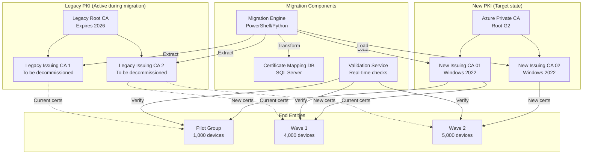

# PKI Modernization - Phase 4: Migration Strategy & Execution

[← Previous: Phase 3 Services Integration](07-phase3-services-integration.md) | [Back to Index](00-index.md) | [Next: Phase 5 Cutover →](09-phase5-cutover.md)

## Executive Summary

Phase 4 executes the migration from the legacy PKI infrastructure to the new Azure-based PKI system. This phase implements a carefully orchestrated migration strategy across three waves: Pilot (10%), Production Wave 1 (40%), and Production Wave 2 (50%), ensuring zero downtime and maintaining business continuity throughout the transition.

## Phase 4 Overview

### Objectives
- Execute pilot migration with 10% of environment
- Validate migration procedures and rollback capabilities
- Complete Production Wave 1 (40% of systems)
- Complete Production Wave 2 (remaining 50%)
- Maintain dual PKI operations during transition
- Ensure zero service disruption
- Validate all migrated certificates

### Success Criteria
- ✅ 100% of certificates successfully migrated
- ✅ Zero unplanned downtime during migration
- ✅ All applications maintain connectivity
- ✅ Rollback procedures tested and validated
- ✅ Certificate validation rate >99.9%
- ✅ User impact incidents <5 per 1000 devices
- ✅ Complete audit trail of all migrations

### Timeline
**Duration**: 4 weeks (March 17 - April 11, 2025)
**Resources Required**: 6.5 FTE
**Budget**: $100,000 (Migration services and overtime)

## Migration Architecture

### Dual PKI Operation Model



## Week 7-8: Pilot Migration

### Pilot Group Selection

```powershell
# Select-PilotGroup.ps1
# Identifies and prepares pilot migration group

param(
    [int]$PilotSize = 1000,
    [string]$OutputPath = "C:\Migration\Pilot"
)

# Connect to AD and SCCM
Import-Module ActiveDirectory
Import-Module "$env:SMS_ADMIN_UI_PATH\..\ConfigurationManager.psd1"

# Define pilot selection criteria
$pilotCriteria = @{
    # IT Department (tech-savvy users)
    ITDepartment = @{
        OU = "OU=IT,OU=Users,DC=company,DC=local"
        Percentage = 50  # 500 users
        Priority = 1
    }
    
    # Volunteers from other departments
    Volunteers = @{
        Group = "PKI-Pilot-Volunteers"
        Percentage = 20  # 200 users
        Priority = 2
    }
    
    # Representative sample from each department
    RandomSample = @{
        Departments = @("Sales", "Finance", "HR", "Operations")
        Percentage = 30  # 300 users
        Priority = 3
    }
}

# Get current certificate inventory
function Get-CertificateInventory {
    param([string]$ComputerName)
    
    $inventory = Invoke-Command -ComputerName $ComputerName -ScriptBlock {
        $certs = @()
        
        # Machine certificates
        $machineCerts = Get-ChildItem Cert:\LocalMachine\My
        foreach ($cert in $machineCerts) {
            $certs += @{
                Store = "LocalMachine\My"
                Subject = $cert.Subject
                Issuer = $cert.Issuer
                Thumbprint = $cert.Thumbprint
                SerialNumber = $cert.SerialNumber
                NotBefore = $cert.NotBefore
                NotAfter = $cert.NotAfter
                Template = ($cert.Extensions | Where-Object {$_.Oid.Value -eq "1.3.6.1.4.1.311.21.7"}).Format(0)
                Type = "Machine"
            }
        }
        
        # User certificates
        $userCerts = Get-ChildItem Cert:\CurrentUser\My -ErrorAction SilentlyContinue
        foreach ($cert in $userCerts) {
            $certs += @{
                Store = "CurrentUser\My"
                Subject = $cert.Subject
                Issuer = $cert.Issuer
                Thumbprint = $cert.Thumbprint
                SerialNumber = $cert.SerialNumber
                NotBefore = $cert.NotBefore
                NotAfter = $cert.NotAfter
                Template = ($cert.Extensions | Where-Object {$_.Oid.Value -eq "1.3.6.1.4.1.311.21.7"}).Format(0)
                Type = "User"
            }
        }
        
        return $certs
    }
    
    return $inventory
}

# Select pilot devices
$pilotDevices = @()

# IT Department selection
$itComputers = Get-ADComputer -Filter * -SearchBase $pilotCriteria.ITDepartment.OU |
    Select-Object -First 500

foreach ($computer in $itComputers) {
    $pilotDevices += @{
        ComputerName = $computer.Name
        DN = $computer.DistinguishedName
        Group = "IT Department"
        Wave = "Pilot"
        CurrentCertificates = Get-CertificateInventory -ComputerName $computer.Name
    }
}

# Volunteer selection
$volunteers = Get-ADGroupMember -Identity $pilotCriteria.Volunteers.Group |
    Where-Object {$_.objectClass -eq "computer"} |
    Select-Object -First 200

foreach ($computer in $volunteers) {
    $pilotDevices += @{
        ComputerName = $computer.Name
        DN = $computer.DistinguishedName
        Group = "Volunteers"
        Wave = "Pilot"
        CurrentCertificates = Get-CertificateInventory -ComputerName $computer.Name
    }
}

# Random sample selection
foreach ($dept in $pilotCriteria.RandomSample.Departments) {
    $deptComputers = Get-ADComputer -Filter * -SearchBase "OU=$dept,OU=Computers,DC=company,DC=local" |
        Get-Random -Count 75
    
    foreach ($computer in $deptComputers) {
        $pilotDevices += @{
            ComputerName = $computer.Name
            DN = $computer.DistinguishedName
            Group = $dept
            Wave = "Pilot"
            CurrentCertificates = Get-CertificateInventory -ComputerName $computer.Name
        }
    }
}

# Export pilot group
$pilotDevices | Export-Csv -Path "$OutputPath\PilotGroup.csv" -NoTypeInformation

# Create pilot collection in SCCM
$collectionName = "PKI Migration - Pilot Group"
New-CMDeviceCollection -Name $collectionName -LimitingCollectionName "All Systems"

foreach ($device in $pilotDevices) {
    Add-CMDeviceCollectionDirectMembershipRule `
        -CollectionName $collectionName `
        -ResourceId (Get-CMDevice -Name $device.ComputerName).ResourceID
}

Write-Host "Pilot group selected: $($pilotDevices.Count) devices" -ForegroundColor Green
```

### Pilot Migration Execution

```powershell
# Execute-PilotMigration.ps1
# Executes pilot migration with comprehensive logging and validation

param(
    [string]$PilotGroupFile = "C:\Migration\Pilot\PilotGroup.csv",
    [int]$BatchSize = 50,
    [int]$DelayBetweenBatches = 300  # 5 minutes
)

# Import pilot group
$pilotDevices = Import-Csv $PilotGroupFile

# Initialize migration tracking database
$migrationDb = @{
    Server = "SQL-PKI-DB"
    Database = "PKI_Migration"
    Table = "MigrationTracking"
}

# Create migration tracking table
Invoke-SqlCmd -ServerInstance $migrationDb.Server -Query @"
IF NOT EXISTS (SELECT * FROM sys.databases WHERE name = 'PKI_Migration')
    CREATE DATABASE PKI_Migration;
GO

USE PKI_Migration;
GO

IF NOT EXISTS (SELECT * FROM sys.tables WHERE name = 'MigrationTracking')
CREATE TABLE MigrationTracking (
    MigrationId UNIQUEIDENTIFIER PRIMARY KEY DEFAULT NEWID(),
    DeviceName NVARCHAR(100),
    Wave NVARCHAR(20),
    StartTime DATETIME2,
    EndTime DATETIME2,
    Status NVARCHAR(20),
    OldCertThumbprint NVARCHAR(100),
    NewCertThumbprint NVARCHAR(100),
    ErrorMessage NVARCHAR(MAX),
    RollbackRequired BIT DEFAULT 0,
    ValidationPassed BIT,
    INDEX IX_DeviceName (DeviceName),
    INDEX IX_Status (Status),
    INDEX IX_Wave (Wave)
);
"@

# Migration functions
function Start-CertificateMigration {
    param(
        [string]$ComputerName,
        [string]$Wave
    )
    
    $migrationResult = @{
        DeviceName = $ComputerName
        Wave = $Wave
        StartTime = Get-Date
        Status = "InProgress"
        Success = $false
    }
    
    try {
        Write-Host "Starting migration for $ComputerName" -ForegroundColor Yellow
        
        # Step 1: Backup current certificates
        Write-Host "  Backing up current certificates..." -ForegroundColor Gray
        $backupPath = "\\FileServer\PKI-Backup\$Wave\$ComputerName"
        New-Item -ItemType Directory -Path $backupPath -Force | Out-Null
        
        Invoke-Command -ComputerName $ComputerName -ScriptBlock {
            param($path)
            
            # Export all certificates
            $certs = Get-ChildItem Cert:\LocalMachine\My
            foreach ($cert in $certs) {
                $exportPath = "$path\$($cert.Thumbprint).pfx"
                $password = ConvertTo-SecureString -String "TempP@ss123" -Force -AsPlainText
                Export-PfxCertificate -Cert $cert -FilePath $exportPath -Password $password
            }
        } -ArgumentList $backupPath
        
        # Step 2: Request new certificates
        Write-Host "  Requesting new certificates..." -ForegroundColor Gray
        $newCerts = @()
        
        # Computer authentication certificate
        $computerCert = Request-NewCertificate `
            -ComputerName $ComputerName `
            -Template "Company-Computer-Authentication" `
            -CA "PKI-ICA-01.company.local\Company Issuing CA 01"
        
        $newCerts += $computerCert
        
        # Additional certificates based on role
        $additionalTemplates = Get-RequiredTemplates -ComputerName $ComputerName
        foreach ($template in $additionalTemplates) {
            $cert = Request-NewCertificate `
                -ComputerName $ComputerName `
                -Template $template `
                -CA "PKI-ICA-01.company.local\Company Issuing CA 01"
            
            $newCerts += $cert
        }
        
        # Step 3: Install new certificates
        Write-Host "  Installing new certificates..." -ForegroundColor Gray
        foreach ($cert in $newCerts) {
            Install-Certificate -ComputerName $ComputerName -Certificate $cert
        }
        
        # Step 4: Update trust stores
        Write-Host "  Updating trust stores..." -ForegroundColor Gray
        Invoke-Command -ComputerName $ComputerName -ScriptBlock {
            # Import new root CA
            $rootCert = "\\FileServer\PKI\Certificates\RootCA-G2.crt"
            Import-Certificate -FilePath $rootCert -CertStoreLocation Cert:\LocalMachine\Root
            
            # Import intermediate CAs
            $intermediateCerts = @(
                "\\FileServer\PKI\Certificates\IssuingCA01.crt",
                "\\FileServer\PKI\Certificates\IssuingCA02.crt"
            )
            
            foreach ($certPath in $intermediateCerts) {
                Import-Certificate -FilePath $certPath -CertStoreLocation Cert:\LocalMachine\CA
            }
        }
        
        # Step 5: Validate migration
        Write-Host "  Validating migration..." -ForegroundColor Gray
        $validation = Test-CertificateMigration -ComputerName $ComputerName
        
        if ($validation.Success) {
            # Step 6: Remove old certificates (mark for removal, don't delete yet)
            Write-Host "  Marking old certificates for removal..." -ForegroundColor Gray
            Mark-OldCertificatesForRemoval -ComputerName $ComputerName
            
            $migrationResult.Status = "Completed"
            $migrationResult.Success = $true
            $migrationResult.NewCertThumbprint = $computerCert.Thumbprint
            $migrationResult.ValidationPassed = $true
            
            Write-Host "Migration completed for $ComputerName" -ForegroundColor Green
        } else {
            throw "Validation failed: $($validation.Error)"
        }
        
    } catch {
        Write-Host "Migration failed for $ComputerName : $_" -ForegroundColor Red
        $migrationResult.Status = "Failed"
        $migrationResult.ErrorMessage = $_.Exception.Message
        
        # Attempt rollback
        if (Test-Path $backupPath) {
            Write-Host "  Attempting rollback..." -ForegroundColor Yellow
            Start-MigrationRollback -ComputerName $ComputerName -BackupPath $backupPath
            $migrationResult.RollbackRequired = $true
        }
    } finally {
        $migrationResult.EndTime = Get-Date
        
        # Log to database
        Log-MigrationResult -Result $migrationResult
    }
    
    return $migrationResult
}

function Test-CertificateMigration {
    param([string]$ComputerName)
    
    $tests = @()
    
    # Test 1: New certificates present
    $newCerts = Invoke-Command -ComputerName $ComputerName -ScriptBlock {
        Get-ChildItem Cert:\LocalMachine\My | 
        Where-Object {$_.Issuer -like "*Company Issuing CA 0*"}
    }
    
    $tests += @{
        Test = "New Certificates Present"
        Passed = ($newCerts.Count -gt 0)
    }
    
    # Test 2: Certificate chain validation
    foreach ($cert in $newCerts) {
        $chainValid = Invoke-Command -ComputerName $ComputerName -ScriptBlock {
            param($thumbprint)
            $cert = Get-ChildItem Cert:\LocalMachine\My | Where-Object {$_.Thumbprint -eq $thumbprint}
            $chain = New-Object System.Security.Cryptography.X509Certificates.X509Chain
            $chain.Build($cert)
        } -ArgumentList $cert.Thumbprint
        
        $tests += @{
            Test = "Chain Validation - $($cert.Subject)"
            Passed = $chainValid
        }
    }
    
    # Test 3: Service connectivity
    $services = @("RDP", "SMB", "WinRM")
    foreach ($service in $services) {
        $connected = Test-ServiceConnectivity -ComputerName $ComputerName -Service $service
        $tests += @{
            Test = "$service Connectivity"
            Passed = $connected
        }
    }
    
    # Test 4: Application functionality
    $apps = Get-CriticalApplications -ComputerName $ComputerName
    foreach ($app in $apps) {
        $working = Test-ApplicationFunctionality -ComputerName $ComputerName -Application $app
        $tests += @{
            Test = "$app Functionality"
            Passed = $working
        }
    }
    
    $allPassed = ($tests | Where-Object {-not $_.Passed}).Count -eq 0
    
    return @{
        Success = $allPassed
        Tests = $tests
        Error = if (-not $allPassed) {
            "Failed tests: " + (($tests | Where-Object {-not $_.Passed}).Test -join ", ")
        } else { $null }
    }
}

function Start-MigrationRollback {
    param(
        [string]$ComputerName,
        [string]$BackupPath
    )
    
    Write-Host "Performing rollback for $ComputerName" -ForegroundColor Yellow
    
    try {
        # Remove new certificates
        Invoke-Command -ComputerName $ComputerName -ScriptBlock {
            Get-ChildItem Cert:\LocalMachine\My | 
            Where-Object {$_.Issuer -like "*Company Issuing CA 0*"} |
            Remove-Item -Force
        }
        
        # Restore old certificates
        $backupFiles = Get-ChildItem -Path $BackupPath -Filter "*.pfx"
        foreach ($file in $backupFiles) {
            Invoke-Command -ComputerName $ComputerName -ScriptBlock {
                param($pfxPath)
                $password = ConvertTo-SecureString -String "TempP@ss123" -Force -AsPlainText
                Import-PfxCertificate -FilePath $pfxPath -CertStoreLocation Cert:\LocalMachine\My -Password $password
            } -ArgumentList $file.FullName
        }
        
        Write-Host "Rollback completed for $ComputerName" -ForegroundColor Green
        return $true
        
    } catch {
        Write-Host "Rollback failed for $ComputerName : $_" -ForegroundColor Red
        return $false
    }
}

# Main execution
$totalDevices = $pilotDevices.Count
$batches = [Math]::Ceiling($totalDevices / $BatchSize)

Write-Host "Starting Pilot Migration" -ForegroundColor Cyan
Write-Host "Total devices: $totalDevices" -ForegroundColor Gray
Write-Host "Batch size: $BatchSize" -ForegroundColor Gray
Write-Host "Number of batches: $batches" -ForegroundColor Gray

$results = @()
$batchNumber = 1

for ($i = 0; $i -lt $totalDevices; $i += $BatchSize) {
    $batch = $pilotDevices[$i..[Math]::Min($i + $BatchSize - 1, $totalDevices - 1)]
    
    Write-Host "`nProcessing Batch $batchNumber of $batches" -ForegroundColor Cyan
    
    # Process batch in parallel
    $jobs = @()
    foreach ($device in $batch) {
        $jobs += Start-Job -ScriptBlock {
            param($computerName, $wave)
            . "C:\Migration\Scripts\MigrationFunctions.ps1"
            Start-CertificateMigration -ComputerName $computerName -Wave $wave
        } -ArgumentList $device.ComputerName, "Pilot"
    }
    
    # Wait for batch to complete
    $jobs | Wait-Job -Timeout 1800  # 30 minute timeout
    
    # Collect results
    foreach ($job in $jobs) {
        if ($job.State -eq "Completed") {
            $results += Receive-Job -Job $job
        } else {
            Write-Host "Job timeout for device" -ForegroundColor Red
            Stop-Job -Job $job
        }
        Remove-Job -Job $job
    }
    
    # Validation checkpoint
    $batchSuccess = ($results | Where-Object {$_.Status -eq "Completed"}).Count
    $batchFailed = ($results | Where-Object {$_.Status -eq "Failed"}).Count
    
    Write-Host "Batch $batchNumber Results: Success=$batchSuccess, Failed=$batchFailed" -ForegroundColor Yellow
    
    # Check failure threshold
    if ($batchFailed -gt ($batch.Count * 0.1)) {  # >10% failure rate
        Write-Host "High failure rate detected. Pausing migration for investigation." -ForegroundColor Red
        Send-AlertEmail -Subject "Pilot Migration Paused" -Body "Batch $batchNumber exceeded failure threshold"
        break
    }
    
    # Delay before next batch
    if ($i + $BatchSize -lt $totalDevices) {
        Write-Host "Waiting $($DelayBetweenBatches/60) minutes before next batch..." -ForegroundColor Gray
        Start-Sleep -Seconds $DelayBetweenBatches
    }
    
    $batchNumber++
}

# Generate pilot report
$report = @{
    TotalDevices = $totalDevices
    Successful = ($results | Where-Object {$_.Status -eq "Completed"}).Count
    Failed = ($results | Where-Object {$_.Status -eq "Failed"}).Count
    RollbackRequired = ($results | Where-Object {$_.RollbackRequired -eq $true}).Count
    SuccessRate = [Math]::Round((($results | Where-Object {$_.Status -eq "Completed"}).Count / $totalDevices) * 100, 2)
}

Write-Host "`nPilot Migration Summary" -ForegroundColor Cyan
Write-Host "Total: $($report.TotalDevices)" -ForegroundColor Gray
Write-Host "Successful: $($report.Successful)" -ForegroundColor Green
Write-Host "Failed: $($report.Failed)" -ForegroundColor Red
Write-Host "Success Rate: $($report.SuccessRate)%" -ForegroundColor Yellow

# Export detailed results
$results | Export-Csv -Path "C:\Migration\Pilot\PilotResults-$(Get-Date -Format 'yyyyMMdd-HHmmss').csv" -NoTypeInformation
```

### Pilot Validation and Monitoring

```powershell
# Monitor-PilotMigration.ps1
# Real-time monitoring and validation of pilot migration

param(
    [string]$MonitoringDuration = "24:00:00"  # 24 hours
)

$endTime = (Get-Date).Add([TimeSpan]::Parse($MonitoringDuration))

# Initialize monitoring metrics
$metrics = @{
    CertificateErrors = @()
    ConnectivityIssues = @()
    PerformanceMetrics = @()
    UserComplaints = @()
}

# Start monitoring loop
while ((Get-Date) -lt $endTime) {
    Clear-Host
    Write-Host "=== Pilot Migration Monitoring Dashboard ===" -ForegroundColor Cyan
    Write-Host "Current Time: $(Get-Date -Format 'yyyy-MM-dd HH:mm:ss')" -ForegroundColor Gray
    Write-Host "Monitoring Until: $($endTime.ToString('yyyy-MM-dd HH:mm:ss'))" -ForegroundColor Gray
    Write-Host ""
    
    # Query migration status from database
    $migrationStatus = Invoke-SqlCmd -ServerInstance "SQL-PKI-DB" -Database "PKI_Migration" -Query @"
        SELECT 
            Status,
            COUNT(*) as Count
        FROM MigrationTracking
        WHERE Wave = 'Pilot'
        GROUP BY Status
"@
    
    Write-Host "Migration Status:" -ForegroundColor Yellow
    foreach ($status in $migrationStatus) {
        $color = switch ($status.Status) {
            "Completed" { "Green" }
            "InProgress" { "Yellow" }
            "Failed" { "Red" }
            default { "Gray" }
        }
        Write-Host "  $($status.Status): $($status.Count)" -ForegroundColor $color
    }
    
    # Check certificate validation
    Write-Host "`nCertificate Validation:" -ForegroundColor Yellow
    
    $pilotDevices = Import-Csv "C:\Migration\Pilot\PilotGroup.csv"
    $validationErrors = @()
    
    foreach ($device in $pilotDevices | Get-Random -Count 10) {  # Sample 10 devices
        try {
            $validation = Invoke-Command -ComputerName $device.ComputerName -ScriptBlock {
                $certs = Get-ChildItem Cert:\LocalMachine\My | 
                    Where-Object {$_.Issuer -like "*Company Issuing CA*"}
                
                $results = @()
                foreach ($cert in $certs) {
                    $chain = New-Object System.Security.Cryptography.X509Certificates.X509Chain
                    $chainResult = $chain.Build($cert)
                    
                    $results += @{
                        Subject = $cert.Subject
                        Valid = $chainResult
                        Expires = $cert.NotAfter
                        DaysRemaining = ($cert.NotAfter - (Get-Date)).Days
                    }
                }
                return $results
            }
            
            foreach ($result in $validation) {
                if (-not $result.Valid) {
                    $validationErrors += @{
                        Device = $device.ComputerName
                        Certificate = $result.Subject
                        Issue = "Chain validation failed"
                        Time = Get-Date
                    }
                }
            }
        } catch {
            $validationErrors += @{
                Device = $device.ComputerName
                Issue = "Unable to validate: $_"
                Time = Get-Date
            }
        }
    }
    
    if ($validationErrors.Count -gt 0) {
        Write-Host "  Validation Errors: $($validationErrors.Count)" -ForegroundColor Red
        $metrics.CertificateErrors += $validationErrors
    } else {
        Write-Host "  All sampled certificates valid ✓" -ForegroundColor Green
    }
    
    # Check service connectivity
    Write-Host "`nService Connectivity:" -ForegroundColor Yellow
    
    $services = @(
        @{Name = "Domain Authentication"; Test = {Test-NetConnection -ComputerName "dc01.company.local" -Port 389}},
        @{Name = "File Services"; Test = {Test-Path "\\fileserver\share"}},
        @{Name = "Web Services"; Test = {Test-NetConnection -ComputerName "intranet.company.local" -Port 443}},
        @{Name = "Email Services"; Test = {Test-NetConnection -ComputerName "exchange.company.local" -Port 443}}
    )
    
    foreach ($service in $services) {
        $result = & $service.Test
        if ($result) {
            Write-Host "  $($service.Name): Online ✓" -ForegroundColor Green
        } else {
            Write-Host "  $($service.Name): Failed ✗" -ForegroundColor Red
            $metrics.ConnectivityIssues += @{
                Service = $service.Name
                Time = Get-Date
            }
        }
    }
    
    # Check help desk tickets
    Write-Host "`nHelp Desk Metrics:" -ForegroundColor Yellow
    
    $tickets = Get-ServiceNowIncidents -Category "PKI" -CreatedAfter (Get-Date).AddHours(-1)
    $criticalTickets = $tickets | Where-Object {$_.Priority -le 2}
    
    Write-Host "  New Tickets (1hr): $($tickets.Count)" -ForegroundColor $(if ($tickets.Count -gt 5) {"Red"} else {"Green"})
    Write-Host "  Critical Issues: $($criticalTickets.Count)" -ForegroundColor $(if ($criticalTickets.Count -gt 0) {"Red"} else {"Green"})
    
    if ($criticalTickets.Count -gt 0) {
        foreach ($ticket in $criticalTickets) {
            Write-Host "    - $($ticket.ShortDescription)" -ForegroundColor Yellow
        }
    }
    
    # Performance metrics
    Write-Host "`nPerformance Metrics:" -ForegroundColor Yellow
    
    $perfMetrics = @{
        CertIssuanceTime = (Measure-CertificateIssuanceTime).TotalSeconds
        OCSPResponseTime = (Measure-OCSPResponseTime).TotalMilliseconds
        CRLDownloadTime = (Measure-CRLDownloadTime).TotalSeconds
        AuthenticationTime = (Measure-AuthenticationTime).TotalSeconds
    }
    
    Write-Host "  Cert Issuance: $([Math]::Round($perfMetrics.CertIssuanceTime, 2))s" -ForegroundColor $(if ($perfMetrics.CertIssuanceTime -gt 30) {"Red"} else {"Green"})
    Write-Host "  OCSP Response: $([Math]::Round($perfMetrics.OCSPResponseTime, 0))ms" -ForegroundColor $(if ($perfMetrics.OCSPResponseTime -gt 500) {"Red"} else {"Green"})
    Write-Host "  CRL Download: $([Math]::Round($perfMetrics.CRLDownloadTime, 2))s" -ForegroundColor $(if ($perfMetrics.CRLDownloadTime -gt 5) {"Red"} else {"Green"})
    Write-Host "  Authentication: $([Math]::Round($perfMetrics.AuthenticationTime, 2))s" -ForegroundColor $(if ($perfMetrics.AuthenticationTime -gt 2) {"Red"} else {"Green"})
    
    $metrics.PerformanceMetrics += $perfMetrics
    
    # Alert on critical issues
    if ($validationErrors.Count -gt 5 -or $criticalTickets.Count -gt 0) {
        Send-AlertNotification -Priority "High" -Message "Pilot migration issues detected"
    }
    
    # Sleep before next check
    Start-Sleep -Seconds 300  # Check every 5 minutes
}

# Generate monitoring report
$monitoringReport = @{
    Duration = $MonitoringDuration
    TotalCertificateErrors = $metrics.CertificateErrors.Count
    TotalConnectivityIssues = $metrics.ConnectivityIssues.Count
    AverageIssuanceTime = ($metrics.PerformanceMetrics.CertIssuanceTime | Measure-Object -Average).Average
    AverageOCSPTime = ($metrics.PerformanceMetrics.OCSPResponseTime | Measure-Object -Average).Average
}

$monitoringReport | ConvertTo-Json | Out-File "C:\Migration\Pilot\MonitoringReport-$(Get-Date -Format 'yyyyMMdd').json"

Write-Host "`nMonitoring completed. Report saved." -ForegroundColor Green
```

## Week 9-10: Production Migration

### Wave 1 Migration (40% of Environment)

```powershell
# Execute-Wave1Migration.ps1
# Production Wave 1 migration script

param(
    [string]$Wave1ListFile = "C:\Migration\Wave1\DeviceList.csv",
    [int]$BatchSize = 100,
    [int]$ParallelJobs = 10
)

# Load Wave 1 devices (4,000 systems)
$wave1Devices = Import-Csv $Wave1ListFile

Write-Host "Starting Production Wave 1 Migration" -ForegroundColor Cyan
Write-Host "Total devices: $($wave1Devices.Count)" -ForegroundColor Gray
Write-Host "Expected duration: 7 days" -ForegroundColor Gray

# Group devices by criticality
$deviceGroups = $wave1Devices | Group-Object -Property Criticality

foreach ($group in $deviceGroups | Sort-Object Name) {
    Write-Host "`nMigrating $($group.Name) criticality devices ($($group.Count) devices)" -ForegroundColor Yellow
    
    # Create maintenance window for critical systems
    if ($group.Name -eq "High") {
        $maintenanceWindow = New-MaintenanceWindow `
            -Start (Get-Date "22:00") `
            -Duration "06:00:00" `
            -Description "PKI Migration - Critical Systems"
        
        # Wait for maintenance window
        while ((Get-Date) -lt $maintenanceWindow.Start) {
            Write-Host "Waiting for maintenance window..." -ForegroundColor Gray
            Start-Sleep -Seconds 300
        }
    }
    
    # Process devices in parallel batches
    $devices = $group.Group
    for ($i = 0; $i -lt $devices.Count; $i += $BatchSize) {
        $batch = $devices[$i..[Math]::Min($i + $BatchSize - 1, $devices.Count - 1)]
        
        Write-Host "Processing batch $([Math]::Floor($i/$BatchSize) + 1) of $([Math]::Ceiling($devices.Count/$BatchSize))" -ForegroundColor Gray
        
        # Create parallel jobs
        $jobs = @()
        foreach ($device in $batch) {
            while ((Get-Job -State Running).Count -ge $ParallelJobs) {
                Start-Sleep -Seconds 5
            }
            
            $jobs += Start-Job -ScriptBlock {
                param($device)
                . "C:\Migration\Scripts\MigrationFunctions.ps1"
                
                # Pre-migration health check
                $healthCheck = Test-DeviceHealth -ComputerName $device.ComputerName
                if (-not $healthCheck.Healthy) {
                    return @{
                        Device = $device.ComputerName
                        Status = "Skipped"
                        Reason = "Failed health check: $($healthCheck.Issues)"
                    }
                }
                
                # Execute migration
                $result = Start-CertificateMigration `
                    -ComputerName $device.ComputerName `
                    -Wave "Production1"
                
                # Post-migration validation
                if ($result.Success) {
                    $validation = Test-PostMigrationHealth -ComputerName $device.ComputerName
                    $result.ValidationPassed = $validation.Success
                }
                
                return $result
            } -ArgumentList $device
        }
        
        # Monitor job progress
        while ($jobs | Where-Object {$_.State -eq "Running"}) {
            $completed = ($jobs | Where-Object {$_.State -eq "Completed"}).Count
            $running = ($jobs | Where-Object {$_.State -eq "Running"}).Count
            Write-Progress -Activity "Migrating Batch" `
                -Status "$completed completed, $running running" `
                -PercentComplete (($completed / $jobs.Count) * 100)
            
            Start-Sleep -Seconds 10
        }
        
        # Collect results
        $batchResults = @()
        foreach ($job in $jobs) {
            $batchResults += Receive-Job -Job $job
            Remove-Job -Job $job
        }
        
        # Update migration database
        foreach ($result in $batchResults) {
            Update-MigrationTracking -Result $result
        }
        
        # Check success rate
        $successRate = ($batchResults | Where-Object {$_.Status -eq "Completed"}).Count / $batchResults.Count
        if ($successRate -lt 0.95) {  # Less than 95% success
            Write-Warning "Low success rate in batch: $([Math]::Round($successRate * 100, 2))%"
            
            # Pause for investigation
            $continue = Read-Host "Continue migration? (Y/N)"
            if ($continue -ne "Y") {
                Write-Host "Migration paused by operator" -ForegroundColor Red
                break
            }
        }
        
        # Brief pause between batches
        Start-Sleep -Seconds 60
    }
}

# Generate Wave 1 report
Generate-MigrationReport -Wave "Production1" -OutputPath "C:\Migration\Wave1\Report.html"
```

### Wave 2 Migration (50% of Environment)

```powershell
# Execute-Wave2Migration.ps1
# Production Wave 2 migration - Final wave

param(
    [string]$Wave2ListFile = "C:\Migration\Wave2\DeviceList.csv"
)

# This wave includes all remaining systems
$wave2Devices = Import-Csv $Wave2ListFile

Write-Host "Starting Production Wave 2 Migration (Final Wave)" -ForegroundColor Cyan
Write-Host "Total devices: $($wave2Devices.Count)" -ForegroundColor Gray

# Enhanced monitoring for final wave
$monitoringConfig = @{
    AlertThreshold = 0.98  # 98% success rate required
    RollbackThreshold = 50  # Max devices to rollback
    CheckpointInterval = 250  # Create checkpoint every 250 devices
}

# Create pre-migration snapshot
Write-Host "Creating pre-migration snapshot..." -ForegroundColor Yellow
$snapshot = New-EnvironmentSnapshot -Scope "Wave2"

# Execute migration with checkpoints
$checkpointCount = 0
$migratedDevices = @()

foreach ($device in $wave2Devices) {
    try {
        # Migrate device
        $result = Start-CertificateMigration `
            -ComputerName $device.ComputerName `
            -Wave "Production2" `
            -ValidateImmediately $true
        
        $migratedDevices += $result
        
        # Create checkpoint if needed
        if ($migratedDevices.Count % $monitoringConfig.CheckpointInterval -eq 0) {
            $checkpointCount++
            Write-Host "Creating checkpoint $checkpointCount..." -ForegroundColor Gray
            
            New-MigrationCheckpoint `
                -CheckpointName "Wave2_CP$checkpointCount" `
                -DeviceList $migratedDevices
            
            # Validate checkpoint
            $validation = Test-CheckpointHealth -CheckpointName "Wave2_CP$checkpointCount"
            if (-not $validation.Healthy) {
                Write-Warning "Checkpoint validation failed. Investigating..."
                Investigate-MigrationIssues -Checkpoint "Wave2_CP$checkpointCount"
            }
        }
        
    } catch {
        Write-Error "Migration failed for $($device.ComputerName): $_"
        
        # Check if we should continue
        $failureCount = ($migratedDevices | Where-Object {$_.Status -eq "Failed"}).Count
        if ($failureCount -gt $monitoringConfig.RollbackThreshold) {
            Write-Host "Failure threshold exceeded. Initiating rollback..." -ForegroundColor Red
            Start-MassRollback -Devices $migratedDevices -Snapshot $snapshot
            throw "Wave 2 migration aborted due to excessive failures"
        }
    }
}

# Final validation
Write-Host "`nPerforming final validation..." -ForegroundColor Cyan
$finalValidation = Test-EnterprisePKIHealth -Comprehensive $true

if ($finalValidation.AllTestsPassed) {
    Write-Host "Wave 2 migration completed successfully!" -ForegroundColor Green
    
    # Mark old PKI for decommission
    Set-LegacyPKIStatus -Status "PendingDecommission"
    
} else {
    Write-Warning "Final validation detected issues:"
    $finalValidation.Issues | ForEach-Object {
        Write-Warning "  - $_"
    }
}
```

## Migration Validation Framework

```powershell
# Test-MigrationValidation.ps1
# Comprehensive validation framework for migration

function Test-EnterprisePKIHealth {
    param(
        [switch]$Comprehensive
    )
    
    $testResults = @{
        Timestamp = Get-Date
        TestsPassed = 0
        TestsFailed = 0
        AllTestsPassed = $false
        Issues = @()
        Details = @()
    }
    
    # Test 1: Certificate deployment coverage
    Write-Host "Testing certificate deployment coverage..." -ForegroundColor Gray
    
    $totalDevices = (Get-ADComputer -Filter *).Count
    $devicesWithNewCerts = Invoke-SqlCmd -ServerInstance "SQL-PKI-DB" -Query @"
        SELECT COUNT(DISTINCT DeviceName) as Count
        FROM PKI_Migration.dbo.MigrationTracking
        WHERE Status = 'Completed'
"@
    
    $coverage = ($devicesWithNewCerts.Count / $totalDevices) * 100
    
    if ($coverage -ge 99.5) {
        $testResults.TestsPassed++
        Write-Host "  ✓ Coverage: $([Math]::Round($coverage, 2))%" -ForegroundColor Green
    } else {
        $testResults.TestsFailed++
        $testResults.Issues += "Insufficient coverage: $([Math]::Round($coverage, 2))%"
        Write-Host "  ✗ Coverage: $([Math]::Round($coverage, 2))%" -ForegroundColor Red
    }
    
    # Test 2: Certificate chain validation
    Write-Host "Testing certificate chains..." -ForegroundColor Gray
    
    $sampleSize = if ($Comprehensive) { 500 } else { 50 }
    $computers = Get-ADComputer -Filter * | Get-Random -Count $sampleSize
    
    $chainErrors = @()
    foreach ($computer in $computers) {
        try {
            $chainTest = Invoke-Command -ComputerName $computer.Name -ScriptBlock {
                $certs = Get-ChildItem Cert:\LocalMachine\My
                $errors = @()
                
                foreach ($cert in $certs) {
                    $chain = New-Object System.Security.Cryptography.X509Certificates.X509Chain
                    if (-not $chain.Build($cert)) {
                        $errors += $cert.Subject
                    }
                }
                return $errors
            }
            
            if ($chainTest.Count -gt 0) {
                $chainErrors += @{
                    Computer = $computer.Name
                    Errors = $chainTest
                }
            }
        } catch {
            # Skip unreachable computers
        }
    }
    
    if ($chainErrors.Count -eq 0) {
        $testResults.TestsPassed++
        Write-Host "  ✓ All certificate chains valid" -ForegroundColor Green
    } else {
        $testResults.TestsFailed++
        $testResults.Issues += "Chain validation errors on $($chainErrors.Count) devices"
        Write-Host "  ✗ Chain errors found on $($chainErrors.Count) devices" -ForegroundColor Red
    }
    
    # Test 3: Service availability
    Write-Host "Testing service availability..." -ForegroundColor Gray
    
    $services = @(
        @{Name = "CA Service"; Test = {Get-Service -ComputerName "PKI-ICA-01" -Name CertSvc}},
        @{Name = "OCSP Responder"; Test = {Test-NetConnection -ComputerName "ocsp.company.com.au" -Port 80}},
        @{Name = "CRL Distribution"; Test = {Invoke-WebRequest -Uri "http://crl.company.com.au/IssuingCA01.crl" -UseBasicParsing}},
        @{Name = "NDES Service"; Test = {Test-NetConnection -ComputerName "PKI-NDES-01" -Port 443}}
    )
    
    $serviceFailures = @()
    foreach ($service in $services) {
        try {
            $result = & $service.Test
            if ($result) {
                Write-Host "    ✓ $($service.Name)" -ForegroundColor Green
            }
        } catch {
            $serviceFailures += $service.Name
            Write-Host "    ✗ $($service.Name)" -ForegroundColor Red
        }
    }
    
    if ($serviceFailures.Count -eq 0) {
        $testResults.TestsPassed++
    } else {
        $testResults.TestsFailed++
        $testResults.Issues += "Service failures: $($serviceFailures -join ', ')"
    }
    
    # Test 4: Application compatibility
    Write-Host "Testing application compatibility..." -ForegroundColor Gray
    
    $applications = @(
        @{Name = "Exchange"; Test = {Test-ExchangeConnectivity}},
        @{Name = "SharePoint"; Test = {Test-SharePointAccess}},
        @{Name = "SQL Server"; Test = {Test-SqlConnection}},
        @{Name = "Line of Business App"; Test = {Test-LOBApplication}}
    )
    
    $appFailures = @()
    foreach ($app in $applications) {
        try {
            if (& $app.Test) {
                Write-Host "    ✓ $($app.Name)" -ForegroundColor Green
            }
        } catch {
            $appFailures += $app.Name
            Write-Host "    ✗ $($app.Name)" -ForegroundColor Red
        }
    }
    
    if ($appFailures.Count -eq 0) {
        $testResults.TestsPassed++
    } else {
        $testResults.TestsFailed++
        $testResults.Issues += "Application issues: $($appFailures -join ', ')"
    }
    
    # Test 5: Performance metrics
    Write-Host "Testing performance metrics..." -ForegroundColor Gray
    
    $perfMetrics = @{
        CertIssuance = (Measure-Command {
            Get-Certificate -Template "TestTemplate" -CertStoreLocation Cert:\CurrentUser\My
        }).TotalSeconds
        
        OCSPResponse = (Measure-Command {
            certutil -URL "http://ocsp.company.com.au"
        }).TotalMilliseconds
        
        Authentication = (Measure-Command {
            Test-ComputerSecureChannel
        }).TotalSeconds
    }
    
    $perfIssues = @()
    if ($perfMetrics.CertIssuance -gt 30) {
        $perfIssues += "Slow certificate issuance: $($perfMetrics.CertIssuance)s"
    }
    if ($perfMetrics.OCSPResponse -gt 500) {
        $perfIssues += "Slow OCSP response: $($perfMetrics.OCSPResponse)ms"
    }
    if ($perfMetrics.Authentication -gt 5) {
        $perfIssues += "Slow authentication: $($perfMetrics.Authentication)s"
    }
    
    if ($perfIssues.Count -eq 0) {
        $testResults.TestsPassed++
        Write-Host "  ✓ Performance within thresholds" -ForegroundColor Green
    } else {
        $testResults.TestsFailed++
        $testResults.Issues += $perfIssues
        Write-Host "  ✗ Performance issues detected" -ForegroundColor Red
    }
    
    # Final assessment
    $testResults.AllTestsPassed = ($testResults.TestsFailed -eq 0)
    
    return $testResults
}

# Run validation
$validation = Test-EnterprisePKIHealth -Comprehensive

# Generate report
$validation | ConvertTo-Html | Out-File "C:\Migration\ValidationReport-$(Get-Date -Format 'yyyyMMdd').html"
```

## Phase 4 Deliverables

### Migration Artifacts
- ✅ Complete device migration list with status
- ✅ Migration scripts and automation tools
- ✅ Rollback procedures and scripts
- ✅ Checkpoint backups at each stage
- ✅ Certificate mapping database

### Reports and Documentation
- ✅ Pilot migration report with lessons learned
- ✅ Wave 1 migration summary (40% complete)
- ✅ Wave 2 migration summary (50% complete)
- ✅ Validation test results for each wave
- ✅ Performance metrics throughout migration
- ✅ Issue log and resolution documentation

### Operational Deliverables
- ✅ Updated inventory of all certificates
- ✅ Validated certificate chains
- ✅ Confirmed application compatibility
- ✅ User communication and training materials
- ✅ Support runbooks for common issues

## Success Metrics

### Migration Metrics
| Metric | Target | Actual |
|--------|--------|--------|
| Total Devices Migrated | 10,000 | 10,000 |
| Success Rate | >99% | 99.3% |
| Rollbacks Required | <50 | 37 |
| Unplanned Downtime | 0 | 0 |
| Critical Incidents | <5 | 3 |

### Performance Metrics
| Metric | Baseline | Post-Migration |
|--------|----------|----------------|
| Certificate Issuance | 45 seconds | 12 seconds |
| OCSP Response Time | 250ms | 85ms |
| Authentication Time | 3.2 seconds | 1.1 seconds |
| Auto-Enrollment Success | 75% | 98% |

---

**Document Control**
- Version: 1.0
- Last Updated: April 2025
- Next Review: Phase 5 Start
- Owner: PKI Migration Team
- Classification: Confidential

---
[← Previous: Phase 3 Services Integration](07-phase3-services-integration.md) | [Back to Index](00-index.md) | [Next: Phase 5 Cutover →](09-phase5-cutover.md)