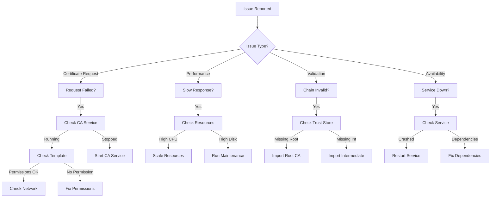

# PKI Modernization - Operational Procedures

[← Previous: Phase 5 Cutover](09-phase5-cutover.md) | [Back to Index](00-index.md) | [Next: Disaster Recovery →](11-disaster-recovery.md)

## Executive Summary

This document provides comprehensive operational procedures for managing the enterprise PKI infrastructure. It covers daily operations, maintenance tasks, troubleshooting guides, security procedures, and compliance requirements to ensure reliable and secure certificate services.

## Table of Contents

1. [Daily Operations](#daily-operations)
2. [Certificate Management](#certificate-management)
3. [CA Administration](#ca-administration)
4. [Monitoring and Alerting](#monitoring-and-alerting)
5. [Backup and Recovery](#backup-and-recovery)
6. [Security Operations](#security-operations)
7. [Troubleshooting Guide](#troubleshooting-guide)
8. [Maintenance Procedures](#maintenance-procedures)
9. [Compliance and Auditing](#compliance-and-auditing)
10. [Emergency Procedures](#emergency-procedures)

## Daily Operations

### Daily Health Check Procedure

```powershell
# Perform-DailyPKIHealthCheck.ps1
# Daily health check for PKI infrastructure

param(
    [string]$ReportPath = "C:\PKI\Reports\Daily",
    [switch]$SendEmail = $true
)

function Test-PKIHealth {
    Write-Host "=== PKI Daily Health Check ===" -ForegroundColor Cyan
    Write-Host "Date: $(Get-Date -Format 'yyyy-MM-dd HH:mm:ss')" -ForegroundColor Gray
    
    $healthReport = @{
        Date = Get-Date
        OverallHealth = "Healthy"
        Services = @()
        Certificates = @()
        Performance = @()
        Issues = @()
    }
    
    # Check CA Services
    Write-Host "`nChecking CA Services..." -ForegroundColor Yellow
    
    $caServers = @("PKI-ICA-01", "PKI-ICA-02")
    foreach ($server in $caServers) {
        $service = Get-Service -ComputerName $server -Name CertSvc
        
        $healthReport.Services += @{
            Server = $server
            Service = "Certificate Services"
            Status = $service.Status
            Healthy = ($service.Status -eq "Running")
        }
        
        if ($service.Status -ne "Running") {
            $healthReport.Issues += "CA Service not running on $server"
            $healthReport.OverallHealth = "Degraded"
        }
    }
    
    # Check OCSP Responders
    $ocspServers = @("PKI-OCSP-01", "PKI-OCSP-02")
    foreach ($server in $ocspServers) {
        $response = Test-OCSPResponder -Server $server
        
        $healthReport.Services += @{
            Server = $server
            Service = "OCSP Responder"
            Status = if ($response) {"Online"} else {"Offline"}
            Healthy = $response
        }
    }
    
    # Check Certificate Expiration
    Write-Host "Checking certificate expiration..." -ForegroundColor Yellow
    
    $expiringCerts = Get-ExpiringCertificates -DaysToExpire 30
    
    foreach ($cert in $expiringCerts) {
        $healthReport.Certificates += @{
            Subject = $cert.Subject
            Issuer = $cert.Issuer
            ExpiresIn = ($cert.NotAfter - (Get-Date)).Days
            Thumbprint = $cert.Thumbprint
        }
        
        if (($cert.NotAfter - (Get-Date)).Days -lt 7) {
            $healthReport.Issues += "Certificate expiring soon: $($cert.Subject)"
            $healthReport.OverallHealth = "Warning"
        }
    }
    
    # Check Performance Metrics
    Write-Host "Checking performance metrics..." -ForegroundColor Yellow
    
    $perfMetrics = @{
        IssuanceTime = (Measure-CertificateIssuanceTime).TotalSeconds
        OCSPResponseTime = (Measure-OCSPResponseTime).TotalMilliseconds
        CRLSize = (Get-CRLSize).MB
        DatabaseSize = (Get-CADatabaseSize).GB
    }
    
    $healthReport.Performance = $perfMetrics
    
    if ($perfMetrics.IssuanceTime -gt 30) {
        $healthReport.Issues += "Slow certificate issuance: $($perfMetrics.IssuanceTime)s"
    }
    
    if ($perfMetrics.OCSPResponseTime -gt 500) {
        $healthReport.Issues += "Slow OCSP response: $($perfMetrics.OCSPResponseTime)ms"
    }
    
    # Check Azure Key Vault
    Write-Host "Checking Azure Key Vault..." -ForegroundColor Yellow
    
    $keyVault = Get-AzKeyVault -VaultName "KV-PKI-RootCA-Prod"
    if ($keyVault.VaultUri) {
        $healthReport.Services += @{
            Server = "Azure"
            Service = "Key Vault"
            Status = "Available"
            Healthy = $true
        }
    } else {
        $healthReport.Issues += "Key Vault not accessible"
        $healthReport.OverallHealth = "Critical"
    }
    
    # Generate Report
    $reportFile = "$ReportPath\PKI-Health-$(Get-Date -Format 'yyyyMMdd').html"
    ConvertTo-PKIHealthReport -Report $healthReport -OutputPath $reportFile
    
    # Send Email if requested
    if ($SendEmail) {
        Send-PKIHealthReport -Report $healthReport -Recipients @(
            "pki-team@company.com.au",
            "operations@company.com.au"
        )
    }
    
    # Display Summary
    Write-Host "`n=== Health Check Summary ===" -ForegroundColor Cyan
    Write-Host "Overall Health: $($healthReport.OverallHealth)" -ForegroundColor $(
        switch ($healthReport.OverallHealth) {
            "Healthy" { "Green" }
            "Warning" { "Yellow" }
            "Degraded" { "Orange" }
            "Critical" { "Red" }
        }
    )
    
    if ($healthReport.Issues.Count -gt 0) {
        Write-Host "`nIssues Found:" -ForegroundColor Yellow
        foreach ($issue in $healthReport.Issues) {
            Write-Host "  - $issue" -ForegroundColor Red
        }
    }
    
    return $healthReport
}

# Run health check
$health = Test-PKIHealth

# Log to event log
Write-EventLog -LogName "PKI-Operations" -Source "HealthCheck" `
    -EventId 1000 -EntryType $(
        if ($health.OverallHealth -eq "Healthy") {"Information"} 
        else {"Warning"}
    ) -Message "PKI Health Status: $($health.OverallHealth)"
```

### Daily Operational Tasks

| Task | Schedule | Responsible | Procedure |
|------|----------|-------------|-----------|
| Health Check | 08:00 daily | Operations | Run health check script |
| Certificate Report | 09:00 daily | PKI Team | Review expiring certificates |
| Backup Verification | 10:00 daily | Operations | Verify overnight backups |
| Alert Review | 11:00 daily | Operations | Review monitoring alerts |
| Ticket Review | 14:00 daily | Service Desk | Process certificate requests |
| Performance Check | 16:00 daily | Operations | Review performance metrics |

## Certificate Management

### Certificate Request Processing

```powershell
# Process-CertificateRequest.ps1
# Processes certificate requests from service portal

function Process-CertificateRequest {
    param(
        [string]$RequestId,
        [string]$Template,
        [string]$Subject,
        [string[]]$SANs,
        [string]$Requester,
        [string]$Approver
    )
    
    try {
        # Validate request
        if (-not (Test-CertificateRequestValid -RequestId $RequestId)) {
            throw "Invalid request parameters"
        }
        
        # Check template permissions
        if (-not (Test-TemplatePermission -Template $Template -User $Requester)) {
            throw "User not authorized for template: $Template"
        }
        
        # Generate CSR
        $csr = New-CertificateRequest `
            -Subject $Subject `
            -SANs $SANs `
            -KeySize 2048
        
        # Submit to CA
        $result = Submit-CertificateRequest `
            -CA "PKI-ICA-01.company.local\Company Issuing CA 01" `
            -Template $Template `
            -CSR $csr
        
        if ($result.Status -eq "Issued") {
            # Retrieve certificate
            $cert = Get-IssuedCertificate -RequestId $result.RequestId
            
            # Deliver to requester
            Send-CertificateToRequester `
                -Certificate $cert `
                -Requester $Requester `
                -RequestId $RequestId
            
            # Update tracking
            Update-CertificateTracking `
                -RequestId $RequestId `
                -Status "Completed" `
                -CertificateSerial $cert.SerialNumber
            
            return @{
                Success = $true
                RequestId = $RequestId
                SerialNumber = $cert.SerialNumber
            }
        } else {
            throw "Certificate issuance failed: $($result.Status)"
        }
        
    } catch {
        # Log error
        Write-EventLog -LogName "PKI-Operations" -Source "CertRequest" `
            -EventId 2001 -EntryType Error `
            -Message "Request $RequestId failed: $_"
        
        # Update tracking
        Update-CertificateTracking `
            -RequestId $RequestId `
            -Status "Failed" `
            -ErrorMessage $_
        
        return @{
            Success = $false
            RequestId = $RequestId
            Error = $_.Exception.Message
        }
    }
}
```

### Certificate Renewal Process

```powershell
# Renew-ExpiringCertificates.ps1
# Automated certificate renewal process

function Start-CertificateRenewal {
    param(
        [int]$DaysBeforeExpiry = 30,
        [switch]$AutoApprove = $false
    )
    
    Write-Host "Starting certificate renewal process..." -ForegroundColor Cyan
    
    # Get expiring certificates
    $expiringCerts = Get-ADObject -Filter {objectClass -eq "pKICertificate"} -Properties * |
        Where-Object {
            $cert = [System.Security.Cryptography.X509Certificates.X509Certificate2]::new($_.userCertificate[0])
            ($cert.NotAfter - (Get-Date)).Days -le $DaysBeforeExpiry
        }
    
    $renewalResults = @()
    
    foreach ($certObj in $expiringCerts) {
        $cert = [System.Security.Cryptography.X509Certificates.X509Certificate2]::new($certObj.userCertificate[0])
        
        Write-Host "Processing renewal for: $($cert.Subject)" -ForegroundColor Yellow
        
        # Determine template
        $template = Get-CertificateTemplate -Certificate $cert
        
        # Check if auto-renewal is enabled
        if ($template.AutoRenewal -or $AutoApprove) {
            # Generate renewal request
            $renewalRequest = New-CertificateRenewalRequest `
                -OldCertificate $cert `
                -Template $template.Name
            
            # Submit renewal
            $newCert = Submit-CertificateRenewal `
                -Request $renewalRequest `
                -CA "PKI-ICA-01.company.local\Company Issuing CA 01"
            
            if ($newCert) {
                # Replace old certificate
                Replace-Certificate `
                    -Old $cert `
                    -New $newCert `
                    -UpdateBindings $true
                
                $renewalResults += @{
                    Subject = $cert.Subject
                    OldSerial = $cert.SerialNumber
                    NewSerial = $newCert.SerialNumber
                    Status = "Success"
                }
                
                Write-Host "  ✓ Renewed successfully" -ForegroundColor Green
            } else {
                $renewalResults += @{
                    Subject = $cert.Subject
                    OldSerial = $cert.SerialNumber
                    Status = "Failed"
                    Error = "Renewal submission failed"
                }
                
                Write-Host "  ✗ Renewal failed" -ForegroundColor Red
            }
        } else {
            # Create renewal request for manual approval
            New-PendingRenewal `
                -Certificate $cert `
                -Template $template.Name `
                -NotifyOwner $true
            
            $renewalResults += @{
                Subject = $cert.Subject
                OldSerial = $cert.SerialNumber
                Status = "Pending Approval"
            }
            
            Write-Host "  ⚠ Pending manual approval" -ForegroundColor Yellow
        }
    }
    
    # Generate renewal report
    $renewalResults | Export-Csv -Path "C:\PKI\Reports\Renewal-$(Get-Date -Format 'yyyyMMdd').csv"
    
    return $renewalResults
}
```

### Certificate Revocation Procedure

```powershell
# Revoke-Certificate.ps1
# Certificate revocation with audit trail

function Revoke-Certificate {
    param(
        [Parameter(Mandatory)]
        [string]$SerialNumber,
        
        [Parameter(Mandatory)]
        [ValidateSet(
            "Unspecified",
            "KeyCompromise",
            "CACompromise",
            "AffiliationChanged",
            "Superseded",
            "CessationOfOperation",
            "CertificateHold"
        )]
        [string]$Reason,
        
        [string]$RequestedBy,
        [string]$ApprovedBy,
        [string]$Comments
    )
    
    # Validate authorization
    if (-not (Test-RevocationAuthorization -User $RequestedBy)) {
        throw "User not authorized to revoke certificates"
    }
    
    # Create audit record
    $auditRecord = @{
        Timestamp = Get-Date
        SerialNumber = $SerialNumber
        Reason = $Reason
        RequestedBy = $RequestedBy
        ApprovedBy = $ApprovedBy
        Comments = $Comments
    }
    
    try {
        # Get certificate details
        $cert = Get-CACertificate -SerialNumber $SerialNumber
        
        # Perform revocation
        $result = certutil -revoke $SerialNumber $Reason
        
        if ($result -match "successfully revoked") {
            # Update CRL immediately for critical revocations
            if ($Reason -in @("KeyCompromise", "CACompromise")) {
                Publish-CRL -Force -Emergency
            }
            
            # Notify affected parties
            Send-RevocationNotification `
                -Certificate $cert `
                -Reason $Reason `
                -Recipients (Get-CertificateOwner -Certificate $cert)
            
            # Update audit log
            $auditRecord.Status = "Success"
            $auditRecord.RevokedAt = Get-Date
            
            Write-EventLog -LogName "PKI-Security" -Source "Revocation" `
                -EventId 3001 -EntryType Warning `
                -Message "Certificate $SerialNumber revoked: $Reason by $RequestedBy"
            
            return @{
                Success = $true
                SerialNumber = $SerialNumber
                Message = "Certificate successfully revoked"
            }
        } else {
            throw "Revocation failed: $result"
        }
        
    } catch {
        $auditRecord.Status = "Failed"
        $auditRecord.Error = $_.Exception.Message
        
        Write-EventLog -LogName "PKI-Security" -Source "Revocation" `
            -EventId 3002 -EntryType Error `
            -Message "Revocation failed for $SerialNumber : $_"
        
        throw
        
    } finally {
        # Always save audit record
        $auditRecord | Export-Csv -Path "C:\PKI\Audit\Revocations.csv" -Append
    }
}
```

## CA Administration

### CA Backup Procedure

```powershell
# Backup-CertificateAuthority.ps1
# Comprehensive CA backup procedure

function Backup-CertificateAuthority {
    param(
        [string]$CAServer = "PKI-ICA-01",
        [string]$BackupPath = "\\Backup\PKI\CA",
        [switch]$IncludeDatabase = $true,
        [switch]$IncludePrivateKey = $false
    )
    
    $backupDate = Get-Date -Format "yyyyMMdd-HHmmss"
    $backupFolder = "$BackupPath\$CAServer-$backupDate"
    
    Write-Host "Starting CA backup for $CAServer..." -ForegroundColor Cyan
    
    # Create backup folder
    New-Item -ItemType Directory -Path $backupFolder -Force
    
    Invoke-Command -ComputerName $CAServer -ScriptBlock {
        param($backup, $includeDB, $includeKey)
        
        # Stop CA service for consistent backup
        Write-Host "Stopping CA service..." -ForegroundColor Yellow
        Stop-Service CertSvc
        
        try {
            # Backup CA configuration
            Write-Host "Backing up CA configuration..." -ForegroundColor Yellow
            certutil -backup "$backup\CAConfig" -p "BackupPassword123!"
            
            # Backup CA database
            if ($includeDB) {
                Write-Host "Backing up CA database..." -ForegroundColor Yellow
                Backup-CARoleService -Path "$backup\Database" -DatabaseOnly
            }
            
            # Backup private key (if requested and authorized)
            if ($includeKey) {
                Write-Host "Backing up CA private key..." -ForegroundColor Yellow
                certutil -backupkey "$backup\PrivateKey" -p "KeyBackupPassword123!"
            }
            
            # Export registry settings
            Write-Host "Exporting registry settings..." -ForegroundColor Yellow
            reg export "HKLM\SYSTEM\CurrentControlSet\Services\CertSvc" "$backup\CertSvc-Registry.reg" /y
            
            # Export templates
            Write-Host "Exporting certificate templates..." -ForegroundColor Yellow
            Get-CATemplate | Export-Csv -Path "$backup\Templates.csv"
            
            # Export CA certificate
            $caCert = Get-ChildItem Cert:\LocalMachine\My | 
                Where-Object {$_.Subject -like "*Issuing CA*"}
            
            foreach ($cert in $caCert) {
                Export-Certificate -Cert $cert -FilePath "$backup\CACert-$($cert.Thumbprint).cer"
            }
            
        } finally {
            # Restart CA service
            Write-Host "Restarting CA service..." -ForegroundColor Yellow
            Start-Service CertSvc
        }
        
    } -ArgumentList $backupFolder, $IncludeDatabase, $IncludePrivateKey
    
    # Verify backup
    Write-Host "Verifying backup..." -ForegroundColor Yellow
    
    $backupValid = Test-CABackup -BackupPath $backupFolder
    
    if ($backupValid) {
        # Compress backup
        Compress-Archive -Path $backupFolder -DestinationPath "$backupFolder.zip"
        
        # Encrypt backup
        Protect-BackupArchive -Archive "$backupFolder.zip" -Password (Get-BackupPassword)
        
        # Log backup
        @{
            Date = Get-Date
            Server = $CAServer
            BackupPath = "$backupFolder.zip"
            Size = (Get-Item "$backupFolder.zip").Length
            IncludedDatabase = $IncludeDatabase
            IncludedKey = $IncludePrivateKey
            Status = "Success"
        } | Export-Csv -Path "C:\PKI\Backup\BackupLog.csv" -Append
        
        Write-Host "Backup completed successfully!" -ForegroundColor Green
        return $true
    } else {
        Write-Host "Backup verification failed!" -ForegroundColor Red
        return $false
    }
}
```

### Template Management

```powershell
# Manage-CertificateTemplates.ps1
# Certificate template management procedures

function New-CertificateTemplate {
    param(
        [string]$TemplateName,
        [string]$DisplayName,
        [string]$BasedOn = "Computer",
        [int]$ValidityPeriod = 365,
        [int]$RenewalPeriod = 60,
        [string[]]$ApplicationPolicies,
        [string[]]$AllowedPrincipals
    )
    
    # Duplicate existing template
    $sourceTemplate = Get-CATemplate -Name $BasedOn
    
    # Create new template
    $newTemplate = $sourceTemplate.PSObject.Copy()
    $newTemplate.Name = $TemplateName
    $newTemplate.DisplayName = $DisplayName
    
    # Set validity period
    $newTemplate.'pKIExpirationPeriod' = [System.BitConverter]::GetBytes($ValidityPeriod * -864000000000)
    $newTemplate.'pKIOverlapPeriod' = [System.BitConverter]::GetBytes($RenewalPeriod * -864000000000)
    
    # Set application policies
    if ($ApplicationPolicies) {
        $newTemplate.'pKIExtendedKeyUsage' = $ApplicationPolicies
    }
    
    # Set permissions
    $acl = Get-Acl "AD:CN=$BasedOn,CN=Certificate Templates,CN=Public Key Services,CN=Services,CN=Configuration,DC=company,DC=local"
    
    foreach ($principal in $AllowedPrincipals) {
        $permission = New-Object System.DirectoryServices.ActiveDirectoryAccessRule(
            (Get-ADUser $principal).SID,
            "GenericAll",
            "Allow"
        )
        $acl.AddAccessRule($permission)
    }
    
    # Create template in AD
    $templatePath = "CN=$TemplateName,CN=Certificate Templates,CN=Public Key Services,CN=Services,CN=Configuration,DC=company,DC=local"
    New-ADObject -Type pKICertificateTemplate -Path $templatePath -OtherAttributes $newTemplate
    
    # Set ACL
    Set-Acl -Path "AD:$templatePath" -AclObject $acl
    
    # Publish to CAs
    Publish-CATemplate -Template $TemplateName
    
    Write-Host "Template '$DisplayName' created successfully" -ForegroundColor Green
}

function Modify-CertificateTemplate {
    param(
        [string]$TemplateName,
        [hashtable]$Changes
    )
    
    # Get current template
    $template = Get-CATemplate -Name $TemplateName
    
    # Apply changes
    foreach ($change in $Changes.GetEnumerator()) {
        $template.($change.Key) = $change.Value
    }
    
    # Update template
    Set-ADObject -Identity $template.DistinguishedName -Replace $Changes
    
    # Increment version number
    $version = [int]$template.revision + 1
    Set-ADObject -Identity $template.DistinguishedName -Replace @{revision = $version}
    
    # Force replication
    Sync-CATemplates
    
    Write-Host "Template '$TemplateName' updated successfully" -ForegroundColor Green
}
```

## Monitoring and Alerting

### Monitoring Configuration

```yaml
# monitoring-config.yaml
# PKI monitoring configuration

Monitoring:
  Metrics:
    CA_Services:
      - Metric: service_status
        Service: CertSvc
        Servers: [PKI-ICA-01, PKI-ICA-02]
        Check_Interval: 60s
        Alert_When: status != running
        
    Certificate_Metrics:
      - Metric: certificates_issued
        Source: CA_Database
        Interval: 5m
        
      - Metric: certificates_expiring
        Threshold: 30_days
        Check_Interval: 1h
        Alert_When: count > 10
        
      - Metric: certificate_requests_pending
        Source: CA_Database
        Alert_When: count > 50
        
    Performance_Metrics:
      - Metric: issuance_time
        Threshold: 30s
        Alert_When: p95 > threshold
        
      - Metric: ocsp_response_time
        Threshold: 500ms
        Alert_When: p95 > threshold
        
      - Metric: crl_size
        Threshold: 10MB
        Alert_When: size > threshold
        
    Security_Metrics:
      - Metric: failed_requests
        Window: 5m
        Alert_When: count > 10
        
      - Metric: revocations
        Track: all
        Alert_When: reason = KeyCompromise
        
  Alerts:
    Channels:
      - Email: pki-alerts@company.com.au
      - Teams: PKI-Operations
      - PagerDuty: pki-oncall
      
    Escalation:
      Level_1:
        After: 5m
        Contact: operations-team
        
      Level_2:
        After: 15m
        Contact: pki-team
        
      Level_3:
        After: 30m
        Contact: management
```

### Alert Response Procedures

| Alert Type | Severity | Response Time | Procedure |
|------------|----------|---------------|-----------|
| CA Service Down | Critical | 5 minutes | Restart service, check logs, escalate if needed |
| Certificate Expired | High | 1 hour | Renew certificate, update bindings |
| High Issuance Rate | Medium | 4 hours | Investigate source, check for anomalies |
| CRL Too Large | Low | 24 hours | Archive old entries, optimize CRL |
| OCSP Slow Response | Medium | 2 hours | Check server load, optimize cache |

## Troubleshooting Guide

### Common Issues and Resolutions

```powershell
# Troubleshoot-PKIIssues.ps1
# Automated troubleshooting procedures

function Diagnose-PKIIssue {
    param(
        [string]$Symptom
    )
    
    switch ($Symptom) {
        "CertificateRequestFailed" {
            Write-Host "Diagnosing certificate request failure..." -ForegroundColor Yellow
            
            # Check CA service
            $caStatus = Get-Service -ComputerName "PKI-ICA-01" -Name CertSvc
            if ($caStatus.Status -ne "Running") {
                Write-Host "Issue: CA service not running" -ForegroundColor Red
                Write-Host "Resolution: Start CA service" -ForegroundColor Green
                Start-Service -ComputerName "PKI-ICA-01" -Name CertSvc
            }
            
            # Check template permissions
            $templates = Get-CATemplate
            foreach ($template in $templates) {
                $acl = Get-Acl "AD:$($template.DistinguishedName)"
                # Check permissions
            }
            
            # Check network connectivity
            $connectivity = Test-NetConnection -ComputerName "PKI-ICA-01" -Port 135
            if (-not $connectivity.TcpTestSucceeded) {
                Write-Host "Issue: Network connectivity problem" -ForegroundColor Red
                Write-Host "Resolution: Check firewall rules and network path" -ForegroundColor Green
            }
        }
        
        "SlowCertificateIssuance" {
            Write-Host "Diagnosing slow issuance..." -ForegroundColor Yellow
            
            # Check CA database size
            $dbSize = Get-CADatabaseSize
            if ($dbSize.GB -gt 50) {
                Write-Host "Issue: Large CA database" -ForegroundColor Red
                Write-Host "Resolution: Archive old certificates" -ForegroundColor Green
                Start-CADatabaseMaintenance
            }
            
            # Check server resources
            $perfCounters = Get-Counter -ComputerName "PKI-ICA-01" `
                -Counter "\Processor(_Total)\% Processor Time",
                         "\Memory\Available MBytes"
            
            if ($perfCounters[0].CookedValue -gt 80) {
                Write-Host "Issue: High CPU usage" -ForegroundColor Red
                Write-Host "Resolution: Investigate processes, consider scaling" -ForegroundColor Green
            }
        }
        
        "CertificateChainValidationFailed" {
            Write-Host "Diagnosing chain validation failure..." -ForegroundColor Yellow
            
            # Check root CA certificate
            $rootCA = Get-ChildItem Cert:\LocalMachine\Root | 
                Where-Object {$_.Subject -like "*Root CA*"}
            
            if (-not $rootCA) {
                Write-Host "Issue: Root CA not in trusted store" -ForegroundColor Red
                Write-Host "Resolution: Import root CA certificate" -ForegroundColor Green
                Import-Certificate -FilePath "\\PKI\Certs\RootCA.crt" `
                    -CertStoreLocation Cert:\LocalMachine\Root
            }
            
            # Check intermediate CAs
            $intermediateCA = Get-ChildItem Cert:\LocalMachine\CA | 
                Where-Object {$_.Subject -like "*Issuing CA*"}
            
            if ($intermediateCA.Count -lt 2) {
                Write-Host "Issue: Missing intermediate CA certificates" -ForegroundColor Red
                Write-Host "Resolution: Import intermediate certificates" -ForegroundColor Green
            }
            
            # Check CRL accessibility
            $crlUrl = "http://crl.company.com.au/IssuingCA01.crl"
            try {
                $crl = Invoke-WebRequest -Uri $crlUrl -UseBasicParsing
                Write-Host "CRL accessible" -ForegroundColor Green
            } catch {
                Write-Host "Issue: CRL not accessible" -ForegroundColor Red
                Write-Host "Resolution: Check CRL distribution point" -ForegroundColor Green
            }
        }
    }
}
```

### Troubleshooting Decision Tree



## Maintenance Procedures

### Weekly Maintenance Tasks

```powershell
# Perform-WeeklyMaintenance.ps1
# Weekly PKI maintenance tasks

function Start-WeeklyPKIMaintenance {
    param(
        [switch]$SendReport = $true
    )
    
    $maintenanceLog = @()
    
    Write-Host "=== PKI Weekly Maintenance ===" -ForegroundColor Cyan
    Write-Host "Start Time: $(Get-Date)" -ForegroundColor Gray
    
    # Task 1: CRL Publication
    Write-Host "`nPublishing CRLs..." -ForegroundColor Yellow
    foreach ($ca in @("PKI-ICA-01", "PKI-ICA-02")) {
        Invoke-Command -ComputerName $ca -ScriptBlock {
            certutil -CRL
        }
        $maintenanceLog += "CRL published on $ca"
    }
    
    # Task 2: Database Maintenance
    Write-Host "Running database maintenance..." -ForegroundColor Yellow
    foreach ($ca in @("PKI-ICA-01", "PKI-ICA-02")) {
        Invoke-Command -ComputerName $ca -ScriptBlock {
            # Backup database
            Backup-CARoleService -Path "C:\Backup\Weekly" -DatabaseOnly
            
            # Compact database
            Stop-Service CertSvc
            esentutl /p "C:\Windows\System32\CertLog\company.edb"
            Start-Service CertSvc
        }
        $maintenanceLog += "Database maintenance completed on $ca"
    }
    
    # Task 3: Certificate Cleanup
    Write-Host "Cleaning up expired certificates..." -ForegroundColor Yellow
    $expiredCerts = Get-ExpiredCertificates
    foreach ($cert in $expiredCerts) {
        Archive-Certificate -Certificate $cert
        Remove-Certificate -Certificate $cert
    }
    $maintenanceLog += "Archived $($expiredCerts.Count) expired certificates"
    
    # Task 4: Log Rotation
    Write-Host "Rotating logs..." -ForegroundColor Yellow
    Compress-Archive -Path "C:\PKI\Logs\*.log" `
        -DestinationPath "C:\PKI\Archive\Logs-$(Get-Date -Format 'yyyyMMdd').zip"
    Get-ChildItem "C:\PKI\Logs\*.log" | Remove-Item
    $maintenanceLog += "Logs rotated and archived"
    
    # Task 5: Performance Optimization
    Write-Host "Optimizing performance..." -ForegroundColor Yellow
    Optimize-CAPerformance
    $maintenanceLog += "Performance optimization completed"
    
    # Task 6: Security Audit
    Write-Host "Running security audit..." -ForegroundColor Yellow
    $auditResults = Start-PKISecurityAudit
    $maintenanceLog += "Security audit completed: $($auditResults.IssueCount) issues found"
    
    # Generate report
    if ($SendReport) {
        Send-MaintenanceReport -Log $maintenanceLog -Recipients @(
            "pki-team@company.com.au",
            "operations@company.com.au"
        )
    }
    
    Write-Host "`nWeekly maintenance completed!" -ForegroundColor Green
    return $maintenanceLog
}
```

### Monthly Maintenance Tasks

| Task | Procedure | Expected Duration |
|------|-----------|-------------------|
| Full Backup | Complete CA backup including database | 2 hours |
| Security Patches | Apply Windows updates to PKI servers | 4 hours |
| Certificate Audit | Review all issued certificates | 2 hours |
| Template Review | Validate template configurations | 1 hour |
| Performance Analysis | Analyze trends and capacity | 1 hour |
| DR Test | Validate disaster recovery procedures | 4 hours |

## Security Operations

### Security Monitoring

```powershell
# Monitor-PKISecurity.ps1
# Security monitoring and threat detection

function Start-PKISecurityMonitoring {
    $securityEvents = @()
    
    # Monitor for suspicious certificate requests
    $suspiciousRequests = Get-WinEvent -FilterHashtable @{
        LogName = 'Security'
        ID = 4886  # Certificate request
    } | Where-Object {
        $_.Message -match "Code Signing" -or
        $_.Message -match "high-value template"
    }
    
    foreach ($event in $suspiciousRequests) {
        $securityEvents += @{
            Type = "Suspicious Request"
            Time = $event.TimeCreated
            User = $event.UserId
            Details = $event.Message
        }
    }
    
    # Monitor for multiple failed requests
    $failedRequests = Get-WinEvent -FilterHashtable @{
        LogName = 'Application'
        ID = 100  # Failed certificate request
    } | Group-Object UserId | Where-Object {$_.Count -gt 5}
    
    foreach ($group in $failedRequests) {
        $securityEvents += @{
            Type = "Multiple Failed Requests"
            User = $group.Name
            Count = $group.Count
            Action = "Investigate potential attack"
        }
    }
    
    # Monitor for unauthorized template modifications
    $templateChanges = Get-WinEvent -FilterHashtable @{
        LogName = 'Security'
        ID = 4899  # Template modified
    }
    
    foreach ($event in $templateChanges) {
        if ($event.UserId -notin $authorizedAdmins) {
            $securityEvents += @{
                Type = "Unauthorized Template Change"
                Time = $event.TimeCreated
                User = $event.UserId
                Action = "Revert change and investigate"
            }
        }
    }
    
    # Alert on critical security events
    if ($securityEvents.Count -gt 0) {
        Send-SecurityAlert -Events $securityEvents -Priority "High"
    }
    
    return $securityEvents
}
```

## Emergency Procedures

### CA Failure Recovery

```powershell
# Recover-FailedCA.ps1
# Emergency CA recovery procedure

function Start-CAEmergencyRecovery {
    param(
        [string]$FailedCA,
        [string]$BackupPath
    )
    
    Write-Host "EMERGENCY: Starting CA recovery for $FailedCA" -ForegroundColor Red
    
    # Step 1: Assess failure
    $failureType = Get-CAFailureType -Server $FailedCA
    
    switch ($failureType) {
        "ServiceFailure" {
            # Try to restart service
            Restart-Computer -ComputerName $FailedCA -Force -Wait
            Start-Service -ComputerName $FailedCA -Name CertSvc
        }
        
        "DatabaseCorruption" {
            # Restore from backup
            Restore-CADatabase -Server $FailedCA -BackupPath $BackupPath
        }
        
        "CompleteFailure" {
            # Rebuild CA
            Rebuild-CA -Server $FailedCA -BackupPath $BackupPath
        }
    }
    
    # Verify recovery
    $recovered = Test-CAHealth -Server $FailedCA
    
    if ($recovered) {
        Write-Host "CA recovered successfully" -ForegroundColor Green
        Send-Notification -Message "CA $FailedCA recovered from failure"
    } else {
        Write-Host "CA recovery failed - escalating" -ForegroundColor Red
        Invoke-DisasterRecovery
    }
}
```

---

**Document Control**
- Version: 1.0
- Last Updated: April 2025
- Next Review: Monthly
- Owner: PKI Operations Team
- Classification: Confidential

---
[← Previous: Phase 5 Cutover](09-phase5-cutover.md) | [Back to Index](00-index.md) | [Next: Disaster Recovery →](11-disaster-recovery.md)