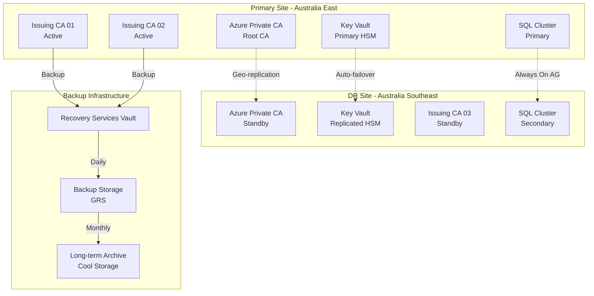

# PKI Modernization - Disaster Recovery Plan

[← Previous: Operational Procedures](10-operational-procedures.md) | [Back to Index](00-index.md) | [Next: Security Controls →](12-security-controls.md)

## Executive Summary

This document provides comprehensive disaster recovery (DR) procedures for the enterprise PKI infrastructure. It covers recovery strategies, procedures, and testing requirements to ensure business continuity in the event of partial or complete PKI service failure. The plan addresses various failure scenarios from single component failures to complete datacenter loss.

## DR Strategy Overview

### Recovery Objectives

| Service Level | RPO (Recovery Point Objective) | RTO (Recovery Time Objective) | Data Loss Tolerance |
|---------------|--------------------------------|--------------------------------|---------------------|
| Root CA | 24 hours | 72 hours | Zero |
| Issuing CAs | 1 hour | 4 hours | Minimal |
| OCSP Services | 15 minutes | 1 hour | None |
| CRL Distribution | 1 hour | 2 hours | None |
| Certificate Database | 1 hour | 4 hours | < 1 hour transactions |
| Key Vault (HSM) | Real-time | 1 hour | Zero |

### DR Architecture



## Failure Scenarios and Recovery Procedures

### Scenario 1: Single Issuing CA Failure

#### Detection
```powershell
# Detect-CAFailure.ps1
# Automated CA failure detection

function Test-CAAvailability {
    param([string]$CAServer)
    
    $tests = @{
        ServiceRunning = $false
        NetworkReachable = $false
        CertificateIssuance = $false
        DatabaseAccessible = $false
    }
    
    # Test 1: Service status
    try {
        $service = Get-Service -ComputerName $CAServer -Name CertSvc -ErrorAction Stop
        $tests.ServiceRunning = ($service.Status -eq "Running")
    } catch {
        $tests.ServiceRunning = $false
    }
    
    # Test 2: Network connectivity
    $tests.NetworkReachable = Test-Connection -ComputerName $CAServer -Count 2 -Quiet
    
    # Test 3: Certificate issuance capability
    if ($tests.ServiceRunning) {
        try {
            $testCert = Get-Certificate -Template "TestTemplate" -Url "https://$CAServer/certsrv" -ErrorAction Stop
            $tests.CertificateIssuance = ($testCert.Status -eq "Issued")
        } catch {
            $tests.CertificateIssuance = $false
        }
    }
    
    # Test 4: Database connectivity
    try {
        $db = Invoke-Command -ComputerName $CAServer -ScriptBlock {
            Test-Path "C:\Windows\System32\CertLog\company.edb"
        } -ErrorAction Stop
        $tests.DatabaseAccessible = $db
    } catch {
        $tests.DatabaseAccessible = $false
    }
    
    # Determine failure type
    if (-not $tests.NetworkReachable) {
        return @{Status = "Failed"; Type = "Network"; Tests = $tests}
    } elseif (-not $tests.ServiceRunning) {
        return @{Status = "Failed"; Type = "Service"; Tests = $tests}
    } elseif (-not $tests.DatabaseAccessible) {
        return @{Status = "Failed"; Type = "Database"; Tests = $tests}
    } elseif (-not $tests.CertificateIssuance) {
        return @{Status = "Degraded"; Type = "Issuance"; Tests = $tests}
    } else {
        return @{Status = "Healthy"; Type = "None"; Tests = $tests}
    }
}
```

#### Recovery Procedure
```powershell
# Recover-SingleCA.ps1
# Single CA recovery procedure

function Start-SingleCARecovery {
    param(
        [string]$FailedCA,
        [string]$FailureType
    )
    
    Write-Host "=== SINGLE CA RECOVERY ===" -ForegroundColor Red
    Write-Host "Failed CA: $FailedCA" -ForegroundColor Yellow
    Write-Host "Failure Type: $FailureType" -ForegroundColor Yellow
    
    $recoverySteps = @()
    
    switch ($FailureType) {
        "Service" {
            Write-Host "`nAttempting service recovery..." -ForegroundColor Cyan
            
            # Step 1: Try service restart
            try {
                Restart-Service -ComputerName $FailedCA -Name CertSvc -Force
                Start-Sleep -Seconds 10
                
                $serviceStatus = Get-Service -ComputerName $FailedCA -Name CertSvc
                if ($serviceStatus.Status -eq "Running") {
                    $recoverySteps += "Service restarted successfully"
                    Write-Host "✓ Service recovered" -ForegroundColor Green
                    return @{Success = $true; Steps = $recoverySteps}
                }
            } catch {
                $recoverySteps += "Service restart failed: $_"
            }
            
            # Step 2: Check dependencies
            Write-Host "Checking service dependencies..." -ForegroundColor Yellow
            $dependencies = @("RPCSS", "EventLog", "W32Time")
            foreach ($dep in $dependencies) {
                $depService = Get-Service -ComputerName $FailedCA -Name $dep
                if ($depService.Status -ne "Running") {
                    Start-Service -ComputerName $FailedCA -Name $dep
                    $recoverySteps += "Started dependency: $dep"
                }
            }
            
            # Step 3: Rebuild if necessary
            if ((Get-Service -ComputerName $FailedCA -Name CertSvc).Status -ne "Running") {
                Write-Host "Service recovery failed, initiating rebuild..." -ForegroundColor Red
                Start-CAServiceRebuild -Server $FailedCA
                $recoverySteps += "CA service rebuilt"
            }
        }
        
        "Database" {
            Write-Host "`nAttempting database recovery..." -ForegroundColor Cyan
            
            # Step 1: Stop CA service
            Stop-Service -ComputerName $FailedCA -Name CertSvc -Force
            $recoverySteps += "CA service stopped"
            
            # Step 2: Run database recovery
            Invoke-Command -ComputerName $FailedCA -ScriptBlock {
                # Check database integrity
                $result = esentutl /g "C:\Windows\System32\CertLog\company.edb"
                
                if ($result -match "error") {
                    # Attempt repair
                    esentutl /p "C:\Windows\System32\CertLog\company.edb" /o
                    
                    # If repair fails, restore from backup
                    if ($LASTEXITCODE -ne 0) {
                        $latestBackup = Get-ChildItem "\\Backup\PKI\$env:COMPUTERNAME\Database" |
                            Sort-Object LastWriteTime -Descending |
                            Select-Object -First 1
                        
                        Restore-CADatabase -BackupPath $latestBackup.FullName
                    }
                }
            }
            $recoverySteps += "Database recovered"
            
            # Step 3: Restart service
            Start-Service -ComputerName $FailedCA -Name CertSvc
            $recoverySteps += "CA service restarted"
        }
        
        "Network" {
            Write-Host "`nNetwork failure detected..." -ForegroundColor Cyan
            
            # Redirect traffic to alternate CA
            Update-LoadBalancer -RemoveServer $FailedCA -AddServer (Get-AlternateCA $FailedCA)
            $recoverySteps += "Traffic redirected to alternate CA"
            
            # Create incident ticket
            $incident = New-ServiceNowIncident -Description "Network failure on $FailedCA" `
                -Priority 2 -AssignmentGroup "Network-Team"
            $recoverySteps += "Network incident created: $($incident.Number)"
        }
    }
    
    # Verify recovery
    $verification = Test-CAAvailability -CAServer $FailedCA
    
    if ($verification.Status -eq "Healthy") {
        Write-Host "`n✓ CA recovered successfully!" -ForegroundColor Green
        
        # Re-add to load balancer if removed
        Update-LoadBalancer -AddServer $FailedCA
        
        return @{Success = $true; Steps = $recoverySteps}
    } else {
        Write-Host "`n✗ Recovery failed, escalating..." -ForegroundColor Red
        return @{Success = $false; Steps = $recoverySteps; NextAction = "Failover to DR site"}
    }
}
```

### Scenario 2: Complete Primary Site Failure

#### Failover Procedure
```powershell
# Execute-SiteFailover.ps1
# Complete site failover to DR

function Start-CompleteSiteFailover {
    param(
        [switch]$Emergency = $false,
        [string]$AuthorizedBy
    )
    
    if (-not $Emergency) {
        Write-Host "This will failover ALL PKI services to DR site!" -ForegroundColor Red
        $confirm = Read-Host "Type 'FAILOVER' to proceed"
        if ($confirm -ne "FAILOVER") {
            Write-Host "Failover cancelled" -ForegroundColor Yellow
            return
        }
    }
    
    Write-Host "=== INITIATING SITE FAILOVER ===" -ForegroundColor Red
    Write-Host "Authorized by: $AuthorizedBy" -ForegroundColor Yellow
    Write-Host "Time: $(Get-Date)" -ForegroundColor Yellow
    
    $failoverLog = @{
        StartTime = Get-Date
        AuthorizedBy = $AuthorizedBy
        Steps = @()
        Success = $false
    }
    
    try {
        # Step 1: Activate Azure DR Site
        Write-Host "`nStep 1: Activating Azure DR components..." -ForegroundColor Cyan
        
        # Failover Key Vault
        $kvFailover = Start-AzKeyVaultFailover -VaultName "KV-PKI-RootCA-Prod"
        $failoverLog.Steps += "Key Vault failover initiated"
        
        # Activate standby Private CA
        $caFailover = Set-AzPrivateCA -Name "Company-Root-CA-G2" -Location "australiasoutheast" -Status "Active"
        $failoverLog.Steps += "Azure Private CA activated in DR site"
        
        # Step 2: Start DR Issuing CA
        Write-Host "`nStep 2: Starting DR Issuing CA..." -ForegroundColor Cyan
        
        Start-VM -Name "PKI-ICA-03-DR"
        Wait-VMBoot -Name "PKI-ICA-03-DR" -Timeout 300
        
        Start-Service -ComputerName "PKI-ICA-03" -Name CertSvc
        $failoverLog.Steps += "DR Issuing CA started"
        
        # Step 3: Failover SQL Database
        Write-Host "`nStep 3: Failing over SQL database..." -ForegroundColor Cyan
        
        Invoke-SqlCmd -ServerInstance "SQL-DR-CLUSTER" -Query @"
            ALTER AVAILABILITY GROUP [PKI-AG]
            FAILOVER;
"@
        $failoverLog.Steps += "SQL Always On AG failed over"
        
        # Step 4: Update DNS
        Write-Host "`nStep 4: Updating DNS records..." -ForegroundColor Cyan
        
        $dnsUpdates = @(
            @{Name = "pki"; Type = "A"; OldIP = "10.50.1.10"; NewIP = "10.51.1.10"},
            @{Name = "ca"; Type = "A"; OldIP = "10.50.1.10"; NewIP = "10.51.1.10"},
            @{Name = "ocsp"; Type = "A"; OldIP = "10.50.1.30"; NewIP = "10.51.1.30"}
        )
        
        foreach ($dns in $dnsUpdates) {
            Remove-DnsServerResourceRecord -ZoneName "company.com.au" `
                -Name $dns.Name -RRType $dns.Type -Force
            
            Add-DnsServerResourceRecordA -ZoneName "company.com.au" `
                -Name $dns.Name -IPv4Address $dns.NewIP -TimeToLive 00:05:00
        }
        $failoverLog.Steps += "DNS records updated to DR site"
        
        # Step 5: Update Load Balancers
        Write-Host "`nStep 5: Updating load balancers..." -ForegroundColor Cyan
        
        # Update NetScaler
        Update-NetScalerVirtualServer -VServer "VS_PKI_Services" `
            -BackendServers @("10.51.1.10:443", "10.51.1.11:443")
        
        # Update F5
        Update-F5Pool -Pool "pool_pki_services" `
            -Members @(
                @{Address = "10.51.1.10"; Port = 443},
                @{Address = "10.51.1.11"; Port = 443}
            )
        
        $failoverLog.Steps += "Load balancers updated"
        
        # Step 6: Validate DR Site
        Write-Host "`nStep 6: Validating DR site..." -ForegroundColor Cyan
        
        $validation = Test-DRSiteHealth
        
        if ($validation.AllHealthy) {
            $failoverLog.Success = $true
            $failoverLog.Steps += "DR site validation successful"
            
            # Step 7: Notify stakeholders
            Send-FailoverNotification -Type "Success" -Recipients @(
                "management@company.com.au",
                "it-all@company.com.au"
            )
            
            Write-Host "`n✓ FAILOVER COMPLETED SUCCESSFULLY" -ForegroundColor Green
        } else {
            throw "DR site validation failed"
        }
        
    } catch {
        $failoverLog.Error = $_.Exception.Message
        $failoverLog.Steps += "Failover failed: $_"
        
        Write-Host "`n✗ FAILOVER FAILED!" -ForegroundColor Red
        Write-Host "Error: $_" -ForegroundColor Red
        
        # Attempt rollback
        if (Confirm-Rollback) {
            Start-FailoverRollback -Log $failoverLog
        }
    } finally {
        # Save failover log
        $failoverLog.EndTime = Get-Date
        $failoverLog | Export-Clixml -Path "C:\DR\Logs\Failover-$(Get-Date -Format 'yyyyMMdd-HHmmss').xml"
    }
    
    return $failoverLog
}
```

### Scenario 3: Root CA Compromise

#### Emergency Root CA Recovery
```powershell
# Recover-CompromisedRootCA.ps1
# Emergency procedure for compromised Root CA

function Start-RootCACompromiseRecovery {
    Write-Host "=== CRITICAL: ROOT CA COMPROMISE RECOVERY ===" -ForegroundColor Red
    Write-Host "This is a critical security incident requiring immediate action" -ForegroundColor Red
    
    # Step 1: Immediate containment
    Write-Host "`nStep 1: IMMEDIATE CONTAINMENT" -ForegroundColor Red
    
    # Revoke all certificates issued by compromised CA
    $compromisedCerts = Get-AllCertificates -Issuer "Company Root CA G2"
    
    foreach ($cert in $compromisedCerts) {
        Revoke-Certificate -SerialNumber $cert.SerialNumber -Reason "CACompromise" -Emergency
    }
    
    # Publish emergency CRL
    Publish-EmergencyCRL -MaxSize
    
    # Block network access to CA
    Block-NetworkAccess -Server "PKI-ROOT-CA"
    
    # Step 2: Forensic preservation
    Write-Host "`nStep 2: Forensic preservation..." -ForegroundColor Yellow
    
    # Create forensic image
    New-ForensicImage -Server "PKI-ROOT-CA" -OutputPath "\\Forensics\RootCA-Compromise"
    
    # Preserve logs
    Copy-SecurityLogs -Server "PKI-ROOT-CA" -Destination "\\Forensics\Logs"
    
    # Step 3: Deploy new Root CA
    Write-Host "`nStep 3: Deploying new Root CA..." -ForegroundColor Cyan
    
    # Generate new root key in HSM
    $newRootKey = New-RootCAKey -KeyName "RootCA-G3-Emergency" -KeySize 4096 -HSM
    
    # Create new root certificate
    $newRootCert = New-RootCACertificate -Key $newRootKey -Subject "CN=Company Emergency Root CA G3"
    
    # Step 4: Re-issue all subordinate CAs
    Write-Host "`nStep 4: Re-issuing subordinate CAs..." -ForegroundColor Cyan
    
    $subordinateCAs = @("PKI-ICA-01", "PKI-ICA-02", "PKI-ICA-03")
    
    foreach ($ca in $subordinateCAs) {
        # Generate new CA certificate request
        $csr = New-SubordinateCARequest -CAServer $ca
        
        # Sign with new root
        $newCert = Sign-CertificateRequest -CSR $csr -RootCertificate $newRootCert
        
        # Install new certificate
        Install-CACertificate -Server $ca -Certificate $newCert
        
        # Restart CA
        Restart-Service -ComputerName $ca -Name CertSvc
    }
    
    # Step 5: Deploy new root to all systems
    Write-Host "`nStep 5: Emergency root deployment..." -ForegroundColor Cyan
    
    # Create emergency GPO
    New-EmergencyGPO -RootCertificate $newRootCert -Priority 1
    
    # Force immediate replication
    Force-ADReplication -Emergency
    
    # Push via SCCM
    Deploy-EmergencyCertificate -Certificate $newRootCert -Collection "All Systems" -Priority "High"
    
    # Step 6: Communication
    Send-SecurityIncidentNotification -Severity "Critical" `
        -Message "Root CA compromise detected and contained. New root certificate deployed." `
        -Recipients @("security@company.com.au", "management@company.com.au")
    
    Write-Host "`nRoot CA compromise recovery completed" -ForegroundColor Green
    Write-Host "Incident response team has been notified" -ForegroundColor Yellow
}
```

### Scenario 4: Ransomware Attack

#### Ransomware Recovery Procedure
```powershell
# Recover-FromRansomware.ps1
# PKI recovery from ransomware attack

function Start-RansomwareRecovery {
    param(
        [string[]]$AffectedServers,
        [datetime]$AttackTime
    )
    
    Write-Host "=== RANSOMWARE RECOVERY PROCEDURE ===" -ForegroundColor Red
    
    # Step 1: Isolate affected systems
    Write-Host "`nStep 1: Isolating affected systems..." -ForegroundColor Yellow
    
    foreach ($server in $AffectedServers) {
        # Disconnect from network
        Disable-NetAdapter -ComputerName $server -Name "*" -Confirm:$false
        
        # Stop all services
        Get-Service -ComputerName $server | Stop-Service -Force
        
        Write-Host "  Isolated: $server" -ForegroundColor Gray
    }
    
    # Step 2: Assess damage
    Write-Host "`nStep 2: Assessing damage..." -ForegroundColor Yellow
    
    $damage = @{
        CriticalDataLost = $false
        BackupsAffected = $false
        CAKeysCompromised = $false
    }
    
    # Check if CA private keys are affected
    foreach ($server in $AffectedServers) {
        if ($server -like "*ICA*") {
            $keyStatus = Test-CAPrivateKey -Server $server
            if (-not $keyStatus.Valid) {
                $damage.CAKeysCompromised = $true
            }
        }
    }
    
    # Check backup integrity
    $backupStatus = Test-BackupIntegrity -Before $AttackTime
    $damage.BackupsAffected = -not $backupStatus.Clean
    
    # Step 3: Restore from clean backups
    Write-Host "`nStep 3: Restoring from clean backups..." -ForegroundColor Cyan
    
    # Find last known good backup
    $cleanBackup = Get-CleanBackup -Before $AttackTime -Verified
    
    if ($cleanBackup) {
        foreach ($server in $AffectedServers) {
            Write-Host "  Restoring $server from backup..." -ForegroundColor Gray
            
            # Wipe infected system
            Format-SystemDrive -ComputerName $server -Confirm
            
            # Restore from backup
            Restore-ServerFromBackup -Server $server -Backup $cleanBackup -IncludeSystemState
            
            # Restore CA specific data
            if ($server -like "*ICA*") {
                Restore-CADatabase -Server $server -Backup $cleanBackup
                Restore-CAConfiguration -Server $server -Backup $cleanBackup
            }
        }
    } else {
        Write-Host "  No clean backup found, rebuilding from scratch..." -ForegroundColor Red
        
        foreach ($server in $AffectedServers) {
            Rebuild-PKIServer -Server $server -Template (Get-ServerRole $server)
        }
    }
    
    # Step 4: Validate restoration
    Write-Host "`nStep 4: Validating restoration..." -ForegroundColor Yellow
    
    $validation = @()
    foreach ($server in $AffectedServers) {
        $health = Test-ServerHealth -Server $server
        $validation += @{
            Server = $server
            Healthy = $health.Passed
            Services = $health.Services
        }
    }
    
    # Step 5: Re-establish trust
    if ($damage.CAKeysCompromised) {
        Write-Host "`nStep 5: Re-establishing trust..." -ForegroundColor Cyan
        
        # Revoke potentially compromised certificates
        $suspectCerts = Get-CertificatesIssuedAfter -Date $AttackTime
        
        foreach ($cert in $suspectCerts) {
            Revoke-Certificate -SerialNumber $cert.SerialNumber -Reason "KeyCompromise"
        }
        
        # Force certificate renewal
        Start-MassCertificateRenewal -Scope "All"
    }
    
    # Step 6: Implement additional controls
    Write-Host "`nStep 6: Implementing additional security controls..." -ForegroundColor Yellow
    
    # Enable additional monitoring
    Enable-EnhancedMonitoring -Servers $AffectedServers
    
    # Implement file integrity monitoring
    Enable-FileIntegrityMonitoring -Path "C:\Windows\System32\CertSrv"
    
    # Create recovery report
    $report = @{
        IncidentTime = $AttackTime
        RecoveryStart = Get-Date
        AffectedServers = $AffectedServers
        DataLoss = $damage.CriticalDataLost
        RecoveryMethod = if ($cleanBackup) {"Backup Restore"} else {"Complete Rebuild"}
        ValidationResults = $validation
    }
    
    $report | ConvertTo-Json | Out-File "C:\DR\RansomwareRecovery-$(Get-Date -Format 'yyyyMMdd').json"
    
    Write-Host "`nRansomware recovery completed" -ForegroundColor Green
    return $report
}
```

## Backup and Restore Procedures

### Backup Strategy

```yaml
Backup_Configuration:
  Daily_Backups:
    Schedule: "02:00 AM"
    Retention: 30 days
    Components:
      - CA Database
      - CA Configuration
      - Certificate Templates
      - Registry Settings
      - IIS Configuration
    
  Weekly_Backups:
    Schedule: "Sunday 04:00 AM"
    Retention: 12 weeks
    Components:
      - Full System State
      - All CA Components
      - Private Keys (encrypted)
    
  Monthly_Backups:
    Schedule: "First Sunday 06:00 AM"
    Retention: 7 years
    Components:
      - Complete Infrastructure
      - Historical Archives
      - Audit Logs
    
  Backup_Locations:
    Primary: "\\Backup-NAS\PKI"
    Secondary: "Azure Backup Vault"
    Archive: "Azure Cool Storage"
    
  Encryption:
    Method: AES-256
    Key_Management: Azure Key Vault
```

### Restore Procedures

```powershell
# Restore-PKIComponent.ps1
# Granular PKI component restoration

function Restore-PKIComponent {
    param(
        [ValidateSet("Database", "Configuration", "Templates", "CompleteCA")]
        [string]$Component,
        [string]$Server,
        [string]$BackupPath,
        [datetime]$PointInTime
    )
    
    Write-Host "=== PKI COMPONENT RESTORATION ===" -ForegroundColor Cyan
    Write-Host "Component: $Component" -ForegroundColor Gray
    Write-Host "Server: $Server" -ForegroundColor Gray
    Write-Host "Point in Time: $PointInTime" -ForegroundColor Gray
    
    # Find appropriate backup
    $backup = Find-Backup -Path $BackupPath -Time $PointInTime -Component $Component
    
    if (-not $backup) {
        throw "No suitable backup found for specified point in time"
    }
    
    switch ($Component) {
        "Database" {
            # Stop CA service
            Stop-Service -ComputerName $Server -Name CertSvc
            
            # Restore database files
            Invoke-Command -ComputerName $Server -ScriptBlock {
                param($backupFiles)
                
                # Backup current database
                Copy-Item "C:\Windows\System32\CertLog\*" "C:\Backup\PreRestore" -Recurse
                
                # Restore database
                Copy-Item "$backupFiles\*.edb" "C:\Windows\System32\CertLog\" -Force
                Copy-Item "$backupFiles\*.log" "C:\Windows\System32\CertLog\" -Force
                
                # Verify database integrity
                esentutl /g "C:\Windows\System32\CertLog\company.edb"
                
            } -ArgumentList $backup.Path
            
            # Restart service
            Start-Service -ComputerName $Server -Name CertSvc
        }
        
        "Configuration" {
            # Import registry settings
            Invoke-Command -ComputerName $Server -ScriptBlock {
                param($configBackup)
                
                # Import registry
                reg import "$configBackup\CertSvc-Registry.reg"
                
                # Restore CA settings
                certutil -restoreCA "$configBackup"
                
            } -ArgumentList $backup.Path
            
            # Restart service for changes to take effect
            Restart-Service -ComputerName $Server -Name CertSvc
        }
        
        "Templates" {
            # Restore certificate templates
            $templates = Import-Csv "$($backup.Path)\Templates.csv"
            
            foreach ($template in $templates) {
                if (-not (Get-CATemplate -Name $template.Name)) {
                    New-CATemplate @template
                } else {
                    Set-CATemplate -Name $template.Name -Properties $template
                }
            }
            
            # Force AD replication
            Start-ADReplication
        }
        
        "CompleteCA" {
            # Complete CA restoration
            Write-Host "Performing complete CA restoration..." -ForegroundColor Yellow
            
            # Stop all services
            Stop-Service -ComputerName $Server -Name CertSvc, IIS, W3SVC -Force
            
            # Restore system state
            Invoke-Command -ComputerName $Server -ScriptBlock {
                param($fullBackup)
                
                # Restore using Windows Server Backup
                wbadmin start recovery -version:$fullBackup.Version `
                    -itemType:App `
                    -items:CertificateServices `
                    -recoverytarget:originallocation `
                    -quiet
                
            } -ArgumentList $backup
            
            # Restore database
            Restore-PKIComponent -Component "Database" -Server $Server -BackupPath $BackupPath -PointInTime $PointInTime
            
            # Restore configuration
            Restore-PKIComponent -Component "Configuration" -Server $Server -BackupPath $BackupPath -PointInTime $PointInTime
            
            # Start services
            Start-Service -ComputerName $Server -Name CertSvc, W3SVC
        }
    }
    
    # Validate restoration
    $validation = Test-RestoredComponent -Server $Server -Component $Component
    
    if ($validation.Success) {
        Write-Host "✓ Restoration completed successfully" -ForegroundColor Green
        
        # Log restoration
        @{
            Date = Get-Date
            Server = $Server
            Component = $Component
            BackupUsed = $backup.Path
            PointInTime = $PointInTime
            Success = $true
        } | Export-Csv -Path "C:\DR\RestoreLog.csv" -Append
        
    } else {
        Write-Host "✗ Restoration validation failed" -ForegroundColor Red
        throw "Component restoration failed validation"
    }
}
```

## DR Testing Procedures

### Quarterly DR Test

```powershell
# Test-DisasterRecovery.ps1
# Quarterly DR testing procedure

function Start-DRTest {
    param(
        [ValidateSet("Tabletop", "Partial", "Full")]
        [string]$TestType = "Partial",
        [string]$TestCoordinator
    )
    
    Write-Host "=== DISASTER RECOVERY TEST ===" -ForegroundColor Cyan
    Write-Host "Test Type: $TestType" -ForegroundColor Gray
    Write-Host "Coordinator: $TestCoordinator" -ForegroundColor Gray
    Write-Host "Date: $(Get-Date)" -ForegroundColor Gray
    
    $testResults = @{
        TestType = $TestType
        StartTime = Get-Date
        Coordinator = $TestCoordinator
        Scenarios = @()
        Issues = @()
        Success = $true
    }
    
    switch ($TestType) {
        "Tabletop" {
            # Scenario walkthrough without actual failover
            $scenarios = @(
                "Single CA Failure",
                "Database Corruption",
                "Network Outage",
                "Certificate Expiry Crisis"
            )
            
            foreach ($scenario in $scenarios) {
                Write-Host "`nScenario: $scenario" -ForegroundColor Yellow
                
                # Document expected response
                $response = Get-DRResponsePlan -Scenario $scenario
                
                # Review with team
                $review = Review-ResponsePlan -Plan $response -Team (Get-DRTeam)
                
                $testResults.Scenarios += @{
                    Scenario = $scenario
                    ResponseTime = $response.ExpectedRTO
                    IssuesFound = $review.Issues
                    Improvements = $review.Suggestions
                }
            }
        }
        
        "Partial" {
            # Test failover of non-production components
            Write-Host "`nSetting up test environment..." -ForegroundColor Yellow
            
            # Create isolated test network
            $testNetwork = New-TestNetwork -Name "DR-Test-$(Get-Date -Format 'yyyyMMdd')"
            
            # Clone production VMs to test network
            $testVMs = @()
            foreach ($vm in @("PKI-ICA-01", "PKI-ICA-02")) {
                $clone = New-VMClone -Source $vm -Network $testNetwork -Name "$vm-TEST"
                $testVMs += $clone
            }
            
            # Simulate failure
            Write-Host "`nSimulating primary site failure..." -ForegroundColor Yellow
            Stop-VM -Name $testVMs[0]
            
            # Execute failover in test environment
            $failoverResult = Start-TestFailover -Environment $testNetwork -FailedServer $testVMs[0]
            
            $testResults.Scenarios += @{
                Scenario = "Partial Failover Test"
                Success = $failoverResult.Success
                FailoverTime = $failoverResult.Duration
                ValidationPassed = $failoverResult.Validation
            }
            
            # Cleanup test environment
            Remove-TestEnvironment -Network $testNetwork -VMs $testVMs
        }
        
        "Full" {
            # Complete production failover test (scheduled maintenance window)
            Write-Host "`n!!! FULL DR TEST - PRODUCTION IMPACT !!!" -ForegroundColor Red
            
            $confirm = Read-Host "Confirm maintenance window is active (yes/no)"
            if ($confirm -ne "yes") {
                Write-Host "Test cancelled" -ForegroundColor Yellow
                return
            }
            
            # Record initial state
            $initialState = Get-PKIInfrastructureState
            
            # Execute planned failover
            Write-Host "`nExecuting planned failover to DR site..." -ForegroundColor Yellow
            $failoverResult = Start-PlannedFailover -Destination "DR"
            
            # Run validation tests
            Write-Host "`nValidating DR site operations..." -ForegroundColor Yellow
            $drValidation = Test-DRSiteOperations
            
            # Test certificate operations
            $certTest = Test-CertificateOperations -Environment "DR"
            
            # Measure performance
            $perfMetrics = Measure-DRPerformance
            
            # Failback to production
            Write-Host "`nFailing back to production..." -ForegroundColor Yellow
            $failbackResult = Start-PlannedFailback -Destination "Production"
            
            # Validate production restoration
            $prodValidation = Compare-InfrastructureState -Initial $initialState -Current (Get-PKIInfrastructureState)
            
            $testResults.Scenarios += @{
                Scenario = "Full DR Test"
                FailoverSuccess = $failoverResult.Success
                FailoverDuration = $failoverResult.Duration
                DRValidation = $drValidation
                CertificateOps = $certTest
                Performance = $perfMetrics
                FailbackSuccess = $failbackResult.Success
                StateRestored = $prodValidation.Identical
            }
        }
    }
    
    # Generate test report
    $testResults.EndTime = Get-Date
    $testResults.Duration = ($testResults.EndTime - $testResults.StartTime).TotalMinutes
    
    # Identify improvement areas
    foreach ($scenario in $testResults.Scenarios) {
        if ($scenario.IssuesFound -or -not $scenario.Success) {
            $testResults.Issues += $scenario.IssuesFound
            $testResults.Success = $false
        }
    }
    
    # Create report
    New-DRTestReport -Results $testResults -OutputPath "C:\DR\Tests\DRTest-$(Get-Date -Format 'yyyyMMdd').html"
    
    Write-Host "`n=== DR TEST COMPLETED ===" -ForegroundColor Cyan
    Write-Host "Overall Result: $(if ($testResults.Success) {'PASSED'} else {'FAILED'})" `
        -ForegroundColor $(if ($testResults.Success) {'Green'} else {'Red'})
    
    return $testResults
}
```

## DR Communication Plan

### Incident Communication Matrix

| Severity | Initial Notification | Update Frequency | Stakeholders |
|----------|---------------------|-------------------|--------------|
| Critical | Immediate | Every 30 minutes | CEO, CIO, CISO, All IT |
| High | Within 15 minutes | Hourly | CIO, IT Management, Affected Teams |
| Medium | Within 1 hour | Every 4 hours | IT Management, Operations |
| Low | Within 4 hours | Daily | Operations Team |

### Communication Templates

```powershell
# Send-DRNotification.ps1
# Automated DR communication

function Send-DRNotification {
    param(
        [ValidateSet("Initial", "Update", "Resolution")]
        [string]$Type,
        [string]$Incident,
        [string]$Severity,
        [hashtable]$Details
    )
    
    $template = switch ($Type) {
        "Initial" {
            @"
INCIDENT NOTIFICATION - PKI INFRASTRUCTURE

Severity: $Severity
Incident: $Incident
Time: $(Get-Date)

IMPACT:
$($Details.Impact)

CURRENT STATUS:
$($Details.Status)

NEXT STEPS:
$($Details.NextSteps)

ESTIMATED RESOLUTION:
$($Details.ETR)

Incident Commander: $($Details.Commander)
Bridge: $($Details.BridgeNumber)
"@
        }
        
        "Update" {
            @"
INCIDENT UPDATE - PKI INFRASTRUCTURE

Incident: $Incident
Update #: $($Details.UpdateNumber)
Time: $(Get-Date)

PROGRESS:
$($Details.Progress)

CURRENT ACTIONS:
$($Details.Actions)

REVISED ETR:
$($Details.RevisedETR)
"@
        }
        
        "Resolution" {
            @"
INCIDENT RESOLVED - PKI INFRASTRUCTURE

Incident: $Incident
Resolution Time: $(Get-Date)
Total Duration: $($Details.Duration)

ROOT CAUSE:
$($Details.RootCause)

RESOLUTION:
$($Details.Resolution)

LESSONS LEARNED:
$($Details.LessonsLearned)

POST-INCIDENT REVIEW:
Scheduled for $($Details.PIRDate)
"@
        }
    }
    
    # Get distribution list based on severity
    $recipients = Get-DRDistributionList -Severity $Severity
    
    # Send notification
    Send-MailMessage -To $recipients `
        -Subject "[$Severity] PKI Incident - $Incident" `
        -Body $template `
        -Priority $(if ($Severity -eq "Critical") {"High"} else {"Normal"}) `
        -SmtpServer "smtp.company.com.au"
}
```

## DR Documentation Maintenance

### Documentation Review Schedule

| Document | Review Frequency | Owner | Last Updated |
|----------|-----------------|-------|--------------|
| DR Plan | Quarterly | PKI Team Lead | April 2025 |
| Contact Lists | Monthly | Operations Manager | April 2025 |
| Procedures | Semi-annually | Technical Lead | April 2025 |
| Network Diagrams | Quarterly | Network Team | April 2025 |
| Test Results | After each test | DR Coordinator | March 2025 |

---

**Document Control**
- Version: 1.0
- Last Updated: April 2025
- Next Review: July 2025
- Owner: PKI DR Team
- Classification: Confidential

---
[← Previous: Operational Procedures](10-operational-procedures.md) | [Back to Index](00-index.md) | [Next: Security Controls →](12-security-controls.md)