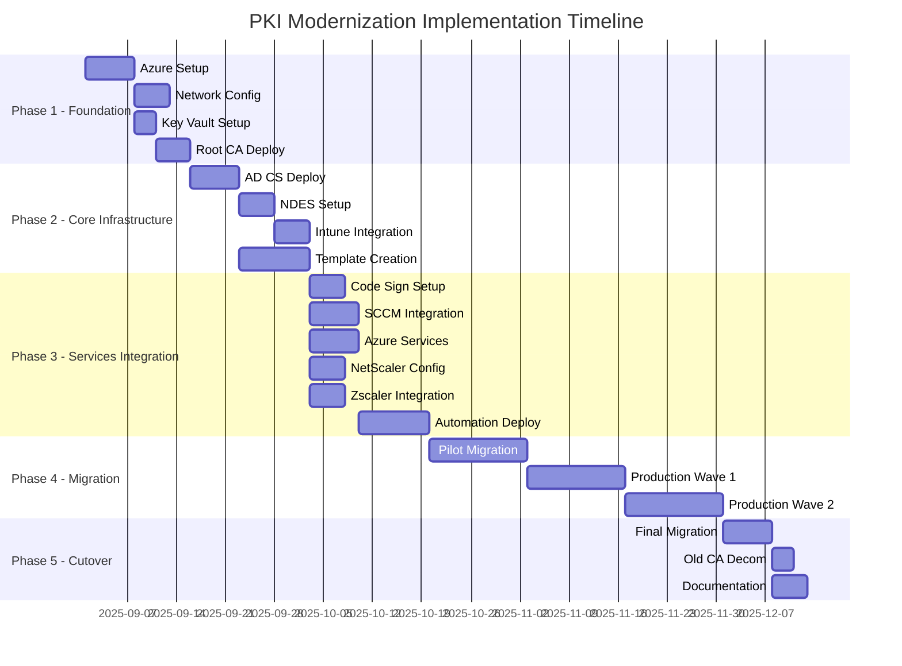
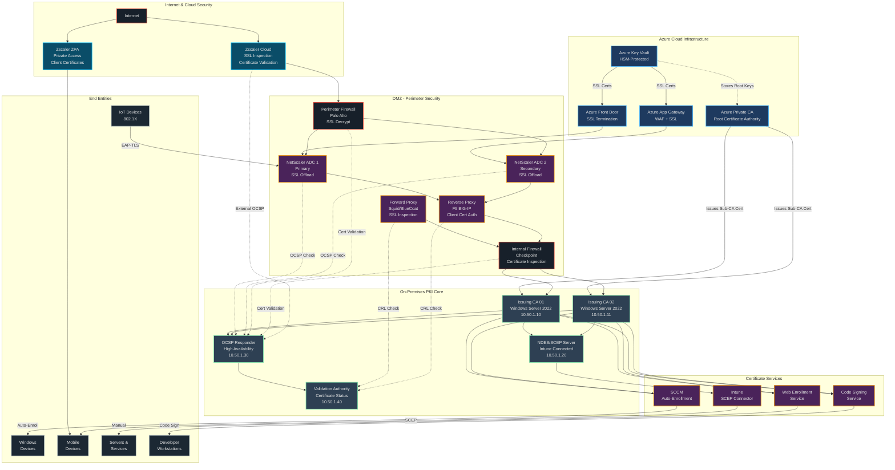
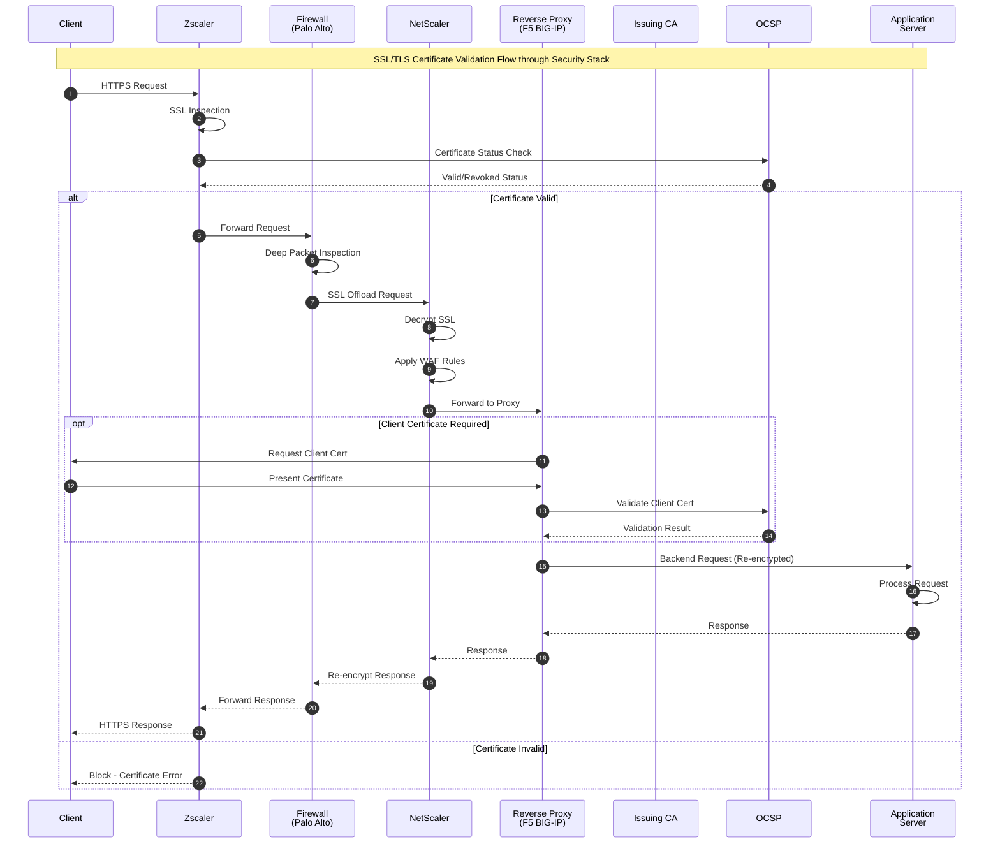
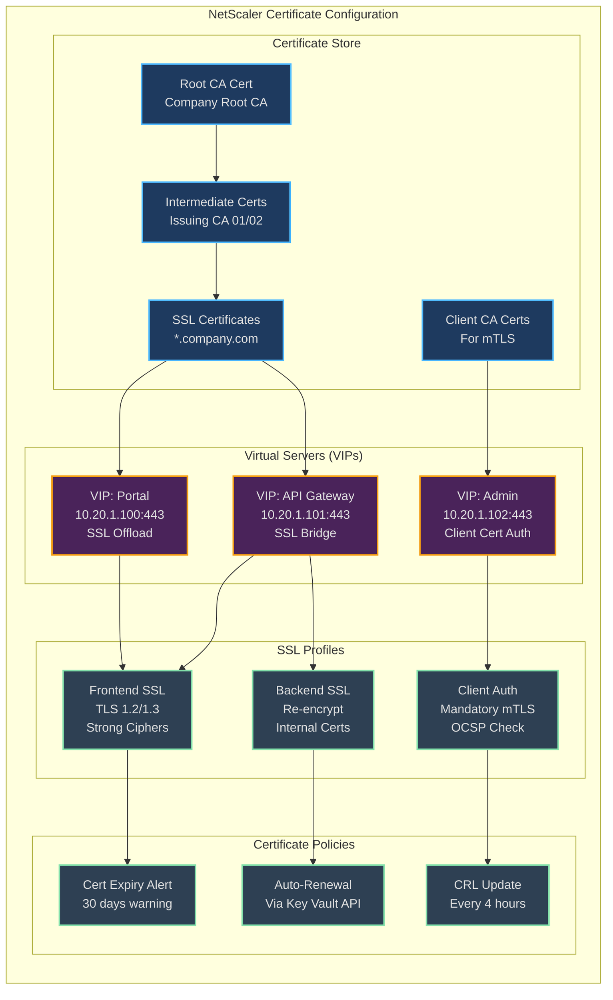
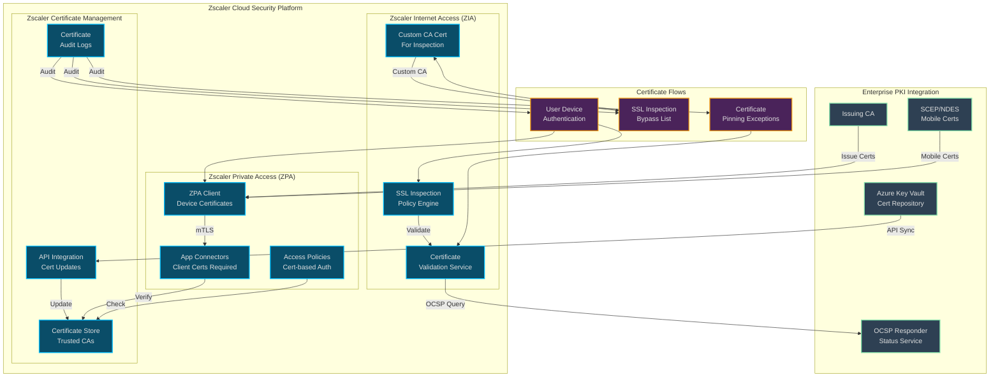
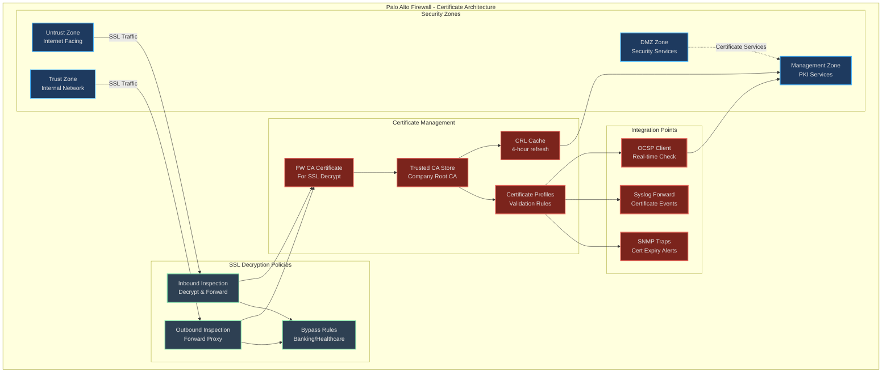
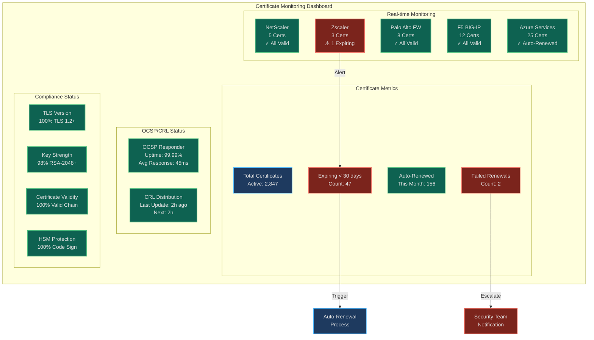

# PKI Modernization - Comprehensive Implementation Plan with Network Infrastructure

## Project Timeline Overview



## Complete Network Architecture with Security Appliances

### Enterprise PKI Infrastructure with Security Layers



### Detailed Certificate Flow through Security Appliances



### NetScaler Certificate Management Architecture



### Zscaler Integration with PKI



### Firewall Certificate Inspection Architecture



## Detailed Implementation Steps for Network Security Integration

### PHASE 3A: NetScaler Certificate Configuration (Week 5)

#### Day 26: NetScaler SSL Certificate Deployment

```bash
# NetScaler CLI Configuration
# SSH to NetScaler primary node

# 1. Upload Root and Intermediate certificates
add ssl certKey CompanyRootCA -cert "/nsconfig/ssl/CompanyRootCA.crt" -inform PEM
add ssl certKey CompanyIntCA01 -cert "/nsconfig/ssl/IssuingCA01.crt" -inform PEM
add ssl certKey CompanyIntCA02 -cert "/nsconfig/ssl/IssuingCA02.crt" -inform PEM

# 2. Link certificate chain
link ssl certKey CompanyIntCA01 CompanyRootCA
link ssl certKey CompanyIntCA02 CompanyRootCA

# 3. Create SSL certificate for services
add ssl certKey Wildcard-Company-2024 \
    -cert "/nsconfig/ssl/wildcard.company.com.crt" \
    -key "/nsconfig/ssl/wildcard.company.com.key" \
    -inform PEM \
    -expiryMonitor ENABLED \
    -notificationPeriod 30

# 4. Link server certificate to intermediate
link ssl certKey Wildcard-Company-2024 CompanyIntCA01

# 5. Create SSL profiles with strong ciphers
add ssl profile SSL-Profile-Frontend -eRSA ENABLED -eRSACount 1000 \
    -sessReuse ENABLED -sessTimeout 120 \
    -tls1 DISABLED -tls11 DISABLED -tls12 ENABLED -tls13 ENABLED \
    -HSTS ENABLED -maxage 31536000 -includeSubdomains YES

# 6. Configure OCSP responder
add ssl ocspResponder OCSP-Responder \
    -url "http://ocsp.company.com/ocsp" \
    -cache ENABLED \
    -cacheTimeout 30 \
    -batchingDepth 5 \
    -batchingDelay 10

# 7. Bind OCSP to certificate
set ssl certKey Wildcard-Company-2024 -ocspResponder OCSP-Responder

# 8. Configure client certificate authentication
add ssl certKey ClientCA-Company -cert "/nsconfig/ssl/ClientCA.crt" -inform PEM
add ssl policy ClientCert-Policy -rule "CLIENT.SSL.CLIENT_CERT.EXISTS" \
    -action ALLOW

# 9. Create virtual server with SSL
add lb vserver VS-Portal-SSL SSL 10.20.1.100 443 \
    -persistenceType SOURCEIP -timeout 120
bind lb vserver VS-Portal-SSL Wildcard-Company-2024
bind lb vserver VS-Portal-SSL -policyName ClientCert-Policy -priority 100
set ssl vserver VS-Portal-SSL -sslProfile SSL-Profile-Frontend

# 10. Enable SSL session reuse
set ssl parameter -defaultProfile ENABLED -denySSLReneg NONSECURE \
    -insertionEncoding UTF-8 -quantumSize 8192
```

#### Day 27: NetScaler Automation Integration

```powershell
# PowerShell script for NetScaler certificate automation
# Integrate with Azure Key Vault

function Update-NetScalerCertificate {
    param(
        [string]$NSIPAddress,
        [string]$Username,
        [string]$Password,
        [string]$KeyVaultName,
        [string]$CertificateName
    )

    # Get certificate from Azure Key Vault
    $cert = Get-AzKeyVaultCertificate -VaultName $KeyVaultName -Name $CertificateName
    $secret = Get-AzKeyVaultSecret -VaultName $KeyVaultName -Name $CertificateName
    $certBytes = [Convert]::FromBase64String($secret.SecretValueText)

    # Extract certificate and key
    $certCollection = New-Object System.Security.Cryptography.X509Certificates.X509Certificate2Collection
    $certCollection.Import($certBytes, $null, [System.Security.Cryptography.X509Certificates.X509KeyStorageFlags]::Exportable)

    # Connect to NetScaler
    $nsSession = Connect-NetScaler -IPAddress $NSIPAddress -Username $Username -Password $Password

    # Upload new certificate
    $certPath = "/nsconfig/ssl/$CertificateName.crt"
    $keyPath = "/nsconfig/ssl/$CertificateName.key"

    Upload-NetScalerFile -Session $nsSession -Path $certPath -Content $cert.Certificate
    Upload-NetScalerFile -Session $nsSession -Path $keyPath -Content $cert.PrivateKey

    # Update certificate binding
    $cmd = "update ssl certKey $CertificateName -cert $certPath -key $keyPath"
    Invoke-NetScalerCommand -Session $nsSession -Command $cmd

    # Save configuration
    Save-NetScalerConfig -Session $nsSession
}

# Schedule as Azure Automation Runbook
$schedule = New-AzAutomationSchedule `
    -AutomationAccountName "AA-PKI-Automation" `
    -Name "NetScaler-Cert-Update" `
    -StartTime (Get-Date).AddDays(1) `
    -MonthInterval 1 `
    -DaysOfMonth 15
```

### PHASE 3B: Zscaler PKI Integration (Week 5)

#### Day 28: Zscaler Certificate Configuration

```python
# Python script for Zscaler API integration
import requests
import json
from cryptography import x509
from cryptography.hazmat.backends import default_backend
import base64

class ZscalerPKIIntegration:
    def __init__(self, cloud, api_key, username, password):
        self.base_url = f"https://zsapi.{cloud}.net/api/v1"
        self.api_key = api_key
        self.username = username
        self.password = password
        self.session = None

    def authenticate(self):
        """Authenticate to Zscaler API"""
        auth_url = f"{self.base_url}/authenticatedSession"

        # Obfuscate credentials
        timestamp = str(int(time.time() * 1000))
        obfuscated_password = self.obfuscate_password(timestamp)

        payload = {
            "apiKey": self.api_key,
            "username": self.username,
            "password": obfuscated_password,
            "timestamp": timestamp
        }

        response = requests.post(auth_url, json=payload)
        if response.status_code == 200:
            self.session = response.cookies.get('JSESSIONID')
            return True
        return False

    def upload_intermediate_ca(self, cert_path):
        """Upload intermediate CA certificate to Zscaler"""
        url = f"{self.base_url}/sslSettings/intermediateCaCert"

        with open(cert_path, 'rb') as f:
            cert_data = f.read()

        cert = x509.load_pem_x509_certificate(cert_data, default_backend())

        payload = {
            "certificate": base64.b64encode(cert_data).decode('utf-8'),
            "description": f"Company Issuing CA - {cert.subject.rfc4514_string()}",
            "certificateUsage": "INTERMEDIATE_CA"
        }

        headers = {'Cookie': f'JSESSIONID={self.session}'}
        response = requests.post(url, json=payload, headers=headers)

        return response.json()

    def configure_ssl_inspection_policy(self):
        """Configure SSL inspection exemptions for certificate services"""
        url = f"{self.base_url}/sslSettings/exemptedUrls"

        exemptions = [
            {"url": "ocsp.company.com", "description": "Company OCSP Responder"},
            {"url": "crl.company.com", "description": "Company CRL Distribution"},
            {"url": "pki.company.com", "description": "PKI Web Enrollment"},
            {"url": "*.digicert.com", "description": "DigiCert Services"},
            {"url": "*.microsoft.com/pki/*", "description": "Microsoft PKI Services"}
        ]

        headers = {'Cookie': f'JSESSIONID={self.session}'}

        for exemption in exemptions:
            response = requests.post(url, json=exemption, headers=headers)
            print(f"Added exemption for {exemption['url']}: {response.status_code}")

    def configure_client_certificate_policy(self):
        """Configure ZPA client certificate requirements"""
        url = f"{self.base_url}/clientCertificate/profiles"

        profile = {
            "name": "Company-Device-Certificate",
            "description": "Company managed device certificates",
            "certificateAttributes": {
                "cn": "*.company.com",
                "ou": "IT Department",
                "o": "Company Inc"
            },
            "validationRules": [
                {"type": "OCSP", "url": "http://ocsp.company.com/ocsp"},
                {"type": "CRL", "url": "http://crl.company.com/crl/IssuingCA01.crl"}
            ],
            "requireStrictValidation": True
        }

        headers = {'Cookie': f'JSESSIONID={self.session}'}
        response = requests.post(url, json=profile, headers=headers)

        return response.json()

# Execute Zscaler configuration
zscaler = ZscalerPKIIntegration(
    cloud="zscaler.net",
    api_key="YOUR_API_KEY",
    username="admin@company.com",
    password="secure_password"
)

if zscaler.authenticate():
    zscaler.upload_intermediate_ca("/path/to/IssuingCA01.crt")
    zscaler.configure_ssl_inspection_policy()
    zscaler.configure_client_certificate_policy()
```

### PHASE 3C: Firewall Certificate Integration (Week 6)

#### Day 29: Palo Alto Firewall PKI Configuration

```bash
# Palo Alto PAN-OS Configuration
# Via CLI or Panorama

# 1. Import CA certificates
request certificate fetch ca-certificate url "http://pki.company.com/CompanyRootCA.crt"
request certificate fetch ca-certificate url "http://pki.company.com/IssuingCA01.crt"

# 2. Configure certificate profile for validation
set shared certificate-profile Company-Cert-Profile \
    CA CompanyRootCA \
    ocsp-url "http://ocsp.company.com/ocsp" \
    crl-receive-url "http://crl.company.com/crl/IssuingCA01.crl" \
    block-unknown-cert yes \
    block-timeout-cert yes \
    block-expired-cert yes

# 3. Create SSL decryption profile
set shared ssl-decryption ssl-forward-proxy Company-Forward-Proxy \
    strip-alpn yes \
    block-client-cert no \
    block-expired-certificate yes \
    block-untrusted-issuer yes \
    block-unknown-cert yes

# 4. Configure SSL decryption policy
set rulebase decryption rules SSL-Decrypt-Policy \
    from any to any \
    source any destination any \
    service any application any \
    decrypt-type ssl-forward-proxy \
    profile Company-Forward-Proxy \
    log-start yes log-end yes

# 5. Add SSL decryption exemptions
set rulebase decryption rules No-Decrypt-PKI \
    from any to any \
    source any destination [ ocsp.company.com crl.company.com pki.company.com ] \
    service any application any \
    action no-decrypt \
    log-start yes

# 6. Configure certificate for management interface
request certificate generate name Mgmt-Interface-Cert \
    certificate-name "CN=fw-mgmt.company.com" \
    algorithm RSA rsa-nbits 2048 \
    digest sha256 \
    signed-by external

# 7. Configure OCSP responder settings
set deviceconfig system ocsp-responder CompanyOCSP \
    url "http://ocsp.company.com/ocsp" \
    certificate-profile Company-Cert-Profile

# 8. Enable certificate status monitoring
set deviceconfig system certificate-monitoring enabled yes \
    notification-email security@company.com \
    expiry-threshold 30

# 9. Configure syslog for certificate events
set shared log-settings syslog PKI-Events \
    server PKI-Syslog server 10.50.1.50 \
    facility LOG_LOCAL3 \
    port 514 \
    format BSD

# 10. Commit configuration
commit description "PKI Integration - Certificate Management"
```

#### Day 30: F5 BIG-IP Certificate Management

```tcl
# F5 BIG-IP TMSH Configuration Script

# 1. Import certificates and keys
tmsh install sys crypto cert CompanyRootCA from-local-file /var/tmp/CompanyRootCA.crt
tmsh install sys crypto cert IssuingCA01 from-local-file /var/tmp/IssuingCA01.crt
tmsh install sys crypto cert wildcard.company.com from-local-file /var/tmp/wildcard.crt
tmsh install sys crypto key wildcard.company.com from-local-file /var/tmp/wildcard.key

# 2. Create certificate chain
tmsh create sys crypto cert-chain company-chain \
    certs add { wildcard.company.com IssuingCA01 CompanyRootCA }

# 3. Create client SSL profile with OCSP
tmsh create ltm profile client-ssl Company-ClientSSL \
    cert wildcard.company.com \
    key wildcard.company.com \
    chain company-chain \
    ciphers "ECDHE+RSA+AES256:ECDHE+RSA+AES128:!MD5:!EXPORT:!DES:!DHE:!EDH:!RC4:!ADH:!SSLv3:!TLSv1" \
    options { dont-insert-empty-fragments no-tlsv1 no-tlsv1.1 } \
    ocsp-stapling enabled

# 4. Create server SSL profile for backend
tmsh create ltm profile server-ssl Company-ServerSSL \
    cert wildcard.company.com \
    key wildcard.company.com \
    ciphers "DEFAULT" \
    secure-renegotiation require

# 5. Configure OCSP responder
tmsh create ltm auth ocsp-responder CompanyOCSP \
    url http://ocsp.company.com/ocsp \
    signer wildcard.company.com

# 6. Create certificate validation profile
tmsh create ltm auth cert-ldap Company-Cert-Validation \
    servers add { 10.50.1.40 } \
    search-base "dc=company,dc=com" \
    search-filter "(objectClass=pkiUser)"

# 7. Configure client certificate authentication
tmsh create ltm auth ssl-cc-ldap Company-Client-Cert \
    cert-validation Company-Cert-Validation \
    cert-map { cert-subject-cn }

# 8. Create iRule for certificate inspection
tmsh create ltm rule Certificate-Logging {
    when CLIENTSSL_CLIENTCERT {
        if {[SSL::cert count] > 0} {
            set subject [X509::subject [SSL::cert 0]]
            set issuer [X509::issuer [SSL::cert 0]]
            set serial [X509::serial_number [SSL::cert 0]]
            log local0. "Client Certificate: Subject=$subject Issuer=$issuer Serial=$serial"

            # Check certificate validity
            set notafter [X509::not_after [SSL::cert 0]]
            set now [clock seconds]
            set expire_days [expr {($notafter - $now) / 86400}]

            if {$expire_days < 30} {
                log local0.warning "Certificate expiring soon: $subject expires in $expire_days days"
            }
        }
    }
}

# 9. Apply to virtual server
tmsh create ltm virtual VS-Portal-443 \
    destination 10.20.1.103:443 \
    ip-protocol tcp \
    profiles add { Company-ClientSSL { context clientside } Company-ServerSSL { context serverside } } \
    rules { Certificate-Logging } \
    source-address-translation { type automap } \
    pool Portal-Pool

# 10. Configure automatic certificate renewal via iControl REST
tmsh create sys application service PKI-Auto-Renewal \
    template f5.http \
    variables add { \
        renewal_script { value {
            # Script to check and renew certificates
            # Integrates with Azure Key Vault API
        }}
    }

# Save configuration
tmsh save sys config
```

## Network Security Certificate Monitoring Dashboard



## Complete Network Segment Certificate Requirements

### Network Segmentation and Certificate Matrix

| Network Segment | IP Range | Certificate Type | Issuing CA | Validity | Key Size | Special Requirements |
|-----------------|----------|------------------|------------|----------|----------|----------------------|
| **Internet Edge** | | | | | | |
| Zscaler Cloud | N/A | SSL Inspection CA | Zscaler CA | 10 years | RSA-4096 | Custom root for inspection |
| Azure Front Door | N/A | Public SSL | DigiCert | 1 year | RSA-2048 | Public trusted, CAA records |
| **DMZ - Perimeter** | 10.20.0.0/16 | | | | | |
| NetScaler VIPs | 10.20.1.0/24 | Wildcard SSL | ICA-01 | 2 years | RSA-2048 | OCSP stapling enabled |
| F5 BIG-IP | 10.20.2.0/24 | SAN Certificate | ICA-01 | 2 years | RSA-2048 | Multiple FQDNs |
| Palo Alto FW | 10.20.3.0/24 | Mgmt + Decrypt CA | ICA-02 | 3 years | RSA-4096 | HSM-backed decrypt cert |
| Forward Proxy | 10.20.4.0/24 | Proxy CA | ICA-02 | 5 years | RSA-4096 | Chain validation required |
| **Internal Zones** | | | | | | |
| Corporate LAN | 10.10.0.0/16 | Computer Certs | ICA-01 | 2 years | RSA-2048 | Auto-enrollment GPO |
| Server Farm | 10.30.0.0/16 | Server Auth | ICA-01 | 2 years | RSA-2048 | IIS, Apache, Nginx |
| Database Tier | 10.40.0.0/16 | SQL TLS | ICA-02 | 3 years | RSA-2048 | Force encryption |
| PKI Core | 10.50.0.0/16 | Infrastructure | Root CA | 10 years | RSA-4096 | Offline root, HSM |
| **Special Purpose** | | | | | | |
| IoT Devices | 10.60.0.0/16 | 802.1X EAP-TLS | ICA-01 | 5 years | ECC-P256 | Low computational overhead |
| VoIP Phones | 10.70.0.0/16 | SCEP Enrolled | NDES | 3 years | RSA-2048 | Cisco ISE integration |
| Wireless | 10.80.0.0/16 | RADIUS/EAP | ICA-01 | 2 years | RSA-2048 | NPS/FreeRADIUS |
| VPN Users | Dynamic | User Certificates | ICA-01 | 1 year | RSA-2048 | Smart card compatible |

## Automation Scripts for Network Appliances

### Universal Certificate Deployment Script

```powershell
# Master certificate deployment script for all network appliances
# Save as Deploy-CertificateToAppliances.ps1

param(
    [Parameter(Mandatory=$true)]
    [string]$CertificatePath,

    [Parameter(Mandatory=$true)]
    [string]$PrivateKeyPath,

    [Parameter(Mandatory=$true)]
    [ValidateSet("NetScaler", "F5", "PaloAlto", "Zscaler", "All")]
    [string]$TargetAppliance,

    [Parameter(Mandatory=$false)]
    [string]$ConfigFile = ".\appliance-config.json"
)

# Load configuration
$config = Get-Content $ConfigFile | ConvertFrom-Json

function Deploy-ToNetScaler {
    param($cert, $key, $config)

    $nsSession = Connect-NetScaler -IPAddress $config.NetScaler.IP `
        -Username $config.NetScaler.Username `
        -Password (ConvertTo-SecureString $config.NetScaler.Password -AsPlainText -Force)

    # Upload certificate files
    $certName = [System.IO.Path]::GetFileNameWithoutExtension($cert)
    Upload-NetScalerFile -Session $nsSession -Path "/nsconfig/ssl/$certName.crt" -LocalFile $cert
    Upload-NetScalerFile -Session $nsSession -Path "/nsconfig/ssl/$certName.key" -LocalFile $key

    # Create certificate object
    $cmd = "add ssl certKey $certName -cert /nsconfig/ssl/$certName.crt -key /nsconfig/ssl/$certName.key"
    Invoke-NetScalerCommand -Session $nsSession -Command $cmd

    # Update bindings
    foreach ($vserver in $config.NetScaler.VirtualServers) {
        $cmd = "bind ssl vserver $vserver -certkeyName $certName"
        Invoke-NetScalerCommand -Session $nsSession -Command $cmd
    }

    Save-NetScalerConfig -Session $nsSession
    Write-Host "Successfully deployed certificate to NetScaler" -ForegroundColor Green
}

function Deploy-ToF5 {
    param($cert, $key, $config)

    # F5 iControl REST API
    $headers = @{
        'Content-Type' = 'application/json'
        'Authorization' = "Basic " + [Convert]::ToBase64String([Text.Encoding]::ASCII.GetBytes("$($config.F5.Username):$($config.F5.Password)"))
    }

    $certContent = Get-Content $cert -Raw
    $keyContent = Get-Content $key -Raw

    # Upload certificate
    $certBody = @{
        name = "wildcard-company-$(Get-Date -Format 'yyyy')"
        cert = $certContent
        key = $keyContent
    } | ConvertTo-Json

    $uri = "https://$($config.F5.IP)/mgmt/tm/sys/crypto/cert"
    Invoke-RestMethod -Uri $uri -Method Post -Headers $headers -Body $certBody -SkipCertificateCheck

    Write-Host "Successfully deployed certificate to F5 BIG-IP" -ForegroundColor Green
}

function Deploy-ToPaloAlto {
    param($cert, $key, $config)

    # Generate API key
    $authUri = "https://$($config.PaloAlto.IP)/api/?type=keygen&user=$($config.PaloAlto.Username)&password=$($config.PaloAlto.Password)"
    $authResponse = Invoke-RestMethod -Uri $authUri -Method Get -SkipCertificateCheck
    $apiKey = $authResponse.response.result.key

    # Import certificate
    $certContent = [Convert]::ToBase64String([System.IO.File]::ReadAllBytes($cert))
    $keyContent = [Convert]::ToBase64String([System.IO.File]::ReadAllBytes($key))

    $importUri = "https://$($config.PaloAlto.IP)/api/?type=import&category=certificate"
    $importUri += "&certificate-name=wildcard-company&format=pem&key=$apiKey"

    $body = @{
        certificate = $certContent
        private_key = $keyContent
    }

    Invoke-RestMethod -Uri $importUri -Method Post -Body $body -SkipCertificateCheck

    # Commit configuration
    $commitUri = "https://$($config.PaloAlto.IP)/api/?type=commit&key=$apiKey"
    Invoke-RestMethod -Uri $commitUri -Method Get -SkipCertificateCheck

    Write-Host "Successfully deployed certificate to Palo Alto firewall" -ForegroundColor Green
}

function Deploy-ToZscaler {
    param($cert, $key, $config)

    # Zscaler API implementation
    $baseUrl = "https://zsapi.$($config.Zscaler.Cloud)/api/v1"

    # Authenticate
    $authBody = @{
        apiKey = $config.Zscaler.ApiKey
        username = $config.Zscaler.Username
        password = $config.Zscaler.Password
        timestamp = [DateTimeOffset]::UtcNow.ToUnixTimeMilliseconds()
    } | ConvertTo-Json

    $session = Invoke-RestMethod -Uri "$baseUrl/authenticatedSession" -Method Post -Body $authBody

    # Upload certificate
    $certContent = Get-Content $cert -Raw
    $uploadBody = @{
        certificate = [Convert]::ToBase64String([Text.Encoding]::UTF8.GetBytes($certContent))
        type = "INTERMEDIATE_CA"
    } | ConvertTo-Json

    $headers = @{
        'Cookie' = "JSESSIONID=$($session.jsessionid)"
        'Content-Type' = 'application/json'
    }

    Invoke-RestMethod -Uri "$baseUrl/sslSettings/intermediateCaCert" -Method Post -Headers $headers -Body $uploadBody

    Write-Host "Successfully deployed certificate to Zscaler" -ForegroundColor Green
}

# Main execution
try {
    $certificate = Get-Content $CertificatePath
    $privateKey = Get-Content $PrivateKeyPath

    switch ($TargetAppliance) {
        "NetScaler" { Deploy-ToNetScaler -cert $CertificatePath -key $PrivateKeyPath -config $config }
        "F5" { Deploy-ToF5 -cert $CertificatePath -key $PrivateKeyPath -config $config }
        "PaloAlto" { Deploy-ToPaloAlto -cert $CertificatePath -key $PrivateKeyPath -config $config }
        "Zscaler" { Deploy-ToZscaler -cert $CertificatePath -key $PrivateKeyPath -config $config }
        "All" {
            Deploy-ToNetScaler -cert $CertificatePath -key $PrivateKeyPath -config $config
            Deploy-ToF5 -cert $CertificatePath -key $PrivateKeyPath -config $config
            Deploy-ToPaloAlto -cert $CertificatePath -key $PrivateKeyPath -config $config
            Deploy-ToZscaler -cert $CertificatePath -key $PrivateKeyPath -config $config
        }
    }

    Write-Host "`nCertificate deployment completed successfully!" -ForegroundColor Green

} catch {
    Write-Error "Certificate deployment failed: $_"
    exit 1
}
```

### Configuration File (appliance-config.json)

```json
{
    "NetScaler": {
        "IP": "10.20.1.10",
        "Username": "nsadmin",
        "Password": "encrypted_password_here",
        "VirtualServers": [
            "VS-Portal-SSL",
            "VS-API-SSL",
            "VS-Admin-SSL"
        ]
    },
    "F5": {
        "IP": "10.20.2.10",
        "Username": "admin",
        "Password": "encrypted_password_here",
        "Partitions": ["Common", "Production"]
    },
    "PaloAlto": {
        "IP": "10.20.3.10",
        "Username": "admin",
        "Password": "encrypted_password_here",
        "Vsys": "vsys1"
    },
    "Zscaler": {
        "Cloud": "zscaler.net",
        "ApiKey": "api_key_here",
        "Username": "admin@company.com",
        "Password": "encrypted_password_here"
    }
}
```

## Comprehensive Testing Plan

### Certificate Validation Test Matrix

```powershell
# Comprehensive certificate validation script
# Test-EnterprisePKI.ps1

function Test-EnterprisePKI {
    $results = @()

    # Test NetScaler certificates
    $nsTests = @(
        @{Name="Portal VIP"; URL="https://portal.company.com"; ExpectedCN="*.company.com"},
        @{Name="API Gateway"; URL="https://api.company.com"; ExpectedCN="*.company.com"},
        @{Name="Admin Interface"; URL="https://admin.company.com:443"; ClientCert=$true}
    )

    foreach ($test in $nsTests) {
        $result = Test-SSLCertificate @test
        $results += $result
    }

    # Test Zscaler integration
    $zsTests = @(
        @{Name="ZPA Portal"; URL="https://company.privateaccess.zscaler.com"; ExpectedCA="Zscaler"},
        @{Name="ZIA Gateway"; URL="https://gateway.zscaler.net"; SSLInspection=$true}
    )

    foreach ($test in $zsTests) {
        $result = Test-ZscalerCertificate @test
        $results += $result
    }

    # Test firewall certificates
    $fwTests = @(
        @{Name="Palo Alto Mgmt"; URL="https://fw-mgmt.company.com"; ExpectedCN="fw-mgmt.company.com"},
        @{Name="GlobalProtect"; URL="https://vpn.company.com"; ClientCert=$true}
    )

    foreach ($test in $fwTests) {
        $result = Test-FirewallCertificate @test
        $results += $result
    }

    # Generate report
    $results | Export-Csv -Path ".\PKI-Test-Results-$(Get-Date -Format 'yyyyMMdd').csv"

    # Create HTML dashboard
    $html = $results | ConvertTo-Html -Head @"
<style>
    body { background-color: #1e1e1e; color: #e0e0e0; font-family: Arial; }
    table { border-collapse: collapse; width: 100%; }
    th { background-color: #2e4053; color: #4db8ff; padding: 10px; }
    td { padding: 8px; border: 1px solid #34495e; }
    .pass { color: #52be80; }
    .fail { color: #ec7063; }
</style>
"@

    $html | Out-File ".\PKI-Dashboard.html"

    return $results
}

# Execute comprehensive test
$testResults = Test-EnterprisePKI

# Alert on failures
$failures = $testResults | Where-Object {$_.Status -eq "Failed"}
if ($failures.Count -gt 0) {
    Send-MailMessage -To "security@company.com" `
        -Subject "PKI Test Failures Detected" `
        -Body ($failures | Format-Table | Out-String) `
        -SmtpServer "smtp.company.com"
}
```

This comprehensive update includes all network security appliances (NetScaler, Zscaler, Palo Alto, F5), their certificate management configurations, detailed implementation steps, and automation scripts. The diagrams are designed with dark-mode friendly colors and show the complete certificate flow through your security stack.
