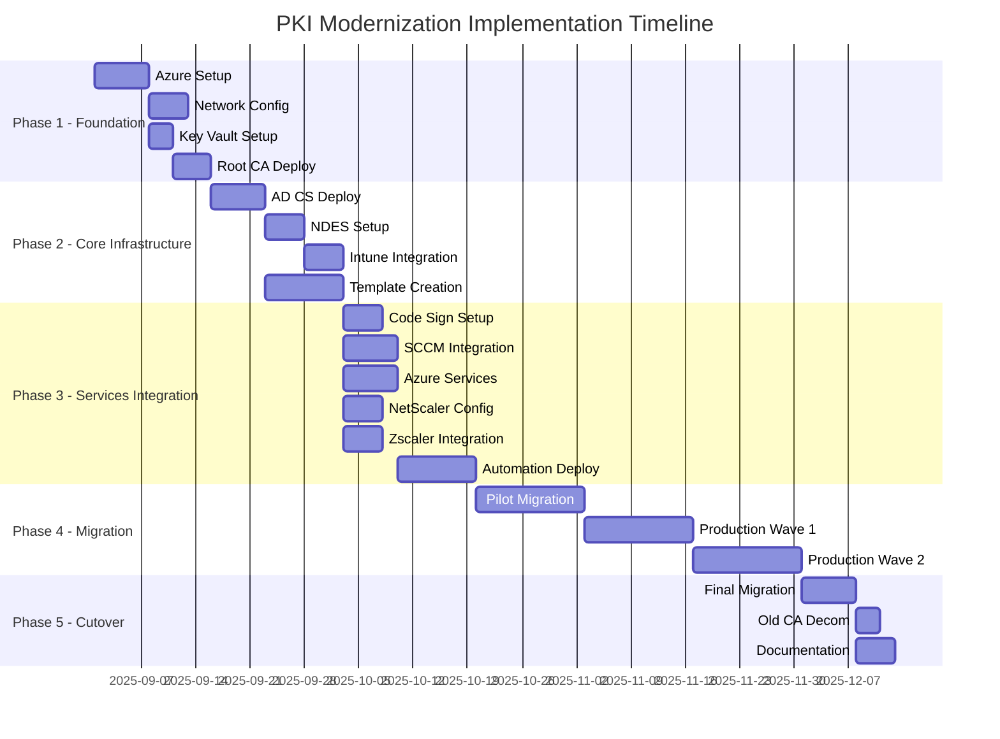

# PKI Modernization - Project Timeline Overview

[← Back to Index](00-index.md) | [Next: Network Architecture →](02-network-architecture.md)

## Project Timeline Overview

This document outlines the complete timeline for the PKI modernization project, spanning 11 weeks from initial setup to final cutover.

## Phase Summary

### Phase 1: Foundation Setup (Weeks 1-2)
**Duration**: 2 weeks  
**Key Deliverables**:
- Azure infrastructure provisioned in Australia East region
- Virtual networks and security groups configured
- Azure Key Vault with HSM protection deployed
- Azure Private CA (Root) established

### Phase 2: Core Infrastructure Deployment (Weeks 3-4)
**Duration**: 2 weeks  
**Key Deliverables**:
- Two issuing CAs deployed on Windows Server 2022
- NDES/SCEP server configured
- Microsoft Intune Certificate Connector installed
- Certificate templates created and configured

### Phase 3: Services Integration (Weeks 5-6)
**Duration**: 2 weeks  
**Key Deliverables**:
- Code signing infrastructure operational
- SCCM integrated for auto-enrollment
- Azure services certificate automation configured
- NetScaler and Zscaler integration completed
- Monitoring and automation deployed

### Phase 4: Migration Execution (Weeks 7-10)
**Duration**: 4 weeks  
**Key Deliverables**:
- Pilot group (10% of environment) successfully migrated
- Production Wave 1 (40% of environment) completed
- Production Wave 2 (remaining 50%) completed
- All certificates validated and operational

### Phase 5: Cutover and Decommissioning (Week 11)
**Duration**: 1 week  
**Key Deliverables**:
- Final migration completed
- Old CA infrastructure decommissioned
- Complete documentation delivered
- Knowledge transfer completed

## Critical Milestones

| Week | Milestone | Success Criteria |
|------|-----------|------------------|
| 1 | Azure Foundation Ready | All Azure resources provisioned, Key Vault operational |
| 2 | Root CA Operational | Azure Private CA issuing certificates, CRL distribution active |
| 4 | Issuing CAs Online | Both issuing CAs operational, NDES/SCEP functional |
| 6 | Services Integrated | All certificate services automated and monitored |
| 8 | Pilot Complete | 10% of environment using new PKI, no critical issues |
| 10 | Production Migration Complete | 100% of environment migrated, <1% failure rate |
| 11 | Project Complete | Old infrastructure decommissioned, documentation delivered |

## Resource Requirements

### Team Composition
- **Project Manager**: 1 FTE for 11 weeks
- **PKI Architect**: 1 FTE for 11 weeks
- **Azure Engineers**: 2 FTE for weeks 1-2, 1 FTE ongoing
- **Windows/AD Engineers**: 2 FTE for weeks 3-4, 1 FTE ongoing
- **Network Engineers**: 1 FTE for weeks 1-2, 0.5 FTE ongoing
- **Security Team**: 0.5 FTE throughout project

### Infrastructure Requirements
- **Azure Subscription**: Production-ready with appropriate limits
- **Virtual Machines**: 4x D4s_v3 (2 Issuing CAs, 1 NDES, 1 OCSP)
- **Azure Key Vault**: Premium tier with HSM
- **Storage**: 2TB for CA database and logs
- **Network**: ExpressRoute or VPN to on-premises

## Risk Mitigation Timeline

| Week | Risk Area | Mitigation Actions |
|------|-----------|-------------------|
| 1-2 | Azure setup delays | Pre-provision subscription, validate quotas |
| 3-4 | AD integration issues | Test in lab environment first |
| 5-6 | Service compatibility | Vendor engagement, compatibility testing |
| 7-8 | Pilot failures | Rollback procedures, extended pilot if needed |
| 9-10 | Production impact | Phased approach, maintenance windows |
| 11 | Decommission risks | Complete backups, 30-day retention |

## Communication Plan

### Weekly Stakeholder Updates
- **Monday**: Status report to steering committee
- **Wednesday**: Technical team sync
- **Friday**: Risk and issue review

### Key Communication Milestones
- **Week 0**: Project kickoff and communication to all stakeholders
- **Week 2**: Foundation complete announcement
- **Week 6**: Pilot group notification
- **Week 8**: Production migration schedule communication
- **Week 11**: Project completion and handover

## Success Metrics

### Time-Based Metrics
- Project delivered within 11-week timeline
- Each phase completed within allocated time
- <5% schedule variance

### Quality Metrics
- Zero security incidents during implementation
- <1% certificate issuance failures
- 100% successful migrations (with retry)
- All compliance requirements met

### Business Metrics
- Zero business disruption during migration
- Certificate issuance time reduced by 75%
- Manual intervention reduced by 80%
- Cost per certificate reduced by 40%

---
[← Back to Index](00-index.md) | [Next: Network Architecture →](02-network-architecture.md)