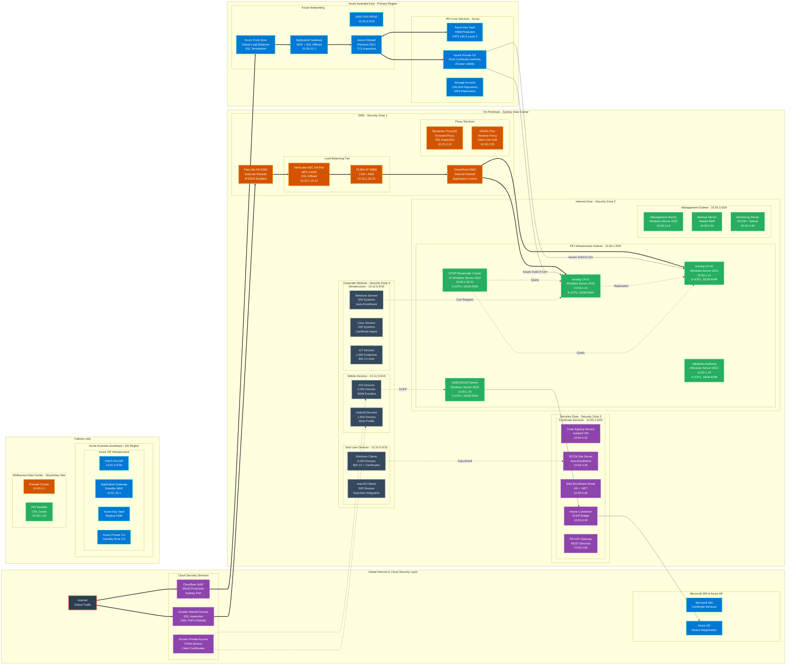
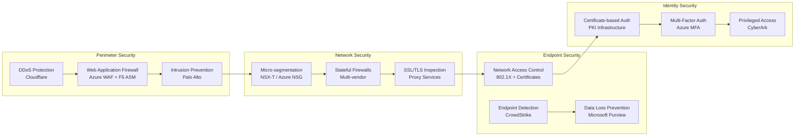
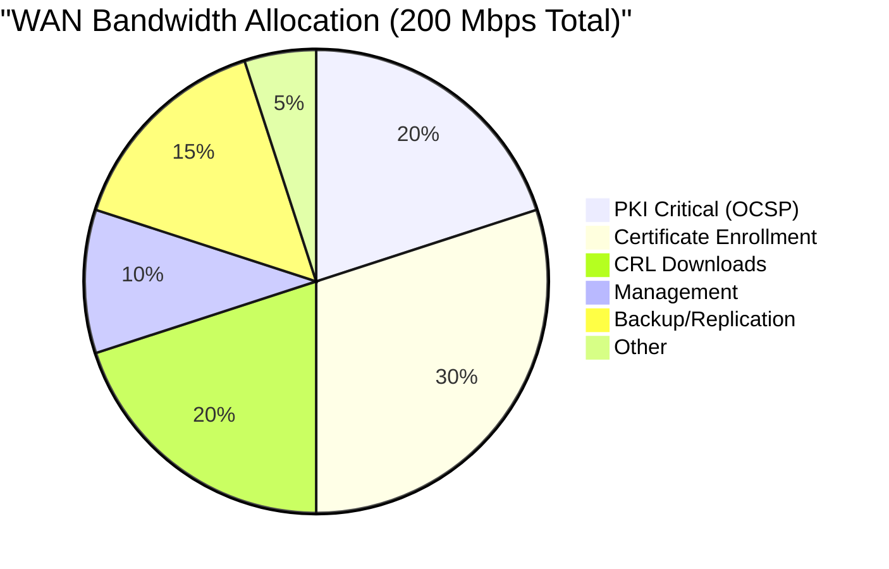
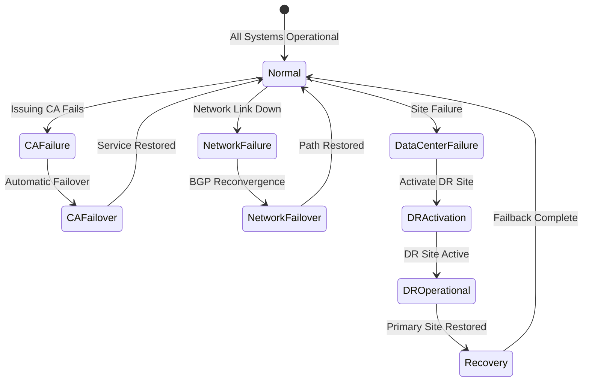
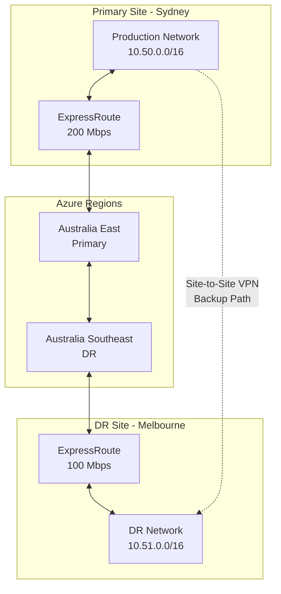

# PKI Modernization - Enterprise Network Architecture & Security Design

[← Previous: Project Timeline](01-project-timeline.md) | [Back to Index](00-index.md) | [Next: PKI Hierarchy →](03-pki-hierarchy.md)

## Executive Summary

This document provides the comprehensive network architecture design for the enterprise PKI modernization project, detailing all network segments, security zones, connectivity requirements, and integration points with security appliances. The architecture supports a zero-trust security model while ensuring high availability and optimal performance across Australian data centers.

## Network Architecture Overview

### Design Principles
- **Zero-Trust Security**: Never trust, always verify with certificate-based authentication
- **Defense in Depth**: Multiple layers of security controls
- **Micro-segmentation**: Granular network isolation for PKI components
- **High Availability**: No single point of failure across all critical paths
- **Geographic Resilience**: Multi-region deployment across Australia
- **Performance Optimization**: CDN and local caching for certificate services

## Complete Network Topology



## Network Segmentation Design

### Azure Virtual Networks

| Network | CIDR Block | Region | Purpose | Subnets |
|---------|------------|--------|---------|---------|
| VNET-PKI-PROD | 10.50.0.0/16 | Australia East | Production PKI | 6 subnets |
| VNET-PKI-DR | 10.51.0.0/16 | Australia Southeast | Disaster Recovery | 4 subnets |
| VNET-HUB-AUE | 10.52.0.0/16 | Australia East | Hub Network | 8 subnets |
| VNET-HUB-AUSE | 10.53.0.0/16 | Australia Southeast | Hub Network DR | 8 subnets |

### Detailed Subnet Allocation

#### Production PKI Network (10.50.0.0/16)

| Subnet Name | CIDR | VLAN | Hosts | Purpose |
|-------------|------|------|-------|---------|
| PKI-Core | 10.50.1.0/24 | 501 | 254 | Certificate Authorities |
| PKI-HSM | 10.50.2.0/24 | 502 | 254 | HSM Integration |
| PKI-Mgmt | 10.50.3.0/24 | 503 | 254 | Management Services |
| PKI-Services | 10.50.4.0/24 | 504 | 254 | Certificate Services |
| PKI-Web | 10.50.5.0/24 | 505 | 254 | Web Services |
| AzureBastionSubnet | 10.50.250.0/24 | - | 254 | Secure RDP/SSH |
| AzureFirewallSubnet | 10.50.254.0/24 | - | 254 | Azure Firewall |
| GatewaySubnet | 10.50.255.0/24 | - | 254 | VPN/ExpressRoute |

#### On-Premises Networks

| Network | CIDR | Location | Devices | Purpose |
|---------|------|----------|---------|---------|
| DMZ-External | 10.20.0.0/23 | Sydney DC | 50 | External-facing services |
| DMZ-Internal | 10.20.2.0/23 | Sydney DC | 50 | Internal-facing services |
| Corp-Clients | 10.10.0.0/16 | Sydney | 5,500 | End user devices |
| Corp-Mobile | 10.11.0.0/16 | Sydney | 3,500 | Mobile devices |
| Corp-Servers | 10.12.0.0/16 | Sydney | 700 | Infrastructure servers |
| Melbourne-Site | 10.60.0.0/16 | Melbourne | 2,000 | Secondary site |

## Security Architecture

### Security Zones Definition

| Zone | Trust Level | Description | Controls |
|------|-------------|-------------|----------|
| Zone 0 - Internet | Untrusted | Public internet | DDoS, WAF, IPS |
| Zone 1 - DMZ | Low Trust | Perimeter services | Firewall, IDS, SSL inspection |
| Zone 2 - PKI Core | High Trust | Certificate authorities | Micro-segmentation, HSM |
| Zone 3 - Services | Medium Trust | Certificate services | RBAC, API gateway |
| Zone 4 - Corporate | Medium Trust | End user network | 802.1X, certificates |
| Zone 5 - Management | Restricted | Admin access | Jump servers, MFA, PAM |

### Network Security Controls



## Connectivity Architecture

### ExpressRoute Configuration

| Circuit | Location | Bandwidth | Provider | Peering |
|---------|----------|-----------|----------|---------|
| ER-SYD-PRIMARY | Sydney | 200 Mbps | Telstra | Private + Microsoft |
| ER-SYD-BACKUP | Sydney | 100 Mbps | Optus | Private |
| ER-MEL-PRIMARY | Melbourne | 100 Mbps | Telstra | Private |

### VPN Architecture

```yaml
Site-to-Site VPNs:
  Sydney-to-Azure:
    Type: IPSec IKEv2
    Bandwidth: 100 Mbps
    Encryption: AES-256
    Hash: SHA-256
    DH Group: 14
    SA Lifetime: 3600 seconds
    Redundancy: Active-Standby

  Melbourne-to-Azure:
    Type: IPSec IKEv2
    Bandwidth: 50 Mbps
    Encryption: AES-256
    Hash: SHA-256
    DH Group: 14
    SA Lifetime: 3600 seconds
    Redundancy: Active-Standby

Point-to-Site VPN:
  Protocol: OpenVPN
  Authentication: Certificate-based
  Encryption: AES-256-GCM
  Port: 443/TCP
  Client Pool: 10.99.0.0/24
  Max Clients: 250
```

### BGP Routing Design

| Neighbor | AS Number | Networks Advertised | Communities |
|----------|-----------|-------------------|-------------|
| Azure ExpressRoute | 12076 | 10.50.0.0/16, 10.51.0.0/16 | 12076:5020 |
| Sydney Core | 65001 | 10.10.0.0/16, 10.12.0.0/16 | 65001:100 |
| Melbourne Core | 65002 | 10.60.0.0/16 | 65002:100 |
| Internet Edge | 65000 | 0.0.0.0/0 (default) | 65000:666 |

## Port Matrix & Firewall Rules

### Critical PKI Ports

| Service | Port | Protocol | Source | Destination | Direction |
|---------|------|----------|--------|-------------|-----------|
| HTTPS/Enrollment | 443 | TCP | Any | PKI Web Services | Inbound |
| HTTP/CRL | 80 | TCP | Any | CRL Distribution | Inbound |
| HTTP/OCSP | 80 | TCP | Any | OCSP Responder | Inbound |
| RPC Endpoint | 135 | TCP | PKI Mgmt | Issuing CAs | Bidirectional |
| SMB/CIFS | 445 | TCP | PKI Services | Issuing CAs | Inbound |
| LDAP | 389 | TCP | Issuing CAs | Domain Controllers | Outbound |
| LDAPS | 636 | TCP | Issuing CAs | Domain Controllers | Outbound |
| Kerberos | 88 | TCP/UDP | PKI Servers | Domain Controllers | Bidirectional |
| DNS | 53 | TCP/UDP | PKI Servers | DNS Servers | Outbound |
| NTP | 123 | UDP | PKI Servers | NTP Servers | Outbound |
| Dynamic RPC | 49152-65535 | TCP | PKI Mgmt | Issuing CAs | Inbound |
| SCEP/NDES | 443 | TCP | Mobile Devices | NDES Server | Inbound |
| Syslog | 514 | UDP | PKI Servers | SIEM | Outbound |
| SNMP | 161 | UDP | Monitoring | PKI Servers | Inbound |

### Firewall Rule Priorities

```python
# Firewall Rules Configuration (Priority Order)
rules = [
    # Priority 100-199: Security & Management
    {"priority": 100, "name": "Allow-Management-Access", "source": "10.50.3.0/24", "dest": "10.50.1.0/24", "port": "any", "action": "allow"},
    {"priority": 110, "name": "Allow-Monitoring", "source": "10.50.3.30/32", "dest": "10.50.0.0/16", "port": "161,514", "action": "allow"},
    {"priority": 120, "name": "Allow-Backup", "source": "10.50.3.20/32", "dest": "10.50.1.0/24", "port": "445,135", "action": "allow"},

    # Priority 200-299: PKI Core Services
    {"priority": 200, "name": "Allow-CA-Replication", "source": "10.50.1.10/32", "dest": "10.50.1.11/32", "port": "445,135,49152-65535", "action": "allow"},
    {"priority": 210, "name": "Allow-OCSP-Queries", "source": "any", "dest": "10.50.1.30-31", "port": "80", "action": "allow"},
    {"priority": 220, "name": "Allow-CRL-Download", "source": "any", "dest": "10.50.5.0/24", "port": "80", "action": "allow"},

    # Priority 300-399: Certificate Services
    {"priority": 300, "name": "Allow-Web-Enrollment", "source": "10.10.0.0/16", "dest": "10.50.4.30/32", "port": "443", "action": "allow"},
    {"priority": 310, "name": "Allow-SCEP-Enrollment", "source": "10.11.0.0/16", "dest": "10.50.1.20/32", "port": "443", "action": "allow"},
    {"priority": 320, "name": "Allow-API-Access", "source": "10.12.0.0/16", "dest": "10.50.4.50/32", "port": "443", "action": "allow"},

    # Priority 400-499: Azure Integration
    {"priority": 400, "name": "Allow-Azure-Sync", "source": "10.50.1.0/24", "dest": "AzureCloud.AustraliaEast", "port": "443", "action": "allow"},
    {"priority": 410, "name": "Allow-KeyVault-Access", "source": "10.50.1.0/24", "dest": "AzureKeyVault.AustraliaEast", "port": "443", "action": "allow"},

    # Priority 1000: Default Deny
    {"priority": 1000, "name": "Deny-All", "source": "any", "dest": "any", "port": "any", "action": "deny"}
]
```

## Load Balancing Architecture

### NetScaler ADC Configuration

```yaml
Virtual Servers:
  PKI-Web-VIP:
    IP: 10.20.1.100
    Port: 443
    Protocol: SSL
    Method: Least Connection
    Persistence: Source IP (2 hours)
    SSL Profile: TLS1.2+ Only
    Client Auth: Optional
    Backend Servers:
      - 10.50.4.30:443 (Web Enrollment)
      - 10.50.4.31:443 (Web Enrollment Backup)
    Health Check:
      Type: HTTPS
      Path: /certsrv/health
      Interval: 10s
      Timeout: 3s
      Retries: 3

  OCSP-VIP:
    IP: 10.20.1.101
    Port: 80
    Protocol: HTTP
    Method: Round Robin
    Persistence: None
    Backend Servers:
      - 10.50.1.30:80 (OCSP Primary)
      - 10.50.1.31:80 (OCSP Secondary)
    Health Check:
      Type: HTTP
      Path: /ocsp/health
      Interval: 5s
      Timeout: 2s
      Retries: 2

  SCEP-VIP:
    IP: 10.20.1.102
    Port: 443
    Protocol: SSL
    Method: Least Connection
    Persistence: Cookie-based
    Backend Server:
      - 10.50.1.20:443 (NDES Server)
    Health Check:
      Type: TCP
      Port: 443
      Interval: 10s
```

### F5 BIG-IP Configuration

```tcl
# F5 LTM Configuration
ltm virtual /PKI/vs_pki_api {
    destination 10.20.1.200:443
    ip-protocol tcp
    mask 255.255.255.255
    pool /PKI/pool_pki_api
    profiles {
        /Common/tcp { }
        /PKI/clientssl_pki {
            context clientside
        }
        /PKI/serverssl_pki {
            context serverside
        }
        /Common/http { }
    }
    source 0.0.0.0/0
    source-address-translation {
        type automap
    }
}

ltm pool /PKI/pool_pki_api {
    load-balancing-mode least-connections-member
    members {
        /PKI/10.50.4.50:443 {
            address 10.50.4.50
            monitor /PKI/mon_https_api
        }
        /PKI/10.50.4.51:443 {
            address 10.50.4.51
            monitor /PKI/mon_https_api
        }
    }
}
```

## DNS Architecture

### DNS Zones & Records

| Zone | Type | Record | Value | TTL |
|------|------|--------|-------|-----|
| pki.company.com.au | A | ca01 | 10.50.1.10 | 3600 |
| pki.company.com.au | A | ca02 | 10.50.1.11 | 3600 |
| pki.company.com.au | A | ocsp | 10.20.1.101 | 300 |
| pki.company.com.au | A | crl | 10.20.1.103 | 300 |
| pki.company.com.au | A | enroll | 10.20.1.100 | 3600 |
| pki.company.com.au | CNAME | aia | crl.pki.company.com.au | 3600 |
| pki.company.com.au | SRV | _scep._tcp | 10.20.1.102:443 | 3600 |

### Split-DNS Configuration

```yaml
Internal View:
  Zones:
    - pki.company.com.au (internal IPs)
    - pki.internal (private IPs)
  Servers:
    - 10.10.10.10 (Primary)
    - 10.10.10.11 (Secondary)

External View:
  Zones:
    - pki.company.com.au (public IPs)
  Servers:
    - 8.8.8.8 (Google DNS)
    - 1.1.1.1 (Cloudflare DNS)
  Records:
    - ocsp.pki.company.com.au -> CDN endpoint
    - crl.pki.company.com.au -> CDN endpoint
```

## QoS & Traffic Management

### Traffic Classification

| Class | DSCP | Traffic Type | Bandwidth | Priority |
|-------|------|--------------|-----------|----------|
| PKI-Critical | EF (46) | OCSP responses | 20% | Highest |
| PKI-High | AF41 (34) | Certificate enrollment | 30% | High |
| PKI-Medium | AF31 (26) | CRL downloads | 20% | Medium |
| PKI-Low | AF21 (18) | Management traffic | 10% | Low |
| PKI-Bulk | AF11 (10) | Backup/replication | 15% | Bulk |
| Best-Effort | 0 | Other traffic | 5% | None |

### Bandwidth Allocation



## High Availability Design

### Component Redundancy Matrix

| Component | Primary | Secondary | Failover Time | RPO | RTO |
|-----------|---------|-----------|---------------|-----|-----|
| Root CA | Azure East | Azure Southeast | Manual | 0 | 4h |
| Issuing CAs | ICA01 | ICA02 | Automatic | 0 | 0 |
| OCSP Responder | OCSP01 | OCSP02 | <1s | 0 | 0 |
| Load Balancers | Active | Standby | <1s | 0 | 0 |
| Firewalls | Active | Standby | <3s | 0 | 0 |
| Network Links | ExpressRoute | VPN | <30s | 0 | 0 |

### Failure Scenarios & Recovery



## Monitoring & Observability

### Network Monitoring Points

| Monitor Type | Tool | Metrics | Threshold | Alert |
|--------------|------|---------|-----------|-------|
| Bandwidth Utilization | PRTG | Mbps | >80% | Warning |
| Latency | ThousandEyes | ms | >100ms | Critical |
| Packet Loss | SolarWinds | % | >1% | Warning |
| Connection Count | NetFlow | Count | >10000 | Info |
| SSL Certificate | Datadog | Days to expiry | <30 | Warning |
| DNS Resolution | DNS Monitor | Response time | >500ms | Warning |

### Network Performance Baselines

| Metric | Baseline | Acceptable | Degraded | Critical |
|--------|----------|------------|----------|----------|
| LAN Latency | <1ms | <5ms | 5-10ms | >10ms |
| WAN Latency | <20ms | <50ms | 50-100ms | >100ms |
| Internet Latency | <30ms | <100ms | 100-200ms | >200ms |
| Throughput (LAN) | 10Gbps | >8Gbps | 5-8Gbps | <5Gbps |
| Throughput (WAN) | 200Mbps | >160Mbps | 100-160Mbps | <100Mbps |
| Packet Loss | 0% | <0.1% | 0.1-1% | >1% |

## Security Compliance

### Network Security Standards

| Standard | Requirement | Implementation | Validation |
|----------|-------------|----------------|------------|
| ACSC ISM | Network segmentation | VLANs + Firewalls | Quarterly audit |
| PCI DSS | Encrypted transmission | TLS 1.2+ everywhere | Annual scan |
| ISO 27001 | Access control | 802.1X + Certificates | Continuous |
| NIST 800-53 | Boundary protection | Multi-layer firewalls | Penetration test |
| CIS Controls | Secure configuration | Hardening scripts | Monthly review |

### Network Security Audit Checklist

- [ ] All firewall rules documented and justified
- [ ] No unnecessary ports open to internet
- [ ] Network segmentation enforced at Layer 3
- [ ] IDS/IPS signatures updated (daily)
- [ ] SSL/TLS inspection operational
- [ ] DDoS protection active
- [ ] Network access logs centralized
- [ ] Privileged access monitored
- [ ] Configuration backups automated
- [ ] Incident response plan tested

## Network Automation

### Infrastructure as Code

```yaml
# Terraform Network Configuration
resource "azurerm_virtual_network" "pki_prod" {
  name                = "VNET-PKI-PROD"
  location            = "Australia East"
  resource_group_name = azurerm_resource_group.pki.name
  address_space       = ["10.50.0.0/16"]

  dns_servers = [
    "10.10.10.10",
    "10.10.10.11",
    "168.63.129.16"  # Azure DNS
  ]

  tags = {
    Environment = "Production"
    Department  = "Infrastructure"
    CostCenter  = "IT-Security"
    Compliance  = "PCI-DSS,ISO27001"
  }
}

resource "azurerm_subnet" "pki_core" {
  name                 = "PKI-Core"
  resource_group_name  = azurerm_resource_group.pki.name
  virtual_network_name = azurerm_virtual_network.pki_prod.name
  address_prefixes     = ["10.50.1.0/24"]

  delegation {
    name = "netapp"
    service_delegation {
      name    = "Microsoft.Netapp/volumes"
      actions = ["Microsoft.Network/networkinterfaces/*"]
    }
  }
}
```

### Network Automation Scripts

```powershell
# PowerShell Network Configuration Script
# Configure-PKINetwork.ps1

param(
    [Parameter(Mandatory=$true)]
    [string]$Environment,

    [Parameter(Mandatory=$true)]
    [string]$Region
)

# Network Security Group Rules
$nsgRules = @(
    @{
        Name = "AllowHTTPS"
        Protocol = "Tcp"
        SourcePortRange = "*"
        DestinationPortRange = "443"
        SourceAddressPrefix = "VirtualNetwork"
        DestinationAddressPrefix = "10.50.1.0/24"
        Access = "Allow"
        Priority = 100
        Direction = "Inbound"
    },
    @{
        Name = "AllowOCSP"
        Protocol = "Tcp"
        SourcePortRange = "*"
        DestinationPortRange = "80"
        SourceAddressPrefix = "Internet"
        DestinationAddressPrefix = "10.50.1.30/32"
        Access = "Allow"
        Priority = 110
        Direction = "Inbound"
    }
)

# Apply NSG Rules
foreach ($rule in $nsgRules) {
    New-AzNetworkSecurityRuleConfig @rule
}
```

## Disaster Recovery Network Design

### DR Network Architecture



### DR Network Failover Process

1. **Detection Phase** (0-5 minutes)
   - Network monitoring detects primary site failure
   - Automated health checks fail
   - DR activation triggered

2. **Activation Phase** (5-15 minutes)
   - DNS records updated to DR IPs
   - BGP routes withdrawn from primary
   - DR routes advertised

3. **Validation Phase** (15-30 minutes)
   - Service availability confirmed
   - Performance metrics validated
   - User access verified

4. **Stabilization Phase** (30-60 minutes)
   - Traffic patterns normalized
   - Monitoring thresholds adjusted
   - Incident communication sent

## Network Capacity Planning

### Growth Projections

| Metric | Current | Year 1 | Year 2 | Year 3 |
|--------|---------|--------|--------|--------|
| Total Devices | 10,000 | 12,000 | 15,000 | 18,000 |
| Certificates/Day | 500 | 750 | 1,000 | 1,500 |
| OCSP Queries/Sec | 100 | 150 | 200 | 300 |
| Bandwidth (Mbps) | 200 | 300 | 400 | 500 |
| Storage (TB) | 2 | 3 | 5 | 8 |

### Scaling Triggers

- **Bandwidth**: Scale when utilization >70% for 7 days
- **Latency**: Scale when p95 latency >100ms
- **Connections**: Scale when concurrent connections >80% capacity
- **CPU**: Scale when CPU utilization >60% sustained
- **Storage**: Scale when <20% free space remaining

## Appendices

### A. Network Device Inventory

| Device | Model | Location | IP Address | Role |
|--------|-------|----------|------------|------|
| PA-FW-01 | PA-5250 | Sydney DC | 10.20.0.1 | External Firewall |
| CP-FW-01 | Check Point 6500 | Sydney DC | 10.20.2.1 | Internal Firewall |
| NS-ADC-01 | NetScaler MPX 14020 | Sydney DC | 10.20.1.10 | Load Balancer |
| F5-LTM-01 | F5 BIG-IP i5800 | Sydney DC | 10.20.1.20 | Load Balancer |
| PROXY-01 | ProxySG 600 | Sydney DC | 10.20.2.10 | Forward Proxy |

### B. VLAN Assignment Table

| VLAN ID | Name | Network | Gateway | Description |
|---------|------|---------|---------|-------------|
| 501 | PKI-Core | 10.50.1.0/24 | 10.50.1.1 | Certificate Authorities |
| 502 | PKI-HSM | 10.50.2.0/24 | 10.50.2.1 | HSM Network |
| 503 | PKI-Mgmt | 10.50.3.0/24 | 10.50.3.1 | Management |
| 504 | PKI-Services | 10.50.4.0/24 | 10.50.4.1 | Certificate Services |
| 505 | PKI-Web | 10.50.5.0/24 | 10.50.5.1 | Web Services |

### C. IP Address Allocation

[Detailed IP allocation table available in separate document]

---

**Document Control**
- Version: 1.0
- Last Updated: February 2025
- Next Review: Quarterly
- Owner: Network Architecture Team
- Classification: Confidential

---
[← Previous: Project Timeline](01-project-timeline.md) | [Back to Index](00-index.md) | [Next: PKI Hierarchy →](03-pki-hierarchy.md)
