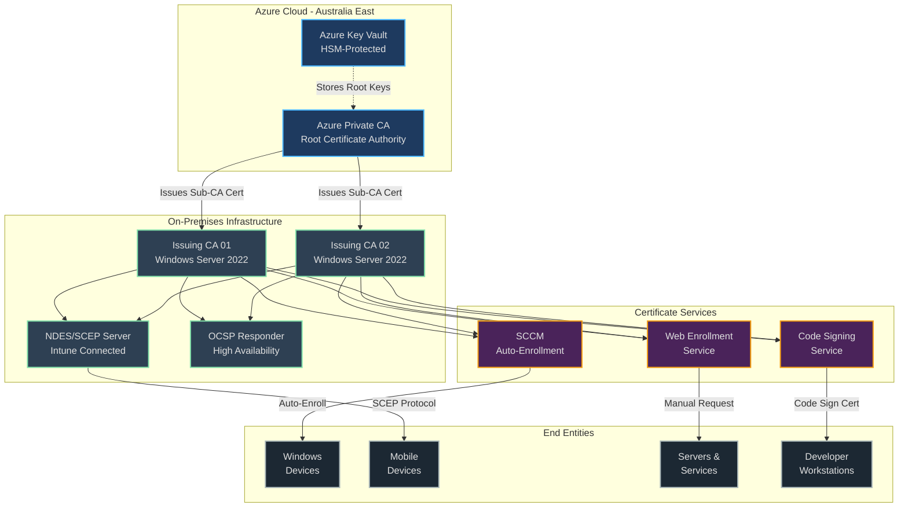
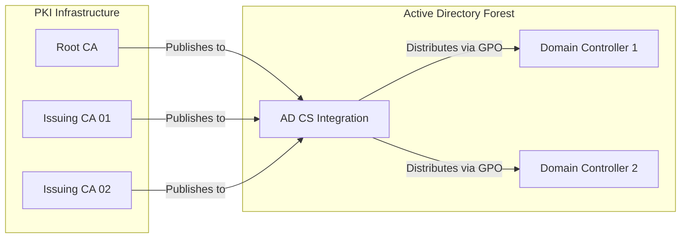
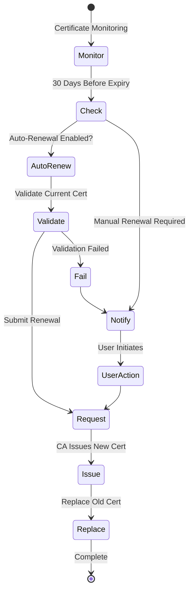

# PKI Modernization - Overall PKI Hierarchy and Trust Relationships

[← Previous: Network Architecture](02-network-architecture.md) | [Back to Index](00-index.md) | [Next: Enrollment Flows →](04-enrollment-flows.md)

## PKI Hierarchy Overview

This document describes the complete PKI hierarchy, including the root CA, subordinate CAs, and trust relationships between all components.

## Certificate Authority Details

### Root Certificate Authority

| Property | Value |
|----------|-------|
| **Type** | Azure Private CA (Managed) |
| **Common Name** | Company Root CA |
| **Location** | Australia East (Primary), Australia Southeast (DR) |
| **Key Storage** | Azure Key Vault HSM |
| **Key Algorithm** | RSA 4096-bit |
| **Hash Algorithm** | SHA-256 |
| **Validity Period** | 20 years |
| **Path Length Constraint** | 2 |
| **Key Usage** | Certificate Sign, CRL Sign |
| **CRL Distribution Point** | https://pki.company.com.au/crl/root.crl |
| **AIA** | https://pki.company.com.au/aia/root.crt |

### Issuing Certificate Authority 01

| Property | Value |
|----------|-------|
| **Type** | Windows Server 2022 Enterprise CA |
| **Common Name** | Company Issuing CA 01 |
| **Server Name** | PKI-ICA-01.company.com.au |
| **IP Address** | 10.50.1.10 |
| **Key Algorithm** | RSA 4096-bit |
| **Hash Algorithm** | SHA-256 |
| **Validity Period** | 10 years |
| **Path Length Constraint** | 0 |
| **Key Usage** | Certificate Sign, CRL Sign |
| **CRL Period** | 1 week |
| **Delta CRL Period** | 1 day |
| **CRL Distribution Point** | https://pki.company.com.au/crl/ica01.crl |

### Issuing Certificate Authority 02

| Property | Value |
|----------|-------|
| **Type** | Windows Server 2022 Enterprise CA |
| **Common Name** | Company Issuing CA 02 |
| **Server Name** | PKI-ICA-02.company.com.au |
| **IP Address** | 10.50.1.11 |
| **Key Algorithm** | RSA 4096-bit |
| **Hash Algorithm** | SHA-256 |
| **Validity Period** | 10 years |
| **Path Length Constraint** | 0 |
| **Key Usage** | Certificate Sign, CRL Sign |
| **CRL Period** | 1 week |
| **Delta CRL Period** | 1 day |
| **CRL Distribution Point** | https://pki.company.com.au/crl/ica02.crl |

## Certificate Templates

### User Certificates

| Template Name | Purpose | Validity | Key Size | Auto-Enrollment |
|---------------|---------|----------|----------|-----------------|
| Company-User-Auth | User authentication | 1 year | 2048-bit | Yes |
| Company-User-Email | S/MIME email | 1 year | 2048-bit | Yes |
| Company-User-EFS | File encryption | 2 years | 2048-bit | No |
| Company-User-SmartCard | Smart card logon | 1 year | 2048-bit | No |

### Computer Certificates

| Template Name | Purpose | Validity | Key Size | Auto-Enrollment |
|---------------|---------|----------|----------|-----------------|
| Company-Computer-Auth | Machine authentication | 2 years | 2048-bit | Yes |
| Company-Domain-Controller | DC authentication | 3 years | 4096-bit | Yes |
| Company-SCCM-Client | SCCM client auth | 2 years | 2048-bit | Yes |
| Company-802.1X | Network authentication | 1 year | 2048-bit | Yes |

### Server Certificates

| Template Name | Purpose | Validity | Key Size | Auto-Enrollment |
|---------------|---------|----------|----------|-----------------|
| Company-Web-Server | SSL/TLS | 1 year | 2048-bit | No |
| Company-Web-Server-EV | Extended validation | 1 year | 4096-bit | No |
| Company-RDP-Server | RDP encryption | 2 years | 2048-bit | Yes |
| Company-LDAPS | LDAP over SSL | 2 years | 2048-bit | Yes |

### Special Purpose Certificates

| Template Name | Purpose | Validity | Key Size | Approval Required |
|---------------|---------|----------|----------|-------------------|
| Company-Code-Signing | Code signing | 1 year | 4096-bit | Manager approval |
| Company-Document-Signing | Document signing | 1 year | 2048-bit | Auto-approved |
| Company-OCSP-Signing | OCSP responses | 2 weeks | 2048-bit | Auto-issued |
| Company-Mobile-Device | Mobile device MDM | 2 years | 2048-bit | Intune validated |

## Trust Relationships

### Internal Trust

### External Trust

| External System | Trust Method | Certificate Type | Notes |
|-----------------|--------------|------------------|-------|
| Zscaler | Root CA import | SSL inspection | Public trust verification |
| Azure AD | Certificate connector | Device certificates | Hybrid Azure AD join |
| Partner Organizations | Cross-certification | Limited scope | Specific OUs only |
| Public Web | Publicly trusted CA | External facing only | DigiCert for public |

## Certificate Lifecycle

### Issuance Process

1. **Request Initiation**
   - Auto-enrollment (GPO triggered)
   - Manual request (MMC or web)
   - SCEP/NDES (mobile devices)
   - API request (automation)

2. **Validation**
   - Domain membership verification
   - Template permissions check
   - Manager approval (if required)
   - Duplicate certificate check

3. **Issuance**
   - Key generation (client or server-side)
   - Certificate signing
   - Database logging
   - Certificate delivery

4. **Post-Issuance**
   - CRL publication update
   - OCSP responder update
   - Audit log entry
   - Notification (if configured)

### Renewal Process

### Revocation Process

| Revocation Reason | Code | Process | CRL Update |
|-------------------|------|---------|------------|
| Key Compromise | 1 | Immediate revocation | Emergency CRL |
| CA Compromise | 2 | Root CA notification | All CRLs updated |
| Affiliation Changed | 3 | Standard process | Next scheduled |
| Superseded | 4 | Automatic | Next scheduled |
| Cessation of Operation | 5 | Standard process | Next scheduled |
| Certificate Hold | 6 | Temporary suspension | Immediate |

## Key Management

### Key Storage Hierarchy

| Level | Storage Type | Protection | Recovery |
|-------|--------------|------------|----------|
| Root CA | Azure HSM | FIPS 140-2 Level 3 | Multi-party ceremony |
| Issuing CAs | Software KSP | TPM 2.0 | Encrypted backup |
| Service Accounts | Azure Key Vault | Managed identity | Automated |
| End Entities | Local store | DPAPI | User profile |

### Key Rotation Schedule

| Certificate Type | Rotation Frequency | Overlap Period | Notes |
|------------------|-------------------|----------------|-------|
| Root CA | 10 years | 2 years | Requires planning |
| Issuing CAs | 5 years | 1 year | Coordinated rollout |
| Service certificates | 1 year | 30 days | Automated |
| User certificates | 1 year | 30 days | Auto-enrollment |

## Compliance and Auditing

### Audit Requirements

| Audit Event | Logging Location | Retention | Review Frequency |
|-------------|------------------|-----------|------------------|
| Certificate issuance | CA database + SIEM | 7 years | Daily |
| Certificate revocation | CA database + SIEM | 7 years | Immediate |
| Template modification | AD audit log | 1 year | Weekly |
| CA configuration change | Windows Event Log | 1 year | Daily |
| Failed requests | CA database | 90 days | Weekly |

### Compliance Mapping

| Standard | Requirement | Implementation |
|----------|-------------|----------------|
| ISO 27001 | Key management controls | HSM for root, automated rotation |
| PCI DSS | Certificate validity limits | 1-year maximum for TLS |
| SOC 2 | Audit trail | Centralized logging to SIEM |
| Australian Privacy Act | Data protection | Encryption at rest and in transit |
| ACSC ISM | Cryptographic standards | ASD approved algorithms |

---
[← Previous: Network Architecture](02-network-architecture.md) | [Back to Index](00-index.md) | [Next: Enrollment Flows →](04-enrollment-flows.md)