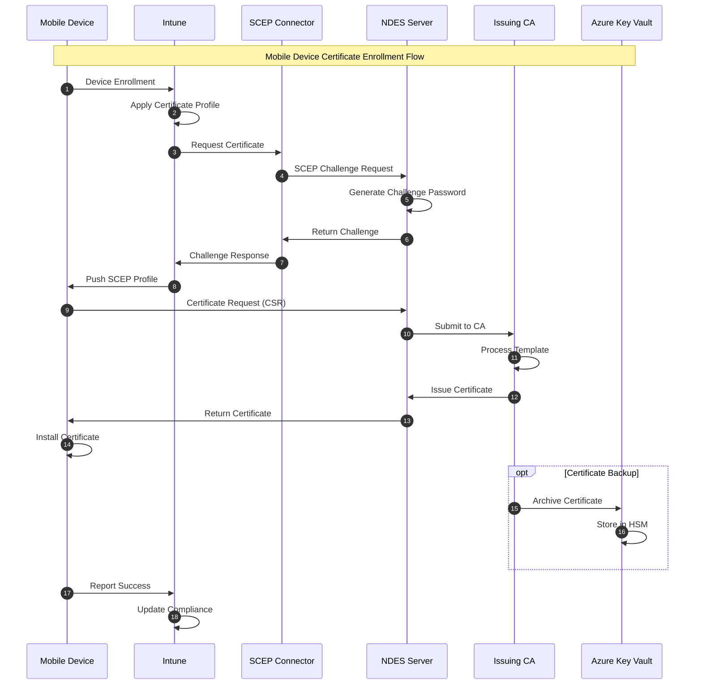
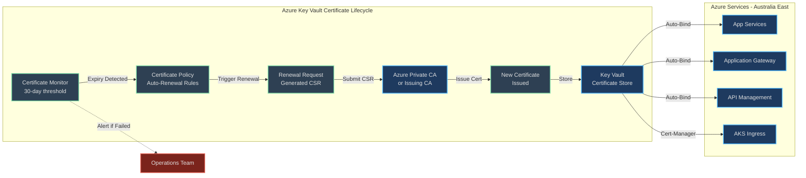
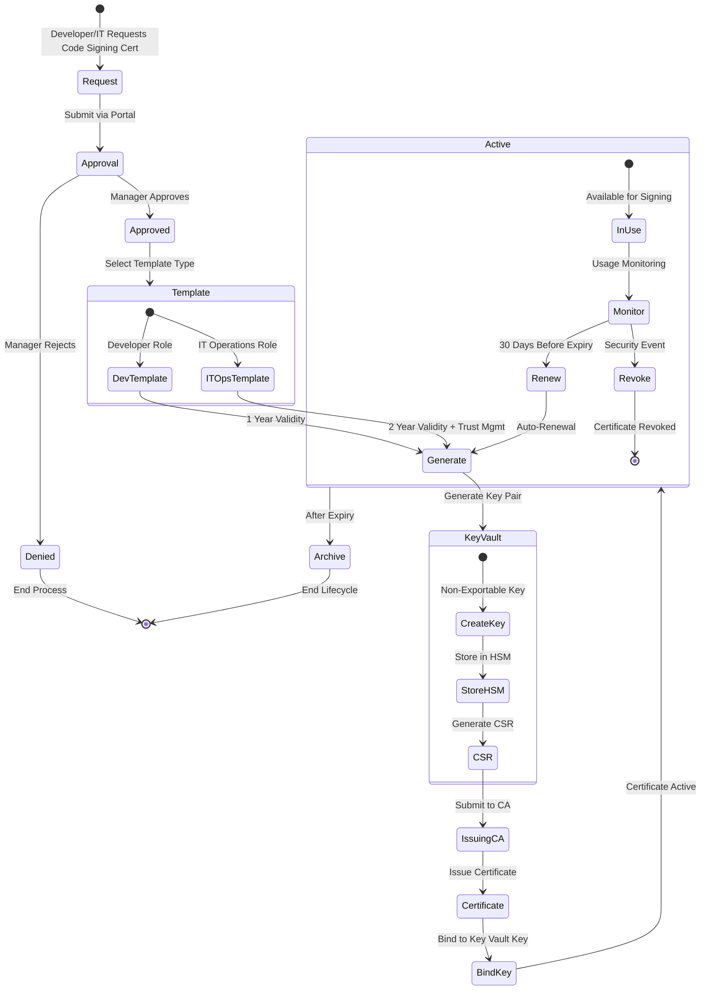
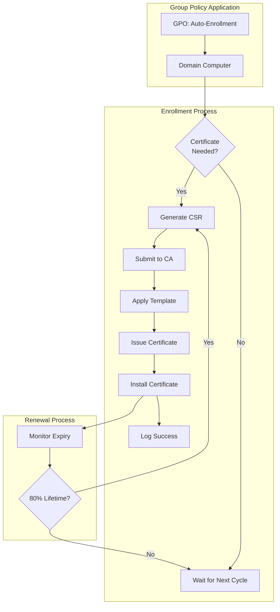
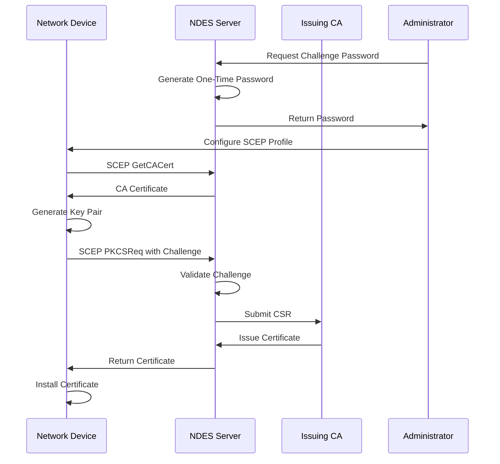

# PKI Modernization - Certificate Enrollment Flows

[← Previous: PKI Hierarchy](03-pki-hierarchy.md) | [Back to Index](00-index.md) | [Next: Phase 1 Foundation →](05-phase1-foundation.md)

## Certificate Enrollment Flows Overview

This document details the various certificate enrollment flows for different device types and use cases, including mobile devices, Azure services, and code signing certificates.

## Mobile Device Certificate Enrollment via Intune



### Mobile Enrollment Prerequisites

| Component | Requirement | Configuration |
|-----------|-------------|---------------|
| Intune License | Microsoft Intune or EMS E3+ | Per-user licensing |
| NDES Server | Windows Server 2019/2022 | Domain-joined |
| Certificate Connector | Latest version | Installed on NDES server |
| Network Access | HTTPS 443 | NDES to Intune |
| Certificate Template | Mobile device template | Published to CA |

### Supported Mobile Platforms

| Platform | Enrollment Method | Certificate Store | Key Storage |
|----------|------------------|------------------|-------------|
| iOS 14+ | SCEP | Device keychain | Secure Enclave |
| Android 10+ | SCEP | Android keystore | Hardware-backed |
| Windows 10/11 Mobile | SCEP | Computer store | TPM 2.0 |

## Azure Services Certificate Automation Flow



### Azure Certificate Automation Configuration

| Service | Integration Method | Renewal Trigger | Binding Method |
|---------|-------------------|-----------------|----------------|
| App Service | Key Vault reference | 30 days before expiry | Automatic |
| Application Gateway | Key Vault integration | Policy-based | Listener update |
| API Management | Managed identity | 30 days before expiry | Custom domain |
| AKS | Cert-manager | Annotation-based | Ingress controller |
| Azure Front Door | Managed certificate | 30 days before expiry | Automatic |

## Code Signing Certificate Management Flow



### Code Signing Request Process

1. **Request Initiation**
   - User submits request via self-service portal
   - Specifies purpose and justification
   - Selects validity period (1 or 2 years)

2. **Approval Workflow**
   - Manager approval for standard requests
   - Security team approval for extended validity
   - Automatic approval for pre-approved teams

3. **Certificate Generation**
   - Key pair generated in Azure Key Vault HSM
   - CSR submitted to issuing CA
   - Certificate bound to non-exportable key

4. **Usage and Monitoring**
   - All signing operations logged
   - Monthly usage reports generated
   - Anomaly detection for unusual activity

## Windows Domain Computer Auto-Enrollment



### Auto-Enrollment Configuration

| Setting | Value | Location |
|---------|-------|----------|
| Policy Setting | Enabled | Computer Configuration > Policies > Windows Settings > Security Settings |
| Renew Expired | Enabled | Auto-enrollment properties |
| Update Templates | Enabled | Auto-enrollment properties |
| Process User Certs | Optional | User Configuration (if needed) |
| Renewal Threshold | 80% of lifetime | Certificate template setting |

## Server Certificate Manual Enrollment

### Web Server Certificate Request Process

1. **Generate CSR**
   ```powershell
   # Generate certificate request
   $inf = @"
   [Version]
   Signature="`$Windows NT$"
   
   [NewRequest]
   Subject = "CN=webserver.company.com.au,O=Company,L=Sydney,S=NSW,C=AU"
   KeySpec = 1
   KeyLength = 2048
   Exportable = TRUE
   MachineKeySet = TRUE
   SMIME = FALSE
   UseExistingKeySet = FALSE
   ProviderName = "Microsoft RSA SChannel Cryptographic Provider"
   ProviderType = 12
   RequestType = PKCS10
   KeyUsage = 0xa0
   
   [EnhancedKeyUsageExtension]
   OID=1.3.6.1.5.5.7.3.1 ; Server Authentication
   "@
   
   Set-Content -Path request.inf -Value $inf
   certreq -new request.inf request.req
   ```

2. **Submit to CA**
   - Via web enrollment portal
   - Via MMC certificate snap-in
   - Via certreq command line

3. **Approval and Issuance**
   - CA administrator review (if required)
   - Template compliance check
   - Certificate issuance

4. **Installation**
   ```powershell
   # Accept and install certificate
   certreq -accept certificate.cer
   ```

## SCEP/NDES Enrollment Flow

### Network Device Enrollment



### SCEP Profile Configuration

| Parameter | Value | Description |
|-----------|-------|-------------|
| URL | https://ndes.company.com.au/certsrv/mscep/mscep.dll | SCEP endpoint |
| Challenge Type | Dynamic | One-time password |
| Key Size | 2048 bits | RSA key length |
| Hash Algorithm | SHA-256 | Signature hash |
| Subject | CN={{DeviceName}} | Device identifier |
| Validity | 1 year | Certificate lifetime |
| Renewal | 80% | Auto-renewal threshold |

## Certificate Enrollment Protocols Comparison

| Protocol | Use Case | Pros | Cons |
|----------|----------|------|------|
| Auto-Enrollment | Domain computers | Zero-touch, GPO-based | Windows-only |
| SCEP/NDES | Mobile & network devices | Cross-platform | Complex setup |
| Web Enrollment | Manual requests | User-friendly | Manual process |
| CEP/CES | Internet-based | Works over internet | Deprecated |
| EST | IoT devices | Standards-based | Limited support |
| CMPv2 | Complex scenarios | Full-featured | Complex protocol |

## Troubleshooting Common Enrollment Issues

### Issue: SCEP Enrollment Fails

| Symptom | Cause | Resolution |
|---------|-------|------------|
| Challenge rejected | Expired password | Generate new challenge |
| Connection timeout | Firewall blocking | Open port 443 |
| Certificate not trusted | Missing root CA | Deploy root certificate |
| Template not found | Permissions issue | Verify NDES service account |

### Issue: Auto-Enrollment Not Working

| Check Point | Verification Command | Expected Result |
|-------------|---------------------|----------------|
| GPO Applied | `gpresult /h report.html` | Policy listed |
| CA Connectivity | `certutil -ping` | Successful ping |
| Template Permissions | `certutil -CATemplates` | Template visible |
| Event Log | Check Application log | No errors |

### Issue: Azure Certificate Renewal Fails

| Component | Check | Action |
|-----------|-------|--------|
| Key Vault Access | Managed identity permissions | Grant certificate permissions |
| CA Connectivity | Network connectivity to CA | Verify firewall rules |
| Certificate Policy | Policy configuration | Update renewal settings |
| Audit Logs | Key Vault diagnostics | Review error details |

---
[← Previous: PKI Hierarchy](03-pki-hierarchy.md) | [Back to Index](00-index.md) | [Next: Phase 1 Foundation →](05-phase1-foundation.md)