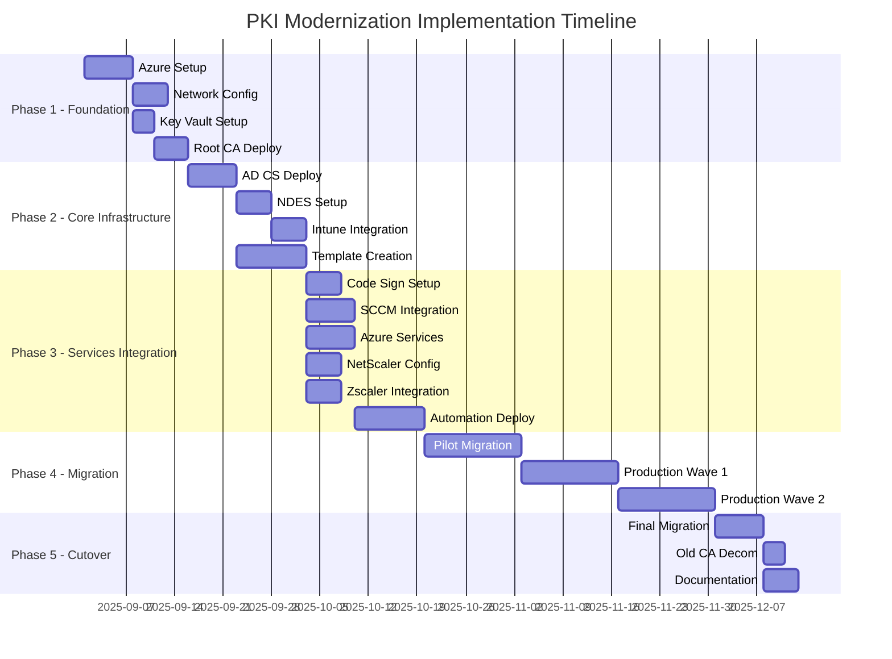
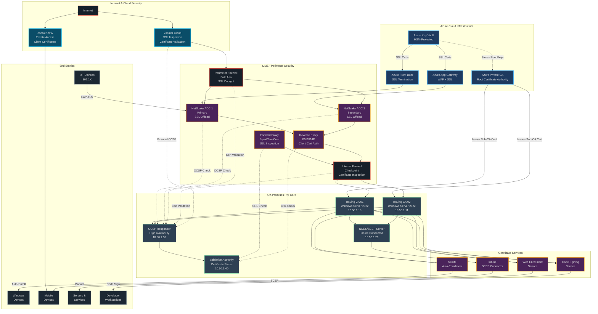
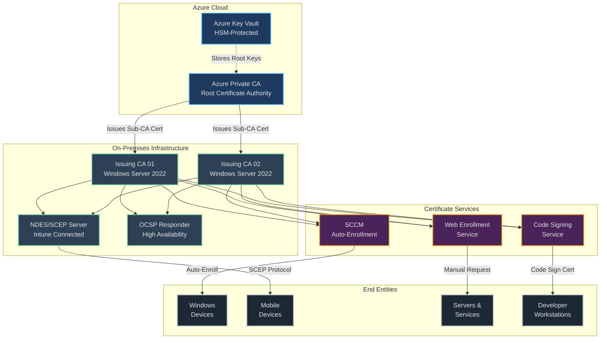
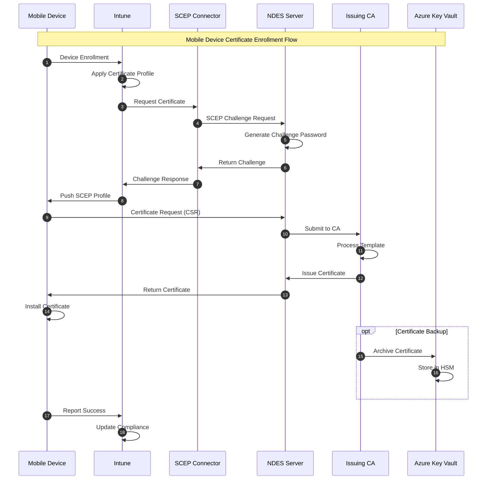
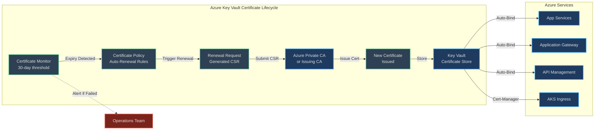
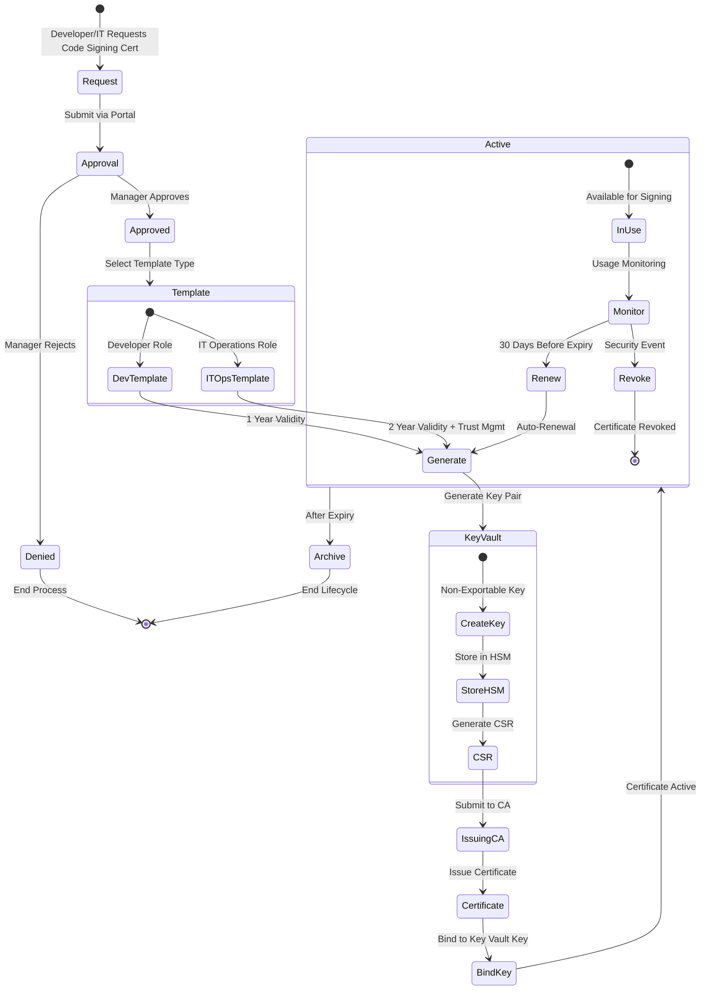
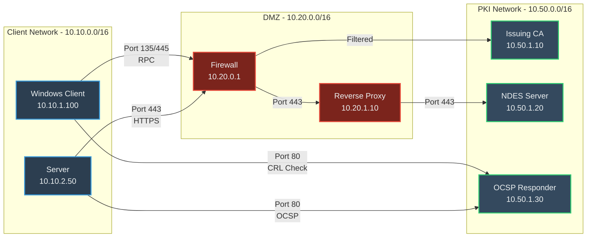
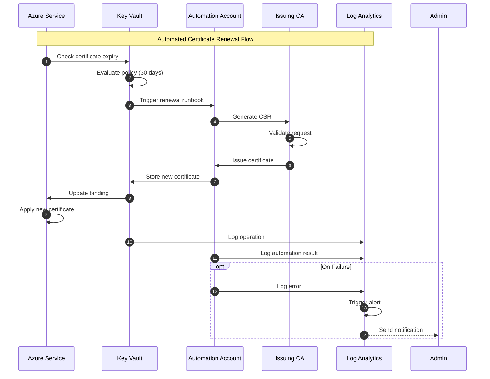

# PKI Modernization - Comprehensive Implementation Plan with Network Infrastructure

## Project Timeline Overview



## Complete Network Architecture with Security Appliances

### Enterprise PKI Infrastructure with Security Layers



## Architecture Diagrams

### Overall PKI Hierarchy and Trust Relationships



### Certificate Enrollment Flow - Mobile Devices via Intune



### Azure Services Certificate Automation Flow



### Code Signing Certificate Management Flow



## Detailed Implementation Plan

### PHASE 1: Foundation Setup (Weeks 1-2)

#### Week 1: Azure Infrastructure Preparation

**Day 1-2: Azure Subscription and Governance**
```powershell
# 1. Create Resource Groups
New-AzResourceGroup -Name "RG-PKI-Core" -Location "East US"
New-AzResourceGroup -Name "RG-PKI-KeyVault" -Location "East US"
New-AzResourceGroup -Name "RG-PKI-Networking" -Location "East US"

# 2. Assign RBAC Roles
$pkiAdminGroup = "PKI-Administrators"
New-AzADGroup -DisplayName $pkiAdminGroup -MailEnabled $false -SecurityEnabled $true

# 3. Apply Azure Policy for compliance
$policyDef = Get-AzPolicyDefinition -Name "Allowed-Locations"
New-AzPolicyAssignment -Name "PKI-Location-Policy" -PolicyDefinition $policyDef
```

**Day 3-4: Network Configuration**
```powershell
# Create Virtual Network for PKI
$vnet = New-AzVirtualNetwork -Name "VNET-PKI" `
    -ResourceGroupName "RG-PKI-Networking" `
    -Location "East US" `
    -AddressPrefix "10.50.0.0/16"

# Create Subnets
Add-AzVirtualNetworkSubnetConfig -Name "Subnet-PKI-Core" `
    -VirtualNetwork $vnet -AddressPrefix "10.50.1.0/24"
Add-AzVirtualNetworkSubnetConfig -Name "Subnet-PKI-HSM" `
    -VirtualNetwork $vnet -AddressPrefix "10.50.2.0/24"
Add-AzVirtualNetworkSubnetConfig -Name "GatewaySubnet" `
    -VirtualNetwork $vnet -AddressPrefix "10.50.255.0/24"

# Configure NSG Rules
$nsgRules = @(
    @{Name="Allow-HTTPS"; Protocol="Tcp"; SourcePortRange="*";
      DestinationPortRange="443"; Access="Allow"; Priority=100}
    @{Name="Allow-RPC"; Protocol="Tcp"; SourcePortRange="*";
      DestinationPortRange="135"; Access="Allow"; Priority=110}
    @{Name="Allow-CRL"; Protocol="Tcp"; SourcePortRange="*";
      DestinationPortRange="80"; Access="Allow"; Priority=120}
)
```

**Day 5: Azure Key Vault Setup**
```powershell
# Create Premium Key Vault with HSM
$keyVault = New-AzKeyVault -Name "KV-PKI-RootCA" `
    -ResourceGroupName "RG-PKI-KeyVault" `
    -Location "East US" `
    -Sku "Premium" `
    -EnabledForDeployment `
    -EnabledForTemplateDeployment `
    -EnablePurgeProtection

# Configure Access Policies
Set-AzKeyVaultAccessPolicy -VaultName "KV-PKI-RootCA" `
    -ObjectId (Get-AzADGroup -DisplayName "PKI-Administrators").Id `
    -PermissionsToKeys all `
    -PermissionsToCertificates all `
    -PermissionsToSecrets all

# Create HSM-protected keys for Root CA
Add-AzKeyVaultKey -VaultName "KV-PKI-RootCA" `
    -Name "RootCA-SigningKey" `
    -Destination "HSM" `
    -KeyOps sign,verify `
    -Size 4096
```

#### Week 2: Azure Private CA Deployment

**Day 6-7: Deploy Azure Managed Private CA**
```bash
# Azure CLI deployment
az pki ca create \
    --resource-group "RG-PKI-Core" \
    --name "CompanyRootCA" \
    --subject "CN=Company Root CA, O=Company, C=US" \
    --validity-in-months 240 \
    --key-vault-id "/subscriptions/{sub-id}/resourceGroups/RG-PKI-KeyVault/providers/Microsoft.KeyVault/vaults/KV-PKI-RootCA"

# Configure CA Certificate Policy
az pki ca certificate-policy create \
    --ca-name "CompanyRootCA" \
    --resource-group "RG-PKI-Core" \
    --policy-file ca-policy.json
```

**ca-policy.json:**
```json
{
  "keyProperties": {
    "keyType": "RSA-HSM",
    "keySize": 4096,
    "reuseKey": false,
    "exportable": false
  },
  "certificateProperties": {
    "certificateType": "RootCA",
    "subject": "CN=Company Root CA, O=Company, C=US",
    "validity": {
      "validityInMonths": 240
    },
    "keyUsage": ["keyCertSign", "cRLSign"],
    "extendedKeyUsage": []
  },
  "x509CertificateProperties": {
    "basicConstraints": {
      "certificateAuthority": true,
      "pathLenConstraint": 2
    }
  }
}
```

**Day 8-9: Configure CRL Distribution Points**
```powershell
# Setup Azure Storage for CRL hosting
$storageAccount = New-AzStorageAccount `
    -ResourceGroupName "RG-PKI-Core" `
    -Name "pkicrlstorage" `
    -Location "East US" `
    -SkuName "Standard_GRS" `
    -Kind "StorageV2"

# Create blob container for CRL
$ctx = $storageAccount.Context
New-AzStorageContainer -Name "crl" -Context $ctx -Permission Blob

# Configure CDN for global CRL distribution
$cdnProfile = New-AzCdnProfile `
    -ResourceGroupName "RG-PKI-Core" `
    -ProfileName "PKI-CDN" `
    -Location "East US" `
    -Sku "Standard_Microsoft"
```

**Day 10: Backup and DR Configuration**
```powershell
# Configure Azure Backup for Key Vault
$vault = Get-AzRecoveryServicesVault -Name "RSV-PKI"
Set-AzRecoveryServicesBackupProperty -Vault $vault `
    -BackupStorageRedundancy GeoRedundant

# Enable soft delete and purge protection
Update-AzKeyVault -VaultName "KV-PKI-RootCA" `
    -EnableSoftDelete $true `
    -SoftDeleteRetentionInDays 90 `
    -EnablePurgeProtection $true
```

### PHASE 2: Core Infrastructure Deployment (Weeks 3-4)

#### Week 3: AD CS Subordinate CA Setup

**Day 11-12: Deploy Issuing CA VMs**
```powershell
# VM deployment script for Issuing CA 01
$vmConfig = New-AzVMConfig -VMName "PKI-ICA-01" -VMSize "Standard_D4s_v3"
$vmConfig = Set-AzVMOperatingSystem -VM $vmConfig `
    -Windows -ComputerName "PKI-ICA-01" `
    -Credential $cred -ProvisionVMAgent

$vmConfig = Set-AzVMSourceImage -VM $vmConfig `
    -PublisherName "MicrosoftWindowsServer" `
    -Offer "WindowsServer" `
    -Skus "2022-datacenter-g2" `
    -Version "latest"

# Add data disk for CA database
$vmConfig = Add-AzVMDataDisk -VM $vmConfig `
    -Name "PKI-ICA-01-Data" `
    -DiskSizeInGB 256 `
    -CreateOption Empty `
    -Lun 0

New-AzVM -ResourceGroupName "RG-PKI-Core" `
    -Location "East US" `
    -VM $vmConfig
```

**Day 13: Install AD CS Role**
```powershell
# Remote PowerShell to ICA-01
Enter-PSSession -ComputerName PKI-ICA-01

# Install AD CS with all components
Install-WindowsFeature -Name AD-Certificate, `
    ADCS-Cert-Authority, `
    ADCS-Web-Enrollment, `
    ADCS-Online-Responder `
    -IncludeManagementTools

# Configure CA
Install-AdcsCertificationAuthority `
    -CAType EnterpriseSubordinateCA `
    -CACommonName "Company Issuing CA 01" `
    -KeyLength 4096 `
    -HashAlgorithmName SHA256 `
    -CryptoProviderName "RSA#Microsoft Software Key Storage Provider" `
    -DatabaseDirectory "E:\CADatabase" `
    -LogDirectory "E:\CALogs" `
    -ValidityPeriod Years `
    -ValidityPeriodUnits 10 `
    -Force
```

**Day 14-15: Configure Certificate Templates**
```powershell
# Create custom certificate templates
$templateNames = @(
    "Company-User-Certificate",
    "Company-Computer-Certificate",
    "Company-Web-Server",
    "Company-Code-Signing",
    "Company-Mobile-Device",
    "Company-SCCM-Client"
)

foreach ($template in $templateNames) {
    # Duplicate existing template
    $sourceTemplate = Get-CATemplate -Name "Computer"
    $newTemplate = New-CATemplate -SourceTemplate $sourceTemplate `
        -DisplayName $template

    # Configure template settings
    Set-CATemplate -Name $template `
        -ValidityPeriod "Years" `
        -ValidityPeriodUnits 2 `
        -RenewalPeriod "Weeks" `
        -RenewalPeriodUnits 6
}

# Publish templates to CA
Add-CATemplate -Name "Company-User-Certificate" -Force
Add-CATemplate -Name "Company-Computer-Certificate" -Force
# ... continue for all templates
```

#### Week 4: SCEP/NDES Configuration

**Day 16-17: Deploy NDES Server**
```powershell
# Install NDES role
Install-WindowsFeature -Name ADCS-Device-Enrollment `
    -IncludeManagementTools

# Configure NDES
Install-AdcsNetworkDeviceEnrollmentService `
    -ServiceAccountName "DOMAIN\svc-ndes" `
    -ServiceAccountPassword $securePassword `
    -RAName "Company-NDES-RA" `
    -RACountry "US" `
    -RACompany "Company" `
    -SigningProviderName "Microsoft Strong Cryptographic Provider" `
    -SigningKeyLength 2048 `
    -EncryptionProviderName "Microsoft Strong Cryptographic Provider" `
    -EncryptionKeyLength 2048 `
    -CAConfig "PKI-ICA-01.domain.com\Company Issuing CA 01"
```

**Day 18: Install Intune Certificate Connector**
```powershell
# Download and install Microsoft Intune Connector
$connectorUrl = "https://download.microsoft.com/download/[latest-version]/MicrosoftIntuneCertificateConnector.msi"
Invoke-WebRequest -Uri $connectorUrl -OutFile "C:\Temp\IntuneConnector.msi"

# Install silently
Start-Process msiexec.exe -ArgumentList "/i C:\Temp\IntuneConnector.msi /quiet" -Wait

# Configure connector
# This requires GUI interaction - document steps:
# 1. Launch Certificate Connector
# 2. Sign in with Intune admin account
# 3. Select SCEP tab
# 4. Enable SCEP service
# 5. Verify connection status
```

**Day 19-20: Configure Intune SCEP Profiles**
```powershell
# Connect to Microsoft Graph
Connect-MgGraph -Scopes "DeviceManagementConfiguration.ReadWrite.All"

# Create SCEP certificate profile for iOS
$iosSCEPProfile = @{
    "@odata.type" = "#microsoft.graph.iosSCEPCertificateProfile"
    displayName = "iOS Device Certificate"
    description = "SCEP certificate for iOS devices"
    certificateStore = "DeviceCertificate"
    certificateValidityPeriodScale = "Years"
    certificateValidityPeriodValue = 2
    extendedKeyUsages = @(
        @{
            name = "Client Authentication"
            objectIdentifier = "1.3.6.1.5.5.7.3.2"
        }
    )
    keySize = "2048"
    keyUsage = @("digitalSignature", "keyEncipherment")
    renewalThresholdPercentage = 20
    scepServerUrls = @("https://ndes.company.com/certsrv/mscep/mscep.dll")
    subjectAlternativeNameType = "emailAddress"
    subjectNameFormat = "CN={{DeviceId}}"
}

New-MgDeviceManagementDeviceConfiguration -BodyParameter $iosSCEPProfile
```

### PHASE 3: Services Integration (Weeks 5-6)

#### Week 5: Code Signing Infrastructure

**Day 21-22: Setup Code Signing Service**
```powershell
# Create Azure Key Vault for Code Signing
$codeSignVault = New-AzKeyVault -Name "KV-CodeSign" `
    -ResourceGroupName "RG-PKI-Core" `
    -Location "East US" `
    -Sku "Premium"

# Create code signing certificate policies
$devPolicy = New-AzKeyVaultCertificatePolicy `
    -SubjectName "CN=Developer Code Signing" `
    -IssuerName "Company Issuing CA 01" `
    -ValidityInMonths 12 `
    -KeyType "RSA" `
    -KeySize 2048 `
    -KeyNotExportable `
    -KeyUsage "DigitalSignature" `
    -Ekus "1.3.6.1.5.5.7.3.3"  # Code Signing

$opsPolicy = New-AzKeyVaultCertificatePolicy `
    -SubjectName "CN=IT Operations Code Signing" `
    -IssuerName "Company Issuing CA 01" `
    -ValidityInMonths 24 `
    -KeyType "RSA" `
    -KeySize 4096 `
    -KeyNotExportable `
    -KeyUsage "DigitalSignature" `
    -Ekus "1.3.6.1.5.5.7.3.3"
```

**Day 23: Configure Signing Automation**
```powershell
# Create Azure Function for code signing
$functionApp = New-AzFunctionApp `
    -Name "FA-CodeSign-Service" `
    -ResourceGroupName "RG-PKI-Core" `
    -StorageAccount "pkicodesignstorage" `
    -Runtime "PowerShell" `
    -RuntimeVersion "7.2" `
    -FunctionsVersion 4 `
    -Location "East US"

# Deploy signing function code
Publish-AzWebApp -ResourceGroupName "RG-PKI-Core" `
    -Name "FA-CodeSign-Service" `
    -ArchivePath ".\CodeSignFunction.zip"

# Grant function access to Key Vault
$functionIdentity = (Get-AzFunctionApp -Name "FA-CodeSign-Service").Identity
Set-AzKeyVaultAccessPolicy -VaultName "KV-CodeSign" `
    -ObjectId $functionIdentity.PrincipalId `
    -PermissionsToCertificates get,list `
    -PermissionsToKeys sign,verify
```

**Day 24-25: SCCM Integration**
```powershell
# Configure SCCM for auto-enrollment
# On SCCM Primary Site Server
$siteCode = "PS1"
$siteServer = "SCCM-PRIMARY"

# Import SCCM PowerShell module
Import-Module "$($ENV:SMS_ADMIN_UI_PATH)\..\ConfigurationManager.psd1"
Set-Location "$siteCode`:"

# Create certificate profile for SCCM clients
New-CMCertificateProfileScep `
    -Name "SCCM Client Authentication Certificate" `
    -Description "Auto-renewing certificate for SCCM clients" `
    -CertificateTemplateName "Company-SCCM-Client" `
    -CertificateStore "Personal" `
    -HashAlgorithm "SHA256" `
    -KeySize 2048 `
    -KeyStorageProvider "Microsoft Software Key Storage Provider" `
    -RenewalThresholdPercentage 20 `
    -ScepServerUrl @("https://ndes.company.com/certsrv/mscep/mscep.dll")

# Create deployment
Start-CMCertificateProfileDeployment `
    -CertificateProfileName "SCCM Client Authentication Certificate" `
    -CollectionName "All Desktop and Server Clients" `
    -GenerateAlert $true `
    -ParameterValue 90  # Alert at 90% compliance
```

#### Week 6: Azure Services Integration

**Day 26-27: Configure Azure Key Vault Certificate Automation**
```powershell
# Setup certificate lifecycle policies for Azure services
$webServerPolicy = @{
    IssuerName = "Company Issuing CA 01"
    SubjectName = "CN=*.company.com"
    DnsNames = @("*.company.com", "*.api.company.com")
    ValidityInMonths = 12
    RenewAtPercentageLifetime = 80
    KeyType = "RSA"
    KeySize = 2048
    ReuseKeyOnRenewal = $false
}

# Create certificate with auto-renewal
$cert = Add-AzKeyVaultCertificate `
    -VaultName "KV-PKI-Core" `
    -Name "Wildcard-Company-2024" `
    -CertificatePolicy $webServerPolicy

# Configure App Service certificate binding
$webApp = Get-AzWebApp -Name "CompanyWebApp"
New-AzWebAppSSLBinding `
    -WebApp $webApp `
    -CertificateThumbprint $cert.Thumbprint `
    -SslState "SniEnabled"
```

**Day 28: Setup Monitoring and Alerting**
```powershell
# Create Log Analytics Workspace
$workspace = New-AzOperationalInsightsWorkspace `
    -ResourceGroupName "RG-PKI-Core" `
    -Name "LA-PKI-Monitoring" `
    -Location "East US" `
    -Sku "PerGB2018"

# Configure diagnostic settings for Key Vault
Set-AzDiagnosticSetting `
    -ResourceId $keyVault.ResourceId `
    -WorkspaceId $workspace.ResourceId `
    -Enabled $true `
    -Category "AuditEvent" `
    -MetricCategory "AllMetrics"

# Create alert rules
$alertRule = New-AzScheduledQueryRule `
    -ResourceGroupName "RG-PKI-Core" `
    -Location "East US" `
    -Name "Certificate-Expiry-Alert" `
    -Description "Alert when certificates expire within 30 days" `
    -Query @"
        AzureDiagnostics
        | where ResourceType == "VAULTS"
        | where OperationName == "CertificateNearExpiry"
        | project TimeGenerated, Resource, Properties_s
"@ `
    -Frequency 60 `
    -TimeWindow 60 `
    -Severity 2
```

**Day 29-30: Automation Runbooks**
```powershell
# Create Automation Account
$automationAccount = New-AzAutomationAccount `
    -ResourceGroupName "RG-PKI-Core" `
    -Name "AA-PKI-Automation" `
    -Location "East US" `
    -Plan "Basic"

# Import certificate renewal runbook
$runbookName = "Renew-ExpiringCertificates"
Import-AzAutomationRunbook `
    -AutomationAccountName "AA-PKI-Automation" `
    -ResourceGroupName "RG-PKI-Core" `
    -Path ".\Runbooks\Renew-ExpiringCertificates.ps1" `
    -Type "PowerShell" `
    -Name $runbookName

# Schedule runbook
$schedule = New-AzAutomationSchedule `
    -AutomationAccountName "AA-PKI-Automation" `
    -ResourceGroupName "RG-PKI-Core" `
    -Name "Daily-Certificate-Check" `
    -StartTime (Get-Date).AddDays(1) `
    -DayInterval 1

Register-AzAutomationScheduledRunbook `
    -AutomationAccountName "AA-PKI-Automation" `
    -ResourceGroupName "RG-PKI-Core" `
    -RunbookName $runbookName `
    -ScheduleName "Daily-Certificate-Check"
```

### PHASE 4: Migration Execution (Weeks 7-10)

#### Week 7-8: Pilot Migration

**Day 31-35: Pilot Group Setup**
```powershell
# Create pilot groups
$pilotGroups = @(
    "PKI-Pilot-Users",
    "PKI-Pilot-Computers",
    "PKI-Pilot-Servers"
)

foreach ($group in $pilotGroups) {
    New-ADGroup -Name $group `
        -GroupScope Global `
        -GroupCategory Security `
        -Path "OU=PKI,OU=Groups,DC=company,DC=com"
}

# Add pilot members (10% of environment)
$users = Get-ADUser -Filter * | Select-Object -First 50
Add-ADGroupMember -Identity "PKI-Pilot-Users" -Members $users

# Configure GPO for pilot auto-enrollment
$gpo = New-GPO -Name "PKI-Pilot-AutoEnrollment"
Set-GPRegistryValue -Name "PKI-Pilot-AutoEnrollment" `
    -Key "HKLM\SOFTWARE\Policies\Microsoft\Cryptography\AutoEnrollment" `
    -ValueName "AEPolicy" `
    -Value 7 `
    -Type DWord

New-GPLink -Name "PKI-Pilot-AutoEnrollment" `
    -Target "OU=Pilot,OU=Computers,DC=company,DC=com"
```

**Day 36-40: Pilot Certificate Deployment**
```powershell
# Script to migrate pilot certificates
$pilotComputers = Get-ADGroupMember -Identity "PKI-Pilot-Computers"

foreach ($computer in $pilotComputers) {
    Invoke-Command -ComputerName $computer.Name -ScriptBlock {
        # Backup existing certificates
        $certs = Get-ChildItem Cert:\LocalMachine\My
        $certs | Export-Certificate -FilePath "C:\CertBackup\$($_.Thumbprint).cer"

        # Request new certificate
        $inf = @"
[Version]
Signature="`$Windows NT$"

[NewRequest]
Subject = "CN=$env:COMPUTERNAME.company.com"
KeySpec = 1
KeyLength = 2048
Exportable = FALSE
MachineKeySet = TRUE
SMIME = FALSE
PrivateKeyArchive = FALSE
UserProtected = FALSE
UseExistingKeySet = FALSE
ProviderName = "Microsoft RSA SChannel Cryptographic Provider"
ProviderType = 12
RequestType = PKCS10
KeyUsage = 0xa0
"@

        Set-Content -Path "C:\request.inf" -Value $inf
        certreq -new "C:\request.inf" "C:\request.req"
        certreq -submit -config "PKI-ICA-01\Company Issuing CA 01" "C:\request.req" "C:\newcert.cer"
        certreq -accept "C:\newcert.cer"
    }
}
```

#### Week 9-10: Production Migration

**Day 41-45: Wave 1 Production Migration**
```powershell
# Production migration script with rollback capability
$wave1Systems = Import-Csv ".\Wave1-Systems.csv"

foreach ($system in $wave1Systems) {
    try {
        # Create checkpoint
        Checkpoint-Computer -Description "Pre-PKI-Migration" -ComputerName $system.Name

        # Perform migration
        $result = Invoke-CertificateMigration -ComputerName $system.Name `
            -OldCA "OldRootCA" `
            -NewCA "Company Issuing CA 01" `
            -BackupPath "\\backup\pki\$($system.Name)"

        # Validate new certificate
        $validation = Test-CertificateChain -ComputerName $system.Name
        if (-not $validation.Valid) {
            throw "Certificate chain validation failed"
        }

        # Update tracking
        $system | Add-Member -NotePropertyName "MigrationStatus" -NotePropertyValue "Success"
        $system | Add-Member -NotePropertyName "MigrationDate" -NotePropertyValue (Get-Date)

    } catch {
        # Rollback on failure
        Restore-Computer -RestorePoint $_.CheckpointId -ComputerName $system.Name
        $system | Add-Member -NotePropertyName "MigrationStatus" -NotePropertyValue "Failed"
        $system | Add-Member -NotePropertyName "Error" -NotePropertyValue $_.Exception.Message
    }

    # Export results
    $system | Export-Csv ".\Wave1-Results.csv" -Append
}
```

**Day 46-50: Wave 2 Production Migration**
```powershell
# Continue with remaining systems
$wave2Systems = Import-Csv ".\Wave2-Systems.csv"

# Implement parallel processing for faster migration
$wave2Systems | ForEach-Object -Parallel {
    $system = $_
    # Migration logic here (same as Wave 1)
} -ThrottleLimit 10
```

### PHASE 5: Cutover and Decommissioning (Week 11)

**Day 51-52: Final Validation**
```powershell
# Comprehensive validation script
$validationResults = @()

# Check all certificate chains
$allSystems = Get-ADComputer -Filter *
foreach ($system in $allSystems) {
    $result = Test-CertificateDeployment -ComputerName $system.Name
    $validationResults += $result
}

# Generate validation report
$validationResults | Export-Csv ".\Final-Validation-Report.csv"
$failedSystems = $validationResults | Where-Object {$_.Status -eq "Failed"}

if ($failedSystems.Count -gt 0) {
    Write-Warning "Failed systems detected. Review before proceeding with cutover."
    $failedSystems | Format-Table
}
```

**Day 53: Old Root CA Decommissioning**
```powershell
# Backup old CA database
Backup-CARoleService -Path "\\backup\OldCA" -DatabaseOnly

# Export CA configuration
certutil -backup "\\backup\OldCA\Full" *

# Revoke old root certificate
certutil -revoke "OldRootCA.cer" 1  # 1 = Key Compromise

# Uninstall CA role
Uninstall-AdcsCertificationAuthority -Force

# Archive VM
Stop-AzVM -ResourceGroupName "RG-Legacy" -Name "OLD-ROOT-CA"
$vm = Get-AzVM -ResourceGroupName "RG-Legacy" -Name "OLD-ROOT-CA"
$vm | Set-AzVM -Tag @{Status="Archived"; ArchiveDate=(Get-Date).ToString()}
```

**Day 54-55: Documentation and Handover**
```powershell
# Generate comprehensive documentation
$documentation = @{
    Architecture = Get-PKIArchitecture | ConvertTo-Html
    CertificateTemplates = Get-CATemplate | ConvertTo-Html
    ServiceAccounts = Get-PKIServiceAccounts | ConvertTo-Html
    Procedures = Get-Content ".\PKI-Procedures.md"
    DisasterRecovery = Get-Content ".\PKI-DR-Plan.md"
    Contacts = Import-Csv ".\PKI-Contacts.csv" | ConvertTo-Html
}

# Create documentation package
$documentation | ForEach-Object {
    $_.Value | Out-File ".\Documentation\$($_.Key).html"
}

# Generate knowledge transfer presentation
New-PKIHandoverPresentation -OutputPath ".\PKI-Handover.pptx"
```

## Network Data Flow Diagrams

### Certificate Request Flow - Internal Network



### Azure Integration Data Flow



## Post-Implementation Operations

### Daily Operations Checklist

```markdown
## Daily PKI Operations - Checklist

### Morning Checks (9:00 AM)
- [ ] Review overnight certificate issuance logs
- [ ] Check CA service health dashboard
- [ ] Verify OCSP responder availability
- [ ] Review Key Vault backup status
- [ ] Check automation runbook execution history

### Afternoon Checks (2:00 PM)
- [ ] Monitor certificate expiration report
- [ ] Review pending certificate requests
- [ ] Check CRL publication status
- [ ] Verify Intune SCEP connector health
- [ ] Review security alerts

### End of Day (5:00 PM)
- [ ] Export daily certificate issuance report
- [ ] Document any incidents or changes
- [ ] Update ticket queue
- [ ] Verify backup completion
```

### Weekly Maintenance Tasks

```powershell
# Weekly maintenance script
$weeklyTasks = @{
    Monday = {
        # Generate certificate inventory
        Get-CompleteCertificateInventory |
            Export-Excel -Path ".\Reports\Weekly-Inventory.xlsx"
    }
    Wednesday = {
        # Test disaster recovery
        Test-PKIDisasterRecovery -Scenario "ICA-Failure" -DryRun
    }
    Friday = {
        # Performance analysis
        Get-PKIPerformanceMetrics -Days 7 |
            New-PerformanceReport -OutputPath ".\Reports\Weekly-Performance.pdf"
    }
}
```

## Success Criteria and KPIs

### Technical KPIs
- Certificate issuance time: < 30 seconds
- Auto-renewal success rate: > 99%
- System availability: 99.99%
- CRL update frequency: Every 4 hours
- OCSP response time: < 200ms

### Business KPIs
- Certificate-related incidents: -75% reduction
- Manual intervention required: -80% reduction
- Compliance audit findings: Zero critical
- Time to provision new service: -60% reduction
- Cost per certificate: -40% reduction

## Risk Register and Mitigation

| Risk | Probability | Impact | Mitigation |
|------|-------------|--------|------------|
| Azure Private CA outage | Low | High | Maintain offline root backup, implement geo-redundancy |
| Key compromise | Low | Critical | HSM protection, regular key rotation, incident response plan |
| Mass certificate expiry | Medium | High | Automated monitoring, 90-60-30 day alerts, auto-renewal |
| Network connectivity loss | Medium | Medium | ExpressRoute + VPN backup, local CA cache |
| Compliance violation | Low | High | Regular audits, automated compliance checking |

This comprehensive implementation plan provides the complete roadmap for your PKI modernization project with detailed technical steps, automation scripts, and visual representations of all major flows and architectures.
