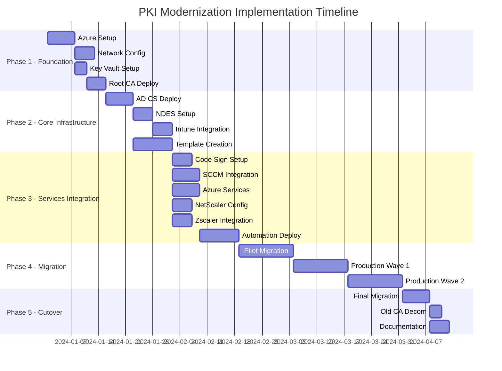

# PKI Modernization - Project Timeline

## Project Timeline Overview

## Implementation Phases Detail

### Phase 1: Foundation (Weeks 1-3)
**Australian Region Focus: Australia East (Sydney)**

- **Azure Infrastructure Setup** (Week 1)
  - Deploy to Australia East (Sydney) primary region
  - Australia Southeast (Melbourne) secondary region
  - Australia Central (Canberra) for compliance workloads

- **Network Configuration** (Week 1-2)
  - Configure ExpressRoute to Sydney data centres
  - Implement Australian data residency requirements
  - Set up AEST/AEDT timezone configurations

- **Key Vault Deployment** (Week 2)
  - Deploy Azure Key Vault in australiaeast region
  - Configure HSM backing with Australian compliance standards
  - Implement APRA CPS 234 compliance controls

### Phase 2: Core Infrastructure (Weeks 4-6)
**Compliance Framework: Australian Government ISM**

- **AD CS Deployment** (Week 4)
  - Windows Server 2022 deployment in Australian regions
  - Configure for Australian Government Information Security Manual (ISM) compliance
  - Implement Essential Eight security controls

- **NDES Configuration** (Week 5)
  - SCEP enrollment for mobile devices
  - Integration with Microsoft Intune (Australian tenant)
  - Configure Australian date formats (DD/MM/YYYY)

### Phase 3: Services Integration (Weeks 7-9)
**Australian Security Standards Integration**

- **Security Appliance Configuration** (Week 7)
  - NetScaler deployment with Australian timezone settings
  - Zscaler integration for Australian cloud gateways
  - F5 BIG-IP configuration for local data centres

- **Compliance Integration** (Week 8-9)
  - APRA CPS 234 operational resilience requirements
  - Privacy Act 1988 compliance for certificate data
  - Notifiable Data Breaches scheme alignment

### Phase 4: Migration (Weeks 10-16)
**Australian Business Hours Deployment**

- **Pilot Migration** (Weeks 10-12)
  - Deploy during Australian business hours (9 AM - 5 PM AEST/AEDT)
  - Test with Australian financial institutions
  - Validate APRA compliance controls

- **Production Waves** (Weeks 13-16)
  - Wave 1: Critical Australian services
  - Wave 2: Regional and subsidiary systems
  - 24/7 support during AEST/AEDT business hours

### Phase 5: Cutover and Documentation (Weeks 17-18)
**Australian Regulatory Compliance**

- **Final Migration** (Week 17)
  - Complete transition to new PKI
  - Decommission legacy systems
  - Validate Essential Eight compliance

- **Documentation and Training** (Week 18)
  - Australian-specific operational procedures
  - Timezone-adjusted monitoring schedules
  - Regulatory reporting templates for APRA/ASIC

## Key Milestones

| Milestone | Target Date | Australian Compliance Checkpoint |
|-----------|-------------|-----------------------------------|
| Azure Foundation Complete | Week 3 | Data sovereignty validation |
| Core PKI Operational | Week 6 | ISM alignment verification |
| Security Integration Complete | Week 9 | APRA CPS 234 compliance |
| Pilot Migration Success | Week 12 | Essential Eight validation |
| Production Cutover | Week 17 | Full regulatory compliance |

## Risk Management - Australian Context

### Regulatory Risks
- **APRA CPS 234 Compliance**: Operational resilience requirements
- **Privacy Act 1988**: Personal information protection in certificates
- **Essential Eight**: Cyber security framework alignment

### Operational Risks
- **Timezone Challenges**: Coordination between AEST/AEDT and global teams
- **Data Residency**: Ensuring certificate data remains within Australian borders
- **Business Continuity**: Maintaining 99.99% uptime for critical financial services

## Success Criteria

1. **100% Australian Data Residency** - All certificate data stored within Australia
2. **APRA CPS 234 Compliance** - Full operational resilience framework implementation
3. **Essential Eight Alignment** - All eight mitigation strategies implemented
4. **99.99% Uptime** - Service availability during Australian business hours
5. **Zero Data Breaches** - No incidents requiring notification under Privacy Act 1988

## Resource Requirements - Australian Team

### Core Team (Based in Sydney/Melbourne)
- **Project Manager** (PMP certified, Australian security clearance)
- **PKI Architect** (CISSP, Australian Government experience)
- **Network Security Engineer** (CCNP Security, local data centre experience)
- **Compliance Specialist** (APRA/ASIC experience)
- **DevOps Engineer** (Azure certified, Australian regions expertise)

### Extended Team Support
- **24/7 Operations Centre** (Melbourne-based)
- **Business Stakeholders** (All major Australian cities)
- **Vendor Partners** (Local Microsoft, Zscaler, NetScaler support)

This timeline ensures compliance with Australian regulations while maintaining operational excellence and security standards appropriate for the Australian financial services sector.