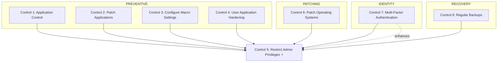
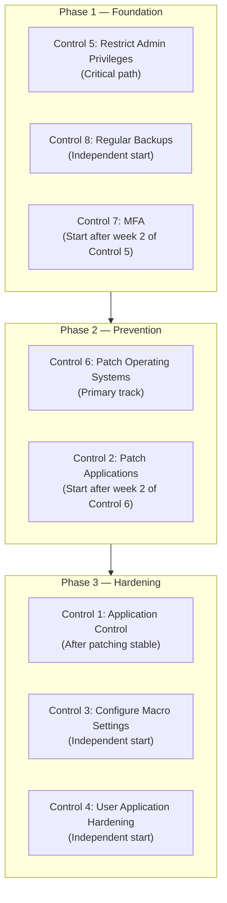

# Essential Eight Cross-Reference Matrix

**Source**: [ACSC Essential Eight](https://www.cyber.gov.au/resources-business-and-government/essential-cyber-security/essential-eight)

---

## Overview

The eight mitigation strategies of the Essential Eight are interdependent. Several controls cannot be effectively implemented or sustained without others being in place first. This reference document maps those dependencies — hard dependencies, soft dependencies, mutual enhancements, and sequential ordering — to support implementation planning and maturity progression decisions.

For technology-specific mappings (Microsoft products, licensing, infrastructure), see [reference-control-technology-mapping.md](../../compliance/essential-eight-alignment/reference-control-technology-mapping.md).

---

## Dependency Type Definitions

| Type | Definition | Planning Implication |
|------|-----------|---------------------|
| **Hard dependency** | The dependent control requires the prerequisite to function correctly. | Implement the prerequisite first. |
| **Soft dependency** | The dependent control is enhanced by the prerequisite but can operate without it. | Can be implemented in parallel; benefits from sequencing. |
| **Mutual enhancement** | Both controls reinforce each other bidirectionally. | Implement together where possible for compounded benefit. |
| **Sequential** | Natural implementation order exists due to shared infrastructure or logical progression. | Follow sequence for efficiency and reduced rework. |

### Notation

- `A → B` — B has a hard dependency on A (B depends on A)
- `A ↔ B` — Mutual enhancement (bidirectional benefit)
- `⚡` — Critical path item; blocking multiple other controls
- `ML1 / ML2 / ML3` — Dependency applies at a specific maturity level

---

## Control Dependency Overview

### High-Level Dependency Map

### Control Interdependency Summary

| Control | Hard Dependencies | Soft Dependencies | Enhances |
|---------|-------------------|-------------------|----------|
| **1. Application Control** | Control 5 | Controls 2, 6 | Control 4; all controls (reduced attack surface) |
| **2. Patch Applications** | Control 5 | Controls 1, 6 | All controls |
| **3. Configure Macro Settings** | Control 5 | Controls 1, 4 | Control 4 |
| **4. User Application Hardening** | Control 5 | Controls 1, 2, 3 | Control 3 |
| **5. Restrict Admin Privileges** ⚡ | None (foundation) | Control 7 | All controls |
| **6. Patch Operating Systems** | Control 5 | Controls 2, 8 | All controls |
| **7. Multi-Factor Authentication** | Control 5 | All controls | Control 5; all controls |
| **8. Regular Backups** | Control 5 | All controls | All controls (recovery capability) |

---

## Implementation Sequence Recommendations

### Standard Sequence

#### Phase 1 — Foundation (Weeks 1–4)

| Order | Control | Rationale | Indicative Duration |
|-------|---------|-----------|---------------------|
| 1 | **5. Restrict Admin Privileges** ⚡ | Foundational control. Enables all others. Blocks most privilege escalation attack paths immediately. | 2–4 weeks |
| 2 | **8. Regular Backups** | Provides a recovery safety net before other controls are configured. Independent of most other controls. | 1–2 weeks |
| 3 | **7. Multi-Factor Authentication** | Protects the privileged accounts established in Control 5. Relatively quick to deploy. | 1–2 weeks |

#### Phase 2 — Prevention Layer (Weeks 5–12)

| Order | Control | Rationale | Indicative Duration |
|-------|---------|-----------|---------------------|
| 4 | **6. Patch Operating Systems** | Provides the stable OS foundation required by application-layer controls. | 2–4 weeks |
| 5 | **2. Patch Applications** | Builds on the patching infrastructure and scheduling established for Control 6. | 2–4 weeks |
| 6 | **1. Application Control** | Requires a stable, patched application base to define an accurate allow list. | 3–6 weeks |

#### Phase 3 — Application Hardening (Weeks 13–16)

| Order | Control | Rationale | Indicative Duration |
|-------|---------|-----------|---------------------|
| 7 | **3. Configure Macro Settings** | Targeted hardening. More contained scope than Control 4. | 1–2 weeks |
| 8 | **4. User Application Hardening** | Broad browser and application hardening. Requires extensive compatibility testing. Benefits from Control 1 being in place. | 2–4 weeks |

### Parallel Implementation Option

Where organisational capacity permits, some controls within a phase can run concurrently.

### Risk-Based Priority Option

Organisations responding to active threats may deprioritise sequencing efficiency in favour of immediate risk reduction.

| Priority | Control | Threat Addressed |
|----------|---------|-----------------|
| 1 | **7. Multi-Factor Authentication** | Immediate credential theft protection |
| 2 | **5. Restrict Admin Privileges** | Limits lateral movement post-compromise |
| 3 | **1. Application Control** | Blocks malware execution |
| 4 | **4. User Application Hardening** | Blocks browser-based initial access |
| 5 | **2. Patch Applications** | Closes application vulnerability exploitation |
| 6 | **3. Configure Macro Settings** | Blocks macro-based malware delivery |
| 7 | **6. Patch Operating Systems** | Reduces OS-level vulnerability exposure |
| 8 | **8. Regular Backups** | Enables ransomware recovery |

---

## Control-to-Control Dependencies

### Control 1: Application Control

**Hard dependencies**

| Prerequisite | Reason | Impact if absent |
|-------------|--------|-----------------|
| Control 5: Restrict Admin Privileges | Application control policies must be managed only by privileged accounts. | Users can disable or bypass the control. |
| Stable application inventory | The allow list requires knowledge of authorised applications. | Excessive false positives; business disruption. |

**Soft dependencies (enhances Control 1)**

| Control | Benefit |
|---------|---------|
| Control 2: Patch Applications | Reduces exceptions required for vulnerable legacy versions. |
| Control 6: Patch OS | Ensures application control mechanisms themselves are current. |

**Enhances**

- Control 4: User Application Hardening — prevents installation of non-hardened applications.
- All controls — reduces the attack surface available to adversaries.

---

### Control 2: Patch Applications

**Hard dependencies**

| Prerequisite | Reason | Impact if absent |
|-------------|--------|-----------------|
| Control 5: Restrict Admin Privileges | Patch deployment requires administrative rights. | Users can block patching or install unapproved updates. |
| Asset inventory | Patching requires knowledge of what applications exist. | Incomplete patching coverage. |

**Soft dependencies (enhances Control 2)**

| Control | Benefit |
|---------|---------|
| Control 1: Application Control | Prevents execution of unpatchable legacy applications. |
| Control 6: Patch OS | Shared patching infrastructure and scheduling. |

**Enhances**

- All controls — reduces exploitable vulnerabilities across the environment.

---

### Control 3: Configure Macro Settings

**Hard dependencies**

| Prerequisite | Reason | Impact if absent |
|-------------|--------|-----------------|
| Control 5: Restrict Admin Privileges | Macro policies must be managed only by privileged accounts. | Users can modify macro settings to permit untrusted macros. |

**Soft dependencies (enhances Control 3)**

| Control | Benefit |
|---------|---------|
| Control 1: Application Control | Can block execution of malicious Office files entirely. |
| Control 4: User Application Hardening | Provides additional browser-based protection against delivery vectors. |

**Enhances**

- Control 4: User Application Hardening — forms part of the overall application hardening strategy.

---

### Control 4: User Application Hardening

**Hard dependencies**

| Prerequisite | Reason | Impact if absent |
|-------------|--------|-----------------|
| Control 5: Restrict Admin Privileges | Hardening policies must be managed only by privileged accounts. | Users can disable security features. |

**Soft dependencies (enhances Control 4)**

| Control | Benefit |
|---------|---------|
| Control 1: Application Control | Prevents installation of non-hardened browser versions. |
| Control 2: Patch Applications | Ensures browsers are current with security patches. |
| Control 3: Configure Macro Settings | Provides layered protection against Office-based attack chains. |

**Enhances**

- Control 3: Configure Macro Settings — both constitute application-layer hardening; they reinforce each other.

---

### Control 5: Restrict Admin Privileges ⚡

**Hard dependencies**

| Prerequisite | Reason | Impact if absent |
|-------------|--------|-----------------|
| None | This is the foundational control. | N/A |

**Soft dependencies (enhances Control 5)**

| Control | Benefit |
|---------|---------|
| Control 7: Multi-Factor Authentication | Protects privileged accounts from credential compromise. |

**Enhances**

- All other controls — enables secure configuration of each and prevents bypass through privilege escalation.

---

### Control 6: Patch Operating Systems

**Hard dependencies**

| Prerequisite | Reason | Impact if absent |
|-------------|--------|-----------------|
| Control 5: Restrict Admin Privileges | OS patching requires administrative rights. | Users can block or interfere with OS updates. |
| Asset inventory | Patching requires knowledge of what systems exist. | Incomplete patching coverage. |

**Soft dependencies (enhances Control 6)**

| Control | Benefit |
|---------|---------|
| Control 2: Patch Applications | Shared infrastructure and scheduling reduces duplication. |
| Control 8: Regular Backups | Enables rollback when patches cause instability. |

**Enhances**

- All controls — provides a stable and secure OS foundation for all other mechanisms.

---

### Control 7: Multi-Factor Authentication

**Hard dependencies**

| Prerequisite | Reason | Impact if absent |
|-------------|--------|-----------------|
| Control 5: Restrict Admin Privileges | MFA primarily protects privileged accounts; without defined privileged roles, scope is unclear. | Limited and inconsistently scoped benefit. |
| Identity provider | MFA requires authentication infrastructure. | Cannot implement MFA. |

**Soft dependencies (enhances Control 7)**

| Control | Benefit |
|---------|---------|
| All other controls | All controls benefit from authenticated access being protected. |

**Enhances**

- Control 5: Restrict Admin Privileges — protects privileged accounts from credential compromise.
- All controls — prevents unauthorised access to management interfaces.

---

### Control 8: Regular Backups

**Hard dependencies**

| Prerequisite | Reason | Impact if absent |
|-------------|--------|-----------------|
| Control 5: Restrict Admin Privileges | Backup configurations must be protected from tampering. | Adversaries can disable or corrupt backup schedules. |
| Storage infrastructure | Requires a destination for backup data. | Cannot perform backups. |

**Soft dependencies (enhances Control 8)**

| Control | Benefit |
|---------|---------|
| All other controls | All controls reduce the probability that backup restoration will be required. |

**Enhances**

- All controls — provides a recovery mechanism when other controls fail or are bypassed.

---

## Requirement-Level Dependencies

### Maturity Level 1

Most ML1 requirements are independent. Implementations at this level can generally proceed without cross-control sequencing constraints.

**Shared infrastructure at ML1**

| Control | ML1 Requirement | Shares Infrastructure With | Benefit |
|---------|----------------|---------------------------|---------|
| Control 1 | Application control on workstations | Control 4 (same policy mechanisms) | Shared deployment infrastructure |
| Control 2 | Application patching | Control 6 (same patching platform) | Shared patching schedules |
| Control 3 | Macro settings via policy | Control 4 (same policy deployment) | Consistent policy management |

---

### Maturity Level 2

ML2 introduces stricter timeframes and broader scope, creating genuine cross-control dependencies.

| Control | ML2 Requirement | Dependencies | Reason |
|---------|----------------|--------------|--------|
| Control 1 | Validate allowed executables against application control list | Control 5 (mature privileged access management) | List management requires strict access control. |
| Control 2 | Patches applied within 2 weeks | Control 6 ML2 (OS patching mature) | Application patching depends on a stable OS baseline. |
| Control 7 | MFA for internet-facing services | Controls 2 and 6 (patched systems) | MFA services must themselves be patched and secure. |

**Prerequisites for ML2 across all controls**

1. Automated patching infrastructure — required for Controls 2 and 6 (2-week patching window).
2. Application inventory management — required for Control 1 (allow list validation).
3. Privileged access management capability — required for Control 5 (just-in-time access).
4. Expanded MFA deployment — required for Control 7 (internet-facing services scope).

---

### Maturity Level 3

ML3 introduces advanced capability requirements with critical cross-control dependencies.

| Control | ML3 Requirement | Critical Dependencies | Reason |
|---------|----------------|----------------------|--------|
| Control 1 | Application control using anti-malware or EDR | Control 6 ML3 (modern OS) | Advanced features require a supported OS version. |
| Control 2 | Patches applied within 48 hours | Control 2 ML2 (automated patching mature) | Accelerated windows cannot be met without existing automation. |
| Control 3 | Macros only from Trusted Locations with AV scanning | Controls 2 and 6 (fully patched) | Macro AV scanning requires current signatures and a patched runtime. |
| Control 5 | Privileged access management solution | Control 7 (MFA deployed) | PAM solutions require MFA for privileged access sessions. |
| Control 7 | Phishing-resistant MFA | Controls 2 and 6 (fully patched for platform support) | Modern phishing-resistant MFA requires a supported OS and browser version. |

**Prerequisites for ML3 across all controls**

1. Enterprise PAM solution — Control 5.
2. EDR platform — Control 1.
3. Advanced patching automation — Controls 2 and 6.
4. Phishing-resistant MFA infrastructure — Control 7.
5. Macro antivirus scanning capability — Control 3.

---

## Maturity Level Transition Dependencies

### ML1 to ML2 Transition

| Control | ML1 Baseline | ML2 Addition | Dependency Impact |
|---------|-------------|--------------|-------------------|
| Control 1 | Block rules applied | Validate allowed applications | Requires application inventory management process. |
| Control 2 | Patches within 1 month | Patches within 2 weeks | Requires automated patching capability. |
| Control 3 | Block macros from internet | No change | No new dependency introduced. |
| Control 4 | Block ads | Block Flash and Java applets additionally | Requires policy updates. |
| Control 5 | Restrict admin rights | Add just-in-time admin access | Requires PAM solution or equivalent. |
| Control 6 | Patches within 1 month | Patches within 2 weeks | Requires automated patching capability. |
| Control 7 | MFA for privileged users | MFA for internet-facing services | Expands MFA scope to broader service coverage. |
| Control 8 | Backups, test quarterly | No change | No new dependency introduced. |

### ML2 to ML3 Transition

| Control | ML2 Baseline | ML3 Addition | Dependency Impact |
|---------|-------------|--------------|-------------------|
| Control 1 | Validate allowed applications | Use EDR or anti-malware integration | Requires EDR platform. |
| Control 2 | Patches within 2 weeks | Patches within 48 hours | Requires advanced automation maturity. |
| Control 3 | Block macros from internet | Only Trusted Locations + AV scanning | Requires macro antivirus configuration. |
| Control 4 | Block Flash and Java | Enhanced web protection | May require web gateway capability. |
| Control 5 | Just-in-time access | Enterprise PAM solution | Requires mature PAM deployment. |
| Control 6 | Patches within 2 weeks | Patches within 48 hours | Requires advanced automation maturity. |
| Control 7 | MFA for services | Phishing-resistant MFA | Requires phishing-resistant MFA infrastructure. |
| Control 8 | Test quarterly | Test quarterly with retention management | Requires backup lifecycle management. |

---

## Quick Reference: Critical Dependencies

### Foundation — Must Implement First

| Control | Enables | Requires |
|---------|---------|---------|
| **5. Restrict Admin Privileges** ⚡ | All other controls | Nothing (foundation control) |

### Phase 1 — Weeks 1–4

| Control | Enables | Requires |
|---------|---------|---------|
| **8. Regular Backups** | Recovery capability | Control 5 |
| **7. Multi-Factor Authentication** | Secure privileged access | Control 5; identity provider |

### Phase 2 — Weeks 5–12

| Control | Enables | Requires |
|---------|---------|---------|
| **6. Patch Operating Systems** | Stable platform for other controls | Control 5 |
| **2. Patch Applications** | Reduced vulnerability surface | Control 5; Control 6 (soft) |
| **1. Application Control** | Prevention of unauthorised code execution | Control 5; stable application inventory |

### Phase 3 — Weeks 13–16

| Control | Enables | Requires |
|---------|---------|---------|
| **3. Configure Macro Settings** | Protection from macro-based attacks | Control 5 |
| **4. User Application Hardening** | Browser and application attack surface reduction | Control 5 |

---

## Related Resources

### ACSC Essential Eight

- [ACSC Essential Eight Overview](https://www.cyber.gov.au/resources-business-and-government/essential-cyber-security/essential-eight)
- [ACSC Essential Eight Maturity Model](https://www.cyber.gov.au/resources-business-and-government/essential-cyber-security/essential-eight/essential-eight-maturity-model)
- [ACSC Essential Eight Maturity Model and ISM Mapping](https://www.cyber.gov.au/business-government/asds-cyber-security-frameworks/essential-eight/essential-eight-maturity-model-and-ism-mapping)
- [ACSC Essential Eight Maturity Model Changes](https://www.cyber.gov.au/business-government/asds-cyber-security-frameworks/essential-eight/essential-eight-maturity-model-changes)

### Sibling Documents

- [reference-maturity-model.md](reference-maturity-model.md) — Maturity level definitions and per-strategy requirements
- [reference-glossary.md](reference-glossary.md) — Term definitions
- [how-to-implement-e8-controls.md](how-to-implement-e8-controls.md) — Implementation guidance

### Compliance Track

- [reference-control-technology-mapping.md](../../compliance/essential-eight-alignment/reference-control-technology-mapping.md) — Technology mapping for Essential Eight controls (Microsoft product coverage, licensing, infrastructure prerequisites)
